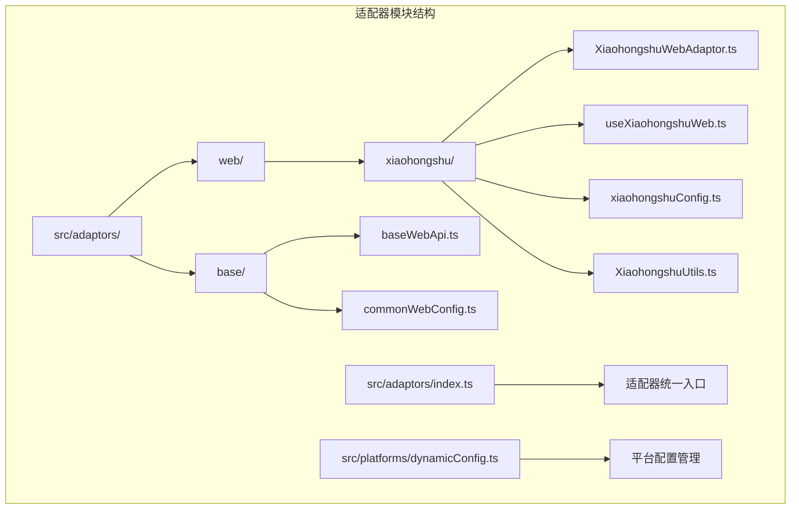
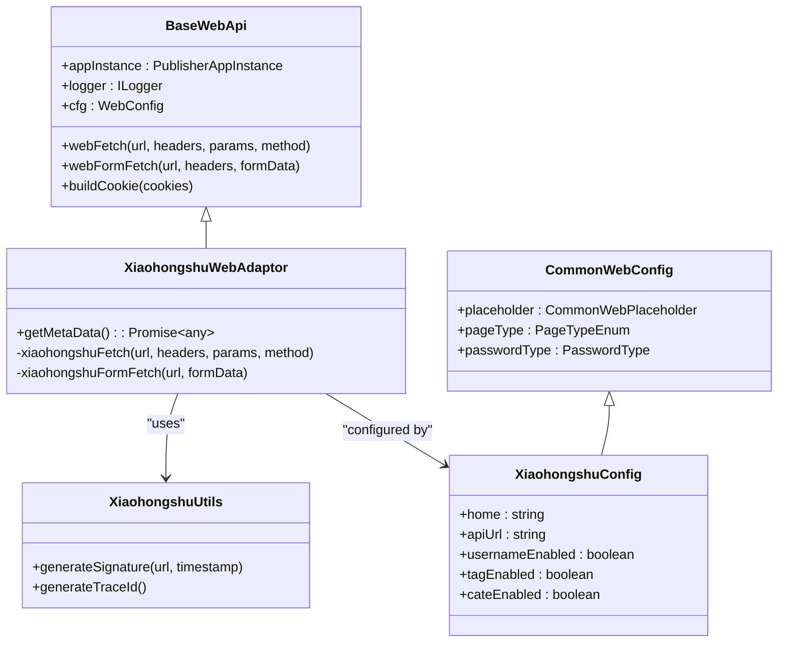
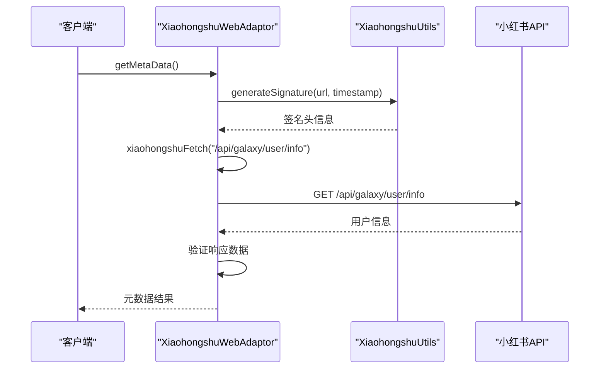
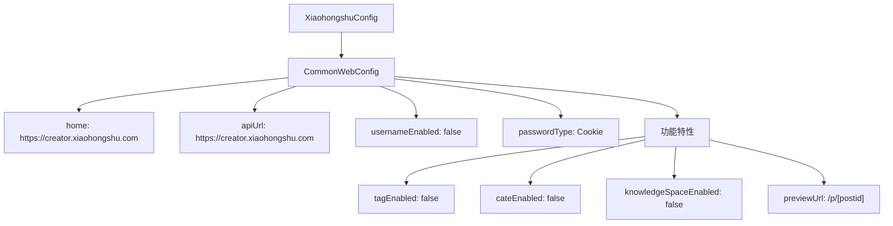
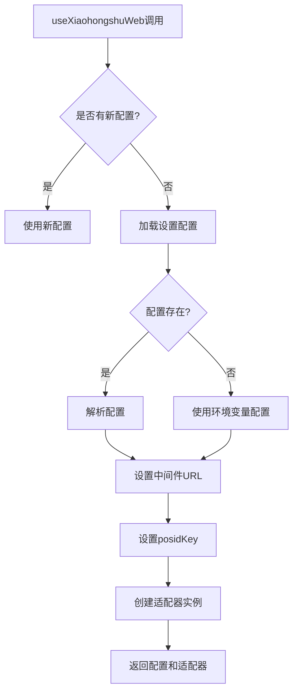
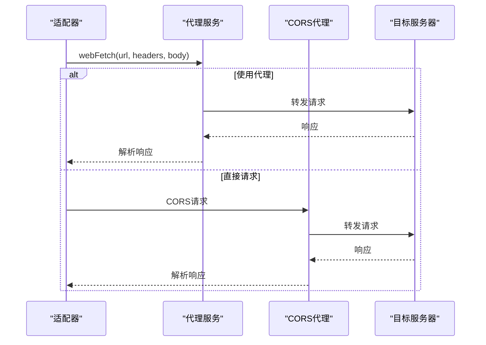
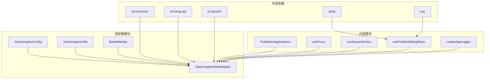

# 小红书Web适配器

<cite>
**本文档引用的文件**
- [XiaohongshuWebAdaptor.ts](file://src/adaptors/web/xiaohongshu/XiaohongshuWebAdaptor.ts)
- [useXiaohongshuWeb.ts](file://src/adaptors/web/xiaohongshu/useXiaohongshuWeb.ts)
- [xiaohongshuConfig.ts](file://src/adaptors/web/xiaohongshu/xiaohongshuConfig.ts)
- [XiaohongshuUtils.ts](file://src/adaptors/web/xiaohongshu/XiaohongshuUtils.ts)
- [adaptors/index.ts](file://src/adaptors/index.ts)
- [baseWebApi.ts](file://src/adaptors/web/base/baseWebApi.ts)
- [commonWebConfig.ts](file://src/adaptors/web/base/commonWebConfig.ts)
- [dynamicConfig.ts](file://src/platforms/dynamicConfig.ts)
- [constants.ts](file://src/utils/constants.ts)
- [usePublishSettingStore.ts](file://src/stores/usePublishSettingStore.ts)
- [xiaohongshu-signature-research.md](file://TODO/xiaohongshu-signature-research.md)
</cite>

## 目录
1. [简介](#简介)
2. [项目结构](#项目结构)
3. [核心组件](#核心组件)
4. [架构概览](#架构概览)
5. [详细组件分析](#详细组件分析)
6. [依赖关系分析](#依赖关系分析)
7. [性能考虑](#性能考虑)
8. [故障排除指南](#故障排除指南)
9. [结论](#结论)

## 简介

小红书Web适配器是SiYuan发布器插件中的一个专门模块，用于与小红书创作者平台进行交互。该适配器实现了基于Cookie的网页授权机制，允许用户通过保存的小红书登录Cookie来发布内容到小红书平台。

**重要说明**：根据代码注释，小红书的签名机制非常复杂，目前版本处于"暂停开发"状态，需要进一步研究签名算法才能实现完整的自动发布功能。

## 项目结构

小红书Web适配器位于项目的适配器模块中，采用标准的模块化架构设计：

**图表来源**
- [XiaohongshuWebAdaptor.ts:1-133](file://src/adaptors/web/xiaohongshu/XiaohongshuWebAdaptor.ts#L1-L133)
- [adaptors/index.ts:1-573](file://src/adaptors/index.ts#L1-L573)

**章节来源**
- [XiaohongshuWebAdaptor.ts:1-133](file://src/adaptors/web/xiaohongshu/XiaohongshuWebAdaptor.ts#L1-L133)
- [adaptors/index.ts:1-573](file://src/adaptors/index.ts#L1-L573)

## 核心组件

小红书Web适配器包含以下核心组件：

### 主要组件
1. **XiaohongshuWebAdaptor** - 主要适配器类，继承自BaseWebApi
2. **XiaohongshuConfig** - 配置类，扩展CommonWebConfig
3. **XiaohongshuUtils** - 工具类，提供签名生成等功能
4. **useXiaohongshuWeb** - 自定义Hook，用于获取适配器实例

### 辅助组件
1. **BaseWebApi** - 网页授权基类，提供通用的HTTP请求功能
2. **CommonWebConfig** - 通用Web配置基类
3. **动态配置管理** - 平台类型和配置管理

**章节来源**
- [XiaohongshuWebAdaptor.ts:22-133](file://src/adaptors/web/xiaohongshu/XiaohongshuWebAdaptor.ts#L22-L133)
- [xiaohongshuConfig.ts:16-34](file://src/adaptors/web/xiaohongshu/xiaohongshuConfig.ts#L16-L34)
- [XiaohongshuUtils.ts:18-52](file://src/adaptors/web/xiaohongshu/XiaohongshuUtils.ts#L18-L52)

## 架构概览

小红书Web适配器采用分层架构设计，具有清晰的职责分离：

**图表来源**
- [baseWebApi.ts:36-256](file://src/adaptors/web/base/baseWebApi.ts#L36-L256)
- [XiaohongshuWebAdaptor.ts:22-133](file://src/adaptors/web/xiaohongshu/XiaohongshuWebAdaptor.ts#L22-L133)
- [xiaohongshuConfig.ts:16-34](file://src/adaptors/web/xiaohongshu/xiaohongshuConfig.ts#L16-L34)
- [XiaohongshuUtils.ts:18-52](file://src/adaptors/web/xiaohongshu/XiaohongshuUtils.ts#L18-L52)
- [commonWebConfig.ts:16-45](file://src/adaptors/web/base/commonWebConfig.ts#L16-L45)

## 详细组件分析

### XiaohongshuWebAdaptor 主适配器

XiaohongshuWebAdaptor是小红书适配器的核心类，负责处理与小红书API的所有交互。

#### 主要功能

1. **元数据获取** - 通过`getMetaData()`方法验证用户登录状态
2. **签名处理** - 生成必要的请求头信息
3. **HTTP请求** - 提供封装的HTTP请求方法

#### 关键实现细节

**图表来源**
- [XiaohongshuWebAdaptor.ts:23-65](file://src/adaptors/web/xiaohongshu/XiaohongshuWebAdaptor.ts#L23-L65)
- [XiaohongshuUtils.ts:27-37](file://src/adaptors/web/xiaohongshu/XiaohongshuUtils.ts#L27-L37)

#### 签名机制分析

当前实现采用简化的签名机制：

| 头部名称 | 生成方式 | 示例值 |
|---------|---------|--------|
| `x-t` | 当前时间戳 | `1743411014000` |
| `x-b3-traceid` | 随机字符串拼接 | `a1b2c3d4e5f6...` |
| `x-xray-traceid` | 随机字符串拼接 | `f6e5d4c3b2a1...` |
| `x-s` | **待实现** | `XYS_eyJzaWduU3Ry...` |
| `x-s-common` | **待实现** | `XZqakGJhbGci...` |

**章节来源**
- [XiaohongshuWebAdaptor.ts:22-133](file://src/adaptors/web/xiaohongshu/XiaohongshuWebAdaptor.ts#L22-L133)
- [XiaohongshuUtils.ts:18-52](file://src/adaptors/web/xiaohongshu/XiaohongshuUtils.ts#L18-L52)

### XiaohongshuConfig 配置类

配置类继承自CommonWebConfig，专门为小红书平台定制配置参数。

#### 配置特性

**图表来源**
- [xiaohongshuConfig.ts:16-31](file://src/adaptors/web/xiaohongshu/xiaohongshuConfig.ts#L16-L31)

#### 支持的功能特性

- **Markdown支持** - 支持Markdown格式内容发布
- **Cookie认证** - 使用Cookie进行身份验证
- **无标签支持** - 不支持标签功能
- **无分类支持** - 不支持分类功能
- **无知识空间** - 不支持知识空间概念

**章节来源**
- [xiaohongshuConfig.ts:16-34](file://src/adaptors/web/xiaohongshu/xiaohongshuConfig.ts#L16-L34)

### useXiaohongshuWeb 自定义Hook

自定义Hook提供了便捷的方式来获取和配置小红书适配器实例。

#### 初始化流程

**图表来源**
- [useXiaohongshuWeb.ts:26-72](file://src/adaptors/web/xiaohongshu/useXiaohongshuWeb.ts#L26-L72)

#### 配置优先级

1. **显式配置** - 通过参数传递的配置
2. **设置配置** - 从用户设置中加载的配置
3. **环境变量** - 从环境变量中获取的默认配置

**章节来源**
- [useXiaohongshuWeb.ts:26-75](file://src/adaptors/web/xiaohongshu/useXiaohongshuWeb.ts#L26-L75)

### BaseWebApi 基础类

BaseWebApi提供了所有Web适配器的基础功能，包括HTTP请求处理、Cookie管理等。

#### HTTP请求处理

**图表来源**
- [baseWebApi.ts:150-248](file://src/adaptors/web/base/baseWebApi.ts#L150-L248)

#### Cookie处理机制

适配器支持多种Cookie处理方式：

1. **ElectronCookie转换** - 将Cookie对象转换为字符串格式
2. **表单数据处理** - 支持multipart/form-data格式的文件上传
3. **Base64编码** - 对请求体进行Base64编码处理

**章节来源**
- [baseWebApi.ts:86-135](file://src/adaptors/web/base/baseWebApi.ts#L86-L135)
- [baseWebApi.ts:209-248](file://src/adaptors/web/base/baseWebApi.ts#L209-L248)

## 依赖关系分析

小红书Web适配器的依赖关系体现了清晰的模块化设计：

**图表来源**
- [XiaohongshuWebAdaptor.ts:10-13](file://src/adaptors/web/xiaohongshu/XiaohongshuWebAdaptor.ts#L10-L13)
- [useXiaohongshuWeb.ts:10-19](file://src/adaptors/web/xiaohongshu/useXiaohongshuWeb.ts#L10-L19)

### 关键依赖说明

1. **zhi-common** - 提供字符串处理、对象操作等通用工具
2. **zhi-blog-api** - 提供博客API接口定义和基础类型
3. **js-base64** - 提供Base64编码解码功能
4. **pinia** - 状态管理库，用于配置存储
5. **vue** - 响应式框架，用于组件开发

**章节来源**
- [XiaohongshuWebAdaptor.ts:10-13](file://src/adaptors/web/xiaohongshu/XiaohongshuWebAdaptor.ts#L10-L13)
- [useXiaohongshuWeb.ts:10-19](file://src/adaptors/web/xiaohongshu/useXiaohongshuWeb.ts#L10-L19)

## 性能考虑

### 签名生成优化

当前的签名生成机制相对简单，主要考虑以下优化方向：

1. **缓存机制** - 缓存生成的签名头，减少重复计算
2. **异步处理** - 在后台线程中处理签名生成
3. **批量请求** - 合并多个请求的签名处理

### 请求处理优化

1. **连接复用** - 复用HTTP连接，减少握手开销
2. **压缩传输** - 启用GZIP压缩减少传输数据量
3. **错误重试** - 实现智能重试机制处理网络异常

## 故障排除指南

### 常见问题及解决方案

#### 1. Cookie失效问题

**症状**：API请求返回"登录已过期"

**解决方案**：
- 重新登录小红书账号
- 更新保存的Cookie信息
- 检查Cookie的有效期

#### 2. 签名验证失败

**症状**：API返回签名错误或403状态码

**解决方案**：
- 检查签名生成逻辑
- 验证时间戳同步
- 确认请求头完整性

#### 3. 跨域请求问题

**症状**：浏览器控制台出现CORS错误

**解决方案**：
- 配置正确的代理服务器
- 检查CORS头设置
- 验证域名白名单

**章节来源**
- [xiaohongshu-signature-research.md:87-149](file://TODO/xiaohongshu-signature-research.md#L87-L149)

### 日志调试

适配器提供了完整的日志记录机制，可以通过以下方式查看调试信息：

1. **元数据获取日志** - 记录用户验证过程
2. **请求处理日志** - 记录HTTP请求详情
3. **错误处理日志** - 记录异常和错误信息

## 结论

小红书Web适配器是一个功能完整但仍在开发中的模块。虽然当前版本由于复杂的签名机制而暂停开发，但其架构设计体现了良好的模块化原则和扩展性。

### 当前状态总结

1. **已完成功能**：
   - 基础的Cookie认证机制
   - 元数据获取和验证
   - HTTP请求封装处理
   - 配置管理系统

2. **待完成功能**：
   - 完整的签名算法实现
   - 动态脚本加载机制
   - 设备指纹处理
   - 更完善的错误处理

### 技术挑战

1. **签名机制复杂性** - 需要逆向分析小红书的JavaScript签名逻辑
2. **动态脚本加载** - 签名脚本需要特定的触发条件才能加载
3. **反爬虫机制** - 需要应对小红书的多层次防护措施
4. **设备指纹检测** - 需要模拟真实的用户环境

### 发展方向

1. **短期目标** - 实现基本的Cookie认证功能
2. **中期目标** - 破解签名机制，实现完整的自动发布
3. **长期目标** - 探索官方API的可能性

小红书Web适配器代表了现代Web适配器开发的复杂性和挑战性，为类似平台的集成提供了宝贵的经验和技术积累。