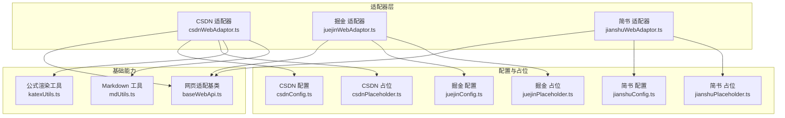
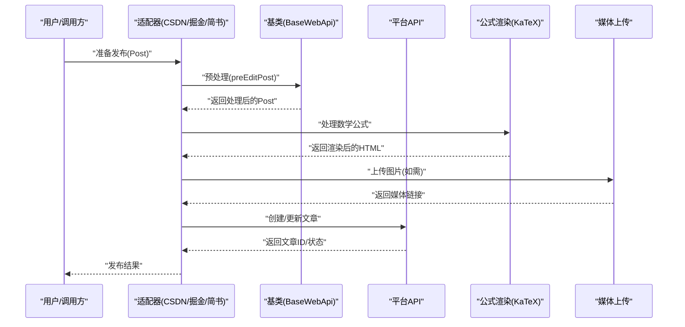
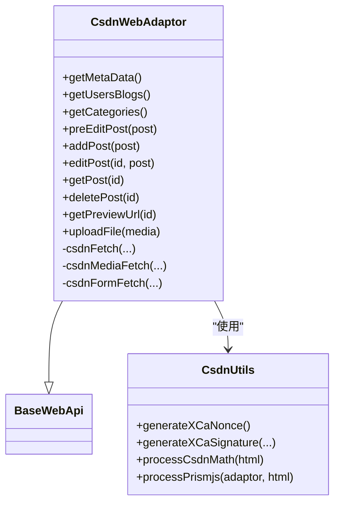
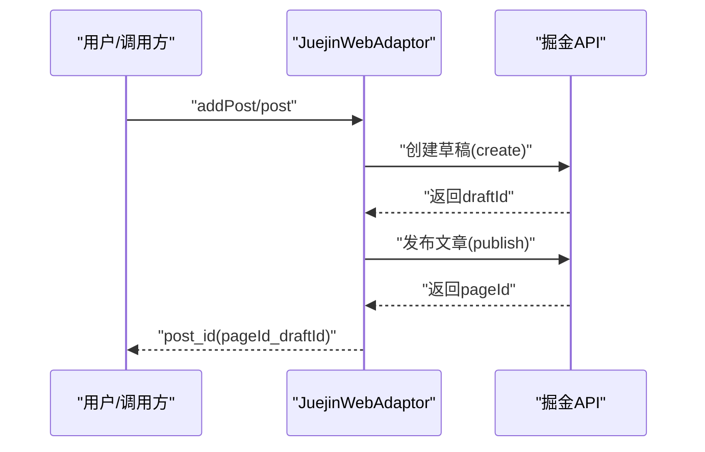
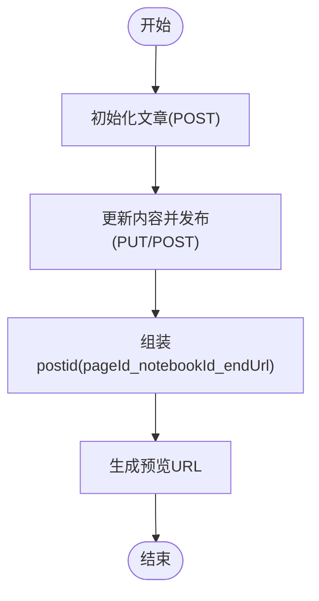
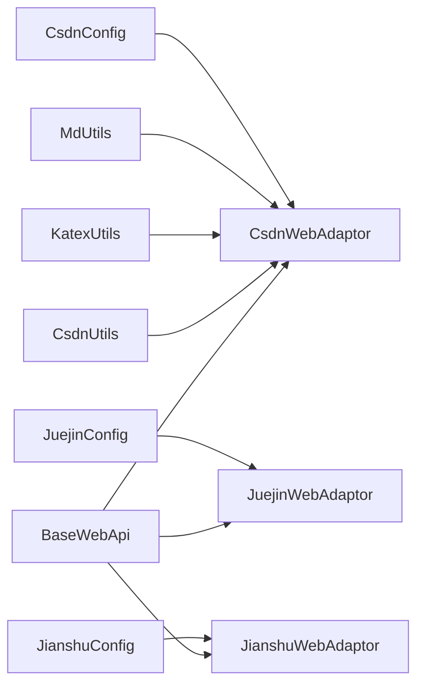

# 技术社区平台

<cite>
**本文引用的文件**   
- [csdnWebAdaptor.ts](file://src/adaptors/web/csdn/csdnWebAdaptor.ts)
- [csdnUtils.ts](file://src/adaptors/web/csdn/csdnUtils.ts)
- [csdnConfig.ts](file://src/adaptors/web/csdn/csdnConfig.ts)
- [csdnPlaceholder.ts](file://src/adaptors/web/csdn/csdnPlaceholder.ts)
- [juejinWebAdaptor.ts](file://src/adaptors/web/juejin/juejinWebAdaptor.ts)
- [juejinConfig.ts](file://src/adaptors/web/juejin/juejinConfig.ts)
- [juejinPlaceholder.ts](file://src/adaptors/web/juejin/juejinPlaceholder.ts)
- [jianshuWebAdaptor.ts](file://src/adaptors/web/jianshu/jianshuWebAdaptor.ts)
- [jianshuConfig.ts](file://src/adaptors/web/jianshu/jianshuConfig.ts)
- [jianshuPlaceholder.ts](file://src/adaptors/web/jianshu/jianshuPlaceholder.ts)
- [baseWebApi.ts](file://src/adaptors/web/base/baseWebApi.ts)
- [katexUtils.ts](file://src/utils/katexUtils.ts)
- [mdUtils.ts](file://src/utils/mdUtils.ts)
- [README_zh_CN.md](file://README_zh_CN.md)
- [发布设置.md](file://docs/发布设置.md)
</cite>

## 目录
1. [简介](#简介)
2. [项目结构](#项目结构)
3. [核心组件](#核心组件)
4. [架构总览](#架构总览)
5. [详细组件分析](#详细组件分析)
6. [依赖关系分析](#依赖关系分析)
7. [性能考量](#性能考量)
8. [故障排查指南](#故障排查指南)
9. [结论](#结论)
10. [附录](#附录)

## 简介
本文件面向技术社区平台适配器，聚焦 CSDN、掘金、简书三大平台的适配实现与使用规范。内容涵盖：
- 技术文章格式要求与发布流程
- 标签系统与分类管理策略
- 阅读量统计机制说明
- Markdown 到 HTML 的转换、代码高亮与公式渲染方案
- SEO 优化策略与平台推荐算法要点

## 项目结构
本项目采用“适配器模式 + 统一基类”的架构设计，各平台通过各自的 Web 适配器对接统一的发布接口，基类负责网络请求、Cookie 管理、媒体对象上传等通用能力。

图示来源
- [csdnWebAdaptor.ts:25-558](file://src/adaptors/web/csdn/csdnWebAdaptor.ts#L25-L558)
- [juejinWebAdaptor.ts:22-369](file://src/adaptors/web/juejin/juejinWebAdaptor.ts#L22-L369)
- [jianshuWebAdaptor.ts:24-336](file://src/adaptors/web/jianshu/jianshuWebAdaptor.ts#L24-L336)
- [baseWebApi.ts:36-256](file://src/adaptors/web/base/baseWebApi.ts#L36-L256)
- [csdnConfig.ts:16-34](file://src/adaptors/web/csdn/csdnConfig.ts#L16-L34)
- [juejinConfig.ts:16-38](file://src/adaptors/web/juejin/juejinConfig.ts#L16-L38)
- [jianshuConfig.ts:16-39](file://src/adaptors/web/jianshu/jianshuConfig.ts#L16-L39)
- [csdnPlaceholder.ts:12-15](file://src/adaptors/web/csdn/csdnPlaceholder.ts#L12-L15)
- [juejinPlaceholder.ts:12-15](file://src/adaptors/web/juejin/juejinPlaceholder.ts#L12-L15)
- [jianshuPlaceholder.ts:12-15](file://src/adaptors/web/jianshu/jianshuPlaceholder.ts#L12-L15)
- [katexUtils.ts:19-34](file://src/utils/katexUtils.ts#L19-L34)
- [mdUtils.ts:17-161](file://src/utils/mdUtils.ts#L17-L161)

章节来源
- [README_zh_CN.md:1-100](file://README_zh_CN.md#L1-L100)
- [发布设置.md:1-9](file://docs/发布设置.md#L1-L9)

## 核心组件
- 网页适配基类：提供统一的网络请求、Cookie 组合、表单上传、媒体对象封装等能力，屏蔽平台差异。
- 平台适配器：基于基类扩展，实现各平台的元数据获取、分类/标签查询、文章增删改查、预览链接生成、图片上传等。
- 工具类：公式渲染（KaTeX）、Markdown 辅助处理（避免误替换代码/公式内的标记）。

章节来源
- [baseWebApi.ts:36-256](file://src/adaptors/web/base/baseWebApi.ts#L36-L256)
- [katexUtils.ts:19-34](file://src/utils/katexUtils.ts#L19-L34)
- [mdUtils.ts:17-161](file://src/utils/mdUtils.ts#L17-L161)

## 架构总览
下图展示了从“文章内容”到“平台发布”的关键流程，以及 CSDN 的公式与代码高亮处理路径。

图示来源
- [csdnWebAdaptor.ts:127-155](file://src/adaptors/web/csdn/csdnWebAdaptor.ts#L127-L155)
- [csdnUtils.ts:114-174](file://src/adaptors/web/csdn/csdnUtils.ts#L114-L174)
- [baseWebApi.ts:94-135](file://src/adaptors/web/base/baseWebApi.ts#L94-L135)

## 详细组件分析

### CSDN 适配器
- 元数据与博客列表：通过业务 API 获取用户信息、专栏列表，映射为平台元数据与分类信息。
- 文章发布：支持 Markdown/HTML，自动处理数学公式渲染；可选启用 PrismJS 代码高亮；提交时包含标题、Markdown 正文、HTML 正文、标签、分类、摘要等字段。
- 图片上传：两套签名直传流程（新版与旧版），支持校验文件扩展名，构造表单并上传至 OSS。
- 预览链接：从 Cookie 中解析用户标识，拼接预览 URL。

图示来源
- [csdnWebAdaptor.ts:25-558](file://src/adaptors/web/csdn/csdnWebAdaptor.ts#L25-L558)
- [csdnUtils.ts:21-178](file://src/adaptors/web/csdn/csdnUtils.ts#L21-L178)
- [baseWebApi.ts:36-256](file://src/adaptors/web/base/baseWebApi.ts#L36-L256)

章节来源
- [csdnWebAdaptor.ts:39-304](file://src/adaptors/web/csdn/csdnWebAdaptor.ts#L39-L304)
- [csdnUtils.ts:114-174](file://src/adaptors/web/csdn/csdnUtils.ts#L114-L174)
- [csdnConfig.ts:16-34](file://src/adaptors/web/csdn/csdnConfig.ts#L16-L34)

### 掘金 适配器
- 元数据与分类：通过平台 API 获取用户信息与分类列表；支持标签列表查询。
- 文章发布：采用“草稿 -> 发布”的两步流程；若未设置摘要或长度不足，按平台要求补齐长度；分类/标签通过 slug 传递。
- 预览链接：从组合的 postid 中拆分 pageId 与 draftId，拼接预览 URL。
- 删除与详情：提供删除与详情查询接口。

图示来源
- [juejinWebAdaptor.ts:74-136](file://src/adaptors/web/juejin/juejinWebAdaptor.ts#L74-L136)
- [juejinWebAdaptor.ts:317-333](file://src/adaptors/web/juejin/juejinWebAdaptor.ts#L317-L333)

章节来源
- [juejinWebAdaptor.ts:23-236](file://src/adaptors/web/juejin/juejinWebAdaptor.ts#L23-L236)
- [juejinConfig.ts:16-38](file://src/adaptors/web/juejin/juejinConfig.ts#L16-L38)

### 简书 适配器
- 元数据与分类：从作者笔记本列表获取分类信息；支持笔记本作为知识空间。
- 文章发布：初始化文章 -> 更新内容并发布；支持版本号递增以保证更新有效；删除采用软删除接口。
- 图片上传：通过平台提供的上传令牌接口获取 token 与 key，构造表单直传七牛云。
- 预览链接：从组合的 postid 中解析 endUrl，拼接预览 URL。

图示来源
- [jianshuWebAdaptor.ts:90-116](file://src/adaptors/web/jianshu/jianshuWebAdaptor.ts#L90-L116)
- [jianshuWebAdaptor.ts:253-289](file://src/adaptors/web/jianshu/jianshuWebAdaptor.ts#L253-L289)

章节来源
- [jianshuWebAdaptor.ts:25-144](file://src/adaptors/web/jianshu/jianshuWebAdaptor.ts#L25-L144)
- [jianshuConfig.ts:16-39](file://src/adaptors/web/jianshu/jianshuConfig.ts#L16-L39)

### 基类与通用能力
- 统一网络请求：支持代理与 CORS 两种模式，自动注入 Cookie；表单上传支持 Base64 编解码。
- 媒体对象封装：将平台返回的媒体信息封装为统一的附件对象。
- 预处理钩子：允许平台适配器在发布前统一处理内容（如公式渲染、高亮处理）。

章节来源
- [baseWebApi.ts:94-248](file://src/adaptors/web/base/baseWebApi.ts#L94-L248)

### 公式渲染与代码高亮
- 数学公式：CSDN 侧通过 Cheerio 遍历 DOM，识别 $$...$$ 与 $...$，交由 KaTeX 渲染为 HTML，并包裹特定类名以便平台样式兼容。
- 代码高亮：CSDN 侧可调用共享服务进行 PrismJS 高亮处理，返回带高亮的 HTML。
- Markdown 辅助：提供正则与占位符策略，避免在代码块、行内代码、公式等上下文中误替换标记。

章节来源
- [csdnUtils.ts:114-174](file://src/adaptors/web/csdn/csdnUtils.ts#L114-L174)
- [katexUtils.ts:27-30](file://src/utils/katexUtils.ts#L27-L30)
- [mdUtils.ts:52-129](file://src/utils/mdUtils.ts#L52-L129)

## 依赖关系分析
- 平台适配器依赖基类提供的网络与媒体能力；CSDN 适配器额外依赖 CSDN 工具类进行签名与公式/高亮处理。
- 配置类决定平台特性开关（如标签/分类/知识空间启用与否、密码类型、页面类型等）。
- 占位类继承通用占位逻辑，便于扩展。

图示来源
- [baseWebApi.ts:36-256](file://src/adaptors/web/base/baseWebApi.ts#L36-L256)
- [csdnWebAdaptor.ts:25-558](file://src/adaptors/web/csdn/csdnWebAdaptor.ts#L25-L558)
- [juejinWebAdaptor.ts:22-369](file://src/adaptors/web/juejin/juejinWebAdaptor.ts#L22-L369)
- [jianshuWebAdaptor.ts:24-336](file://src/adaptors/web/jianshu/jianshuWebAdaptor.ts#L24-L336)
- [csdnUtils.ts:21-178](file://src/adaptors/web/csdn/csdnUtils.ts#L21-L178)
- [katexUtils.ts:19-34](file://src/utils/katexUtils.ts#L19-L34)
- [mdUtils.ts:17-161](file://src/utils/mdUtils.ts#L17-L161)
- [csdnConfig.ts:16-34](file://src/adaptors/web/csdn/csdnConfig.ts#L16-L34)
- [juejinConfig.ts:16-38](file://src/adaptors/web/juejin/juejinConfig.ts#L16-L38)
- [jianshuConfig.ts:16-39](file://src/adaptors/web/jianshu/jianshuConfig.ts#L16-L39)

## 性能考量
- 请求代理与 CORS：基类根据环境自动选择代理或 CORS 模式，减少跨域与 Cookie 注入问题，提升稳定性。
- 表单上传：在沙箱环境中优先使用原生 FormData 与模块化 fetch，避免不必要的 Base64 编解码开销。
- 公式与高亮：仅在必要时触发渲染与高亮处理，避免重复计算；图片上传采用直传策略，降低中间环节延迟。
- 内容预处理：通过占位符与正则策略减少误替换带来的重算成本。

章节来源
- [baseWebApi.ts:150-248](file://src/adaptors/web/base/baseWebApi.ts#L150-L248)
- [csdnUtils.ts:160-174](file://src/adaptors/web/csdn/csdnUtils.ts#L160-L174)
- [mdUtils.ts:67-129](file://src/utils/mdUtils.ts#L67-L129)

## 故障排查指南
- 登录态失效
  - 症状：平台返回认证失败或空用户信息。
  - 排查：确认配置中的 Cookie 是否正确；检查平台登出 URL 是否有效；必要时重新登录并复制 Cookie。
  - 参考
    - [csdnConfig.ts:22-23](file://src/adaptors/web/csdn/csdnConfig.ts#L22-L23)
    - [juejinConfig.ts:23-24](file://src/adaptors/web/juejin/juejinConfig.ts#L23-L24)
    - [jianshuConfig.ts:22-23](file://src/adaptors/web/jianshu/jianshuConfig.ts#L22-L23)
- 发布失败
  - CSDN：等级不足可能导致标签被拒绝，尝试移除标签或提升等级；检查返回码与错误信息。
    - [csdnWebAdaptor.ts:194-196](file://src/adaptors/web/csdn/csdnWebAdaptor.ts#L194-L196)
  - 掘金：未选择分类/标签或摘要不符合长度要求会导致失败；按提示补齐信息。
    - [juejinWebAdaptor.ts:76-96](file://src/adaptors/web/juejin/juejinWebAdaptor.ts#L76-L96)
    - [juejinWebAdaptor.ts:139-147](file://src/adaptors/web/juejin/juejinWebAdaptor.ts#L139-L147)
  - 简书：发布失败会提示存入草稿；检查网络与权限。
    - [jianshuWebAdaptor.ts:285-288](file://src/adaptors/web/jianshu/jianshuWebAdaptor.ts#L285-L288)
- 图片上传失败
  - CSDN：检查文件扩展名与签名流程；确认直传地址与参数完整。
    - [csdnWebAdaptor.ts:322-381](file://src/adaptors/web/csdn/csdnWebAdaptor.ts#L322-L381)
  - 简书：检查上传令牌与 key；确认表单字段与目标域名。
    - [jianshuWebAdaptor.ts:189-214](file://src/adaptors/web/jianshu/jianshuWebAdaptor.ts#L189-L214)
- 公式/高亮异常
  - 确认公式渲染与高亮服务可达；检查输入内容是否包含代码块/行内代码/公式导致误处理。
    - [csdnUtils.ts:114-174](file://src/adaptors/web/csdn/csdnUtils.ts#L114-L174)
    - [mdUtils.ts:67-129](file://src/utils/mdUtils.ts#L67-L129)

章节来源
- [csdnWebAdaptor.ts:194-304](file://src/adaptors/web/csdn/csdnWebAdaptor.ts#L194-L304)
- [juejinWebAdaptor.ts:76-147](file://src/adaptors/web/juejin/juejinWebAdaptor.ts#L76-L147)
- [jianshuWebAdaptor.ts:189-289](file://src/adaptors/web/jianshu/jianshuWebAdaptor.ts#L189-L289)
- [csdnUtils.ts:114-174](file://src/adaptors/web/csdn/csdnUtils.ts#L114-L174)
- [mdUtils.ts:67-129](file://src/utils/mdUtils.ts#L67-L129)

## 结论
本适配器体系以统一基类为核心，围绕 CSDN、掘金、简书三大平台实现了稳定的发布流程与内容处理能力。通过配置类灵活控制平台特性，借助公式渲染与代码高亮工具保障内容质量，并提供完善的故障排查路径。建议在实际使用中结合平台规则与自身内容策略，合理设置分类/标签与摘要，以获得更佳的发布体验与传播效果。

## 附录

### 技术文章格式要求与发布流程
- CSDN
  - 支持 Markdown/HTML；正文需经过公式渲染与可选的代码高亮处理；提交字段包含标题、Markdown 正文、HTML 正文、标签、分类、摘要、封面等。
  - 参考
    - [csdnWebAdaptor.ts:157-204](file://src/adaptors/web/csdn/csdnWebAdaptor.ts#L157-L204)
    - [csdnWebAdaptor.ts:206-251](file://src/adaptors/web/csdn/csdnWebAdaptor.ts#L206-L251)
- 掘金
  - 采用草稿 -> 发布两步；必须选择分类与标签；摘要需满足长度要求。
  - 参考
    - [juejinWebAdaptor.ts:74-136](file://src/adaptors/web/juejin/juejinWebAdaptor.ts#L74-L136)
    - [juejinWebAdaptor.ts:138-179](file://src/adaptors/web/juejin/juejinWebAdaptor.ts#L138-L179)
- 简书
  - 初始化文章 -> 更新内容并发布；支持版本号递增；删除采用软删除。
  - 参考
    - [jianshuWebAdaptor.ts:90-116](file://src/adaptors/web/jianshu/jianshuWebAdaptor.ts#L90-L116)
    - [jianshuWebAdaptor.ts:146-174](file://src/adaptors/web/jianshu/jianshuWebAdaptor.ts#L146-L174)

### 标签系统与分类管理
- CSDN
  - 支持标签与多分类；分类来自专栏列表；标签随文章提交。
  - 参考
    - [csdnConfig.ts:27-31](file://src/adaptors/web/csdn/csdnConfig.ts#L27-L31)
    - [csdnWebAdaptor.ts:91-125](file://src/adaptors/web/csdn/csdnWebAdaptor.ts#L91-L125)
- 掘金
  - 使用分类 slug 与标签 slug；支持查询分类与标签列表。
  - 参考
    - [juejinConfig.ts:32-36](file://src/adaptors/web/juejin/juejinConfig.ts#L32-L36)
    - [juejinWebAdaptor.ts:238-289](file://src/adaptors/web/juejin/juejinWebAdaptor.ts#L238-L289)
- 简书
  - 使用笔记本作为知识空间；支持查询笔记本列表；发布时绑定笔记本。
  - 参考
    - [jianshuConfig.ts:29-35](file://src/adaptors/web/jianshu/jianshuConfig.ts#L29-L35)
    - [jianshuWebAdaptor.ts:47-88](file://src/adaptors/web/jianshu/jianshuWebAdaptor.ts#L47-L88)

### 阅读量统计机制
- 本项目未内置阅读量采集逻辑；平台阅读量通常由各平台统计系统记录。建议在发布后通过平台后台查看统计数据。

### Markdown 到 HTML 的转换示例
- 公式渲染：识别 $$...$$ 与 $...$，交由 KaTeX 渲染为 HTML。
- 代码高亮：调用共享服务进行 PrismJS 处理，返回带高亮的 HTML。
- 参考
  - [csdnUtils.ts:114-174](file://src/adaptors/web/csdn/csdnUtils.ts#L114-L174)
  - [katexUtils.ts:27-30](file://src/utils/katexUtils.ts#L27-L30)

### SEO 优化策略与平台推荐算法
- SEO 策略
  - 标题与摘要：确保标题简洁明确，摘要满足平台要求并包含关键词。
  - 结构化内容：合理使用标题层级与段落，提升可读性。
  - 图片优化：使用平台提供的直传接口，确保图片加载速度与尺寸合适。
- 推荐算法
  - 平台推荐受多种因素影响（如互动率、完读率、发布时间等）。建议保持内容质量与更新频率，关注平台动态与规则变化。