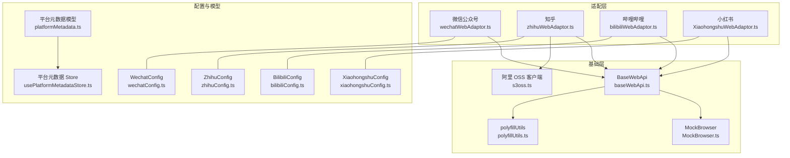
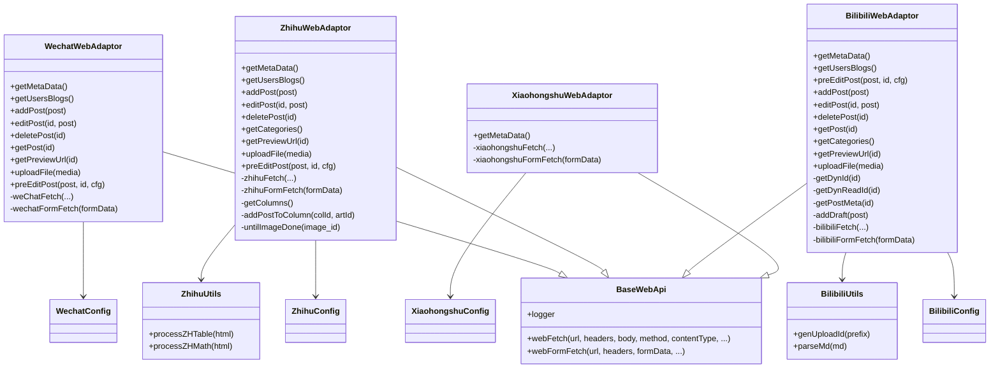
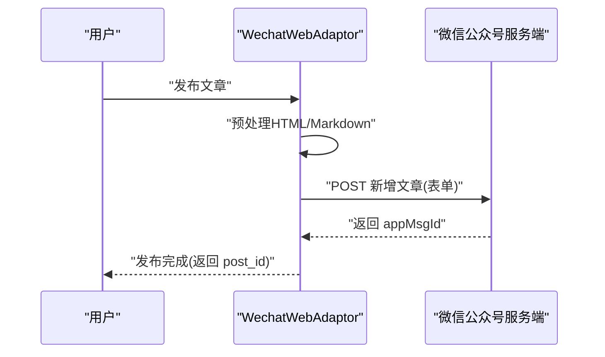
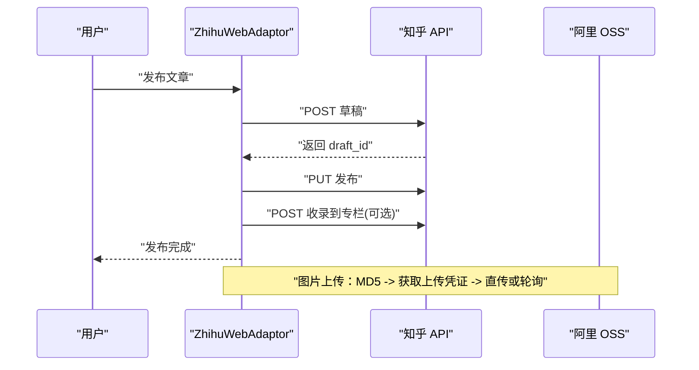
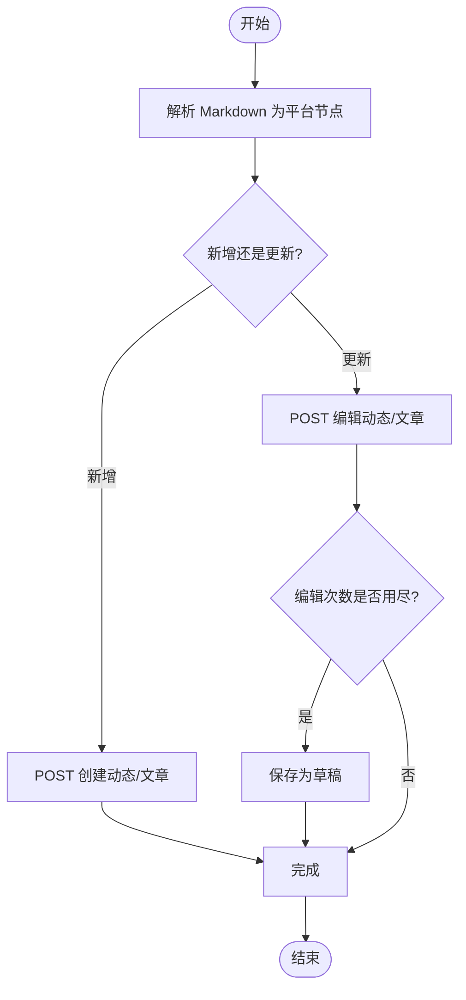
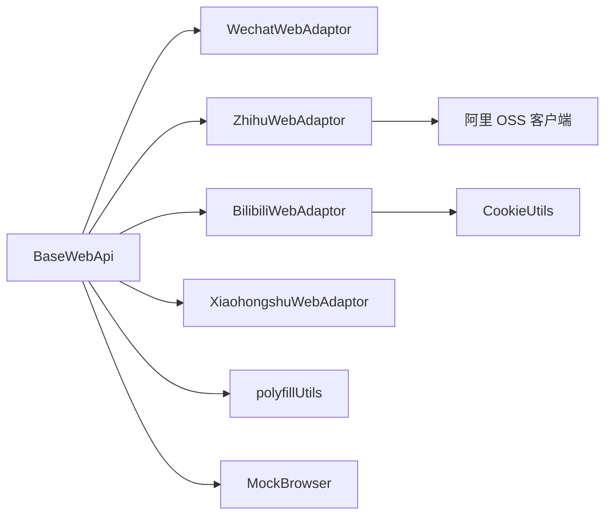

# 社交媒体平台

<cite>
**本文引用的文件**
- [src/adaptors/web/wechat/wechatWebAdaptor.ts](file://src/adaptors/web/wechat/wechatWebAdaptor.ts)
- [src/adaptors/web/wechat/wechatConfig.ts](file://src/adaptors/web/wechat/wechatConfig.ts)
- [src/adaptors/web/zhihu/zhihuWebAdaptor.ts](file://src/adaptors/web/zhihu/zhihuWebAdaptor.ts)
- [src/adaptors/web/zhihu/zhihuConfig.ts](file://src/adaptors/web/zhihu/zhihuConfig.ts)
- [src/adaptors/web/zhihu/zhihuUtils.ts](file://src/adaptors/web/zhihu/zhihuUtils.ts)
- [src/adaptors/web/bilibili/bilibiliWebAdaptor.ts](file://src/adaptors/web/bilibili/bilibiliWebAdaptor.ts)
- [src/adaptors/web/bilibili/bilibiliConfig.ts](file://src/adaptors/web/bilibili/bilibiliConfig.ts)
- [src/adaptors/web/bilibili/bilibiliUtils.ts](file://src/adaptors/web/bilibili/bilibiliUtils.ts)
- [src/adaptors/web/xiaohongshu/XiaohongshuWebAdaptor.ts](file://src/adaptors/web/xiaohongshu/XiaohongshuWebAdaptor.ts)
- [src/adaptors/web/xiaohongshu/xiaohongshuConfig.ts](file://src/adaptors/web/xiaohongshu/xiaohongshuConfig.ts)
- [src/adaptors/web/base/baseWebApi.ts](file://src/adaptors/web/base/baseWebApi.ts)
- [src/utils/MockBrowser.ts](file://src/utils/MockBrowser.ts)
- [src/utils/polyfillUtils.ts](file://src/utils/polyfillUtils.ts)
- [src/vendors/alioss/s3oss.ts](file://src/vendors/alioss/s3oss.ts)
- [src/composables/usePublish.ts](file://src/composables/usePublish.ts)
- [src/models/platformMetadata.ts](file://src/models/platformMetadata.ts)
- [src/stores/usePlatformMetadataStore.ts](file://src/stores/usePlatformMetadataStore.ts)
</cite>

## 目录
1. [引言](#引言)
2. [项目结构](#项目结构)
3. [核心组件](#核心组件)
4. [架构总览](#架构总览)
5. [详细组件分析](#详细组件分析)
6. [依赖关系分析](#依赖关系分析)
7. [性能考量](#性能考量)
8. [故障排查指南](#故障排查指南)
9. [结论](#结论)
10. [附录](#附录)

## 引言
本文件面向“社交媒体平台适配器”的技术与实践文档，聚焦微信公众号、知乎、哔哩哔哩、小红书等平台在本项目中的适配实现。内容涵盖登录认证机制、内容格式要求、图片处理策略、发布时间限制、API调用流程、平台特色功能实现、反爬虫与内容审核应对策略等。文档以代码为依据，通过图示与路径引用帮助读者快速定位实现细节。

## 项目结构
本项目采用“适配器模式”组织各平台的 Web 适配逻辑，核心位于 src/adaptors/web 下，按平台拆分子目录，包含适配器类、配置类、占位符与工具类。通用的 Web 请求封装位于 baseWebApi.ts，平台元数据与存储由 store 与 model 提供支撑。

图表来源
- [src/adaptors/web/wechat/wechatWebAdaptor.ts:29-571](file://src/adaptors/web/wechat/wechatWebAdaptor.ts#L29-L571)
- [src/adaptors/web/zhihu/zhihuWebAdaptor.ts:29-459](file://src/adaptors/web/zhihu/zhihuWebAdaptor.ts#L29-L459)
- [src/adaptors/web/bilibili/bilibiliWebAdaptor.ts:26-517](file://src/adaptors/web/bilibili/bilibiliWebAdaptor.ts#L26-L517)
- [src/adaptors/web/xiaohongshu/XiaohongshuWebAdaptor.ts:20-93](file://src/adaptors/web/xiaohongshu/XiaohongshuWebAdaptor.ts#L20-L93)
- [src/adaptors/web/base/baseWebApi.ts](file://src/adaptors/web/base/baseWebApi.ts)
- [src/utils/MockBrowser.ts](file://src/utils/MockBrowser.ts)
- [src/utils/polyfillUtils.ts](file://src/utils/polyfillUtils.ts)
- [src/vendors/alioss/s3oss.ts](file://src/vendors/alioss/s3oss.ts)
- [src/adaptors/web/wechat/wechatConfig.ts:16-32](file://src/adaptors/web/wechat/wechatConfig.ts#L16-L32)
- [src/adaptors/web/zhihu/zhihuConfig.ts:16-36](file://src/adaptors/web/zhihu/zhihuConfig.ts#L16-L36)
- [src/adaptors/web/bilibili/bilibiliConfig.ts:19-48](file://src/adaptors/web/bilibili/bilibiliConfig.ts#L19-L48)
- [src/adaptors/web/xiaohongshu/xiaohongshuConfig.ts:16-31](file://src/adaptors/web/xiaohongshu/xiaohongshuConfig.ts#L16-L31)
- [src/stores/usePlatformMetadataStore.ts](file://src/stores/usePlatformMetadataStore.ts)
- [src/models/platformMetadata.ts](file://src/models/platformMetadata.ts)

章节来源
- [src/adaptors/web/base/baseWebApi.ts](file://src/adaptors/web/base/baseWebApi.ts)
- [src/adaptors/web/wechat/wechatWebAdaptor.ts:29-571](file://src/adaptors/web/wechat/wechatWebAdaptor.ts#L29-L571)
- [src/adaptors/web/zhihu/zhihuWebAdaptor.ts:29-459](file://src/adaptors/web/zhihu/zhihuWebAdaptor.ts#L29-L459)
- [src/adaptors/web/bilibili/bilibiliWebAdaptor.ts:26-517](file://src/adaptors/web/bilibili/bilibiliWebAdaptor.ts#L26-L517)
- [src/adaptors/web/xiaohongshu/XiaohongshuWebAdaptor.ts:20-93](file://src/adaptors/web/xiaohongshu/XiaohongshuWebAdaptor.ts#L20-L93)

## 核心组件
- 适配器基类 BaseWebApi：封装统一的 Web 请求、表单提交、Cookie 管理、UA 设置、跨域与编码处理等通用能力。
- 平台适配器：
  - 微信公众号：基于 PC 网页端接口，使用 token 与 commonData 进行鉴权；支持封面图上传、文章增删改查、预览链接生成。
  - 知乎：基于专栏 API，支持草稿保存与发布、专栏收录、图片上传至阿里 OSS。
  - 哔哩哔哩：基于动态/专栏接口，使用 CSRF 参数与用户态 Cookie；支持 Markdown 转换为平台节点、封面上传、文集分类。
  - 小红书：预留适配器，当前处于开发中状态。
- 配置类：统一管理平台的 API 根、预览地址、密码类型、是否启用用户名/标签/分类/知识空间等开关。
- 工具类：ZhihuUtils、BilibiliUtils 提供平台特定的 HTML/Markdown 处理与转换。
- MockBrowser：统一注入 User-Agent，降低反爬风险。
- polyfillUtils：提供 Blob/Buffer 转换等浏览器兼容能力。
- 阿里 OSS 客户端：知乎图片上传的直传通道。

章节来源
- [src/adaptors/web/base/baseWebApi.ts](file://src/adaptors/web/base/baseWebApi.ts)
- [src/adaptors/web/wechat/wechatWebAdaptor.ts:29-571](file://src/adaptors/web/wechat/wechatWebAdaptor.ts#L29-L571)
- [src/adaptors/web/zhihu/zhihuWebAdaptor.ts:29-459](file://src/adaptors/web/zhihu/zhihuWebAdaptor.ts#L29-L459)
- [src/adaptors/web/bilibili/bilibiliWebAdaptor.ts:26-517](file://src/adaptors/web/bilibili/bilibiliWebAdaptor.ts#L26-L517)
- [src/adaptors/web/xiaohongshu/XiaohongshuWebAdaptor.ts:20-93](file://src/adaptors/web/xiaohongshu/XiaohongshuWebAdaptor.ts#L20-L93)
- [src/adaptors/web/wechat/wechatConfig.ts:16-32](file://src/adaptors/web/wechat/wechatConfig.ts#L16-L32)
- [src/adaptors/web/zhihu/zhihuConfig.ts:16-36](file://src/adaptors/web/zhihu/zhihuConfig.ts#L16-L36)
- [src/adaptors/web/bilibili/bilibiliConfig.ts:19-48](file://src/adaptors/web/bilibili/bilibiliConfig.ts#L19-L48)
- [src/adaptors/web/xiaohongshu/xiaohongshuConfig.ts:16-31](file://src/adaptors/web/xiaohongshu/xiaohongshuConfig.ts#L16-L31)
- [src/adaptors/web/zhihu/zhihuUtils.ts:18-130](file://src/adaptors/web/zhihu/zhihuUtils.ts#L18-L130)
- [src/adaptors/web/bilibili/bilibiliUtils.ts:18-40](file://src/adaptors/web/bilibili/bilibiliUtils.ts#L18-L40)
- [src/utils/MockBrowser.ts](file://src/utils/MockBrowser.ts)
- [src/utils/polyfillUtils.ts](file://src/utils/polyfillUtils.ts)
- [src/vendors/alioss/s3oss.ts](file://src/vendors/alioss/s3oss.ts)

## 架构总览
下图展示各平台适配器与基础层、配置层、工具层的关系，以及关键请求链路。

图表来源
- [src/adaptors/web/base/baseWebApi.ts](file://src/adaptors/web/base/baseWebApi.ts)
- [src/adaptors/web/wechat/wechatWebAdaptor.ts:29-571](file://src/adaptors/web/wechat/wechatWebAdaptor.ts#L29-L571)
- [src/adaptors/web/zhihu/zhihuWebAdaptor.ts:29-459](file://src/adaptors/web/zhihu/zhihuWebAdaptor.ts#L29-L459)
- [src/adaptors/web/bilibili/bilibiliWebAdaptor.ts:26-517](file://src/adaptors/web/bilibili/bilibiliWebAdaptor.ts#L26-L517)
- [src/adaptors/web/xiaohongshu/XiaohongshuWebAdaptor.ts:20-93](file://src/adaptors/web/xiaohongshu/XiaohongshuWebAdaptor.ts#L20-L93)
- [src/adaptors/web/wechat/wechatConfig.ts:16-32](file://src/adaptors/web/wechat/wechatConfig.ts#L16-L32)
- [src/adaptors/web/zhihu/zhihuConfig.ts:16-36](file://src/adaptors/web/zhihu/zhihuConfig.ts#L16-L36)
- [src/adaptors/web/bilibili/bilibiliConfig.ts:19-48](file://src/adaptors/web/bilibili/bilibiliConfig.ts#L19-L48)
- [src/adaptors/web/xiaohongshu/xiaohongshuConfig.ts:16-31](file://src/adaptors/web/xiaohongshu/xiaohongshuConfig.ts#L16-L31)
- [src/adaptors/web/zhihu/zhihuUtils.ts:18-130](file://src/adaptors/web/zhihu/zhihuUtils.ts#L18-L130)
- [src/adaptors/web/bilibili/bilibiliUtils.ts:18-40](file://src/adaptors/web/bilibili/bilibiliUtils.ts#L18-L40)

## 详细组件分析

### 微信公众号适配器
- 登录认证机制
  - 通过访问主页抓取页面脚本中的 commonData，校验 token 是否存在，据此判断登录状态。
  - 请求头包含 Cookie，并使用固定 UA。
- 内容格式要求
  - 默认使用 HTML 格式发布；支持 Markdown -> HTML 的预处理钩子。
- 图片处理策略
  - 通过素材上传接口上传 Blob，返回 CDN 地址；支持图片二进制转 Buffer。
- 发布时间限制
  - 代码未显式处理发布时间字段，通常由平台侧策略决定。
- API 调用流程
  - 新增/编辑：构造大量字段参数（标题、摘要、内容、评论设置等），以表单方式提交。
  - 删除：调用删除接口并校验返回。
  - 预览：拼接编辑页 URL。
- 反爬虫与内容审核
  - 固定 UA、携带 Cookie、必要时解析页面脚本提取令牌，降低被识别风险。

图表来源
- [src/adaptors/web/wechat/wechatWebAdaptor.ts:95-234](file://src/adaptors/web/wechat/wechatWebAdaptor.ts#L95-L234)
- [src/adaptors/web/wechat/wechatWebAdaptor.ts:527-567](file://src/adaptors/web/wechat/wechatWebAdaptor.ts#L527-L567)

章节来源
- [src/adaptors/web/wechat/wechatWebAdaptor.ts:29-571](file://src/adaptors/web/wechat/wechatWebAdaptor.ts#L29-L571)
- [src/adaptors/web/wechat/wechatConfig.ts:16-32](file://src/adaptors/web/wechat/wechatConfig.ts#L16-L32)
- [src/utils/MockBrowser.ts](file://src/utils/MockBrowser.ts)
- [src/utils/polyfillUtils.ts](file://src/utils/polyfillUtils.ts)

### 知乎适配器
- 登录认证机制
  - 通过 API 查询当前用户信息，以 uid 存在与否判定登录状态。
  - 请求头包含 Cookie，并使用固定 UA。
- 内容格式要求
  - 默认使用 HTML 格式发布；支持 Markdown -> HTML 的预处理钩子。
- 图片处理策略
  - 计算图片 MD5 作为标识，调用图片接口获取上传凭证；若状态为“处理中”，轮询直到完成；否则通过阿里 OSS 客户端直传。
- 发布时间限制
  - 代码未显式处理发布时间字段；发布流程为草稿 -> 发布。
- API 调用流程
  - 新增：先保存为草稿，再 PUT 触发发布；可选收录到专栏。
  - 更新：PATCH 更新草稿，再 PUT 发布。
  - 删除：DELETE 文章 API。
  - 预览：拼接专栏文章 URL。
- 平台特色功能
  - 表格与数学公式渲染：将表格头移入表体并添加属性；将行内/块级公式替换为图片标签。
  - 专栏收录：将文章加入指定专栏。

图表来源
- [src/adaptors/web/zhihu/zhihuWebAdaptor.ts:131-165](file://src/adaptors/web/zhihu/zhihuWebAdaptor.ts#L131-L165)
- [src/adaptors/web/zhihu/zhihuWebAdaptor.ts:268-320](file://src/adaptors/web/zhihu/zhihuWebAdaptor.ts#L268-L320)
- [src/adaptors/web/zhihu/zhihuWebAdaptor.ts:435-455](file://src/adaptors/web/zhihu/zhihuWebAdaptor.ts#L435-L455)
- [src/vendors/alioss/s3oss.ts](file://src/vendors/alioss/s3oss.ts)

章节来源
- [src/adaptors/web/zhihu/zhihuWebAdaptor.ts:29-459](file://src/adaptors/web/zhihu/zhihuWebAdaptor.ts#L29-L459)
- [src/adaptors/web/zhihu/zhihuConfig.ts:16-36](file://src/adaptors/web/zhihu/zhihuConfig.ts#L16-L36)
- [src/adaptors/web/zhihu/zhihuUtils.ts:18-130](file://src/adaptors/web/zhihu/zhihuUtils.ts#L18-L130)
- [src/utils/MockBrowser.ts](file://src/utils/MockBrowser.ts)
- [src/utils/polyfillUtils.ts](file://src/utils/polyfillUtils.ts)
- [src/vendors/alioss/s3oss.ts](file://src/vendors/alioss/s3oss.ts)

### 哔哩哔哩适配器
- 登录认证机制
  - 通过 Cookie 与 CSRF 参数进行鉴权；从 Cookie 中提取 bili_jct 作为 CSRF。
- 内容格式要求
  - 默认使用 Markdown 发布；通过 BilibiliUtils 将 Markdown 转换为平台内部节点结构。
- 图片处理策略
  - 上传封面图至平台接口，返回 URL。
- 发布时间限制
  - 代码未显式处理发布时间字段；编辑次数有限额，超限后自动保存为草稿。
- API 调用流程
  - 新增：构造 raw_content 与 opus_req，POST 创建动态/专栏文章。
  - 更新：构造 dyn_id_str 与 opus_req，POST 编辑；若编辑次数耗尽，保存为草稿。
  - 删除：调用操作接口删除。
  - 预览：根据 dyn_id_str 拼接预览 URL。
- 平台特色功能
  - 文集分类：通过“文集”作为单选分类；支持切换。
  - 图床：内置图床支持，禁用外部 PicGo。

图表来源
- [src/adaptors/web/bilibili/bilibiliWebAdaptor.ts:87-275](file://src/adaptors/web/bilibili/bilibiliWebAdaptor.ts#L87-L275)
- [src/adaptors/web/bilibili/bilibiliWebAdaptor.ts:410-446](file://src/adaptors/web/bilibili/bilibiliWebAdaptor.ts#L410-L446)
- [src/adaptors/web/bilibili/bilibiliUtils.ts:18-40](file://src/adaptors/web/bilibili/bilibiliUtils.ts#L18-L40)

章节来源
- [src/adaptors/web/bilibili/bilibiliWebAdaptor.ts:26-517](file://src/adaptors/web/bilibili/bilibiliWebAdaptor.ts#L26-L517)
- [src/adaptors/web/bilibili/bilibiliConfig.ts:19-48](file://src/adaptors/web/bilibili/bilibiliConfig.ts#L19-L48)
- [src/adaptors/web/bilibili/bilibiliUtils.ts:18-40](file://src/adaptors/web/bilibili/bilibiliUtils.ts#L18-L40)
- [src/utils/MockBrowser.ts](file://src/utils/MockBrowser.ts)
- [src/utils/polyfillUtils.ts](file://src/utils/polyfillUtils.ts)

### 小红书适配器
- 当前状态
  - 适配器已实现，但 getMetaData 中抛出“开发中”异常，尚未可用。
- 预期功能
  - 参考其他平台，应包含登录检测、内容发布、图片上传、预览与删除等能力。
- 实现建议
  - 参照微信/知乎/B站的请求封装与 Cookie/UA 策略，逐步补齐接口与流程。

章节来源
- [src/adaptors/web/xiaohongshu/XiaohongshuWebAdaptor.ts:20-93](file://src/adaptors/web/xiaohongshu/XiaohongshuWebAdaptor.ts#L20-L93)
- [src/adaptors/web/xiaohongshu/xiaohongshuConfig.ts:16-31](file://src/adaptors/web/xiaohongshu/xiaohongshuConfig.ts#L16-L31)

## 依赖关系分析
- 组件耦合
  - 各平台适配器均继承 BaseWebApi，共享请求与表单封装，降低重复与提升一致性。
  - 平台配置类集中管理平台特性开关与默认值，便于扩展与维护。
- 外部依赖
  - 知乎：依赖阿里 OSS 客户端进行图片直传。
  - 哔哩哔哩：依赖 CookieUtils 提取 CSRF。
  - 通用：依赖 polyfillUtils 进行 Blob/Buffer 转换；依赖 MockBrowser 注入 UA。
- 潜在循环依赖
  - 适配器与配置类之间为单向依赖，无循环。
- 接口契约
  - 统一方法签名：getMetaData、getUsersBlogs、addPost、editPost、deletePost、getPost、getPreviewUrl、uploadFile、preEditPost。

图表来源
- [src/adaptors/web/base/baseWebApi.ts](file://src/adaptors/web/base/baseWebApi.ts)
- [src/adaptors/web/zhihu/zhihuWebAdaptor.ts:29-459](file://src/adaptors/web/zhihu/zhihuWebAdaptor.ts#L29-L459)
- [src/adaptors/web/bilibili/bilibiliWebAdaptor.ts:26-517](file://src/adaptors/web/bilibili/bilibiliWebAdaptor.ts#L26-L517)
- [src/adaptors/web/wechat/wechatWebAdaptor.ts:29-571](file://src/adaptors/web/wechat/wechatWebAdaptor.ts#L29-L571)
- [src/adaptors/web/xiaohongshu/XiaohongshuWebAdaptor.ts:20-93](file://src/adaptors/web/xiaohongshu/XiaohongshuWebAdaptor.ts#L20-L93)
- [src/vendors/alioss/s3oss.ts](file://src/vendors/alioss/s3oss.ts)
- [src/utils/polyfillUtils.ts](file://src/utils/polyfillUtils.ts)
- [src/utils/MockBrowser.ts](file://src/utils/MockBrowser.ts)

章节来源
- [src/adaptors/web/base/baseWebApi.ts](file://src/adaptors/web/base/baseWebApi.ts)
- [src/adaptors/web/zhihu/zhihuWebAdaptor.ts:29-459](file://src/adaptors/web/zhihu/zhihuWebAdaptor.ts#L29-L459)
- [src/adaptors/web/bilibili/bilibiliWebAdaptor.ts:26-517](file://src/adaptors/web/bilibili/bilibiliWebAdaptor.ts#L26-L517)
- [src/adaptors/web/wechat/wechatWebAdaptor.ts:29-571](file://src/adaptors/web/wechat/wechatWebAdaptor.ts#L29-L571)
- [src/adaptors/web/xiaohongshu/XiaohongshuWebAdaptor.ts:20-93](file://src/adaptors/web/xiaohongshu/XiaohongshuWebAdaptor.ts#L20-L93)

## 性能考量
- 请求封装复用：通过 BaseWebApi 统一封装 fetch 与表单提交，减少重复代码与潜在错误。
- 图片上传优化：
  - 知乎：优先直传 OSS，避免二次回传；对 GIF 增加扩展名以保证显示。
  - 哔哩哔哩：直接上传封面 URL，减少中间处理。
- 数据预处理：在 preEditPost 中完成平台特定的 HTML/Markdown 转换，避免重复计算。
- UA 与 Cookie：固定 UA 与携带 Cookie 有助于稳定会话，减少重试与失败。

## 故障排查指南
- 登录失效
  - 微信/知乎/B站均通过 Cookie 鉴权；若出现“未登录/登录过期”错误，需更新 Cookie。
  - 参考路径：[微信登录检查:45-47](file://src/adaptors/web/wechat/wechatWebAdaptor.ts#L45-L47)，[知乎登录检查:47-59](file://src/adaptors/web/zhihu/zhihuWebAdaptor.ts#L47-L59)，[B站 CSRF 提取:461-502](file://src/adaptors/web/bilibili/bilibiliWebAdaptor.ts#L461-L502)。
- 图片上传失败
  - 知乎：检查 MD5 计算与 OSS 凭证；确认直传 URL 与 Token 正确。
  - 哔哩哔哩：确认封面上传接口返回与 URL 正常。
  - 参考路径：[知乎图片上传:268-320](file://src/adaptors/web/zhihu/zhihuWebAdaptor.ts#L268-L320)，[B站封面上传:359-392](file://src/adaptors/web/bilibili/bilibiliWebAdaptor.ts#L359-L392)。
- 发布/更新失败
  - 检查返回码与错误消息；B站编辑次数用尽时自动保存为草稿。
  - 参考路径：[B站编辑失败处理:264-274](file://src/adaptors/web/bilibili/bilibiliWebAdaptor.ts#L264-L274)。
- 预览链接无效
  - 确认 postid 与 token 拼接正确；参考平台预览 URL 构造。
  - 参考路径：[微信预览:439-442](file://src/adaptors/web/wechat/wechatWebAdaptor.ts#L439-L442)，[知乎预览:200-202](file://src/adaptors/web/zhihu/zhihuWebAdaptor.ts#L200-L202)。

章节来源
- [src/adaptors/web/wechat/wechatWebAdaptor.ts:45-47](file://src/adaptors/web/wechat/wechatWebAdaptor.ts#L45-L47)
- [src/adaptors/web/zhihu/zhihuWebAdaptor.ts:47-59](file://src/adaptors/web/zhihu/zhihuWebAdaptor.ts#L47-L59)
- [src/adaptors/web/bilibili/bilibiliWebAdaptor.ts:264-274](file://src/adaptors/web/bilibili/bilibiliWebAdaptor.ts#L264-L274)
- [src/adaptors/web/zhihu/zhihuWebAdaptor.ts:268-320](file://src/adaptors/web/zhihu/zhihuWebAdaptor.ts#L268-L320)
- [src/adaptors/web/bilibili/bilibiliWebAdaptor.ts:359-392](file://src/adaptors/web/bilibili/bilibiliWebAdaptor.ts#L359-L392)

## 结论
本项目通过统一的适配器架构，为微信公众号、知乎、哔哩哔哩、小红书等平台提供了可扩展、可维护的发布能力。平台差异主要体现在认证方式、内容格式、图片处理与 API 行为上，通过配置类与工具类实现了差异化处理。未来可在小红书适配器上继续完善，同时持续优化图片上传与错误处理策略，提升整体稳定性与用户体验。

## 附录
- 平台元数据与存储
  - 平台元数据模型与 Store 用于缓存与读取平台状态，便于 UI 与业务层使用。
  - 参考路径：[平台元数据 Store](file://src/stores/usePlatformMetadataStore.ts)，[平台元数据模型](file://src/models/platformMetadata.ts)。
- 发布流程编排
  - 发布流程由 usePublish 等组合式函数编排，结合各平台适配器完成最终发布。
  - 参考路径：[发布组合式函数](file://src/composables/usePublish.ts)。