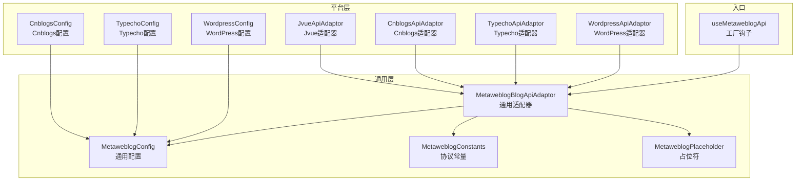
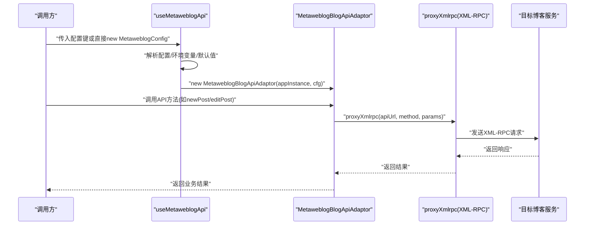
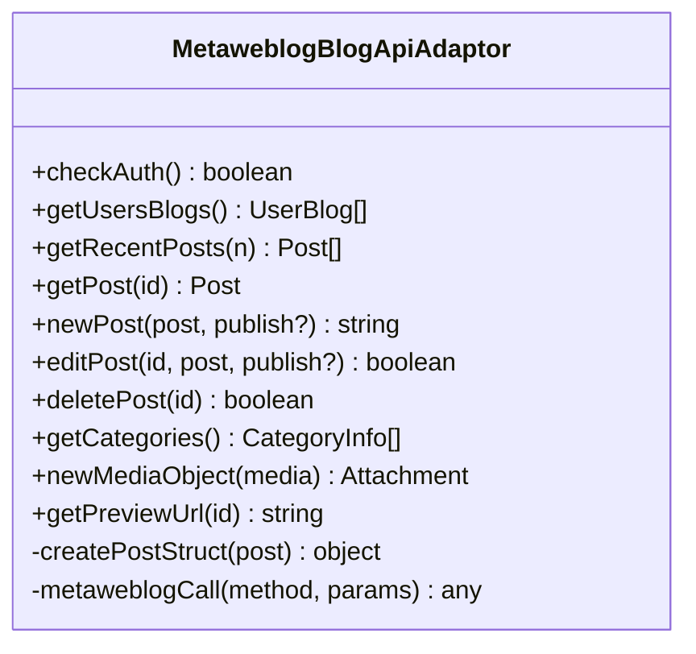
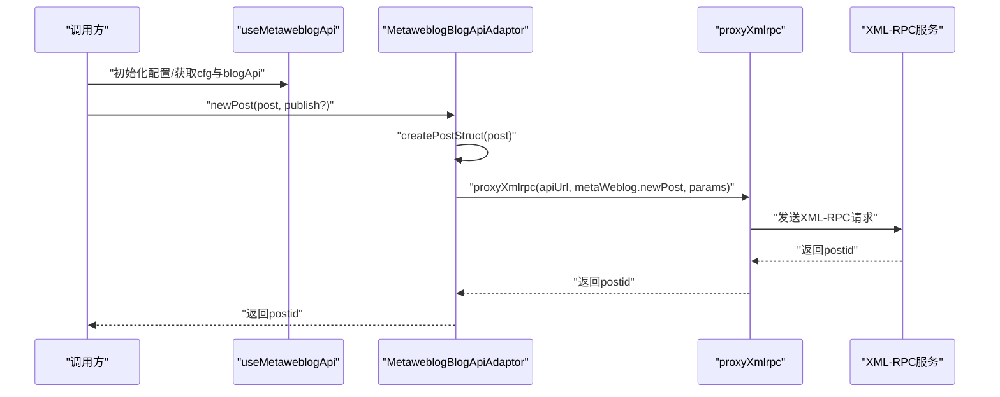
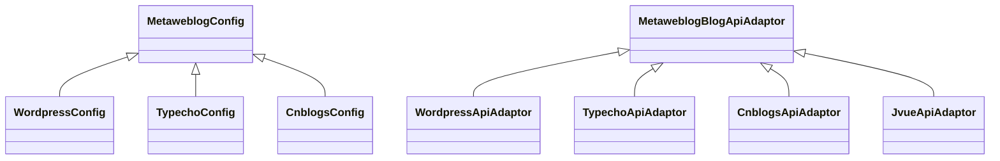

# Metaweblog协议适配器

<cite>
**本文引用的文件**
- [useMetaweblogApi.ts](file://src/adaptors/api/metaweblog/useMetaweblogApi.ts)
- [metaweblogBlogApiAdaptor.ts](file://src/adaptors/api/base/metaweblog/metaweblogBlogApiAdaptor.ts)
- [metaweblogConfig.ts](file://src/adaptors/api/base/metaweblog/metaweblogConfig.ts)
- [metaweblogConstants.ts](file://src/adaptors/api/base/metaweblog/metaweblogConstants.ts)
- [metaweblogPlaceholder.ts](file://src/adaptors/api/base/metaweblog/metaweblogPlaceholder.ts)
- [wordpressApiAdaptor.ts](file://src/adaptors/api/wordpress/wordpressApiAdaptor.ts)
- [wordpressConfig.ts](file://src/adaptors/api/wordpress/wordpressConfig.ts)
- [typechoApiAdaptor.ts](file://src/adaptors/api/typecho/typechoApiAdaptor.ts)
- [typechoConfig.ts](file://src/adaptors/api/typecho/typechoConfig.ts)
- [cnblogsApiAdaptor.ts](file://src/adaptors/api/cnblogs/cnblogsApiAdaptor.ts)
- [cnblogsConfig.ts](file://src/adaptors/api/cnblogs/cnblogsConfig.ts)
- [jvueApiAdaptor.ts](file://src/adaptors/api/jvue/jvueApiAdaptor.ts)
</cite>

## 目录
1. [简介](#简介)
2. [项目结构](#项目结构)
3. [核心组件](#核心组件)
4. [架构总览](#架构总览)
5. [详细组件分析](#详细组件分析)
6. [依赖关系分析](#依赖关系分析)
7. [性能考量](#性能考量)
8. [故障排除指南](#故障排除指南)
9. [结论](#结论)
10. [附录](#附录)

## 简介
本文件系统性阐述基于Metaweblog协议的适配器设计与实现，覆盖协议工作原理、认证与API调用流程、各平台适配差异（WordPress.com、WordPress.org、Typecho、Jvue、Cnblogs），以及配置模板、认证配置指南、发布参数设置、错误处理策略与故障排除方法。文档面向开发者与运维人员，既提供高层概览也包含代码级细节映射。

## 项目结构
Metaweblog适配器位于适配层目录，采用“通用基类 + 平台特化”的分层设计：
- 通用层：通用配置、常量、占位符、通用适配器
- 平台层：WordPress、Typecho、Cnblogs、Jvue等平台特化适配器
- 工厂/入口：useMetaweblogApi钩子负责加载配置、初始化适配器并注入平台特性

图表来源
- [useMetaweblogApi.ts:30-89](file://src/adaptors/api/metaweblog/useMetaweblogApi.ts#L30-L89)
- [metaweblogBlogApiAdaptor.ts:26-42](file://src/adaptors/api/base/metaweblog/metaweblogBlogApiAdaptor.ts#L26-L42)
- [metaweblogConfig.ts:17-99](file://src/adaptors/api/base/metaweblog/metaweblogConfig.ts#L17-L99)
- [metaweblogConstants.ts:17-26](file://src/adaptors/api/base/metaweblog/metaweblogConstants.ts#L17-L26)
- [wordpressApiAdaptor.ts:22-34](file://src/adaptors/api/wordpress/wordpressApiAdaptor.ts#L22-L34)
- [wordpressConfig.ts:20-45](file://src/adaptors/api/wordpress/wordpressConfig.ts#L20-L45)
- [typechoApiAdaptor.ts:22-33](file://src/adaptors/api/typecho/typechoApiAdaptor.ts#L22-L33)
- [typechoConfig.ts:20-44](file://src/adaptors/api/typecho/typechoConfig.ts#L20-L44)
- [cnblogsApiAdaptor.ts:27-40](file://src/adaptors/api/cnblogs/cnblogsApiAdaptor.ts#L27-L40)
- [cnblogsConfig.ts:19-43](file://src/adaptors/api/cnblogs/cnblogsConfig.ts#L19-L43)
- [jvueApiAdaptor.ts:22-33](file://src/adaptors/api/jvue/jvueApiAdaptor.ts#L22-L33)

章节来源
- [useMetaweblogApi.ts:30-89](file://src/adaptors/api/metaweblog/useMetaweblogApi.ts#L30-L89)
- [metaweblogBlogApiAdaptor.ts:26-42](file://src/adaptors/api/base/metaweblog/metaweblogBlogApiAdaptor.ts#L26-L42)

## 核心组件
- 通用配置类：承载通用元数据（首页、API地址、用户名、密码、博客ID、文章别名key、预览URL、页面类型、跨域代理等），并统一平台占位符与能力开关。
- 通用常量：定义Metaweblog协议方法名，如获取博客列表、新建/编辑/删除文章、最近文章、文章详情、分类、媒体对象等。
- 通用适配器：封装XML-RPC代理调用、文章字段适配、分类/媒体对象处理、预览URL生成等通用逻辑。
- 平台特化适配器：在通用适配器基础上覆写特定行为（如博客园自动添加Markdown分类、预览URL拼接用户ID）。
- 工厂钩子：根据配置或环境变量初始化MetaweblogConfig，设置平台能力开关与默认参数，返回适配器实例。

章节来源
- [metaweblogConfig.ts:17-99](file://src/adaptors/api/base/metaweblog/metaweblogConfig.ts#L17-L99)
- [metaweblogConstants.ts:17-26](file://src/adaptors/api/base/metaweblog/metaweblogConstants.ts#L17-L26)
- [metaweblogBlogApiAdaptor.ts:26-42](file://src/adaptors/api/base/metaweblog/metaweblogBlogApiAdaptor.ts#L26-L42)
- [useMetaweblogApi.ts:30-89](file://src/adaptors/api/metaweblog/useMetaweblogApi.ts#L30-L89)

## 架构总览
Metaweblog适配器通过工厂钩子加载配置，构造通用适配器，再由平台特化适配器扩展能力。所有协议调用经由XML-RPC代理转发，确保浏览器端跨域安全。

图表来源
- [useMetaweblogApi.ts:30-89](file://src/adaptors/api/metaweblog/useMetaweblogApi.ts#L30-L89)
- [metaweblogBlogApiAdaptor.ts:239-241](file://src/adaptors/api/base/metaweblog/metaweblogBlogApiAdaptor.ts#L239-L241)

## 详细组件分析

### 通用适配器：MetaweblogBlogApiAdaptor
- 责任边界：封装Metaweblog协议调用、文章字段适配、分类与媒体对象处理、预览URL生成。
- 关键方法：
  - getUsersBlogs/getRecentPosts/getPost/getCategories/newMediaObject：按协议常量调用代理。
  - newPost/editPost/deletePost：构建postStruct并调用对应方法；支持发布/草稿状态切换。
  - getPreviewUrl：根据平台配置替换占位符生成预览URL。
  - createPostStruct：将Post对象的关键字段映射到协议期望的结构。
- 安全与跨域：通过proxyXmlrpc代理XML-RPC请求，避免浏览器同源限制。

图表来源
- [metaweblogBlogApiAdaptor.ts:26-321](file://src/adaptors/api/base/metaweblog/metaweblogBlogApiAdaptor.ts#L26-L321)

章节来源
- [metaweblogBlogApiAdaptor.ts:48-186](file://src/adaptors/api/base/metaweblog/metaweblogBlogApiAdaptor.ts#L48-L186)
- [metaweblogBlogApiAdaptor.ts:239-317](file://src/adaptors/api/base/metaweblog/metaweblogBlogApiAdaptor.ts#L239-L317)

### 通用配置：MetaweblogConfig
- 字段要点：home、apiUrl、username、password、blogid、blogName、posidKey、previewUrl、pageType、placeholder、middlewareUrl。
- 能力开关：tagEnabled、cateEnabled、categoryType、allowCateChange、knowledgeSpaceEnabled、usernameEnabled、showTokenTip、allowPreviewUrlChange。
- 默认行为：页面类型默认Html，分类类型多选，标签启用，知识空间禁用。

章节来源
- [metaweblogConfig.ts:17-99](file://src/adaptors/api/base/metaweblog/metaweblogConfig.ts#L17-L99)

### 协议常量：MetaweblogConstants
- 方法名：metaWeblog.getUsersBlogs、metaWeblog.newPost、metaWeblog.editPost、metaWeblog.deletePost、metaWeblog.getRecentPosts、metaWeblog.getPost、metaWeblog.getCategories、metaWeblog.newMediaObject。

章节来源
- [metaweblogConstants.ts:17-26](file://src/adaptors/api/base/metaweblog/metaweblogConstants.ts#L17-L26)

### 工厂钩子：useMetaweblogApi
- 功能：优先使用传入配置，否则从设置存储读取；若为空则回退到环境变量与默认值；初始化posidKey；设置平台能力开关（标签/分类/多选分类/图片库支持等）；返回cfg与blogApi。
- 入口：new MetaweblogBlogApiAdaptor(appInstance, cfg)。

章节来源
- [useMetaweblogApi.ts:30-89](file://src/adaptors/api/metaweblog/useMetaweblogApi.ts#L30-L89)

### 平台适配器与配置

#### WordPress适配器与配置
- 适配器：继承通用适配器，设置blogid为"wordpress"。
- 配置：解析主页与API地址，设置预览URL为?p=[postid]，页面类型Html，启用多选分类与标签。

章节来源
- [wordpressApiAdaptor.ts:22-34](file://src/adaptors/api/wordpress/wordpressApiAdaptor.ts#L22-L34)
- [wordpressConfig.ts:20-45](file://src/adaptors/api/wordpress/wordpressConfig.ts#L20-L45)

#### Typecho适配器与配置
- 适配器：继承通用适配器，设置blogid为"typecho"。
- 配置：解析主页与API地址，设置预览URL为/index.php/archives/[postid]，页面类型Html，启用多选分类与标签。

章节来源
- [typechoApiAdaptor.ts:22-33](file://src/adaptors/api/typecho/typechoApiAdaptor.ts#L22-L33)
- [typechoConfig.ts:20-44](file://src/adaptors/api/typecho/typechoConfig.ts#L20-L44)

#### Cnblogs适配器与配置
- 适配器：继承通用适配器，设置blogid为"cnblogs"；覆写getUsersBlogs、deletePost、getCategories、getPreviewUrl；新增assignMdCategory逻辑，自动为文章添加Markdown分类且不展示该分类。
- 配置：固定主页为https://www.cnblogs.com/；token设置页URL；预览URL含[userid]与[postid]占位符；密码类型为Token；页面类型Markdown；启用多选分类与标签。

章节来源
- [cnblogsApiAdaptor.ts:27-131](file://src/adaptors/api/cnblogs/cnblogsApiAdaptor.ts#L27-L131)
- [cnblogsConfig.ts:19-43](file://src/adaptors/api/cnblogs/cnblogsConfig.ts#L19-L43)

#### Jvue适配器
- 适配器：继承通用适配器，设置blogid为"jvue"。

章节来源
- [jvueApiAdaptor.ts:22-33](file://src/adaptors/api/jvue/jvueApiAdaptor.ts#L22-L33)

### API调用流程（以新建文章为例）

图表来源
- [useMetaweblogApi.ts:30-89](file://src/adaptors/api/metaweblog/useMetaweblogApi.ts#L30-L89)
- [metaweblogBlogApiAdaptor.ts:111-136](file://src/adaptors/api/base/metaweblog/metaweblogBlogApiAdaptor.ts#L111-L136)
- [metaweblogBlogApiAdaptor.ts:239-241](file://src/adaptors/api/base/metaweblog/metaweblogBlogApiAdaptor.ts#L239-L241)

## 依赖关系分析
- 继承关系：各平台适配器均继承自通用适配器，复用协议调用与字段适配逻辑。
- 配置依赖：平台配置类在通用配置基础上补充平台特定参数（API地址解析、预览URL、页面类型、密码类型等）。
- 外部依赖：XML-RPC代理用于跨域请求；日志工具用于调试与错误追踪。

图表来源
- [metaweblogConfig.ts:17-99](file://src/adaptors/api/base/metaweblog/metaweblogConfig.ts#L17-L99)
- [wordpressConfig.ts:20-45](file://src/adaptors/api/wordpress/wordpressConfig.ts#L20-L45)
- [typechoConfig.ts:20-44](file://src/adaptors/api/typecho/typechoConfig.ts#L20-L44)
- [cnblogsConfig.ts:19-43](file://src/adaptors/api/cnblogs/cnblogsConfig.ts#L19-L43)
- [wordpressApiAdaptor.ts:22-34](file://src/adaptors/api/wordpress/wordpressApiAdaptor.ts#L22-L34)
- [typechoApiAdaptor.ts:22-33](file://src/adaptors/api/typecho/typechoApiAdaptor.ts#L22-L33)
- [cnblogsApiAdaptor.ts:27-40](file://src/adaptors/api/cnblogs/cnblogsApiAdaptor.ts#L27-L40)
- [jvueApiAdaptor.ts:22-33](file://src/adaptors/api/jvue/jvueApiAdaptor.ts#L22-L33)

## 性能考量
- 请求聚合：批量获取最近文章时建议控制numOfPosts数量，避免单次请求过大。
- 字段映射：createPostStruct仅映射非空字段，减少冗余传输。
- 代理开销：XML-RPC代理增加一次网络往返，应尽量合并调用或缓存必要数据（如分类列表）。
- 图片上传：媒体对象上传可能较大，建议在前端压缩与分块上传策略（如适用）。

## 故障排除指南
- 认证失败
  - 检查用户名/密码或Token是否正确；Cnblogs使用Token类型，需在个人设置页获取。
  - 确认预览URL与API地址配置正确，尤其是占位符替换。
- 跨域与代理
  - 若XML-RPC调用失败，检查middlewareUrl与代理可用性；确认代理支持XML-RPC。
- 分类/标签不可见
  - 某些平台（如博客园）会隐藏特定分类（如Markdown分类），请在平台侧确认。
- 发布状态异常
  - 发布/草稿切换由publish参数控制；若需要强制使用Post对象自身状态，请确保post.post_status已正确设置。
- 预览URL错误
  - Cnblogs预览URL包含[userid]，需确保API地址中包含用户标识；其他平台请核对预览URL模板。

章节来源
- [cnblogsConfig.ts:31-32](file://src/adaptors/api/cnblogs/cnblogsConfig.ts#L31-L32)
- [cnblogsApiAdaptor.ts:111-116](file://src/adaptors/api/cnblogs/cnblogsApiAdaptor.ts#L111-L116)
- [metaweblogBlogApiAdaptor.ts:111-136](file://src/adaptors/api/base/metaweblog/metaweblogBlogApiAdaptor.ts#L111-L136)

## 结论
本适配器以通用基类为核心，通过平台特化适配器实现差异化行为，结合工厂钩子完成配置注入与能力开关设置。其遵循Metaweblog协议标准方法，借助XML-RPC代理实现跨域安全访问。针对不同平台（WordPress、Typecho、Cnblogs、Jvue）提供了清晰的配置与适配路径，便于扩展与维护。

## 附录

### 配置文件模板与参数说明
- 通用配置字段
  - home：站点主页
  - apiUrl：XML-RPC API地址
  - username/password：用户名与密码或Token
  - blogid/blogName：博客标识与名称
  - posidKey：文章别名key
  - previewUrl：预览URL模板（支持[postid]、[userid]等占位符）
  - pageType：页面类型（Markdown/Html）
  - middlewareUrl：代理地址
  - 能力开关：tagEnabled、cateEnabled、categoryType、allowCateChange、knowledgeSpaceEnabled、usernameEnabled、showTokenTip、allowPreviewUrlChange
- 平台特化配置
  - WordPress：解析主页与API地址，预览URL?p=[postid]，页面类型Html
  - Typecho：解析主页与API地址，预览URL/index.php/archives/[postid]，页面类型Html
  - Cnblogs：固定主页，Token类型，预览URL含[userid]，页面类型Markdown

章节来源
- [metaweblogConfig.ts:17-99](file://src/adaptors/api/base/metaweblog/metaweblogConfig.ts#L17-L99)
- [wordpressConfig.ts:20-45](file://src/adaptors/api/wordpress/wordpressConfig.ts#L20-L45)
- [typechoConfig.ts:20-44](file://src/adaptors/api/typecho/typechoConfig.ts#L20-L44)
- [cnblogsConfig.ts:19-43](file://src/adaptors/api/cnblogs/cnblogsConfig.ts#L19-L43)

### 认证配置指南
- WordPress：提供主页地址，内部解析API地址；用户名必填，密码为应用密码或登录密码。
- Typecho：提供主页地址，内部解析API地址；用户名必填，密码为登录密码。
- Cnblogs：提供API地址（包含用户标识），用户名必填，密码类型为Token，需在个人设置页获取。

章节来源
- [wordpressConfig.ts:29-35](file://src/adaptors/api/wordpress/wordpressConfig.ts#L29-L35)
- [typechoConfig.ts:29-35](file://src/adaptors/api/typecho/typechoConfig.ts#L29-L35)
- [cnblogsConfig.ts:28-32](file://src/adaptors/api/cnblogs/cnblogsConfig.ts#L28-L32)

### 发布参数设置
- 发布/草稿：newPost/editPost支持publish参数控制；也可直接设置Post对象的post_status。
- 分类/标签：默认启用多选分类与标签；允许在UI层选择多个分类。
- 页面类型：WordPress/Typecho默认Html；Cnblogs默认Markdown。

章节来源
- [useMetaweblogApi.ts:69-77](file://src/adaptors/api/metaweblog/useMetaweblogApi.ts#L69-L77)
- [metaweblogBlogApiAdaptor.ts:111-167](file://src/adaptors/api/base/metaweblog/metaweblogBlogApiAdaptor.ts#L111-L167)
- [wordpressConfig.ts:36-36](file://src/adaptors/api/wordpress/wordpressConfig.ts#L36-L36)
- [typechoConfig.ts:36-36](file://src/adaptors/api/typecho/typechoConfig.ts#L36-L36)
- [cnblogsConfig.ts:33-33](file://src/adaptors/api/cnblogs/cnblogsConfig.ts#L33-L33)

### 错误处理策略
- 通用错误：捕获XML-RPC调用异常，记录日志并返回空结果或布尔false。
- 分类获取：在getCategories中捕获异常并记录错误日志，保证不影响整体流程。
- 媒体上传：在newMediaObject中捕获异常并记录错误日志，返回空附件对象。

章节来源
- [metaweblogBlogApiAdaptor.ts:218-237](file://src/adaptors/api/base/metaweblog/metaweblogBlogApiAdaptor.ts#L218-L237)
- [metaweblogBlogApiAdaptor.ts:188-216](file://src/adaptors/api/base/metaweblog/metaweblogBlogApiAdaptor.ts#L188-L216)