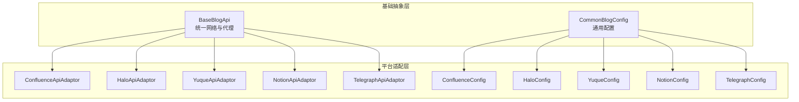
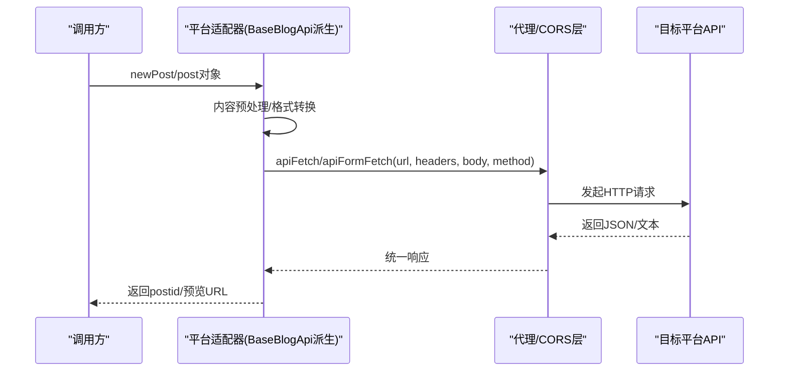
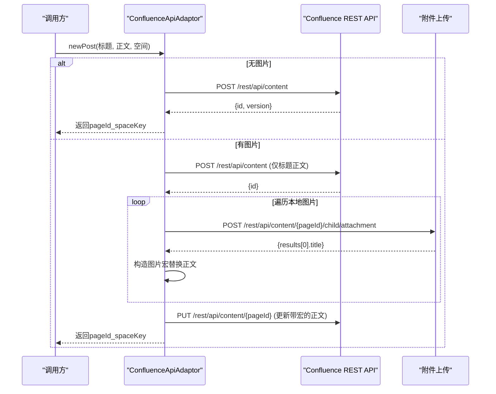
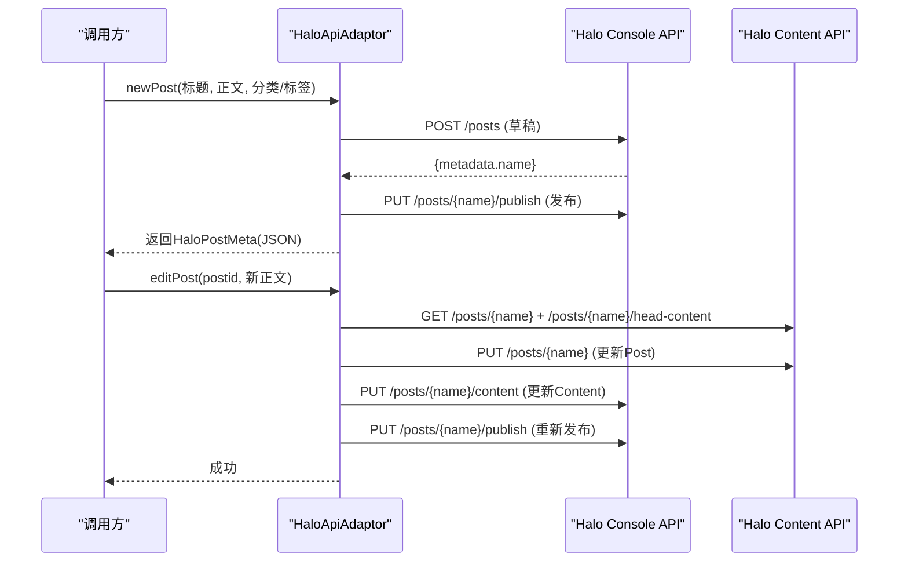
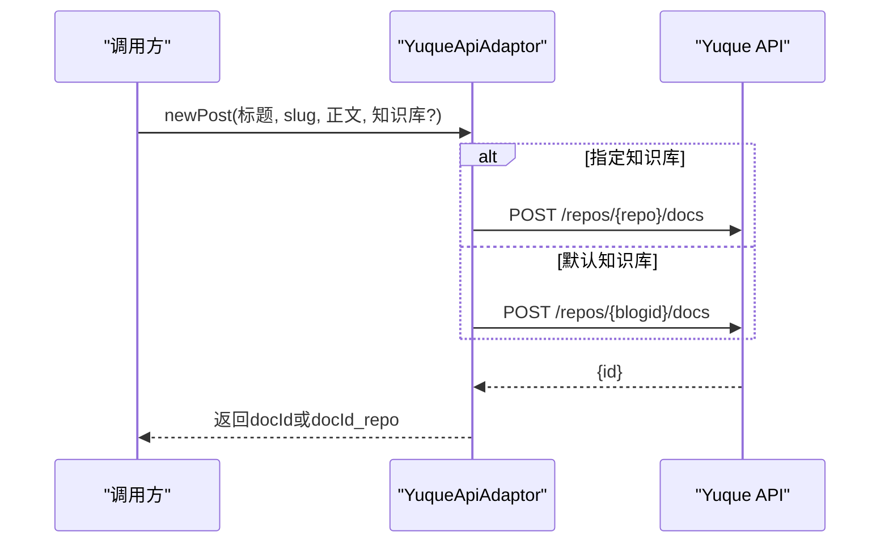
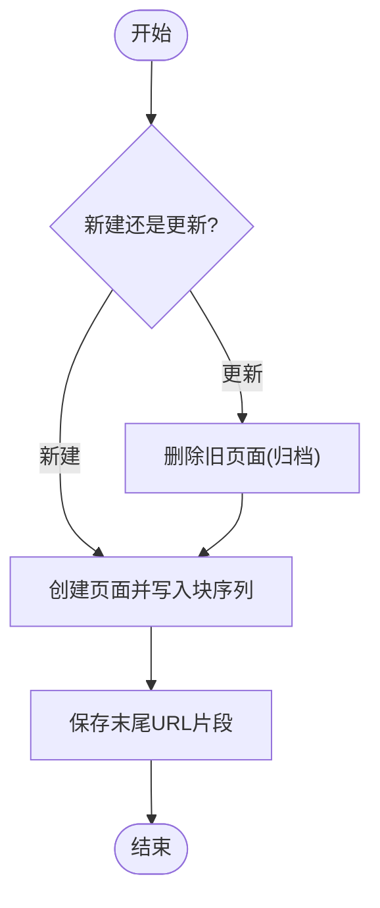
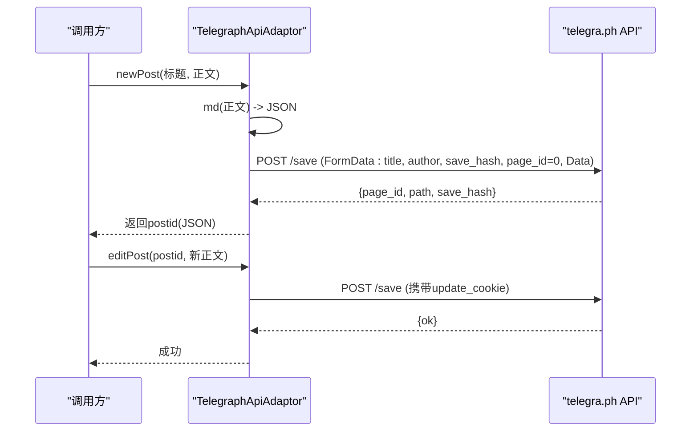
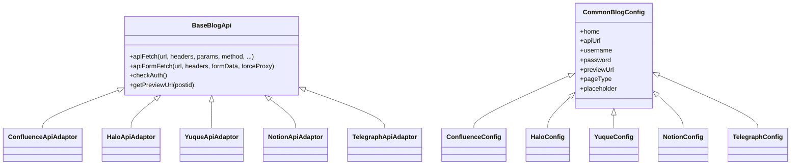

# 内容管理平台适配器

<cite>
**本文引用的文件**
- [confluenceApiAdaptor.ts](file://src/adaptors/api/confluence/confluenceApiAdaptor.ts)
- [confluenceConfig.ts](file://src/adaptors/api/confluence/confluenceConfig.ts)
- [confluenceConstants.ts](file://src/adaptors/api/confluence/confluenceConstants.ts)
- [HaloApiAdaptor.ts](file://src/adaptors/api/halo/HaloApiAdaptor.ts)
- [HaloConfig.ts](file://src/adaptors/api/halo/HaloConfig.ts)
- [HaloPostMeta.ts](file://src/adaptors/api/halo/HaloPostMeta.ts)
- [HaloUtils.ts](file://src/adaptors/api/halo/haloUtils.ts)
- [yuqueApiAdaptor.ts](file://src/adaptors/api/yuque/yuqueApiAdaptor.ts)
- [yuqueConfig.ts](file://src/adaptors/api/yuque/yuqueConfig.ts)
- [yuquePlaceholder.ts](file://src/adaptors/api/yuque/yuquePlaceholder.ts)
- [notionApiAdaptor.ts](file://src/adaptors/api/notion/notionApiAdaptor.ts)
- [notionConfig.ts](file://src/adaptors/api/notion/notionConfig.ts)
- [notionPlaceholder.ts](file://src/adaptors/api/notion/notionPlaceholder.ts)
- [telegraphApiAdaptor.ts](file://src/adaptors/api/telegraph/telegraphApiAdaptor.ts)
- [telegraphConfig.ts](file://src/adaptors/api/telegraph/telegraphConfig.ts)
- [telegraphPlaceholder.ts](file://src/adaptors/api/telegraph/telegraphPlaceholder.ts)
- [baseBlogApi.ts](file://src/adaptors/api/base/baseBlogApi.ts)
- [commonBlogConfig.ts](file://src/adaptors/api/base/commonBlogConfig.ts)
</cite>

## 目录
1. [简介](#简介)
2. [项目结构](#项目结构)
3. [核心组件](#核心组件)
4. [架构总览](#架构总览)
5. [详细组件分析](#详细组件分析)
6. [依赖关系分析](#依赖关系分析)
7. [性能考量](#性能考量)
8. [故障排查指南](#故障排查指南)
9. [结论](#结论)
10. [附录](#附录)

## 简介
本文件系统性梳理内容管理平台适配器的设计与实现，重点覆盖以下平台：
- Confluence：企业级知识库平台，采用 Atlassian 官方 REST API，支持空间与页面管理、图片上传宏替换、版本控制。
- Halo：现代化博客系统，提供内容与媒体的完整 API，支持标签/分类、富文本/Markdown 内容发布。
- 语雀：阿里巴巴旗下知识库平台，以“知识库”为知识组织单位，提供 Markdown 文档发布与管理。
- Notion：低代码笔记平台，基于块（block）的页面模型，采用 Notion 自身 API，支持搜索、创建、归档页面。
- Telegraph：匿名发布平台，通过 Cookie 与 Token 协议进行会话管理，支持 Markdown 渲染与页面保存。

文档将从架构设计、数据流、处理逻辑、认证机制、配置项、发布流程定制、内容格式转换等方面进行深入解析，并提供序列图、类图与流程图帮助理解。

## 项目结构
适配器遵循“平台适配层 + 基础抽象层”的分层设计：
- 平台适配层：每个平台一个适配器类与配置类，负责具体 API 调用、认证、内容转换与发布流程。
- 基础抽象层：统一的基类封装通用的网络请求、代理、表单提交、日志与错误处理。

图表来源
- [baseBlogApi.ts:27-204](file://src/adaptors/api/base/baseBlogApi.ts#L27-L204)
- [commonBlogConfig.ts:13-41](file://src/adaptors/api/base/commonBlogConfig.ts#L13-L41)
- [confluenceApiAdaptor.ts:24-573](file://src/adaptors/api/confluence/confluenceApiAdaptor.ts#L24-L573)
- [HaloApiAdaptor.ts:27-515](file://src/adaptors/api/halo/HaloApiAdaptor.ts#L27-L515)
- [yuqueApiAdaptor.ts:20-298](file://src/adaptors/api/yuque/yuqueApiAdaptor.ts#L20-L298)
- [notionApiAdaptor.ts:21-274](file://src/adaptors/api/notion/notionApiAdaptor.ts#L21-L274)
- [telegraphApiAdaptor.ts:22-361](file://src/adaptors/api/telegraph/telegraphApiAdaptor.ts#L22-L361)

章节来源
- [baseBlogApi.ts:27-204](file://src/adaptors/api/base/baseBlogApi.ts#L27-L204)
- [commonBlogConfig.ts:13-41](file://src/adaptors/api/base/commonBlogConfig.ts#L13-L41)

## 核心组件
- BaseBlogApi：统一的 API 请求封装，支持代理与 CORS 两种模式，提供 apiFetch 与 apiFormFetch 两类方法；内置日志、错误处理与预处理钩子。
- 平台适配器：继承自 BaseBlogApi，实现 getUsersBlogs/newPost/editPost/deletePost/getPost/getCategories/getPreviewUrl 等标准接口，并按平台特性扩展媒体上传、内容转换等能力。
- 平台配置：继承自 CommonBlogConfig，定义平台特有的认证方式、页面类型、知识库/空间概念、预览 URL 模板、占位提示等。

章节来源
- [baseBlogApi.ts:93-204](file://src/adaptors/api/base/baseBlogApi.ts#L93-L204)
- [commonBlogConfig.ts:13-41](file://src/adaptors/api/base/commonBlogConfig.ts#L13-L41)

## 架构总览
适配器整体采用“统一基类 + 平台特化”的模式，平台适配器通过统一的 apiFetch/apiFormFetch 与目标平台交互，同时在适配器内部完成内容格式转换、占位符替换、媒体上传与回填等复杂逻辑。

图表来源
- [baseBlogApi.ts:93-204](file://src/adaptors/api/base/baseBlogApi.ts#L93-L204)

## 详细组件分析

### Confluence 适配器
- 认证机制：使用 Bearer Token（个人访问令牌），请求头包含 Authorization 与 X-Atlassian-Token。
- 内容结构：页面以“空间 + 页面”组织，创建/更新时需携带 spaceKey 与 ancestors（父页面）。
- 发布流程：
  - 无图片：直接创建页面。
  - 有图片：先创建页面，再逐张上传附件并替换正文中的图片占位符，最后更新页面。
- 内容格式转换：将 HTML 中的代码块转换为 Confluence 结构化宏，移除标题与正文首部重复内容，修复换行。
- 关键点：
  - postid 格式：pageId_spaceKey，便于跨空间迁移。
  - 图片上传：使用专用上传端点，返回附件宏用于替换正文。
  - 版本控制：读取当前版本号并递增，避免并发冲突。

图表来源
- [confluenceApiAdaptor.ts:49-106](file://src/adaptors/api/confluence/confluenceApiAdaptor.ts#L49-L106)
- [confluenceApiAdaptor.ts:247-341](file://src/adaptors/api/confluence/confluenceApiAdaptor.ts#L247-L341)
- [confluenceApiAdaptor.ts:473-491](file://src/adaptors/api/confluence/confluenceApiAdaptor.ts#L473-L491)

章节来源
- [confluenceApiAdaptor.ts:24-573](file://src/adaptors/api/confluence/confluenceApiAdaptor.ts#L24-L573)
- [confluenceConfig.ts:17-42](file://src/adaptors/api/confluence/confluenceConfig.ts#L17-L42)
- [confluenceConstants.ts:16-21](file://src/adaptors/api/confluence/confluenceConstants.ts#L16-L21)

### Halo 适配器
- 认证机制：Basic Auth，用户名/密码组合。
- 内容结构：Post 由 spec（元数据）与 content（正文）两部分组成，支持 Markdown/rawType。
- 发布流程：
  - 新建：生成随机名称，写入标题、别名、可见性、摘要、分类/标签、发布时间；先创建草稿，再执行发布。
  - 更新：加载最新草稿，合并变更后更新 Post 与 Content，再重新发布。
  - 删除：调用回收站接口。
- 内容格式转换：为 h1-h6 添加 id 属性，便于目录与锚点。
- 关键点：
  - postid：采用 HaloPostMeta（slug/name/year/month/day）的 JSON 字符串。
  - 分类/标签：若不存在则自动创建，支持多分类。
  - 预览 URL：支持动态替换年月日与 slug/name。

图表来源
- [HaloApiAdaptor.ts:50-143](file://src/adaptors/api/halo/HaloApiAdaptor.ts#L50-L143)
- [HaloApiAdaptor.ts:145-204](file://src/adaptors/api/halo/HaloApiAdaptor.ts#L145-L204)
- [HaloApiAdaptor.ts:349-352](file://src/adaptors/api/halo/HaloApiAdaptor.ts#L349-L352)
- [HaloPostMeta.ts:19-36](file://src/adaptors/api/halo/HaloPostMeta.ts#L19-L36)

章节来源
- [HaloApiAdaptor.ts:27-515](file://src/adaptors/api/halo/HaloApiAdaptor.ts#L27-L515)
- [HaloConfig.ts:16-42](file://src/adaptors/api/halo/HaloConfig.ts#L16-L42)
- [HaloPostMeta.ts:19-36](file://src/adaptors/api/halo/HaloPostMeta.ts#L19-L36)
- [HaloUtils.ts:17-32](file://src/adaptors/api/halo/haloUtils.ts#L17-L32)

### 语雀适配器
- 认证机制：X-Auth-Token 头部携带 Token。
- 内容结构：以“知识库 namespace”为知识组织单位，文档以 Markdown 存储。
- 发布流程：
  - 新建/更新/删除：直接调用仓库文档端点，支持指定 repo。
  - postid：docId_repo（当指定不同知识库时）。
- 关键点：
  - 知识库即“空间”，不可在编辑时更改。
  - 预览 URL 支持 notebook 与 postid 占位符。

图表来源
- [yuqueApiAdaptor.ts:135-159](file://src/adaptors/api/yuque/yuqueApiAdaptor.ts#L135-L159)
- [yuqueApiAdaptor.ts:170-194](file://src/adaptors/api/yuque/yuqueApiAdaptor.ts#L170-L194)

章节来源
- [yuqueApiAdaptor.ts:20-298](file://src/adaptors/api/yuque/yuqueApiAdaptor.ts#L20-L298)
- [yuqueConfig.ts:16-37](file://src/adaptors/api/yuque/yuqueConfig.ts#L16-L37)

### Notion 适配器
- 认证机制：Bearer Token，Notion-Version 头部固定。
- 内容结构：基于块（block）的页面模型，采用 NotionMarkdownConverter 将 Markdown 转换为块序列。
- 发布流程：
  - 新建：创建页面并填充块序列。
  - 更新：采用“删除旧页 + 新建一页”的策略，以规避块级更新限制。
  - 删除：归档页面。
- 关键点：
  - postid：pageId_endUrl（末尾路径片段），用于预览 URL 生成。
  - 根页面即“空间”，不可在编辑时更改。

图表来源
- [notionApiAdaptor.ts:45-74](file://src/adaptors/api/notion/notionApiAdaptor.ts#L45-L74)
- [notionApiAdaptor.ts:151-178](file://src/adaptors/api/notion/notionApiAdaptor.ts#L151-L178)
- [notionApiAdaptor.ts:180-191](file://src/adaptors/api/notion/notionApiAdaptor.ts#L180-L191)

章节来源
- [notionApiAdaptor.ts:21-274](file://src/adaptors/api/notion/notionApiAdaptor.ts#L21-L274)
- [notionConfig.ts:16-37](file://src/adaptors/api/notion/notionConfig.ts#L16-L37)

### Telegraph 适配器
- 认证机制：支持匿名与登录两种模式，通过 Cookie（uuid/token）与 x-cors-headers 实现跨域与会话保持。
- 内容结构：使用 telegraph.md 将 Markdown 转换为 Telegraph 的 JSON 结构，通过 /save 接口保存。
- 发布流程：
  - 新建/更新：构造 FormData，包含 title、author、save_hash、page_id、Data（JSON）。
  - 删除：暂不支持。
- 关键点：
  - postid：包含 page_id/path/save_hash/update_cookie 的 JSON 字符串，用于后续更新。
  - Cookie 管理：自动抓取并持久化，支持强制刷新。

图表来源
- [telegraphApiAdaptor.ts:122-185](file://src/adaptors/api/telegraph/telegraphApiAdaptor.ts#L122-L185)
- [telegraphApiAdaptor.ts:187-233](file://src/adaptors/api/telegraph/telegraphApiAdaptor.ts#L187-L233)
- [telegraphApiAdaptor.ts:288-298](file://src/adaptors/api/telegraph/telegraphApiAdaptor.ts#L288-L298)

章节来源
- [telegraphApiAdaptor.ts:22-361](file://src/adaptors/api/telegraph/telegraphApiAdaptor.ts#L22-L361)
- [telegraphConfig.ts:26-42](file://src/adaptors/api/telegraph/telegraphConfig.ts#L26-L42)

## 依赖关系分析
- 继承关系：各平台适配器均继承自 BaseBlogApi；配置类继承自 CommonBlogConfig。
- 依赖注入：适配器在构造函数中接收 appInstance 与 cfg，统一通过 apiFetch/apiFormFetch 发起请求。
- 平台差异：各平台在认证头、URL 模板、内容格式、媒体上传方式上存在显著差异，但通过适配器内部封装对外暴露一致的接口。

图表来源
- [baseBlogApi.ts:27-204](file://src/adaptors/api/base/baseBlogApi.ts#L27-L204)
- [commonBlogConfig.ts:13-41](file://src/adaptors/api/base/commonBlogConfig.ts#L13-L41)
- [confluenceApiAdaptor.ts:24-573](file://src/adaptors/api/confluence/confluenceApiAdaptor.ts#L24-L573)
- [HaloApiAdaptor.ts:27-515](file://src/adaptors/api/halo/HaloApiAdaptor.ts#L27-L515)
- [yuqueApiAdaptor.ts:20-298](file://src/adaptors/api/yuque/yuqueApiAdaptor.ts#L20-L298)
- [notionApiAdaptor.ts:21-274](file://src/adaptors/api/notion/notionApiAdaptor.ts#L21-L274)
- [telegraphApiAdaptor.ts:22-361](file://src/adaptors/api/telegraph/telegraphApiAdaptor.ts#L22-L361)

章节来源
- [baseBlogApi.ts:27-204](file://src/adaptors/api/base/baseBlogApi.ts#L27-L204)
- [commonBlogConfig.ts:13-41](file://src/adaptors/api/base/commonBlogConfig.ts#L13-L41)

## 性能考量
- 请求代理与编码：apiFetch/apiFormFetch 支持多种 payload/response 编码，建议根据平台特性选择合适编码以减少传输体积与解码开销。
- 并发控制：图片上传采用顺序循环，可在保证一致性前提下评估批量并发优化。
- 内容转换：HTML → Confluence 宏、Markdown → Notion 块、h1-h6 → Halo id 等转换在前端完成，建议对大文档分段处理或延迟执行。
- 缓存与重试：当前实现未内置缓存与指数退避重试，可在 apiFetch 层扩展以提升稳定性。

## 故障排查指南
- Confluence
  - 图片上传重复文件：捕获错误并解析重复文件名，避免重复上传。
  - 权限不足：确认个人访问令牌权限与 X-Atlassian-Token 设置。
- Halo
  - Basic 认证失败：检查用户名/密码组合。
  - 分类/标签不存在：适配器会自动创建，确认命名规范与 slug 生成。
- 语雀
  - 401 错误：检查 X-Auth-Token 是否有效。
  - 知识库不可变：编辑时不可更改所属知识库。
- Notion
  - 块级更新限制：采用删除重建策略，注意更新后 postid 变化。
  - 无共享页面：确保至少有一个公开页面作为根页面。
- Telegraph
  - 设备切换需重新验证：更新 uuid/token/save_hash 后重试。
  - Cookie 失效：启用强制刷新或等待过期后自动刷新。

章节来源
- [confluenceApiAdaptor.ts:169-201](file://src/adaptors/api/confluence/confluenceApiAdaptor.ts#L169-L201)
- [HaloApiAdaptor.ts:469-494](file://src/adaptors/api/halo/HaloApiAdaptor.ts#L469-L494)
- [yuqueApiAdaptor.ts:289-294](file://src/adaptors/api/yuque/yuqueApiAdaptor.ts#L289-L294)
- [notionApiAdaptor.ts:142-145](file://src/adaptors/api/notion/notionApiAdaptor.ts#L142-L145)
- [telegraphApiAdaptor.ts:131-142](file://src/adaptors/api/telegraph/telegraphApiAdaptor.ts#L131-L142)

## 结论
本适配器体系通过统一的基类与平台特化的适配器，实现了对多家内容管理平台的一致化接入。各平台在认证、内容结构、发布流程与媒体处理方面存在差异，但通过清晰的职责划分与模块化设计，既保证了扩展性，也降低了维护成本。建议在生产环境中结合平台特性完善代理策略、错误重试与内容转换缓存，以进一步提升稳定性与性能。

## 附录
- 配置模板与占位符
  - Confluence：支持 knowledgeSpaceEnabled=true，knowledgeSpaceTitle=“空间”，允许指定父页面。
  - Halo：支持多分类、标签、Markdown/HTML 两种页面类型，预览 URL 支持年月日与 slug/name。
  - 语雀：knowledgeSpaceTitle=“知识库”，不允许编辑所属知识库。
  - Notion：knowledgeSpaceTitle=“根页面”，cateSearchEnabled=true。
  - Telegraph：支持匿名与登录两种 postType，强制 Cookie 管理与会话刷新。

章节来源
- [confluenceConfig.ts:17-42](file://src/adaptors/api/confluence/confluenceConfig.ts#L17-L42)
- [HaloConfig.ts:16-42](file://src/adaptors/api/halo/HaloConfig.ts#L16-L42)
- [yuqueConfig.ts:16-37](file://src/adaptors/api/yuque/yuqueConfig.ts#L16-L37)
- [notionConfig.ts:16-37](file://src/adaptors/api/notion/notionConfig.ts#L16-L37)
- [telegraphConfig.ts:26-42](file://src/adaptors/api/telegraph/telegraphConfig.ts#L26-L42)