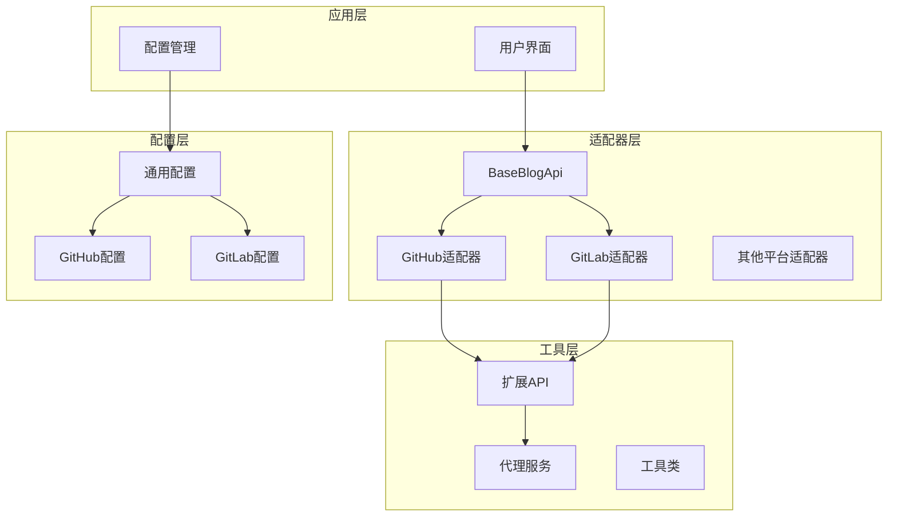
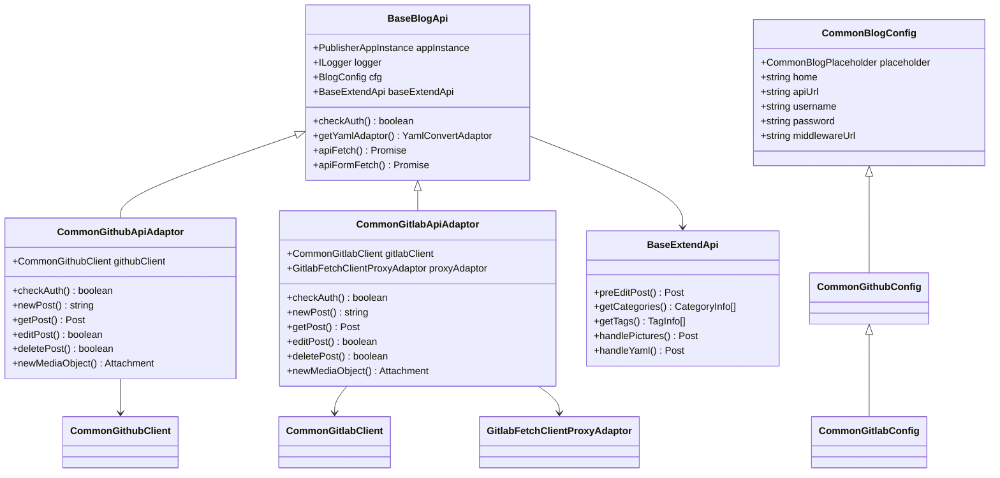
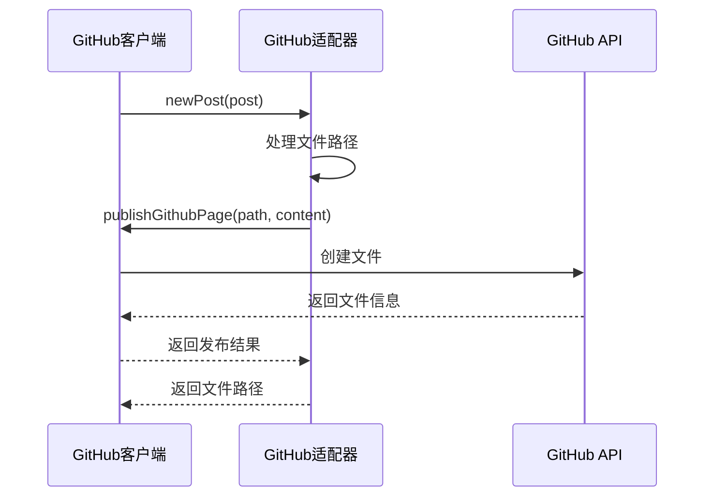
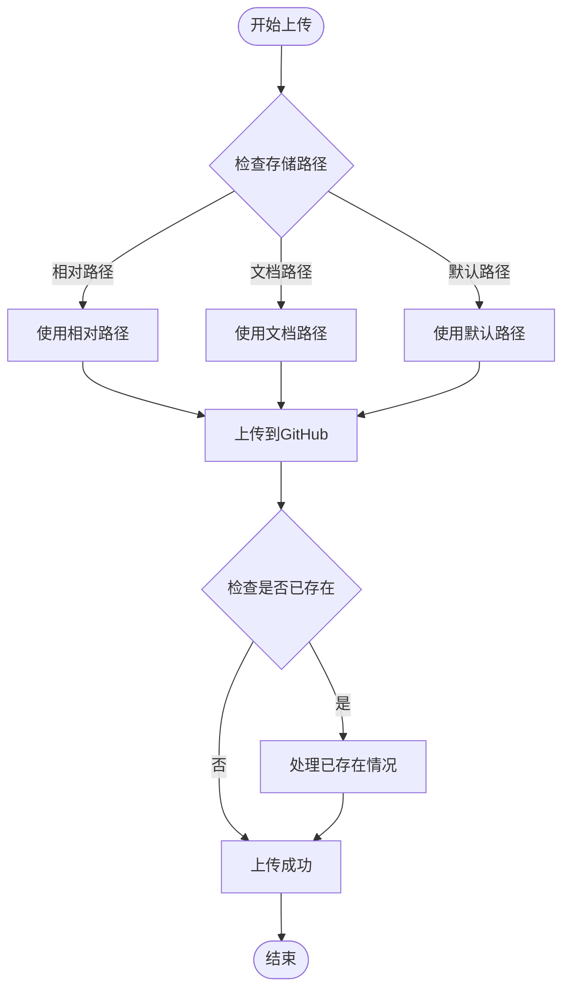
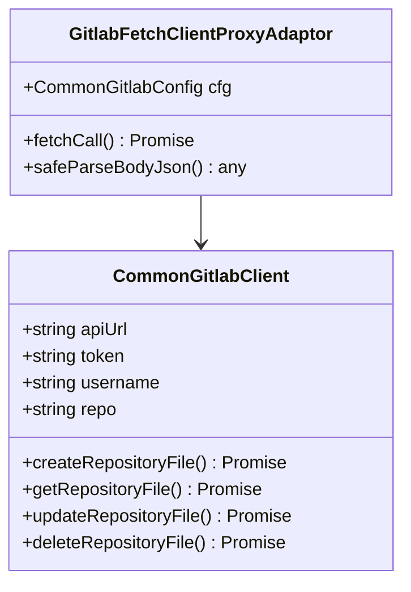
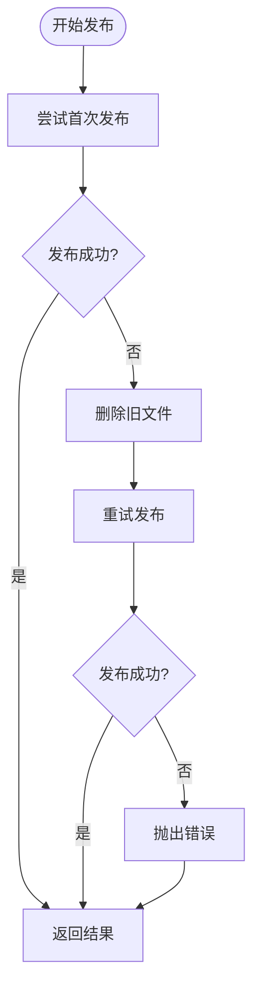
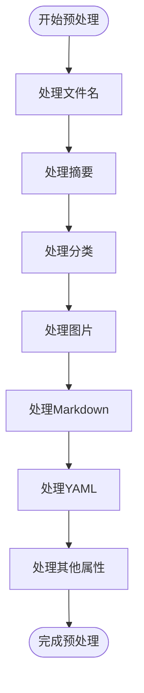
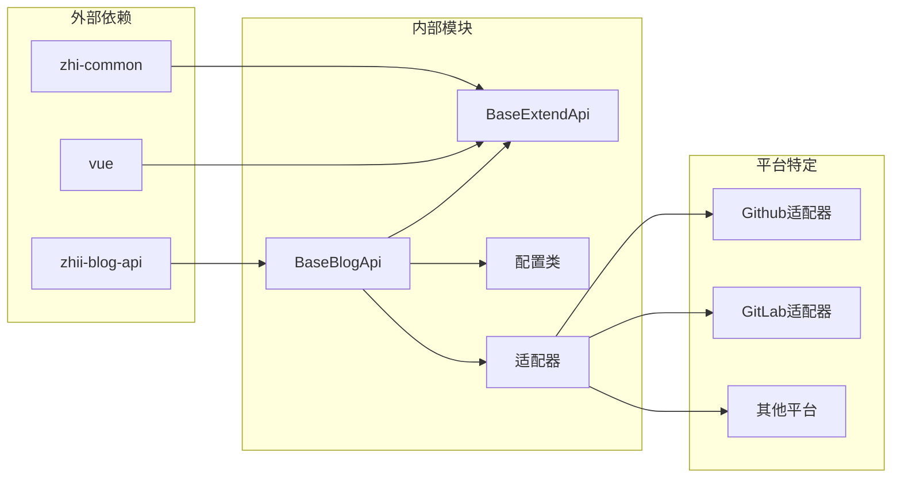
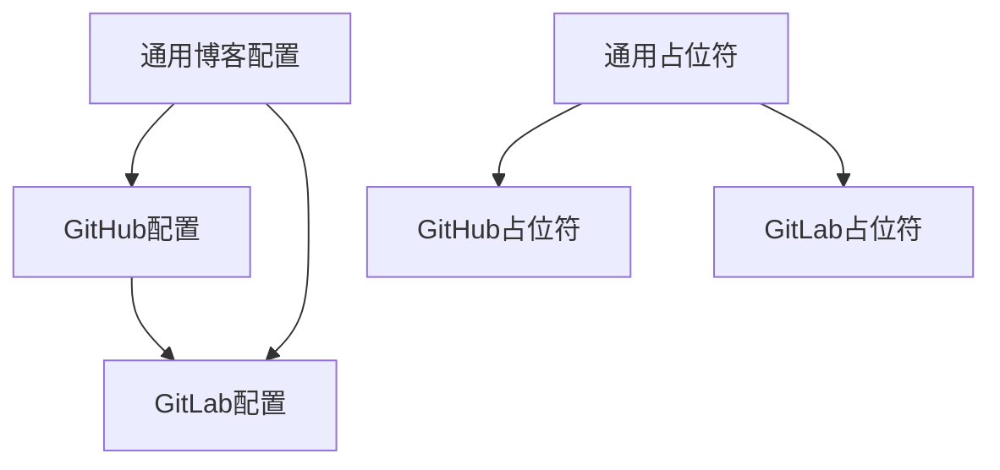

# 博客平台基础架构

<cite>
**本文档引用的文件**
- [baseBlogApi.ts](file://src/adaptors/api/base/baseBlogApi.ts)
- [commonBlogConfig.ts](file://src/adaptors/api/base/commonBlogConfig.ts)
- [commonBlogPlaceholder.ts](file://src/adaptors/api/base/commonBlogPlaceholder.ts)
- [commonGithubApiAdaptor.ts](file://src/adaptors/api/base/github/commonGithubApiAdaptor.ts)
- [commonGithubConfig.ts](file://src/adaptors/api/base/github/commonGithubConfig.ts)
- [commonGithubPlaceholder.ts](file://src/adaptors/api/base/github/commonGithubPlaceholder.ts)
- [commonGitlabApiAdaptor.ts](file://src/adaptors/api/base/gitlab/commonGitlabApiAdaptor.ts)
- [commonGitlabConfig.ts](file://src/adaptors/api/base/gitlab/commonGitlabConfig.ts)
- [commonGitlabPlaceholder.ts](file://src/adaptors/api/base/gitlab/commonGitlabPlaceholder.ts)
- [gitlabFetchClientProxyAdaptor.ts](file://src/adaptors/api/base/gitlab/gitlabFetchClientProxyAdaptor.ts)
- [baseExtendApi.ts](file://src/adaptors/base/baseExtendApi.ts)
</cite>

## 目录
1. [简介](#简介)
2. [项目结构](#项目结构)
3. [核心组件](#核心组件)
4. [架构概览](#架构概览)
5. [详细组件分析](#详细组件分析)
6. [依赖关系分析](#依赖关系分析)
7. [性能考虑](#性能考虑)
8. [故障排除指南](#故障排除指南)
9. [结论](#结论)
10. [附录](#附录)

## 简介

本项目是一个博客平台基础架构系统，专注于为各种博客平台提供统一的适配器模式解决方案。该架构采用模块化设计，支持多种博客平台，包括基于版本控制的GitHub Pages和GitLab Pages，以及其他传统博客API。

系统的核心设计理念是通过BaseBlogApi抽象基类提供统一的API接口，通过具体的适配器实现不同平台的特定功能。这种设计模式使得新增支持新的博客平台变得简单而标准化。

## 项目结构

项目采用分层架构设计，主要分为以下几个层次：

**图表来源**
- [baseBlogApi.ts:1-205](file://src/adaptors/api/base/baseBlogApi.ts#L1-L205)
- [commonBlogConfig.ts:1-42](file://src/adaptors/api/base/commonBlogConfig.ts#L1-L42)
- [baseExtendApi.ts:1-739](file://src/adaptors/base/baseExtendApi.ts#L1-L739)

**章节来源**
- [baseBlogApi.ts:1-205](file://src/adaptors/api/base/baseBlogApi.ts#L1-L205)
- [commonBlogConfig.ts:1-42](file://src/adaptors/api/base/commonBlogConfig.ts#L1-L42)
- [baseExtendApi.ts:1-739](file://src/adaptors/base/baseExtendApi.ts#L1-L739)

## 核心组件

### BaseBlogApi 抽象基类

BaseBlogApi是整个架构的核心抽象类，提供了所有博客平台适配器的基础功能。它继承自BlogApi，包含了认证检查、API请求代理、表单处理等通用功能。

**主要特性：**
- 统一的认证检查机制
- 智能的API请求代理（支持CORS代理和直接请求）
- 表单数据处理支持
- 日志记录和错误处理
- YAML转换适配器集成

**章节来源**
- [baseBlogApi.ts:27-205](file://src/adaptors/api/base/baseBlogApi.ts#L27-L205)

### 通用配置管理

系统采用分层配置管理策略，通过CommonBlogConfig提供基础配置，具体平台通过继承实现特定配置。

**配置层次结构：**
- CommonBlogConfig：提供基础博客配置
- CommonGithubConfig：GitHub特有配置
- CommonGitlabConfig：GitLab特有配置

**章节来源**
- [commonBlogConfig.ts:13-42](file://src/adaptors/api/base/commonBlogConfig.ts#L13-L42)
- [commonGithubConfig.ts:17-112](file://src/adaptors/api/base/github/commonGithubConfig.ts#L17-L112)
- [commonGitlabConfig.ts:15-18](file://src/adaptors/api/base/gitlab/commonGitlabConfig.ts#L15-L18)

### 占位符机制

占位符机制是系统的重要特性，允许动态替换URL中的变量。这种机制在预览URL生成和文件路径处理中发挥重要作用。

**支持的占位符：**
- `[user]`：用户名
- `[repo]`：仓库名
- `[branch]`：分支名
- `[docpath]`：文档路径
- `[postid]`：文章ID

**章节来源**
- [commonGithubConfig.ts:55-106](file://src/adaptors/api/base/github/commonGithubConfig.ts#L55-L106)
- [commonGithubApiAdaptor.ts:225-249](file://src/adaptors/api/base/github/commonGithubApiAdaptor.ts#L225-L249)
- [commonGitlabApiAdaptor.ts:201-225](file://src/adaptors/api/base/gitlab/commonGitlabApiAdaptor.ts#L201-L225)

## 架构概览

系统采用适配器模式和策略模式相结合的设计，提供高度可扩展的架构：

**图表来源**
- [baseBlogApi.ts:27-205](file://src/adaptors/api/base/baseBlogApi.ts#L27-L205)
- [commonBlogConfig.ts:13-42](file://src/adaptors/api/base/commonBlogConfig.ts#L13-L42)
- [commonGithubApiAdaptor.ts:28-352](file://src/adaptors/api/base/github/commonGithubApiAdaptor.ts#L28-L352)
- [commonGitlabApiAdaptor.ts:30-300](file://src/adaptors/api/base/gitlab/commonGitlabApiAdaptor.ts#L30-L300)
- [baseExtendApi.ts:55-739](file://src/adaptors/base/baseExtendApi.ts#L55-L739)

## 详细组件分析

### GitHub Pages 适配方案

GitHub适配器是系统中最完善的版本控制博客平台适配器，提供了完整的CRUD操作和媒体文件处理功能。

#### 核心功能实现

**文章发布流程：**

**图表来源**
- [commonGithubApiAdaptor.ts:86-128](file://src/adaptors/api/base/github/commonGithubApiAdaptor.ts#L86-L128)
- [commonGithubApiAdaptor.ts:165-210](file://src/adaptors/api/base/github/commonGithubApiAdaptor.ts#L165-L210)

**文件命名规则：**
系统支持灵活的文件命名规则，包括日期、分类、标签等占位符：
- `[yyyy]`：年份
- `[MM]`：月份  
- `[dd]`：日期
- `[slug]`：文章别名
- `[filename]`：原始文件名

**章节来源**
- [commonGithubApiAdaptor.ts:86-210](file://src/adaptors/api/base/github/commonGithubApiAdaptor.ts#L86-L210)
- [commonGithubConfig.ts:54-106](file://src/adaptors/api/base/github/commonGithubConfig.ts#L54-L106)

#### 媒体文件处理

GitHub适配器提供了完整的媒体文件处理功能，支持图片上传和链接生成：

**图片上传流程：**

**图表来源**
- [commonGithubApiAdaptor.ts:251-309](file://src/adaptors/api/base/github/commonGithubApiAdaptor.ts#L251-L309)
- [commonGithubApiAdaptor.ts:314-340](file://src/adaptors/api/base/github/commonGithubApiAdaptor.ts#L314-L340)

**章节来源**
- [commonGithubApiAdaptor.ts:251-340](file://src/adaptors/api/base/github/commonGithubApiAdaptor.ts#L251-L340)

### GitLab Pages 适配方案

GitLab适配器基于GitLab的API实现了类似的功能，但由于GitLab的API限制，实现上有一些差异。

#### API代理机制

GitLab适配器采用了特殊的代理机制来处理API调用：

**代理适配器设计：**

**图表来源**
- [gitlabFetchClientProxyAdaptor.ts:25-83](file://src/adaptors/api/base/gitlab/gitlabFetchClientProxyAdaptor.ts#L25-L83)
- [commonGitlabApiAdaptor.ts:34-55](file://src/adaptors/api/base/gitlab/commonGitlabApiAdaptor.ts#L34-L55)

**章节来源**
- [gitlabFetchClientProxyAdaptor.ts:25-83](file://src/adaptors/api/base/gitlab/gitlabFetchClientProxyAdaptor.ts#L25-L83)
- [commonGitlabApiAdaptor.ts:34-55](file://src/adaptors/api/base/gitlab/commonGitlabApiAdaptor.ts#L34-L55)

#### 错误处理和重试机制

GitLab适配器实现了智能的错误处理和重试机制：

**重试逻辑：**

**图表来源**
- [commonGithubApiAdaptor.ts:112-125](file://src/adaptors/api/base/github/commonGithubApiAdaptor.ts#L112-L125)
- [commonGitlabApiAdaptor.ts:120-133](file://src/adaptors/api/base/gitlab/commonGitlabApiAdaptor.ts#L120-L133)

**章节来源**
- [commonGithubApiAdaptor.ts:112-125](file://src/adaptors/api/base/github/commonGithubApiAdaptor.ts#L112-L125)
- [commonGitlabApiAdaptor.ts:120-133](file://src/adaptors/api/base/gitlab/commonGitlabApiAdaptor.ts#L120-L133)

### 扩展API处理机制

BaseExtendApi提供了统一的文章预处理功能，确保不同平台的一致性：

**预处理流程：**

**图表来源**
- [baseExtendApi.ts:90-106](file://src/adaptors/base/baseExtendApi.ts#L90-L106)
- [baseExtendApi.ts:150-211](file://src/adaptors/base/baseExtendApi.ts#L150-L211)

**章节来源**
- [baseExtendApi.ts:90-106](file://src/adaptors/base/baseExtendApi.ts#L90-L106)
- [baseExtendApi.ts:150-211](file://src/adaptors/base/baseExtendApi.ts#L150-L211)

## 依赖关系分析

系统采用松耦合的设计，通过接口和抽象类实现模块间的解耦：

**图表来源**
- [baseBlogApi.ts:10-18](file://src/adaptors/api/base/baseBlogApi.ts#L10-L18)
- [baseExtendApi.ts:10-47](file://src/adaptors/base/baseExtendApi.ts#L10-L47)

**章节来源**
- [baseBlogApi.ts:10-18](file://src/adaptors/api/base/baseBlogApi.ts#L10-L18)
- [baseExtendApi.ts:10-47](file://src/adaptors/base/baseExtendApi.ts#L10-L47)

### 设计原则和扩展机制

系统遵循以下设计原则：

1. **开闭原则**：对扩展开放，对修改封闭
2. **依赖倒置**：依赖于抽象而非具体实现
3. **单一职责**：每个类都有明确的职责分工

**扩展开发指南：**

1. **继承BaseBlogApi**：实现基本的博客API功能
2. **实现配置类**：继承相应的配置基类
3. **实现适配器**：覆盖必要的方法
4. **注册到系统**：在配置中注册新的适配器

**章节来源**
- [baseBlogApi.ts:27-54](file://src/adaptors/api/base/baseBlogApi.ts#L27-L54)
- [commonBlogConfig.ts:13-41](file://src/adaptors/api/base/commonBlogConfig.ts#L13-L41)

## 性能考虑

系统在设计时充分考虑了性能优化：

### 缓存策略
- API响应缓存
- 配置信息缓存
- 图片资源缓存

### 异步处理
- 所有网络请求都采用异步处理
- 支持并发请求
- 错误重试机制

### 内存管理
- 及时释放大对象
- 避免内存泄漏
- 合理使用WeakMap

## 故障排除指南

### 常见问题和解决方案

**认证失败：**
- 检查token是否有效
- 验证权限范围
- 确认网络连接

**API调用错误：**
- 查看详细的错误日志
- 检查请求参数
- 验证URL格式

**图片上传失败：**
- 检查文件大小限制
- 验证文件格式
- 确认存储路径

**章节来源**
- [baseBlogApi.ts:56-62](file://src/adaptors/api/base/baseBlogApi.ts#L56-L62)
- [commonGithubApiAdaptor.ts:49-64](file://src/adaptors/api/base/github/commonGithubApiAdaptor.ts#L49-L64)
- [commonGitlabApiAdaptor.ts:57-72](file://src/adaptors/api/base/gitlab/commonGitlabApiAdaptor.ts#L57-L72)

## 结论

本博客平台基础架构通过精心设计的适配器模式，为多种博客平台提供了统一的抽象接口。系统具有以下优势：

1. **高度可扩展**：支持轻松添加新的博客平台
2. **统一接口**：不同平台使用相同的编程接口
3. **灵活配置**：支持复杂的配置定制
4. **健壮性**：完善的错误处理和重试机制
5. **性能优化**：合理的缓存和异步处理策略

该架构为构建博客发布系统奠定了坚实的基础，为未来的功能扩展和技术演进提供了良好的支撑。

## 附录

### 配置继承规则

系统采用多层继承的配置管理策略：

**图表来源**
- [commonBlogConfig.ts:13-41](file://src/adaptors/api/base/commonBlogConfig.ts#L13-L41)
- [commonGithubConfig.ts:17-108](file://src/adaptors/api/base/github/commonGithubConfig.ts#L17-L108)
- [commonGitlabConfig.ts:15-17](file://src/adaptors/api/base/gitlab/commonGitlabConfig.ts#L15-L17)

### 接口规范

系统定义了清晰的接口规范，确保各组件间的兼容性：

**核心接口：**
- BlogApi：基础博客API接口
- YamlConvertAdaptor：YAML转换适配器接口
- ICommonFetchClient：通用HTTP客户端接口

**章节来源**
- [baseBlogApi.ts:10-18](file://src/adaptors/api/base/baseBlogApi.ts#L10-L18)
- [baseExtendApi.ts:14-29](file://src/adaptors/base/baseExtendApi.ts#L14-L29)