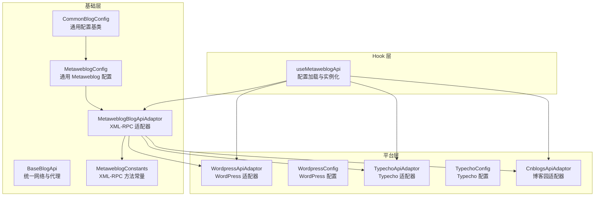
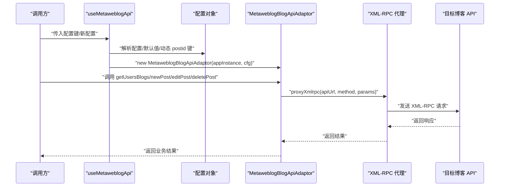
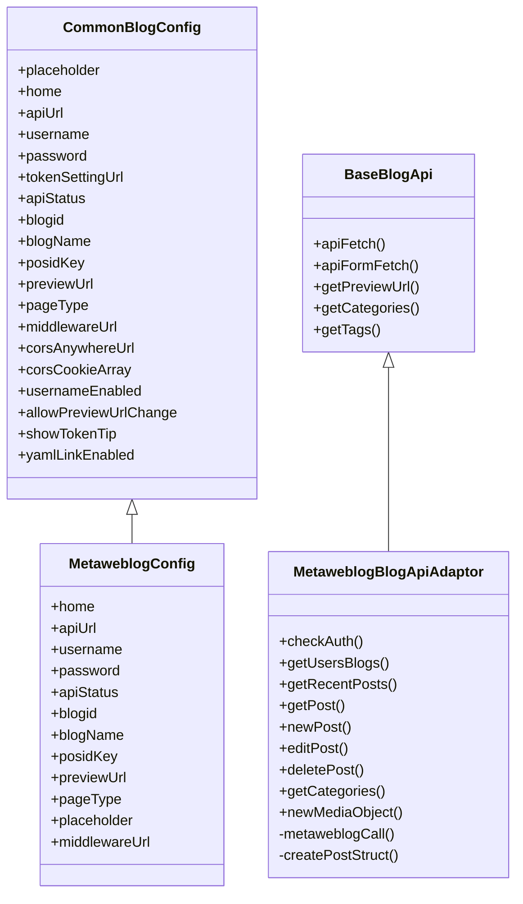
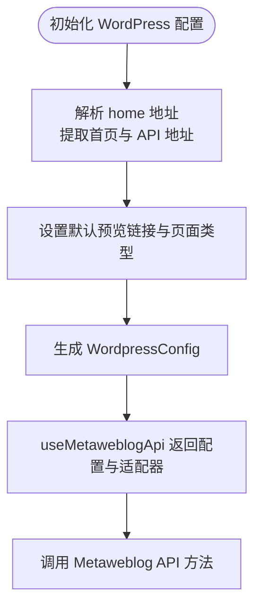
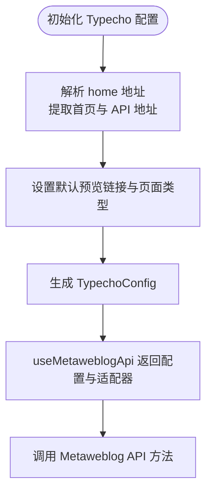
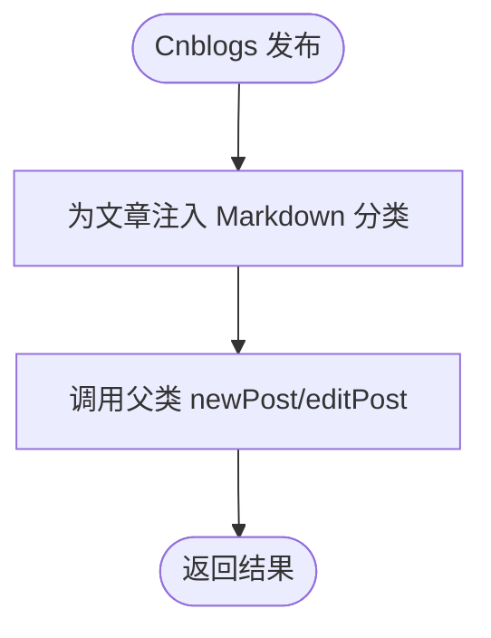
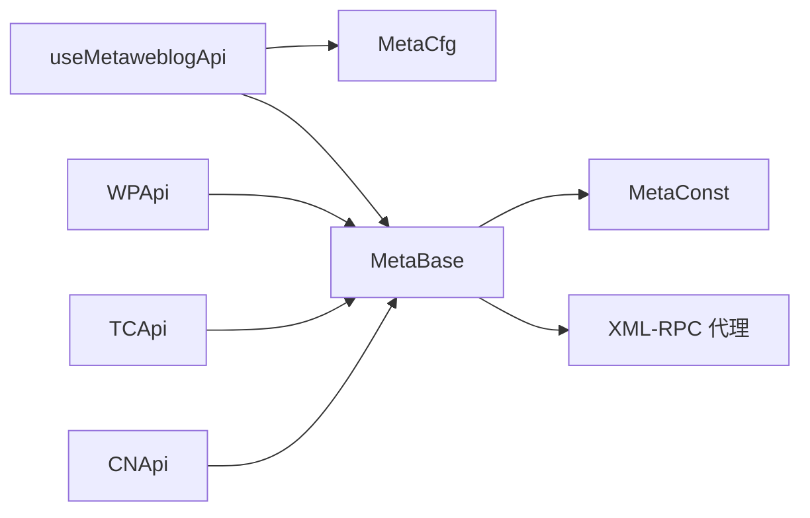

# 博客平台适配器

<cite>
**本文引用的文件**
- [src/adaptors/api/base/baseBlogApi.ts](file://src/adaptors/api/base/baseBlogApi.ts)
- [src/adaptors/api/base/metaweblog/metaweblogBlogApiAdaptor.ts](file://src/adaptors/api/base/metaweblog/metaweblogBlogApiAdaptor.ts)
- [src/adaptors/api/base/metaweblog/metaweblogConfig.ts](file://src/adaptors/api/base/metaweblog/metaweblogConfig.ts)
- [src/adaptors/api/base/metaweblog/metaweblogConstants.ts](file://src/adaptors/api/base/metaweblog/metaweblogConstants.ts)
- [src/adaptors/api/base/commonBlogConfig.ts](file://src/adaptors/api/base/commonBlogConfig.ts)
- [src/adaptors/api/metaweblog/useMetaweblogApi.ts](file://src/adaptors/api/metaweblog/useMetaweblogApi.ts)
- [src/adaptors/api/wordpress/wordpressApiAdaptor.ts](file://src/adaptors/api/wordpress/wordpressApiAdaptor.ts)
- [src/adaptors/api/wordpress/wordpressConfig.ts](file://src/adaptors/api/wordpress/wordpressConfig.ts)
- [src/adaptors/api/typecho/typechoApiAdaptor.ts](file://src/adaptors/api/typecho/typechoApiAdaptor.ts)
- [src/adaptors/api/typecho/typechoConfig.ts](file://src/adaptors/api/typecho/typechoConfig.ts)
- [src/adaptors/api/cnblogs/cnblogsApiAdaptor.ts](file://src/adaptors/api/cnblogs/cnblogsApiAdaptor.ts)
</cite>

## 目录
1. [简介](#简介)
2. [项目结构](#项目结构)
3. [核心组件](#核心组件)
4. [架构总览](#架构总览)
5. [详细组件分析](#详细组件分析)
6. [依赖关系分析](#依赖关系分析)
7. [性能考量](#性能考量)
8. [故障排除指南](#故障排除指南)
9. [结论](#结论)
10. [附录](#附录)

## 简介
本文件面向“博客平台适配器”，聚焦于基于 Metaweblog/XML-RPC 的适配器实现与扩展，系统性说明 WordPress、Typecho、博客园（Cnblogs）等平台的适配方案。内容涵盖：
- Metaweblog 协议适配器的实现原理与调用流程
- 各平台 API 差异、认证机制与文章发布流程
- 配置文件编写指南：API 地址、认证参数、发布选项
- 共同点与差异化处理策略
- 故障排除与最佳实践

## 项目结构
本项目采用“适配器+平台配置”的分层设计：
- 基础层：通用博客 API 基类与 Metaweblog 基类，封装统一的网络请求、代理与工具方法
- 平台层：针对 WordPress、Typecho、博客园分别提供专用配置与适配器，继承自 Metaweblog 基类
- Hook 层：对外暴露 useMetaweblogApi 等组合式函数，负责读取配置、初始化适配器并返回可直接使用的 API 实例

图表来源
- [src/adaptors/api/base/baseBlogApi.ts:1-205](file://src/adaptors/api/base/baseBlogApi.ts#L1-L205)
- [src/adaptors/api/base/metaweblog/metaweblogBlogApiAdaptor.ts:1-321](file://src/adaptors/api/base/metaweblog/metaweblogBlogApiAdaptor.ts#L1-L321)
- [src/adaptors/api/base/metaweblog/metaweblogConfig.ts:1-101](file://src/adaptors/api/base/metaweblog/metaweblogConfig.ts#L1-L101)
- [src/adaptors/api/base/metaweblog/metaweblogConstants.ts:1-29](file://src/adaptors/api/base/metaweblog/metaweblogConstants.ts#L1-L29)
- [src/adaptors/api/base/commonBlogConfig.ts:1-42](file://src/adaptors/api/base/commonBlogConfig.ts#L1-L42)
- [src/adaptors/api/metaweblog/useMetaweblogApi.ts:1-90](file://src/adaptors/api/metaweblog/useMetaweblogApi.ts#L1-L90)
- [src/adaptors/api/wordpress/wordpressApiAdaptor.ts:1-37](file://src/adaptors/api/wordpress/wordpressApiAdaptor.ts#L1-L37)
- [src/adaptors/api/wordpress/wordpressConfig.ts:1-49](file://src/adaptors/api/wordpress/wordpressConfig.ts#L1-L49)
- [src/adaptors/api/typecho/typechoApiAdaptor.ts:1-36](file://src/adaptors/api/typecho/typechoApiAdaptor.ts#L1-L36)
- [src/adaptors/api/typecho/typechoConfig.ts:1-48](file://src/adaptors/api/typecho/typechoConfig.ts#L1-L48)
- [src/adaptors/api/cnblogs/cnblogsApiAdaptor.ts:1-131](file://src/adaptors/api/cnblogs/cnblogsApiAdaptor.ts#L1-L131)

章节来源
- [src/adaptors/api/base/baseBlogApi.ts:1-205](file://src/adaptors/api/base/baseBlogApi.ts#L1-L205)
- [src/adaptors/api/base/metaweblog/metaweblogBlogApiAdaptor.ts:1-321](file://src/adaptors/api/base/metaweblog/metaweblogBlogApiAdaptor.ts#L1-L321)
- [src/adaptors/api/base/metaweblog/metaweblogConfig.ts:1-101](file://src/adaptors/api/base/metaweblog/metaweblogConfig.ts#L1-L101)
- [src/adaptors/api/base/metaweblog/metaweblogConstants.ts:1-29](file://src/adaptors/api/base/metaweblog/metaweblogConstants.ts#L1-L29)
- [src/adaptors/api/base/commonBlogConfig.ts:1-42](file://src/adaptors/api/base/commonBlogConfig.ts#L1-L42)
- [src/adaptors/api/metaweblog/useMetaweblogApi.ts:1-90](file://src/adaptors/api/metaweblog/useMetaweblogApi.ts#L1-L90)
- [src/adaptors/api/wordpress/wordpressApiAdaptor.ts:1-37](file://src/adaptors/api/wordpress/wordpressApiAdaptor.ts#L1-L37)
- [src/adaptors/api/wordpress/wordpressConfig.ts:1-49](file://src/adaptors/api/wordpress/wordpressConfig.ts#L1-L49)
- [src/adaptors/api/typecho/typechoApiAdaptor.ts:1-36](file://src/adaptors/api/typecho/typechoApiAdaptor.ts#L1-L36)
- [src/adaptors/api/typecho/typechoConfig.ts:1-48](file://src/adaptors/api/typecho/typechoConfig.ts#L1-L48)
- [src/adaptors/api/cnblogs/cnblogsApiAdaptor.ts:1-131](file://src/adaptors/api/cnblogs/cnblogsApiAdaptor.ts#L1-L131)

## 核心组件
- 统一博客 API 基类（BaseBlogApi）
  - 封装网络请求与代理选择逻辑，支持“Siyuan 内置代理”和“CORS 代理”
  - 提供表单提交、JSON 请求、预览链接生成、分类/标签获取等通用能力
- Metaweblog 协议适配器（MetaweblogBlogApiAdaptor）
  - 通过 XML-RPC 方法常量调用 metaWeblog.* 接口
  - 支持用户博客列表、最近文章、文章 CRUD、分类、媒体对象上传
- 平台配置与适配器
  - MetaweblogConfig：通用 Metaweblog 配置项（首页、API 地址、用户名、密码、中间件、预览链接等）
  - 平台专用配置：WordPressConfig、TypechoConfig 在通用配置基础上解析 home 并设置默认预览链接与页面类型
  - 平台专用适配器：WordPressApiAdaptor、TypechoApiAdaptor、CnblogsApiAdaptor 继承自 Metaweblog 基类，按需覆写行为（如博客园强制 Markdown 分类）

章节来源
- [src/adaptors/api/base/baseBlogApi.ts:93-199](file://src/adaptors/api/base/baseBlogApi.ts#L93-L199)
- [src/adaptors/api/base/metaweblog/metaweblogBlogApiAdaptor.ts:48-186](file://src/adaptors/api/base/metaweblog/metaweblogBlogApiAdaptor.ts#L48-L186)
- [src/adaptors/api/base/metaweblog/metaweblogConfig.ts:17-99](file://src/adaptors/api/base/metaweblog/metaweblogConfig.ts#L17-L99)
- [src/adaptors/api/wordpress/wordpressConfig.ts:20-45](file://src/adaptors/api/wordpress/wordpressConfig.ts#L20-L45)
- [src/adaptors/api/typecho/typechoConfig.ts:20-44](file://src/adaptors/api/typecho/typechoConfig.ts#L20-L44)
- [src/adaptors/api/wordpress/wordpressApiAdaptor.ts:22-33](file://src/adaptors/api/wordpress/wordpressApiAdaptor.ts#L22-L33)
- [src/adaptors/api/typecho/typechoApiAdaptor.ts:22-33](file://src/adaptors/api/typecho/typechoApiAdaptor.ts#L22-L33)
- [src/adaptors/api/cnblogs/cnblogsApiAdaptor.ts:27-76](file://src/adaptors/api/cnblogs/cnblogsApiAdaptor.ts#L27-L76)

## 架构总览
Metaweblog 适配器遵循“配置驱动 + 适配器扩展”的模式：
- useMetaweblogApi 负责读取持久化配置或环境变量，构造 MetaweblogConfig 或平台专用配置
- 通过 MetaweblogBlogApiAdaptor 统一执行 XML-RPC 调用
- 平台适配器在必要时覆写方法（如博客园强制 Markdown 分类、预览链接拼接）

图表来源
- [src/adaptors/api/metaweblog/useMetaweblogApi.ts:30-88](file://src/adaptors/api/metaweblog/useMetaweblogApi.ts#L30-L88)
- [src/adaptors/api/base/metaweblog/metaweblogBlogApiAdaptor.ts:48-241](file://src/adaptors/api/base/metaweblog/metaweblogBlogApiAdaptor.ts#L48-L241)

## 详细组件分析

### Metaweblog 基类与通用配置
- BaseBlogApi
  - 提供 apiFetch 与 apiFormFetch，自动选择代理策略（Siyuan 内置代理优先，否则回退到 CORS 代理）
  - 提供预览链接生成、分类/标签获取、文章发布前处理等通用能力
- MetaweblogBlogApiAdaptor
  - 定义 metaWeblog.* 方法常量，封装 XML-RPC 调用
  - 实现 getUsersBlogs、getRecentPosts、getPost、newPost、editPost、deletePost、getCategories、newMediaObject
  - 文章状态与字段映射：标题、关键词、摘要、正文、slug、分类、状态、密码等
- MetaweblogConstants
  - 统一管理 metaWeblog.* 方法名，便于扩展与维护
- MetaweblogConfig 与 CommonBlogConfig
  - CommonBlogConfig 提供通用字段与默认行为
  - MetaweblogConfig 在此基础上增加 blogid、blogName、posidKey、previewUrl、pageType、中间件等

图表来源
- [src/adaptors/api/base/commonBlogConfig.ts:13-41](file://src/adaptors/api/base/commonBlogConfig.ts#L13-L41)
- [src/adaptors/api/base/metaweblog/metaweblogConfig.ts:17-99](file://src/adaptors/api/base/metaweblog/metaweblogConfig.ts#L17-L99)
- [src/adaptors/api/base/baseBlogApi.ts:27-199](file://src/adaptors/api/base/baseBlogApi.ts#L27-L199)
- [src/adaptors/api/base/metaweblog/metaweblogBlogApiAdaptor.ts:26-318](file://src/adaptors/api/base/metaweblog/metaweblogBlogApiAdaptor.ts#L26-L318)

章节来源
- [src/adaptors/api/base/baseBlogApi.ts:93-199](file://src/adaptors/api/base/baseBlogApi.ts#L93-L199)
- [src/adaptors/api/base/metaweblog/metaweblogBlogApiAdaptor.ts:48-318](file://src/adaptors/api/base/metaweblog/metaweblogBlogApiAdaptor.ts#L48-L318)
- [src/adaptors/api/base/metaweblog/metaweblogConstants.ts:17-26](file://src/adaptors/api/base/metaweblog/metaweblogConstants.ts#L17-L26)
- [src/adaptors/api/base/metaweblog/metaweblogConfig.ts:17-99](file://src/adaptors/api/base/metaweblog/metaweblogConfig.ts#L17-L99)
- [src/adaptors/api/base/commonBlogConfig.ts:13-41](file://src/adaptors/api/base/commonBlogConfig.ts#L13-L41)

### WordPress 适配方案
- 配置解析
  - 通过 WordPressUtils 解析 home 地址，自动提取首页与 API 地址
  - 默认预览链接为 “/?p=[postid]”，页面类型为 Html
- 适配器行为
  - 继承 Metaweblog 基类，复用统一的 XML-RPC 调用
  - 无需覆写方法即可满足标准 WordPress MetaWeblog 行为

图表来源
- [src/adaptors/api/wordpress/wordpressConfig.ts:29-45](file://src/adaptors/api/wordpress/wordpressConfig.ts#L29-L45)
- [src/adaptors/api/metaweblog/useMetaweblogApi.ts:79-88](file://src/adaptors/api/metaweblog/useMetaweblogApi.ts#L79-L88)

章节来源
- [src/adaptors/api/wordpress/wordpressApiAdaptor.ts:22-33](file://src/adaptors/api/wordpress/wordpressApiAdaptor.ts#L22-L33)
- [src/adaptors/api/wordpress/wordpressConfig.ts:20-45](file://src/adaptors/api/wordpress/wordpressConfig.ts#L20-L45)

### Typecho 适配方案
- 配置解析
  - 通过 TypechoUtils 解析 home 地址，自动提取首页与 API 地址
  - 默认预览链接为 “/index.php/archives/[postid]”，页面类型为 Html
- 适配器行为
  - 继承 Metaweblog 基类，复用统一的 XML-RPC 调用
  - 无需覆写方法即可满足标准 Typecho MetaWeblog 行为

图表来源
- [src/adaptors/api/typecho/typechoConfig.ts:29-44](file://src/adaptors/api/typecho/typechoConfig.ts#L29-L44)
- [src/adaptors/api/metaweblog/useMetaweblogApi.ts:79-88](file://src/adaptors/api/metaweblog/useMetaweblogApi.ts#L79-L88)

章节来源
- [src/adaptors/api/typecho/typechoApiAdaptor.ts:22-33](file://src/adaptors/api/typecho/typechoApiAdaptor.ts#L22-L33)
- [src/adaptors/api/typecho/typechoConfig.ts:20-44](file://src/adaptors/api/typecho/typechoConfig.ts#L20-L44)

### 博客园（Cnblogs）适配方案
- 特殊处理
  - 强制为每篇文章添加 Markdown 分类，避免纯文本渲染问题
  - 预览链接需要从 API 地址中提取用户 ID，再进行占位符替换
  - 分类接口返回的 Markdown 分类默认不展示
- 适配器行为
  - 继承 Metaweblog 基类，覆写 newPost/editPost 以注入 Markdown 分类
  - 覆写 getCategories 以过滤 Markdown 分类
  - 覆写 getPreviewUrl 以支持用户 ID 占位符

图表来源
- [src/adaptors/api/cnblogs/cnblogsApiAdaptor.ts:53-63](file://src/adaptors/api/cnblogs/cnblogsApiAdaptor.ts#L53-L63)
- [src/adaptors/api/cnblogs/cnblogsApiAdaptor.ts:121-128](file://src/adaptors/api/cnblogs/cnblogsApiAdaptor.ts#L121-L128)

章节来源
- [src/adaptors/api/cnblogs/cnblogsApiAdaptor.ts:27-131](file://src/adaptors/api/cnblogs/cnblogsApiAdaptor.ts#L27-L131)

### 配置文件编写指南
- 通用字段
  - home：博客首页地址
  - apiUrl：MetaWeblog API 地址（WordPress/Typecho 由 home 解析得到）
  - username/password：认证凭据
  - middlewareUrl：中间件代理地址（用于解决跨域）
  - previewUrl：预览链接模板（支持 [postid]、[userid] 等占位符）
  - pageType：页面类型（Html/Markdown）
  - blogid/blogName/posidKey：平台标识与文章 ID 映射键
- 平台特定字段
  - WordPress：默认预览链接 “/?p=[postid]”，页面类型 Html
  - Typecho：默认预览链接 “/index.php/archives/[postid]”，页面类型 Html
  - 博客园：预览链接需包含 [userid]，且会自动注入 Markdown 分类
- 发布选项
  - tagEnabled/cateEnabled：是否启用标签/分类
  - categoryType：分类类型（多选/单选）
  - allowCateChange/allowPreviewUrlChange：是否允许修改分类与预览链接
  - knowledgeSpaceEnabled：知识空间支持（当前禁用）
  - picgoPicbedSupported/bundledPicbedSupported：图床支持开关

章节来源
- [src/adaptors/api/base/metaweblog/metaweblogConfig.ts:17-99](file://src/adaptors/api/base/metaweblog/metaweblogConfig.ts#L17-L99)
- [src/adaptors/api/wordpress/wordpressConfig.ts:29-45](file://src/adaptors/api/wordpress/wordpressConfig.ts#L29-L45)
- [src/adaptors/api/typecho/typechoConfig.ts:29-44](file://src/adaptors/api/typecho/typechoConfig.ts#L29-L44)
- [src/adaptors/api/cnblogs/cnblogsApiAdaptor.ts:111-116](file://src/adaptors/api/cnblogs/cnblogsApiAdaptor.ts#L111-L116)

### 认证机制与 API 差异
- 认证机制
  - Metaweblog 通常使用用户名/密码进行认证，部分平台可能支持 Token
  - 通用配置提供 usernameEnabled/showTokenTip 等开关
- API 差异
  - WordPress/Typecho：标准 MetaWeblog 接口，无需特殊处理
  - 博客园：强制 Markdown 分类、预览链接含用户 ID、分类列表需过滤 Markdown 分类
- 文章发布流程
  - 发布前：根据 publish 参数设置文章状态（发布/草稿），字段映射至 metaWeblog 结构
  - 调用 metaWeblog.newPost/metaWeblog.editPost
  - 获取返回的 postid 并生成预览链接

章节来源
- [src/adaptors/api/base/metaweblog/metaweblogBlogApiAdaptor.ts:111-167](file://src/adaptors/api/base/metaweblog/metaweblogBlogApiAdaptor.ts#L111-L167)
- [src/adaptors/api/cnblogs/cnblogsApiAdaptor.ts:53-109](file://src/adaptors/api/cnblogs/cnblogsApiAdaptor.ts#L53-L109)

## 依赖关系分析
- 组件耦合
  - 平台适配器仅依赖 Metaweblog 基类与配置类，保持高内聚低耦合
  - useMetaweblogApi 作为统一入口，负责配置解析与实例化
- 外部依赖
  - XML-RPC 中间件代理：通过 useProxy 注入 proxyXmlrpc
  - 网络请求：BaseBlogApi 统一封装 apiFetch/apiFormFetch
- 循环依赖
  - 未发现循环依赖；平台适配器均向下依赖基类

图表来源
- [src/adaptors/api/metaweblog/useMetaweblogApi.ts:30-88](file://src/adaptors/api/metaweblog/useMetaweblogApi.ts#L30-L88)
- [src/adaptors/api/base/metaweblog/metaweblogBlogApiAdaptor.ts:40-42](file://src/adaptors/api/base/metaweblog/metaweblogBlogApiAdaptor.ts#L40-L42)
- [src/adaptors/api/base/metaweblog/metaweblogConstants.ts:17-26](file://src/adaptors/api/base/metaweblog/metaweblogConstants.ts#L17-L26)
- [src/adaptors/api/wordpress/wordpressApiAdaptor.ts:29-33](file://src/adaptors/api/wordpress/wordpressApiAdaptor.ts#L29-L33)
- [src/adaptors/api/typecho/typechoApiAdaptor.ts:29-33](file://src/adaptors/api/typecho/typechoApiAdaptor.ts#L29-L33)
- [src/adaptors/api/cnblogs/cnblogsApiAdaptor.ts:36-40](file://src/adaptors/api/cnblogs/cnblogsApiAdaptor.ts#L36-L40)

章节来源
- [src/adaptors/api/metaweblog/useMetaweblogApi.ts:30-88](file://src/adaptors/api/metaweblog/useMetaweblogApi.ts#L30-L88)
- [src/adaptors/api/base/baseBlogApi.ts:50-54](file://src/adaptors/api/base/baseBlogApi.ts#L50-L54)
- [src/adaptors/api/base/metaweblog/metaweblogBlogApiAdaptor.ts:40-42](file://src/adaptors/api/base/metaweblog/metaweblogBlogApiAdaptor.ts#L40-L42)

## 性能考量
- 代理选择策略
  - 优先使用内置代理，减少 CORS 限制带来的失败与重试
  - 表单上传场景采用 base64 编解码，确保二进制数据传输稳定
- 字段映射与序列化
  - 文章字段映射在内存中完成，避免多余网络往返
- 日志与可观测性
  - 关键步骤记录日志，便于定位问题与优化性能

## 故障排除指南
- 跨域与代理问题
  - 确认 middlewareUrl 正确配置，优先使用内置代理
  - 若仍失败，尝试切换到 CORS 代理或检查服务器防火墙
- 认证失败
  - 检查 username/password 是否正确
  - 部分平台可能需要 Token，确认配置项是否启用
- 预览链接错误
  - 博客园需确保预览链接包含 [userid] 占位符
  - WordPress/Typecho 默认模板已内置，无需手动修改
- 分类与标签不可见
  - 博客园会过滤 Markdown 分类，属于预期行为
  - 确认平台配置中的 tagEnabled/cateEnabled 与 categoryType 设置

章节来源
- [src/adaptors/api/base/baseBlogApi.ts:121-149](file://src/adaptors/api/base/baseBlogApi.ts#L121-L149)
- [src/adaptors/api/cnblogs/cnblogsApiAdaptor.ts:111-116](file://src/adaptors/api/cnblogs/cnblogsApiAdaptor.ts#L111-L116)
- [src/adaptors/api/wordpress/wordpressConfig.ts:35-35](file://src/adaptors/api/wordpress/wordpressConfig.ts#L35-L35)
- [src/adaptors/api/typecho/typechoConfig.ts:35-35](file://src/adaptors/api/typecho/typechoConfig.ts#L35-L35)

## 结论
本适配器以 Metaweblog/XML-RPC 为核心，通过统一的配置与适配器抽象，实现了对 WordPress、Typecho、博客园等平台的一致化接入。平台差异主要体现在：
- 配置解析（home -> apiUrl）
- 预览链接模板
- 特殊字段处理（博客园强制 Markdown 分类）

该设计具备良好的扩展性，新增平台只需提供对应配置与适配器，即可快速集成。

## 附录
- 关键实现参考路径
  - [Metaweblog 基类实现:26-318](file://src/adaptors/api/base/metaweblog/metaweblogBlogApiAdaptor.ts#L26-L318)
  - [通用配置基类:13-41](file://src/adaptors/api/base/commonBlogConfig.ts#L13-L41)
  - [Metaweblog 通用配置:17-99](file://src/adaptors/api/base/metaweblog/metaweblogConfig.ts#L17-L99)
  - [WordPress 配置:20-45](file://src/adaptors/api/wordpress/wordpressConfig.ts#L20-L45)
  - [Typecho 配置:20-44](file://src/adaptors/api/typecho/typechoConfig.ts#L20-L44)
  - [博客园适配器:27-131](file://src/adaptors/api/cnblogs/cnblogsApiAdaptor.ts#L27-L131)
  - [Hook 初始化:30-88](file://src/adaptors/api/metaweblog/useMetaweblogApi.ts#L30-L88)