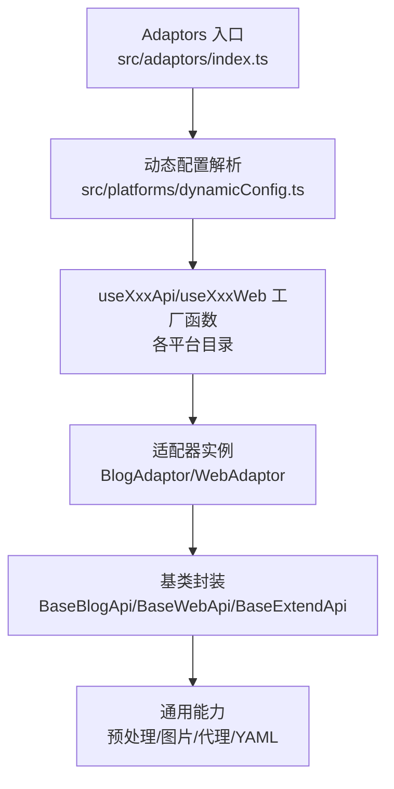
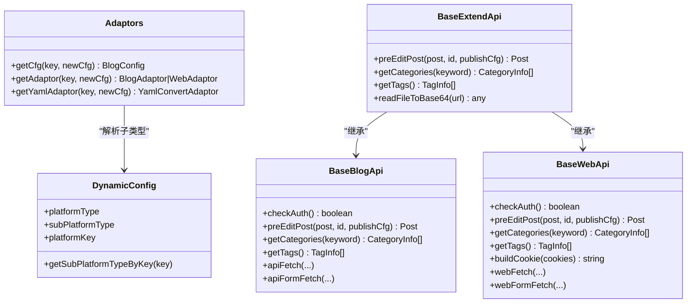
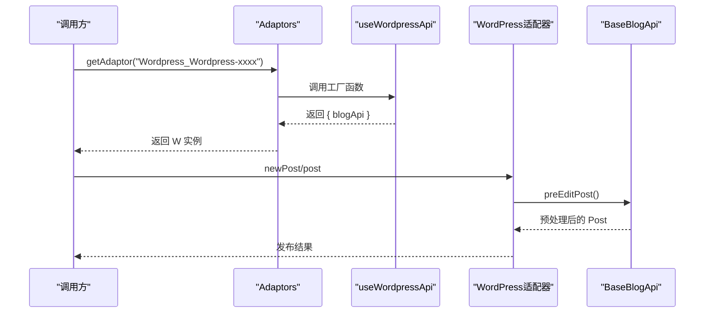
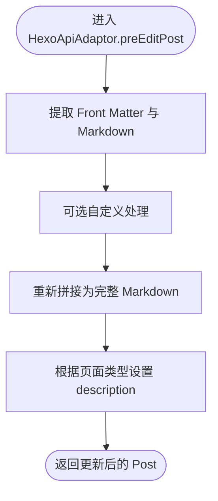
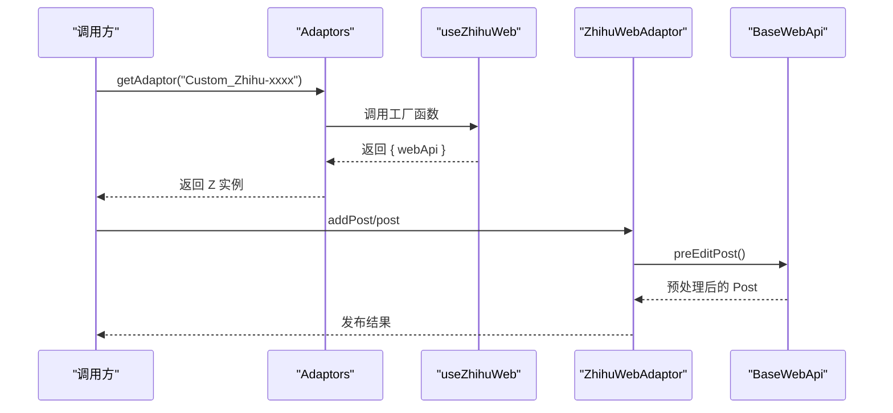
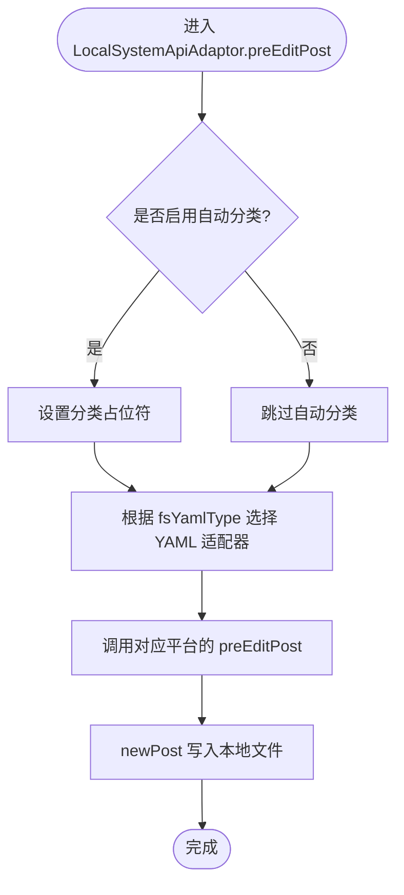
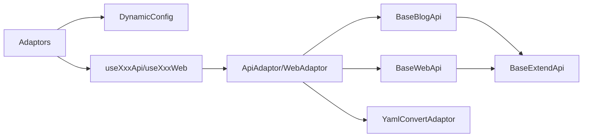

# 平台适配器系统

<cite>
**本文档引用的文件**
- [src/adaptors/index.ts](file://src/adaptors/index.ts)
- [src/adaptors/base/baseExtendApi.ts](file://src/adaptors/base/baseExtendApi.ts)
- [src/adaptors/api/base/baseBlogApi.ts](file://src/adaptors/api/base/baseBlogApi.ts)
- [src/adaptors/web/base/baseWebApi.ts](file://src/adaptors/web/base/baseWebApi.ts)
- [src/platforms/dynamicConfig.ts](file://src/platforms/dynamicConfig.ts)
- [src/adaptors/api/hexo/hexoApiAdaptor.ts](file://src/adaptors/api/hexo/hexoApiAdaptor.ts)
- [src/adaptors/web/zhihu/zhihuWebAdaptor.ts](file://src/adaptors/web/zhihu/zhihuWebAdaptor.ts)
- [src/adaptors/fs/LocalSystem/LocalSystemApiAdaptor.ts](file://src/adaptors/fs/LocalSystem/LocalSystemApiAdaptor.ts)
- [src/adaptors/web/zhihu/zhihuConfig.ts](file://src/adaptors/web/zhihu/zhihuConfig.ts)
- [src/adaptors/fs/LocalSystem/LocalSystemConfig.ts](file://src/adaptors/fs/LocalSystem/LocalSystemConfig.ts)
</cite>

## 目录
1. [简介](#简介)
2. [项目结构](#项目结构)
3. [核心组件](#核心组件)
4. [架构总览](#架构总览)
5. [详细组件分析](#详细组件分析)
6. [依赖关系分析](#依赖关系分析)
7. [性能考量](#性能考量)
8. [故障排查指南](#故障排查指南)
9. [结论](#结论)
10. [附录](#附录)

## 简介
本系统采用适配器模式，通过统一的接口抽象（BlogAdaptor、WebAdaptor、YamlConvertAdaptor）屏蔽不同平台的差异，实现对多种平台的一致化发布能力。系统按平台类型与子类型进行分层组织，覆盖博客平台（Metaweblog、WordPress、Typecho 等）、静态站点（GitHub Pages、Hexo、Hugo 等）、内容平台（语雀、Notion、Confluence 等）、Web 平台（知乎、CSDN、微信公众号等）以及文件系统适配器。

## 项目结构
- 适配器入口与路由：根据平台 key 解析子类型，分发到对应的 useXxxApi/useXxxWeb 工厂函数，返回配置、适配器或 YAML 转换器。
- 基类封装：BaseBlogApi、BaseWebApi、BaseExtendApi 统一封装认证、预处理、图片上传、代理请求、YAML 转换等通用逻辑。
- 平台实现：各平台在各自目录下提供 ApiAdaptor/WebAdaptor/YamlConverterAdaptor，遵循统一接口。
- 动态配置：通过动态配置枚举与工厂函数，支持运行时动态识别平台类型与子类型。

**图表来源**
- [src/adaptors/index.ts:56-573](file://src/adaptors/index.ts#L56-L573)
- [src/platforms/dynamicConfig.ts:397-418](file://src/platforms/dynamicConfig.ts#L397-L418)

**章节来源**
- [src/adaptors/index.ts:56-573](file://src/adaptors/index.ts#L56-L573)
- [src/platforms/dynamicConfig.ts:174-238](file://src/platforms/dynamicConfig.ts#L174-L238)

## 核心组件
- 适配器入口类 Adaptors：提供 getCfg、getAdaptor、getYamlAdaptor 三个静态方法，依据平台 key 的子类型分支，返回配置对象、适配器实例或 YAML 转换器。
- 基类 BaseBlogApi：封装 API 类适配器的通用能力，包括认证检查、预处理、分类与标签获取、代理请求（apiFetch、apiFormFetch）。
- 基类 BaseWebApi：封装 Web 类适配器的通用能力，包括 Cookie 构建、预处理、媒体上传、代理请求（webFetch、webFormFetch）。
- 基类 BaseExtendApi：统一文章预处理流程（文件名、摘要、分类、图片、Markdown、YAML、其他），并提供图片读取、外链替换、消息推送等工具方法。
- 动态配置 DynamicConfig：定义平台类型与子类型枚举，提供平台 key 解析、动态配置集合与工具函数。

**章节来源**
- [src/adaptors/index.ts:56-573](file://src/adaptors/index.ts#L56-L573)
- [src/adaptors/api/base/baseBlogApi.ts:27-205](file://src/adaptors/api/base/baseBlogApi.ts#L27-L205)
- [src/adaptors/web/base/baseWebApi.ts:36-256](file://src/adaptors/web/base/baseWebApi.ts#L36-L256)
- [src/adaptors/base/baseExtendApi.ts:55-739](file://src/adaptors/base/baseExtendApi.ts#L55-L739)
- [src/platforms/dynamicConfig.ts:13-113](file://src/platforms/dynamicConfig.ts#L13-L113)

## 架构总览
系统通过“入口路由 + 基类封装 + 平台实现”的三层架构，实现对多平台的统一接入与扩展。

**图表来源**
- [src/adaptors/index.ts:56-573](file://src/adaptors/index.ts#L56-L573)
- [src/platforms/dynamicConfig.ts:397-418](file://src/platforms/dynamicConfig.ts#L397-L418)
- [src/adaptors/api/base/baseBlogApi.ts:27-205](file://src/adaptors/api/base/baseBlogApi.ts#L27-L205)
- [src/adaptors/web/base/baseWebApi.ts:36-256](file://src/adaptors/web/base/baseWebApi.ts#L36-L256)
- [src/adaptors/base/baseExtendApi.ts:55-739](file://src/adaptors/base/baseExtendApi.ts#L55-L739)

## 详细组件分析

### 博客平台适配器（Metaweblog、WordPress、Typecho 等）
- Metaweblog 适配器：通过 useMetaweblogApi 返回配置与适配器实例，适配器继承 BaseBlogApi，复用统一的预处理与代理请求能力。
- WordPress 适配器：通过 useWordpressApi 返回配置与适配器实例，支持 WordPress 与 WordPress.com 两类子类型。
- Typecho 适配器：通过 useTypechoApi 返回配置与适配器实例，适配器继承 BaseBlogApi。

**图表来源**
- [src/adaptors/index.ts:396-405](file://src/adaptors/index.ts#L396-L405)
- [src/adaptors/api/base/baseBlogApi.ts:68-70](file://src/adaptors/api/base/baseBlogApi.ts#L68-L70)

**章节来源**
- [src/adaptors/index.ts:190-200](file://src/adaptors/index.ts#L190-L200)
- [src/adaptors/index.ts:396-405](file://src/adaptors/index.ts#L396-L405)

### 静态站点适配器（GitHub Pages、Hexo、Hugo 等）
- Hexo 适配器：继承 CommonGithubApiAdaptor，重写 getYamlAdaptor 返回 HexoYamlConverterAdaptor，并在 preEditPost 中处理 Front Matter 与 Markdown 的拼接。
- Hugo/Jekyll/Vuepress/Vitepress/Quartz/Astro：通过 useXxxApi 返回适配器实例，适配器继承 BaseBlogApi，支持 YAML 转换器注入。

**图表来源**
- [src/adaptors/api/hexo/hexoApiAdaptor.ts:28-59](file://src/adaptors/api/hexo/hexoApiAdaptor.ts#L28-L59)

**章节来源**
- [src/adaptors/api/hexo/hexoApiAdaptor.ts:23-63](file://src/adaptors/api/hexo/hexoApiAdaptor.ts#L23-L63)
- [src/adaptors/index.ts:41-48](file://src/adaptors/index.ts#L41-L48)

### 内容平台适配器（语雀、Notion、Confluence 等）
- 语雀、Notion、Halo、Telegraph、Confluence：通过 useXxxApi 返回配置与适配器实例，适配器继承 BaseBlogApi，支持统一的预处理与代理请求。
- Confluence：在图片上传时支持 Macro 模式，兼容旧版 URL 模式。

**章节来源**
- [src/adaptors/index.ts:70-94](file://src/adaptors/index.ts#L70-L94)
- [src/adaptors/base/baseExtendApi.ts:510-551](file://src/adaptors/base/baseExtendApi.ts#L510-L551)

### Web 平台适配器（知乎、CSDN、微信公众号等）
- 知乎：继承 BaseWebApi，实现 getMetaData、getUsersBlogs、addPost、editPost 等方法；通过 Cookie 认证与自定义代理请求；支持表格与数学公式处理。
- CSDN、微信公众号、简书、掘金、B站、小红书等：通过 useXxxWeb 返回配置与适配器实例，适配器继承 BaseWebApi，支持 Cookie 构建与表单提交。

**图表来源**
- [src/adaptors/index.ts:201-205](file://src/adaptors/index.ts#L201-L205)
- [src/adaptors/web/base/baseWebApi.ts:94-96](file://src/adaptors/web/base/baseWebApi.ts#L94-L96)

**章节来源**
- [src/adaptors/web/zhihu/zhihuWebAdaptor.ts:29-129](file://src/adaptors/web/zhihu/zhihuWebAdaptor.ts#L29-L129)
- [src/adaptors/web/zhihu/zhihuConfig.ts:16-36](file://src/adaptors/web/zhihu/zhihuConfig.ts#L16-L36)
- [src/adaptors/index.ts:201-245](file://src/adaptors/index.ts#L201-L245)

### 文件系统适配器
- 本地系统适配器：继承 BaseBlogApi，支持根据 fsYamlType 动态选择 YAML 转换器；在 getUsersBlogs 中确保存储路径与媒体路径存在；在 newPost 中将内容写入本地文件。
- 支持的静态站点类型：Hexo、Hugo、Jekyll、Vuepress、Vuepress2、Vitepress、Quartz、Astro；默认类型使用 LocalSystemYamlConvertAdaptor。

**图表来源**
- [src/adaptors/fs/LocalSystem/LocalSystemApiAdaptor.ts:106-164](file://src/adaptors/fs/LocalSystem/LocalSystemApiAdaptor.ts#L106-L164)

**章节来源**
- [src/adaptors/fs/LocalSystem/LocalSystemApiAdaptor.ts:42-200](file://src/adaptors/fs/LocalSystem/LocalSystemApiAdaptor.ts#L42-L200)
- [src/adaptors/fs/LocalSystem/LocalSystemConfig.ts:22-42](file://src/adaptors/fs/LocalSystem/LocalSystemConfig.ts#L22-L42)

## 依赖关系分析
- 入口路由依赖动态配置：Adaptors 通过 getSubPlatformTypeByKey 解析子类型，驱动后续工厂函数调用。
- 基类依赖通用工具：BaseExtendApi 依赖图片桥接、Lute、偏好设置、平台元数据等工具模块。
- 平台适配器依赖基类：API 类适配器继承 BaseBlogApi，Web 类适配器继承 BaseWebApi，均复用统一的预处理与代理请求能力。
- YAML 转换器注入：部分平台适配器通过 getYamlAdaptor 注入对应平台的 YAML 转换器，实现 Front Matter 的生成与同步。

**图表来源**
- [src/adaptors/index.ts:56-573](file://src/adaptors/index.ts#L56-L573)
- [src/platforms/dynamicConfig.ts:397-418](file://src/platforms/dynamicConfig.ts#L397-L418)
- [src/adaptors/api/base/baseBlogApi.ts:27-54](file://src/adaptors/api/base/baseBlogApi.ts#L27-L54)
- [src/adaptors/web/base/baseWebApi.ts:36-63](file://src/adaptors/web/base/baseWebApi.ts#L36-L63)
- [src/adaptors/base/baseExtendApi.ts:55-80](file://src/adaptors/base/baseExtendApi.ts#L55-L80)

**章节来源**
- [src/adaptors/index.ts:56-573](file://src/adaptors/index.ts#L56-L573)
- [src/adaptors/base/baseExtendApi.ts:360-456](file://src/adaptors/base/baseExtendApi.ts#L360-L456)

## 性能考量
- 代理请求策略：BaseBlogApi/BaseWebApi 在可用时优先使用 Siyuan 代理，否则回退到 CORS 代理，减少跨域问题带来的延迟。
- 图片处理优化：在本地环境优先使用内置请求获取 Base64，避免不必要的网络往返；在外部环境使用代理请求。
- YAML 处理：BaseExtendApi 在处理 YAML 时尽量复用已生成的格式化内容，避免重复转换。
- 批量图片上传：在 Confluence 等平台支持 Macro 模式，优先使用 Macro 减少链接替换成本。

[本节为通用建议，无需具体文件分析]

## 故障排查指南
- 图片上传失败：检查图床服务类型与平台上传能力；若为 Confluence，确认 Macro 模式下的页面 ID 是否存在；查看内核消息提示。
- 外链引用未发布：当引用的文档尚未发布且未开启忽略块链接时，会抛出异常；可在偏好设置中调整忽略策略。
- 代理请求异常：确认 middlewareUrl 与 corsAnywhereUrl 配置；必要时强制使用代理以绕过跨域限制。
- YAML 未生效：检查 YAML 策略类型与自定义 YAML 的属性前缀；确保在源码模式下正确同步 formatter。

**章节来源**
- [src/adaptors/base/baseExtendApi.ts:535-551](file://src/adaptors/base/baseExtendApi.ts#L535-L551)
- [src/adaptors/base/baseExtendApi.ts:686-689](file://src/adaptors/base/baseExtendApi.ts#L686-L689)
- [src/adaptors/api/base/baseBlogApi.ts:118-150](file://src/adaptors/api/base/baseBlogApi.ts#L118-L150)
- [src/adaptors/web/base/baseWebApi.ts:175-199](file://src/adaptors/web/base/baseWebApi.ts#L175-L199)

## 结论
本系统通过清晰的分层设计与统一的适配器接口，实现了对多平台发布能力的高度一致化与可扩展性。基类封装了通用能力，平台适配器专注于差异化逻辑，动态配置使平台类型与子类型可运行时识别。通过 YAML 转换器与预处理流水线，系统能够灵活适配不同平台的 Front Matter 规范与内容格式。

[本节为总结，无需具体文件分析]

## 附录

### 自定义适配器开发指南
- 接口实现
  - API 类平台：实现 BlogAdaptor 接口，继承 BaseBlogApi，重写 preEditPost、getUsersBlogs、newPost 等方法；如需 YAML 转换，重写 getYamlAdaptor。
  - Web 类平台：实现 WebAdaptor 接口，继承 BaseWebApi，重写 preEditPost、getUsersBlogs、addPost、editPost、newMediaObject 等方法；实现 Cookie 构建与表单提交。
- 配置文件编写
  - Web 平台配置：参考 ZhihuConfig，设置域名、中间件、页面类型、密码类型、知识空间等。
  - 文件系统配置：参考 LocalSystemConfig，设置存储路径、媒体路径、YAML 类型、图床服务等。
- 测试方法
  - 单元测试：针对适配器的关键方法（如 addPost、editPost、getYamlAdaptor）编写断言。
  - 集成测试：在真实环境中验证代理请求、图片上传、YAML 转换与预处理流程。
  - 回归测试：在新增平台后，确保 Adaptors 路由与动态配置解析正常工作。

**章节来源**
- [src/adaptors/web/zhihu/zhihuConfig.ts:16-36](file://src/adaptors/web/zhihu/zhihuConfig.ts#L16-L36)
- [src/adaptors/fs/LocalSystem/LocalSystemConfig.ts:22-42](file://src/adaptors/fs/LocalSystem/LocalSystemConfig.ts#L22-L42)
- [src/adaptors/index.ts:56-573](file://src/adaptors/index.ts#L56-L573)