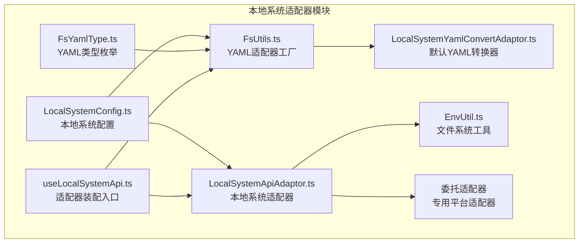
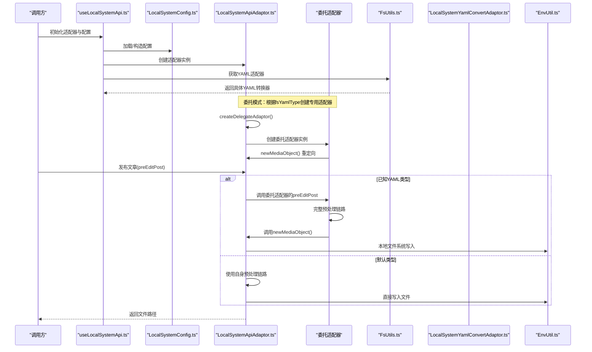
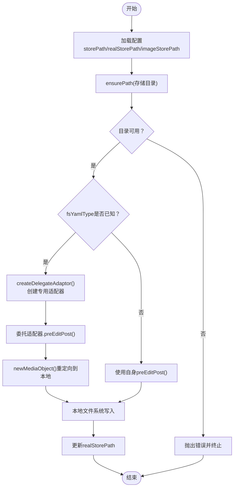
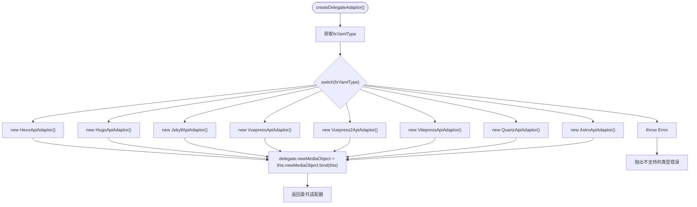
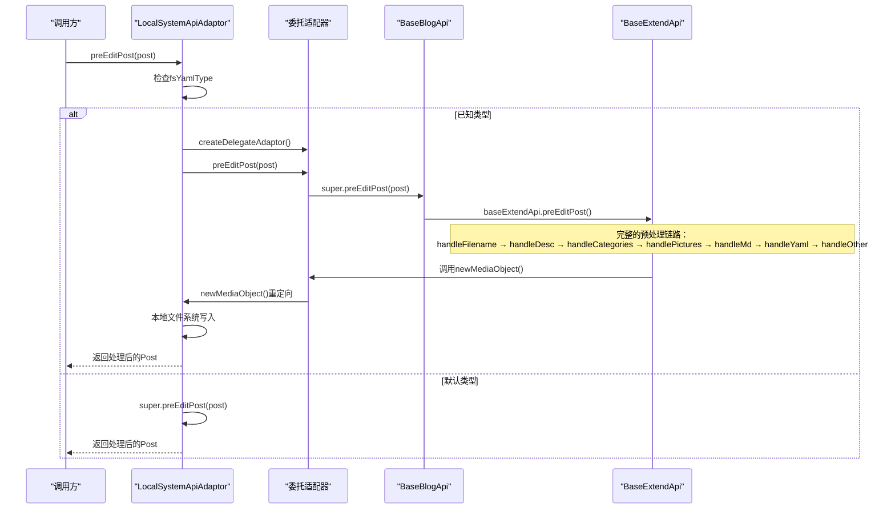
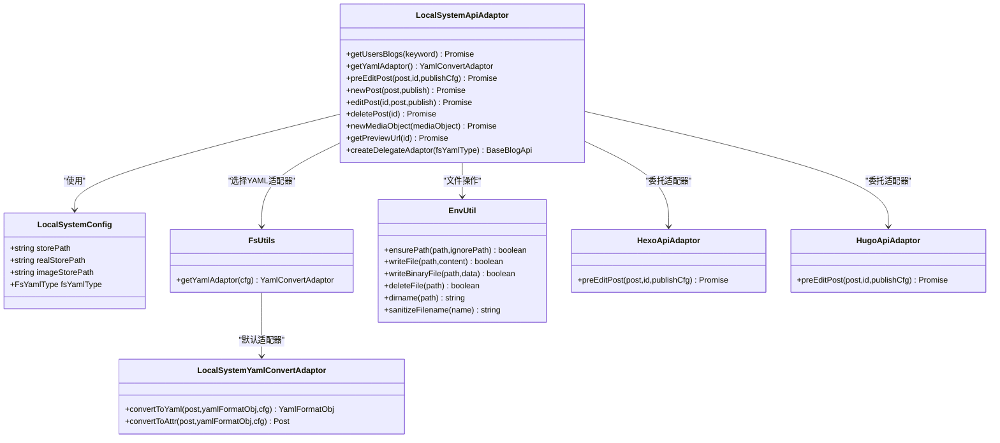

# 文件系统适配器

<cite>
**本文引用的文件**
- [LocalSystemApiAdaptor.ts](file://src/adaptors/fs/LocalSystem/LocalSystemApiAdaptor.ts)
- [LocalSystemConfig.ts](file://src/adaptors/fs/LocalSystem/LocalSystemConfig.ts)
- [FsUtils.ts](file://src/adaptors/fs/LocalSystem/FsUtils.ts)
- [LocalSystemYamlConvertAdaptor.ts](file://src/adaptors/fs/LocalSystem/LocalSystemYamlConvertAdaptor.ts)
- [useLocalSystemApi.ts](file://src/adaptors/fs/LocalSystem/useLocalSystemApi.ts)
- [FsYamlType.ts](file://src/adaptors/fs/LocalSystem/FsYamlType.ts)
- [EnvUtil.ts](file://src/utils/EnvUtil.ts)
- [usePublish.ts](file://src/composables/usePublish.ts)
- [adaptors/index.ts](file://src/adaptors/index.ts)
- [usePublishSettingStore.ts](file://src/stores/usePublishSettingStore.ts)
- [baseBlogApi.ts](file://src/adaptors/api/base/baseBlogApi.ts)
- [baseExtendApi.ts](file://src/adaptors/base/baseExtendApi.ts)
- [hexoApiAdaptor.ts](file://src/adaptors/api/hexo/hexoApiAdaptor.ts)
- [hugoApiAdaptor.ts](file://src/adaptors/api/hugo/hugoApiAdaptor.ts)
- [hexoYamlConverterAdaptor.ts](file://src/adaptors/api/hexo/hexoYamlConverterAdaptor.ts)
- [hugoYamlConverterAdaptor.ts](file://src/adaptors/api/hugo/hugoYamlConverterAdaptor.ts)
</cite>

## 更新摘要
**所做更改**
- 新增委托适配器模式章节，详细说明LocalSystemApiAdaptor如何将媒体上传委派给专用适配器
- 更新架构总览图，展示委托模式的完整流程
- 新增委托适配器模式的关键流程图
- 更新FsYamlType枚举，新增Docsify类型支持
- 完善委托模式下的媒体上传重定向机制说明

## 目录
1. [简介](#简介)
2. [项目结构](#项目结构)
3. [核心组件](#核心组件)
4. [架构总览](#架构总览)
5. [详细组件分析](#详细组件分析)
6. [委托适配器模式](#委托适配器模式)
7. [依赖关系分析](#依赖关系分析)
8. [性能考量](#性能考量)
9. [故障排查指南](#故障排查指南)
10. [结论](#结论)
11. [附录](#附录)

## 简介
本文件系统适配器用于将文章内容与媒体资源落地到本地文件系统，并支持多种静态站点生成器的 YAML 元信息格式转换。其核心职责包括：
- 本地文件与目录的创建与管理
- 文章 Markdown 文件的写入与删除
- 媒体资源的二进制写入与元数据封装
- 基于配置的 YAML 适配器选择与转换
- 路径规范化、文件名清理与错误处理

**重要更新**：现在支持委托适配器模式，将不同静态站点生成器的YAML类型委派给相应的专用适配器，同时保持媒体上传功能回到LocalSystemApiAdaptor的本地文件系统实现。

该适配器运行于思源笔记的 Electron 环境，通过底层的文件系统模块进行安全可靠的文件操作。

## 项目结构
文件系统适配器位于适配器层的"本地系统"子模块，围绕配置、工具、适配器与入口函数组织，形成清晰的职责边界。

**图表来源**
- [LocalSystemApiAdaptor.ts:1-301](file://src/adaptors/fs/LocalSystem/LocalSystemApiAdaptor.ts#L1-L301)
- [LocalSystemConfig.ts:1-45](file://src/adaptors/fs/LocalSystem/LocalSystemConfig.ts#L1-L45)
- [FsUtils.ts:1-102](file://src/adaptors/fs/LocalSystem/FsUtils.ts#L1-L102)
- [LocalSystemYamlConvertAdaptor.ts:1-42](file://src/adaptors/fs/LocalSystem/LocalSystemYamlConvertAdaptor.ts#L1-L42)
- [useLocalSystemApi.ts:1-62](file://src/adaptors/fs/LocalSystem/useLocalSystemApi.ts#L1-L62)
- [FsYamlType.ts:1-69](file://src/adaptors/fs/LocalSystem/FsYamlType.ts#L1-L69)

**章节来源**
- [LocalSystemApiAdaptor.ts:1-301](file://src/adaptors/fs/LocalSystem/LocalSystemApiAdaptor.ts#L1-L301)
- [LocalSystemConfig.ts:1-45](file://src/adaptors/fs/LocalSystem/LocalSystemConfig.ts#L1-L45)
- [FsUtils.ts:1-102](file://src/adaptors/fs/LocalSystem/FsUtils.ts#L1-L102)
- [useLocalSystemApi.ts:1-62](file://src/adaptors/fs/LocalSystem/useLocalSystemApi.ts#L1-L62)
- [FsYamlType.ts:1-69](file://src/adaptors/fs/LocalSystem/FsYamlType.ts#L1-L69)
- [EnvUtil.ts:1-200](file://src/utils/EnvUtil.ts#L1-L200)

## 核心组件
- 本地系统配置 LocalSystemConfig：定义存储根路径、真实存储路径、媒体存储子路径、YAML 类型等关键参数。
- 本地系统适配器 LocalSystemApiAdaptor：实现文章与媒体的本地落盘、路径校验、YAML 适配器选择与预处理，**新增委托适配器模式**。
- YAML 工具 FsUtils：根据配置动态选择具体 YAML 转换器，提供容错回退。
- 默认 YAML 转换器 LocalSystemYamlConvertAdaptor：将文章对象转换为带 YAML 头部的 Markdown 内容。
- 适配器装配 useLocalSystemApi：加载用户配置、创建适配器与 YAML 转换器实例。
- 文件系统工具 EnvUtil：封装路径确保、文件读写、二进制写入、删除与路径解析等底层能力。
- YAML 类型枚举 FsYamlType：统一管理支持的 YAML 格式类型，**新增Docsify类型**。

**章节来源**
- [LocalSystemConfig.ts:22-41](file://src/adaptors/fs/LocalSystem/LocalSystemConfig.ts#L22-L41)
- [LocalSystemApiAdaptor.ts:43-301](file://src/adaptors/fs/LocalSystem/LocalSystemApiAdaptor.ts#L43-L301)
- [FsUtils.ts:31-102](file://src/adaptors/fs/LocalSystem/FsUtils.ts#L31-L102)
- [LocalSystemYamlConvertAdaptor.ts:14-42](file://src/adaptors/fs/LocalSystem/LocalSystemYamlConvertAdaptor.ts#L14-L42)
- [useLocalSystemApi.ts:28-62](file://src/adaptors/fs/LocalSystem/useLocalSystemApi.ts#L28-L62)
- [EnvUtil.ts:46-164](file://src/utils/EnvUtil.ts#L46-L164)
- [FsYamlType.ts:16-69](file://src/adaptors/fs/LocalSystem/FsYamlType.ts#L16-L69)

## 架构总览
本地系统适配器采用"配置驱动 + 工厂选择 + 统一接口"的设计，结合底层 EnvUtil 提供的文件系统能力，实现跨平台一致的文件操作体验。**新增委托适配器模式**使得不同静态站点生成器可以在保持媒体上传本地化的前提下，享受专用适配器的完整预处理链路。

**图表来源**
- [useLocalSystemApi.ts:28-62](file://src/adaptors/fs/LocalSystem/useLocalSystemApi.ts#L28-L62)
- [LocalSystemApiAdaptor.ts:154-188](file://src/adaptors/fs/LocalSystem/LocalSystemApiAdaptor.ts#L154-L188)
- [LocalSystemApiAdaptor.ts:114-152](file://src/adaptors/fs/LocalSystem/LocalSystemApiAdaptor.ts#L114-L152)
- [FsUtils.ts:40-98](file://src/adaptors/fs/LocalSystem/FsUtils.ts#L40-L98)
- [LocalSystemYamlConvertAdaptor.ts:19-38](file://src/adaptors/fs/LocalSystem/LocalSystemYamlConvertAdaptor.ts#L19-L38)
- [EnvUtil.ts:46-99](file://src/utils/EnvUtil.ts#L46-L99)

## 详细组件分析

### 本地系统适配器 LocalSystemApiAdaptor
- 职责
  - 初始化与校验：确保文章与媒体存储路径存在；必要时抛出错误提示。
  - 文章发布：根据标题生成安全文件名，写入 Markdown 文件，返回文件路径。
  - 编辑与删除：编辑即重新发布；删除直接调用底层删除方法。
  - 媒体上传：在媒体目录下写入二进制文件，封装附件元数据。
  - YAML 适配器选择：按配置类型动态选择对应转换器。
  - **委托适配器模式**：根据fsYamlType创建专用适配器实例，重定向媒体上传到本地文件系统。
  - 预处理：针对不同 YAML 类型执行平台特定的预处理逻辑，并更新真实存储路径。

- 关键流程图（委托模式下的文章发布）

**图表来源**
- [LocalSystemApiAdaptor.ts:154-188](file://src/adaptors/fs/LocalSystem/LocalSystemApiAdaptor.ts#L154-L188)
- [LocalSystemApiAdaptor.ts:114-152](file://src/adaptors/fs/LocalSystem/LocalSystemApiAdaptor.ts#L114-L152)
- [EnvUtil.ts:46-99](file://src/utils/EnvUtil.ts#L46-L99)

**章节来源**
- [LocalSystemApiAdaptor.ts:43-301](file://src/adaptors/fs/LocalSystem/LocalSystemApiAdaptor.ts#L43-L301)

### 本地系统配置 LocalSystemConfig
- 字段说明
  - storePath：存储根路径，可包含占位符（如自动分类占位符）。
  - realStorePath：真实存储路径，占位符已替换后的最终路径。
  - fsYamlType：YAML 类型枚举，决定 YAML 转换器的选择。
  - imageStorePath：媒体存储子路径，默认"assets"。

- 默认行为
  - 默认存储根目录指向用户主目录下的下载文件夹。
  - 默认 YAML 类型为"default"，启用标签与分类功能，支持内置图床。

**章节来源**
- [LocalSystemConfig.ts:22-41](file://src/adaptors/fs/LocalSystem/LocalSystemConfig.ts#L22-L41)

### YAML 适配器工厂 FsUtils
- 功能
  - 根据配置的 fsYamlType 返回对应 YAML 转换器实例。
  - 支持 Hexo、Hugo、Jekyll、VuePress、VuePress2、VitePress、Quartz、Astro、**Docsify**以及默认 LocalSystemYamlConvertAdaptor。
  - 异常回退：若加载失败，记录错误并回退到默认转换器。

- 选择策略
  - 若为 Default 或未匹配类型，使用 LocalSystemYamlConvertAdaptor。
  - 否则根据类型映射到对应平台的 YAML 转换器。

**章节来源**
- [FsUtils.ts:31-102](file://src/adaptors/fs/LocalSystem/FsUtils.ts#L31-L102)
- [FsYamlType.ts:16-69](file://src/adaptors/fs/LocalSystem/FsYamlType.ts#L16-L69)

### 默认 YAML 转换器 LocalSystemYamlConvertAdaptor
- 功能
  - 将文章对象转换为带 YAML 头部的 Markdown 内容。
  - 生成 formatter 与 mdFullContent，保留 markdown 与 html 内容以供后续处理。

**章节来源**
- [LocalSystemYamlConvertAdaptor.ts:14-42](file://src/adaptors/fs/LocalSystem/LocalSystemYamlConvertAdaptor.ts#L14-L42)

### 适配器装配 useLocalSystemApi
- 功能
  - 从设置存储加载或构造 LocalSystemConfig。
  - 创建 LocalSystemApiAdaptor 实例与 YAML 转换器实例。
  - 注入标签、分类、图床等能力开关。

- 集成点
  - 与设置存储交互，保证配置持久化与热更新。
  - 与 YAML 工具协作，确保适配器正确加载。

**章节来源**
- [useLocalSystemApi.ts:28-62](file://src/adaptors/fs/LocalSystem/useLocalSystemApi.ts#L28-L62)
- [usePublishSettingStore.ts:21-95](file://src/stores/usePublishSettingStore.ts#L21-L95)

### 文件系统工具 EnvUtil
- 能力
  - ensurePath：标准化路径并递归创建目录。
  - writeFile：以 UTF-8 写入文本文件。
  - writeBinaryFile：写入二进制文件（媒体资源）。
  - deleteFile：删除指定文件。
  - dirname：解析文件所在目录。
  - sanitizeFilename：清理文件名非法字符。

- 错误处理
  - 对底层异常进行捕获与日志记录，返回布尔结果便于上层判断。

**章节来源**
- [EnvUtil.ts:46-164](file://src/utils/EnvUtil.ts#L46-L164)

### YAML 解析与转换集成点
- 在发布流程中，若存在 YAML 适配器，会根据是否已有 YAML 内容决定使用"自动生成"或"保持最新"的策略，并将 YAML 转换为文章属性。
- 该流程与本地系统适配器的 YAML 选择相辅相成，确保不同静态站点生成器的元信息一致性。

**章节来源**
- [usePublish.ts:395-419](file://src/composables/usePublish.ts#L395-L419)
- [adaptors/index.ts:579-604](file://src/adaptors/index.ts#L579-L604)

## 委托适配器模式

### 模式概述
LocalSystemApiAdaptor 现在支持委托适配器模式，允许将不同静态站点生成器的 YAML 类型委派给相应的专用适配器，同时保持媒体上传功能回到 LocalSystemApiAdaptor 的本地文件系统实现。

### 核心实现机制

#### 委托适配器创建

**图表来源**
- [LocalSystemApiAdaptor.ts:114-152](file://src/adaptors/fs/LocalSystem/LocalSystemApiAdaptor.ts#L114-L152)

#### 预处理流程重定向

**图表来源**
- [LocalSystemApiAdaptor.ts:154-188](file://src/adaptors/fs/LocalSystem/LocalSystemApiAdaptor.ts#L154-L188)
- [baseBlogApi.ts:68-70](file://src/adaptors/api/base/baseBlogApi.ts#L68-L70)
- [baseExtendApi.ts:90-106](file://src/adaptors/base/baseExtendApi.ts#L90-L106)

### 支持的委托类型
- Hexo：支持 Hexo 特定的 YAML 格式和前置处理
- Hugo：支持 Hugo 特定的 YAML 格式和前置处理  
- Jekyll：支持 Jekyll 特定的 YAML 格式和前置处理
- VuePress：支持 VuePress 特定的 YAML 格式和前置处理
- VuePress2：支持 VuePress2 特定的 YAML 格式和前置处理
- VitePress：支持 VitePress 特定的 YAML 格式和前置处理
- Quartz：支持 Quartz 特定的 YAML 格式和前置处理
- Astro：支持 Astro 特定的 YAML 格式和前置处理

### 媒体上传重定向机制
委托适配器模式的核心优势在于媒体上传的智能重定向：
- 委托适配器的完整预处理链路正常执行
- `handlePictures()` 中调用的 `newMediaObject()` 会被重定向到 LocalSystemApiAdaptor 的实现
- 确保所有图片最终都落盘到本地文件系统，而不是远程平台

**章节来源**
- [LocalSystemApiAdaptor.ts:114-152](file://src/adaptors/fs/LocalSystem/LocalSystemApiAdaptor.ts#L114-L152)
- [LocalSystemApiAdaptor.ts:154-188](file://src/adaptors/fs/LocalSystem/LocalSystemApiAdaptor.ts#L154-L188)
- [baseBlogApi.ts:68-70](file://src/adaptors/api/base/baseBlogApi.ts#L68-L70)
- [baseExtendApi.ts:90-106](file://src/adaptors/base/baseExtendApi.ts#L90-L106)

## 依赖关系分析
- 组件耦合
  - LocalSystemApiAdaptor 依赖 LocalSystemConfig、FsUtils、EnvUtil 与具体平台 YAML 转换器。
  - **新增委托适配器**：LocalSystemApiAdaptor 依赖各种专用适配器（HexoApiAdaptor、HugoApiAdaptor 等）。
  - FsUtils 依赖 FsYamlType 与各平台 YAML 转换器。
  - useLocalSystemApi 依赖设置存储与装配器/适配器。

- 外部依赖
  - 思源 Electron 环境提供的 fs 模块与 path 模块。
  - 第三方 YAML 工具库（YamlUtil）用于对象与字符串互转。

**图表来源**
- [LocalSystemApiAdaptor.ts:43-301](file://src/adaptors/fs/LocalSystem/LocalSystemApiAdaptor.ts#L43-L301)
- [LocalSystemConfig.ts:22-41](file://src/adaptors/fs/LocalSystem/LocalSystemConfig.ts#L22-L41)
- [FsUtils.ts:31-102](file://src/adaptors/fs/LocalSystem/FsUtils.ts#L31-L102)
- [LocalSystemYamlConvertAdaptor.ts:14-42](file://src/adaptors/fs/LocalSystem/LocalSystemYamlConvertAdaptor.ts#L14-L42)
- [EnvUtil.ts:46-164](file://src/utils/EnvUtil.ts#L46-L164)

## 性能考量
- 目录创建与写入
  - ensurePath 采用递归创建，避免重复 IO；建议在批量发布前预热常用目录。
- 文件名清理
  - sanitizeFilename 在写入前执行，减少因非法字符导致的重试与失败。
- YAML 转换
  - 默认转换器仅做最小必要处理；若需复杂元信息，优先使用平台专用适配器以减少额外转换成本。
- 二进制写入
  - writeBinaryFile 先 ensurePath 再写入，避免多次 IO；媒体文件较大时建议异步化或分块处理。
- 配置加载
  - useLocalSystemApi 与设置存储交互，建议缓存配置以降低频繁读取开销。
- **委托适配器模式性能**
  - 委托适配器的创建和方法绑定只在首次使用时发生，后续调用直接复用。
  - 媒体上传重定向通过方法绑定实现，开销极小。

## 故障排查指南
- "文件存储路径初始化失败"
  - 可能原因：storePath 或 imageStorePath 不可达或权限不足。
  - 处理建议：检查路径合法性与权限，确认 ensurePath 返回值。
  - 参考位置：[LocalSystemApiAdaptor.ts:54-66](file://src/adaptors/fs/LocalSystem/LocalSystemApiAdaptor.ts#L54-L66)、[EnvUtil.ts:46-72](file://src/utils/EnvUtil.ts#L46-L72)

- "文档发布到文件系统失败"
  - 可能原因：目录不可写、磁盘空间不足、文件名包含非法字符。
  - 处理建议：使用 sanitizeFilename 清理文件名，检查磁盘空间与权限。
  - 参考位置：[LocalSystemApiAdaptor.ts:190-227](file://src/adaptors/fs/LocalSystem/LocalSystemApiAdaptor.ts#L190-L227)、[EnvUtil.ts:79-99](file://src/utils/EnvUtil.ts#L79-L99)

- "媒体发布到文件系统失败"
  - 可能原因：媒体目录不存在或不可写。
  - 处理建议：确保 ensurePath 在写入前执行，检查 imageStorePath 配置。
  - 参考位置：[LocalSystemApiAdaptor.ts:238-293](file://src/adaptors/fs/LocalSystem/LocalSystemApiAdaptor.ts#L238-L293)、[EnvUtil.ts:137-164](file://src/utils/EnvUtil.ts#L137-L164)

- "YAML 适配器加载失败"
  - 可能原因：类型配置错误或依赖缺失。
  - 处理建议：切换到 Default 类型回退，检查配置项 fsYamlType。
  - 参考位置：[FsUtils.ts:92-98](file://src/adaptors/fs/LocalSystem/FsUtils.ts#L92-L98)、[FsYamlType.ts:16-69](file://src/adaptors/fs/LocalSystem/FsYamlType.ts#L16-L69)

- "委托适配器创建失败"
  - 可能原因：fsYamlType 不在支持列表中或专用适配器导入失败。
  - 处理建议：检查 fsYamlType 配置，确认对应专用适配器文件存在。
  - 参考位置：[LocalSystemApiAdaptor.ts:143-145](file://src/adaptors/fs/LocalSystem/LocalSystemApiAdaptor.ts#L143-L145)

- "媒体上传重定向失效"
  - 可能原因：委托适配器的 newMediaObject 方法绑定失败。
  - 处理建议：检查委托适配器创建过程，确认方法绑定语句执行。
  - 参考位置：[LocalSystemApiAdaptor.ts:147-151](file://src/adaptors/fs/LocalSystem/LocalSystemApiAdaptor.ts#L147-L151)

**章节来源**
- [LocalSystemApiAdaptor.ts:54-66](file://src/adaptors/fs/LocalSystem/LocalSystemApiAdaptor.ts#L54-L66)
- [LocalSystemApiAdaptor.ts:190-227](file://src/adaptors/fs/LocalSystem/LocalSystemApiAdaptor.ts#L190-L227)
- [LocalSystemApiAdaptor.ts:238-293](file://src/adaptors/fs/LocalSystem/LocalSystemApiAdaptor.ts#L238-L293)
- [FsUtils.ts:92-98](file://src/adaptors/fs/LocalSystem/FsUtils.ts#L92-L98)
- [EnvUtil.ts:46-72](file://src/utils/EnvUtil.ts#L46-L72)
- [EnvUtil.ts:79-99](file://src/utils/EnvUtil.ts#L79-L99)
- [EnvUtil.ts:137-164](file://src/utils/EnvUtil.ts#L137-L164)
- [FsYamlType.ts:16-69](file://src/adaptors/fs/LocalSystem/FsYamlType.ts#L16-L69)
- [LocalSystemApiAdaptor.ts:143-145](file://src/adaptors/fs/LocalSystem/LocalSystemApiAdaptor.ts#L143-L145)
- [LocalSystemApiAdaptor.ts:147-151](file://src/adaptors/fs/LocalSystem/LocalSystemApiAdaptor.ts#L147-L151)

## 结论
本地文件系统适配器通过"配置驱动 + 工厂选择 + 统一接口 + 委托适配器模式"的方式，实现了对多静态站点生成器 YAML 元信息的兼容与本地落盘能力。其关键优势在于：

- **明确的职责分离与可扩展的 YAML 适配器体系**
- **委托适配器模式**：在享受专用平台完整预处理链路的同时，保持媒体上传的本地化
- **智能重定向机制**：确保图片最终落盘到本地文件系统
- 底层 EnvUtil 提供的稳健文件系统操作
- 面向批量发布的路径与文件名规范化策略

在实际使用中，建议结合业务场景合理选择 YAML 类型、预热常用目录、规范文件命名，并建立完善的错误监控与回退策略。委托适配器模式特别适合需要专用平台特性但又希望保持本地化媒体管理的场景。

## 附录

### 文件操作示例（步骤说明）
- 发布文章
  1) 从设置存储加载配置或传入新配置。
  2) 创建适配器与 YAML 转换器。
  3) 调用 newPost，传入文章对象。
  4) 根据返回的文件路径进行后续处理。
  参考位置：[useLocalSystemApi.ts:28-62](file://src/adaptors/fs/LocalSystem/useLocalSystemApi.ts#L28-L62)、[LocalSystemApiAdaptor.ts:190-227](file://src/adaptors/fs/LocalSystem/LocalSystemApiAdaptor.ts#L190-L227)

- 上传媒体
  1) 准备媒体对象（名称与二进制数据）。
  2) 调用 newMediaObject，写入媒体目录。
  3) 使用返回的附件元数据进行引用。
  参考位置：[LocalSystemApiAdaptor.ts:238-293](file://src/adaptors/fs/LocalSystem/LocalSystemApiAdaptor.ts#L238-L293)、[EnvUtil.ts:137-164](file://src/utils/EnvUtil.ts#L137-L164)

- 删除文章
  1) 调用 deletePost，传入文件路径。
  2) 确认返回值与日志输出。
  参考位置：[LocalSystemApiAdaptor.ts:234-236](file://src/adaptors/fs/LocalSystem/LocalSystemApiAdaptor.ts#L234-L236)、[EnvUtil.ts:105-129](file://src/utils/EnvUtil.ts#L105-L129)

- **委托适配器模式示例**
  1) 设置 fsYamlType 为已知类型（如 Hexo、Hugo 等）。
  2) 调用 preEditPost，内部自动创建委托适配器。
  3) 委托适配器执行完整预处理链路，媒体上传被重定向到本地。
  参考位置：[LocalSystemApiAdaptor.ts:154-188](file://src/adaptors/fs/LocalSystem/LocalSystemApiAdaptor.ts#L154-L188)、[LocalSystemApiAdaptor.ts:114-152](file://src/adaptors/fs/LocalSystem/LocalSystemApiAdaptor.ts#L114-L152)

### YAML 配置文件模板（字段说明）
- storePath：文章存储根路径（可含占位符）
- realStorePath：真实存储路径（占位符替换后）
- imageStorePath：媒体存储子路径（默认"assets"）
- fsYamlType：YAML 类型（default、hexo、hugo、jekyll、vuepress、vuepress2、vitepress、quartz、astro、**docsify**）

参考位置：[LocalSystemConfig.ts:22-41](file://src/adaptors/fs/LocalSystem/LocalSystemConfig.ts#L22-L41)、[FsYamlType.ts:16-69](file://src/adaptors/fs/LocalSystem/FsYamlType.ts#L16-L69)

### 最佳实践清单
- 路径规范化
  - 使用 ensurePath 确保目录存在；使用 sanitizeFilename 清理文件名。
  - 参考：[EnvUtil.ts:46-72](file://src/utils/EnvUtil.ts#L46-L72)、[EnvUtil.ts:197-200](file://src/utils/EnvUtil.ts#L197-L200)
- 权限管理
  - 确保应用对 storePath 与 imageStorePath 具备读写权限；避免使用受保护路径。
- 错误处理
  - 对每次文件操作记录日志并返回布尔值；出现异常时回退到默认 YAML 适配器。
  - 参考：[FsUtils.ts:92-98](file://src/adaptors/fs/LocalSystem/FsUtils.ts#L92-L98)、[EnvUtil.ts:68-71](file://src/utils/EnvUtil.ts#L68-L71)
- 批量操作优化
  - 预热常用目录，减少重复 ensurePath 调用。
  - 合理拆分大文件写入，避免阻塞主线程。
- **委托适配器模式最佳实践**
  - 选择合适的 fsYamlType 以获得专用平台的完整预处理能力。
  - 确保委托适配器的媒体上传重定向正常工作，避免远程平台依赖。
  - 在批量发布时预热委托适配器实例，提高性能。
- 与远程存储集成
  - 本地适配器负责落盘；如需同步至远程存储，可在发布完成后触发外部同步任务（如 Git 提交、OSS 上传），并与本地路径映射保持一致。

### 委托适配器类型对照表
| YAML 类型 | 对应适配器 | 主要特性 |
|-----------|------------|----------|
| default | LocalSystemYamlConvertAdaptor | 默认 YAML 格式，基础功能 |
| hexo | HexoYamlConverterAdaptor | Hexo 特定 YAML 格式，支持 permalink |
| hugo | HugoYamlConverterAdaptor | Hugo 特定 YAML 格式，支持 lastmod |
| jekyll | JekyllYamlConverterAdaptor | Jekyll 特定 YAML 格式，标准 Front Matter |
| vuepress | VuepressYamlConverterAdaptor | VuePress 特定 YAML 格式 |
| vuepress2 | Vuepress2YamlConverterAdaptor | VuePress2 特定 YAML 格式 |
| vitepress | VitepressYamlConverterAdaptor | VitePress 特定 YAML 格式 |
| quartz | QuartzYamlConverterAdaptor | Quartz 特定 YAML 格式 |
| astro | AstroYamlConverterAdaptor | Astro 特定 YAML 格式 |
| docsify | DocsifyYamlConverterAdaptor | Docsify 特定 YAML 格式 |

**章节来源**
- [FsYamlType.ts:16-69](file://src/adaptors/fs/LocalSystem/FsYamlType.ts#L16-L69)
- [LocalSystemApiAdaptor.ts:75-104](file://src/adaptors/fs/LocalSystem/LocalSystemApiAdaptor.ts#L75-L104)
- [hexoYamlConverterAdaptor.ts:26-119](file://src/adaptors/api/hexo/hexoYamlConverterAdaptor.ts#L26-L119)
- [hugoYamlConverterAdaptor.ts:25-123](file://src/adaptors/api/hugo/hugoYamlConverterAdaptor.ts#L25-L123)