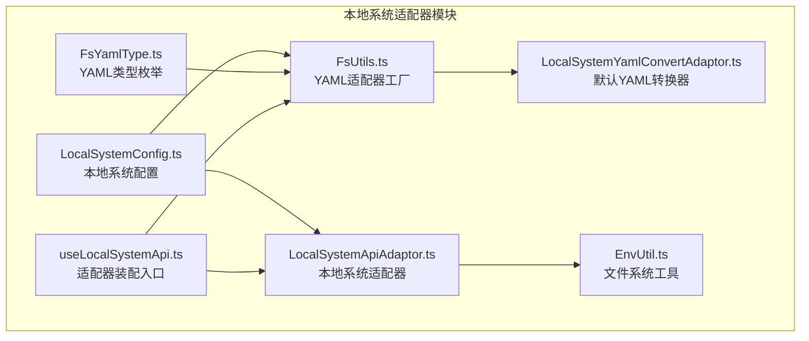
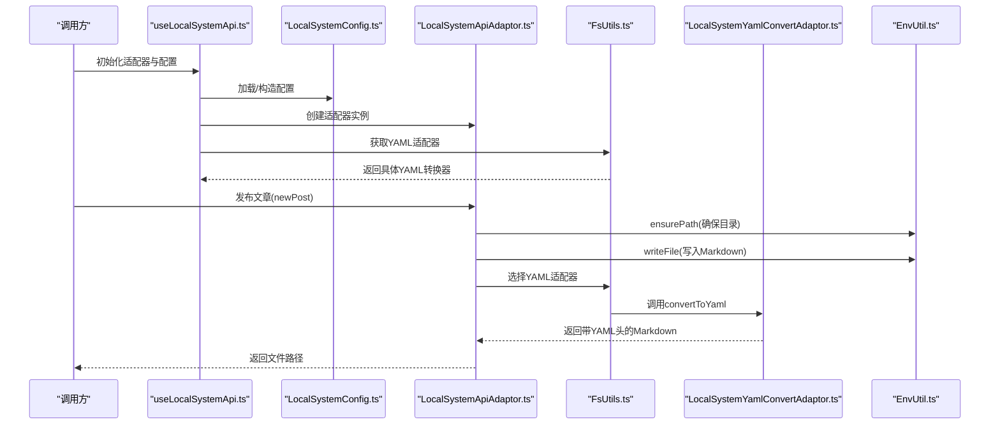
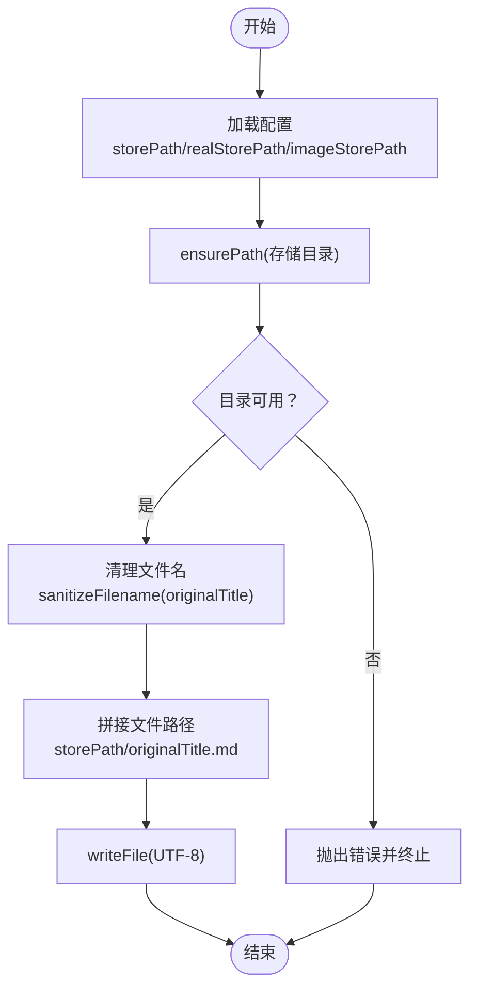
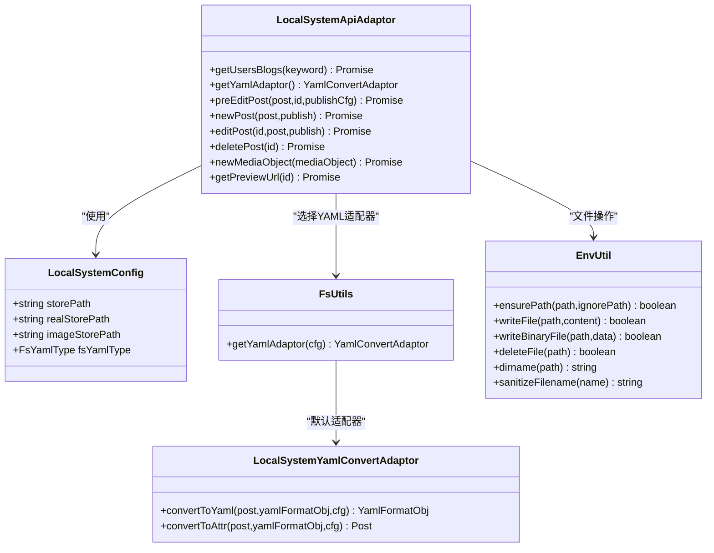

# 文件系统适配器

<cite>
**本文引用的文件**
- [LocalSystemApiAdaptor.ts](file://src/adaptors/fs/LocalSystem/LocalSystemApiAdaptor.ts)
- [LocalSystemConfig.ts](file://src/adaptors/fs/LocalSystem/LocalSystemConfig.ts)
- [FsUtils.ts](file://src/adaptors/fs/LocalSystem/FsUtils.ts)
- [LocalSystemYamlConvertAdaptor.ts](file://src/adaptors/fs/LocalSystem/LocalSystemYamlConvertAdaptor.ts)
- [useLocalSystemApi.ts](file://src/adaptors/fs/LocalSystem/useLocalSystemApi.ts)
- [FsYamlType.ts](file://src/adaptors/fs/LocalSystem/FsYamlType.ts)
- [EnvUtil.ts](file://src/utils/EnvUtil.ts)
- [usePublish.ts](file://src/composables/usePublish.ts)
- [adaptors/index.ts](file://src/adaptors/index.ts)
- [usePublishSettingStore.ts](file://src/stores/usePublishSettingStore.ts)
</cite>

## 目录
1. [简介](#简介)
2. [项目结构](#项目结构)
3. [核心组件](#核心组件)
4. [架构总览](#架构总览)
5. [详细组件分析](#详细组件分析)
6. [依赖关系分析](#依赖关系分析)
7. [性能考量](#性能考量)
8. [故障排查指南](#故障排查指南)
9. [结论](#结论)
10. [附录](#附录)

## 简介
本文件系统适配器用于将文章内容与媒体资源落地到本地文件系统，并支持多种静态站点生成器的 YAML 元信息格式转换。其核心职责包括：
- 本地文件与目录的创建与管理
- 文章 Markdown 文件的写入与删除
- 媒体资源的二进制写入与元数据封装
- 基于配置的 YAML 适配器选择与转换
- 路径规范化、文件名清理与错误处理

该适配器运行于思源笔记的 Electron 环境，通过底层的文件系统模块进行安全可靠的文件操作。

## 项目结构
文件系统适配器位于适配器层的“本地系统”子模块，围绕配置、工具、适配器与入口函数组织，形成清晰的职责边界。

图表来源
- [LocalSystemApiAdaptor.ts:1-273](file://src/adaptors/fs/LocalSystem/LocalSystemApiAdaptor.ts#L1-L273)
- [LocalSystemConfig.ts:1-45](file://src/adaptors/fs/LocalSystem/LocalSystemConfig.ts#L1-L45)
- [FsUtils.ts:1-96](file://src/adaptors/fs/LocalSystem/FsUtils.ts#L1-L96)
- [LocalSystemYamlConvertAdaptor.ts:1-42](file://src/adaptors/fs/LocalSystem/LocalSystemYamlConvertAdaptor.ts#L1-L42)
- [useLocalSystemApi.ts:1-65](file://src/adaptors/fs/LocalSystem/useLocalSystemApi.ts#L1-L65)
- [FsYamlType.ts:1-63](file://src/adaptors/fs/LocalSystem/FsYamlType.ts#L1-L63)
- [EnvUtil.ts:1-200](file://src/utils/EnvUtil.ts#L1-L200)

章节来源
- [LocalSystemApiAdaptor.ts:1-273](file://src/adaptors/fs/LocalSystem/LocalSystemApiAdaptor.ts#L1-L273)
- [LocalSystemConfig.ts:1-45](file://src/adaptors/fs/LocalSystem/LocalSystemConfig.ts#L1-L45)
- [FsUtils.ts:1-96](file://src/adaptors/fs/LocalSystem/FsUtils.ts#L1-L96)
- [useLocalSystemApi.ts:1-65](file://src/adaptors/fs/LocalSystem/useLocalSystemApi.ts#L1-L65)
- [FsYamlType.ts:1-63](file://src/adaptors/fs/LocalSystem/FsYamlType.ts#L1-L63)
- [EnvUtil.ts:1-200](file://src/utils/EnvUtil.ts#L1-L200)

## 核心组件
- 本地系统配置 LocalSystemConfig：定义存储根路径、真实存储路径、媒体存储子路径、YAML 类型等关键参数。
- 本地系统适配器 LocalSystemApiAdaptor：实现文章与媒体的本地落盘、路径校验、YAML 适配器选择与预处理。
- YAML 工具 FsUtils：根据配置动态选择具体 YAML 转换器，提供容错回退。
- 默认 YAML 转换器 LocalSystemYamlConvertAdaptor：将文章对象转换为带 YAML 头部的 Markdown 内容。
- 适配器装配 useLocalSystemApi：加载用户配置、创建适配器与 YAML 转换器实例。
- 文件系统工具 EnvUtil：封装路径确保、文件读写、二进制写入、删除与路径解析等底层能力。
- YAML 类型枚举 FsYamlType：统一管理支持的 YAML 格式类型。

章节来源
- [LocalSystemConfig.ts:22-41](file://src/adaptors/fs/LocalSystem/LocalSystemConfig.ts#L22-L41)
- [LocalSystemApiAdaptor.ts:42-273](file://src/adaptors/fs/LocalSystem/LocalSystemApiAdaptor.ts#L42-L273)
- [FsUtils.ts:30-96](file://src/adaptors/fs/LocalSystem/FsUtils.ts#L30-L96)
- [LocalSystemYamlConvertAdaptor.ts:14-42](file://src/adaptors/fs/LocalSystem/LocalSystemYamlConvertAdaptor.ts#L14-L42)
- [useLocalSystemApi.ts:27-65](file://src/adaptors/fs/LocalSystem/useLocalSystemApi.ts#L27-L65)
- [EnvUtil.ts:46-164](file://src/utils/EnvUtil.ts#L46-L164)
- [FsYamlType.ts:16-61](file://src/adaptors/fs/LocalSystem/FsYamlType.ts#L16-L61)

## 架构总览
本地系统适配器采用“配置驱动 + 工厂选择 + 统一接口”的设计，结合底层 EnvUtil 提供的文件系统能力，实现跨平台一致的文件操作体验。

图表来源
- [useLocalSystemApi.ts:27-65](file://src/adaptors/fs/LocalSystem/useLocalSystemApi.ts#L27-L65)
- [LocalSystemApiAdaptor.ts:166-203](file://src/adaptors/fs/LocalSystem/LocalSystemApiAdaptor.ts#L166-L203)
- [FsUtils.ts:39-93](file://src/adaptors/fs/LocalSystem/FsUtils.ts#L39-L93)
- [LocalSystemYamlConvertAdaptor.ts:19-38](file://src/adaptors/fs/LocalSystem/LocalSystemYamlConvertAdaptor.ts#L19-L38)
- [EnvUtil.ts:46-99](file://src/utils/EnvUtil.ts#L46-L99)

## 详细组件分析

### 本地系统适配器 LocalSystemApiAdaptor
- 职责
  - 初始化与校验：确保文章与媒体存储路径存在；必要时抛出错误提示。
  - 文章发布：根据标题生成安全文件名，写入 Markdown 文件，返回文件路径。
  - 编辑与删除：编辑即重新发布；删除直接调用底层删除方法。
  - 媒体上传：在媒体目录下写入二进制文件，封装附件元数据。
  - YAML 适配器选择：按配置类型动态选择对应转换器。
  - 预处理：针对不同 YAML 类型执行平台特定的预处理逻辑，并更新真实存储路径。

- 关键流程图（文章发布）

图表来源
- [LocalSystemApiAdaptor.ts:166-203](file://src/adaptors/fs/LocalSystem/LocalSystemApiAdaptor.ts#L166-L203)
- [EnvUtil.ts:46-99](file://src/utils/EnvUtil.ts#L46-L99)

章节来源
- [LocalSystemApiAdaptor.ts:48-273](file://src/adaptors/fs/LocalSystem/LocalSystemApiAdaptor.ts#L48-L273)

### 本地系统配置 LocalSystemConfig
- 字段说明
  - storePath：存储根路径，可包含占位符（如自动分类占位符）。
  - realStorePath：真实存储路径，占位符已替换后的最终路径。
  - fsYamlType：YAML 类型枚举，决定 YAML 转换器的选择。
  - imageStorePath：媒体存储子路径，默认“assets”。

- 默认行为
  - 默认存储根目录指向用户主目录下的下载文件夹。
  - 默认 YAML 类型为“Default”，启用标签与分类功能，支持内置图床。

章节来源
- [LocalSystemConfig.ts:22-41](file://src/adaptors/fs/LocalSystem/LocalSystemConfig.ts#L22-L41)

### YAML 适配器工厂 FsUtils
- 功能
  - 根据配置的 fsYamlType 返回对应 YAML 转换器实例。
  - 支持 Hexo、Hugo、Jekyll、VuePress、VuePress2、VitePress、Quartz、Astro 以及默认 LocalSystemYamlConvertAdaptor。
  - 异常回退：若加载失败，记录错误并回退到默认转换器。

- 选择策略
  - 若为 Default 或未匹配类型，使用 LocalSystemYamlConvertAdaptor。
  - 否则根据类型映射到对应平台的 YAML 转换器。

章节来源
- [FsUtils.ts:30-96](file://src/adaptors/fs/LocalSystem/FsUtils.ts#L30-L96)
- [FsYamlType.ts:16-61](file://src/adaptors/fs/LocalSystem/FsYamlType.ts#L16-L61)

### 默认 YAML 转换器 LocalSystemYamlConvertAdaptor
- 功能
  - 将文章对象转换为带 YAML 头部的 Markdown 内容。
  - 生成 formatter 与 mdFullContent，保留 markdown 与 html 内容以供后续处理。

章节来源
- [LocalSystemYamlConvertAdaptor.ts:14-42](file://src/adaptors/fs/LocalSystem/LocalSystemYamlConvertAdaptor.ts#L14-L42)

### 适配器装配 useLocalSystemApi
- 功能
  - 从设置存储加载或构造 LocalSystemConfig。
  - 创建 LocalSystemApiAdaptor 实例与 YAML 转换器实例。
  - 注入标签、分类、图床等能力开关。

- 集成点
  - 与设置存储交互，保证配置持久化与热更新。
  - 与 YAML 工具协作，确保适配器正确加载。

章节来源
- [useLocalSystemApi.ts:27-65](file://src/adaptors/fs/LocalSystem/useLocalSystemApi.ts#L27-L65)
- [usePublishSettingStore.ts:21-95](file://src/stores/usePublishSettingStore.ts#L21-L95)

### 文件系统工具 EnvUtil
- 能力
  - ensurePath：标准化路径并递归创建目录。
  - writeFile：以 UTF-8 写入文本文件。
  - writeBinaryFile：写入二进制文件（媒体资源）。
  - deleteFile：删除指定文件。
  - dirname：解析文件所在目录。
  - sanitizeFilename：清理文件名非法字符。

- 错误处理
  - 对底层异常进行捕获与日志记录，返回布尔结果便于上层判断。

章节来源
- [EnvUtil.ts:46-164](file://src/utils/EnvUtil.ts#L46-L164)

### YAML 解析与转换集成点
- 在发布流程中，若存在 YAML 适配器，会根据是否已有 YAML 内容决定使用“自动生成”或“保持最新”的策略，并将 YAML 转换为文章属性。
- 该流程与本地系统适配器的 YAML 选择相辅相成，确保不同静态站点生成器的元信息一致性。

章节来源
- [usePublish.ts:395-419](file://src/composables/usePublish.ts#L395-L419)
- [adaptors/index.ts:556-572](file://src/adaptors/index.ts#L556-L572)

## 依赖关系分析
- 组件耦合
  - LocalSystemApiAdaptor 依赖 LocalSystemConfig、FsUtils、EnvUtil 与具体平台 YAML 转换器。
  - FsUtils 依赖 FsYamlType 与各平台 YAML 转换器。
  - useLocalSystemApi 依赖设置存储与装配器/适配器。

- 外部依赖
  - 思源 Electron 环境提供的 fs 模块与 path 模块。
  - 第三方 YAML 工具库（YamlUtil）用于对象与字符串互转。

图表来源
- [LocalSystemApiAdaptor.ts:42-273](file://src/adaptors/fs/LocalSystem/LocalSystemApiAdaptor.ts#L42-L273)
- [LocalSystemConfig.ts:22-41](file://src/adaptors/fs/LocalSystem/LocalSystemConfig.ts#L22-L41)
- [FsUtils.ts:30-96](file://src/adaptors/fs/LocalSystem/FsUtils.ts#L30-L96)
- [LocalSystemYamlConvertAdaptor.ts:14-42](file://src/adaptors/fs/LocalSystem/LocalSystemYamlConvertAdaptor.ts#L14-L42)
- [EnvUtil.ts:46-164](file://src/utils/EnvUtil.ts#L46-L164)

## 性能考量
- 目录创建与写入
  - ensurePath 采用递归创建，避免重复 IO；建议在批量发布前预热常用目录。
- 文件名清理
  - sanitizeFilename 在写入前执行，减少因非法字符导致的重试与失败。
- YAML 转换
  - 默认转换器仅做最小必要处理；若需复杂元信息，优先使用平台专用适配器以减少额外转换成本。
- 二进制写入
  - writeBinaryFile 先 ensurePath 再写入，避免多次 IO；媒体文件较大时建议异步化或分块处理。
- 配置加载
  - useLocalSystemApi 与设置存储交互，建议缓存配置以降低频繁读取开销。

[本节为通用性能建议，不直接分析具体文件]

## 故障排查指南
- “文件存储路径初始化失败”
  - 可能原因：storePath 或 imageStorePath 不可达或权限不足。
  - 处理建议：检查路径合法性与权限，确认 ensurePath 返回值。
  - 参考位置：[LocalSystemApiAdaptor.ts:53-65](file://src/adaptors/fs/LocalSystem/LocalSystemApiAdaptor.ts#L53-L65)、[EnvUtil.ts:46-72](file://src/utils/EnvUtil.ts#L46-L72)

- “文档发布到文件系统失败”
  - 可能原因：目录不可写、磁盘空间不足、文件名包含非法字符。
  - 处理建议：使用 sanitizeFilename 清理文件名，检查磁盘空间与权限。
  - 参考位置：[LocalSystemApiAdaptor.ts:199-202](file://src/adaptors/fs/LocalSystem/LocalSystemApiAdaptor.ts#L199-L202)、[EnvUtil.ts:79-99](file://src/utils/EnvUtil.ts#L79-L99)

- “媒体发布到文件系统失败”
  - 可能原因：媒体目录不存在或不可写。
  - 处理建议：确保 ensurePath 在写入前执行，检查 imageStorePath 配置。
  - 参考位置：[LocalSystemApiAdaptor.ts:214-265](file://src/adaptors/fs/LocalSystem/LocalSystemApiAdaptor.ts#L214-L265)、[EnvUtil.ts:137-164](file://src/utils/EnvUtil.ts#L137-L164)

- “YAML 适配器加载失败”
  - 可能原因：类型配置错误或依赖缺失。
  - 处理建议：切换到 Default 类型回退，检查配置项 fsYamlType。
  - 参考位置：[FsUtils.ts:87-90](file://src/adaptors/fs/LocalSystem/FsUtils.ts#L87-L90)、[FsYamlType.ts:16-61](file://src/adaptors/fs/LocalSystem/FsYamlType.ts#L16-L61)

章节来源
- [LocalSystemApiAdaptor.ts:53-65](file://src/adaptors/fs/LocalSystem/LocalSystemApiAdaptor.ts#L53-L65)
- [LocalSystemApiAdaptor.ts:199-202](file://src/adaptors/fs/LocalSystem/LocalSystemApiAdaptor.ts#L199-L202)
- [LocalSystemApiAdaptor.ts:214-265](file://src/adaptors/fs/LocalSystem/LocalSystemApiAdaptor.ts#L214-L265)
- [FsUtils.ts:87-90](file://src/adaptors/fs/LocalSystem/FsUtils.ts#L87-L90)
- [EnvUtil.ts:46-72](file://src/utils/EnvUtil.ts#L46-L72)
- [EnvUtil.ts:79-99](file://src/utils/EnvUtil.ts#L79-L99)
- [EnvUtil.ts:137-164](file://src/utils/EnvUtil.ts#L137-L164)
- [FsYamlType.ts:16-61](file://src/adaptors/fs/LocalSystem/FsYamlType.ts#L16-L61)

## 结论
本地文件系统适配器通过“配置驱动 + 工厂选择 + 统一接口”的方式，实现了对多静态站点生成器 YAML 元信息的兼容与本地落盘能力。其关键优势在于：
- 明确的职责分离与可扩展的 YAML 适配器体系
- 底层 EnvUtil 提供的稳健文件系统操作
- 面向批量发布的路径与文件名规范化策略

在实际使用中，建议结合业务场景合理选择 YAML 类型、预热常用目录、规范文件命名，并建立完善的错误监控与回退策略。

[本节为总结性内容，不直接分析具体文件]

## 附录

### 文件操作示例（步骤说明）
- 发布文章
  1) 从设置存储加载配置或传入新配置。
  2) 创建适配器与 YAML 转换器。
  3) 调用 newPost，传入文章对象。
  4) 根据返回的文件路径进行后续处理。
  参考位置：[useLocalSystemApi.ts:27-65](file://src/adaptors/fs/LocalSystem/useLocalSystemApi.ts#L27-L65)、[LocalSystemApiAdaptor.ts:166-203](file://src/adaptors/fs/LocalSystem/LocalSystemApiAdaptor.ts#L166-L203)

- 上传媒体
  1) 准备媒体对象（名称与二进制数据）。
  2) 调用 newMediaObject，写入媒体目录。
  3) 使用返回的附件元数据进行引用。
  参考位置：[LocalSystemApiAdaptor.ts:214-265](file://src/adaptors/fs/LocalSystem/LocalSystemApiAdaptor.ts#L214-L265)、[EnvUtil.ts:137-164](file://src/utils/EnvUtil.ts#L137-L164)

- 删除文章
  1) 调用 deletePost，传入文件路径。
  2) 确认返回值与日志输出。
  参考位置：[LocalSystemApiAdaptor.ts:210-212](file://src/adaptors/fs/LocalSystem/LocalSystemApiAdaptor.ts#L210-L212)、[EnvUtil.ts:105-129](file://src/utils/EnvUtil.ts#L105-L129)

### YAML 配置文件模板（字段说明）
- storePath：文章存储根路径（可含占位符）
- realStorePath：真实存储路径（占位符替换后）
- imageStorePath：媒体存储子路径（默认“assets”）
- fsYamlType：YAML 类型（默认、hexo、hugo、jekyll、vuepress、vuepress2、vitepress、quartz、astro）

参考位置：[LocalSystemConfig.ts:22-41](file://src/adaptors/fs/LocalSystem/LocalSystemConfig.ts#L22-L41)、[FsYamlType.ts:16-61](file://src/adaptors/fs/LocalSystem/FsYamlType.ts#L16-L61)

### 最佳实践清单
- 路径规范化
  - 使用 ensurePath 确保目录存在；使用 sanitizeFilename 清理文件名。
  - 参考：[EnvUtil.ts:46-72](file://src/utils/EnvUtil.ts#L46-L72)、[EnvUtil.ts:197-200](file://src/utils/EnvUtil.ts#L197-L200)
- 权限管理
  - 确保应用对 storePath 与 imageStorePath 具备读写权限；避免使用受保护路径。
- 错误处理
  - 对每次文件操作记录日志并返回布尔值；出现异常时回退到默认 YAML 适配器。
  - 参考：[FsUtils.ts:87-90](file://src/adaptors/fs/LocalSystem/FsUtils.ts#L87-L90)、[EnvUtil.ts:68-71](file://src/utils/EnvUtil.ts#L68-L71)
- 批量操作优化
  - 预热常用目录，减少重复 ensurePath 调用。
  - 合理拆分大文件写入，避免阻塞主线程。
- 与远程存储集成
  - 本地适配器负责落盘；如需同步至远程存储，可在发布完成后触发外部同步任务（如 Git 提交、OSS 上传），并与本地路径映射保持一致。

[本节为通用最佳实践，不直接分析具体文件]