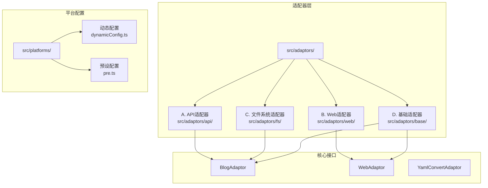
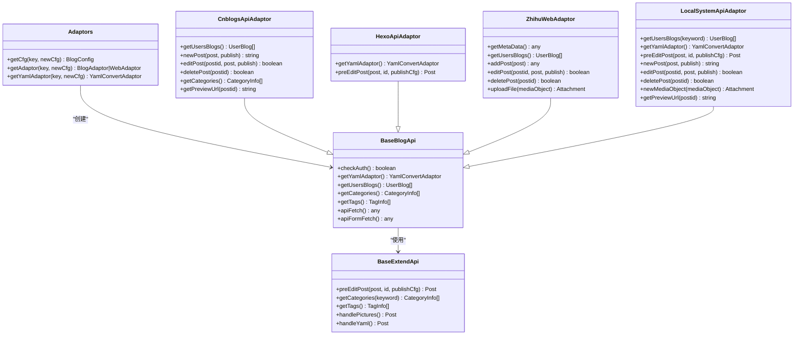
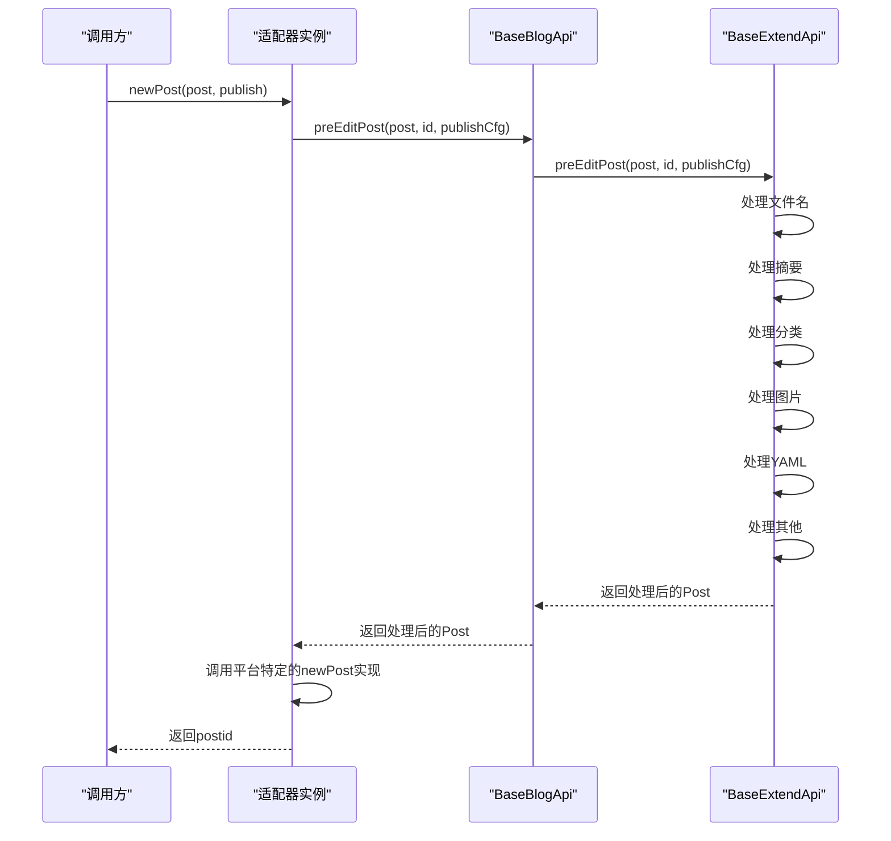
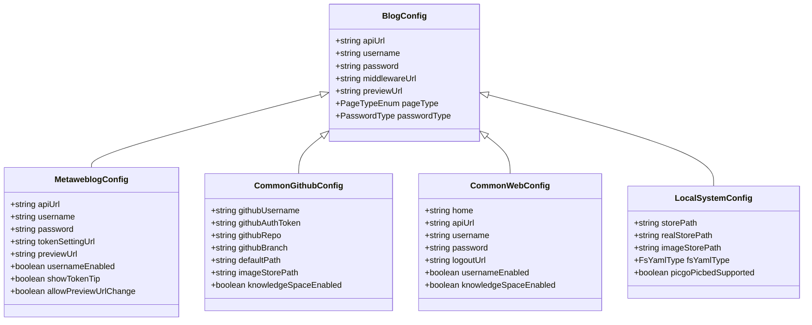
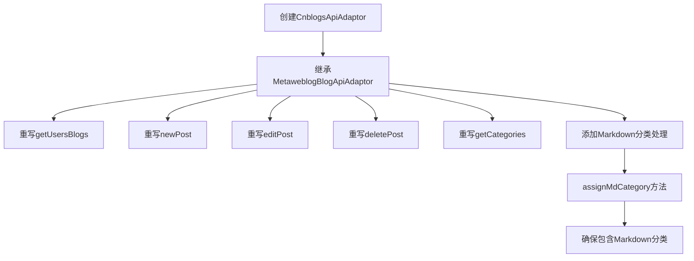
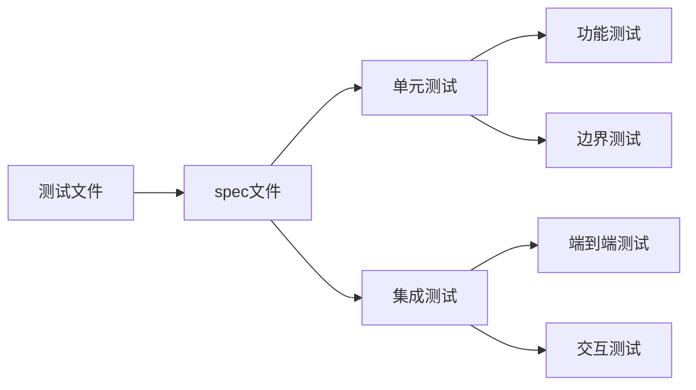
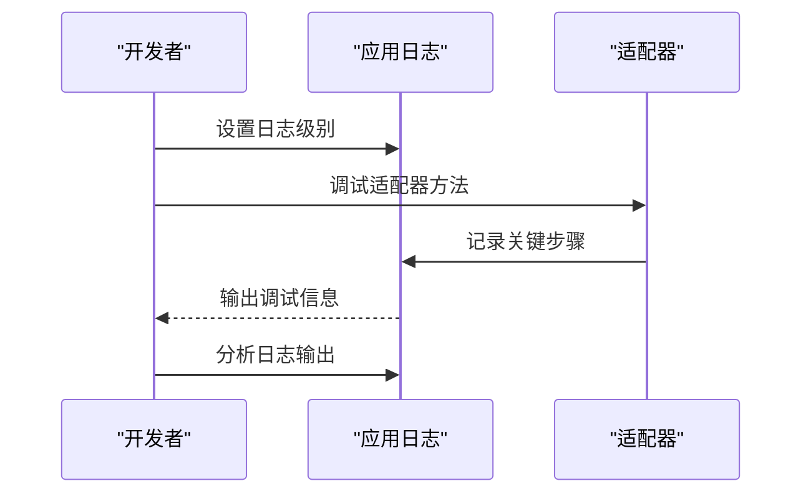
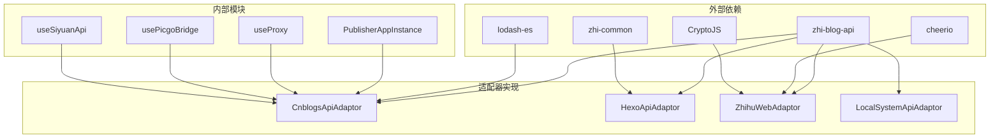
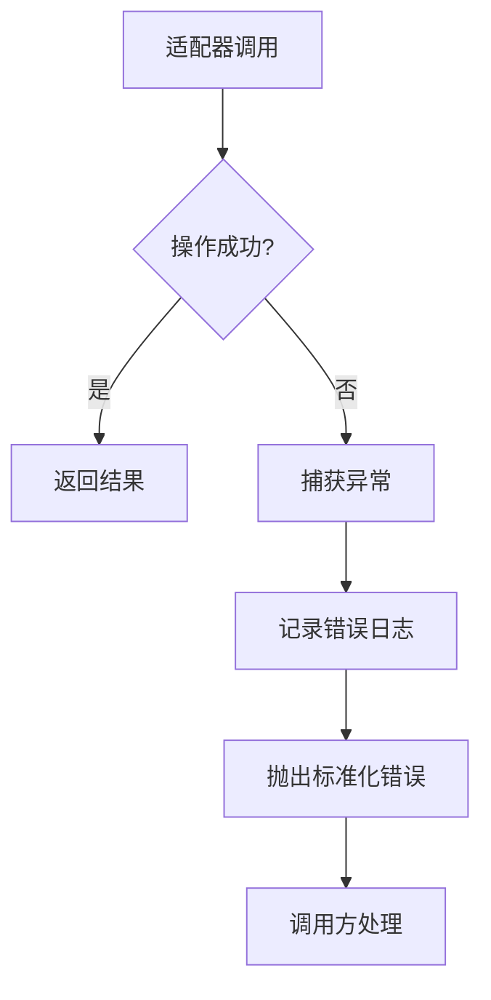
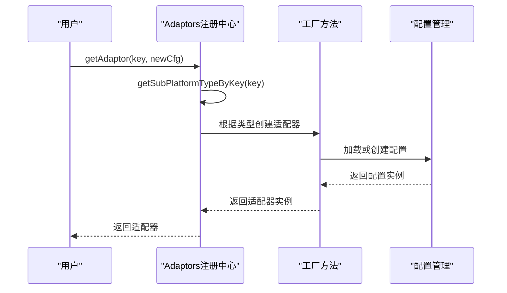

# 自定义适配器开发

<cite>
**本文档引用的文件**
- [src/adaptors/index.ts](file://src/adaptors/index.ts)
- [src/adaptors/base/baseExtendApi.ts](file://src/adaptors/base/baseExtendApi.ts)
- [src/adaptors/api/base/baseBlogApi.ts](file://src/adaptors/api/base/baseBlogApi.ts)
- [src/adaptors/api/cnblogs/cnblogsApiAdaptor.ts](file://src/adaptors/api/cnblogs/cnblogsApiAdaptor.ts)
- [src/adaptors/api/hexo/hexoApiAdaptor.ts](file://src/adaptors/api/hexo/hexoApiAdaptor.ts)
- [src/adaptors/web/zhihu/zhihuWebAdaptor.ts](file://src/adaptors/web/zhihu/zhihuWebAdaptor.ts)
- [src/adaptors/fs/LocalSystem/LocalSystemApiAdaptor.ts](file://src/adaptors/fs/LocalSystem/LocalSystemApiAdaptor.ts)
- [src/adaptors/api/cnblogs/cnblogsConfig.ts](file://src/adaptors/api/cnblogs/cnblogsConfig.ts)
- [src/adaptors/api/hexo/hexoConfig.ts](file://src/adaptors/api/hexo/hexoConfig.ts)
- [src/adaptors/web/zhihu/zhihuConfig.ts](file://src/adaptors/web/zhihu/zhihuConfig.ts)
- [src/adaptors/fs/LocalSystem/LocalSystemConfig.ts](file://src/adaptors/fs/LocalSystem/LocalSystemConfig.ts)
- [src/platforms/dynamicConfig.ts](file://src/platforms/dynamicConfig.ts)
- [src/platforms/pre.ts](file://src/platforms/pre.ts)
- [src/types/IPublishCfg.ts](file://src/types/IPublishCfg.ts)
</cite>

## 目录
1. [简介](#简介)
2. [项目结构](#项目结构)
3. [核心组件](#核心组件)
4. [架构概览](#架构概览)
5. [详细组件分析](#详细组件分析)
6. [依赖分析](#依赖分析)
7. [性能考虑](#性能考虑)
8. [故障排除指南](#故障排除指南)
9. [结论](#结论)
10. [附录](#附录)

## 简介
本指南面向希望在自定义平台上开发适配器的开发者，涵盖从接口设计到实现部署的完整流程。文档基于现有代码库中的适配器模式，详细说明如何实现BlogAdaptor接口的各个方法（文章获取、发布、更新、删除），并提供配置文件结构规范、测试策略、调试技巧以及适配器注册和动态加载机制。

## 项目结构
该项目采用模块化架构，适配器按平台类型组织在不同的子目录中：

**图表来源**
- [src/adaptors/index.ts:1-573](file://src/adaptors/index.ts#L1-L573)
- [src/platforms/dynamicConfig.ts:1-534](file://src/platforms/dynamicConfig.ts#L1-L534)

**章节来源**
- [src/adaptors/index.ts:1-573](file://src/adaptors/index.ts#L1-L573)
- [src/platforms/dynamicConfig.ts:1-534](file://src/platforms/dynamicConfig.ts#L1-L534)

## 核心组件
本项目的核心组件围绕适配器模式构建，主要包括：

### 适配器注册中心
Adaptors类提供统一的适配器获取接口，根据平台key动态选择对应的适配器实现。

### 基础适配器
- BaseBlogApi：API类适配器的基础实现
- BaseExtendApi：提供通用的预处理功能
- BaseWebApi：Web类适配器的基础实现

### 平台适配器示例
- CnblogsApiAdaptor：基于Metaweblog协议的博客园适配器
- HexoApiAdaptor：静态站点生成器适配器
- ZhihuWebAdaptor：网页授权适配器
- LocalSystemApiAdaptor：本地文件系统适配器

**章节来源**
- [src/adaptors/index.ts:56-573](file://src/adaptors/index.ts#L56-L573)
- [src/adaptors/base/baseExtendApi.ts:55-739](file://src/adaptors/base/baseExtendApi.ts#L55-L739)
- [src/adaptors/api/base/baseBlogApi.ts:27-205](file://src/adaptors/api/base/baseBlogApi.ts#L27-L205)

## 架构概览
系统采用分层架构，通过适配器模式实现对不同平台的统一抽象：

**图表来源**
- [src/adaptors/index.ts:56-573](file://src/adaptors/index.ts#L56-L573)
- [src/adaptors/api/base/baseBlogApi.ts:27-205](file://src/adaptors/api/base/baseBlogApi.ts#L27-L205)
- [src/adaptors/base/baseExtendApi.ts:55-739](file://src/adaptors/base/baseExtendApi.ts#L55-L739)
- [src/adaptors/api/cnblogs/cnblogsApiAdaptor.ts:27-131](file://src/adaptors/api/cnblogs/cnblogsApiAdaptor.ts#L27-L131)
- [src/adaptors/api/hexo/hexoApiAdaptor.ts:23-63](file://src/adaptors/api/hexo/hexoApiAdaptor.ts#L23-L63)
- [src/adaptors/web/zhihu/zhihuWebAdaptor.ts:29-459](file://src/adaptors/web/zhihu/zhihuWebAdaptor.ts#L29-L459)
- [src/adaptors/fs/LocalSystem/LocalSystemApiAdaptor.ts:42-273](file://src/adaptors/fs/LocalSystem/LocalSystemApiAdaptor.ts#L42-L273)

## 详细组件分析

### BlogAdaptor接口实现要求

#### 基础方法实现
所有API类适配器都继承自BaseBlogApi，需要实现以下核心方法：

**图表来源**
- [src/adaptors/api/base/baseBlogApi.ts:68-70](file://src/adaptors/api/base/baseBlogApi.ts#L68-L70)
- [src/adaptors/base/baseExtendApi.ts:90-106](file://src/adaptors/base/baseExtendApi.ts#L90-L106)

#### 文章获取方法
- `getUsersBlogs()`: 获取用户博客列表
- `getCategories()`: 获取分类信息
- `getTags()`: 获取标签信息
- `getPreviewUrl(postid)`: 获取文章预览URL

#### 发布相关方法
- `newPost(post, publish)`: 创建新文章
- `editPost(postid, post, publish)`: 更新文章
- `deletePost(postid)`: 删除文章

#### 图片处理方法
- `newMediaObject(mediaObject)`: 上传媒体文件
- `getImagesFromMd(id, markdown)`: 从Markdown中提取图片
- `readFileToBase64(url)`: 读取文件并转换为Base64

**章节来源**
- [src/adaptors/api/base/baseBlogApi.ts:56-205](file://src/adaptors/api/base/baseBlogApi.ts#L56-L205)
- [src/adaptors/base/baseExtendApi.ts:108-137](file://src/adaptors/base/baseExtendApi.ts#L108-L137)

### 配置文件结构规范

#### 基础配置类
所有适配器配置类都继承自相应的基础配置类：

**图表来源**
- [src/adaptors/api/cnblogs/cnblogsConfig.ts:19-47](file://src/adaptors/api/cnblogs/cnblogsConfig.ts#L19-L47)
- [src/adaptors/api/hexo/hexoConfig.ts:19-52](file://src/adaptors/api/hexo/hexoConfig.ts#L19-L52)
- [src/adaptors/web/zhihu/zhihuConfig.ts:16-39](file://src/adaptors/web/zhihu/zhihuConfig.ts#L16-L39)
- [src/adaptors/fs/LocalSystem/LocalSystemConfig.ts:22-45](file://src/adaptors/fs/LocalSystem/LocalSystemConfig.ts#L22-L45)

#### 验证规则和默认值
配置类提供了标准化的验证规则和默认值设置：

**章节来源**
- [src/adaptors/api/cnblogs/cnblogsConfig.ts:28-43](file://src/adaptors/api/cnblogs/cnblogsConfig.ts#L28-L43)
- [src/adaptors/api/hexo/hexoConfig.ts:26-48](file://src/adaptors/api/hexo/hexoConfig.ts#L26-L48)
- [src/adaptors/web/zhihu/zhihuConfig.ts:19-35](file://src/adaptors/web/zhihu/zhihuConfig.ts#L19-L35)
- [src/adaptors/fs/LocalSystem/LocalSystemConfig.ts:29-41](file://src/adaptors/fs/LocalSystem/LocalSystemConfig.ts#L29-L41)

### 完整开发示例

#### 基础适配器创建流程
1. **继承基础类**：根据平台类型选择合适的基类
2. **实现必需方法**：至少实现`newPost`、`editPost`、`deletePost`
3. **配置适配器**：创建对应的配置类
4. **注册适配器**：在适配器入口中注册新平台

#### 高级功能实现
以CnblogsApiAdaptor为例，展示了如何扩展基础功能：

**图表来源**
- [src/adaptors/api/cnblogs/cnblogsApiAdaptor.ts:27-131](file://src/adaptors/api/cnblogs/cnblogsApiAdaptor.ts#L27-L131)

**章节来源**
- [src/adaptors/api/cnblogs/cnblogsApiAdaptor.ts:27-131](file://src/adaptors/api/cnblogs/cnblogsApiAdaptor.ts#L27-L131)

### 测试策略

#### 单元测试模式
项目提供了多种测试文件，展示了测试的最佳实践：

#### 测试要点
- **配置验证测试**：验证配置类的默认值和验证规则
- **适配器行为测试**：测试适配器的核心方法
- **错误处理测试**：测试异常情况的处理
- **集成测试**：测试适配器与平台的实际交互

**章节来源**
- [src/adaptors/api/base/gitlab/commonGitlabApiAdaptor.spec.ts](file://src/adaptors/api/base/gitlab/commonGitlabApiAdaptor.spec.ts)
- [src/platforms/dynamicConfig.spec.ts](file://src/platforms/dynamicConfig.spec.ts)

### 调试技巧

#### 日志记录
适配器广泛使用日志记录来跟踪执行流程：

#### 调试最佳实践
- 使用详细的日志记录关键执行步骤
- 实现错误处理和异常捕获
- 提供状态反馈和进度提示
- 支持开发者工具集成

**章节来源**
- [src/adaptors/base/baseExtendApi.ts:646-648](file://src/adaptors/base/baseExtendApi.ts#L646-L648)

## 依赖分析

### 组件耦合关系
系统采用松耦合设计，通过接口和工厂模式实现：

**图表来源**
- [src/adaptors/api/cnblogs/cnblogsApiAdaptor.ts:10-17](file://src/adaptors/api/cnblogs/cnblogsApiAdaptor.ts#L10-L17)
- [src/adaptors/api/hexo/hexoApiAdaptor.ts:10-15](file://src/adaptors/api/hexo/hexoApiAdaptor.ts#L10-L15)
- [src/adaptors/web/zhihu/zhihuWebAdaptor.ts:10-20](file://src/adaptors/web/zhihu/zhihuWebAdaptor.ts#L10-L20)

### 依赖注入机制
适配器通过构造函数接收依赖，支持灵活的配置和测试：

**章节来源**
- [src/adaptors/api/base/baseBlogApi.ts:42-54](file://src/adaptors/api/base/baseBlogApi.ts#L42-L54)

## 性能考虑

### 异步处理优化
- 使用Promise和async/await避免阻塞操作
- 实现适当的超时控制和重试机制
- 优化网络请求和文件上传操作

### 内存管理
- 及时释放大文件和图片资源
- 使用流式处理减少内存占用
- 实现缓存策略避免重复计算

### 网络优化
- 实现请求缓存和去重
- 使用连接池管理HTTP连接
- 优化图片压缩和传输

## 故障排除指南

### 常见问题诊断
1. **认证失败**：检查配置参数和令牌有效性
2. **网络连接问题**：验证代理设置和防火墙配置
3. **图片上传失败**：检查存储权限和磁盘空间
4. **YAML转换错误**：验证YAML格式和平台兼容性

### 错误处理策略
适配器实现了完善的错误处理机制：

**章节来源**
- [src/adaptors/base/baseExtendApi.ts:535-551](file://src/adaptors/base/baseExtendApi.ts#L535-L551)

## 结论
本指南详细介绍了自定义适配器开发的完整流程，从接口设计到实现部署。通过分析现有适配器的实现模式，开发者可以快速理解和掌握适配器开发的核心概念和最佳实践。关键要点包括：

1. **接口一致性**：遵循BlogAdaptor和WebAdaptor接口规范
2. **配置标准化**：使用配置类管理平台特定参数
3. **扩展性设计**：通过继承和组合实现功能扩展
4. **测试驱动**：编写全面的测试确保代码质量
5. **错误处理**：实现健壮的异常处理机制

## 附录

### 适配器注册流程

**图表来源**
- [src/adaptors/index.ts:65-467](file://src/adaptors/index.ts#L65-L467)

### 平台类型映射
系统支持多种平台类型，每种类型都有对应的子平台：

**章节来源**
- [src/platforms/dynamicConfig.ts:174-238](file://src/platforms/dynamicConfig.ts#L174-L238)
- [src/platforms/pre.ts:101-463](file://src/platforms/pre.ts#L101-L463)