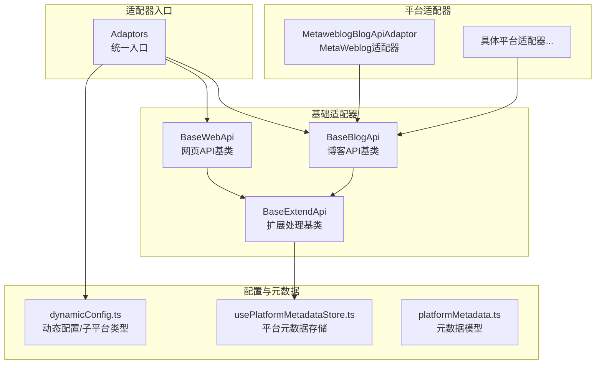
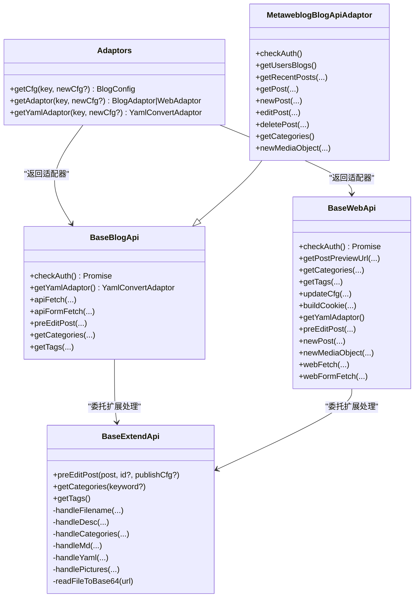
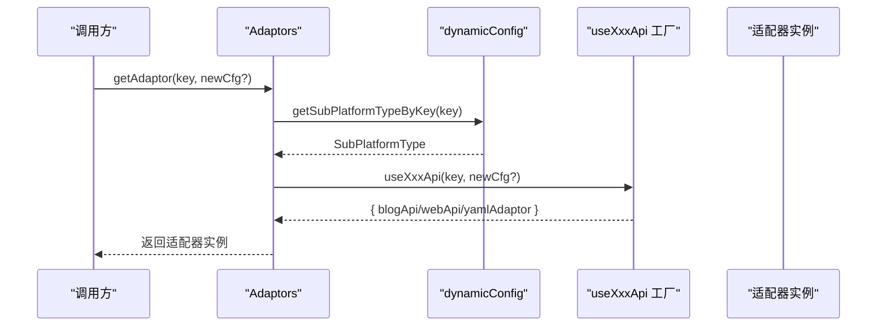
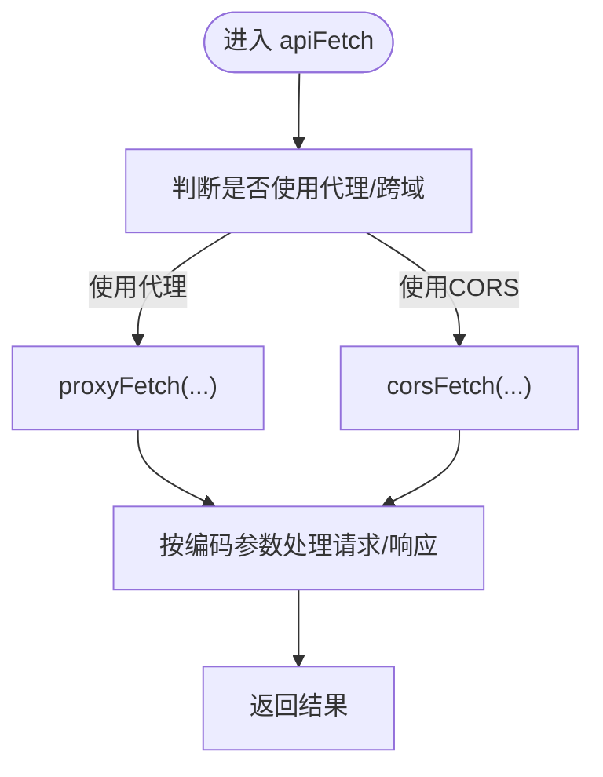
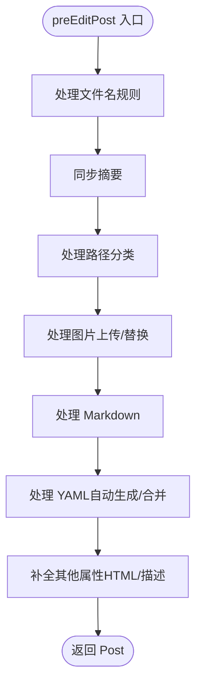
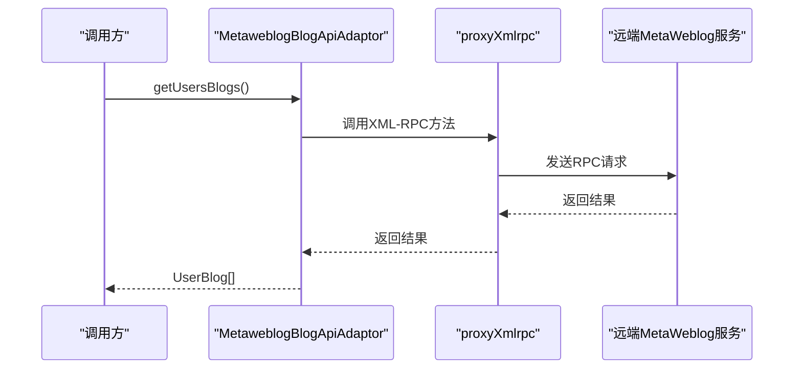
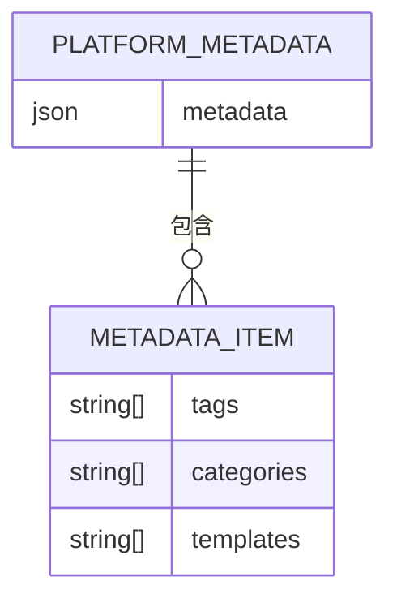
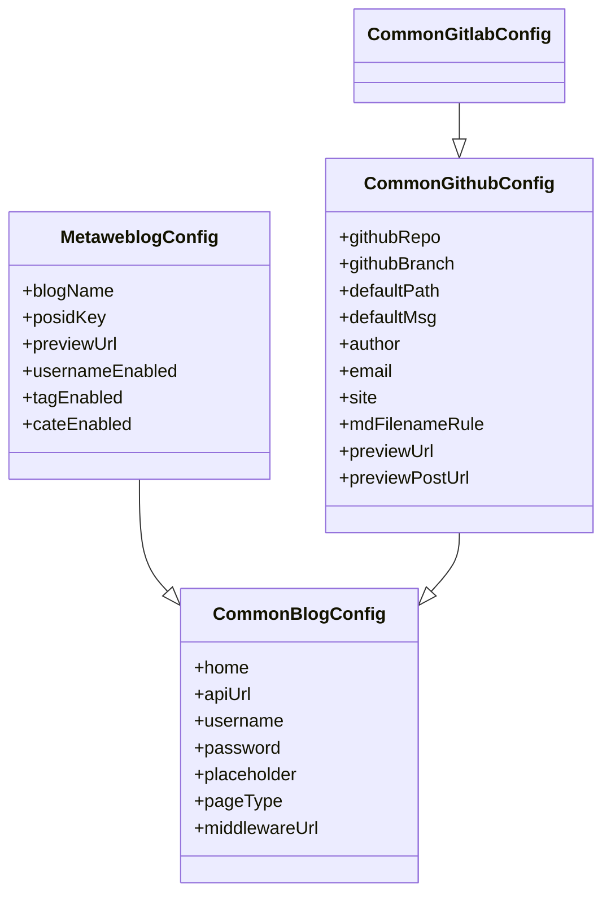
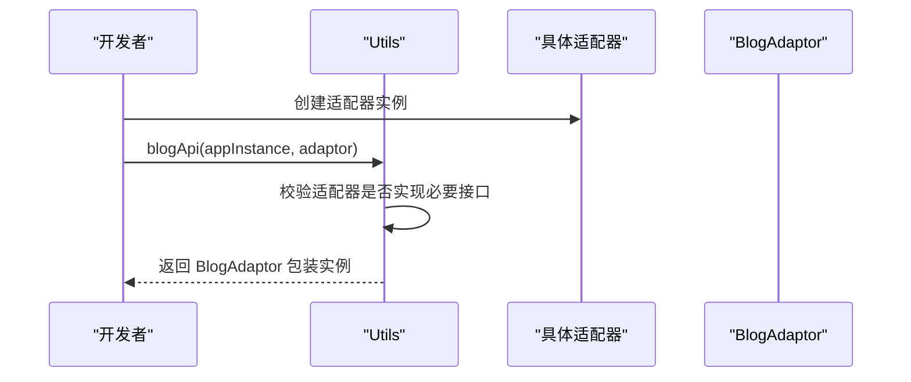
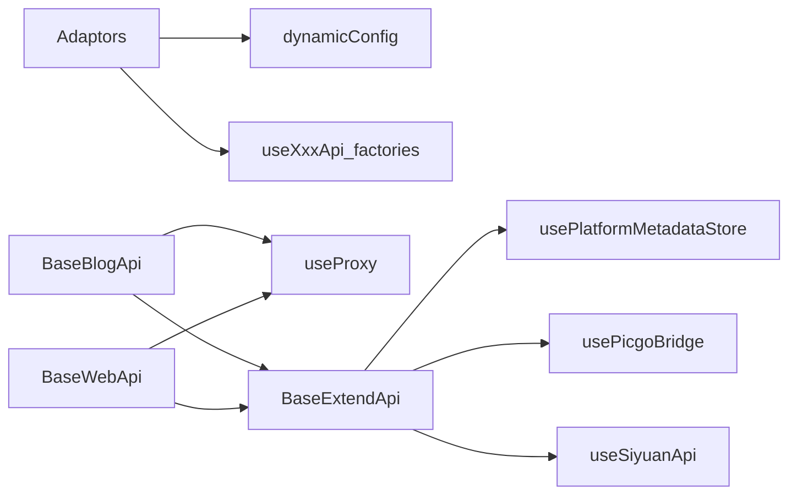

# 适配器架构设计

<cite>
**本文档引用的文件**
- [src/adaptors/index.ts](file://src/adaptors/index.ts)
- [src/adaptors/base/baseExtendApi.ts](file://src/adaptors/base/baseExtendApi.ts)
- [src/adaptors/base/baseBlogApi.ts](file://src/adaptors/base/baseBlogApi.ts)
- [src/adaptors/web/base/baseWebApi.ts](file://src/adaptors/web/base/baseWebApi.ts)
- [src/adaptors/api/base/metaweblog/metaweblogBlogApiAdaptor.ts](file://src/adaptors/api/base/metaweblog/metaweblogBlogApiAdaptor.ts)
- [src/platforms/dynamicConfig.ts](file://src/platforms/dynamicConfig.ts)
- [src/stores/usePlatformMetadataStore.ts](file://src/stores/usePlatformMetadataStore.ts)
- [src/models/platformMetadata.ts](file://src/models/platformMetadata.ts)
- [src/adaptors/api/base/commonBlogConfig.ts](file://src/adaptors/api/base/commonBlogConfig.ts)
- [src/adaptors/api/base/metaweblog/metaweblogConfig.ts](file://src/adaptors/api/base/metaweblog/metaweblogConfig.ts)
- [src/adaptors/api/base/github/commonGithubConfig.ts](file://src/adaptors/api/base/github/commonGithubConfig.ts)
- [src/adaptors/api/base/gitlab/commonGitlabConfig.ts](file://src/adaptors/api/base/gitlab/commonGitlabConfig.ts)
- [src/utils/utils.ts](file://src/utils/utils.ts)
</cite>

## 目录
1. [引言](#引言)
2. [项目结构](#项目结构)
3. [核心组件](#核心组件)
4. [架构总览](#架构总览)
5. [详细组件分析](#详细组件分析)
6. [依赖关系分析](#依赖关系分析)
7. [性能考量](#性能考量)
8. [故障排查指南](#故障排查指南)
9. [结论](#结论)
10. [附录](#附录)

## 引言
本文件系统性阐述该仓库中的适配器架构设计，重点围绕适配器模式的核心理念、BlogAdaptor接口的统一抽象、适配器注册与动态配置加载、平台元数据管理、基础适配器类的设计原理（通用API封装、错误处理机制、配置验证流程），以及适配器开发的最佳实践（接口实现规范、配置文件结构、测试策略）。文中提供多幅架构与流程图，帮助读者快速把握整体设计。

## 项目结构
该项目采用“按领域/平台分层”的组织方式，适配器相关代码集中在 src/adaptors 目录下，配合动态配置与平台元数据存储模块，形成可扩展、可维护的适配器体系。

**图表来源**
- [src/adaptors/index.ts:56-573](file://src/adaptors/index.ts#L56-L573)
- [src/adaptors/base/baseBlogApi.ts:27-205](file://src/adaptors/base/baseBlogApi.ts#L27-L205)
- [src/adaptors/web/base/baseWebApi.ts:36-256](file://src/adaptors/web/base/baseWebApi.ts#L36-L256)
- [src/adaptors/base/baseExtendApi.ts:55-739](file://src/adaptors/base/baseExtendApi.ts#L55-L739)
- [src/adaptors/api/base/metaweblog/metaweblogBlogApiAdaptor.ts:26-321](file://src/adaptors/api/base/metaweblog/metaweblogBlogApiAdaptor.ts#L26-L321)
- [src/platforms/dynamicConfig.ts:13-534](file://src/platforms/dynamicConfig.ts#L13-L534)
- [src/stores/usePlatformMetadataStore.ts:21-128](file://src/stores/usePlatformMetadataStore.ts#L21-L128)
- [src/models/platformMetadata.ts:16-50](file://src/models/platformMetadata.ts#L16-L50)

**章节来源**
- [src/adaptors/index.ts:56-573](file://src/adaptors/index.ts#L56-L573)
- [src/platforms/dynamicConfig.ts:13-534](file://src/platforms/dynamicConfig.ts#L13-L534)

## 核心组件
- 适配器统一入口：Adaptors 类负责根据平台 key 动态选择并返回对应的 BlogAdaptor/WebAdaptor/YamlConvertAdaptor 实例，实现“按需加载”和“集中管理”。
- 基础适配器：
  - BaseBlogApi：封装博客类 API 的通用逻辑（鉴权、代理请求、表单提交、YAML适配器查询等）。
  - BaseWebApi：封装网页授权类 API 的通用逻辑（Cookie拼接、代理请求、媒体上传等）。
  - BaseExtendApi：在 BaseBlogApi/BaseWebApi 基础上提供统一的发布前处理（文件名、摘要、分类、图片、YAML、正文、其他属性）。
- 动态配置与子平台类型：dynamicConfig.ts 定义平台类型、子平台类型、动态配置对象及 key 解析规则。
- 平台元数据存储：usePlatformMetadataStore.ts 提供本地持久化存储，支持标签、分类、模板的增删改查与去重合并。
- 配置模型：commonBlogConfig、metaweblogConfig、commonGithubConfig、commonGitlabConfig 等提供不同平台的配置结构与默认值。

**章节来源**
- [src/adaptors/index.ts:56-573](file://src/adaptors/index.ts#L56-L573)
- [src/adaptors/base/baseBlogApi.ts:27-205](file://src/adaptors/base/baseBlogApi.ts#L27-L205)
- [src/adaptors/web/base/baseWebApi.ts:36-256](file://src/adaptors/web/base/baseWebApi.ts#L36-L256)
- [src/adaptors/base/baseExtendApi.ts:55-739](file://src/adaptors/base/baseExtendApi.ts#L55-L739)
- [src/platforms/dynamicConfig.ts:13-534](file://src/platforms/dynamicConfig.ts#L13-L534)
- [src/stores/usePlatformMetadataStore.ts:21-128](file://src/stores/usePlatformMetadataStore.ts#L21-L128)
- [src/models/platformMetadata.ts:16-50](file://src/models/platformMetadata.ts#L16-L50)
- [src/adaptors/api/base/commonBlogConfig.ts:13-42](file://src/adaptors/api/base/commonBlogConfig.ts#L13-L42)
- [src/adaptors/api/base/metaweblog/metaweblogConfig.ts:17-101](file://src/adaptors/api/base/metaweblog/metaweblogConfig.ts#L17-L101)
- [src/adaptors/api/base/github/commonGithubConfig.ts:17-112](file://src/adaptors/api/base/github/commonGithubConfig.ts#L17-L112)
- [src/adaptors/api/base/gitlab/commonGitlabConfig.ts:15-18](file://src/adaptors/api/base/gitlab/commonGitlabConfig.ts#L15-L18)

## 架构总览
适配器架构遵循“统一入口 + 基础适配器 + 平台适配器 + 动态配置 + 元数据存储”的分层设计。统一入口根据平台 key 选择具体适配器；基础适配器提供通用能力；平台适配器聚焦具体平台差异；动态配置与元数据存储支撑运行期行为与界面交互。

**图表来源**
- [src/adaptors/index.ts:56-573](file://src/adaptors/index.ts#L56-L573)
- [src/adaptors/base/baseBlogApi.ts:27-205](file://src/adaptors/base/baseBlogApi.ts#L27-L205)
- [src/adaptors/web/base/baseWebApi.ts:36-256](file://src/adaptors/web/base/baseWebApi.ts#L36-L256)
- [src/adaptors/base/baseExtendApi.ts:55-739](file://src/adaptors/base/baseExtendApi.ts#L55-L739)
- [src/adaptors/api/base/metaweblog/metaweblogBlogApiAdaptor.ts:26-321](file://src/adaptors/api/base/metaweblog/metaweblogBlogApiAdaptor.ts#L26-L321)

## 详细组件分析

### 统一适配器入口（Adaptors）
- 职责
  - 根据平台 key 解析子平台类型，调用对应 useXxxApi 工厂方法，返回配置、适配器或 YAML 适配器。
  - 支持博客类适配器（BlogAdaptor）、网页类适配器（WebAdaptor）与 YAML 转换适配器（YamlConvertAdaptor）。
- 关键点
  - 通过 dynamicConfig.ts 的 getSubPlatformTypeByKey(key) 解析 key，映射到 SubPlatformType。
  - 对于 web 平台，工厂方法不接收 newCfg 参数；对于 API 平台，可传入动态配置覆盖默认配置。
  - 日志记录配置与适配器获取过程，便于调试。

**图表来源**
- [src/adaptors/index.ts:65-467](file://src/adaptors/index.ts#L65-L467)
- [src/platforms/dynamicConfig.ts:397-418](file://src/platforms/dynamicConfig.ts#L397-L418)

**章节来源**
- [src/adaptors/index.ts:56-573](file://src/adaptors/index.ts#L56-L573)
- [src/platforms/dynamicConfig.ts:397-418](file://src/platforms/dynamicConfig.ts#L397-L418)

### 基础适配器（BaseBlogApi/BaseWebApi）
- BaseBlogApi
  - 提供统一的鉴权检查、代理请求（apiFetch）、表单提交（apiFormFetch）、YAML 适配器查询、发布前处理委托、分类/标签获取等。
  - 通过 useProxy 注入代理与 CORS 能力，支持在不同运行环境（浏览器/桌面）下自动切换。
- BaseWebApi
  - 提供网页授权所需的 Cookie 拼接、预览链接获取、媒体上传、代理请求（webFetch/webFormFetch）等。
  - 与 BaseBlogApi 共享扩展处理能力（BaseExtendApi）。

**图表来源**
- [src/adaptors/base/baseBlogApi.ts:93-150](file://src/adaptors/base/baseBlogApi.ts#L93-L150)
- [src/adaptors/web/base/baseWebApi.ts:150-200](file://src/adaptors/web/base/baseWebApi.ts#L150-L200)

**章节来源**
- [src/adaptors/base/baseBlogApi.ts:27-205](file://src/adaptors/base/baseBlogApi.ts#L27-L205)
- [src/adaptors/web/base/baseWebApi.ts:36-256](file://src/adaptors/web/base/baseWebApi.ts#L36-L256)

### 扩展处理基类（BaseExtendApi）
- 统一的发布前处理流程：文件名规则、摘要同步、路径分类、图片上传与替换、Markdown 渲染、YAML 生成与合并、其他属性补全。
- 平台元数据获取：通过 usePlatformMetadataStore 读取当前平台的标签与分类列表，用于分类/标签展示。
- 图片处理：支持 PicGo 与平台自带上传两种模式；对 Confluence 等平台支持 Macro 替换；对远程图片进行代理读取与 Base64 转换。
- 外链替换：将思源笔记内的块引用链接替换为目标平台的预览链接，支持忽略未发布的外链。

**图表来源**
- [src/adaptors/base/baseExtendApi.ts:90-106](file://src/adaptors/base/baseExtendApi.ts#L90-L106)
- [src/adaptors/base/baseExtendApi.ts:360-456](file://src/adaptors/base/baseExtendApi.ts#L360-L456)

**章节来源**
- [src/adaptors/base/baseExtendApi.ts:55-739](file://src/adaptors/base/baseExtendApi.ts#L55-L739)
- [src/stores/usePlatformMetadataStore.ts:51-73](file://src/stores/usePlatformMetadataStore.ts#L51-L73)

### MetaWeblog 适配器（MetaweblogBlogApiAdaptor）
- 继承 BaseBlogApi，封装 MetaWeblog XML-RPC 调用，提供获取博客、最近文章、文章 CRUD、分类、媒体上传等能力。
- 通过 proxyXmlrpc 代理 XML-RPC 请求，兼容不同运行环境。

**图表来源**
- [src/adaptors/api/base/metaweblog/metaweblogBlogApiAdaptor.ts:48-57](file://src/adaptors/api/base/metaweblog/metaweblogBlogApiAdaptor.ts#L48-L57)
- [src/adaptors/api/base/metaweblog/metaweblogBlogApiAdaptor.ts:239-241](file://src/adaptors/api/base/metaweblog/metaweblogBlogApiAdaptor.ts#L239-L241)

**章节来源**
- [src/adaptors/api/base/metaweblog/metaweblogBlogApiAdaptor.ts:26-321](file://src/adaptors/api/base/metaweblog/metaweblogBlogApiAdaptor.ts#L26-L321)

### 动态配置与平台元数据
- dynamicConfig.ts
  - 定义平台类型（Common/Github/Gitlab/Metaweblog/Wordpress/Custom/Fs/System）与子平台类型（如 Github_Hexo、Gitlab_Hugo 等）。
  - 提供 getSubPlatformTypeByKey(key) 解析平台 key，getNewPlatformKey(ptype, subtype) 生成新 key，以及对动态配置数组的增删改查与 key 规则工具。
- usePlatformMetadataStore.ts
  - 以 JSON 文件形式持久化平台元数据（tags/categories/templates），支持去重合并与只读访问。
  - 提供 getPlatformMetadata(platformKey) 与 updatePlatformMetadata(...) 两个核心方法。
- platformMetadata.ts
  - 定义 PlatformMetadata 与 MetadataItem 结构，分别表示元数据集合与单项条目。

**图表来源**
- [src/stores/usePlatformMetadataStore.ts:32-122](file://src/stores/usePlatformMetadataStore.ts#L32-L122)
- [src/models/platformMetadata.ts:16-50](file://src/models/platformMetadata.ts#L16-L50)

**章节来源**
- [src/platforms/dynamicConfig.ts:13-534](file://src/platforms/dynamicConfig.ts#L13-L534)
- [src/stores/usePlatformMetadataStore.ts:21-128](file://src/stores/usePlatformMetadataStore.ts#L21-L128)
- [src/models/platformMetadata.ts:16-50](file://src/models/platformMetadata.ts#L16-L50)

### 配置模型与验证
- CommonBlogConfig：提供通用博客配置字段与默认值，包含首页、API 地址、用户名/密码、中间件代理、页面类型、占位提示等。
- MetaweblogConfig：在 CommonBlogConfig 基础上增加 MetaWeblog 特有字段（博客名、文章别名 key、预览链接、分类/标签开关等）。
- CommonGithubConfig/CommonGitlabConfig：GitHub/GitLab 平台特有字段（仓库、分支、默认路径、作者信息、Markdown 文件名规则、预览 URL 等），GitLab 配置继承自 GitHub 配置。

**图表来源**
- [src/adaptors/api/base/commonBlogConfig.ts:13-42](file://src/adaptors/api/base/commonBlogConfig.ts#L13-L42)
- [src/adaptors/api/base/metaweblog/metaweblogConfig.ts:17-101](file://src/adaptors/api/base/metaweblog/metaweblogConfig.ts#L17-L101)
- [src/adaptors/api/base/github/commonGithubConfig.ts:17-112](file://src/adaptors/api/base/github/commonGithubConfig.ts#L17-L112)
- [src/adaptors/api/base/gitlab/commonGitlabConfig.ts:15-18](file://src/adaptors/api/base/gitlab/commonGitlabConfig.ts#L15-L18)

**章节来源**
- [src/adaptors/api/base/commonBlogConfig.ts:13-42](file://src/adaptors/api/base/commonBlogConfig.ts#L13-L42)
- [src/adaptors/api/base/metaweblog/metaweblogConfig.ts:17-101](file://src/adaptors/api/base/metaweblog/metaweblogConfig.ts#L17-L101)
- [src/adaptors/api/base/github/commonGithubConfig.ts:17-112](file://src/adaptors/api/base/github/commonGithubConfig.ts#L17-L112)
- [src/adaptors/api/base/gitlab/commonGitlabConfig.ts:15-18](file://src/adaptors/api/base/gitlab/commonGitlabConfig.ts#L15-L18)

### BlogAdaptor 统一抽象与工具
- BlogAdaptor：由工具类 Utils 将具体适配器包装为标准 BlogAdaptor，确保调用方统一使用统一接口。
- WebAdaptor：同样通过工具类包装网页授权适配器，保证接口一致性。

**图表来源**
- [src/utils/utils.ts:26-47](file://src/utils/utils.ts#L26-L47)

**章节来源**
- [src/utils/utils.ts:26-47](file://src/utils/utils.ts#L26-L47)

## 依赖关系分析
- 组件耦合
  - Adaptors 依赖 dynamicConfig.ts 的子平台类型解析与 useXxxApi 工厂方法（来自各平台目录）。
  - BaseBlogApi/BaseWebApi 依赖 useProxy 提供的代理与 CORS 能力，依赖 BaseExtendApi 提供统一扩展处理。
  - BaseExtendApi 依赖 usePlatformMetadataStore 获取平台元数据，依赖 usePicgoBridge 处理图片上传，依赖 useSiyuanApi 推送消息。
- 外部依赖
  - zhi-blog-api：提供 BlogAdaptor、WebAdaptor、YamlConvertAdaptor、BlogConfig、WebConfig 等核心类型。
  - zhi-common：提供字符串、日期、对象、YAML 等工具类。
  - js-base64：用于 BaseBlogApi/BaseWebApi 的表单提交编码解码。

**图表来源**
- [src/adaptors/index.ts:10-49](file://src/adaptors/index.ts#L10-L49)
- [src/adaptors/base/baseBlogApi.ts:10-19](file://src/adaptors/base/baseBlogApi.ts#L10-L19)
- [src/adaptors/web/base/baseWebApi.ts:9-28](file://src/adaptors/web/base/baseWebApi.ts#L9-L28)
- [src/adaptors/base/baseExtendApi.ts:10-47](file://src/adaptors/base/baseExtendApi.ts#L10-L47)

**章节来源**
- [src/adaptors/index.ts:10-49](file://src/adaptors/index.ts#L10-L49)
- [src/adaptors/base/baseBlogApi.ts:10-19](file://src/adaptors/base/baseBlogApi.ts#L10-L19)
- [src/adaptors/web/base/baseWebApi.ts:9-28](file://src/adaptors/web/base/baseWebApi.ts#L9-L28)
- [src/adaptors/base/baseExtendApi.ts:10-47](file://src/adaptors/base/baseExtendApi.ts#L10-L47)

## 性能考量
- 代理与跨域选择：在浏览器/桌面环境下自动选择代理或 CORS，避免不必要的网络往返。
- 图片处理优化：仅对本地图片进行上传与替换；对 Confluence 使用 Macro 替换减少链接替换成本。
- YAML 生成策略：优先使用平台专用 YAML 适配器生成，避免重复解析与格式化。
- 分类/标签获取：从本地元数据存储读取，减少网络请求。

## 故障排查指南
- 适配器未实现必要接口
  - 症状：调用 Utils.blogApi 或 Utils.webApi 抛出异常。
  - 排查：确认适配器实现了 BlogApi/WebApi 的必要方法。
  - 参考：[src/utils/utils.ts:26-47](file://src/utils/utils.ts#L26-L47)
- 图片上传失败
  - 症状：平台图片上传报错但文章主体发布成功。
  - 排查：检查 BaseError 错误类型与 ignoreError 逻辑；确认代理与跨域配置正确。
  - 参考：[src/adaptors/base/baseExtendApi.ts:535-551](file://src/adaptors/base/baseExtendApi.ts#L535-L551)
- 外链未发布导致替换失败
  - 症状：替换外链时报错，提示未发布。
  - 排查：开启忽略块链接配置或先发布被引用的文章。
  - 参考：[src/adaptors/base/baseExtendApi.ts:686-689](file://src/adaptors/base/baseExtendApi.ts#L686-L689)
- YAML 适配器缺失
  - 症状：YAML 未按平台要求生成，回退为默认格式。
  - 排查：确认 getYamlAdaptor 返回非空；检查平台是否支持 YAML 适配器。
  - 参考：[src/adaptors/base/baseBlogApi.ts:60-62](file://src/adaptors/base/baseBlogApi.ts#L60-L62)

**章节来源**
- [src/utils/utils.ts:26-47](file://src/utils/utils.ts#L26-L47)
- [src/adaptors/base/baseExtendApi.ts:535-551](file://src/adaptors/base/baseExtendApi.ts#L535-L551)
- [src/adaptors/base/baseExtendApi.ts:686-689](file://src/adaptors/base/baseExtendApi.ts#L686-L689)
- [src/adaptors/base/baseBlogApi.ts:60-62](file://src/adaptors/base/baseBlogApi.ts#L60-L62)

## 结论
该适配器架构通过统一入口、基础适配器与扩展处理基类，实现了对多平台 API 的统一抽象与一致体验；结合动态配置与平台元数据存储，提供了灵活的运行时行为控制与界面交互支持。开发新平台适配器时，建议遵循现有基类与配置模型，确保接口一致性与可维护性。

## 附录

### 适配器开发最佳实践
- 接口实现规范
  - 博客类适配器：继承 BaseBlogApi，实现 getUsersBlogs/getRecentPosts/newPost/editPost/deletePost/newMediaObject 等方法。
  - 网页类适配器：继承 BaseWebApi，实现 addPost/uploadFile/newMediaObject 等方法。
  - 参考：[src/adaptors/base/baseBlogApi.ts:27-205](file://src/adaptors/base/baseBlogApi.ts#L27-L205)，[src/adaptors/web/base/baseWebApi.ts:36-256](file://src/adaptors/web/base/baseWebApi.ts#L36-L256)
- 配置文件结构
  - 通用配置：CommonBlogConfig，包含首页、API 地址、用户名/密码、页面类型、中间件代理等。
  - 平台特有配置：MetaweblogConfig（MetaWeblog）、CommonGithubConfig（GitHub/GitLab）等。
  - 参考：[src/adaptors/api/base/commonBlogConfig.ts:13-42](file://src/adaptors/api/base/commonBlogConfig.ts#L13-L42)，[src/adaptors/api/base/metaweblog/metaweblogConfig.ts:17-101](file://src/adaptors/api/base/metaweblog/metaweblogConfig.ts#L17-L101)，[src/adaptors/api/base/github/commonGithubConfig.ts:17-112](file://src/adaptors/api/base/github/commonGithubConfig.ts#L17-L112)
- 测试策略
  - 单元测试：针对 BaseBlogApi/BaseWebApi 的代理请求、表单提交、YAML 生成等方法编写测试。
  - 集成测试：通过 Adaptors 统一入口加载适配器，模拟发布流程（预处理、图片上传、YAML 生成、实际发布）。
  - 元数据测试：验证 usePlatformMetadataStore 的增删改查与去重合并逻辑。
  - 参考：[src/adaptors/index.ts:56-573](file://src/adaptors/index.ts#L56-L573)，[src/stores/usePlatformMetadataStore.ts:83-122](file://src/stores/usePlatformMetadataStore.ts#L83-L122)