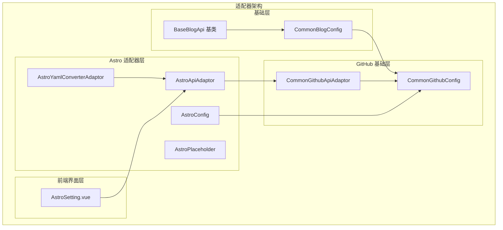
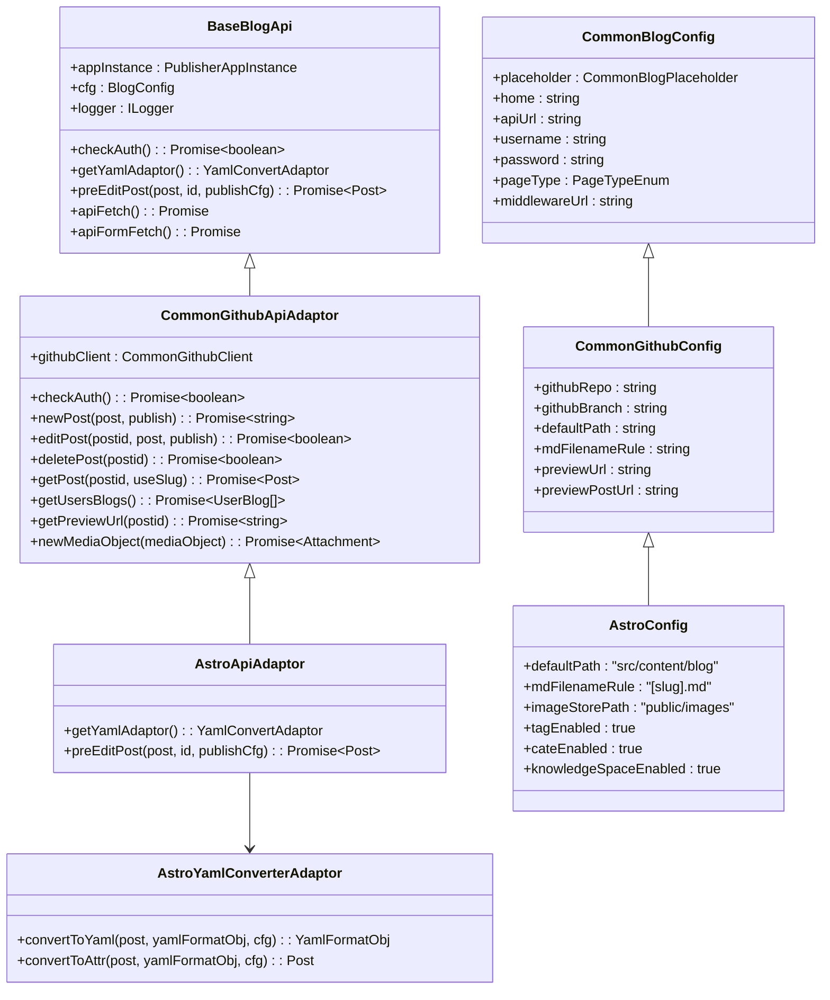
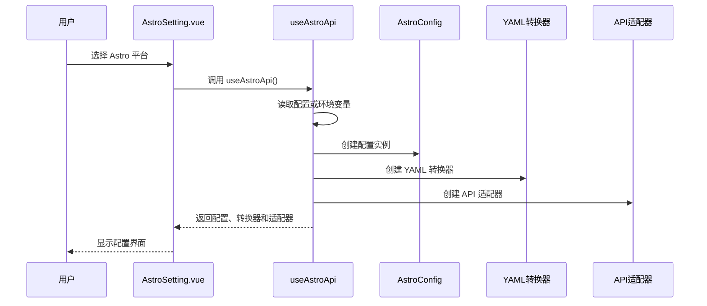
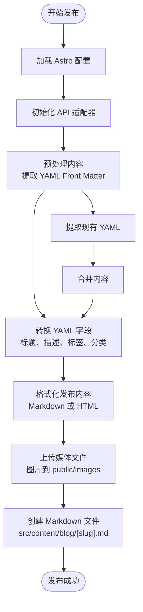

# GitHub Astro 平台适配器

<cite>
**本文档引用的文件**
- [astroApiAdaptor.ts](file://src/adaptors/api/astro/astroApiAdaptor.ts)
- [astroConfig.ts](file://src/adaptors/api/astro/astroConfig.ts)
- [useAstroApi.ts](file://src/adaptors/api/astro/useAstroApi.ts)
- [astroYamlConverterAdaptor.ts](file://src/adaptors/api/astro/astroYamlConverterAdaptor.ts)
- [astroPlaceholder.ts](file://src/adaptors/api/astro/astroPlaceholder.ts)
- [commonGithubApiAdaptor.ts](file://src/adaptors/api/base/github/commonGithubApiAdaptor.ts)
- [commonGithubConfig.ts](file://src/adaptors/api/base/github/commonGithubConfig.ts)
- [commonBlogConfig.ts](file://src/adaptors/api/base/commonBlogConfig.ts)
- [baseBlogApi.ts](file://src/adaptors/api/base/baseBlogApi.ts)
- [AstroSetting.vue](file://src/components/set/publish/singleplatform/github/AstroSetting.vue)
- [package.json](file://package.json)
</cite>

## 目录
1. [简介](#简介)
2. [项目结构](#项目结构)
3. [核心组件](#核心组件)
4. [架构概览](#架构概览)
5. [详细组件分析](#详细组件分析)
6. [依赖关系分析](#依赖关系分析)
7. [性能考虑](#性能考虑)
8. [故障排除指南](#故障排除指南)
9. [结论](#结论)

## 简介

GitHub Astro 平台适配器是 Siyuan Plugin Publisher 插件中的一个专门模块，用于将 Siyuan 笔记内容发布到基于 GitHub 的 Astro 博客平台。该适配器基于通用的 GitHub API 适配器构建，专门为 Astro 平台的 Markdown 和 YAML Front Matter 格式进行了优化。

Astro 是一个静态站点生成器，支持多种内容格式，包括 Markdown 和 Astro 组件。该适配器通过 GitHub API 实现内容的创建、编辑、删除和预览功能，同时处理 YAML Front Matter 的转换和管理。

## 项目结构

GitHub Astro 平台适配器位于插件的适配器架构中，采用模块化设计，遵循统一的适配器模式：



**图表来源**
- [astroApiAdaptor.ts:23-62](file://src/adaptors/api/astro/astroApiAdaptor.ts#L23-L62)
- [commonGithubApiAdaptor.ts:28-47](file://src/adaptors/api/base/github/commonGithubApiAdaptor.ts#L28-L47)
- [astroConfig.ts:19-51](file://src/adaptors/api/astro/astroConfig.ts#L19-L51)

**章节来源**
- [astroApiAdaptor.ts:1-62](file://src/adaptors/api/astro/astroApiAdaptor.ts#L1-L62)
- [commonGithubApiAdaptor.ts:1-352](file://src/adaptors/api/base/github/commonGithubApiAdaptor.ts#L1-L352)
- [astroConfig.ts:1-54](file://src/adaptors/api/astro/astroConfig.ts#L1-L54)

## 核心组件

### Astro API 适配器

Astro API 适配器继承自通用 GitHub API 适配器，专门处理 Astro 平台的特殊需求：

- **YAML 转换器集成**：重写 `getYamlAdaptor()` 方法，返回 Astro 专用的 YAML 转换器
- **内容预处理**：在发布前自动处理 YAML Front Matter 和 Markdown 内容
- **格式兼容性**：根据页面类型选择 Markdown 或 HTML 作为发布内容

### Astro 配置管理

Astro 配置类继承自通用 GitHub 配置，针对 Astro 平台设置了特定的默认值：

- **默认存储路径**：`src/content/blog`
- **文件命名规则**：`[slug].md`
- **图像存储位置**：`public/images`
- **标签和分类支持**：启用多分类和标签功能
- **知识空间限制**：固定发布目录，不支持动态修改

### YAML 转换器

Astro YAML 转换器负责处理 YAML Front Matter 的转换：

- **字段映射**：标题、描述、发布时间、标签、分类等字段的双向转换
- **日期格式化**：支持 ISO 8601 格式的日期转换
- **动态配置支持**：允许用户自定义额外的 YAML 字段

**章节来源**
- [astroApiAdaptor.ts:24-59](file://src/adaptors/api/astro/astroApiAdaptor.ts#L24-L59)
- [astroConfig.ts:20-50](file://src/adaptors/api/astro/astroConfig.ts#L20-L50)
- [astroYamlConverterAdaptor.ts:25-99](file://src/adaptors/api/astro/astroYamlConverterAdaptor.ts#L25-L99)

## 架构概览

GitHub Astro 平台适配器采用分层架构设计，确保了代码的可维护性和扩展性：



**图表来源**
- [baseBlogApi.ts:27-54](file://src/adaptors/api/base/baseBlogApi.ts#L27-L54)
- [commonBlogConfig.ts:13-41](file://src/adaptors/api/base/commonBlogConfig.ts#L13-L41)
- [commonGithubApiAdaptor.ts:28-47](file://src/adaptors/api/base/github/commonGithubApiAdaptor.ts#L28-L47)
- [commonGithubConfig.ts:17-108](file://src/adaptors/api/base/github/commonGithubConfig.ts#L17-L108)
- [astroApiAdaptor.ts:23-26](file://src/adaptors/api/astro/astroApiAdaptor.ts#L23-L26)
- [astroConfig.ts:19-50](file://src/adaptors/api/astro/astroConfig.ts#L19-L50)
- [astroYamlConverterAdaptor.ts:22-99](file://src/adaptors/api/astro/astroYamlConverterAdaptor.ts#L22-L99)

## 详细组件分析

### API 初始化流程

当用户使用 Astro 平台进行内容发布时，系统会执行以下初始化流程：



**图表来源**
- [useAstroApi.ts:22-96](file://src/adaptors/api/astro/useAstroApi.ts#L22-L96)
- [AstroSetting.vue:24-32](file://src/components/set/publish/singleplatform/github/AstroSetting.vue#L24-L32)

### 内容发布流程

Astro 平台的内容发布流程包含多个步骤，确保内容正确转换和发布：



**图表来源**
- [astroApiAdaptor.ts:28-59](file://src/adaptors/api/astro/astroApiAdaptor.ts#L28-L59)
- [astroYamlConverterAdaptor.ts:25-99](file://src/adaptors/api/astro/astroYamlConverterAdaptor.ts#L25-L99)
- [commonGithubApiAdaptor.ts:86-128](file://src/adaptors/api/base/github/commonGithubApiAdaptor.ts#L86-L128)

### 配置管理机制

Astro 平台的配置管理采用了灵活的设计，支持多种配置来源：

| 配置来源 | 优先级 | 用途 | 示例 |
|---------|--------|------|------|
| 用户配置 | 最高 | 手动设置的平台配置 | GitHub 用户名、仓库名 |
| 环境变量 | 中等 | 默认配置值 | VITE_GITHUB_USERNAME |
| 默认值 | 最低 | 固定的平台特性 | 发布目录、文件命名规则 |

**章节来源**
- [useAstroApi.ts:32-61](file://src/adaptors/api/astro/useAstroApi.ts#L32-L61)
- [astroConfig.ts:27-50](file://src/adaptors/api/astro/astroConfig.ts#L27-L50)

## 依赖关系分析

GitHub Astro 平台适配器依赖于多个核心库和框架：

```mermaid
graph TB
subgraph "核心依赖"
ZhiBlogApi[zhi-blog-api]
ZhiCommon[zhi-common]
ZhiGithubMiddleware[zhi-github-middleware]
end
subgraph "前端框架"
Vue3[vue@3.5.24]
ElementPlus[element-plus@2.11.8]
Pinia[pinia@3.0.4]
end
subgraph "工具库"
Lodash[lodash-es@4.17.23]
JsBase64[js-base64@3.7.8]
CryptoJS[crypto-js@4.2.0]
end
subgraph "Astro 特定"
AstroYaml[Front Matter YAML]
Markdown[Markdown 格式]
end
AstroApiAdaptor --> ZhiBlogApi
AstroApiAdaptor --> ZhiGithubMiddleware
AstroYamlConverterAdaptor --> ZhiCommon
CommonGithubApiAdaptor --> Vue3
CommonGithubApiAdaptor --> ElementPlus
```

**图表来源**
- [package.json:32-68](file://package.json#L32-L68)
- [astroApiAdaptor.ts:10-14](file://src/adaptors/api/astro/astroApiAdaptor.ts#L10-L14)
- [commonGithubApiAdaptor.ts:10-18](file://src/adaptors/api/base/github/commonGithubApiAdaptor.ts#L10-L18)

**章节来源**
- [package.json:1-102](file://package.json#L1-L102)
- [astroApiAdaptor.ts:10-14](file://src/adaptors/api/astro/astroApiAdaptor.ts#L10-L14)

## 性能考虑

### 缓存策略

- **日志缓存**：使用应用日志记录器减少重复的日志输出
- **配置缓存**：配置对象在初始化后保持不变，避免重复解析
- **媒体文件缓存**：GitHub API 支持文件去重，避免重复上传

### 异步处理

- **并发操作**：文件上传和 API 调用采用异步处理，提高响应速度
- **错误恢复**：提供重试机制，在网络不稳定时自动重试
- **进度反馈**：通过日志系统提供实时的操作状态反馈

### 内存管理

- **对象克隆**：使用深拷贝避免意外的数据污染
- **资源清理**：及时释放不再使用的临时对象和缓冲区

## 故障排除指南

### 常见问题及解决方案

| 问题类型 | 症状 | 可能原因 | 解决方案 |
|---------|------|----------|----------|
| 认证失败 | 发布时提示权限不足 | GitHub Token 无效或过期 | 检查并更新 GitHub Personal Access Token |
| 文件路径错误 | 发布到错误的目录 | 知识空间配置不正确 | 确认发布目录设置为固定值 |
| YAML 解析错误 | 内容发布格式异常 | YAML Front Matter 格式错误 | 检查 YAML 字段格式和缩进 |
| 图片上传失败 | 媒体文件无法访问 | 图片路径或权限问题 | 验证 public/images 目录权限 |

### 调试方法

1. **启用详细日志**：检查控制台输出的详细日志信息
2. **验证配置**：确认所有必需的配置项都已正确设置
3. **测试连接**：使用认证检查功能验证 GitHub 连接
4. **查看网络请求**：监控 API 调用和响应状态

**章节来源**
- [commonGithubApiAdaptor.ts:49-64](file://src/adaptors/api/base/github/commonGithubApiAdaptor.ts#L49-L64)
- [useAstroApi.ts:22-96](file://src/adaptors/api/astro/useAstroApi.ts#L22-L96)

## 结论

GitHub Astro 平台适配器是一个高度模块化的发布组件，具有以下特点：

### 设计优势

- **层次清晰**：采用分层架构，职责分离明确
- **扩展性强**：基于接口设计，易于添加新的平台支持
- **配置灵活**：支持多种配置来源，适应不同使用场景
- **错误处理完善**：提供完整的错误处理和恢复机制

### 技术特色

- **YAML 专精**：专门为 Astro 的 YAML Front Matter 格式优化
- **GitHub 集成**：深度集成 GitHub API，充分利用平台特性
- **前端友好**：提供直观的配置界面和实时反馈
- **性能优化**：采用异步处理和缓存策略提升用户体验

### 应用价值

该适配器为 Siyuan 笔记用户提供了便捷的 Astro 博客发布解决方案，简化了从笔记到静态网站的发布流程，降低了技术门槛，提高了内容发布的效率和质量。