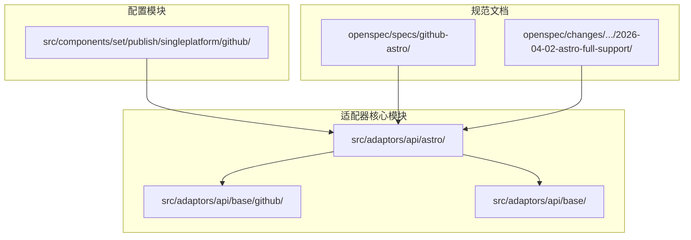
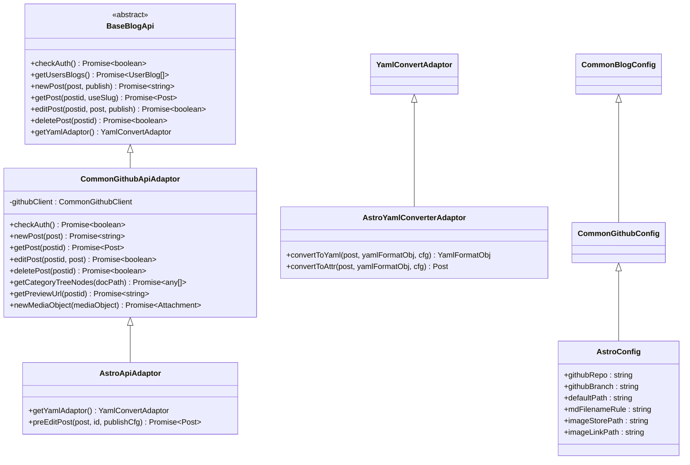
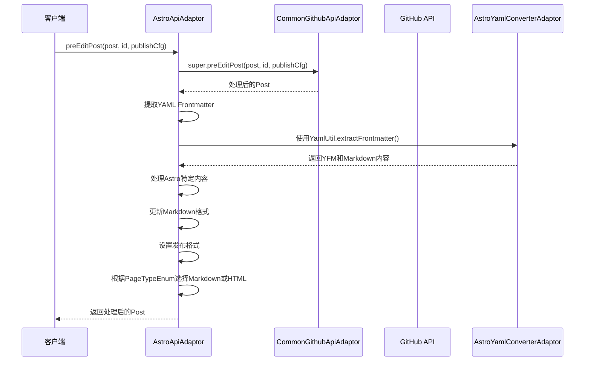
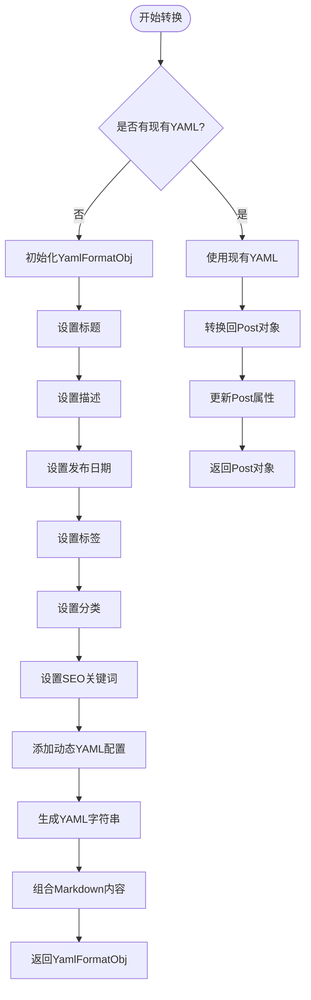
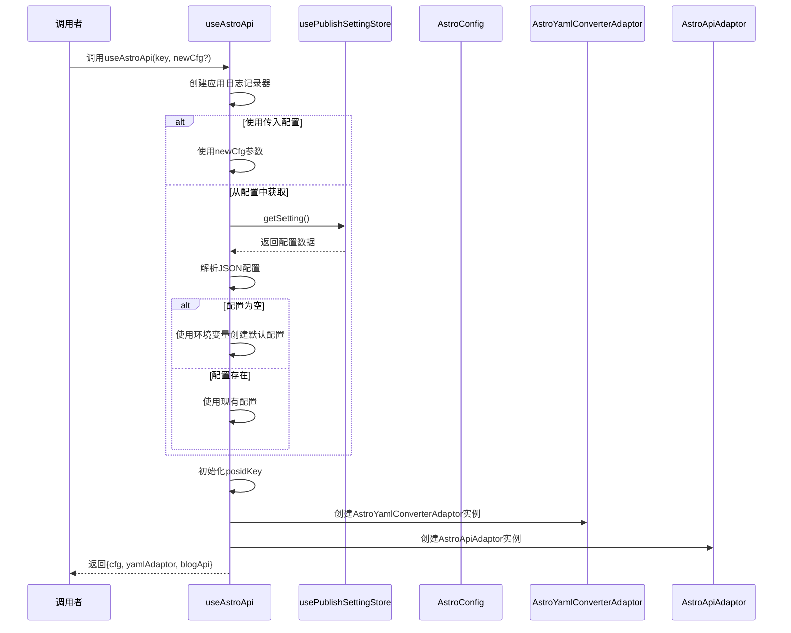
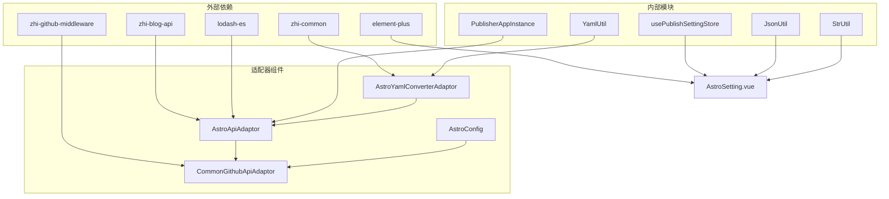

# GitHub Astro 平台适配器

<cite>
**本文档引用的文件**
- [astroApiAdaptor.ts](file://src/adaptors/api/astro/astroApiAdaptor.ts)
- [astroConfig.ts](file://src/adaptors/api/astro/astroConfig.ts)
- [useAstroApi.ts](file://src/adaptors/api/astro/useAstroApi.ts)
- [astroYamlConverterAdaptor.ts](file://src/adaptors/api/astro/astroYamlConverterAdaptor.ts)
- [commonGithubApiAdaptor.ts](file://src/adaptors/api/base/github/commonGithubApiAdaptor.ts)
- [commonGithubConfig.ts](file://src/adaptors/api/base/github/commonGithubConfig.ts)
- [commonBlogConfig.ts](file://src/adaptors/api/base/commonBlogConfig.ts)
- [AstroSetting.vue](file://src/components/set/publish/singleplatform/github/AstroSetting.vue)
- [README_zh_CN.md](file://README_zh_CN.md)
- [spec.md](file://openspec/specs/github-astro/spec.md)
- [design.md](file://openspec/changes/archive/2026-04-02-astro-full-support/design.md)
- [proposal.md](file://openspec/changes/archive/2026-04-02-astro-full-support/proposal.md)
- [tasks.md](file://openspec/changes/archive/2026-04-02-astro-full-support/tasks.md)
- [package.json](file://package.json)
</cite>

## 目录
1. [简介](#简介)
2. [项目结构](#项目结构)
3. [核心组件](#核心组件)
4. [架构概览](#架构概览)
5. [详细组件分析](#详细组件分析)
6. [依赖关系分析](#依赖关系分析)
7. [性能考虑](#性能考虑)
8. [故障排除指南](#故障排除指南)
9. [结论](#结论)

## 简介

GitHub Astro 平台适配器是 Siyuan 笔记发布工具中的一个重要组件，专门用于将思源笔记内容发布到基于 GitHub 的 Astro 静态网站生成器项目中。该适配器实现了完整的 Astro Frontmatter 格式支持，包括 YAML 头信息的生成、解析和管理。

Astro 是一个现代化的静态站点生成器，以其出色的性能和开发体验而闻名。通过这个适配器，用户可以将思源笔记中的内容无缝发布到 Astro 项目中，享受其现代化的构建性能和开发体验。

## 项目结构

GitHub Astro 平台适配器位于项目的适配器模块中，采用清晰的分层架构设计：

**图表来源**
- [astroApiAdaptor.ts:1-62](file://src/adaptors/api/astro/astroApiAdaptor.ts#L1-L62)
- [commonGithubApiAdaptor.ts:1-352](file://src/adaptors/api/base/github/commonGithubApiAdaptor.ts#L1-L352)

**章节来源**
- [astroApiAdaptor.ts:1-62](file://src/adaptors/api/astro/astroApiAdaptor.ts#L1-L62)
- [astroConfig.ts:1-54](file://src/adaptors/api/astro/astroConfig.ts#L1-L54)
- [useAstroApi.ts:1-96](file://src/adaptors/api/astro/useAstroApi.ts#L1-L96)

## 核心组件

GitHub Astro 平台适配器由四个核心组件构成，形成了完整的适配器体系：

### 1. API 适配器 (AstroApiAdaptor)
负责处理与 GitHub API 的交互，包括文章的创建、编辑、删除和预览功能。

### 2. 配置类 (AstroConfig)
管理 Astro 平台特有的配置参数，包括仓库信息、分支设置、文件命名规则等。

### 3. YAML 转换器 (AstroYamlConverterAdaptor)
专门处理 Astro Frontmatter 格式的 YAML 内容，实现标题、描述、发布时间等字段的转换。

### 4. 使用函数 (useAstroApi)
提供统一的初始化入口，负责配置加载、依赖注入和实例创建。

**章节来源**
- [astroApiAdaptor.ts:16-60](file://src/adaptors/api/astro/astroApiAdaptor.ts#L16-L60)
- [astroConfig.ts:13-51](file://src/adaptors/api/astro/astroConfig.ts#L13-L51)
- [astroYamlConverterAdaptor.ts:15-135](file://src/adaptors/api/astro/astroYamlConverterAdaptor.ts#L15-L135)
- [useAstroApi.ts:22-96](file://src/adaptors/api/astro/useAstroApi.ts#L22-L96)

## 架构概览

GitHub Astro 平台适配器采用了基于继承的设计模式，充分利用了现有的 GitHub 平台基础设施：

**图表来源**
- [commonGithubApiAdaptor.ts:28-352](file://src/adaptors/api/base/github/commonGithubApiAdaptor.ts#L28-L352)
- [astroApiAdaptor.ts:23-60](file://src/adaptors/api/astro/astroApiAdaptor.ts#L23-L60)
- [commonGithubConfig.ts:17-112](file://src/adaptors/api/base/github/commonGithubConfig.ts#L17-L112)
- [astroConfig.ts:19-51](file://src/adaptors/api/astro/astroConfig.ts#L19-L51)
- [astroYamlConverterAdaptor.ts:22-135](file://src/adaptors/api/astro/astroYamlConverterAdaptor.ts#L22-L135)

## 详细组件分析

### Astro API 适配器分析

Astro API 适配器继承自通用 GitHub API 适配器，主要扩展了对 Astro Frontmatter 格式的支持：

**图表来源**
- [astroApiAdaptor.ts:28-59](file://src/adaptors/api/astro/astroApiAdaptor.ts#L28-L59)
- [commonGithubApiAdaptor.ts:86-128](file://src/adaptors/api/base/github/commonGithubApiAdaptor.ts#L86-L128)

#### 关键特性

1. **YAML Frontmatter 处理**：自动提取和处理 Astro 格式的 YAML 头信息
2. **智能内容重组**：确保 YAML 和 Markdown 内容的正确组合
3. **格式适配**：根据页面类型动态选择 Markdown 或 HTML 格式
4. **继承扩展**：利用父类的 GitHub 集成功能

**章节来源**
- [astroApiAdaptor.ts:16-60](file://src/adaptors/api/astro/astroApiAdaptor.ts#L16-L60)

### Astro 配置类分析

Astro 配置类提供了平台特定的配置参数，确保与 Astro 项目的兼容性：

| 配置项 | 默认值 | 说明 |
|--------|--------|------|
| `defaultPath` | `"src/content/blog"` | 默认文章存储路径 |
| `mdFilenameRule` | `"[slug].md"` | Markdown 文件命名规则 |
| `imageStorePath` | `"public/images"` | 图片存储路径 |
| `imageLinkPath` | `"/images"` | 图片链接路径 |
| `pageType` | `PageTypeEnum.Markdown` | 页面类型设置 |
| `tagEnabled` | `true` | 标签功能启用 |
| `cateEnabled` | `true` | 分类功能启用 |

**章节来源**
- [astroConfig.ts:19-51](file://src/adaptors/api/astro/astroConfig.ts#L19-L51)

### YAML 转换器分析

Astro YAML 转换器实现了 Astro Frontmatter 格式的双向转换：

**图表来源**
- [astroYamlConverterAdaptor.ts:25-99](file://src/adaptors/api/astro/astroYamlConverterAdaptor.ts#L25-L99)
- [astroYamlConverterAdaptor.ts:101-131](file://src/adaptors/api/astro/astroYamlConverterAdaptor.ts#L101-L131)

#### 字段映射规则

| YAML 字段 | Post 属性 | 映射规则 |
|-----------|-----------|----------|
| `title` | `post.title` | 直接映射 |
| `description` | `post.mt_excerpt` | 直接映射 |
| `pubDate` | `post.dateCreated` | ISO 8601 格式转换 |
| `tags` | `post.mt_keywords` | 数组转逗号分隔字符串 |
| `categories` | `post.categories` | 直接映射 |
| `keywords` | `post.mt_keywords` | SEO 关键词映射 |

**章节来源**
- [astroYamlConverterAdaptor.ts:15-135](file://src/adaptors/api/astro/astroYamlConverterAdaptor.ts#L15-L135)

### 使用函数分析

useAstroApi 函数提供了统一的初始化入口，负责配置管理和实例创建：

**图表来源**
- [useAstroApi.ts:22-96](file://src/adaptors/api/astro/useAstroApi.ts#L22-L96)

**章节来源**
- [useAstroApi.ts:22-96](file://src/adaptors/api/astro/useAstroApi.ts#L22-L96)

## 依赖关系分析

GitHub Astro 平台适配器依赖于多个核心库和模块：

**图表来源**
- [package.json:32-68](file://package.json#L32-L68)
- [astroApiAdaptor.ts:10-14](file://src/adaptors/api/astro/astroApiAdaptor.ts#L10-L14)
- [useAstroApi.ts:10-20](file://src/adaptors/api/astro/useAstroApi.ts#L10-L20)

### 核心依赖说明

1. **zhi-blog-api**: 提供博客 API 接口定义和基础类型
2. **zhi-common**: 提供通用工具函数和实用程序
3. **zhi-github-middleware**: 提供 GitHub API 客户端封装
4. **lodash-es**: 提供函数式编程工具函数
5. **element-plus**: 提供 Vue 3 组件库支持

**章节来源**
- [package.json:32-68](file://package.json#L32-L68)

## 性能考虑

GitHub Astro 平台适配器在设计时充分考虑了性能优化：

### 1. 缓存策略
- 使用深拷贝避免意外的数据修改
- 合理的配置缓存机制减少重复初始化

### 2. 异步处理
- 所有网络请求都采用异步处理
- 使用 Promise 链式调用提高代码可读性

### 3. 内存管理
- 及时释放不再使用的对象引用
- 避免内存泄漏的常见陷阱

### 4. 错误处理
- 完善的错误捕获和处理机制
- 提供详细的调试日志信息

## 故障排除指南

### 常见问题及解决方案

#### 1. 认证失败
**症状**: `checkAuth` 返回 false
**解决方案**: 
- 检查 GitHub 访问令牌的有效性
- 确认仓库权限设置正确
- 验证网络连接状态

#### 2. 文件发布失败
**症状**: `newPost` 或 `editPost` 抛出异常
**解决方案**:
- 检查目标路径的写入权限
- 验证文件名规则的合法性
- 确认仓库分支状态

#### 3. YAML 转换错误
**症状**: YAML 解析或生成失败
**解决方案**:
- 检查 YAML 格式的正确性
- 验证字段映射关系
- 查看详细的错误日志

#### 4. 预览链接无效
**症状**: 预览 URL 无法访问
**解决方案**:
- 检查预览 URL 模板配置
- 验证 GitHub Pages 设置
- 确认部署状态

**章节来源**
- [commonGithubApiAdaptor.ts:49-64](file://src/adaptors/api/base/github/commonGithubApiAdaptor.ts#L49-L64)
- [commonGithubApiAdaptor.ts:165-210](file://src/adaptors/api/base/github/commonGithubApiAdaptor.ts#L165-L210)

## 结论

GitHub Astro 平台适配器是一个设计精良、功能完整的组件，它成功地将思源笔记与 Astro 静态网站生成器进行了无缝集成。通过采用清晰的分层架构和继承设计模式，该适配器不仅保持了代码的可维护性，还充分利用了现有的 GitHub 平台基础设施。

### 主要优势

1. **完整的 Astro 支持**: 提供了对 Astro Frontmatter 格式的全面支持
2. **易于扩展**: 基于继承的设计使得新平台的添加变得简单
3. **配置灵活**: 支持多种配置方式，包括环境变量和用户设置
4. **错误处理完善**: 提供了健壮的错误处理和调试机制

### 技术亮点

1. **模块化设计**: 清晰的职责分离和模块边界
2. **类型安全**: 充分利用 TypeScript 的类型系统
3. **异步编程**: 采用现代 JavaScript 异步编程模式
4. **国际化支持**: 完整的多语言支持

该适配器为用户提供了将思源笔记内容发布到 Astro 项目的能力，是 Siyuan 笔记发布工具生态系统中的重要组成部分。随着 Astro 生态系统的不断发展，这个适配器也将持续演进，为用户提供更好的使用体验。