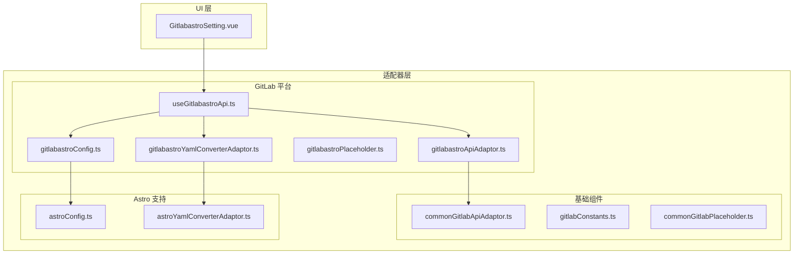
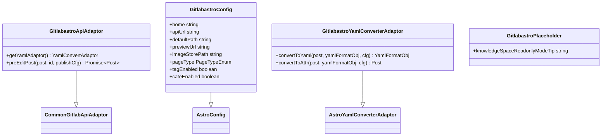
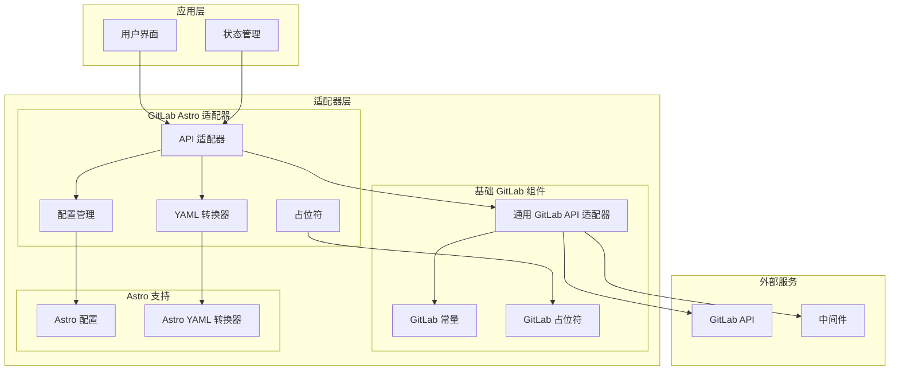
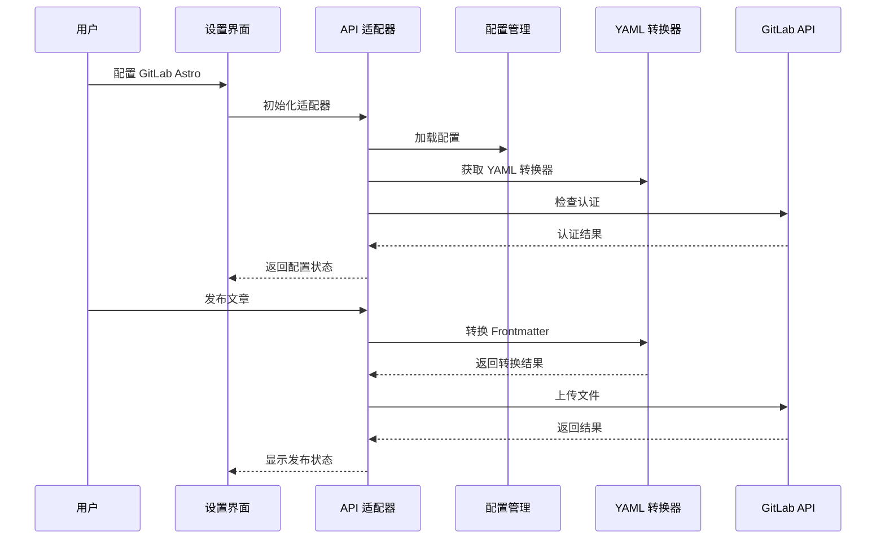
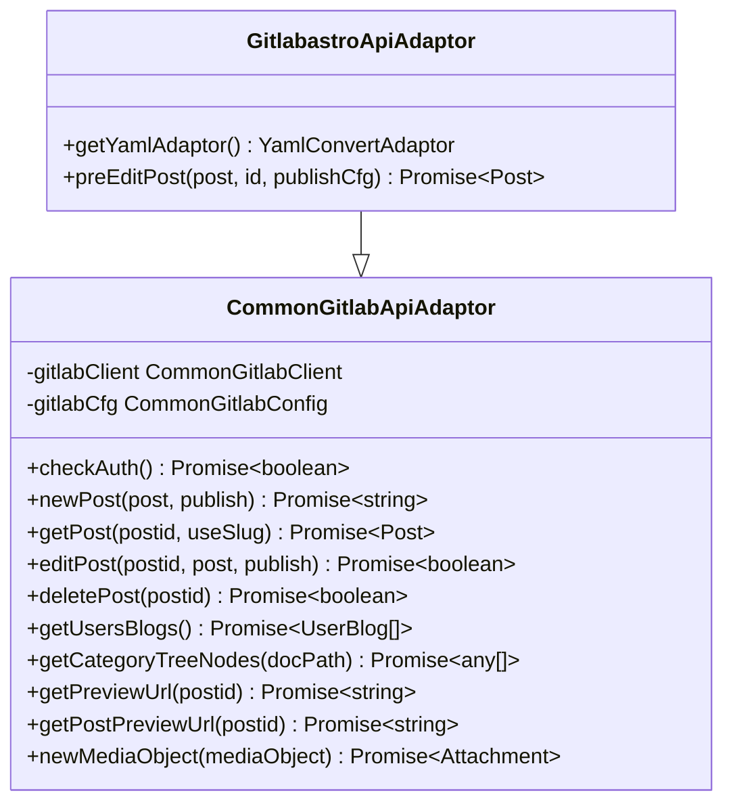
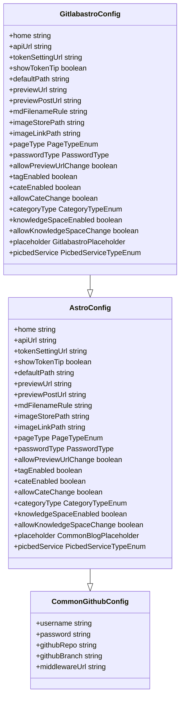
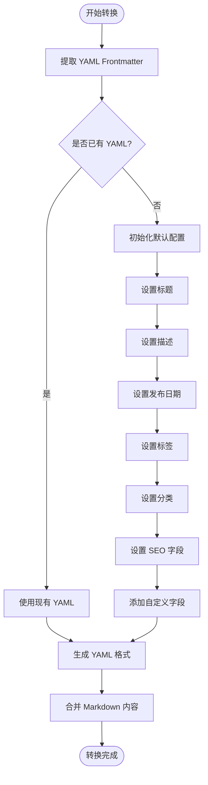
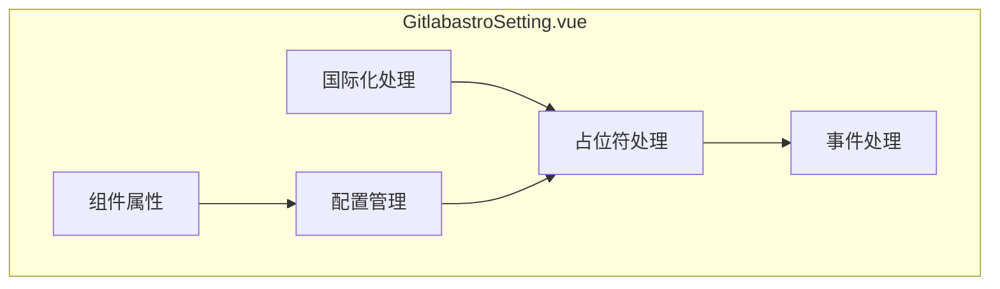
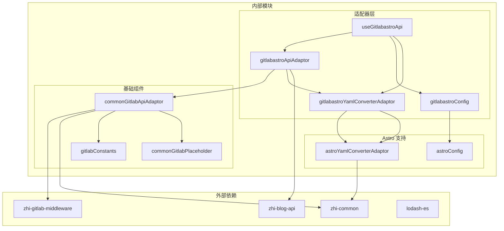
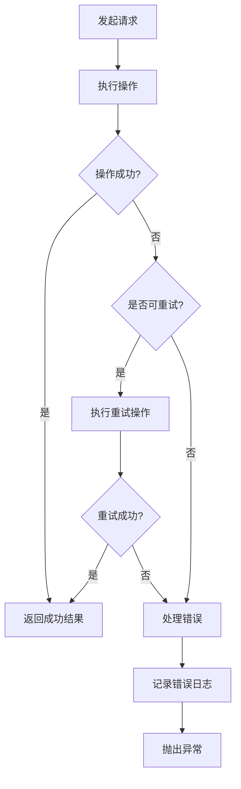

# GitLab Astro 平台适配器

<cite>
**本文档引用的文件**
- [gitlabastroApiAdaptor.ts](file://src/adaptors/api/gitlab-astro/gitlabastroApiAdaptor.ts)
- [gitlabastroConfig.ts](file://src/adaptors/api/gitlab-astro/gitlabastroConfig.ts)
- [gitlabastroPlaceholder.ts](file://src/adaptors/api/gitlab-astro/gitlabastroPlaceholder.ts)
- [gitlabastroYamlConverterAdaptor.ts](file://src/adaptors/api/gitlab-astro/gitlabastroYamlConverterAdaptor.ts)
- [useGitlabastroApi.ts](file://src/adaptors/api/gitlab-astro/useGitlabastroApi.ts)
- [commonGitlabApiAdaptor.ts](file://src/adaptors/api/base/gitlab/commonGitlabApiAdaptor.ts)
- [astroConfig.ts](file://src/adaptors/api/astro/astroConfig.ts)
- [astroYamlConverterAdaptor.ts](file://src/adaptors/api/astro/astroYamlConverterAdaptor.ts)
- [gitlabConstants.ts](file://src/adaptors/api/base/gitlab/gitlabConstants.ts)
- [commonGitlabPlaceholder.ts](file://src/adaptors/api/base/gitlab/commonGitlabPlaceholder.ts)
- [GitlabastroSetting.vue](file://src/components/set/publish/singleplatform/gitlab/GitlabastroSetting.vue)
- [spec.md](file://openspec/specs/gitlab-astro/spec.md)
- [pre.ts](file://src/platforms/pre.ts)
- [platformMetadata.ts](file://src/models/platformMetadata.ts)
</cite>

## 目录
1. [简介](#简介)
2. [项目结构](#项目结构)
3. [核心组件](#核心组件)
4. [架构概览](#架构概览)
5. [详细组件分析](#详细组件分析)
6. [依赖关系分析](#依赖关系分析)
7. [性能考虑](#性能考虑)
8. [故障排除指南](#故障排除指南)
9. [结论](#结论)

## 简介

GitLab Astro 平台适配器是 Siyuan Publisher 插件中的一个重要组件，专门用于将思源笔记内容发布到 GitLab 上的 Astro 项目中。该适配器基于 GitLab 平台的特性，实现了完整的 Astro 内容发布功能，包括 Markdown 文件的 Frontmatter 处理、YAML 格式转换、图片上传等功能。

该适配器遵循了插件的整体架构设计，采用了模块化的组件结构，确保了代码的可维护性和扩展性。通过使用 Vue 3 Composition API 和 TypeScript，提供了类型安全的开发体验。

## 项目结构

GitLab Astro 适配器位于插件的适配器层中，采用清晰的层次结构组织：

**图表来源**
- [gitlabastroApiAdaptor.ts:1-62](file://src/adaptors/api/gitlab-astro/gitlabastroApiAdaptor.ts#L1-L62)
- [commonGitlabApiAdaptor.ts:1-300](file://src/adaptors/api/base/gitlab/commonGitlabApiAdaptor.ts#L1-L300)

**章节来源**
- [gitlabastroApiAdaptor.ts:1-62](file://src/adaptors/api/gitlab-astro/gitlabastroApiAdaptor.ts#L1-L62)
- [useGitlabastroApi.ts:1-96](file://src/adaptors/api/gitlab-astro/useGitlabastroApi.ts#L1-L96)

## 核心组件

GitLab Astro 适配器由四个核心组件构成，形成了完整的适配器体系：

### 组件架构图

**图表来源**
- [gitlabastroApiAdaptor.ts:23-60](file://src/adaptors/api/gitlab-astro/gitlabastroApiAdaptor.ts#L23-L60)
- [gitlabastroConfig.ts:20-54](file://src/adaptors/api/gitlab-astro/gitlabastroConfig.ts#L20-L54)
- [gitlabastroYamlConverterAdaptor.ts:19-20](file://src/adaptors/api/gitlab-astro/gitlabastroYamlConverterAdaptor.ts#L19-L20)

### 组件职责

1. **API 适配器 (GitlabastroApiAdaptor)**: 负责与 GitLab API 的交互，处理文章的创建、编辑、删除等操作
2. **配置类 (GitlabastroConfig)**: 定义 GitLab Astro 平台的特定配置参数
3. **YAML 转换器 (GitlabastroYamlConverterAdaptor)**: 处理 Astro Frontmatter 的转换逻辑
4. **占位符类 (GitlabastroPlaceholder)**: 提供用户界面的提示信息

**章节来源**
- [gitlabastroApiAdaptor.ts:16-60](file://src/adaptors/api/gitlab-astro/gitlabastroApiAdaptor.ts#L16-L60)
- [gitlabastroConfig.ts:14-54](file://src/adaptors/api/gitlab-astro/gitlabastroConfig.ts#L14-L54)
- [gitlabastroYamlConverterAdaptor.ts:12-20](file://src/adaptors/api/gitlab-astro/gitlabastroYamlConverterAdaptor.ts#L12-L20)

## 架构概览

GitLab Astro 适配器采用了分层架构设计，确保了各组件之间的松耦合和高内聚。

### 整体架构图

**图表来源**
- [useGitlabastroApi.ts:22-94](file://src/adaptors/api/gitlab-astro/useGitlabastroApi.ts#L22-L94)
- [commonGitlabApiAdaptor.ts:30-55](file://src/adaptors/api/base/gitlab/commonGitlabApiAdaptor.ts#L30-L55)

### 数据流流程

**图表来源**
- [useGitlabastroApi.ts:22-94](file://src/adaptors/api/gitlab-astro/useGitlabastroApi.ts#L22-L94)
- [gitlabastroApiAdaptor.ts:28-59](file://src/adaptors/api/gitlab-astro/gitlabastroApiAdaptor.ts#L28-L59)

**章节来源**
- [useGitlabastroApi.ts:22-94](file://src/adaptors/api/gitlab-astro/useGitlabastroApi.ts#L22-L94)
- [commonGitlabApiAdaptor.ts:57-136](file://src/adaptors/api/base/gitlab/commonGitlabApiAdaptor.ts#L57-L136)

## 详细组件分析

### API 适配器组件

API 适配器是 GitLab Astro 适配器的核心组件，负责处理与 GitLab API 的所有交互。

#### 类结构分析

**图表来源**
- [commonGitlabApiAdaptor.ts:30-300](file://src/adaptors/api/base/gitlab/commonGitlabApiAdaptor.ts#L30-L300)
- [gitlabastroApiAdaptor.ts:23-60](file://src/adaptors/api/gitlab-astro/gitlabastroApiAdaptor.ts#L23-L60)

#### 关键方法实现

**预编辑文章方法**：
- 处理文章的前置属性
- 提取和处理 Frontmatter
- 根据页面类型设置发布格式

**章节来源**
- [gitlabastroApiAdaptor.ts:28-59](file://src/adaptors/api/gitlab-astro/gitlabastroApiAdaptor.ts#L28-L59)

### 配置管理系统

配置管理系统负责管理 GitLab Astro 平台的所有配置参数。

#### 配置类继承关系

**图表来源**
- [astroConfig.ts:19-51](file://src/adaptors/api/astro/astroConfig.ts#L19-L51)
- [gitlabastroConfig.ts:20-54](file://src/adaptors/api/gitlab-astro/gitlabastroConfig.ts#L20-L54)

#### 配置参数说明

| 参数名称 | 类型 | 默认值 | 说明 |
|---------|------|--------|------|
| home | string | "[your-gitlab-home]" | GitLab 主页地址 |
| apiUrl | string | "[your-gitlab-api-url]" | GitLab API 地址 |
| tokenSettingUrl | string | "[your-gitlab-host]/-/user_settings/personal_access_tokens" | 访问令牌设置页面 |
| defaultPath | string | "src/content/blog" | 默认文章存储路径 |
| previewUrl | string | "/[user]/[repo]/blob/[branch]/[docpath]" | 预览 URL 模板 |
| mdFilenameRule | string | "[slug].md" | Markdown 文件命名规则 |
| imageStorePath | string | "public/images" | 图片存储路径 |
| pageType | PageTypeEnum | PageTypeEnum.Markdown | 页面类型 |
| tagEnabled | boolean | true | 标签功能开关 |
| cateEnabled | boolean | true | 分类功能开关 |

**章节来源**
- [gitlabastroConfig.ts:30-53](file://src/adaptors/api/gitlab-astro/gitlabastroConfig.ts#L30-L53)

### YAML 转换器组件

YAML 转换器负责处理 Astro Frontmatter 的转换逻辑，确保文章内容符合 Astro 的要求。

#### 转换流程图

**图表来源**
- [astroYamlConverterAdaptor.ts:25-99](file://src/adaptors/api/astro/astroYamlConverterAdaptor.ts#L25-L99)

#### 转换规则

| 字段名称 | 来源 | 处理方式 |
|---------|------|----------|
| title | Post.title | 直接复制 |
| description | Post.mt_excerpt | 空值时设置为空字符串 |
| pubDate | Post.dateCreated | 格式化为 yyyy-MM-dd |
| tags | Post.mt_keywords | 逗号分隔转换为数组 |
| categories | Post.categories | 直接复制 |
| keywords | Post.mt_keywords | SEO 关键词 |

**章节来源**
- [astroYamlConverterAdaptor.ts:101-131](file://src/adaptors/api/astro/astroYamlConverterAdaptor.ts#L101-L131)

### 用户界面组件

用户界面组件提供了 GitLab Astro 平台的配置界面。

#### 设置界面结构

**图表来源**
- [GitlabastroSetting.vue:18-44](file://src/components/set/publish/singleplatform/gitlab/GitlabastroSetting.vue#L18-L44)

**章节来源**
- [GitlabastroSetting.vue:25-34](file://src/components/set/publish/singleplatform/gitlab/GitlabastroSetting.vue#L25-L34)

## 依赖关系分析

GitLab Astro 适配器的依赖关系体现了清晰的分层架构设计。

### 依赖关系图

**图表来源**
- [gitlabastroApiAdaptor.ts:10-14](file://src/adaptors/api/gitlab-astro/gitlabastroApiAdaptor.ts#L10-L14)
- [useGitlabastroApi.ts:10-20](file://src/adaptors/api/gitlab-astro/useGitlabastroApi.ts#L10-L20)

### 关键依赖说明

1. **zhi-blog-api**: 提供博客 API 的基础接口定义
2. **zhi-gitlab-middleware**: 提供 GitLab API 的中间件封装
3. **zhi-common**: 提供通用工具函数和实用程序
4. **lodash-es**: 提供函数式编程工具函数

**章节来源**
- [gitlabastroApiAdaptor.ts:10-14](file://src/adaptors/api/gitlab-astro/gitlabastroApiAdaptor.ts#L10-L14)
- [useGitlabastroApi.ts:10-20](file://src/adaptors/api/gitlab-astro/useGitlabastroApi.ts#L10-L20)

## 性能考虑

GitLab Astro 适配器在设计时充分考虑了性能优化和用户体验。

### 性能优化策略

1. **异步操作**: 所有网络请求都采用异步处理，避免阻塞主线程
2. **缓存机制**: 合理使用浏览器缓存和内存缓存
3. **错误重试**: 实现智能的错误重试机制
4. **资源复用**: 复用连接和客户端实例

### 错误处理机制

**图表来源**
- [commonGitlabApiAdaptor.ts:112-133](file://src/adaptors/api/base/gitlab/commonGitlabApiAdaptor.ts#L112-L133)

## 故障排除指南

### 常见问题及解决方案

#### 认证失败

**问题症状**:
- 发布时提示认证失败
- 预览链接无法访问

**解决步骤**:
1. 检查 GitLab 访问令牌是否有效
2. 验证仓库权限设置
3. 确认中间件配置正确

**章节来源**
- [commonGitlabApiAdaptor.ts:57-72](file://src/adaptors/api/base/gitlab/commonGitlabApiAdaptor.ts#L57-L72)

#### 文件上传失败

**问题症状**:
- 图片上传成功但文章无法发布
- 文件路径错误

**解决步骤**:
1. 检查目标路径是否存在
2. 验证文件权限设置
3. 确认文件名规则符合要求

**章节来源**
- [commonGitlabApiAdaptor.ts:94-136](file://src/adaptors/api/base/gitlab/commonGitlabApiAdaptor.ts#L94-L136)

#### YAML 转换错误

**问题症状**:
- Frontmatter 格式不正确
- 文章属性丢失

**解决步骤**:
1. 检查 YAML 语法格式
2. 验证必需字段完整性
3. 确认字段类型正确性

**章节来源**
- [astroYamlConverterAdaptor.ts:25-99](file://src/adaptors/api/astro/astroYamlConverterAdaptor.ts#L25-L99)

## 结论

GitLab Astro 平台适配器是一个设计精良、功能完整的发布组件，具有以下特点：

### 技术优势

1. **模块化设计**: 清晰的组件分离，便于维护和扩展
2. **类型安全**: 使用 TypeScript 提供完整的类型检查
3. **异步处理**: 采用现代异步编程模式
4. **错误处理**: 完善的错误处理和恢复机制

### 功能特性

1. **完整的 Astro 支持**: 符合 Astro Frontmatter 规范
2. **灵活的配置管理**: 支持多种配置方式和环境变量
3. **用户友好的界面**: 提供直观的配置和使用体验
4. **强大的扩展性**: 易于添加新的平台支持

### 应用价值

该适配器为思源笔记用户提供了便捷的 GitLab Astro 内容发布解决方案，简化了复杂的技术配置，让用户能够专注于内容创作。通过标准化的接口设计和完善的错误处理机制，确保了系统的稳定性和可靠性。

在未来的发展中，该适配器可以进一步扩展支持更多的静态站点生成器，为用户提供更丰富的发布选项。