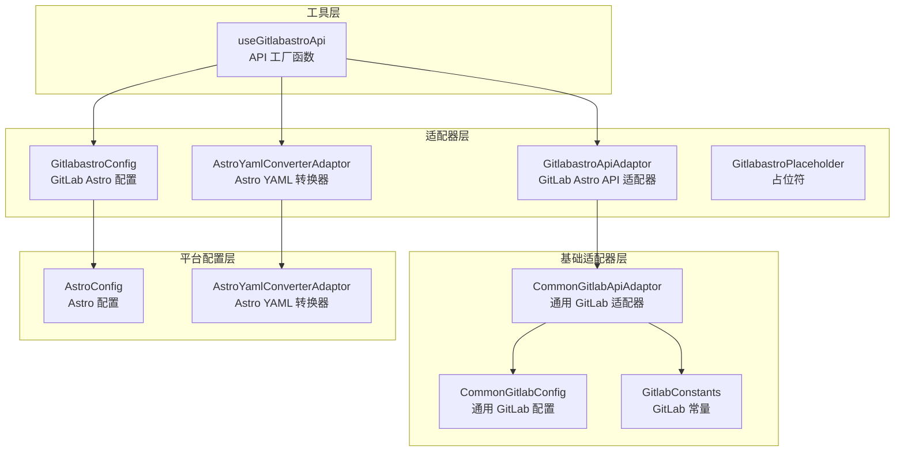
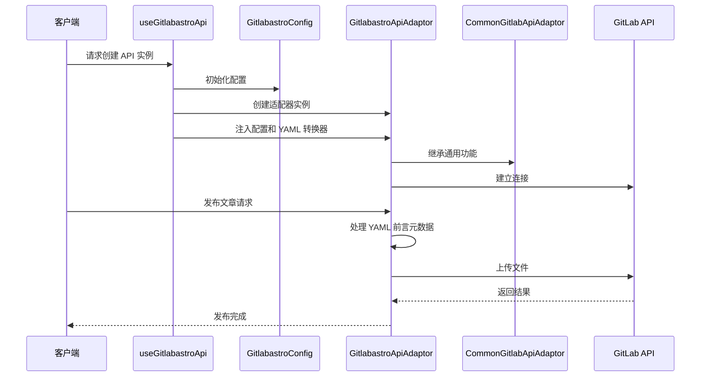
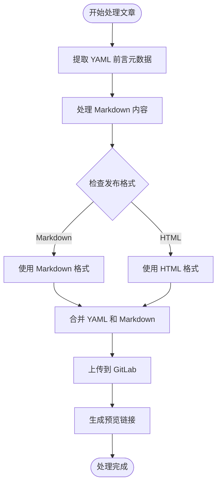
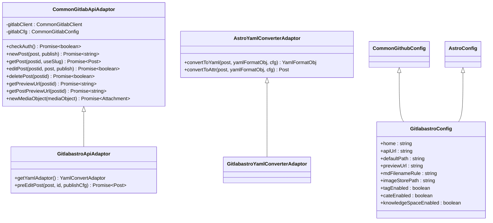
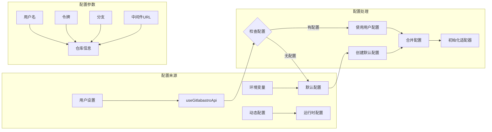
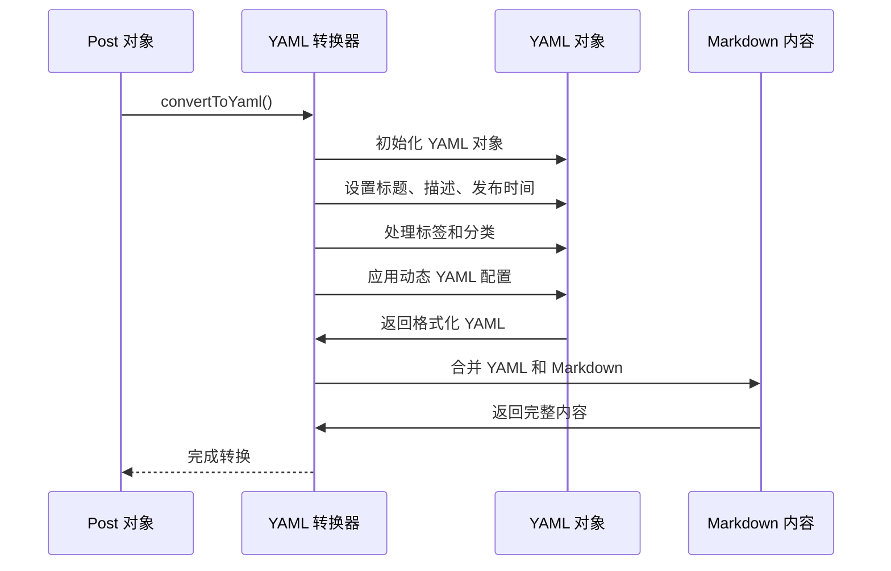
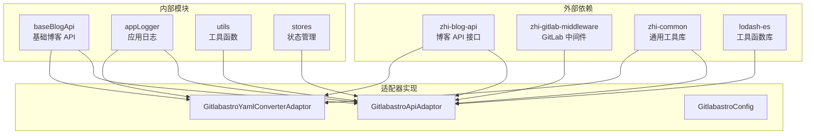
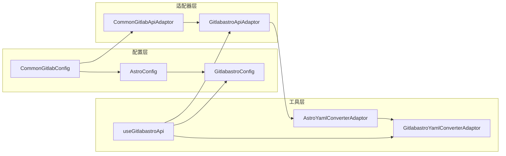

# GitLab Astro 平台适配器

<cite>
**本文档引用的文件**
- [gitlabastroApiAdaptor.ts](file://src/adaptors/api/gitlab-astro/gitlabastroApiAdaptor.ts)
- [gitlabastroConfig.ts](file://src/adaptors/api/gitlab-astro/gitlabastroConfig.ts)
- [gitlabastroPlaceholder.ts](file://src/adaptors/api/gitlab-astro/gitlabastroPlaceholder.ts)
- [gitlabastroYamlConverterAdaptor.ts](file://src/adaptors/api/gitlab-astro/gitlabastroYamlConverterAdaptor.ts)
- [useGitlabastroApi.ts](file://src/adaptors/api/gitlab-astro/useGitlabastroApi.ts)
- [commonGitlabApiAdaptor.ts](file://src/adaptors/api/base/gitlab/commonGitlabApiAdaptor.ts)
- [astroConfig.ts](file://src/adaptors/api/astro/astroConfig.ts)
- [astroYamlConverterAdaptor.ts](file://src/adaptors/api/astro/astroYamlConverterAdaptor.ts)
- [commonGitlabConfig.ts](file://src/adaptors/api/base/gitlab/commonGitlabConfig.ts)
- [gitlabConstants.ts](file://src/adaptors/api/base/gitlab/gitlabConstants.ts)
- [GitlabastroSetting.vue](file://src/components/set/publish/singleplatform/gitlab/GitlabastroSetting.vue)
</cite>

## 目录
1. [简介](#简介)
2. [项目结构](#项目结构)
3. [核心组件](#核心组件)
4. [架构概览](#架构概览)
5. [详细组件分析](#详细组件分析)
6. [依赖关系分析](#依赖关系分析)
7. [性能考虑](#性能考虑)
8. [故障排除指南](#故障排除指南)
9. [结论](#结论)

## 简介

GitLab Astro 平台适配器是 Siyuan Publisher 插件中的一个重要组件，专门用于将 Siyuan 笔记内容发布到 GitLab 托管的 Astro 静态网站平台。该适配器基于通用的 GitLab API 适配器构建，专门为 Astro 平台的 Markdown 和 YAML 前言元数据格式进行了优化。

该适配器的主要功能包括：
- 将 Siyuan 内容转换为 Astro 兼容的 Markdown 格式
- 处理 YAML 前言元数据的提取和注入
- 支持标签、分类和知识空间的管理
- 提供完整的发布、编辑、删除和预览功能

## 项目结构

GitLab Astro 适配器位于插件的适配器模块中，采用清晰的层次化组织结构：

**图表来源**
- [gitlabastroApiAdaptor.ts:1-62](file://src/adaptors/api/gitlab-astro/gitlabastroApiAdaptor.ts#L1-L62)
- [commonGitlabApiAdaptor.ts:1-300](file://src/adaptors/api/base/gitlab/commonGitlabApiAdaptor.ts#L1-L300)

**章节来源**
- [gitlabastroApiAdaptor.ts:1-62](file://src/adaptors/api/gitlab-astro/gitlabastroApiAdaptor.ts#L1-L62)
- [useGitlabastroApi.ts:1-96](file://src/adaptors/api/gitlab-astro/useGitlabastroApi.ts#L1-L96)

## 核心组件

### GitlabastroApiAdaptor（主适配器）

GitlabastroApiAdaptor 是整个适配器系统的核心，继承自通用 GitLab 适配器，专门处理 Astro 平台的特殊需求。

**主要特性：**
- 继承通用 GitLab 功能（文件操作、认证、媒体处理）
- 重写 YAML 处理逻辑以适应 Astro 格式
- 支持 Markdown 和 HTML 两种发布格式
- 提供预编辑功能来处理 YAML 前言元数据

### GitlabastroConfig（配置管理）

配置类负责管理 GitLab Astro 平台的所有配置参数，包括：
- 基础连接信息（用户名、令牌、仓库、分支）
- 平台特定路径规则（默认路径、文件命名规则）
- 预览 URL 格式
- 功能开关（标签、分类、知识空间支持）

### GitlabastroYamlConverterAdaptor（YAML 处理器）

专门处理 Astro 平台的 YAML 前言元数据转换，支持：
- 标题、描述、发布时间等标准字段
- 标签和分类的数组格式
- SEO 关键字处理
- 动态 YAML 配置支持

**章节来源**
- [gitlabastroApiAdaptor.ts:16-60](file://src/adaptors/api/gitlab-astro/gitlabastroApiAdaptor.ts#L16-L60)
- [gitlabastroConfig.ts:14-54](file://src/adaptors/api/gitlab-astro/gitlabastroConfig.ts#L14-L54)
- [gitlabastroYamlConverterAdaptor.ts:12-21](file://src/adaptors/api/gitlab-astro/gitlabastroYamlConverterAdaptor.ts#L12-L21)

## 架构概览

GitLab Astro 适配器采用了分层架构设计，确保了良好的可维护性和扩展性：

**图表来源**
- [useGitlabastroApi.ts:22-96](file://src/adaptors/api/gitlab-astro/useGitlabastroApi.ts#L22-L96)
- [gitlabastroApiAdaptor.ts:23-60](file://src/adaptors/api/gitlab-astro/gitlabastroApiAdaptor.ts#L23-L60)

### 数据流处理

适配器在处理文章时遵循以下数据流：

**图表来源**
- [gitlabastroApiAdaptor.ts:28-59](file://src/adaptors/api/gitlab-astro/gitlabastroApiAdaptor.ts#L28-L59)

## 详细组件分析

### API 适配器类结构

**图表来源**
- [commonGitlabApiAdaptor.ts:30-300](file://src/adaptors/api/base/gitlab/commonGitlabApiAdaptor.ts#L30-L300)
- [gitlabastroApiAdaptor.ts:23-60](file://src/adaptors/api/gitlab-astro/gitlabastroApiAdaptor.ts#L23-L60)
- [astroYamlConverterAdaptor.ts:22-135](file://src/adaptors/api/astro/astroYamlConverterAdaptor.ts#L22-L135)
- [gitlabastroConfig.ts:20-54](file://src/adaptors/api/gitlab-astro/gitlabastroConfig.ts#L20-L54)

### 配置管理机制

配置系统采用了灵活的设计模式，支持多种配置来源：

**图表来源**
- [useGitlabastroApi.ts:32-61](file://src/adaptors/api/gitlab-astro/useGitlabastroApi.ts#L32-L61)
- [gitlabastroConfig.ts:20-54](file://src/adaptors/api/gitlab-astro/gitlabastroConfig.ts#L20-L54)

**章节来源**
- [commonGitlabApiAdaptor.ts:34-55](file://src/adaptors/api/base/gitlab/commonGitlabApiAdaptor.ts#L34-L55)
- [useGitlabastroApi.ts:22-96](file://src/adaptors/api/gitlab-astro/useGitlabastroApi.ts#L22-L96)

### YAML 处理流程

YAML 处理是 Astro 平台适配器的核心功能之一，涉及复杂的元数据转换：

**图表来源**
- [astroYamlConverterAdaptor.ts:25-99](file://src/adaptors/api/astro/astroYamlConverterAdaptor.ts#L25-L99)

**章节来源**
- [astroYamlConverterAdaptor.ts:101-131](file://src/adaptors/api/astro/astroYamlConverterAdaptor.ts#L101-L131)

## 依赖关系分析

### 外部依赖

GitLab Astro 适配器依赖于多个外部库和内部模块：

**图表来源**
- [gitlabastroApiAdaptor.ts:10-14](file://src/adaptors/api/gitlab-astro/gitlabastroApiAdaptor.ts#L10-L14)
- [useGitlabastroApi.ts:10-20](file://src/adaptors/api/gitlab-astro/useGitlabastroApi.ts#L10-L20)

### 内部模块依赖

适配器系统内部模块之间的依赖关系清晰明确：

**图表来源**
- [commonGitlabConfig.ts:10-15](file://src/adaptors/api/base/gitlab/commonGitlabConfig.ts#L10-L15)
- [astroConfig.ts:19-50](file://src/adaptors/api/astro/astroConfig.ts#L19-L50)
- [commonGitlabApiAdaptor.ts:30-55](file://src/adaptors/api/base/gitlab/commonGitlabApiAdaptor.ts#L30-L55)

**章节来源**
- [gitlabConstants.ts:16-21](file://src/adaptors/api/base/gitlab/gitlabConstants.ts#L16-L21)
- [GitlabastroSetting.vue:10-35](file://src/components/set/publish/singleplatform/gitlab/GitlabastroSetting.vue#L10-L35)

## 性能考虑

### 缓存策略

适配器系统采用了多层次的缓存策略来优化性能：

1. **配置缓存**：配置信息在首次加载后会被缓存，避免重复解析
2. **API 连接复用**：GitLab 客户端连接会在会话期间复用
3. **日志缓存**：频繁的日志操作会被批量处理

### 异步处理

所有网络操作都采用异步处理模式：
- 文件上传和下载使用 Promise 链式调用
- YAML 解析采用异步方法避免阻塞主线程
- 错误处理包含超时机制

### 内存管理

- 使用 `toRaw` 函数避免 Vue 响应式系统的性能开销
- 及时清理临时对象和大对象引用
- 合理使用深拷贝避免数据污染

## 故障排除指南

### 常见问题及解决方案

#### 认证失败
**症状**：无法连接到 GitLab 服务器
**原因**：
- 令牌无效或过期
- 用户名或仓库名称错误
- 网络连接问题

**解决方法**：
1. 验证 GitLab 访问令牌的有效性
2. 检查用户名和仓库配置
3. 确认网络连接正常

#### 文件上传失败
**症状**：文章发布后无法找到对应文件
**原因**：
- 文件路径格式错误
- 权限不足
- 仓库分支问题

**解决方法**：
1. 检查文件路径是否符合 Astro 规范
2. 验证用户对仓库的写入权限
3. 确认目标分支存在且可写

#### YAML 解析错误
**症状**：文章内容显示异常或元数据丢失
**原因**：
- YAML 格式不正确
- 字段类型不匹配
- 编码问题

**解决方法**：
1. 验证 YAML 格式的正确性
2. 检查字段类型和值范围
3. 确认文件编码为 UTF-8

**章节来源**
- [commonGitlabApiAdaptor.ts:57-72](file://src/adaptors/api/base/gitlab/commonGitlabApiAdaptor.ts#L57-L72)
- [gitlabastroApiAdaptor.ts:28-59](file://src/adaptors/api/gitlab-astro/gitlabastroApiAdaptor.ts#L28-L59)

### 调试技巧

1. **启用详细日志**：通过配置日志级别获取详细的调试信息
2. **检查网络请求**：使用浏览器开发者工具监控 API 调用
3. **验证配置**：使用配置验证工具检查配置文件的正确性
4. **测试连接**：使用认证检查功能验证连接状态

## 结论

GitLab Astro 平台适配器是一个设计精良、功能完整的发布系统组件。它成功地将 Siyuan 笔记内容转换为 Astro 平台兼容的格式，提供了完整的发布生命周期管理。

### 主要优势

1. **模块化设计**：清晰的分层架构便于维护和扩展
2. **配置灵活**：支持多种配置来源和动态配置
3. **功能完整**：涵盖发布、编辑、删除、预览等所有必要功能
4. **性能优化**：采用异步处理和缓存策略提升用户体验

### 技术特点

- 基于 TypeScript 的强类型支持
- 采用现代前端框架的最佳实践
- 完善的错误处理和日志记录
- 良好的可测试性和可维护性

该适配器为 Siyuan Publisher 插件提供了强大的 GitLab Astro 发布能力，是构建现代化知识管理和内容发布工作流的重要基础设施。