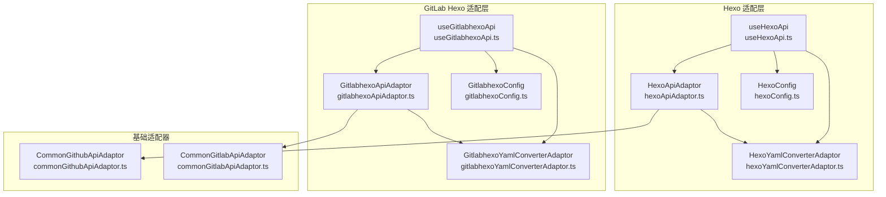
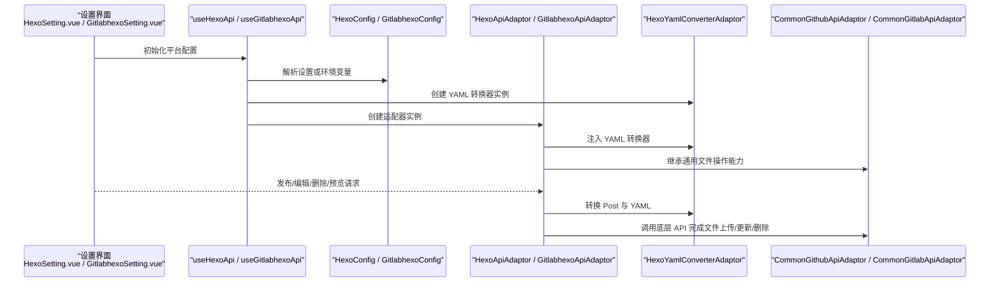
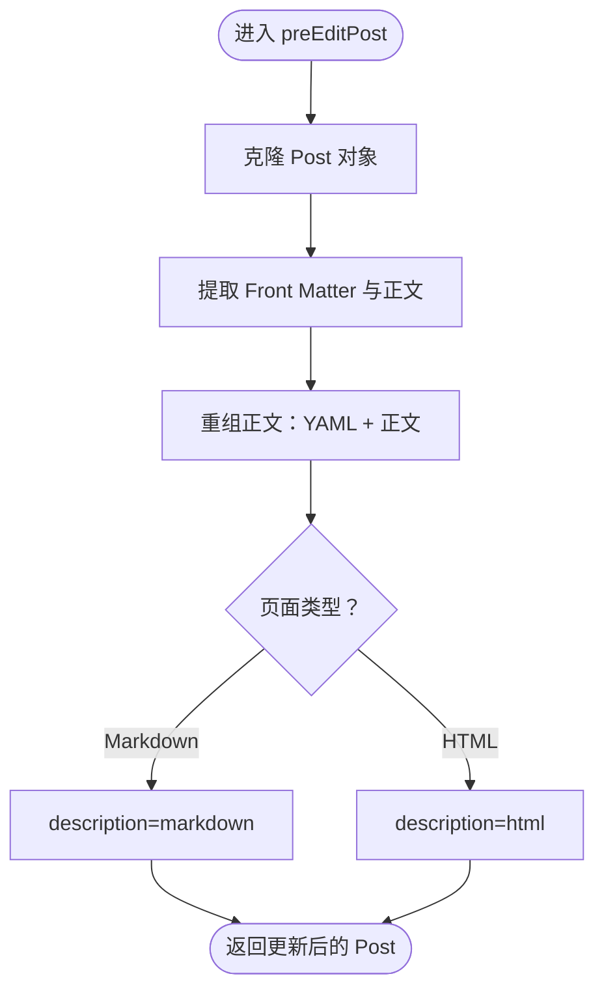
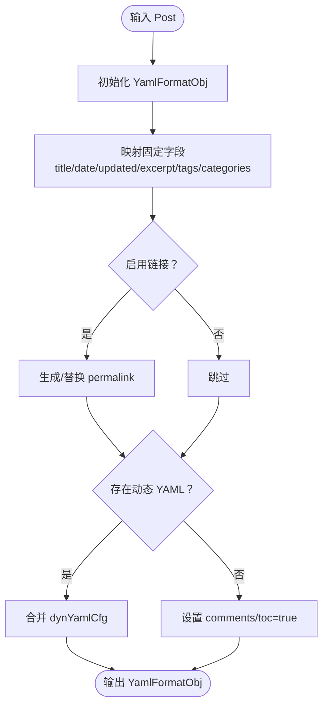
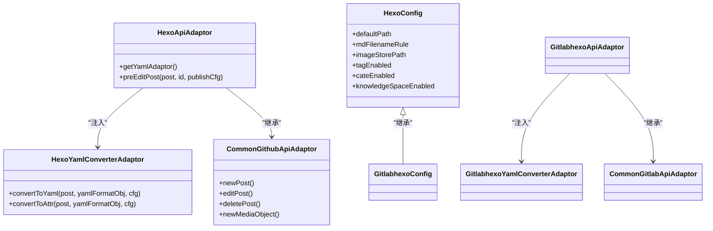

# Hexo静态站点适配器

<cite>
**本文引用的文件**
- [hexoApiAdaptor.ts](file://src/adaptors/api/hexo/hexoApiAdaptor.ts)
- [hexoConfig.ts](file://src/adaptors/api/hexo/hexoConfig.ts)
- [hexoYamlConverterAdaptor.ts](file://src/adaptors/api/hexo/hexoYamlConverterAdaptor.ts)
- [useHexoApi.ts](file://src/adaptors/api/hexo/useHexoApi.ts)
- [commonGithubApiAdaptor.ts](file://src/adaptors/api/base/github/commonGithubApiAdaptor.ts)
- [gitlabhexoApiAdaptor.ts](file://src/adaptors/api/gitlab-hexo/gitlabhexoApiAdaptor.ts)
- [gitlabhexoConfig.ts](file://src/adaptors/api/gitlab-hexo/gitlabhexoConfig.ts)
- [gitlabhexoYamlConverterAdaptor.ts](file://src/adaptors/api/gitlab-hexo/gitlabhexoYamlConverterAdaptor.ts)
- [useGitlabhexoApi.ts](file://src/adaptors/api/gitlab-hexo/useGitlabhexoApi.ts)
- [commonGitlabApiAdaptor.ts](file://src/adaptors/api/base/gitlab/commonGitlabApiAdaptor.ts)
- [HexoSetting.vue](file://src/components/set/publish/singleplatform/github/HexoSetting.vue)
- [GitlabhexoSetting.vue](file://src/components/set/publish/singleplatform/gitlab/GitlabhexoSetting.vue)
</cite>

## 目录
1. [简介](#简介)
2. [项目结构](#项目结构)
3. [核心组件](#核心组件)
4. [架构总览](#架构总览)
5. [组件详解](#组件详解)
6. [依赖关系分析](#依赖关系分析)
7. [性能考量](#性能考量)
8. [故障排除指南](#故障排除指南)
9. [结论](#结论)
10. [附录](#附录)

## 简介
本文件系统性阐述 Hexo 静态站点适配器的设计与实现，覆盖 GitHub Pages 与 GitLab Pages 的集成方案。重点解析以下模块：
- hexoApiAdaptor.ts：Hexo 发布适配器，负责正文预处理与发布格式选择
- hexoConfig.ts：Hexo 配置管理，定义默认路径、文件命名规则、标签分类能力等
- hexoYamlConverterAdaptor.ts：YAML 转换器，将文章元数据映射为 Hexo Front Matter，并支持动态 YAML 字段
- GitHub Pages 与 GitLab Pages 的适配器与配置差异
- 文件上传流程、构建触发机制与部署策略
- 配置示例、使用指南、与传统博客平台的差异与优势
- 故障排除与性能优化建议

## 项目结构
Hexo 适配器位于 adaptors/api/hexo 与 adaptors/api/gitlab-hexo 两个子目录，分别对应 GitHub Pages 与 GitLab Pages 的实现；同时共享基础适配器（CommonGithubApiAdaptor、CommonGitlabApiAdaptor）以复用通用的文件读写、媒体上传、预览链接生成等功能。

图表来源
- [hexoApiAdaptor.ts:23-60](file://src/adaptors/api/hexo/hexoApiAdaptor.ts#L23-L60)
- [hexoConfig.ts:19-48](file://src/adaptors/api/hexo/hexoConfig.ts#L19-L48)
- [hexoYamlConverterAdaptor.ts:23-119](file://src/adaptors/api/hexo/hexoYamlConverterAdaptor.ts#L23-L119)
- [useHexoApi.ts:22-98](file://src/adaptors/api/hexo/useHexoApi.ts#L22-L98)
- [commonGithubApiAdaptor.ts:28-47](file://src/adaptors/api/base/github/commonGithubApiAdaptor.ts#L28-L47)
- [gitlabhexoApiAdaptor.ts:23-59](file://src/adaptors/api/gitlab-hexo/gitlabhexoApiAdaptor.ts#L23-L59)
- [gitlabhexoConfig.ts:20-49](file://src/adaptors/api/gitlab-hexo/gitlabhexoConfig.ts#L20-L49)
- [gitlabhexoYamlConverterAdaptor.ts:18-18](file://src/adaptors/api/gitlab-hexo/gitlabhexoYamlConverterAdaptor.ts#L18-L18)
- [useGitlabhexoApi.ts:22-93](file://src/adaptors/api/gitlab-hexo/useGitlabhexoApi.ts#L22-L93)
- [commonGitlabApiAdaptor.ts:30-54](file://src/adaptors/api/base/gitlab/commonGitlabApiAdaptor.ts#L30-L54)

章节来源
- [hexoApiAdaptor.ts:16-60](file://src/adaptors/api/hexo/hexoApiAdaptor.ts#L16-L60)
- [hexoConfig.ts:13-48](file://src/adaptors/api/hexo/hexoConfig.ts#L13-L48)
- [hexoYamlConverterAdaptor.ts:16-119](file://src/adaptors/api/hexo/hexoYamlConverterAdaptor.ts#L16-L119)
- [useHexoApi.ts:22-98](file://src/adaptors/api/hexo/useHexoApi.ts#L22-L98)
- [commonGithubApiAdaptor.ts:28-47](file://src/adaptors/api/base/github/commonGithubApiAdaptor.ts#L28-L47)
- [gitlabhexoApiAdaptor.ts:16-59](file://src/adaptors/api/gitlab-hexo/gitlabhexoApiAdaptor.ts#L16-L59)
- [gitlabhexoConfig.ts:14-49](file://src/adaptors/api/gitlab-hexo/gitlabhexoConfig.ts#L14-L49)
- [gitlabhexoYamlConverterAdaptor.ts:12-18](file://src/adaptors/api/gitlab-hexo/gitlabhexoYamlConverterAdaptor.ts#L12-L18)
- [useGitlabhexoApi.ts:22-93](file://src/adaptors/api/gitlab-hexo/useGitlabhexoApi.ts#L22-L93)
- [commonGitlabApiAdaptor.ts:30-54](file://src/adaptors/api/base/gitlab/commonGitlabApiAdaptor.ts#L30-L54)

## 核心组件
- HexoApiAdaptor：继承自 CommonGithubApiAdaptor，重写 YAML 适配器注入与发布前正文处理逻辑，确保 Markdown 正文保留 Front Matter 并按页面类型选择发布内容（Markdown 或 HTML）
- HexoConfig：继承自 CommonGithubConfig，设定 Hexo 默认发布目录、文件命名规则、图片存储路径、标签/分类能力、知识空间限制等
- HexoYamlConverterAdaptor：实现 YAML 与 Post 属性之间的双向转换，支持固定字段（title/date/updated/excerpt/tags/categories/permalink）与动态 YAML 配置
- useHexoApi：统一初始化 Hexo 配置、YAML 转换器与适配器实例，支持从设置或环境变量加载配置
- GitLab Pages 对应实现：GitlabhexoApiAdaptor、GitlabhexoConfig、GitlabhexoYamlConverterAdaptor 与 useGitlabhexoApi，沿用相同设计但针对 GitLab API 进行适配

章节来源
- [hexoApiAdaptor.ts:23-59](file://src/adaptors/api/hexo/hexoApiAdaptor.ts#L23-L59)
- [hexoConfig.ts:19-48](file://src/adaptors/api/hexo/hexoConfig.ts#L19-L48)
- [hexoYamlConverterAdaptor.ts:23-119](file://src/adaptors/api/hexo/hexoYamlConverterAdaptor.ts#L23-L119)
- [useHexoApi.ts:22-98](file://src/adaptors/api/hexo/useHexoApi.ts#L22-L98)
- [gitlabhexoApiAdaptor.ts:23-59](file://src/adaptors/api/gitlab-hexo/gitlabhexoApiAdaptor.ts#L23-L59)
- [gitlabhexoConfig.ts:20-49](file://src/adaptors/api/gitlab-hexo/gitlabhexoConfig.ts#L20-L49)
- [gitlabhexoYamlConverterAdaptor.ts:18-18](file://src/adaptors/api/gitlab-hexo/gitlabhexoYamlConverterAdaptor.ts#L18-L18)
- [useGitlabhexoApi.ts:22-93](file://src/adaptors/api/gitlab-hexo/useGitlabhexoApi.ts#L22-L93)

## 架构总览
下图展示了 Hexo 适配器在“配置—适配器—YAML 转换器—基础客户端”的调用链路，以及 GitHub Pages 与 GitLab Pages 的差异化点。

图表来源
- [HexoSetting.vue:24-26](file://src/components/set/publish/singleplatform/github/HexoSetting.vue#L24-L26)
- [GitlabhexoSetting.vue:26-34](file://src/components/set/publish/singleplatform/gitlab/GitlabhexoSetting.vue#L26-L34)
- [useHexoApi.ts:22-98](file://src/adaptors/api/hexo/useHexoApi.ts#L22-L98)
- [useGitlabhexoApi.ts:22-93](file://src/adaptors/api/gitlab-hexo/useGitlabhexoApi.ts#L22-L93)
- [hexoApiAdaptor.ts:23-26](file://src/adaptors/api/hexo/hexoApiAdaptor.ts#L23-L26)
- [gitlabhexoApiAdaptor.ts:23-26](file://src/adaptors/api/gitlab-hexo/gitlabhexoApiAdaptor.ts#L23-L26)
- [hexoYamlConverterAdaptor.ts:26-119](file://src/adaptors/api/hexo/hexoYamlConverterAdaptor.ts#L26-L119)
- [commonGithubApiAdaptor.ts:86-128](file://src/adaptors/api/base/github/commonGithubApiAdaptor.ts#L86-L128)
- [commonGitlabApiAdaptor.ts:94-136](file://src/adaptors/api/base/gitlab/commonGitlabApiAdaptor.ts#L94-L136)

## 组件详解

### HexoApiAdaptor：正文预处理与发布格式
- 重写 YAML 适配器注入，确保使用 HexoYamlConverterAdaptor
- 发布前对 Markdown 正文进行 Front Matter 提取与重组，保证发布内容包含完整的 YAML 头部
- 根据页面类型（Markdown/HTML）决定 description 字段内容

图表来源
- [hexoApiAdaptor.ts:28-59](file://src/adaptors/api/hexo/hexoApiAdaptor.ts#L28-L59)

章节来源
- [hexoApiAdaptor.ts:23-59](file://src/adaptors/api/hexo/hexoApiAdaptor.ts#L23-L59)

### HexoConfig：默认配置与能力开关
- 默认发布目录：source/_posts
- 文件命名规则：[filename].md（可选 [slug].md）
- 图片存储与链接路径：source/images
- 页面类型：Markdown
- 认证方式：Token
- 标签/分类：启用且支持多分类
- 知识空间：树形单选，不可更改发布目录
- 预览 URL 占位符：支持 [docpath]、[postid] 等

章节来源
- [hexoConfig.ts:19-48](file://src/adaptors/api/hexo/hexoConfig.ts#L19-L48)

### HexoYamlConverterAdaptor：YAML 转换机制
- 固定字段映射：title、date、updated、excerpt、tags、categories、permalink
- 动态 YAML：通过 dynYamlCfg 注入额外字段，默认开启 comments 与 toc
- 转换流程：convertToYaml 生成 YAML 与完整 Markdown，convertToAttr 将 YAML 反向填充到 Post

图表来源
- [hexoYamlConverterAdaptor.ts:26-119](file://src/adaptors/api/hexo/hexoYamlConverterAdaptor.ts#L26-L119)

章节来源
- [hexoYamlConverterAdaptor.ts:23-151](file://src/adaptors/api/hexo/hexoYamlConverterAdaptor.ts#L23-L151)

### useHexoApi：统一初始化与配置加载
- 支持从设置中心加载配置，若为空则回退至环境变量
- 初始化 posidKey、标签/分类/知识空间能力、图床支持
- 返回 cfg、yamlAdaptor、blogApi 三件套供上层调用

章节来源
- [useHexoApi.ts:22-98](file://src/adaptors/api/hexo/useHexoApi.ts#L22-L98)

### GitHub Pages 集成要点
- 适配器：CommonGithubApiAdaptor
- 文件上传：publishGithubPage
- 编辑移动：当知识空间变化时先删后传，更新 postid
- 媒体上传：Base64 写入 images 目录，生成 raw 链接
- 预览：基于配置中的 previewUrl/previewPostUrl 占位符拼接

章节来源
- [commonGithubApiAdaptor.ts:86-128](file://src/adaptors/api/base/github/commonGithubApiAdaptor.ts#L86-L128)
- [commonGithubApiAdaptor.ts:165-210](file://src/adaptors/api/base/github/commonGithubApiAdaptor.ts#L165-L210)
- [commonGithubApiAdaptor.ts:251-309](file://src/adaptors/api/base/github/commonGithubApiAdaptor.ts#L251-L309)
- [commonGithubApiAdaptor.ts:225-249](file://src/adaptors/api/base/github/commonGithubApiAdaptor.ts#L225-L249)

### GitLab Pages 集成要点
- 适配器：CommonGitlabApiAdaptor
- 文件上传：createRepositoryFile
- 编辑更新：updateRepositoryFile
- 媒体上传：Base64 写入 images 目录，生成 raw 链接
- 预览：基于配置中的 previewUrl/previewPostUrl 占位符拼接
- GitLab 特有：token 设置页 URL、API 地址与 home 同步

章节来源
- [commonGitlabApiAdaptor.ts:94-136](file://src/adaptors/api/base/gitlab/commonGitlabApiAdaptor.ts#L94-L136)
- [commonGitlabApiAdaptor.ts:174-183](file://src/adaptors/api/base/gitlab/commonGitlabApiAdaptor.ts#L174-L183)
- [commonGitlabApiAdaptor.ts:227-284](file://src/adaptors/api/base/gitlab/commonGitlabApiAdaptor.ts#L227-L284)
- [commonGitlabApiAdaptor.ts:201-225](file://src/adaptors/api/base/gitlab/commonGitlabApiAdaptor.ts#L201-L225)
- [gitlabhexoConfig.ts:30-37](file://src/adaptors/api/gitlab-hexo/gitlabhexoConfig.ts#L30-L37)
- [GitlabhexoSetting.vue:37-44](file://src/components/set/publish/singleplatform/gitlab/GitlabhexoSetting.vue#L37-L44)

### GitLab Hexo 专用适配器与配置
- GitlabhexoApiAdaptor：与 HexoApiAdaptor 类似，但注入 GitlabhexoYamlConverterAdaptor
- GitlabhexoConfig：继承 HexoConfig，覆盖 home/apiUrl/tokenSettingUrl 等 GitLab 特定字段
- GitlabhexoYamlConverterAdaptor：继承 HexoYamlConverterAdaptor，保持一致的 YAML 转换行为

章节来源
- [gitlabhexoApiAdaptor.ts:23-59](file://src/adaptors/api/gitlab-hexo/gitlabhexoApiAdaptor.ts#L23-L59)
- [gitlabhexoConfig.ts:20-49](file://src/adaptors/api/gitlab-hexo/gitlabhexoConfig.ts#L20-L49)
- [gitlabhexoYamlConverterAdaptor.ts:18-18](file://src/adaptors/api/gitlab-hexo/gitlabhexoYamlConverterAdaptor.ts#L18-L18)

## 依赖关系分析
- Hexo 适配器依赖基础适配器提供的文件操作与媒体上传能力
- YAML 转换器独立于平台，仅依赖 Post/YamlFormatObj 结构
- useHexoApi/useGitlabhexoApi 负责装配配置、适配器与转换器，形成稳定的对外接口

图表来源
- [hexoApiAdaptor.ts:23-26](file://src/adaptors/api/hexo/hexoApiAdaptor.ts#L23-L26)
- [hexoConfig.ts:19-48](file://src/adaptors/api/hexo/hexoConfig.ts#L19-L48)
- [hexoYamlConverterAdaptor.ts:23-119](file://src/adaptors/api/hexo/hexoYamlConverterAdaptor.ts#L23-L119)
- [commonGithubApiAdaptor.ts:28-47](file://src/adaptors/api/base/github/commonGithubApiAdaptor.ts#L28-L47)
- [gitlabhexoApiAdaptor.ts:23-26](file://src/adaptors/api/gitlab-hexo/gitlabhexoApiAdaptor.ts#L23-L26)
- [gitlabhexoConfig.ts:20-49](file://src/adaptors/api/gitlab-hexo/gitlabhexoConfig.ts#L20-L49)
- [gitlabhexoYamlConverterAdaptor.ts:18-18](file://src/adaptors/api/gitlab-hexo/gitlabhexoYamlConverterAdaptor.ts#L18-L18)
- [commonGitlabApiAdaptor.ts:30-54](file://src/adaptors/api/base/gitlab/commonGitlabApiAdaptor.ts#L30-L54)

## 性能考量
- YAML 转换开销：固定字段映射与动态 YAML 合并为 O(n) 操作，建议在批量发布时复用同一 YamlFormatObj 实例
- 文件上传：Base64 上传图片会增加体积，建议优先使用图床服务或二进制上传（若平台支持）
- 预览链接拼接：避免重复计算，可在适配器层缓存拼接结果
- 错误重试：基础适配器在首次发布失败时会尝试删除旧文件后重发，减少人工干预成本

## 故障排除指南
- 认证失败
  - 现象：checkAuth 返回 false
  - 排查：确认 Token 权限、仓库/分支配置、中间件地址
  - 参考
    - [commonGithubApiAdaptor.ts:49-64](file://src/adaptors/api/base/github/commonGithubApiAdaptor.ts#L49-L64)
    - [commonGitlabApiAdaptor.ts:57-72](file://src/adaptors/api/base/gitlab/commonGitlabApiAdaptor.ts#L57-L72)
- 发布失败
  - 现象：newPost/editPost 返回异常
  - 排查：检查文件路径、权限、网络状态；基础适配器会在失败时尝试删除旧文件后重发
  - 参考
    - [commonGithubApiAdaptor.ts:102-128](file://src/adaptors/api/base/github/commonGithubApiAdaptor.ts#L102-L128)
    - [commonGitlabApiAdaptor.ts:110-136](file://src/adaptors/api/base/gitlab/commonGitlabApiAdaptor.ts#L110-L136)
- 媒体上传冲突
  - 现象：GitLab 422 已存在错误
  - 处理：捕获特定状态码并忽略或提示
  - 参考
    - [commonGithubApiAdaptor.ts:264-269](file://src/adaptors/api/base/github/commonGithubApiAdaptor.ts#L264-L269)
    - [commonGitlabApiAdaptor.ts:249-257](file://src/adaptors/api/base/gitlab/commonGitlabApiAdaptor.ts#L249-L257)
- 预览链接异常
  - 现象：预览 URL 不正确
  - 排查：核对配置中的占位符替换逻辑与 home/apiUrl 设置
  - 参考
    - [commonGithubApiAdaptor.ts:225-249](file://src/adaptors/api/base/github/commonGithubApiAdaptor.ts#L225-L249)
    - [commonGitlabApiAdaptor.ts:201-225](file://src/adaptors/api/base/gitlab/commonGitlabApiAdaptor.ts#L201-L225)
    - [gitlabhexoConfig.ts:30-37](file://src/adaptors/api/gitlab-hexo/gitlabhexoConfig.ts#L30-L37)

## 结论
Hexo 适配器通过“配置—适配器—YAML 转换器—基础客户端”的清晰分层，实现了对 GitHub Pages 与 GitLab Pages 的统一接入。其优势在于：
- YAML 转换器与平台解耦，便于扩展其他静态站点引擎
- 基础适配器复用文件操作与媒体上传逻辑，降低重复开发成本
- 预设的默认规则与能力开关，使 Hexo 发布更贴近用户预期

## 附录

### 配置示例与使用指南
- GitHub Pages
  - 设置入口：HexoSetting.vue
  - 关键配置项：用户名、Token、仓库、分支、默认发布目录、文件命名规则、图片路径
  - 参考
    - [HexoSetting.vue:24-32](file://src/components/set/publish/singleplatform/github/HexoSetting.vue#L24-L32)
    - [useHexoApi.ts:32-60](file://src/adaptors/api/hexo/useHexoApi.ts#L32-L60)
    - [hexoConfig.ts:19-48](file://src/adaptors/api/hexo/hexoConfig.ts#L19-L48)
- GitLab Pages
  - 设置入口：GitlabhexoSetting.vue
  - 关键配置项：home、apiUrl、tokenSettingUrl、仓库、分支、文件命名规则
  - 参考
    - [GitlabhexoSetting.vue:26-44](file://src/components/set/publish/singleplatform/gitlab/GitlabhexoSetting.vue#L26-L44)
    - [useGitlabhexoApi.ts:32-61](file://src/adaptors/api/gitlab-hexo/useGitlabhexoApi.ts#L32-L61)
    - [gitlabhexoConfig.ts:20-49](file://src/adaptors/api/gitlab-hexo/gitlabhexoConfig.ts#L20-L49)

### 与传统博客平台的差异与优势
- 差异
  - 传统博客平台通常提供富文本编辑器与主题市场；Hexo 作为静态站点，强调 Markdown 与主题/插件生态
  - 发布流程：Hexo 通过 Git Pages 托管，构建由平台或 CI 触发；传统平台由服务端渲染
- 优势
  - 更强的版本控制与可移植性
  - 更低的托管成本与更好的安全性
  - 更灵活的主题与插件扩展（通过 YAML Front Matter 与主题配置）