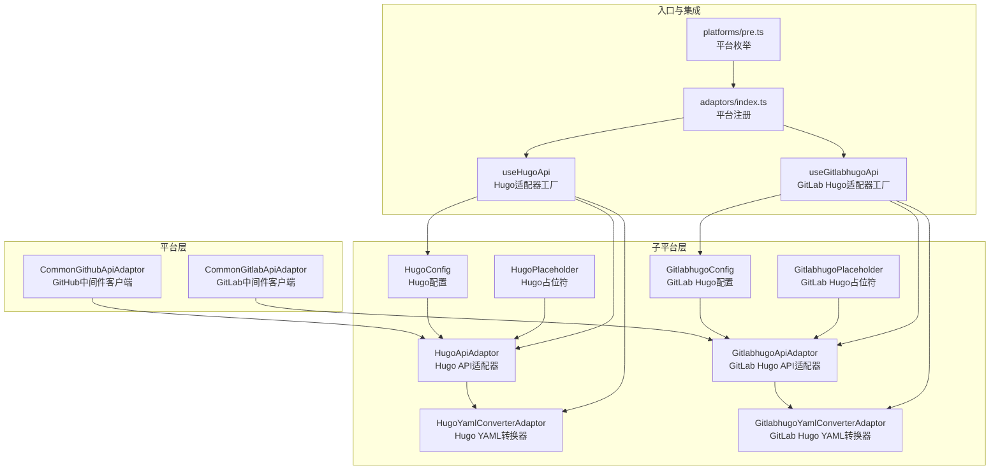
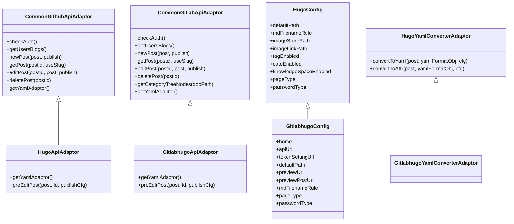
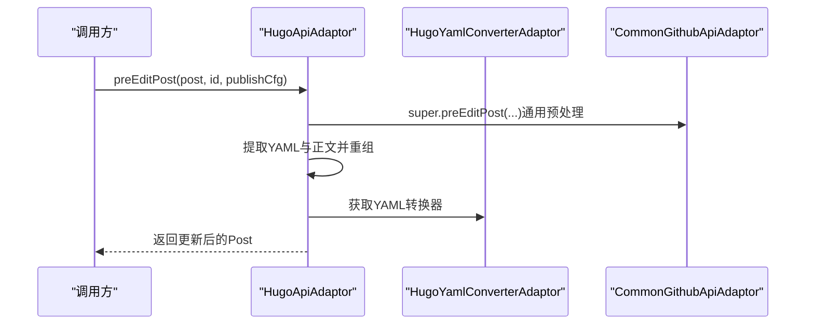
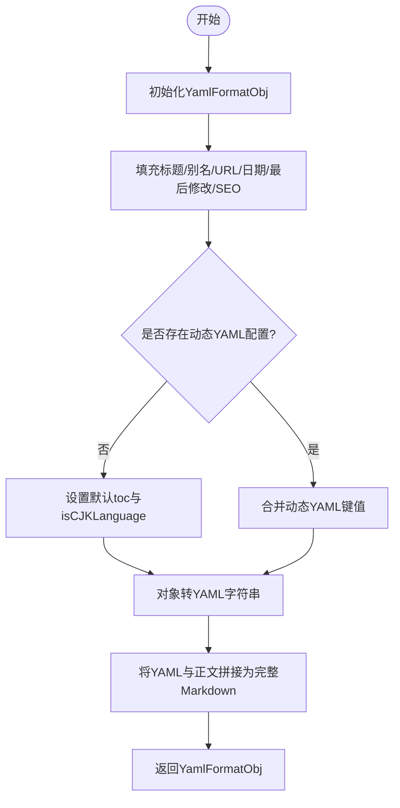
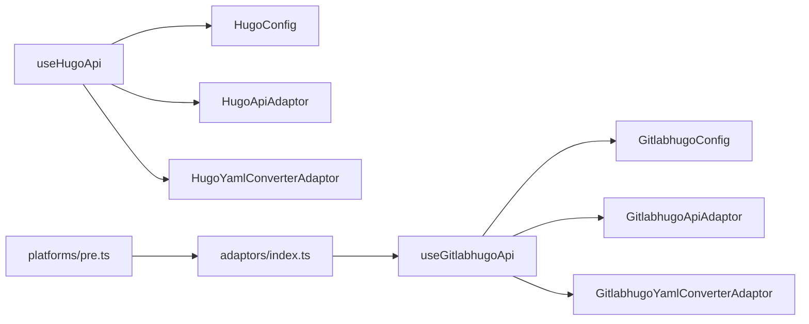
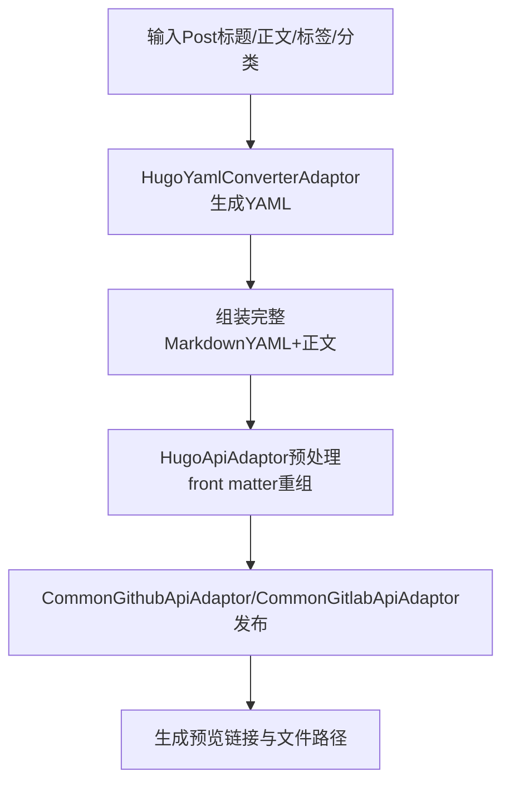

# Hugo静态站点适配器

<cite>
**本文档引用的文件**
- [hugoApiAdaptor.ts](file://src/adaptors/api/hugo/hugoApiAdaptor.ts)
- [hugoConfig.ts](file://src/adaptors/api/hugo/hugoConfig.ts)
- [hugoYamlConverterAdaptor.ts](file://src/adaptors/api/hugo/hugoYamlConverterAdaptor.ts)
- [useHugoApi.ts](file://src/adaptors/api/hugo/useHugoApi.ts)
- [commonGithubApiAdaptor.ts](file://src/adaptors/api/base/github/commonGithubApiAdaptor.ts)
- [gitlabhugoApiAdaptor.ts](file://src/adaptors/api/gitlab-hugo/gitlabhugoApiAdaptor.ts)
- [gitlabhugoConfig.ts](file://src/adaptors/api/gitlab-hugo/gitlabhugoConfig.ts)
- [gitlabhugoYamlConverterAdaptor.ts](file://src/adaptors/api/gitlab-hugo/gitlabhugoYamlConverterAdaptor.ts)
- [commonGitlabApiAdaptor.ts](file://src/adaptors/api/base/gitlab/commonGitlabApiAdaptor.ts)
- [hugoPlaceholder.ts](file://src/adaptors/api/hugo/hugoPlaceholder.ts)
- [gitlabhugoPlaceholder.ts](file://src/adaptors/api/gitlab-hugo/gitlabhugoPlaceholder.ts)
- [adaptors/index.ts](file://src/adaptors/index.ts)
- [pre.ts](file://src/platforms/pre.ts)
- [README.md](file://README.md)
</cite>

## 目录
1. [简介](#简介)
2. [项目结构](#项目结构)
3. [核心组件](#核心组件)
4. [架构总览](#架构总览)
5. [详细组件分析](#详细组件分析)
6. [依赖关系分析](#依赖关系分析)
7. [性能考虑](#性能考虑)
8. [故障排除指南](#故障排除指南)
9. [结论](#结论)
10. [附录](#附录)

## 简介
本文件系统性阐述Hugo静态站点适配器的实现与使用方法，覆盖适配器架构、配置处理、YAML转换逻辑、构建与发布流程、以及部署到GitHub Pages与GitLab Pages的差异。同时提供配置参数详解、构建优化技巧、部署最佳实践、常见问题解决方案与性能调优建议。

## 项目结构
Hugo适配器位于适配器子模块中，采用“平台-子平台”分层设计：
- 平台层：GitHub（CommonGithub）与GitLab（CommonGitlab）
- 子平台层：Hugo（github-hugo、gitlab-hugo）
- 适配器层：API适配器、配置类、YAML转换器、占位符等

图表来源
- [commonGithubApiAdaptor.ts:28-47](file://src/adaptors/api/base/github/commonGithubApiAdaptor.ts#L28-L47)
- [commonGitlabApiAdaptor.ts:30-55](file://src/adaptors/api/base/gitlab/commonGitlabApiAdaptor.ts#L30-L55)
- [hugoApiAdaptor.ts:23-26](file://src/adaptors/api/hugo/hugoApiAdaptor.ts#L23-L26)
- [hugoConfig.ts:19-48](file://src/adaptors/api/hugo/hugoConfig.ts#L19-L48)
- [hugoYamlConverterAdaptor.ts:22-123](file://src/adaptors/api/hugo/hugoYamlConverterAdaptor.ts#L22-L123)
- [hugoPlaceholder.ts:12-12](file://src/adaptors/api/hugo/hugoPlaceholder.ts#L12-L12)
- [gitlabhugoApiAdaptor.ts:23-26](file://src/adaptors/api/gitlab-hugo/gitlabhugoApiAdaptor.ts#L23-L26)
- [gitlabhugoConfig.ts:20-49](file://src/adaptors/api/gitlab-hugo/gitlabhugoConfig.ts#L20-L49)
- [gitlabhugoYamlConverterAdaptor.ts:18-18](file://src/adaptors/api/gitlab-hugo/gitlabhugoYamlConverterAdaptor.ts#L18-L18)
- [gitlabhugoPlaceholder.ts:12-12](file://src/adaptors/api/gitlab-hugo/gitlabhugoPlaceholder.ts#L12-L12)
- [useHugoApi.ts:22-95](file://src/adaptors/api/hugo/useHugoApi.ts#L22-L95)
- [adaptors/index.ts:140-143](file://src/adaptors/index.ts#L140-L143)
- [pre.ts:233-240](file://src/platforms/pre.ts#L233-L240)

章节来源
- [hugoApiAdaptor.ts:16-60](file://src/adaptors/api/hugo/hugoApiAdaptor.ts#L16-L60)
- [hugoConfig.ts:13-48](file://src/adaptors/api/hugo/hugoConfig.ts#L13-L48)
- [hugoYamlConverterAdaptor.ts:15-155](file://src/adaptors/api/hugo/hugoYamlConverterAdaptor.ts#L15-L155)
- [useHugoApi.ts:22-95](file://src/adaptors/api/hugo/useHugoApi.ts#L22-L95)
- [commonGithubApiAdaptor.ts:28-128](file://src/adaptors/api/base/github/commonGithubApiAdaptor.ts#L28-L128)
- [commonGitlabApiAdaptor.ts:30-136](file://src/adaptors/api/base/gitlab/commonGitlabApiAdaptor.ts#L30-L136)

## 核心组件
- HugoApiAdaptor：继承GitHub通用适配器，负责Hugo文章发布前的数据预处理（提取并重组front matter与正文），并选择Hugo专用YAML转换器。
- HugoConfig：继承GitHub通用配置，设定Hugo特有路径、文件命名规则、标签/分类/知识空间策略、页面类型等。
- HugoYamlConverterAdaptor：实现YAML与Post对象之间的双向转换，支持动态YAML配置注入、日期时区处理、SEO字段映射等。
- useHugoApi：适配器工厂，负责读取配置（优先设置项，其次环境变量）、初始化YAML转换器与API适配器、返回统一接口。
- 占位符与平台注册：HugoPlaceholder/GitlabhugoPlaceholder用于界面提示；adaptors/index.ts与platforms/pre.ts注册平台类型与入口。

章节来源
- [hugoApiAdaptor.ts:23-59](file://src/adaptors/api/hugo/hugoApiAdaptor.ts#L23-L59)
- [hugoConfig.ts:19-48](file://src/adaptors/api/hugo/hugoConfig.ts#L19-L48)
- [hugoYamlConverterAdaptor.ts:22-155](file://src/adaptors/api/hugo/hugoYamlConverterAdaptor.ts#L22-L155)
- [useHugoApi.ts:22-95](file://src/adaptors/api/hugo/useHugoApi.ts#L22-L95)
- [hugoPlaceholder.ts:12-12](file://src/adaptors/api/hugo/hugoPlaceholder.ts#L12-L12)
- [adaptors/index.ts:140-143](file://src/adaptors/index.ts#L140-L143)
- [pre.ts:233-240](file://src/platforms/pre.ts#L233-L240)

## 架构总览
Hugo适配器遵循“平台-子平台-适配器-转换器”的分层架构。GitHub与GitLab分别提供各自的中间件客户端，Hugo子平台通过适配器复用其能力，并以YAML转换器实现内容格式化。

图表来源
- [commonGithubApiAdaptor.ts:28-200](file://src/adaptors/api/base/github/commonGithubApiAdaptor.ts#L28-L200)
- [commonGitlabApiAdaptor.ts:30-200](file://src/adaptors/api/base/gitlab/commonGitlabApiAdaptor.ts#L30-L200)
- [hugoApiAdaptor.ts:23-59](file://src/adaptors/api/hugo/hugoApiAdaptor.ts#L23-L59)
- [gitlabhugoApiAdaptor.ts:23-59](file://src/adaptors/api/gitlab-hugo/gitlabhugoApiAdaptor.ts#L23-L59)
- [hugoConfig.ts:19-48](file://src/adaptors/api/hugo/hugoConfig.ts#L19-L48)
- [gitlabhugoConfig.ts:20-49](file://src/adaptors/api/gitlab-hugo/gitlabhugoConfig.ts#L20-L49)
- [hugoYamlConverterAdaptor.ts:22-155](file://src/adaptors/api/hugo/hugoYamlConverterAdaptor.ts#L22-L155)
- [gitlabhugoYamlConverterAdaptor.ts:18-18](file://src/adaptors/api/gitlab-hugo/gitlabhugoYamlConverterAdaptor.ts#L18-L18)

## 详细组件分析

### Hugo API适配器（hugoApiAdaptor.ts）
- 作用：在发布前对Post进行预处理，确保front matter与正文正确组合；根据页面类型选择Markdown或HTML作为描述字段。
- 关键点：
  - 覆盖getYamlAdaptor，返回Hugo专用YAML转换器。
  - preEditPost中使用YamlUtil提取并重组YAML与正文，保证Hugo识别的front matter格式。
  - 根据配置决定发布内容为markdown或html。

图表来源
- [hugoApiAdaptor.ts:28-59](file://src/adaptors/api/hugo/hugoApiAdaptor.ts#L28-L59)
- [commonGithubApiAdaptor.ts:165-200](file://src/adaptors/api/base/github/commonGithubApiAdaptor.ts#L165-L200)
- [hugoYamlConverterAdaptor.ts:22-123](file://src/adaptors/api/hugo/hugoYamlConverterAdaptor.ts#L22-L123)

章节来源
- [hugoApiAdaptor.ts:23-59](file://src/adaptors/api/hugo/hugoApiAdaptor.ts#L23-L59)

### Hugo配置（hugoConfig.ts）
- 作用：定义Hugo平台的默认行为与约束，包括默认路径、文件命名规则、图片存储与链接路径、标签/分类/知识空间策略、页面类型与鉴权方式等。
- 关键点：
  - 继承自GitHub通用配置，保持一致的中间件交互。
  - 固定Markdown页面类型与Token鉴权。
  - 知识空间为树形单层级且不可变更，提供只读提示。

章节来源
- [hugoConfig.ts:19-48](file://src/adaptors/api/hugo/hugoConfig.ts#L19-L48)

### Hugo YAML转换器（hugoYamlConverterAdaptor.ts）
- 作用：将Post对象转换为Hugo可用的YAML格式，并支持动态YAML配置注入；反向时将YAML还原为Post属性。
- 关键点：
  - 自动生成日期与lastmod（含本地时区偏移）。
  - 支持动态YAML配置（dynYamlCfg），默认开启toc与isCJKLanguage。
  - 将生成的YAML与正文拼接为完整Markdown。
  - 反向转换时恢复标题、时间、摘要、标签、分类等字段。

图表来源
- [hugoYamlConverterAdaptor.ts:25-123](file://src/adaptors/api/hugo/hugoYamlConverterAdaptor.ts#L25-L123)

章节来源
- [hugoYamlConverterAdaptor.ts:22-155](file://src/adaptors/api/hugo/hugoYamlConverterAdaptor.ts#L22-L155)

### Hugo适配器工厂（useHugoApi.ts）
- 作用：统一创建Hugo配置、YAML转换器与API适配器，支持从设置或环境变量加载配置，并设置平台特性开关。
- 关键点：
  - 优先从设置中读取配置；若为空则使用环境变量（GitHub用户名、仓库、分支、中间件地址）。
  - 设置标签/分类/知识空间策略，启用内置图床服务。
  - 返回cfg、yamlAdaptor、blogApi三元组供上层使用。

章节来源
- [useHugoApi.ts:22-95](file://src/adaptors/api/hugo/useHugoApi.ts#L22-L95)

### GitLab Hugo适配器对比
- GitLab Hugo适配器与GitHub Hugo适配器结构一致，但继承自GitLab通用适配器，配置类扩展自HugoConfig，YAML转换器直接复用Hugo转换器。
- 主要差异：
  - GitLab配置类重写token设置页、API地址与主页等字段，以适配GitLab平台。
  - API适配器在发布前同样进行YAML与正文的重组处理。

章节来源
- [gitlabhugoApiAdaptor.ts:23-59](file://src/adaptors/api/gitlab-hugo/gitlabhugoApiAdaptor.ts#L23-L59)
- [gitlabhugoConfig.ts:20-49](file://src/adaptors/api/gitlab-hugo/gitlabhugoConfig.ts#L20-L49)
- [gitlabhugoYamlConverterAdaptor.ts:18-18](file://src/adaptors/api/gitlab-hugo/gitlabhugoYamlConverterAdaptor.ts#L18-L18)
- [commonGitlabApiAdaptor.ts:30-136](file://src/adaptors/api/base/gitlab/commonGitlabApiAdaptor.ts#L30-L136)

## 依赖关系分析
- 组件耦合：
  - HugoApiAdaptor依赖CommonGithubApiAdaptor与HugoYamlConverterAdaptor。
  - GitLab Hugo适配器依赖CommonGitlabApiAdaptor与HugoYamlConverterAdaptor。
  - useHugoApi/useGitlabhugoApi负责装配与返回统一接口。
- 平台注册：
  - platforms/pre.ts声明Gitlab_Hugo平台类型。
  - adaptors/index.ts在平台类型为Gitlab_Hugo时调用useGitlabhugoApi。

图表来源
- [useHugoApi.ts:84-95](file://src/adaptors/api/hugo/useHugoApi.ts#L84-L95)
- [useGitlabhugoApi.ts:17-20](file://src/adaptors/api/gitlab-hugo/useGitlabhugoApi.ts#L17-L20)
- [pre.ts:233-240](file://src/platforms/pre.ts#L233-L240)
- [adaptors/index.ts:140-143](file://src/adaptors/index.ts#L140-L143)

章节来源
- [useHugoApi.ts:84-95](file://src/adaptors/api/hugo/useHugoApi.ts#L84-L95)
- [useGitlabhugoApi.ts:17-20](file://src/adaptors/api/gitlab-hugo/useGitlabhugoApi.ts#L17-L20)
- [pre.ts:233-240](file://src/platforms/pre.ts#L233-L240)
- [adaptors/index.ts:140-143](file://src/adaptors/index.ts#L140-L143)

## 性能考虑
- YAML生成与拼接：HugoYamlConverterAdaptor在每次转换时都会将YAML与正文拼接，建议在批量发布场景中缓存已生成的YamlFormatObj，避免重复计算。
- 时区处理：日期与lastmod生成包含时区偏移，建议统一时区策略，减少跨时区带来的显示差异。
- 图片上传：HugoConfig默认图片存储路径为static/images，建议结合CDN或静态托管优化图片加载速度。
- 中间件与网络：useHugoApi支持中间件URL配置，合理设置可提升网络稳定性与访问速度。

## 故障排除指南
- 认证失败：
  - 检查GitHub/GitLab Token是否有效与权限是否足够。
  - 使用适配器提供的checkAuth方法进行快速验证。
- 发布路径错误：
  - 确认HugoConfig中的defaultPath与mdFilenameRule符合预期。
  - 若知识空间不可变，需删除后重新发布以更换目录。
- YAML格式异常：
  - 确保front matter与正文正确分离；HugoApiAdaptor会在preEditPost中自动重组。
  - 如使用动态YAML配置，检查dynYamlCfg格式与键名。
- GitLab平台差异：
  - GitLab配置类重写了token设置页与API地址，确认配置项与实际平台一致。

章节来源
- [commonGithubApiAdaptor.ts:49-64](file://src/adaptors/api/base/github/commonGithubApiAdaptor.ts#L49-L64)
- [commonGitlabApiAdaptor.ts:57-72](file://src/adaptors/api/base/gitlab/commonGitlabApiAdaptor.ts#L57-L72)
- [hugoConfig.ts:31-47](file://src/adaptors/api/hugo/hugoConfig.ts#L31-L47)
- [hugoApiAdaptor.ts:28-59](file://src/adaptors/api/hugo/hugoApiAdaptor.ts#L28-L59)
- [gitlabhugoConfig.ts:30-38](file://src/adaptors/api/gitlab-hugo/gitlabhugoConfig.ts#L30-L38)

## 结论
Hugo适配器通过清晰的分层设计与标准化的中间件交互，实现了对GitHub与GitLab平台的统一支持。其核心在于：
- API适配器负责内容预处理与平台差异抹平；
- 配置类提供平台特有约束与默认行为；
- YAML转换器保障front matter与正文的正确格式；
- 工厂模式简化了配置与实例化流程。

在部署层面，GitHub与GitLab的差异主要体现在配置项与中间件交互细节，但整体发布流程保持一致。建议在生产环境中结合动态YAML配置、CDN加速与中间件优化，以获得更佳的发布体验与性能表现。

## 附录

### 配置参数详解（Hugo）
- defaultPath：默认发布目录（content/post）
- mdFilenameRule：Markdown文件命名规则（[slug].md）
- imageStorePath：图片存储路径（static/images）
- imageLinkPath：图片链接路径（images）
- tagEnabled/cateEnabled：标签/分类开关
- knowledgeSpaceEnabled：知识空间开关（树形单层级）
- pageType：页面类型（Markdown）
- passwordType：鉴权类型（Token）

章节来源
- [hugoConfig.ts:31-47](file://src/adaptors/api/hugo/hugoConfig.ts#L31-L47)

### 构建与发布流程（概念性）

[此图为概念性流程，无需图表来源]

### 部署到GitHub Pages与GitLab Pages的差异
- 平台差异：
  - GitHub Pages：通过CommonGithubApiAdaptor与GitHub中间件交互，配置项指向GitHub。
  - GitLab Pages：通过CommonGitlabApiAdaptor与GitLab中间件交互，配置项指向GitLab。
- YAML转换器一致性：两者均使用HugoYamlConverterAdaptor，确保front matter格式一致。
- 占位符与界面提示：HugoPlaceholder与GitlabhugoPlaceholder分别提供平台特定提示文案。

章节来源
- [commonGithubApiAdaptor.ts:28-128](file://src/adaptors/api/base/github/commonGithubApiAdaptor.ts#L28-L128)
- [commonGitlabApiAdaptor.ts:30-136](file://src/adaptors/api/base/gitlab/commonGitlabApiAdaptor.ts#L30-L136)
- [hugoYamlConverterAdaptor.ts:22-155](file://src/adaptors/api/hugo/hugoYamlConverterAdaptor.ts#L22-L155)
- [hugoPlaceholder.ts:12-12](file://src/adaptors/api/hugo/hugoPlaceholder.ts#L12-L12)
- [gitlabhugoPlaceholder.ts:12-12](file://src/adaptors/api/gitlab-hugo/gitlabhugoPlaceholder.ts#L12-L12)