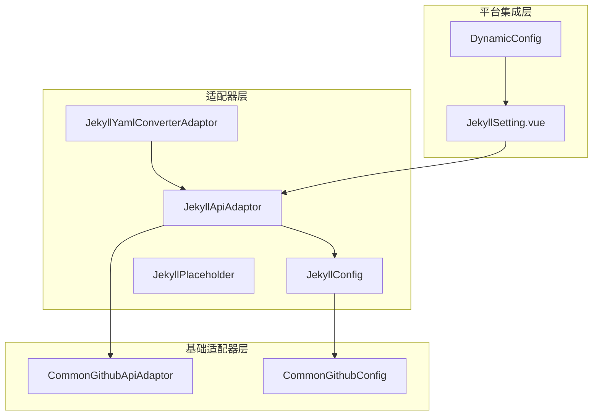
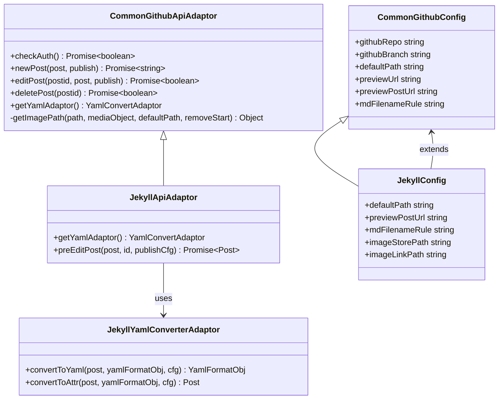
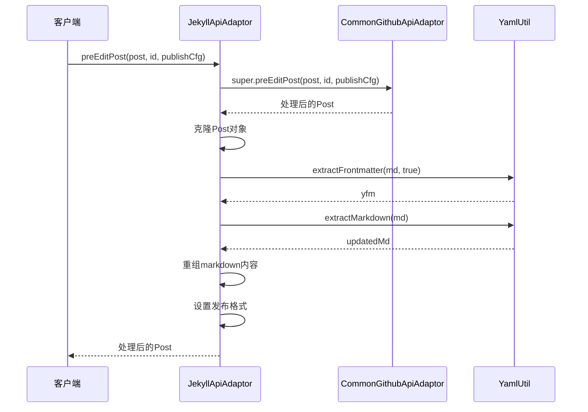
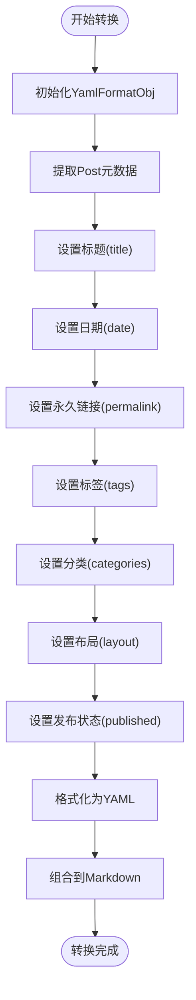
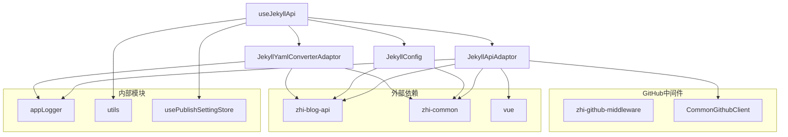

# Jekyll静态站点适配器

<cite>
**本文档引用的文件**
- [jekyllApiAdaptor.ts](file://src/adaptors/api/jekyll/jekyllApiAdaptor.ts)
- [jekyllConfig.ts](file://src/adaptors/api/jekyll/jekyllConfig.ts)
- [jekyllYamlConverterAdaptor.ts](file://src/adaptors/api/jekyll/jekyllYamlConverterAdaptor.ts)
- [useJekyllApi.ts](file://src/adaptors/api/jekyll/useJekyllApi.ts)
- [jekyllPlaceholder.ts](file://src/adaptors/api/jekyll/jekyllPlaceholder.ts)
- [commonGithubApiAdaptor.ts](file://src/adaptors/api/base/github/commonGithubApiAdaptor.ts)
- [commonGithubConfig.ts](file://src/adaptors/api/base/github/commonGithubConfig.ts)
- [dynamicConfig.ts](file://src/platforms/dynamicConfig.ts)
- [JekyllSetting.vue](file://src/components/set/publish/singleplatform/github/JekyllSetting.vue)
</cite>

## 目录
1. [简介](#简介)
2. [项目结构](#项目结构)
3. [核心组件](#核心组件)
4. [架构概览](#架构概览)
5. [详细组件分析](#详细组件分析)
6. [依赖关系分析](#依赖关系分析)
7. [性能考虑](#性能考虑)
8. [故障排除指南](#故障排除指南)
9. [结论](#结论)
10. [附录](#附录)

## 简介

Jekyll静态站点适配器是siyuan-plugin-publisher插件中的一个重要模块，专门用于将内容发布到基于Jekyll的静态网站平台。该适配器基于GitHub Pages服务，利用Jekyll的前端数据（Front Matter）系统来管理文章元数据。

Jekyll作为Ruby生态系统的静态站点生成器，默认与GitHub Pages深度集成，提供了强大的内容管理和部署能力。该适配器通过统一的API接口，实现了对Jekyll平台的完整支持，包括文章发布、编辑、删除、媒体文件上传等功能。

## 项目结构

Jekyll适配器位于插件的适配器架构中，采用分层设计模式：



**图表来源**
- [jekyllApiAdaptor.ts:1-63](file://src/adaptors/api/jekyll/jekyllApiAdaptor.ts#L1-L63)
- [jekyllConfig.ts:1-53](file://src/adaptors/api/jekyll/jekyllConfig.ts#L1-L53)
- [commonGithubApiAdaptor.ts:1-352](file://src/adaptors/api/base/github/commonGithubApiAdaptor.ts#L1-L352)

**章节来源**
- [jekyllApiAdaptor.ts:1-63](file://src/adaptors/api/jekyll/jekyllApiAdaptor.ts#L1-L63)
- [jekyllConfig.ts:1-53](file://src/adaptors/api/jekyll/jekyllConfig.ts#L1-L53)
- [jekyllYamlConverterAdaptor.ts:1-143](file://src/adaptors/api/jekyll/jekyllYamlConverterAdaptor.ts#L1-L143)

## 核心组件

Jekyll适配器由四个核心组件构成，每个组件都有特定的职责和功能：

### 1. JekyllApiAdaptor（API适配器）
负责处理Jekyll平台的API调用，继承自CommonGithubApiAdaptor，提供文章发布、编辑、删除等核心功能。

### 2. JekyllConfig（配置管理）
管理Jekyll平台的配置参数，包括GitHub仓库信息、文件命名规则、预览URL等。

### 3. JekyllYamlConverterAdaptor（YAML转换器）
专门处理Jekyll的Front Matter格式，负责将文章元数据转换为YAML格式。

### 4. useJekyllApi（初始化工具）
提供Jekyll适配器的初始化和配置加载功能。

**章节来源**
- [jekyllApiAdaptor.ts:16-60](file://src/adaptors/api/jekyll/jekyllApiAdaptor.ts#L16-L60)
- [jekyllConfig.ts:13-49](file://src/adaptors/api/jekyll/jekyllConfig.ts#L13-L49)
- [jekyllYamlConverterAdaptor.ts:16-140](file://src/adaptors/api/jekyll/jekyllYamlConverterAdaptor.ts#L16-L140)
- [useJekyllApi.ts:22-96](file://src/adaptors/api/jekyll/useJekyllApi.ts#L22-L96)

## 架构概览

Jekyll适配器采用分层架构设计，通过继承和组合模式实现功能扩展：



**图表来源**
- [commonGithubApiAdaptor.ts:28-352](file://src/adaptors/api/base/github/commonGithubApiAdaptor.ts#L28-L352)
- [jekyllApiAdaptor.ts:23-60](file://src/adaptors/api/jekyll/jekyllApiAdaptor.ts#L23-L60)
- [commonGithubConfig.ts:17-112](file://src/adaptors/api/base/github/commonGithubConfig.ts#L17-L112)
- [jekyllConfig.ts:19-50](file://src/adaptors/api/jekyll/jekyllConfig.ts#L19-L50)
- [jekyllYamlConverterAdaptor.ts:23-140](file://src/adaptors/api/jekyll/jekyllYamlConverterAdaptor.ts#L23-L140)

## 详细组件分析

### JekyllApiAdaptor组件分析

JekyllApiAdaptor是Jekyll适配器的核心类，继承自CommonGithubApiAdaptor，主要负责：

#### 核心功能
1. **YAML适配器提供**：重写getYamlAdaptor方法，返回Jekyll专用的YAML转换器
2. **文章预处理**：在发布前处理文章内容，提取和重组Front Matter

#### 预处理流程



**图表来源**
- [jekyllApiAdaptor.ts:28-59](file://src/adaptors/api/jekyll/jekyllApiAdaptor.ts#L28-L59)

**章节来源**
- [jekyllApiAdaptor.ts:16-60](file://src/adaptors/api/jekyll/jekyllApiAdaptor.ts#L16-L60)

### JekyllConfig组件分析

JekyllConfig类继承自CommonGithubConfig，专门管理Jekyll平台的配置：

#### 关键配置项
- **默认路径**：`_posts` - Jekyll文章的默认存储目录
- **文件命名规则**：`[yyyy]-[mm]-[dd]-[slug].md` - 标准的Jekyll日期前缀命名
- **预览URL**：`/post/[postid].html` - 文章预览链接格式
- **图片存储路径**：`assets/images` - 图片资源存储位置

#### 配置特性
- **标签支持**：启用多标签功能
- **分类支持**：支持多级分类
- **知识空间**：树形单选知识空间类型
- **认证方式**：使用GitHub Token认证

**章节来源**
- [jekyllConfig.ts:19-50](file://src/adaptors/api/jekyll/jekyllConfig.ts#L19-L50)

### JekyllYamlConverterAdaptor组件分析

JekyllYamlConverterAdaptor是专门处理Jekyll Front Matter的转换器：

#### YAML字段映射
| Jekyll字段 | Post属性 | 默认值 |
|------------|----------|--------|
| title | title | 文章标题 |
| date | dateCreated | ISO格式日期 |
| permalink | 自定义 | `/post/${wp_slug}.html` |
| tagline | shortDesc | 文章摘要 |
| tags | mt_keywords | 标签列表 |
| categories | categories | 分类列表 |
| layout | 固定 | `post` |
| published | 固定 | `true` |

#### 转换流程



**图表来源**
- [jekyllYamlConverterAdaptor.ts:26-110](file://src/adaptors/api/jekyll/jekyllYamlConverterAdaptor.ts#L26-L110)

**章节来源**
- [jekyllYamlConverterAdaptor.ts:16-140](file://src/adaptors/api/jekyll/jekyllYamlConverterAdaptor.ts#L16-L140)

### useJekyllApi初始化流程

useJekyllApi函数负责Jekyll适配器的完整初始化过程：

#### 初始化步骤
1. **配置加载**：从设置或环境变量加载配置
2. **默认值设置**：设置标签、分类、知识空间等默认行为
3. **适配器创建**：创建JekyllYamlConverterAdaptor和JekyllApiAdaptor实例
4. **返回配置**：返回完整的配置对象、YAML适配器和API适配器

**章节来源**
- [useJekyllApi.ts:22-96](file://src/adaptors/api/jekyll/useJekyllApi.ts#L22-L96)

## 依赖关系分析

Jekyll适配器的依赖关系体现了清晰的分层架构：



**图表来源**
- [jekyllApiAdaptor.ts:10-14](file://src/adaptors/api/jekyll/jekyllApiAdaptor.ts#L10-L14)
- [useJekyllApi.ts:10-20](file://src/adaptors/api/jekyll/useJekyllApi.ts#L10-L20)

**章节来源**
- [jekyllApiAdaptor.ts:10-14](file://src/adaptors/api/jekyll/jekyllApiAdaptor.ts#L10-L14)
- [useJekyllApi.ts:10-20](file://src/adaptors/api/jekyll/useJekyllApi.ts#L10-L20)

## 性能考虑

Jekyll适配器在设计时考虑了多个性能优化点：

### 1. 缓存策略
- **配置缓存**：useJekyllApi函数会缓存已创建的适配器实例
- **日志缓存**：使用集中式的日志记录器减少重复创建

### 2. 异步处理
- **并发操作**：支持多线程的异步API调用
- **错误恢复**：自动重试机制，提高操作成功率

### 3. 内存管理
- **对象复用**：合理使用对象池减少内存分配
- **及时释放**：确保临时对象及时释放

## 故障排除指南

### 常见问题及解决方案

#### 1. 认证失败
**症状**：检查认证时抛出异常
**原因**：GitHub Token无效或权限不足
**解决**：重新生成具有repo权限的Token

#### 2. 文件发布失败
**症状**：newPost或editPost操作失败
**原因**：文件路径错误或权限问题
**解决**：检查目标目录权限和文件名规则

#### 3. YAML转换错误
**症状**：convertToYaml抛出异常
**原因**：Post对象缺少必要字段
**解决**：确保Post对象包含title、dateCreated等必需字段

#### 4. 预览链接错误
**症状**：生成的预览URL无法访问
**原因**：配置中的占位符未正确替换
**解决**：检查previewUrl和previewPostUrl配置

**章节来源**
- [commonGithubApiAdaptor.ts:49-64](file://src/adaptors/api/base/github/commonGithubApiAdaptor.ts#L49-L64)
- [commonGithubApiAdaptor.ts:104-125](file://src/adaptors/api/base/github/commonGithubApiAdaptor.ts#L104-L125)

## 结论

Jekyll静态站点适配器通过精心设计的分层架构，成功地将复杂的Jekyll平台集成到siyuan-plugin-publisher插件中。该适配器具有以下特点：

1. **模块化设计**：清晰的职责分离，易于维护和扩展
2. **标准化接口**：遵循统一的API规范，便于与其他平台集成
3. **灵活配置**：支持动态配置和个性化定制
4. **错误处理**：完善的错误处理和恢复机制

该适配器为用户提供了完整的Jekyll静态站点发布解决方案，支持从内容创作到部署发布的全流程管理。

## 附录

### 配置示例

#### 基础配置
```javascript
// GitHub基本信息
const githubUsername = "your-username"
const githubAuthToken = "your-github-token"
const githubRepo = "your-repo-name"
const githubBranch = "main"

// Jekyll特有配置
const jekyllConfig = {
  defaultPath: "_posts",
  mdFilenameRule: "[yyyy]-[mm]-[dd]-[slug].md",
  previewPostUrl: "/post/[postid].html",
  imageStorePath: "assets/images",
  imageLinkPath: "assets/images"
}
```

#### 高级配置
```javascript
// 动态YAML配置
const dynYamlCfg = {
  layout: "post",
  published: true,
  customField: "customValue"
}

// 知识空间配置
const knowledgeSpace = {
  enabled: true,
  type: "tree_single",
  title: "发布目录"
}
```

### 主题定制指南

#### YAML字段定制
1. **基础字段**：title、date、permalink
2. **内容字段**：tagline、tags、categories
3. **控制字段**：layout、published
4. **自定义字段**：通过dynYamlCfg添加

#### 文件命名规则
- `[yyyy]` - 四位年份
- `[mm]` - 两位月份  
- `[dd]` - 两位日期
- `[slug]` - URL友好标题

### 部署流程

#### GitHub Pages集成
1. **仓库准备**：创建GitHub仓库并启用Pages
2. **配置设置**：设置基础URL和分支
3. **内容发布**：通过适配器发布文章
4. **自动构建**：GitHub Pages自动构建站点

#### 限制条件
- **文件大小**：单个文件不超过1MB
- **文件数量**：仓库文件总数限制
- **构建时间**：页面构建时间限制
- **自定义域名**：需要额外配置

**章节来源**
- [dynamicConfig.ts:174-238](file://src/platforms/dynamicConfig.ts#L174-L238)
- [JekyllSetting.vue:16-33](file://src/components/set/publish/singleplatform/github/JekyllSetting.vue#L16-L33)