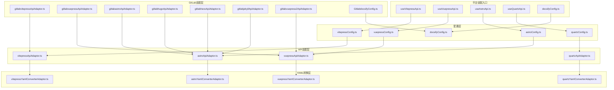
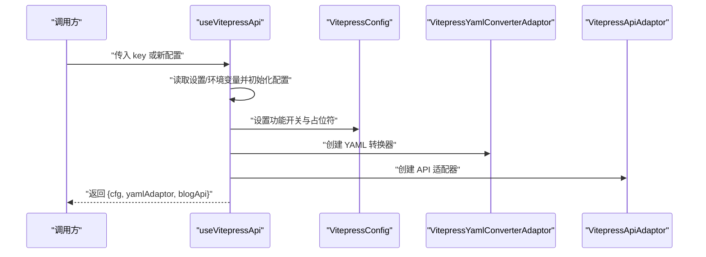
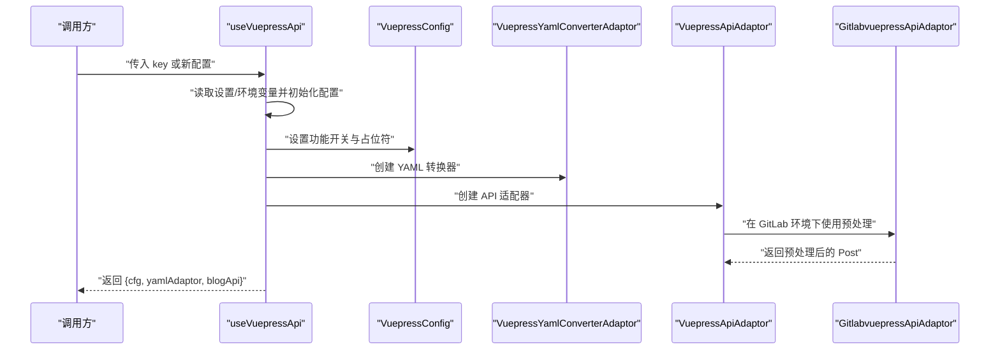
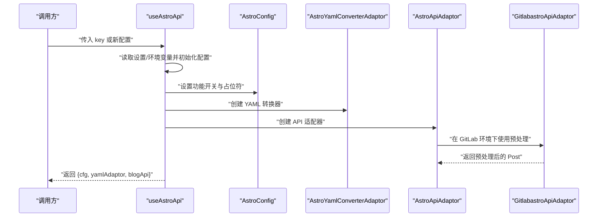
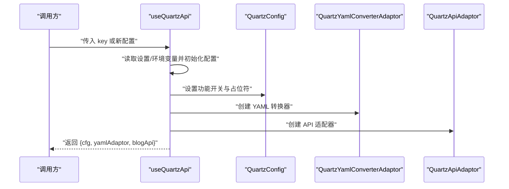
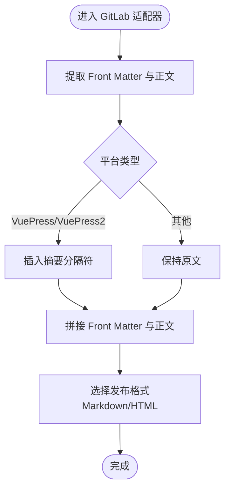
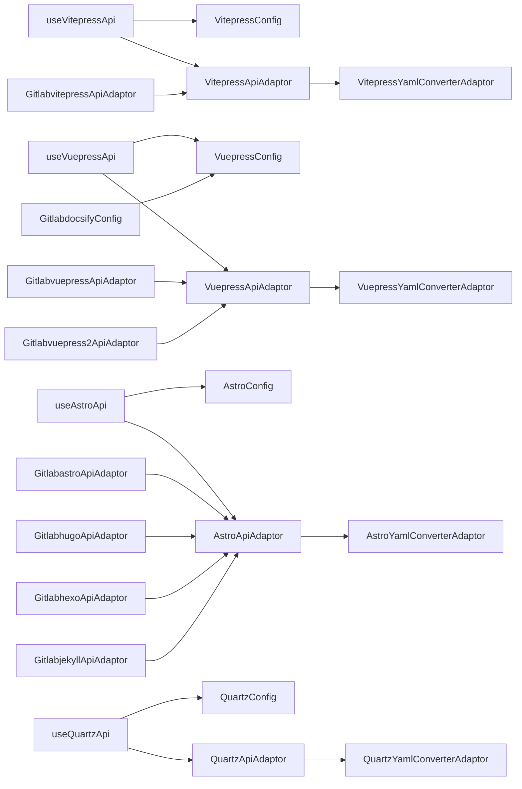

# 其他静态站点适配器

<cite>
**本文引用的文件**
- [useVitepressApi.ts](file://src/adaptors/api/vitepress/useVitepressApi.ts)
- [vitepressApiAdaptor.ts](file://src/adaptors/api/vitepress/vitepressApiAdaptor.ts)
- [vitepressConfig.ts](file://src/adaptors/api/vitepress/vitepressConfig.ts)
- [vitepressYamlConverterAdaptor.ts](file://src/adaptors/api/vitepress/vitepressYamlConverterAdaptor.ts)
- [useVuepressApi.ts](file://src/adaptors/api/vuepress/useVuepressApi.ts)
- [vuepressApiAdaptor.ts](file://src/adaptors/api/vuepress/vuepressApiAdaptor.ts)
- [vuepressConfig.ts](file://src/adaptors/api/vuepress/vuepressConfig.ts)
- [vuepressYamlConverterAdaptor.ts](file://src/adaptors/api/vuepress/vuepressYamlConverterAdaptor.ts)
- [useAstroApi.ts](file://src/adaptors/api/astro/useAstroApi.ts)
- [astroApiAdaptor.ts](file://src/adaptors/api/astro/astroApiAdaptor.ts)
- [astroConfig.ts](file://src/adaptors/api/astro/astroConfig.ts)
- [astroYamlConverterAdaptor.ts](file://src/adaptors/api/astro/astroYamlConverterAdaptor.ts)
- [useQuartzApi.ts](file://src/adaptors/api/quartz/useQuartzApi.ts)
- [quartzApiAdaptor.ts](file://src/adaptors/api/quartz/quartzApiAdaptor.ts)
- [quartzConfig.ts](file://src/adaptors/api/quartz/quartzConfig.ts)
- [quartzYamlConverterAdaptor.ts](file://src/adaptors/api/quartz/quartzYamlConverterAdaptor.ts)
- [docsifyConfig.ts](file://src/adaptors/api/docsify/docsifyConfig.ts)
- [gitlabvitepressApiAdaptor.ts](file://src/adaptors/api/gitlab-vitepress/gitlabvitepressApiAdaptor.ts)
- [gitlabvuepressApiAdaptor.ts](file://src/adaptors/api/gitlab-vuepress/gitlabvuepressApiAdaptor.ts)
- [gitlabastroApiAdaptor.ts](file://src/adaptors/api/gitlab-astro/gitlabastroApiAdaptor.ts)
- [gitlabhugoApiAdaptor.ts](file://src/adaptors/api/gitlab-hugo/gitlabhugoApiAdaptor.ts)
- [gitlabhexoApiAdaptor.ts](file://src/adaptors/api/gitlab-hexo/gitlabhexoApiAdaptor.ts)
- [gitlabjekyllApiAdaptor.ts](file://src/adaptors/api/gitlab-jekyll/gitlabjekyllApiAdaptor.ts)
- [gitlabvuepress2ApiAdaptor.ts](file://src/adaptors/api/gitlab-vuepress2/gitlabvuepress2ApiAdaptor.ts)
- [GitlabdocsifyConfig.ts](file://src/adaptors/api/gitlab-docsify/GitlabdocsifyConfig.ts)
- [commonGitlabApiAdaptor.ts](file://src/adaptors/api/base/gitlab/commonGitlabApiAdaptor.ts)
- [commonGithubApiAdaptor.ts](file://src/adaptors/api/base/github/commonGithubApiAdaptor.ts)
- [dynamicConfig.ts](file://src/platforms/dynamicConfig.ts)
- [constants.ts](file://src/utils/constants.ts)
</cite>

## 目录
1. [简介](#简介)
2. [项目结构](#项目结构)
3. [核心组件](#核心组件)
4. [架构总览](#架构总览)
5. [详细组件分析](#详细组件分析)
6. [依赖关系分析](#依赖关系分析)
7. [性能与部署考量](#性能与部署考量)
8. [故障排查指南](#故障排查指南)
9. [结论](#结论)
10. [附录：最佳实践与迁移指南](#附录最佳实践与迁移指南)

## 简介
本文件系统性梳理并对比 VitePress、VuePress、Astro、Quartz、Docsify 等现代静态站点生成器在本仓库中的适配实现，重点覆盖以下方面：
- 各平台适配器的初始化流程与配置差异
- YAML 转换器与正文预处理机制
- GitLab Pages 的完整适配方案（含 VitePress、VuePress、Astro、Hugo、Hexo、Jekyll、VuePress2、Docsify）
- 部署策略与最佳实践
- 迁移指南与常见问题排查

## 项目结构
围绕“静态站点适配器”的核心模块组织如下：
- 平台适配层：每个平台一个 useXxxApi.ts 初始化函数，负责读取配置、注入占位符、启用功能开关、创建 YAML 转换器与 API 适配器
- 配置层：每个平台一个 XxxConfig.ts，继承通用配置基类，设定页面类型、标签/分类/知识空间能力、预览链接规则等
- YAML 转换层：每个平台一个 XxxYamlConverterAdaptor.ts，负责 Front Matter 与正文的转换
- API 适配层：每个平台一个 XxxApiAdaptor.ts，继承通用适配器，重写 YAML 适配器选择与正文预处理逻辑
- GitLab 适配层：以 gitlab-xxx 命名空间提供 GitLab Pages 的适配器与配置，统一复用通用 GitLab 基类

图表来源
- [useVitepressApi.ts:1-99](file://src/adaptors/api/vitepress/useVitepressApi.ts#L1-L99)
- [useVuepressApi.ts:1-99](file://src/adaptors/api/vuepress/useVuepressApi.ts#L1-L99)
- [useAstroApi.ts:1-96](file://src/adaptors/api/astro/useAstroApi.ts#L1-L96)
- [useQuartzApi.ts:1-102](file://src/adaptors/api/quartz/useQuartzApi.ts#L1-L102)
- [docsifyConfig.ts:1-43](file://src/adaptors/api/docsify/docsifyConfig.ts#L1-L43)
- [vitepressConfig.ts](file://src/adaptors/api/vitepress/vitepressConfig.ts)
- [vuepressConfig.ts](file://src/adaptors/api/vuepress/vuepressConfig.ts)
- [astroConfig.ts](file://src/adaptors/api/astro/astroConfig.ts)
- [quartzConfig.ts](file://src/adaptors/api/quartz/quartzConfig.ts)
- [vitepressApiAdaptor.ts](file://src/adaptors/api/vitepress/vitepressApiAdaptor.ts)
- [vuepressApiAdaptor.ts](file://src/adaptors/api/vuepress/vuepressApiAdaptor.ts)
- [astroApiAdaptor.ts](file://src/adaptors/api/astro/astroApiAdaptor.ts)
- [quartzApiAdaptor.ts](file://src/adaptors/api/quartz/quartzApiAdaptor.ts)
- [gitlabvitepressApiAdaptor.ts:1-63](file://src/adaptors/api/gitlab-vitepress/gitlabvitepressApiAdaptor.ts#L1-L63)
- [gitlabvuepressApiAdaptor.ts:1-68](file://src/adaptors/api/gitlab-vuepress/gitlabvuepressApiAdaptor.ts#L1-L68)
- [gitlabastroApiAdaptor.ts:1-62](file://src/adaptors/api/gitlab-astro/gitlabastroApiAdaptor.ts#L1-L62)
- [gitlabhugoApiAdaptor.ts:1-63](file://src/adaptors/api/gitlab-hugo/gitlabhugoApiAdaptor.ts#L1-L63)
- [gitlabhexoApiAdaptor.ts:1-63](file://src/adaptors/api/gitlab-hexo/gitlabhexoApiAdaptor.ts#L1-L63)
- [gitlabjekyllApiAdaptor.ts:1-63](file://src/adaptors/api/gitlab-jekyll/gitlabjekyllApiAdaptor.ts#L1-L63)
- [gitlabvuepress2ApiAdaptor.ts:1-68](file://src/adaptors/api/gitlab-vuepress2/gitlabvuepress2ApiAdaptor.ts#L1-L68)
- [GitlabdocsifyConfig.ts:1-51](file://src/adaptors/api/gitlab-docsify/GitlabdocsifyConfig.ts#L1-L51)

章节来源
- [useVitepressApi.ts:1-99](file://src/adaptors/api/vitepress/useVitepressApi.ts#L1-L99)
- [useVuepressApi.ts:1-99](file://src/adaptors/api/vuepress/useVuepressApi.ts#L1-L99)
- [useAstroApi.ts:1-96](file://src/adaptors/api/astro/useAstroApi.ts#L1-L96)
- [useQuartzApi.ts:1-102](file://src/adaptors/api/quartz/useQuartzApi.ts#L1-L102)
- [docsifyConfig.ts:1-43](file://src/adaptors/api/docsify/docsifyConfig.ts#L1-L43)

## 核心组件
- useXxxApi.ts 初始化器：统一负责日志、应用实例、配置加载（优先使用设置项，否则回退到环境变量）、占位符与功能开关初始化、YAML 转换器与 API 适配器创建
- XxxConfig.ts 配置类：继承通用配置基类，设置页面类型、密码类型、是否允许修改预览 URL、标签/分类/知识空间能力、默认文件命名规则等
- XxxYamlConverterAdaptor.ts：封装 Front Matter 与正文的转换逻辑，供适配器调用
- XxxApiAdaptor.ts：继承通用适配器，重写 YAML 适配器选择与正文预处理（preEditPost），确保发布内容符合目标平台要求
- GitLab 适配器：统一继承通用 GitLab 基类，重写 YAML 适配器并按平台特性进行正文预处理（如 VuePress/VuePress2 的摘要标记插入）

章节来源
- [useVitepressApi.ts:22-96](file://src/adaptors/api/vitepress/useVitepressApi.ts#L22-L96)
- [useVuepressApi.ts:22-96](file://src/adaptors/api/vuepress/useVuepressApi.ts#L22-L96)
- [useAstroApi.ts:22-94](file://src/adaptors/api/astro/useAstroApi.ts#L22-L94)
- [useQuartzApi.ts:22-99](file://src/adaptors/api/quartz/useQuartzApi.ts#L22-L99)
- [vitepressConfig.ts](file://src/adaptors/api/vitepress/vitepressConfig.ts)
- [vuepressConfig.ts](file://src/adaptors/api/vuepress/vuepressConfig.ts)
- [astroConfig.ts](file://src/adaptors/api/astro/astroConfig.ts)
- [quartzConfig.ts](file://src/adaptors/api/quartz/quartzConfig.ts)
- [vitepressYamlConverterAdaptor.ts](file://src/adaptors/api/vitepress/vitepressYamlConverterAdaptor.ts)
- [vuepressYamlConverterAdaptor.ts](file://src/adaptors/api/vuepress/vuepressYamlConverterAdaptor.ts)
- [astroYamlConverterAdaptor.ts](file://src/adaptors/api/astro/astroYamlConverterAdaptor.ts)
- [quartzYamlConverterAdaptor.ts](file://src/adaptors/api/quartz/quartzYamlConverterAdaptor.ts)
- [vitepressApiAdaptor.ts](file://src/adaptors/api/vitepress/vitepressApiAdaptor.ts)
- [vuepressApiAdaptor.ts](file://src/adaptors/api/vuepress/vuepressApiAdaptor.ts)
- [astroApiAdaptor.ts](file://src/adaptors/api/astro/astroApiAdaptor.ts)
- [quartzApiAdaptor.ts](file://src/adaptors/api/quartz/quartzApiAdaptor.ts)
- [gitlabvitepressApiAdaptor.ts:23-59](file://src/adaptors/api/gitlab-vitepress/gitlabvitepressApiAdaptor.ts#L23-L59)
- [gitlabvuepressApiAdaptor.ts:23-64](file://src/adaptors/api/gitlab-vuepress/gitlabvuepressApiAdaptor.ts#L23-L64)
- [gitlabastroApiAdaptor.ts:23-59](file://src/adaptors/api/gitlab-astro/gitlabastroApiAdaptor.ts#L23-L59)
- [gitlabhugoApiAdaptor.ts:23-59](file://src/adaptors/api/gitlab-hugo/gitlabhugoApiAdaptor.ts#L23-L59)
- [gitlabhexoApiAdaptor.ts:23-59](file://src/adaptors/api/gitlab-hexo/gitlabhexoApiAdaptor.ts#L23-L59)
- [gitlabjekyllApiAdaptor.ts:23-59](file://src/adaptors/api/gitlab-jekyll/gitlabjekyllApiAdaptor.ts#L23-L59)
- [gitlabvuepress2ApiAdaptor.ts:23-64](file://src/adaptors/api/gitlab-vuepress2/gitlabvuepress2ApiAdaptor.ts#L23-L64)
- [GitlabdocsifyConfig.ts:17-47](file://src/adaptors/api/gitlab-docsify/GitlabdocsifyConfig.ts#L17-L47)

## 架构总览
下图展示“平台适配器”到“配置/转换/适配器”的整体关系，以及 GitLab 适配器如何统一接入。

```mermaid
classDiagram
class useVitepressApi {
+invoke()
}
class useVuepressApi {
+invoke()
}
class useAstroApi {
+invoke()
}
class useQuartzApi {
+invoke()
}
class VitepressConfig {
+previewUrl
+pageType
+passwordType
+tagEnabled
+cateEnabled
+knowledgeSpaceEnabled
}
class VuepressConfig {
+previewUrl
+pageType
+passwordType
+tagEnabled
+cateEnabled
+knowledgeSpaceEnabled
}
class AstroConfig {
+previewUrl
+pageType
+passwordType
+tagEnabled
+cateEnabled
+knowledgeSpaceEnabled
}
class QuartzConfig {
+previewUrl
+pageType
+passwordType
+tagEnabled
+cateEnabled
+knowledgeSpaceEnabled
}
class VitepressApiAdaptor {
+getYamlAdaptor()
+preEditPost()
}
class VuepressApiAdaptor {
+getYamlAdaptor()
+preEditPost()
}
class AstroApiAdaptor {
+getYamlAdaptor()
+preEditPost()
}
class QuartzApiAdaptor {
+getYamlAdaptor()
+preEditPost()
}
class VitepressYamlConverterAdaptor
class VuepressYamlConverterAdaptor
class AstroYamlConverterAdaptor
class QuartzYamlConverterAdaptor
class GitlabvitepressApiAdaptor
class GitlabvuepressApiAdaptor
class GitlabastroApiAdaptor
class GitlabhugoApiAdaptor
class GitlabhexoApiAdaptor
class GitlabjekyllApiAdaptor
class Gitlabvuepress2ApiAdaptor
class GitlabdocsifyConfig
useVitepressApi --> VitepressConfig
useVitepressApi --> VitepressApiAdaptor
VitepressApiAdaptor --> VitepressYamlConverterAdaptor
useVuepressApi --> VuepressConfig
useVuepressApi --> VuepressApiAdaptor
VuepressApiAdaptor --> VuepressYamlConverterAdaptor
useAstroApi --> AstroConfig
useAstroApi --> AstroApiAdaptor
AstroApiAdaptor --> AstroYamlConverterAdaptor
useQuartzApi --> QuartzConfig
useQuartzApi --> QuartzApiAdaptor
QuartzApiAdaptor --> QuartzYamlConverterAdaptor
GitlabvitepressApiAdaptor --> VitepressApiAdaptor
GitlabvuepressApiAdaptor --> VuepressApiAdaptor
GitlabastroApiAdaptor --> AstroApiAdaptor
GitlabhugoApiAdaptor --> AstroApiAdaptor
GitlabhexoApiAdaptor --> AstroApiAdaptor
GitlabjekyllApiAdaptor --> AstroApiAdaptor
Gitlabvuepress2ApiAdaptor --> VuepressApiAdaptor
GitlabdocsifyConfig --> VuepressConfig
```

图表来源
- [useVitepressApi.ts:22-96](file://src/adaptors/api/vitepress/useVitepressApi.ts#L22-L96)
- [useVuepressApi.ts:22-96](file://src/adaptors/api/vuepress/useVuepressApi.ts#L22-L96)
- [useAstroApi.ts:22-94](file://src/adaptors/api/astro/useAstroApi.ts#L22-L94)
- [useQuartzApi.ts:22-99](file://src/adaptors/api/quartz/useQuartzApi.ts#L22-L99)
- [vitepressConfig.ts](file://src/adaptors/api/vitepress/vitepressConfig.ts)
- [vuepressConfig.ts](file://src/adaptors/api/vuepress/vuepressConfig.ts)
- [astroConfig.ts](file://src/adaptors/api/astro/astroConfig.ts)
- [quartzConfig.ts](file://src/adaptors/api/quartz/quartzConfig.ts)
- [vitepressApiAdaptor.ts](file://src/adaptors/api/vitepress/vitepressApiAdaptor.ts)
- [vuepressApiAdaptor.ts](file://src/adaptors/api/vuepress/vuepressApiAdaptor.ts)
- [astroApiAdaptor.ts](file://src/adaptors/api/astro/astroApiAdaptor.ts)
- [quartzApiAdaptor.ts](file://src/adaptors/api/quartz/quartzApiAdaptor.ts)
- [gitlabvitepressApiAdaptor.ts:23-59](file://src/adaptors/api/gitlab-vitepress/gitlabvitepressApiAdaptor.ts#L23-L59)
- [gitlabvuepressApiAdaptor.ts:23-64](file://src/adaptors/api/gitlab-vuepress/gitlabvuepressApiAdaptor.ts#L23-L64)
- [gitlabastroApiAdaptor.ts:23-59](file://src/adaptors/api/gitlab-astro/gitlabastroApiAdaptor.ts#L23-L59)
- [gitlabhugoApiAdaptor.ts:23-59](file://src/adaptors/api/gitlab-hugo/gitlabhugoApiAdaptor.ts#L23-L59)
- [gitlabhexoApiAdaptor.ts:23-59](file://src/adaptors/api/gitlab-hexo/gitlabhexoApiAdaptor.ts#L23-L59)
- [gitlabjekyllApiAdaptor.ts:23-59](file://src/adaptors/api/gitlab-jekyll/gitlabjekyllApiAdaptor.ts#L23-L59)
- [gitlabvuepress2ApiAdaptor.ts:23-64](file://src/adaptors/api/gitlab-vuepress2/gitlabvuepress2ApiAdaptor.ts#L23-L64)
- [GitlabdocsifyConfig.ts:17-47](file://src/adaptors/api/gitlab-docsify/GitlabdocsifyConfig.ts#L17-L47)

## 详细组件分析

### VitePress 适配器
- 初始化流程：读取设置或环境变量，设置 posidKey、标签/分类/知识空间能力、图片服务支持；创建 YAML 转换器与 API 适配器
- 配置要点：默认 Markdown 文件命名规则、知识空间标题与只读提示
- API 适配器：重写 YAML 适配器选择与正文预处理，保证 Front Matter 与正文拼接正确

图表来源
- [useVitepressApi.ts:22-96](file://src/adaptors/api/vitepress/useVitepressApi.ts#L22-L96)
- [vitepressConfig.ts](file://src/adaptors/api/vitepress/vitepressConfig.ts)
- [vitepressYamlConverterAdaptor.ts](file://src/adaptors/api/vitepress/vitepressYamlConverterAdaptor.ts)
- [vitepressApiAdaptor.ts](file://src/adaptors/api/vitepress/vitepressApiAdaptor.ts)

章节来源
- [useVitepressApi.ts:22-96](file://src/adaptors/api/vitepress/useVitepressApi.ts#L22-L96)
- [vitepressConfig.ts](file://src/adaptors/api/vitepress/vitepressConfig.ts)
- [vitepressApiAdaptor.ts](file://src/adaptors/api/vitepress/vitepressApiAdaptor.ts)

### VuePress 适配器
- 初始化流程：与 VitePress 类似，但默认文件命名规则不同；知识空间默认只读
- 正文预处理：在 GitLab 适配器中对摘要标记进行插入，确保分隔符存在

图表来源
- [useVuepressApi.ts:22-96](file://src/adaptors/api/vuepress/useVuepressApi.ts#L22-L96)
- [vuepressConfig.ts](file://src/adaptors/api/vuepress/vuepressConfig.ts)
- [vuepressYamlConverterAdaptor.ts](file://src/adaptors/api/vuepress/vuepressYamlConverterAdaptor.ts)
- [vuepressApiAdaptor.ts](file://src/adaptors/api/vuepress/vuepressApiAdaptor.ts)
- [gitlabvuepressApiAdaptor.ts:23-64](file://src/adaptors/api/gitlab-vuepress/gitlabvuepressApiAdaptor.ts#L23-L64)

章节来源
- [useVuepressApi.ts:22-96](file://src/adaptors/api/vuepress/useVuepressApi.ts#L22-L96)
- [vuepressConfig.ts](file://src/adaptors/api/vuepress/vuepressConfig.ts)
- [vuepressApiAdaptor.ts](file://src/adaptors/api/vuepress/vuepressApiAdaptor.ts)
- [gitlabvuepressApiAdaptor.ts:23-64](file://src/adaptors/api/gitlab-vuepress/gitlabvuepressApiAdaptor.ts#L23-L64)

### Astro 适配器
- 初始化流程：默认文件命名规则、标签/分类能力、知识空间只读提示
- GitLab 适配器：与 Astro 原生一致，保持 Front Matter 与正文拼接

图表来源
- [useAstroApi.ts:22-94](file://src/adaptors/api/astro/useAstroApi.ts#L22-L94)
- [astroConfig.ts](file://src/adaptors/api/astro/astroConfig.ts)
- [astroYamlConverterAdaptor.ts](file://src/adaptors/api/astro/astroYamlConverterAdaptor.ts)
- [astroApiAdaptor.ts](file://src/adaptors/api/astro/astroApiAdaptor.ts)
- [gitlabastroApiAdaptor.ts:23-59](file://src/adaptors/api/gitlab-astro/gitlabastroApiAdaptor.ts#L23-L59)

章节来源
- [useAstroApi.ts:22-94](file://src/adaptors/api/astro/useAstroApi.ts#L22-L94)
- [astroConfig.ts](file://src/adaptors/api/astro/astroConfig.ts)
- [astroApiAdaptor.ts](file://src/adaptors/api/astro/astroApiAdaptor.ts)
- [gitlabastroApiAdaptor.ts:23-59](file://src/adaptors/api/gitlab-astro/gitlabastroApiAdaptor.ts#L23-L59)

### Quartz 适配器
- 初始化流程：默认文件命名规则、标签/分类能力、知识空间可修改
- YAML 转换器：独立实现，适配 Quartz 的 Front Matter 结构

图表来源
- [useQuartzApi.ts:22-99](file://src/adaptors/api/quartz/useQuartzApi.ts#L22-L99)
- [quartzConfig.ts](file://src/adaptors/api/quartz/quartzConfig.ts)
- [quartzYamlConverterAdaptor.ts](file://src/adaptors/api/quartz/quartzYamlConverterAdaptor.ts)
- [quartzApiAdaptor.ts](file://src/adaptors/api/quartz/quartzApiAdaptor.ts)

章节来源
- [useQuartzApi.ts:22-99](file://src/adaptors/api/quartz/useQuartzApi.ts#L22-L99)
- [quartzConfig.ts](file://src/adaptors/api/quartz/quartzConfig.ts)
- [quartzApiAdaptor.ts](file://src/adaptors/api/quartz/quartzApiAdaptor.ts)

### Docsify 适配器
- 配置特点：继承通用 GitHub 配置，页面类型为 Markdown，密码类型为 Token，知识空间默认只读
- 适配器：未见专用 API 适配器文件，配置类即为最终适配形态

章节来源
- [docsifyConfig.ts:16-42](file://src/adaptors/api/docsify/docsifyConfig.ts#L16-L42)

### GitLab Pages 完整适配方案
- 统一基类：所有 GitLab 适配器均继承通用 GitLab 基类，复用公共逻辑
- YAML 适配器：按平台提供专用 YAML 转换器
- 正文预处理：根据平台特性进行 Front Matter 提取与正文拼接；VuePress/VuePress2 在 GitLab 场景下自动插入摘要分隔符
- 支持平台：VitePress、VuePress、Astro、Hugo、Hexo、Jekyll、VuePress2、Docsify（Docsify 配置类位于 GitLab 命名空间）

图表来源
- [gitlabvuepressApiAdaptor.ts:28-64](file://src/adaptors/api/gitlab-vuepress/gitlabvuepressApiAdaptor.ts#L28-L64)
- [gitlabvuepress2ApiAdaptor.ts:28-64](file://src/adaptors/api/gitlab-vuepress2/gitlabvuepress2ApiAdaptor.ts#L28-L64)
- [gitlabvitepressApiAdaptor.ts:28-59](file://src/adaptors/api/gitlab-vitepress/gitlabvitepressApiAdaptor.ts#L28-L59)
- [gitlabastroApiAdaptor.ts:28-59](file://src/adaptors/api/gitlab-astro/gitlabastroApiAdaptor.ts#L28-L59)
- [gitlabhugoApiAdaptor.ts:28-59](file://src/adaptors/api/gitlab-hugo/gitlabhugoApiAdaptor.ts#L28-L59)
- [gitlabhexoApiAdaptor.ts:28-59](file://src/adaptors/api/gitlab-hexo/gitlabhexoApiAdaptor.ts#L28-L59)
- [gitlabjekyllApiAdaptor.ts:28-59](file://src/adaptors/api/gitlab-jekyll/gitlabjekyllApiAdaptor.ts#L28-L59)

章节来源
- [gitlabvitepressApiAdaptor.ts:23-59](file://src/adaptors/api/gitlab-vitepress/gitlabvitepressApiAdaptor.ts#L23-L59)
- [gitlabvuepressApiAdaptor.ts:23-64](file://src/adaptors/api/gitlab-vuepress/gitlabvuepressApiAdaptor.ts#L23-L64)
- [gitlabastroApiAdaptor.ts:23-59](file://src/adaptors/api/gitlab-astro/gitlabastroApiAdaptor.ts#L23-L59)
- [gitlabhugoApiAdaptor.ts:23-59](file://src/adaptors/api/gitlab-hugo/gitlabhugoApiAdaptor.ts#L23-L59)
- [gitlabhexoApiAdaptor.ts:23-59](file://src/adaptors/api/gitlab-hexo/gitlabhexoApiAdaptor.ts#L23-L59)
- [gitlabjekyllApiAdaptor.ts:23-59](file://src/adaptors/api/gitlab-jekyll/gitlabjekyllApiAdaptor.ts#L23-L59)
- [gitlabvuepress2ApiAdaptor.ts:23-64](file://src/adaptors/api/gitlab-vuepress2/gitlabvuepress2ApiAdaptor.ts#L23-L64)
- [GitlabdocsifyConfig.ts:17-47](file://src/adaptors/api/gitlab-docsify/GitlabdocsifyConfig.ts#L17-L47)
- [commonGitlabApiAdaptor.ts](file://src/adaptors/api/base/gitlab/commonGitlabApiAdaptor.ts)

## 依赖关系分析
- useXxxApi.ts 对配置、适配器、转换器形成“组合依赖”，通过统一入口解耦上层调用
- 配置类继承通用配置基类，减少重复代码，增强一致性
- GitLab 适配器统一继承通用 GitLab 基类，避免重复实现公共逻辑
- 占位符与功能开关由 useXxxApi.ts 注入，确保不同平台能力边界清晰

图表来源
- [useVitepressApi.ts:22-96](file://src/adaptors/api/vitepress/useVitepressApi.ts#L22-L96)
- [useVuepressApi.ts:22-96](file://src/adaptors/api/vuepress/useVuepressApi.ts#L22-L96)
- [useAstroApi.ts:22-94](file://src/adaptors/api/astro/useAstroApi.ts#L22-L94)
- [useQuartzApi.ts:22-99](file://src/adaptors/api/quartz/useQuartzApi.ts#L22-L99)
- [vitepressConfig.ts](file://src/adaptors/api/vitepress/vitepressConfig.ts)
- [vuepressConfig.ts](file://src/adaptors/api/vuepress/vuepressConfig.ts)
- [astroConfig.ts](file://src/adaptors/api/astro/astroConfig.ts)
- [quartzConfig.ts](file://src/adaptors/api/quartz/quartzConfig.ts)
- [vitepressApiAdaptor.ts](file://src/adaptors/api/vitepress/vitepressApiAdaptor.ts)
- [vuepressApiAdaptor.ts](file://src/adaptors/api/vuepress/vuepressApiAdaptor.ts)
- [astroApiAdaptor.ts](file://src/adaptors/api/astro/astroApiAdaptor.ts)
- [quartzApiAdaptor.ts](file://src/adaptors/api/quartz/quartzApiAdaptor.ts)
- [gitlabvitepressApiAdaptor.ts:23-59](file://src/adaptors/api/gitlab-vitepress/gitlabvitepressApiAdaptor.ts#L23-L59)
- [gitlabvuepressApiAdaptor.ts:23-64](file://src/adaptors/api/gitlab-vuepress/gitlabvuepressApiAdaptor.ts#L23-L64)
- [gitlabastroApiAdaptor.ts:23-59](file://src/adaptors/api/gitlab-astro/gitlabastroApiAdaptor.ts#L23-L59)
- [gitlabhugoApiAdaptor.ts:23-59](file://src/adaptors/api/gitlab-hugo/gitlabhugoApiAdaptor.ts#L23-L59)
- [gitlabhexoApiAdaptor.ts:23-59](file://src/adaptors/api/gitlab-hexo/gitlabhexoApiAdaptor.ts#L23-L59)
- [gitlabjekyllApiAdaptor.ts:23-59](file://src/adaptors/api/gitlab-jekyll/gitlabjekyllApiAdaptor.ts#L23-L59)
- [gitlabvuepress2ApiAdaptor.ts:23-64](file://src/adaptors/api/gitlab-vuepress2/gitlabvuepress2ApiAdaptor.ts#L23-L64)
- [GitlabdocsifyConfig.ts:17-47](file://src/adaptors/api/gitlab-docsify/GitlabdocsifyConfig.ts#L17-L47)

章节来源
- [useVitepressApi.ts:22-96](file://src/adaptors/api/vitepress/useVitepressApi.ts#L22-L96)
- [useVuepressApi.ts:22-96](file://src/adaptors/api/vuepress/useVuepressApi.ts#L22-L96)
- [useAstroApi.ts:22-94](file://src/adaptors/api/astro/useAstroApi.ts#L22-L94)
- [useQuartzApi.ts:22-99](file://src/adaptors/api/quartz/useQuartzApi.ts#L22-L99)
- [commonGitlabApiAdaptor.ts](file://src/adaptors/api/base/gitlab/commonGitlabApiAdaptor.ts)
- [commonGithubApiAdaptor.ts](file://src/adaptors/api/base/github/commonGithubApiAdaptor.ts)

## 性能与部署考量
- 初始化性能：useXxxApi.ts 仅在首次调用时创建配置与适配器实例，后续复用可降低开销
- YAML 处理：Front Matter 提取与正文拼接为轻量操作，建议在 GitLab 适配器中保持最小化改动
- 环境变量回退：当设置为空时自动回退至环境变量，减少用户配置负担
- 中间件代理：统一使用共享中间件地址常量，便于跨平台部署与调试

章节来源
- [useVitepressApi.ts:43-52](file://src/adaptors/api/vitepress/useVitepressApi.ts#L43-L52)
- [useVuepressApi.ts:43-52](file://src/adaptors/api/vuepress/useVuepressApi.ts#L43-L52)
- [useAstroApi.ts:43-52](file://src/adaptors/api/astro/useAstroApi.ts#L43-L52)
- [useQuartzApi.ts:43-51](file://src/adaptors/api/quartz/useQuartzApi.ts#L43-L51)
- [constants.ts](file://src/utils/constants.ts)

## 故障排查指南
- 配置为空导致异常：确认设置项或环境变量是否正确；若为空则自动回退至默认环境变量
- 知识空间不可修改：部分平台默认只读，需删除后重新发布
- YAML Front Matter 异常：检查 YAML 转换器与正文预处理逻辑，确保 Front Matter 与正文拼接顺序正确
- GitLab 预览链接错误：核对预览 URL 规则与平台默认路径配置
- 图片服务支持：确认是否启用内置图床与 PicGo 图床支持

章节来源
- [useVitepressApi.ts:43-52](file://src/adaptors/api/vitepress/useVitepressApi.ts#L43-L52)
- [useVuepressApi.ts:43-52](file://src/adaptors/api/vuepress/useVuepressApi.ts#L43-L52)
- [useAstroApi.ts:43-52](file://src/adaptors/api/astro/useAstroApi.ts#L43-L52)
- [useQuartzApi.ts:43-51](file://src/adaptors/api/quartz/useQuartzApi.ts#L43-L51)
- [gitlabvitepressApiAdaptor.ts:38-49](file://src/adaptors/api/gitlab-vitepress/gitlabvitepressApiAdaptor.ts#L38-L49)
- [gitlabvuepressApiAdaptor.ts:44-49](file://src/adaptors/api/gitlab-vuepress/gitlabvuepressApiAdaptor.ts#L44-L49)
- [gitlabvuepress2ApiAdaptor.ts:44-49](file://src/adaptors/api/gitlab-vuepress2/gitlabvuepress2ApiAdaptor.ts#L44-L49)
- [GitlabdocsifyConfig.ts:27-34](file://src/adaptors/api/gitlab-docsify/GitlabdocsifyConfig.ts#L27-L34)

## 结论
本仓库对 VitePress、VuePress、Astro、Quartz、Docsify 等静态站点生成器提供了统一的适配器模式，通过 useXxxApi.ts 初始化器、配置类、YAML 转换器与 API 适配器的分层设计，实现了良好的可扩展性与可维护性。GitLab Pages 的适配通过统一基类与平台特定预处理，覆盖了主流静态站点生成器的发布场景。

## 附录：最佳实践与迁移指南
- 最佳实践
  - 明确各平台的能力边界（标签/分类/知识空间/文件命名规则）
  - 在 GitLab 环境下优先使用统一的预览 URL 与默认路径
  - 对 VuePress/VuePress2 的摘要分隔符进行自动插入，提升兼容性
  - 使用环境变量作为默认配置回退，简化部署
- 迁移指南
  - 从旧版配置迁移到新版 useXxxApi.ts 初始化器，确保 posidKey 与占位符正确注入
  - 若平台配置为空，确认环境变量是否齐全
  - 如需自定义文件命名规则，可在 useXxxApi.ts 中设置相应规则
  - 在 GitLab Pages 上迁移时，优先采用对应 gitlab-xxx 适配器，减少定制成本

章节来源
- [useVitepressApi.ts:56-61](file://src/adaptors/api/vitepress/useVitepressApi.ts#L56-L61)
- [useVuepressApi.ts:56-61](file://src/adaptors/api/vuepress/useVuepressApi.ts#L56-L61)
- [useAstroApi.ts:56-61](file://src/adaptors/api/astro/useAstroApi.ts#L56-L61)
- [useQuartzApi.ts:55-60](file://src/adaptors/api/quartz/useQuartzApi.ts#L55-L60)
- [dynamicConfig.ts](file://src/platforms/dynamicConfig.ts)