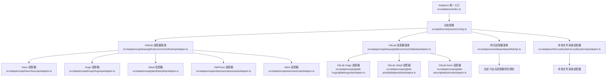
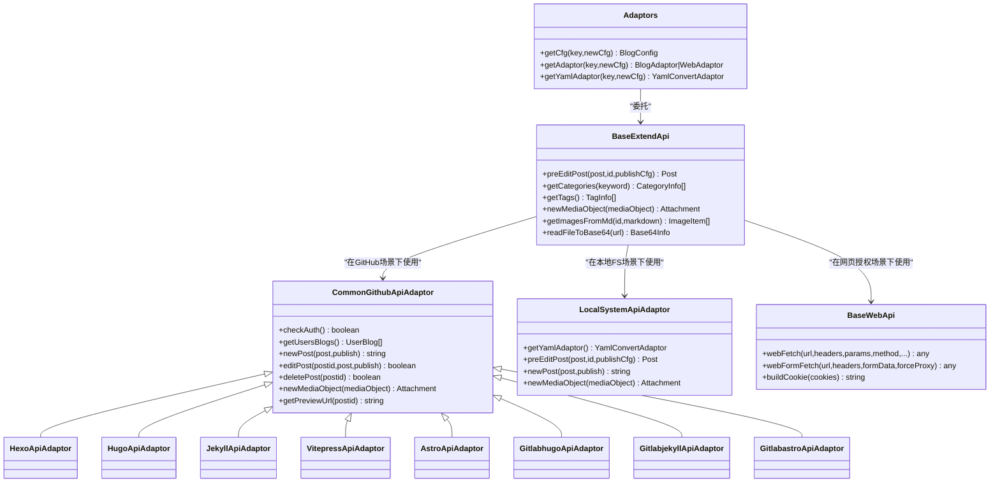
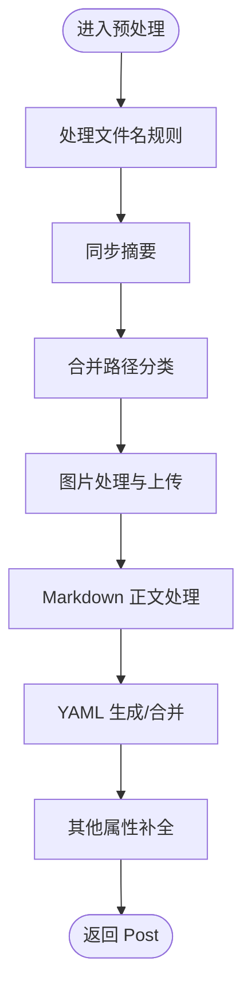
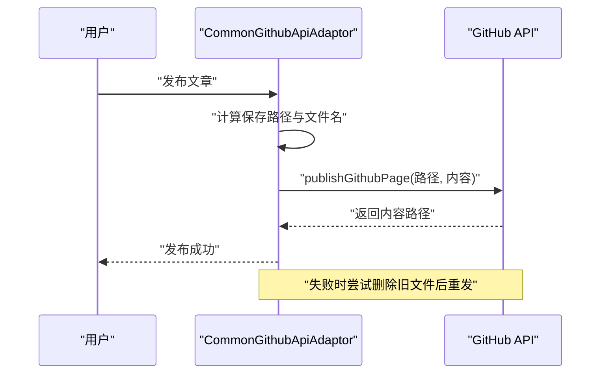
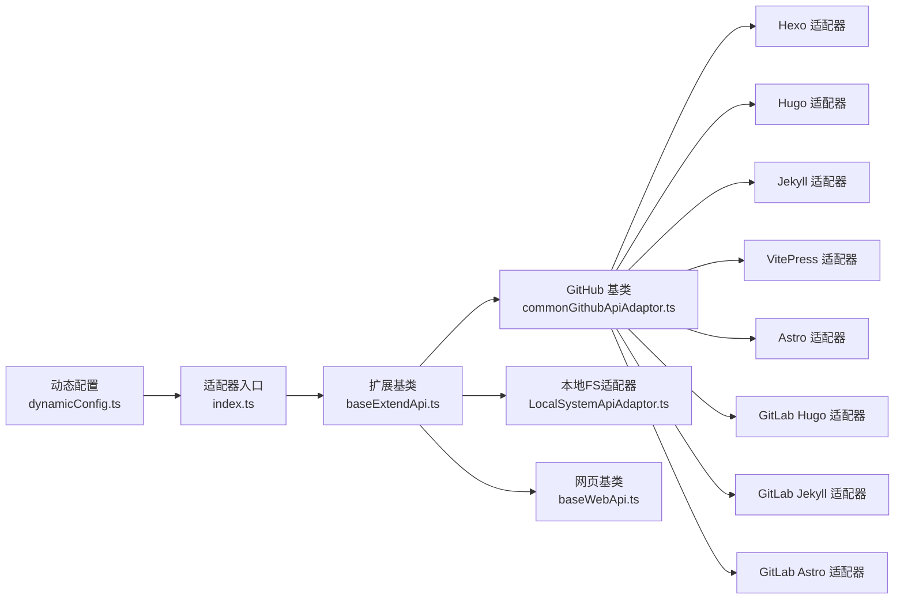

# 静态站点适配器

<cite>
**本文档引用的文件**
- [src/adaptors/index.ts](file://src/adaptors/index.ts)
- [src/adaptors/base/baseExtendApi.ts](file://src/adaptors/base/baseExtendApi.ts)
- [src/adaptors/fs/LocalSystem/LocalSystemApiAdaptor.ts](file://src/adaptors/fs/LocalSystem/LocalSystemApiAdaptor.ts)
- [src/adaptors/web/base/baseWebApi.ts](file://src/adaptors/web/base/baseWebApi.ts)
- [src/adaptors/api/astro/astroApiAdaptor.ts](file://src/adaptors/api/astro/astroApiAdaptor.ts)
- [src/adaptors/api/hexo/hexoApiAdaptor.ts](file://src/adaptors/api/hexo/hexoApiAdaptor.ts)
- [src/adaptors/api/hugo/hugoApiAdaptor.ts](file://src/adaptors/api/hugo/hugoApiAdaptor.ts)
- [src/adaptors/api/jekyll/jekyllApiAdaptor.ts](file://src/adaptors/api/jekyll/jekyllApiAdaptor.ts)
- [src/adaptors/api/vitepress/vitepressApiAdaptor.ts](file://src/adaptors/api/vitepress/vitepressApiAdaptor.ts)
- [src/adaptors/api/base/github/commonGithubApiAdaptor.ts](file://src/adaptors/api/base/github/commonGithubApiAdaptor.ts)
- [src/adaptors/api/base/github/commonGithubConfig.ts](file://src/adaptors/api/base/github/commonGithubConfig.ts)
- [src/adaptors/api/gitlab-astro/gitlabastroApiAdaptor.ts](file://src/adaptors/api/gitlab-astro/gitlabastroApiAdaptor.ts)
- [src/adaptors/api/gitlab-hugo/gitlabhugoApiAdaptor.ts](file://src/adaptors/api/gitlab-hugo/gitlabhugoApiAdaptor.ts)
- [src/adaptors/api/gitlab-jekyll/gitlabjekyllApiAdaptor.ts](file://src/adaptors/api/gitlab-jekyll/gitlabjekyllApiAdaptor.ts)
- [src/platforms/dynamicConfig.ts](file://src/platforms/dynamicConfig.ts)
</cite>

## 目录
1. [简介](#简介)
2. [项目结构](#项目结构)
3. [核心组件](#核心组件)
4. [架构总览](#架构总览)
5. [详细组件分析](#详细组件分析)
6. [依赖关系分析](#依赖关系分析)
7. [性能考量](#性能考量)
8. [故障排查指南](#故障排查指南)
9. [结论](#结论)
10. [附录](#附录)

## 简介
本文件面向“静态站点适配器”的技术文档，系统性阐述该适配器如何对接多种静态站点生成器（如 Hexo、Hugo、Jekyll、VitePress、Astro、Quartz 等），并支持 GitHub Pages、GitLab Pages 等托管平台的集成。文档覆盖适配原理、YAML 配置转换、文件上传机制、Git 工作流集成（分支管理、提交策略、自动化部署）、以及不同静态站点生成器的差异化处理与通用解决方案。

## 项目结构
适配器采用“平台类型 + 子平台类型”的动态配置模型，通过统一入口按平台 key 分发到具体适配器，实现对多静态站点生成器与托管平台的统一接入。

图表来源
- [src/adaptors/index.ts:56-263](file://src/adaptors/index.ts#L56-L263)
- [src/platforms/dynamicConfig.ts:174-238](file://src/platforms/dynamicConfig.ts#L174-L238)
- [src/adaptors/api/base/github/commonGithubApiAdaptor.ts:28-47](file://src/adaptors/api/base/github/commonGithubApiAdaptor.ts#L28-L47)
- [src/adaptors/api/hexo/hexoApiAdaptor.ts:23-26](file://src/adaptors/api/hexo/hexoApiAdaptor.ts#L23-L26)
- [src/adaptors/api/hugo/hugoApiAdaptor.ts:23-26](file://src/adaptors/api/hugo/hugoApiAdaptor.ts#L23-L26)
- [src/adaptors/api/jekyll/jekyllApiAdaptor.ts:23-26](file://src/adaptors/api/jekyll/jekyllApiAdaptor.ts#L23-L26)
- [src/adaptors/api/vitepress/vitepressApiAdaptor.ts:23-26](file://src/adaptors/api/vitepress/vitepressApiAdaptor.ts#L23-L26)
- [src/adaptors/api/astro/astroApiAdaptor.ts:23-26](file://src/adaptors/api/astro/astroApiAdaptor.ts#L23-L26)
- [src/adaptors/api/gitlab-hugo/gitlabhugoApiAdaptor.ts:23-26](file://src/adaptors/api/gitlab-hugo/gitlabhugoApiAdaptor.ts#L23-L26)
- [src/adaptors/api/gitlab-jekyll/gitlabjekyllApiAdaptor.ts:23-26](file://src/adaptors/api/gitlab-jekyll/gitlabjekyllApiAdaptor.ts#L23-L26)
- [src/adaptors/api/gitlab-astro/gitlabastroApiAdaptor.ts:23-26](file://src/adaptors/api/gitlab-astro/gitlabastroApiAdaptor.ts#L23-L26)
- [src/adaptors/web/base/baseWebApi.ts:36-63](file://src/adaptors/web/base/baseWebApi.ts#L36-L63)
- [src/adaptors/fs/LocalSystem/LocalSystemApiAdaptor.ts:42-46](file://src/adaptors/fs/LocalSystem/LocalSystemApiAdaptor.ts#L42-L46)

章节来源
- [src/adaptors/index.ts:56-263](file://src/adaptors/index.ts#L56-L263)
- [src/platforms/dynamicConfig.ts:174-238](file://src/platforms/dynamicConfig.ts#L174-L238)

## 核心组件
- 统一入口适配器：根据平台 key 解析子平台类型，分发到具体适配器或 YAML 转换器。
- 扩展基类：提供统一的预处理流程（文件名、摘要、分类、图片、YAML、正文、其他）与图片上传、外链替换、消息推送等通用能力。
- GitHub/GitLab 适配器基类：封装 GitHub/GitLab Pages 的通用操作（认证、树节点、发布、更新、删除、预览、媒体上传）。
- 静态站点生成器适配器：针对不同生成器（Hexo、Hugo、Jekyll、VitePress、Astro、Quartz）定制 YAML 前言与正文处理。
- 本地文件系统适配器：将文章与媒体写入本地文件系统，支持多种 YAML 适配器与自动分类。
- 网页授权适配器基类：封装跨域代理、表单上传、Cookie 组合等网页授权场景。

章节来源
- [src/adaptors/index.ts:56-573](file://src/adaptors/index.ts#L56-L573)
- [src/adaptors/base/baseExtendApi.ts:55-739](file://src/adaptors/base/baseExtendApi.ts#L55-L739)
- [src/adaptors/api/base/github/commonGithubApiAdaptor.ts:28-352](file://src/adaptors/api/base/github/commonGithubApiAdaptor.ts#L28-L352)
- [src/adaptors/fs/LocalSystem/LocalSystemApiAdaptor.ts:42-273](file://src/adaptors/fs/LocalSystem/LocalSystemApiAdaptor.ts#L42-L273)
- [src/adaptors/web/base/baseWebApi.ts:36-256](file://src/adaptors/web/base/baseWebApi.ts#L36-L256)

## 架构总览
适配器整体采用“平台类型 + 子平台类型”动态路由，结合 YAML 转换器与静态站点生成器适配器，实现对 GitHub Pages、GitLab Pages 与本地文件系统的统一发布。

图表来源
- [src/adaptors/index.ts:56-573](file://src/adaptors/index.ts#L56-L573)
- [src/adaptors/base/baseExtendApi.ts:55-739](file://src/adaptors/base/baseExtendApi.ts#L55-L739)
- [src/adaptors/api/base/github/commonGithubApiAdaptor.ts:28-352](file://src/adaptors/api/base/github/commonGithubApiAdaptor.ts#L28-L352)
- [src/adaptors/fs/LocalSystem/LocalSystemApiAdaptor.ts:42-273](file://src/adaptors/fs/LocalSystem/LocalSystemApiAdaptor.ts#L42-L273)
- [src/adaptors/web/base/baseWebApi.ts:36-256](file://src/adaptors/web/base/baseWebApi.ts#L36-L256)
- [src/adaptors/api/hexo/hexoApiAdaptor.ts:23-63](file://src/adaptors/api/hexo/hexoApiAdaptor.ts#L23-L63)
- [src/adaptors/api/hugo/hugoApiAdaptor.ts:23-63](file://src/adaptors/api/hugo/hugoApiAdaptor.ts#L23-L63)
- [src/adaptors/api/jekyll/jekyllApiAdaptor.ts:23-63](file://src/adaptors/api/jekyll/jekyllApiAdaptor.ts#L23-L63)
- [src/adaptors/api/vitepress/vitepressApiAdaptor.ts:23-63](file://src/adaptors/api/vitepress/vitepressApiAdaptor.ts#L23-L63)
- [src/adaptors/api/astro/astroApiAdaptor.ts:23-62](file://src/adaptors/api/astro/astroApiAdaptor.ts#L23-L62)
- [src/adaptors/api/gitlab-hugo/gitlabhugoApiAdaptor.ts:23-63](file://src/adaptors/api/gitlab-hugo/gitlabhugoApiAdaptor.ts#L23-L63)
- [src/adaptors/api/gitlab-jekyll/gitlabjekyllApiAdaptor.ts:23-63](file://src/adaptors/api/gitlab-jekyll/gitlabjekyllApiAdaptor.ts#L23-L63)
- [src/adaptors/api/gitlab-astro/gitlabastroApiAdaptor.ts:23-62](file://src/adaptors/api/gitlab-astro/gitlabastroApiAdaptor.ts#L23-L62)

## 详细组件分析

### 统一入口与动态路由
- 根据平台 key 解析子平台类型，分发到对应适配器或 YAML 转换器。
- 支持 GitHub/Hugo、GitHub/Jekyll、GitHub/VitePress、GitHub/Astro、GitLab/Hugo、GitLab/Jekyll、GitLab/Astro 等多子平台。
- 未匹配时返回空配置，避免运行时异常。

章节来源
- [src/adaptors/index.ts:65-263](file://src/adaptors/index.ts#L65-L263)
- [src/platforms/dynamicConfig.ts:397-418](file://src/platforms/dynamicConfig.ts#L397-L418)

### 扩展基类：统一预处理与图片处理
- 预处理流程：文件名规则、摘要同步、路径分类合并、图片上传、Markdown 正文处理、YAML 生成与注入、其他属性补全。
- 图片处理：支持外部图床（PicGO）与平台自带上传；支持 Confluence 宏替换与链接替换；自动识别本地/远程图片并进行 Base64 转换。
- 外链替换：将思源笔记外链替换为目标平台预览链接，支持忽略未发布的外链。
- YAML 处理：根据策略（自动生成/手动维护）选择对应 YAML 转换器，确保 Front Matter 与正文正确拼接。

图表来源
- [src/adaptors/base/baseExtendApi.ts:90-456](file://src/adaptors/base/baseExtendApi.ts#L90-L456)

章节来源
- [src/adaptors/base/baseExtendApi.ts:90-739](file://src/adaptors/base/baseExtendApi.ts#L90-L739)

### GitHub Pages 适配器基类
- 认证检查：通过临时文件发布与删除验证权限。
- 树节点与博客列表：基于仓库树结构获取默认路径与仓库链接。
- 发布/更新/删除：支持路径变更时的移动与重试发布；媒体上传支持 base64。
- 预览 URL：支持用户、仓库、分支、文档路径占位符替换。
- 图片路径策略：支持文档路径占位、相对路径与默认路径三种模式。

图表来源
- [src/adaptors/api/base/github/commonGithubApiAdaptor.ts:86-128](file://src/adaptors/api/base/github/commonGithubApiAdaptor.ts#L86-L128)
- [src/adaptors/api/base/github/commonGithubApiAdaptor.ts:251-309](file://src/adaptors/api/base/github/commonGithubApiAdaptor.ts#L251-L309)

章节来源
- [src/adaptors/api/base/github/commonGithubApiAdaptor.ts:28-352](file://src/adaptors/api/base/github/commonGithubApiAdaptor.ts#L28-L352)
- [src/adaptors/api/base/github/commonGithubConfig.ts:17-112](file://src/adaptors/api/base/github/commonGithubConfig.ts#L17-L112)

### GitLab Pages 适配器基类
- 与 GitHub 适配器基类类似，提供 GitLab Pages 的通用发布、更新、删除、媒体上传与预览 URL 生成能力。
- 静态站点生成器适配器（GitLab Hugo/Jekyll/Astro）复用该基类，实现差异化 YAML 处理。

章节来源
- [src/adaptors/api/gitlab-hugo/gitlabhugoApiAdaptor.ts:23-63](file://src/adaptors/api/gitlab-hugo/gitlabhugoApiAdaptor.ts#L23-L63)
- [src/adaptors/api/gitlab-jekyll/gitlabjekyllApiAdaptor.ts:23-63](file://src/adaptors/api/gitlab-jekyll/gitlabjekyllApiAdaptor.ts#L23-L63)
- [src/adaptors/api/gitlab-astro/gitlabastroApiAdaptor.ts:23-62](file://src/adaptors/api/gitlab-astro/gitlabastroApiAdaptor.ts#L23-L62)

### 静态站点生成器适配器
- Hexo/Hugo/Jekyll/VitePress/Astro 适配器均继承 GitHub 适配器基类，重写 YAML 转换器并定制正文处理（提取 Front Matter，保留正文）。
- Quartz 适配器同样遵循相同模式，确保与平台 YAML 规范一致。

章节来源
- [src/adaptors/api/hexo/hexoApiAdaptor.ts:23-63](file://src/adaptors/api/hexo/hexoApiAdaptor.ts#L23-L63)
- [src/adaptors/api/hugo/hugoApiAdaptor.ts:23-63](file://src/adaptors/api/hugo/hugoApiAdaptor.ts#L23-L63)
- [src/adaptors/api/jekyll/jekyllApiAdaptor.ts:23-63](file://src/adaptors/api/jekyll/jekyllApiAdaptor.ts#L23-L63)
- [src/adaptors/api/vitepress/vitepressApiAdaptor.ts:23-63](file://src/adaptors/api/vitepress/vitepressApiAdaptor.ts#L23-L63)
- [src/adaptors/api/astro/astroApiAdaptor.ts:23-62](file://src/adaptors/api/astro/astroApiAdaptor.ts#L23-L62)

### 本地文件系统适配器
- 初始化存储路径与媒体路径，确保目录存在。
- 根据 fsYamlType 动态选择 YAML 转换器（Hexo/Hugo/Jekyll/Vuepress/Vuepress2/Vitepress/Quartz/Astro/Default）。
- 预处理阶段支持自动分类与路径替换，发布阶段直接写入文件与媒体文件。

章节来源
- [src/adaptors/fs/LocalSystem/LocalSystemApiAdaptor.ts:42-273](file://src/adaptors/fs/LocalSystem/LocalSystemApiAdaptor.ts#L42-L273)

### 网页授权适配器基类
- 提供 webFetch 与 webFormFetch，支持代理与 CORS 两种模式自动切换。
- 支持 Cookie 组合与表单上传，适配多种自定义站点授权场景。

章节来源
- [src/adaptors/web/base/baseWebApi.ts:36-256](file://src/adaptors/web/base/baseWebApi.ts#L36-L256)

## 依赖关系分析
- 平台类型与子平台类型：通过动态配置枚举与 key 解析，实现平台级与子平台级的解耦。
- 适配器分层：统一入口 -> 基类 -> 具体适配器 -> YAML 转换器，职责清晰、扩展性强。
- 外部依赖：GitHub/GitLab 中间件、跨域代理、图床桥接、Markdown/HTML 转换工具等。

图表来源
- [src/platforms/dynamicConfig.ts:174-238](file://src/platforms/dynamicConfig.ts#L174-L238)
- [src/adaptors/index.ts:56-573](file://src/adaptors/index.ts#L56-L573)
- [src/adaptors/base/baseExtendApi.ts:55-739](file://src/adaptors/base/baseExtendApi.ts#L55-L739)
- [src/adaptors/api/base/github/commonGithubApiAdaptor.ts:28-352](file://src/adaptors/api/base/github/commonGithubApiAdaptor.ts#L28-L352)
- [src/adaptors/fs/LocalSystem/LocalSystemApiAdaptor.ts:42-273](file://src/adaptors/fs/LocalSystem/LocalSystemApiAdaptor.ts#L42-L273)
- [src/adaptors/web/base/baseWebApi.ts:36-256](file://src/adaptors/web/base/baseWebApi.ts#L36-L256)

章节来源
- [src/platforms/dynamicConfig.ts:174-238](file://src/platforms/dynamicConfig.ts#L174-L238)
- [src/adaptors/index.ts:56-573](file://src/adaptors/index.ts#L56-L573)

## 性能考量
- 图片处理：优先使用平台自带上传以减少跨域与代理开销；批量上传时建议并发控制与去重。
- YAML 处理：尽量使用平台专用 YAML 转换器，避免重复解析与拼接造成的额外 CPU 开销。
- 文件系统写入：本地 FS 发布建议异步写入与错误重试，避免阻塞主线程。
- 预览 URL：缓存常用预览链接，减少重复拼接与替换成本。

## 故障排查指南
- 认证失败：检查令牌权限与仓库分支配置；使用认证检查接口快速定位问题。
- 发布失败重试：当首次发布失败时会尝试删除旧文件后重发；若仍失败，请检查路径与权限。
- 图片上传异常：确认图片路径策略与跨域代理配置；Confluence 场景注意宏替换优先级。
- 外链未发布：若启用严格模式，未发布的外链会抛出错误；可在偏好设置中调整忽略策略。
- YAML 不生效：检查 YAML 策略与编辑模式；源码模式下需确保 YAML 正确注入正文。

章节来源
- [src/adaptors/api/base/github/commonGithubApiAdaptor.ts:49-64](file://src/adaptors/api/base/github/commonGithubApiAdaptor.ts#L49-L64)
- [src/adaptors/api/base/github/commonGithubApiAdaptor.ts:112-125](file://src/adaptors/api/base/github/commonGithubApiAdaptor.ts#L112-L125)
- [src/adaptors/base/baseExtendApi.ts:535-551](file://src/adaptors/base/baseExtendApi.ts#L535-L551)
- [src/adaptors/base/baseExtendApi.ts:686-689](file://src/adaptors/base/baseExtendApi.ts#L686-L689)

## 结论
该静态站点适配器通过统一入口与动态配置，实现了对多种静态站点生成器与托管平台的标准化接入。借助扩展基类提供的统一预处理与图片处理能力，以及 GitHub/GitLab 基类的通用发布流程，适配器在保证一致性的同时具备良好的可扩展性。配合 YAML 转换器与平台差异化的正文处理，能够高效完成从内容到静态站点的完整发布链路。

## 附录

### GitHub Pages 集成要点
- 配置项：用户名、仓库、分支、默认路径、默认提交信息、作者/邮箱、预览 URL 占位符。
- 发布流程：计算路径与文件名 -> 发布 -> 失败重试 -> 返回内容路径。
- 图片上传：支持 base64 直传与链接生成，支持文档路径占位与相对路径策略。

章节来源
- [src/adaptors/api/base/github/commonGithubConfig.ts:17-112](file://src/adaptors/api/base/github/commonGithubConfig.ts#L17-L112)
- [src/adaptors/api/base/github/commonGithubApiAdaptor.ts:86-128](file://src/adaptors/api/base/github/commonGithubApiAdaptor.ts#L86-L128)
- [src/adaptors/api/base/github/commonGithubApiAdaptor.ts:251-309](file://src/adaptors/api/base/github/commonGithubApiAdaptor.ts#L251-L309)

### GitLab Pages 集成要点
- 与 GitHub Pages 类似的通用发布流程，但面向 GitLab Pages。
- 静态站点生成器适配器（Hugo/Jekyll/Astro）复用该基类，实现差异化 YAML 处理。

章节来源
- [src/adaptors/api/gitlab-hugo/gitlabhugoApiAdaptor.ts:23-63](file://src/adaptors/api/gitlab-hugo/gitlabhugoApiAdaptor.ts#L23-L63)
- [src/adaptors/api/gitlab-jekyll/gitlabjekyllApiAdaptor.ts:23-63](file://src/adaptors/api/gitlab-jekyll/gitlabjekyllApiAdaptor.ts#L23-L63)
- [src/adaptors/api/gitlab-astro/gitlabastroApiAdaptor.ts:23-62](file://src/adaptors/api/gitlab-astro/gitlabastroApiAdaptor.ts#L23-L62)

### YAML 配置转换
- 平台专用 YAML 转换器：Hexo/Hugo/Jekyll/VitePress/Astro/Quartz/Default。
- 转换策略：自动生成（基于 Post 属性生成 YAML）与手动维护（保留用户 YAML 并与平台字段合并）。
- 正文处理：提取 Front Matter，保留正文，确保发布内容符合平台规范。

章节来源
- [src/adaptors/base/baseExtendApi.ts:360-456](file://src/adaptors/base/baseExtendApi.ts#L360-L456)
- [src/adaptors/fs/LocalSystem/LocalSystemApiAdaptor.ts:70-104](file://src/adaptors/fs/LocalSystem/LocalSystemApiAdaptor.ts#L70-L104)
- [src/adaptors/api/hexo/hexoApiAdaptor.ts:24-26](file://src/adaptors/api/hexo/hexoApiAdaptor.ts#L24-L26)
- [src/adaptors/api/hugo/hugoApiAdaptor.ts:24-26](file://src/adaptors/api/hugo/hugoApiAdaptor.ts#L24-L26)
- [src/adaptors/api/jekyll/jekyllApiAdaptor.ts:24-26](file://src/adaptors/api/jekyll/jekyllApiAdaptor.ts#L24-L26)
- [src/adaptors/api/vitepress/vitepressApiAdaptor.ts:24-26](file://src/adaptors/api/vitepress/vitepressApiAdaptor.ts#L24-L26)
- [src/adaptors/api/astro/astroApiAdaptor.ts:24-26](file://src/adaptors/api/astro/astroApiAdaptor.ts#L24-L26)

### Git 工作流与自动化部署（建议）
- 分支管理：使用独立分支（如 docs 或 gh-pages/gitlab-pages）存放静态站点内容，主分支保持源码。
- 提交策略：采用原子提交（单文件或小范围变更），提交信息包含简要描述与关联 issue。
- 自动化部署：在 CI 中执行构建与发布，触发条件可设为标签推送或主分支合并。
- 安全性：使用仓库环境变量或 CI 凭证，避免硬编码令牌；限制令牌权限最小化。

[本节为通用实践建议，不涉及具体文件分析]