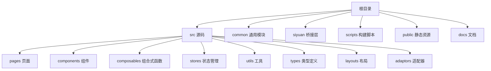
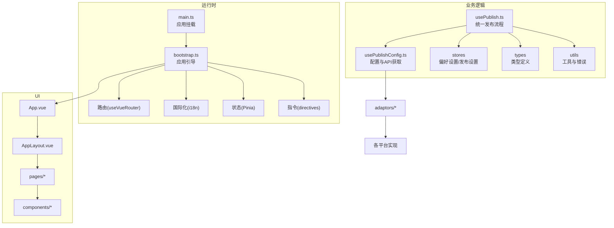
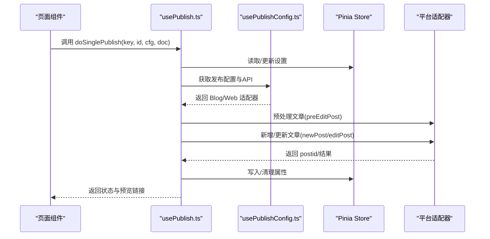
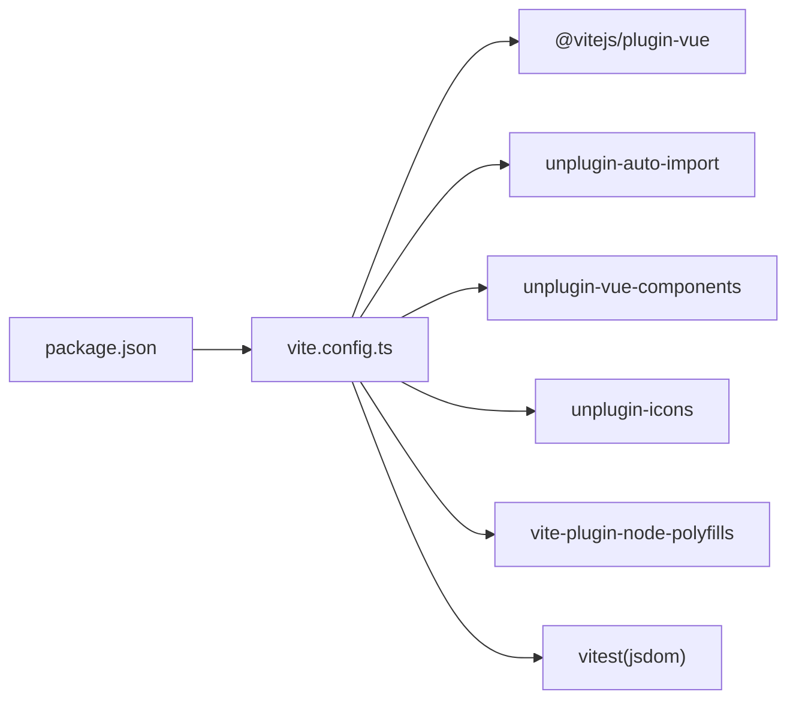

# 代码规范与最佳实践

<cite>
**本文档引用的文件**
- [.eslintrc.cjs](file://.eslintrc.cjs)
- [.prettierrc.cjs](file://.prettierrc.cjs)
- [package.json](file://package.json)
- [tsconfig.json](file://tsconfig.json)
- [vite.config.ts](file://vite.config.ts)
- [src/App.vue](file://src/App.vue)
- [src/main.ts](file://src/main.ts)
- [src/bootstrap.ts](file://src/bootstrap.ts)
- [src/types/IPublishCfg.ts](file://src/types/IPublishCfg.ts)
- [src/types/ICategoryConfig.ts](file://src/types/ICategoryConfig.ts)
- [src/composables/usePublish.ts](file://src/composables/usePublish.ts)
- [src/composables/usePublishConfig.ts](file://src/composables/usePublishConfig.ts)
- [src/stores/usePreferenceSettingStore.ts](file://src/stores/usePreferenceSettingStore.ts)
- [src/utils/BaseErrors.ts](file://src/utils/BaseErrors.ts)
- [src/layouts/AppLayout.vue](file://src/layouts/AppLayout.vue)
</cite>

## 目录
1. [简介](#简介)
2. [项目结构](#项目结构)
3. [核心组件](#核心组件)
4. [架构总览](#架构总览)
5. [详细组件分析](#详细组件分析)
6. [依赖关系分析](#依赖关系分析)
7. [性能考虑](#性能考虑)
8. [故障排查指南](#故障排查指南)
9. [结论](#结论)
10. [附录](#附录)

## 简介
本文件系统性梳理本项目的代码规范与最佳实践，覆盖以下方面：
- ESLint 规则配置与使用方式
- Prettier 格式化策略
- TypeScript 类型定义规范
- Vue 3 Composition API 使用规范与组件设计原则
- 状态管理最佳实践
- 文件组织结构、命名约定、注释标准、错误处理模式
- 代码审查清单与质量保证措施

## 项目结构
项目采用前端工程化与模块化组织方式，核心目录与职责概览如下：
- src：应用源码，包含页面、组件、组合式函数、状态管理、工具与类型定义
- common：通用工具与测试辅助
- siyuan：与 Siyuan 应用交互的桥接层
- scripts：构建与发布脚本
- public：公共资源与第三方库
- docs：项目文档

**章节来源**
- [vite.config.ts:1-275](file://vite.config.ts#L1-L275)

## 核心组件
本节聚焦于代码规范与最佳实践的关键要素。

- ESLint 配置
  - 扩展链：推荐规则集、TypeScript 插件、Vue 3 推荐规则、Turbo 规则、Prettier 集成
  - 自定义解析器：vue-eslint-parser + @typescript-eslint/parser
  - 关键规则：关闭基础规则冲突项，开启 Prettier 统一格式化
  - 参考路径：[.eslintrc.cjs:1-36](file://.eslintrc.cjs#L1-L36)

- Prettier 配置
  - 禁用分号、使用双引号、最大行长 120
  - 参考路径：[.prettierrc.cjs:29-33](file://.prettierrc.cjs#L29-L33)

- TypeScript 编译选项
  - 目标与模块：ES2020/ESNext；严格性关闭，禁用未使用检查
  - 路径映射：~/* -> ./*
  - 参考路径：[tsconfig.json:2-30](file://tsconfig.json#L2-L30)

- Vue 3 应用入口与挂载
  - 入口文件：创建应用实例、注册 i18n、Pinia、路由与指令
  - 参考路径：
    - [src/main.ts:10-21](file://src/main.ts#L10-L21)
    - [src/bootstrap.ts:25-50](file://src/bootstrap.ts#L25-L50)

- 组件与布局
  - App.vue：全局样式引入与路由视图容器
  - AppLayout.vue：动态布局切换与异步渲染
  - 参考路径：
    - [src/App.vue:10-22](file://src/App.vue#L10-L22)
    - [src/layouts/AppLayout.vue:18-23](file://src/layouts/AppLayout.vue#L18-L23)

**章节来源**
- [.eslintrc.cjs:1-36](file://.eslintrc.cjs#L1-L36)
- [.prettierrc.cjs:29-33](file://.prettierrc.cjs#L29-L33)
- [tsconfig.json:2-30](file://tsconfig.json#L2-L30)
- [src/main.ts:10-21](file://src/main.ts#L10-L21)
- [src/bootstrap.ts:25-50](file://src/bootstrap.ts#L25-L50)
- [src/App.vue:10-22](file://src/App.vue#L10-L22)
- [src/layouts/AppLayout.vue:18-23](file://src/layouts/AppLayout.vue#L18-L23)

## 架构总览
整体架构围绕“入口引导 -> 组合式函数 -> 状态管理 -> 适配器层 -> 平台实现”的分层设计展开。

**图表来源**
- [src/main.ts:10-21](file://src/main.ts#L10-L21)
- [src/bootstrap.ts:25-50](file://src/bootstrap.ts#L25-L50)
- [src/App.vue:10-22](file://src/App.vue#L10-L22)
- [src/layouts/AppLayout.vue:18-23](file://src/layouts/AppLayout.vue#L18-L23)
- [src/composables/usePublish.ts:44-557](file://src/composables/usePublish.ts#L44-L557)
- [src/composables/usePublishConfig.ts:26-95](file://src/composables/usePublishConfig.ts#L26-L95)
- [src/stores/usePreferenceSettingStore.ts:21-86](file://src/stores/usePreferenceSettingStore.ts#L21-L86)
- [src/types/IPublishCfg.ts:21-47](file://src/types/IPublishCfg.ts#L21-L47)

## 详细组件分析

### ESLint 规则与 Prettier 集成
- 规则扩展与解析器
  - 扩展：eslint:recommended、@typescript-eslint/recommended、plugin:vue/vue3-recommended、turbo、prettier
  - 解析器：vue-eslint-parser + @typescript-eslint/parser
  - 参考路径：[.eslintrc.cjs:2-14](file://.eslintrc.cjs#L2-L14)

- 自定义规则
  - 关闭基础冲突：分号、引号、未声明变量等
  - 放宽 TS 常见约束：空函数、空接口、any、非空断言等
  - 开启 Prettier 统一格式化为错误级别
  - 参考路径：[.eslintrc.cjs:19-34](file://.eslintrc.cjs#L19-L34)

- Prettier 配置要点
  - 禁用分号、单引号、最大行长 120
  - 参考路径：[.prettierrc.cjs:30-32](file://.prettierrc.cjs#L30-L32)

- 最佳实践建议
  - 在编辑器中启用 ESLint 与 Prettier 插件，确保保存即格式化
  - 通过 CI 强制执行 lint 与格式化检查
  - 对复杂规则（如 TS any）仅在必要时放宽，并添加注释说明原因

**章节来源**
- [.eslintrc.cjs:2-14](file://.eslintrc.cjs#L2-L14)
- [.eslintrc.cjs:19-34](file://.eslintrc.cjs#L19-L34)
- [.prettierrc.cjs:30-32](file://.prettierrc.cjs#L30-L32)

### TypeScript 类型定义规范
- 类型设计原则
  - 明确区分“配置型接口”与“运行时对象”，例如发布配置、分类配置
  - 使用只读与可选字段表达语义，减少副作用
  - 通过导出类型而非实现，降低耦合
  - 参考路径：
    - [src/types/IPublishCfg.ts:21-47](file://src/types/IPublishCfg.ts#L21-L47)
    - [src/types/ICategoryConfig.ts:18-79](file://src/types/ICategoryConfig.ts#L18-L79)

- 命名约定
  - 接口以大写 I 前缀，类型别名不带前缀
  - 枚举使用名词或动词短语，值使用全大写加下划线
  - 参考路径：[src/utils/BaseErrors.ts:13-18](file://src/utils/BaseErrors.ts#L13-L18)

- 复杂度与可维护性
  - 将类型拆分为小而专的接口，避免巨型接口
  - 对外暴露类型时提供文档注释，说明用途与约束

**章节来源**
- [src/types/IPublishCfg.ts:21-47](file://src/types/IPublishCfg.ts#L21-L47)
- [src/types/ICategoryConfig.ts:18-79](file://src/types/ICategoryConfig.ts#L18-L79)
- [src/utils/BaseErrors.ts:13-18](file://src/utils/BaseErrors.ts#L13-L18)

### Vue 3 Composition API 使用规范
- 组合式函数设计
  - 单一职责：每个 composable 聚焦一个领域能力，如发布、配置、设置
  - 明确返回值：统一返回可响应数据与方法，便于消费端解构使用
  - 示例：usePublish.ts 提供统一发布、删除、初始化等方法
  - 参考路径：[src/composables/usePublish.ts:44-557](file://src/composables/usePublish.ts#L44-L557)

- 组件设计原则
  - 无状态容器 + 有状态展示分离：布局与页面由布局组件承载，具体业务由页面组件实现
  - 动态布局：通过浅引用与异步组件实现布局切换
  - 参考路径：
    - [src/layouts/AppLayout.vue:18-23](file://src/layouts/AppLayout.vue#L18-L23)
    - [src/App.vue:10-22](file://src/App.vue#L10-L22)

- 状态管理最佳实践
  - Pinia 管理跨页面共享状态，如偏好设置、发布设置
  - 使用只读包装保护外部读取，避免意外修改
  - 参考路径：[src/stores/usePreferenceSettingStore.ts:21-86](file://src/stores/usePreferenceSettingStore.ts#L21-L86)

- 错误处理模式
  - 统一捕获异常，记录日志并推送用户消息
  - 对关键配置（如 posidKey）进行前置校验
  - 参考路径：[src/composables/usePublish.ts:195-203](file://src/composables/usePublish.ts#L195-L203)

**图表来源**
- [src/composables/usePublish.ts:70-212](file://src/composables/usePublish.ts#L70-L212)
- [src/composables/usePublishConfig.ts:73-78](file://src/composables/usePublishConfig.ts#L73-L78)
- [src/stores/usePreferenceSettingStore.ts:34-66](file://src/stores/usePreferenceSettingStore.ts#L34-L66)

**章节来源**
- [src/composables/usePublish.ts:44-557](file://src/composables/usePublish.ts#L44-L557)
- [src/composables/usePublishConfig.ts:26-95](file://src/composables/usePublishConfig.ts#L26-L95)
- [src/stores/usePreferenceSettingStore.ts:21-86](file://src/stores/usePreferenceSettingStore.ts#L21-L86)
- [src/layouts/AppLayout.vue:18-23](file://src/layouts/AppLayout.vue#L18-L23)
- [src/App.vue:10-22](file://src/App.vue#L10-L22)

### 文件组织结构与命名约定
- 目录与职责
  - src/pages：页面级组件，承载路由视图
  - src/components：可复用 UI 组件，按功能域细分
  - src/composables：组合式函数，封装业务逻辑
  - src/stores：状态管理模块
  - src/utils：工具函数与常量
  - src/types：全局类型定义
  - src/layouts：布局组件
  - src/adaptors：平台适配器与配置
- 命名约定
  - 组件文件：帕斯卡命名（如 AppLayout.vue）
  - 组合式函数：useXxx 前缀（如 usePublish.ts）
  - 状态存储：useXxxStore 命名（如 usePreferenceSettingStore.ts）
  - 类型：接口 IName，枚举 NameEnum
- 路径别名
  - ~/* 指向项目根目录，提升可读性与迁移性
  - 参考路径：[tsconfig.json:26-28](file://tsconfig.json#L26-L28)

**章节来源**
- [tsconfig.json:26-28](file://tsconfig.json#L26-L28)

### 注释标准与文档规范
- 文件头部版权注释：遵循 GPL v3 许可证声明
- 函数/接口注释：说明用途、参数、返回值与注意事项
- 复杂逻辑注释：解释关键分支与边界条件
- 参考路径：
  - [src/composables/usePublish.ts:10-36](file://src/composables/usePublish.ts#L10-L36)
  - [src/types/IPublishCfg.ts:14-47](file://src/types/IPublishCfg.ts#L14-L47)

**章节来源**
- [src/composables/usePublish.ts:10-36](file://src/composables/usePublish.ts#L10-L36)
- [src/types/IPublishCfg.ts:14-47](file://src/types/IPublishCfg.ts#L14-L47)

### 错误处理模式
- 统一捕获与上报
  - 捕获异常后记录日志并推送用户消息
  - 对关键配置进行前置校验，避免无效调用
- 错误类型
  - 基础错误枚举：集中管理常见错误场景
- 参考路径：
  - [src/composables/usePublish.ts:195-203](file://src/composables/usePublish.ts#L195-L203)
  - [src/utils/BaseErrors.ts:13-18](file://src/utils/BaseErrors.ts#L13-L18)

**章节来源**
- [src/composables/usePublish.ts:195-203](file://src/composables/usePublish.ts#L195-L203)
- [src/utils/BaseErrors.ts:13-18](file://src/utils/BaseErrors.ts#L13-L18)

## 依赖关系分析
- 构建与运行时
  - Vite 作为构建与开发服务器，集成 Vue、自动导入、组件解析、图标、polyfill 等插件
  - 参考路径：[vite.config.ts:81-181](file://vite.config.ts#L81-L181)

- 测试配置
  - Vitest + jsdom 环境，支持 setupFiles 与内联依赖
  - 参考路径：[vite.config.ts:258-273](file://vite.config.ts#L258-L273)

- 脚本与工作流
  - package.json 中定义了开发、构建、测试、打包等脚本
  - 参考路径：[package.json:9-27](file://package.json#L9-L27)

**图表来源**
- [vite.config.ts:81-181](file://vite.config.ts#L81-L181)
- [vite.config.ts:258-273](file://vite.config.ts#L258-L273)
- [package.json:9-27](file://package.json#L9-L27)

**章节来源**
- [vite.config.ts:81-181](file://vite.config.ts#L81-L181)
- [vite.config.ts:258-273](file://vite.config.ts#L258-L273)
- [package.json:9-27](file://package.json#L9-L27)

## 性能考虑
- 构建优化
  - 按需引入 Element Plus，避免全量引入
  - 生产环境启用压缩，开发环境关闭压缩便于调试
  - 参考路径：[src/bootstrap.ts:42-44](file://src/bootstrap.ts#L42-L44)，[vite.config.ts:209](file://vite.config.ts#L209)

- 代码分割与缓存
  - Rollup manualChunks 按依赖名称拆分 vendor 包，提升缓存命中率
  - 参考路径：[vite.config.ts:238-253](file://vite.config.ts#L238-L253)

- 运行时优化
  - 组合式函数内部使用 reactive 与深拷贝，避免共享引用导致的副作用
  - 参考路径：[src/composables/usePublish.ts:55-100](file://src/composables/usePublish.ts#L55-L100)

**章节来源**
- [src/bootstrap.ts:42-44](file://src/bootstrap.ts#L42-L44)
- [vite.config.ts:209](file://vite.config.ts#L209)
- [vite.config.ts:238-253](file://vite.config.ts#L238-L253)
- [src/composables/usePublish.ts:55-100](file://src/composables/usePublish.ts#L55-L100)

## 故障排查指南
- 常见问题定位
  - 发布失败：检查 posidKey 配置、平台适配器初始化、网络请求
  - 预览链接为空：确认平台返回 URL 是否绝对路径，必要时拼接 home
  - 配置未生效：确认 usePublishSettingStore 的读写流程
- 日志与消息
  - 使用应用日志记录关键步骤，结合用户消息提示
- 参考路径：
  - [src/composables/usePublish.ts:195-203](file://src/composables/usePublish.ts#L195-L203)
  - [src/composables/usePublish.ts:333-343](file://src/composables/usePublish.ts#L333-L343)

**章节来源**
- [src/composables/usePublish.ts:195-203](file://src/composables/usePublish.ts#L195-L203)
- [src/composables/usePublish.ts:333-343](file://src/composables/usePublish.ts#L333-L343)

## 结论
本项目在工程化、类型安全与可维护性方面具备良好基础。建议持续：
- 保持 ESLint 与 Prettier 的强约束，逐步收紧 TS 规则
- 丰富单元测试与集成测试，完善覆盖率
- 优化大型组合式函数的拆分，提升可测试性
- 完善错误分类与降级策略，提升用户体验

## 附录

### 代码审查清单
- 代码风格
  - 是否符合 ESLint 与 Prettier 规范
  - 是否存在未使用的变量/函数/类型
- 类型安全
  - 是否使用明确的类型注解
  - 是否滥用 any/unknown
- 组合式函数
  - 是否单一职责
  - 是否正确返回响应式数据与方法
- 组件设计
  - 是否遵循布局与页面分离
  - 是否合理使用动态布局与异步组件
- 状态管理
  - 是否使用 Pinia 管理跨页状态
  - 是否对外暴露只读引用
- 错误处理
  - 是否对关键配置进行前置校验
  - 是否统一捕获异常并提示用户
- 性能
  - 是否按需引入第三方库
  - 是否避免不必要的响应式包裹与深拷贝

### 质量保证措施
- 本地
  - 保存即格式化，提交前执行 lint 与类型检查
- CI
  - 自动执行 lint、类型检查、测试与覆盖率统计
- 版本与发布
  - 使用脚本统一构建与打包，确保一致性