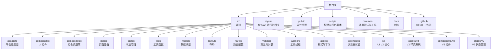
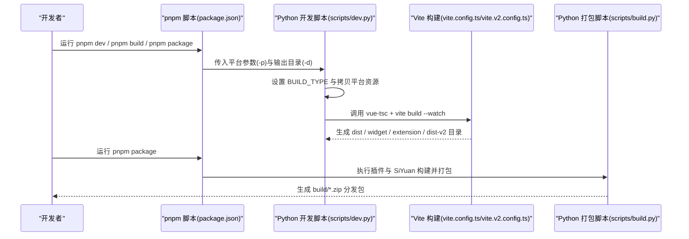
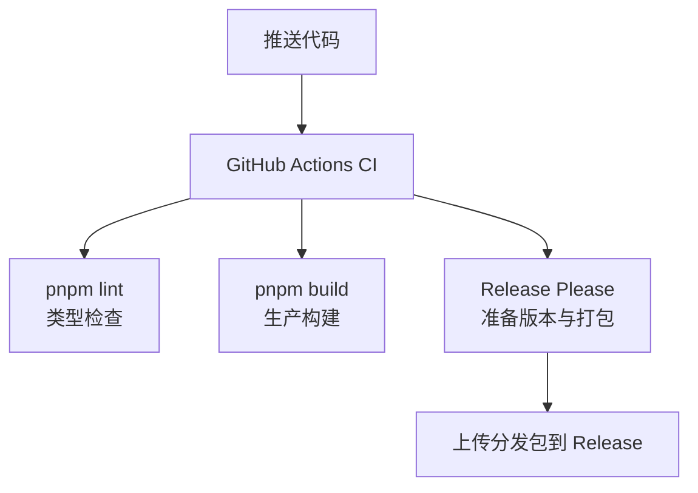
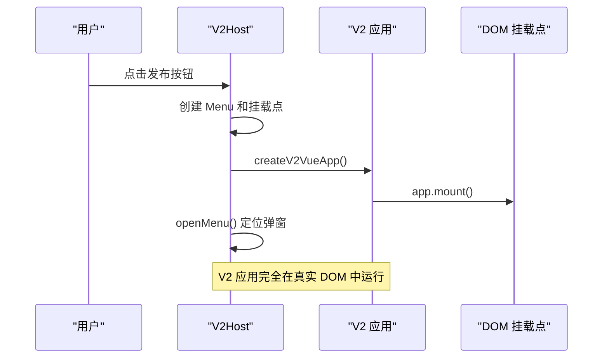
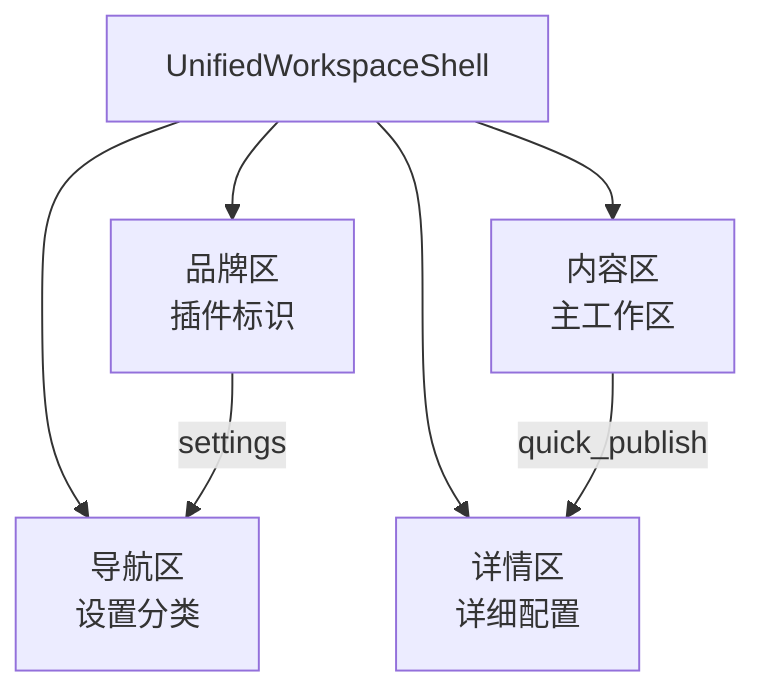
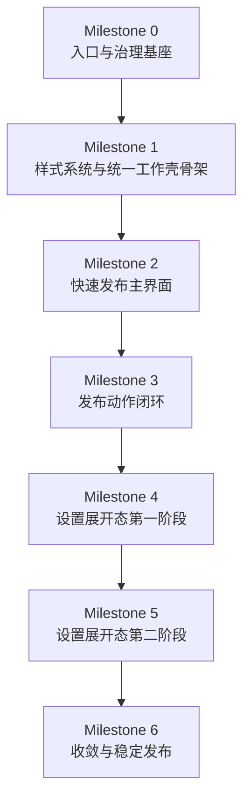
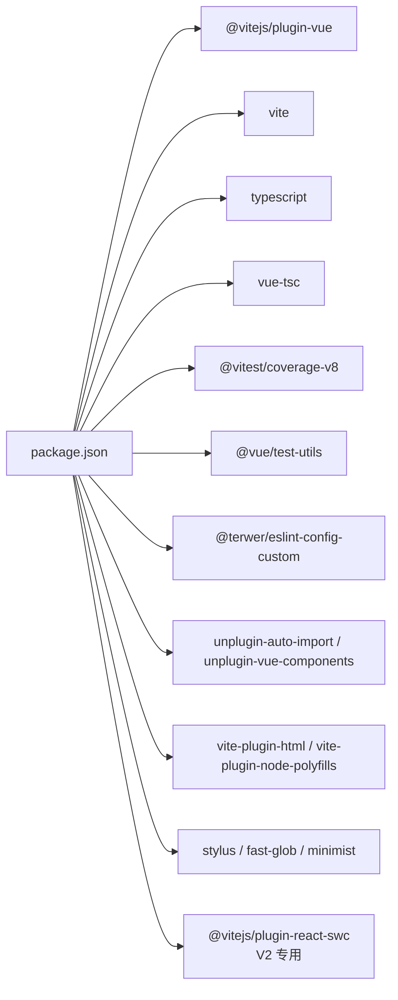

# 开发指南

<cite>
**本文引用的文件**
- [DEVELOPMENT.md](file://DEVELOPMENT.md)
- [README.md](file://README.md)
- [package.json](file://package.json)
- [vite.config.ts](file://vite.config.ts)
- [vite.v2.config.ts](file://vite.v2.config.ts)
- [tsconfig.json](file://tsconfig.json)
- [tsconfig.node.json](file://tsconfig.node.json)
- [.eslintrc.cjs](file://.eslintrc.cjs)
- [.prettierrc.cjs](file://.prettierrc.cjs)
- [.github/workflows/ci.yml](file://.github/workflows/ci.yml)
- [.github/workflows/release-please.yml](file://.github/workflows/release-please.yml)
- [.github/dependabot.yml](file://.github/dependabot.yml)
- [src/main.ts](file://src/main.ts)
- [src/bootstrap.ts](file://src/bootstrap.ts)
- [src/App.vue](file://src/App.vue)
- [src/setup.ts](file://src/setup.ts)
- [syp.config.ts](file://syp.config.ts)
- [scripts/dev.py](file://scripts/dev.py)
- [scripts/build.py](file://scripts/build.py)
- [scripts/ext_build.py](file://scripts/ext_build.py)
- [scripts/widget_build.py](file://scripts/widget_build.py)
- [scripts/vercel_build.py](file://scripts/vercel_build.py)
- [pnpm-workspace.yaml](file://pnpm-workspace.yaml)
- [src/v2/createV2App.ts](file://src/v2/createV2App.ts)
- [src/components/v2/V2App.vue](file://src/components/v2/V2App.vue)
- [src/components/v2/layout/UnifiedWorkspaceShell.vue](file://src/components/v2/layout/UnifiedWorkspaceShell.vue)
- [src/assets/v2/variables.styl](file://src/assets/v2/variables.styl)
- [src/assets/v2/base.styl](file://src/assets/v2/base.styl)
- [siyuan/v2/v2Host.ts](file://siyuan/v2/v2Host.ts)
- [openspec/changes/refactor-ui-v2-foundation/specs/ui-v2-migration/spec.md](file://openspec/changes/refactor-ui-v2-foundation/specs/ui-v2-migration/spec.md)
- [openspec/changes/refactor-ui-v2-foundation/tasks.md](file://openspec/changes/refactor-ui-v2-foundation/tasks.md)
- [openspec/changes/refactor-ui-v2-foundation/smoke-m0.md](file://openspec/changes/refactor-ui-v2-foundation/smoke-m0.md)
- [siyuan/store/preferenceConfigManager.ts](file://siyuan/store/preferenceConfigManager.ts)
- [src/stores/preferenceConfigManager.spec.ts](file://src/stores/preferenceConfigManager.spec.ts)
</cite>

## 目录
1. [简介](#简介)
2. [项目结构](#项目结构)
3. [核心组件](#核心组件)
4. [架构总览](#架构总览)
5. [详细组件分析](#详细组件分析)
6. [UI V2 开发流程](#ui-v2-开发流程)
7. [样式系统开发指南](#样式系统开发指南)
8. [迁移框架](#迁移框架)
9. [依赖分析](#依赖分析)
10. [性能考虑](#性能考虑)
11. [故障排查指南](#故障排查指南)
12. [结论](#结论)
13. [附录](#附录)

## 简介
本开发指南面向希望参与"SiYuan 插件发布器"项目开发与维护的工程师，涵盖开发环境搭建、工具链配置（Node.js、pnpm、Vite）、构建系统（Vite、TypeScript、ESLint、Prettier）、代码规范与最佳实践、调试技巧与工具、插件扩展开发方法以及测试与持续集成策略。**特别新增**：详细说明 UI V2 开发流程、样式系统开发指南、迁移框架等新开发内容，帮助开发者理解和参与全新的用户界面重构项目。

## 项目结构
该项目采用前端单页应用（SPA）架构，结合 Vue 3 + TypeScript + Vite 的现代开发栈；通过多平台适配器（adaptors）实现对多种内容平台的统一发布能力；并通过 Python 脚本完成不同产物（SiYuan 插件、挂件、Chrome/Firefox 扩展、静态站点）的构建与打包。**新增 UI V2 结构**：包含独立的 V2 应用入口、样式系统和迁移框架。

**图表来源**
- [DEVELOPMENT.md:43-82](file://DEVELOPMENT.md#L43-L82)
- [package.json:9-28](file://package.json#L9-L28)

**章节来源**
- [DEVELOPMENT.md:43-82](file://DEVELOPMENT.md#L43-L82)
- [package.json:9-28](file://package.json#L9-L28)

## 核心组件
- 应用入口与引导
  - 应用入口：[src/main.ts](file://src/main.ts)
  - 引导装配：[src/bootstrap.ts](file://src/bootstrap.ts)
  - 根组件：[src/App.vue](file://src/App.vue)
- 构建与运行
  - Vite 配置：[vite.config.ts](file://vite.config.ts)
  - **新增 V2 构建配置**：[vite.v2.config.ts](file://vite.v2.config.ts)
  - TypeScript 配置：[tsconfig.json](file://tsconfig.json)、[tsconfig.node.json](file://tsconfig.node.json)
  - 包管理与脚本：[package.json](file://package.json)
- 规范与质量
  - ESLint：[.eslintrc.cjs](file://.eslintrc.cjs)
  - Prettier：[.prettierrc.cjs](file://.prettierrc.cjs)
- 测试
  - Vitest 配置与钩子：[vite.config.ts:258-273](file://vite.config.ts#L258-L273)、[src/setup.ts](file://src/setup.ts)
- 配置与动态参数
  - 动态配置模型：[syp.config.ts](file://syp.config.ts)

**章节来源**
- [src/main.ts:10-21](file://src/main.ts#L10-L21)
- [src/bootstrap.ts:25-49](file://src/bootstrap.ts#L25-L49)
- [src/App.vue:10-22](file://src/App.vue#L10-L22)
- [vite.config.ts:81-274](file://vite.config.ts#L81-L274)
- [vite.v2.config.ts:59-137](file://vite.v2.config.ts#L59-L137)
- [tsconfig.json:1-34](file://tsconfig.json#L1-L34)
- [tsconfig.node.json:1-11](file://tsconfig.node.json#L1-L11)
- [.eslintrc.cjs:1-36](file://.eslintrc.cjs#L1-L36)
- [.prettierrc.cjs:29-33](file://.prettierrc.cjs#L29-L33)
- [src/setup.ts:10-18](file://src/setup.ts#L10-L18)
- [syp.config.ts:26-49](file://syp.config.ts#L26-L49)

## 架构总览
下图展示从开发到构建产物的关键流程：开发者通过 pnpm 脚本触发 Vite 构建，根据 BUILD_TYPE 切换不同目标（SiYuan 插件、挂件、扩展、静态站点、**V2 应用**），Python 脚本负责平台特定的资源准备与目录组织，最终产出可分发的 zip 包或扩展目录。

**图表来源**
- [package.json:9-28](file://package.json#L9-L28)
- [scripts/dev.py:45-106](file://scripts/dev.py#L45-L106)
- [scripts/build.py:38-56](file://scripts/build.py#L38-L56)
- [vite.config.ts:66-76](file://vite.config.ts#L66-L76)
- [vite.v2.config.ts:14-16](file://vite.v2.config.ts#L14-L16)

**章节来源**
- [package.json:9-28](file://package.json#L9-L28)
- [scripts/dev.py:45-106](file://scripts/dev.py#L45-L106)
- [scripts/build.py:38-56](file://scripts/build.py#L38-L56)
- [vite.config.ts:66-76](file://vite.config.ts#L66-L76)
- [vite.v2.config.ts:14-16](file://vite.v2.config.ts#L14-L16)

## 详细组件分析

### 开发环境搭建
- 权限与工具准备
  - 在 macOS 上建议调整 /usr/local 目录权限，确保全局工具写入权限。
  - 安装 Node.js 与 pnpm：使用 n 切换 Node 版本，启用并固定 pnpm 版本。
  - 初始化依赖：执行 pnpm install。
- 启动开发服务
  - 通用开发：pnpm serve 或 pnpm dev（支持 -p siyuan/widget/chrome/firefox/nginx）。
  - **新增 V2 开发**：pnpm dev -p v2 启动 V2 应用开发服务器。
  - 链接本地开发：根据平台运行 pnpm makeLink 以在 SiYuan 中加载本地构建。
- 构建与打包
  - 构建：pnpm build。
  - **新增 V2 构建**：pnpm build-v2 产出 V2 应用。
  - 打包：pnpm package 产出多平台分发包。
  - 同步挂件仓库：pnpm syncWidgetRepo。

**章节来源**
- [DEVELOPMENT.md:3-17](file://DEVELOPMENT.md#L3-L17)
- [DEVELOPMENT.md:19-41](file://DEVELOPMENT.md#L19-L41)
- [DEVELOPMENT.md:45-82](file://DEVELOPMENT.md#L45-L82)
- [DEVELOPMENT.md:84-115](file://DEVELOPMENT.md#L84-L115)

### 构建系统与工具链
- Vite 配置要点
  - 插件生态：Vue、自动导入 Element Plus、自动注册组件、HTML 注入、Node polyfills、图标自动安装。
  - 环境变量注入：通过 defineEnv 将 process.env.* 注入到客户端代码。
  - 资源缓存控制：在开发模式下为 JS/CSS/图片等资源追加时间戳查询参数。
  - 按需分包：基于 node_modules 依赖名进行 vendor_* 分包，提升缓存命中率。
  - 测试环境：jsdom 环境、setupFiles、包含 common 与 src 下测试文件。
- **新增 V2 构建配置**
  - 独立构建入口：使用 dist-v2 作为输出目录，避免与主应用冲突。
  - 静态资源复制：自动复制插件元数据文件（plugin.json、README、i18n 等）。
  - 外部化依赖：将 siyuan 标记为外部依赖，确保在思源环境中正确加载。
  - 监听模式：开发时自动监听静态资源变化并热重载。
- TypeScript 配置
  - 目标与模块解析：ES2020 + bundler 解析，允许 TS 扩展名与 JSON 模块。
  - 路径别名：~/* 指向根目录。
  - 参考 tsconfig.node.json，避免 Node 环境类型泄漏到浏览器端。
- ESLint 与 Prettier
  - ESLint：继承推荐规则集，使用 vue-eslint-parser 与 @typescript-eslint/parser，关闭部分严格规则以适配团队风格，开启 prettier 插件强制格式化一致性。
  - Prettier：半角分号、双引号、打印宽度 120。

**章节来源**
- [vite.config.ts:81-274](file://vite.config.ts#L81-L274)
- [vite.v2.config.ts:59-137](file://vite.v2.config.ts#L59-L137)
- [tsconfig.json:1-34](file://tsconfig.json#L1-L34)
- [tsconfig.node.json:1-11](file://tsconfig.node.json#L1-L11)
- [.eslintrc.cjs:1-36](file://.eslintrc.cjs#L1-L36)
- [.prettierrc.cjs:29-33](file://.prettierrc.cjs#L29-L33)

### 代码规范与最佳实践
- 命名约定
  - 组件与页面：采用 PascalCase（如 App.vue、BatchPublish.vue、V2App.vue）。
  - 组合式逻辑：useXxx 前缀（如 usePublish.ts、useVueRouter.ts）。
  - 类型与接口：大写开头（如 ISypConfig）。
  - **新增 V2 命名**：V2App、UnifiedWorkspaceShell 等采用清晰的功能命名。
- 文件组织
  - 按功能域划分：adaptors、components、composables、pages、stores、utils、models、routes、layouts、assets、vendors、workers、extensions、**v2**。
  - **新增 V2 目录结构**：src/v2（应用入口）、src/components/v2（V2 组件）、src/assets/v2（样式系统）。
  - 统一入口：src/main.ts -> src/bootstrap.ts -> src/App.vue。
- 注释与文档
  - 源码头部版权注释模板保持一致。
  - README 与 docs 提供用户与开发者文档，便于新成员快速上手。
- 规范落地
  - 通过 ESLint 与 Prettier 自动化检查与格式化，CI 中强制执行。

**章节来源**
- [src/App.vue:10-22](file://src/App.vue#L10-L22)
- [syp.config.ts:28-49](file://syp.config.ts#L28-L49)
- [README.md:1-102](file://README.md#L1-L102)

### 调试技巧与工具使用
- 浏览器调试
  - 开发模式下 Vite 会注入必要的脚本与 polyfills，便于在浏览器中直接调试。
  - 使用时间戳查询参数避免缓存导致的资源不更新问题。
- Vue DevTools
  - 在开发环境中可配合 Vue DevTools 检查组件树、状态与路由。
  - **新增 V2 调试**：支持实时查看 V2 应用的状态和组件层次。
- 网络监控
  - 结合浏览器 Network 面板观察 API 请求、资源加载与跨域情况。
- 日志与定位
  - 应用内日志记录器与测试钩子（beforeEach/afterEach）有助于定位问题。

**章节来源**
- [vite.config.ts:151-180](file://vite.config.ts#L151-L180)
- [src/setup.ts:12-18](file://src/setup.ts#L12-L18)

### 插件扩展开发指南
- 自定义适配器开发
  - 平台适配器位于 src/adaptors/api/* 与 src/adaptors/web/*，遵循统一的配置、占位符与 API 调用模式。
  - 新增平台时，参考现有适配器（如 cnblogs、wordpress、yuque 等）的结构与命名。
- 组件扩展
  - 在 src/components 下新增业务组件，优先使用组合式 API（composables）复用逻辑。
  - 页面级组件放置于 src/pages，路由在 src/routes 下集中管理。
- API 集成
  - 通过 useXxx 组合式逻辑封装 API 调用，统一错误处理与状态管理。
  - 配置项集中于动态配置模型（syp.config.ts），便于运行时切换与持久化。

**章节来源**
- [syp.config.ts:26-49](file://syp.config.ts#L26-L49)

### 测试策略与持续集成
- 单元测试与快照
  - 使用 Vitest + jsdom，测试范围覆盖 src 与 common 目录。
  - 通过 setupFiles 注入测试前/后钩子，统一日志输出。
- 代码质量
  - CI 中执行 pnpm lint（TypeScript 类型检查）与 pnpm build（生产构建）。
- 自动化发布
  - Dependabot 自动提交依赖更新 PR。
  - Release Please 自动化版本与发布包上传。

**图表来源**
- [.github/workflows/ci.yml:1-47](file://.github/workflows/ci.yml#L1-L47)
- [.github/workflows/release-please.yml:47-91](file://.github/workflows/release-please.yml#L47-L91)
- [.github/dependabot.yml:1-39](file://.github/dependabot.yml#L1-L39)

**章节来源**
- [vite.config.ts:258-273](file://vite.config.ts#L258-L273)
- [src/setup.ts:12-18](file://src/setup.ts#L12-L18)
- [.github/workflows/ci.yml:1-47](file://.github/workflows/ci.yml#L1-L47)
- [.github/workflows/release-please.yml:47-91](file://.github/workflows/release-please.yml#L47-L91)
- [.github/dependabot.yml:1-39](file://.github/dependabot.yml#L1-L39)

## UI V2 开发流程

### V2 应用入口与宿主
- **应用创建器**：createV2App 提供标准化的 V2 应用创建流程，支持国际化配置和初始视图设置。
- **运行时宿主**：V2Host 基于思源原生 Menu 实现真实的 DOM 挂载，替代传统的 iframe 方案。
- **生命周期管理**：完整的应用启动、挂载、卸载和关闭流程，包含错误处理和回退机制。

**图表来源**
- [siyuan/v2/v2Host.ts:26-59](file://siyuan/v2/v2Host.ts#L26-L59)
- [src/v2/createV2App.ts:15-36](file://src/v2/createV2App.ts#L15-L36)

### 统一工作壳架构
- **品牌区**：显示插件标识和版本信息。
- **导航区**：设置模式下的分类导航（账号设置、图床设置、偏好设置）。
- **内容区**：主工作区，展示当前文档上下文和发布目标。
- **详情区**：设置模式下的详细配置区域。

**图表来源**
- [src/components/v2/layout/UnifiedWorkspaceShell.vue:1-52](file://src/components/v2/layout/UnifiedWorkspaceShell.vue#L1-L52)

### V2 应用组件结构
- **V2App 根组件**：提供统一的界面容器和状态管理。
- **工作壳组件**：实现响应式布局和视图切换。
- **样式系统**：基于设计令牌的完整样式解决方案。

**章节来源**
- [src/v2/createV2App.ts:1-37](file://src/v2/createV2App.ts#L1-L37)
- [siyuan/v2/v2Host.ts:1-97](file://siyuan/v2/v2Host.ts#L1-L97)
- [src/components/v2/V2App.vue:1-171](file://src/components/v2/V2App.vue#L1-L171)
- [src/components/v2/layout/UnifiedWorkspaceShell.vue:1-52](file://src/components/v2/layout/UnifiedWorkspaceShell.vue#L1-L52)

## 样式系统开发指南

### 设计令牌系统
V2 采用完整的设计令牌系统，确保视觉一致性和可维护性：

- **主色调系统**：主色、浅色、深色变体，支持语义化使用
- **中性色系统**：背景、次级背景、三级背景，满足不同层级需求
- **文字颜色系统**：主要、次要、三级文字，确保对比度和可读性
- **边框与阴影系统**：统一的边框和阴影规范
- **间距系统**：基于 8px 的网格系统，支持灵活布局
- **圆角系统**：从 4px 到 16px 的渐进式圆角
- **字体系统**：跨平台字体栈和字号规范

### 样式命名规范
- **命名空间**：所有样式统一使用 `.syp-v2` 前缀，避免与旧 UI 冲突
- **组件级样式**：使用 `.syp-component-name` 命名模式
- **状态样式**：使用 `.is-state` 或 `.has-feature` 形式
- **工具类**：提供常用的布局和间距工具类

### 样式组织结构
- **基础样式**：全局基础样式和重置
- **组件样式**：各组件的专用样式文件
- **工具样式**：通用的样式工具和辅助类
- **响应式设计**：移动端优先的响应式布局

**章节来源**
- [src/assets/v2/variables.styl:1-57](file://src/assets/v2/variables.styl#L1-L57)
- [src/assets/v2/base.styl:1-66](file://src/assets/v2/base.styl#L1-L66)

## 迁移框架

### 迁移策略与里程碑
UI V2 迁移采用严格的里程碑管理模式，确保渐进式演进和质量保证：

**图表来源**
- [openspec/changes/refactor-ui-v2-foundation/tasks.md:18-73](file://openspec/changes/refactor-ui-v2-foundation/tasks.md#L18-L73)

### 核心迁移原则
- **全生命周期管理**：将 UI V2 视为完整的生命周期项目，而非孤立的基础任务
- **DOM 原生渲染**：彻底告别 iframe 基础的 SPA 承载，采用真实 DOM 挂载
- **里程碑式交付**：严格的里程碑准入和验收机制
- **配置单一真相源**：统一的偏好配置读取通道
- **工作壳统一**：单一的统一工作壳支持两种工作模式

### M0 烟雾测试清单
- **顶栏入口**：验证 V2 开关对顶栏行为的影响
- **配置来源**：验证偏好设置的持久化和读取
- **回退链路**：验证初始化失败时的回退机制
- **回归检查**：确保旧功能不受影响

**章节来源**
- [openspec/changes/refactor-ui-v2-foundation/specs/ui-v2-migration/spec.md:1-191](file://openspec/changes/refactor-ui-v2-foundation/specs/ui-v2-migration/spec.md#L1-L191)
- [openspec/changes/refactor-ui-v2-foundation/smoke-m0.md:1-26](file://openspec/changes/refactor-ui-v2-foundation/smoke-m0.md#L1-L26)
- [openspec/changes/refactor-ui-v2-foundation/tasks.md:1-73](file://openspec/changes/refactor-ui-v2-foundation/tasks.md#L1-L73)

## 依赖分析
- 包管理器与工作区
  - 使用 pnpm，固定版本 10.22.0；仅构建依赖白名单（esbuild、vue-demi 等）。
- 关键依赖
  - 前端框架：Vue 3、Vue Router、Pinia。
  - UI：Element Plus（按需引入）。
  - 工具：VueUse、Katex、CryptoJS、UUID、XMLRPC、fetch 等。
  - 构建：Vite、Vue 插件生态、esbuild、rollup 插件。
  - **新增 V2 依赖**：Vue 3.4+、Pinia、Vue I18n，支持 Composition API 和现代化特性。
- 开发依赖
  - TypeScript、Vue TSC、ESLint、Prettier、Vitest、jsdom 等。

**图表来源**
- [package.json:29-96](file://package.json#L29-L96)

**章节来源**
- [package.json:29-96](file://package.json#L29-L96)
- [pnpm-workspace.yaml:1-5](file://pnpm-workspace.yaml#L1-L5)

## 性能考虑
- 构建优化
  - 生产构建关闭压缩开关以提升调试体验；开发模式下启用压缩与最小化。
  - 按依赖名称拆分 vendor 包，减少缓存失效影响面。
  - **新增 V2 优化**：独立构建入口，避免与主应用共享构建缓存。
- 资源加载
  - 开发模式下为所有静态资源追加时间戳参数，避免浏览器缓存导致的更新延迟。
  - **新增 V2 资源**：样式文件独立打包，支持按需加载。
- 体积控制
  - Element Plus 按需引入，避免整包引入带来的体积膨胀。
  - 第三方库尽量使用轻量替代或按需加载。
  - **新增 V2 体积控制**：样式系统采用设计令牌，减少重复定义。

**章节来源**
- [vite.config.ts:197-255](file://vite.config.ts#L197-L255)
- [vite.config.ts:151-180](file://vite.config.ts#L151-L180)
- [vite.v2.config.ts:88-135](file://vite.v2.config.ts#L88-L135)

## 故障排查指南
- Node.js 与 pnpm 版本不匹配
  - 使用 n 切换 Node 版本，corepack 启用并固定 pnpm 版本，重新安装依赖。
- 权限问题
  - macOS 上若遇到 /usr/local 写入失败，请调整对应目录属主。
- 构建失败
  - 先执行 pnpm lint 确认类型检查通过；再执行 pnpm build 查看具体报错。
  - **新增 V2 构建**：检查 dist-v2 目录权限和静态资源复制是否成功。
- 测试异常
  - 检查 jsdom 环境与 setupFiles 是否正确加载；确认测试文件路径与命名符合 include 规则。
- CI 缓存问题
  - 清理 pnpm store 缓存或删除 .pnpm-store 相关缓存目录后重试。
- **新增 V2 故障排查**
  - V2 应用无法挂载：检查 V2Host 的 DOM 挂载点是否存在。
  - 样式冲突：确认 .syp-v2 命名空间是否正确应用。
  - 回退机制：验证 useV2UI 配置和回退逻辑。

**章节来源**
- [DEVELOPMENT.md:3-17](file://DEVELOPMENT.md#L3-L17)
- [DEVELOPMENT.md:19-41](file://DEVELOPMENT.md#L19-L41)
- [vite.config.ts:258-273](file://vite.config.ts#L258-L273)
- [siyuan/v2/v2Host.ts:26-76](file://siyuan/v2/v2Host.ts#L26-L76)

## 结论
本指南提供了从环境搭建到构建发布、从代码规范到调试与测试的完整开发流程。**新增的 UI V2 开发指南**涵盖了全新的用户界面重构项目，包括 V2 应用入口、统一工作壳架构、完整的样式系统和严格的迁移框架。通过 Vite + TypeScript + ESLint + Prettier 的现代化工具链，结合平台适配器与组合式逻辑，项目具备良好的可维护性与扩展性。建议在日常开发中严格遵循规范、充分利用 CI/CD 与自动化工具，持续提升交付质量与效率。

## 附录
- 快速命令清单
  - 开发：pnpm dev -p siyuan / widget / chrome / firefox / nginx / v2
  - 链接：pnpm makeLink -p siyuan / widget
  - 构建：pnpm build / pnpm build-v2
  - 打包：pnpm package
  - 测试：pnpm test / pnpm coverage
  - 规范：pnpm lint
- **新增 V2 开发命令**
  - V2 开发：pnpm dev -p v2
  - V2 构建：pnpm build-v2
  - V2 打包：pnpm package-v2
- 参考文档
  - README 与 docs 目录下的使用与技术文档，便于快速查阅与贡献者入门。
  - **新增 V2 文档**：UI V2 开发规范、样式系统指南、迁移框架文档。

**章节来源**
- [DEVELOPMENT.md:45-115](file://DEVELOPMENT.md#L45-L115)
- [README.md:1-102](file://README.md#L1-L102)
- [openspec/changes/refactor-ui-v2-foundation/tasks.md:1-73](file://openspec/changes/refactor-ui-v2-foundation/tasks.md#L1-L73)