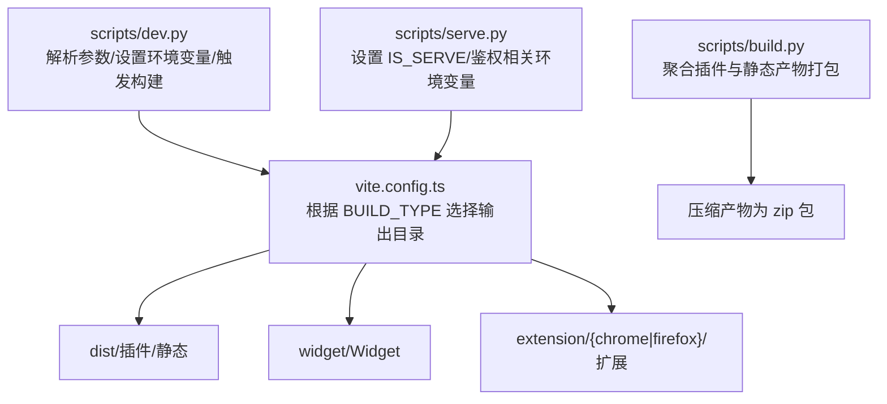
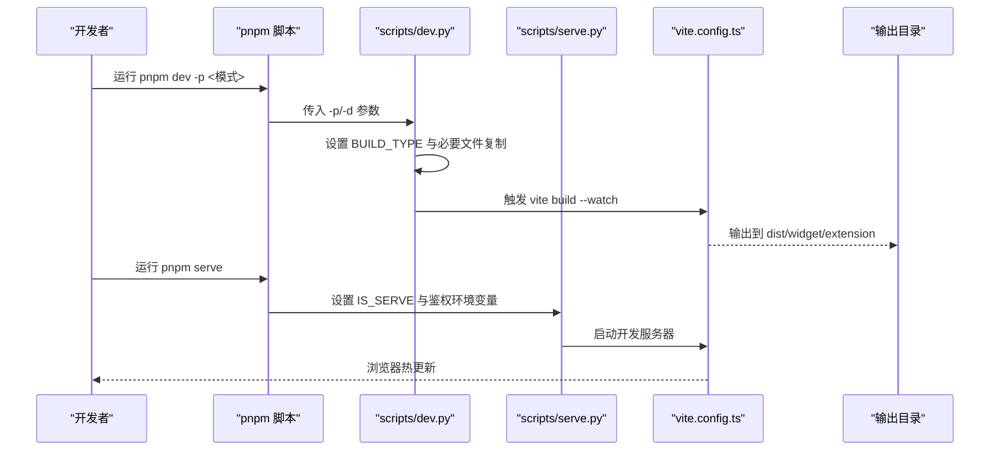
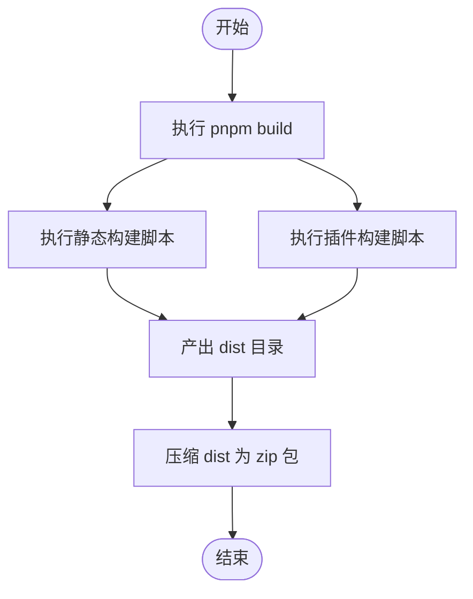
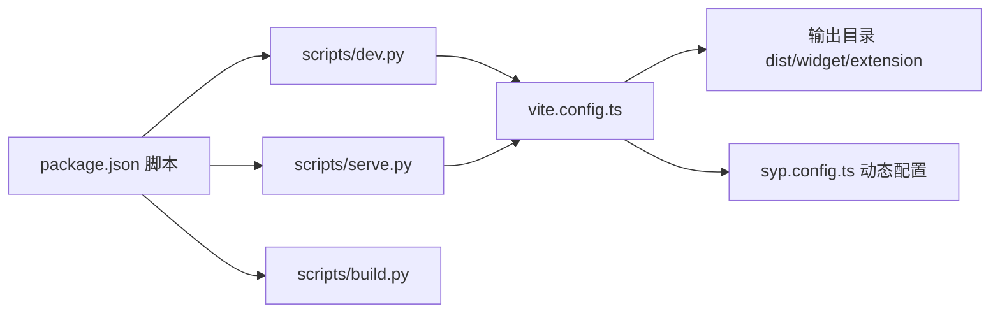

# 开发环境搭建

<cite>
**本文引用的文件**
- [package.json](file://package.json)
- [DEVELOPMENT.md](file://DEVELOPMENT.md)
- [README.md](file://README.md)
- [scripts/dev.py](file://scripts/dev.py)
- [scripts/serve.py](file://scripts/serve.py)
- [scripts/build.py](file://scripts/build.py)
- [scripts/scriptutils.py](file://scripts/scriptutils.py)
- [vite.config.ts](file://vite.config.ts)
- [tsconfig.json](file://tsconfig.json)
- [tsconfig.node.json](file://tsconfig.node.json)
- [.eslintrc.cjs](file://.eslintrc.cjs)
- [.prettierrc.cjs](file://.prettierrc.cjs)
- [src/utils/EnvUtil.ts](file://src/utils/EnvUtil.ts)
- [syp.config.ts](file://syp.config.ts)
- [cookie.txt](file://cookie.txt)
</cite>

## 目录
1. [简介](#简介)
2. [项目结构](#项目结构)
3. [核心组件](#核心组件)
4. [架构总览](#架构总览)
5. [详细组件分析](#详细组件分析)
6. [依赖分析](#依赖分析)
7. [性能考虑](#性能考虑)
8. [故障排查指南](#故障排查指南)
9. [结论](#结论)
10. [附录](#附录)

## 简介
本文件面向开发者，提供该仓库的开发环境搭建与运行指南，覆盖系统前置条件、Node.js 与 pnpm 版本要求、权限配置、开发服务器启动方式（本地开发、插件模式、Widget 模式、Chrome 扩展、Firefox 扩展、Nginx 部署）、环境变量配置、依赖安装步骤、开发工具链设置以及常见问题排查。

## 项目结构
该项目采用前端单页应用（Vue 3 + Vite）与多运行模式构建策略：
- 运行模式通过环境变量与命令行参数控制，分别输出到不同目标目录：
  - 思源插件模式：输出至 dist
  - Widget 模式：输出至 widget
  - 扩展模式：输出至 extension/{chrome|firefox}
  - Nginx 静态站点：输出至 dist（根路径）
- 构建脚本统一由 Python 脚本协调，配合 Vite 与 TypeScript 编译器进行增量构建与热更新。

图表来源
- [scripts/dev.py:1-107](file://scripts/dev.py#L1-L107)
- [scripts/serve.py:1-54](file://scripts/serve.py#L1-L54)
- [scripts/build.py:1-57](file://scripts/build.py#L1-L57)
- [vite.config.ts:66-71](file://vite.config.ts#L66-L71)

章节来源
- [package.json:9-28](file://package.json#L9-L28)
- [DEVELOPMENT.md:43-82](file://DEVELOPMENT.md#L43-L82)
- [vite.config.ts:66-71](file://vite.config.ts#L66-L71)

## 核心组件
- 包管理与脚本入口
  - package.json 定义了开发、构建、打包与发布相关的脚本命令，统一通过 pnpm 调用 Python 脚本或直接调用 Vite/TypeScript 工具链。
- 开发服务器与模式切换
  - scripts/serve.py 用于本地开发时注入 IS_SERVE、鉴权与页面 ID 等环境变量，并启动 Vite 开发服务器。
  - scripts/dev.py 通过 -p 参数选择运行模式（siyuan/widget/chrome/firefox/nginx），并设置 BUILD_TYPE；随后触发 Vite watch 构建。
- 构建与打包
  - scripts/build.py 调用插件与静态构建脚本，并将 dist 目录打包为 zip 产物。
- 配置与类型
  - vite.config.ts 提供基于 BUILD_TYPE 的输出目录与基础路径计算、HTML 注入、Rollup 插件与测试配置。
  - tsconfig.json 与 tsconfig.node.json 定义编译目标、模块解析策略与路径别名。
  - syp.config.ts 定义动态配置键位，供运行时读取平台配置。
- 工具与规范
  - .eslintrc.cjs 与 .prettierrc.cjs 统一代码风格与规则。
  - src/utils/EnvUtil.ts 提供在思源环境中进行文件系统操作的工具方法（仅在插件运行时有效）。

章节来源
- [package.json:9-28](file://package.json#L9-L28)
- [scripts/serve.py:38-51](file://scripts/serve.py#L38-L51)
- [scripts/dev.py:45-51](file://scripts/dev.py#L45-L51)
- [scripts/build.py:38-56](file://scripts/build.py#L38-L56)
- [vite.config.ts:15-25](file://vite.config.ts#L15-L25)
- [tsconfig.json:1-34](file://tsconfig.json#L1-L34)
- [tsconfig.node.json:1-11](file://tsconfig.node.json#L1-L11)
- [syp.config.ts:26-49](file://syp.config.ts#L26-L49)
- [.eslintrc.cjs:1-36](file://.eslintrc.cjs#L1-L36)
- [.prettierrc.cjs:29-33](file://.prettierrc.cjs#L29-L33)
- [src/utils/EnvUtil.ts:21-223](file://src/utils/EnvUtil.ts#L21-L223)

## 架构总览
下图展示从命令行到最终产物的关键流程，涵盖本地开发、扩展与静态站点三种主要运行模式。

图表来源
- [scripts/dev.py:36-106](file://scripts/dev.py#L36-L106)
- [scripts/serve.py:38-53](file://scripts/serve.py#L38-L53)
- [vite.config.ts:66-71](file://vite.config.ts#L66-L71)

## 详细组件分析

### 系统前置条件与权限配置
- Node.js 与 pnpm
  - 使用 n 安装并固定 Node.js 版本，启用 Corepack 并使用指定版本的 pnpm。
  - 推荐在升级 pnpm 后重新安装依赖，确保工具链一致。
- 权限
  - 若系统目录权限不足导致 pnpm 或全局工具安装失败，需调整 /usr/local 下相关目录的用户归属。
- 思源插件开发链接
  - 通过 makeLink 脚本在不同模式下创建开发链接，便于本地调试。

章节来源
- [DEVELOPMENT.md:19-41](file://DEVELOPMENT.md#L19-L41)

### 依赖安装与开发工具链
- 依赖安装
  - 使用 pnpm install 安装项目依赖，确保 pnpm 版本与 packageManager 字段一致。
- 类型检查与测试
  - 使用 vue-tsc 进行类型检查；测试框架为 Vitest，测试环境为 jsdom。
- 代码规范
  - ESLint 与 Prettier 配置已提供，建议在编辑器中启用保存时格式化与 ESLint 检查。

章节来源
- [package.json:29-96](file://package.json#L29-L96)
- [.eslintrc.cjs:1-36](file://.eslintrc.cjs#L1-L36)
- [.prettierrc.cjs:29-33](file://.prettierrc.cjs#L29-L33)
- [vite.config.ts:258-273](file://vite.config.ts#L258-L273)

### 开发服务器启动方式
- 本地开发（Vite 开发服务器）
  - 设置 IS_SERVE=true，并注入 VITE_SIYUAN_API_URL、VITE_SIYUAN_AUTH_TOKEN、VITE_SIYUAN_COOKIE、VITE_SIYUAN_DEV_PAGE_ID 等环境变量。
  - 启动后浏览器自动打开，支持热更新与源码注入。
- 插件模式（SiYuan 插件）
  - pnpm dev -p siyuan，默认输出到 dist；随后可通过 makeLink 在目标设备上建立开发链接。
- Widget 模式
  - pnpm dev -p widget，默认输出到 widget；同时复制必要的资源文件。
- Chrome 扩展
  - pnpm dev -p chrome，默认输出到 extension/chrome；构建时会清理 Firefox 配置并设置 API 地址。
- Firefox 扩展
  - pnpm dev -p firefox，默认输出到 extension/firefox；构建时会替换 manifest 与后台脚本以适配 Firefox。
- Nginx 部署
  - pnpm dev -p nginx 输出到 dist；可在 nginx 子目录使用 serve 启动静态服务（如需）。

章节来源
- [scripts/serve.py:38-51](file://scripts/serve.py#L38-L51)
- [scripts/dev.py:53-95](file://scripts/dev.py#L53-L95)
- [DEVELOPMENT.md:45-82](file://DEVELOPMENT.md#L45-L82)

### 环境变量配置
- 通用开发变量
  - IS_SERVE：启用本地开发服务器模式
  - VITE_DEFAULT_TYPE：默认发布类型（开发期默认 siyuan）
  - VITE_SIYUAN_API_URL：思源内核 API 地址
  - VITE_SIYUAN_AUTH_TOKEN：认证令牌
  - VITE_SIYUAN_COOKIE：Cookie
  - VITE_SIYUAN_DEV_PAGE_ID：开发页面 ID
  - VITE_CJS_IGNORE_WARNING：忽略 CJS 警告（开发期）
- 构建类型变量
  - BUILD_TYPE：控制输出目录与基础路径（siyuan/widget/chrome/firefox/nginx）

章节来源
- [scripts/serve.py:44-51](file://scripts/serve.py#L44-L51)
- [vite.config.ts:66-71](file://vite.config.ts#L66-L71)
- [scripts/dev.py:51](file://scripts/dev.py#L51)

### 构建与打包流程
- 插件与静态构建
  - scripts/build.py 调用插件构建与静态构建脚本，并将 dist 目录压缩为 zip 包，同时生成通用 package.zip。
- 扩展与 Nginx 构建
  - 通过独立脚本生成扩展与 Nginx 部署产物，配合 package 脚本统一打包。

图表来源
- [scripts/build.py:38-56](file://scripts/build.py#L38-L56)

章节来源
- [scripts/build.py:28-56](file://scripts/build.py#L28-L56)
- [package.json:16-27](file://package.json#L16-L27)

### 运行模式与输出目录映射
- 模式与输出目录
  - siyuan -> dist
  - widget -> widget
  - chrome/firefox -> extension/{chrome|firefox}
  - nginx -> dist（根路径）
- 基础路径与资源注入
  - Vite 根据 BUILD_TYPE 计算基础路径，插件模式返回插件路径，Widget 返回挂件路径，Nginx 返回根路径；非上述模式返回根路径。

章节来源
- [vite.config.ts:15-25](file://vite.config.ts#L15-L25)
- [vite.config.ts:66-71](file://vite.config.ts#L66-L71)
- [scripts/dev.py:53-95](file://scripts/dev.py#L53-L95)

### 动态配置与平台元数据
- 动态配置键位
  - 通过常量键位访问动态配置，配置结构允许按平台键存储绑定关系与动态字段。
- 使用场景
  - 在运行时读取平台配置，实现不同发布平台的差异化行为。

章节来源
- [syp.config.ts:26-49](file://syp.config.ts#L26-L49)

### 思源环境工具（仅插件运行时）
- 功能概述
  - 提供判断是否处于思源 Electron 环境的方法，读取家目录，确保路径存在，写入/删除文件，处理二进制文件，路径拼接与清理等。
- 适用范围
  - 仅在插件运行于思源环境时可用，提供对文件系统的安全操作。

章节来源
- [src/utils/EnvUtil.ts:21-223](file://src/utils/EnvUtil.ts#L21-L223)

## 依赖分析
- 脚本与工具链耦合
  - pnpm 脚本统一调度 Python 脚本与 Vite/TypeScript 工具链，保持构建一致性。
- 构建类型与输出耦合
  - BUILD_TYPE 作为单一事实源，影响输出目录、基础路径与部分资源注入策略。
- 配置与运行时耦合
  - syp.config.ts 的动态键位与运行时读取逻辑形成配置驱动的平台适配层。

图表来源
- [package.json:9-28](file://package.json#L9-L28)
- [scripts/dev.py:104-106](file://scripts/dev.py#L104-L106)
- [scripts/serve.py:53](file://scripts/serve.py#L53)
- [scripts/build.py:38](file://scripts/build.py#L38)
- [vite.config.ts:66-71](file://vite.config.ts#L66-L71)
- [syp.config.ts:46-49](file://syp.config.ts#L46-L49)

章节来源
- [package.json:9-28](file://package.json#L9-L28)
- [vite.config.ts:66-71](file://vite.config.ts#L66-L71)
- [syp.config.ts:46-49](file://syp.config.ts#L46-L49)

## 性能考虑
- 热更新与增量构建
  - Vite watch 模式在开发阶段启用，结合 Rollup 插件与文件监听，提升迭代效率。
- 资源缓存与版本戳
  - HTML 注入逻辑为 JS/CSS/媒体资源追加查询参数，避免浏览器缓存导致的更新不生效。
- 依赖分块与外部化
  - Rollup 手动分块策略与 vendor 分离，有助于缓存复用与加载优化。
- 最小化与压缩
  - 生产构建关闭最小化开关，便于调试；开发模式开启最小化以模拟生产性能。

章节来源
- [vite.config.ts:100-149](file://vite.config.ts#L100-L149)
- [vite.config.ts:211-254](file://vite.config.ts#L211-L254)
- [vite.config.ts:208-209](file://vite.config.ts#L208-L209)

## 故障排查指南
- Node.js 与 pnpm 版本不匹配
  - 症状：安装依赖失败或工具链不可用
  - 处理：使用 n 固定 Node 版本，启用 Corepack 并使用 package.json 中声明的 pnpm 版本
- 权限不足导致安装失败
  - 症状：全局安装或写入 /usr/local 失败
  - 处理：调整 /usr/local 相关目录属主为当前用户
- 无法启动开发服务器
  - 症状：浏览器空白或报错
  - 处理：确认 IS_SERVE、VITE_* 环境变量正确设置；检查 token.txt、cookie.txt、pageId.txt 是否存在且内容有效
- 扩展构建异常
  - 症状：manifest 或后台脚本缺失
  - 处理：确保 -p 参数正确（chrome/firefox），清理旧配置并重新构建
- 构建产物缺失或不完整
  - 症状：dist/widget/extension 目录为空或缺少资源
  - 处理：检查 BUILD_TYPE 与输出目录映射；确认 Python 脚本复制资源逻辑未被中断

章节来源
- [DEVELOPMENT.md:19-41](file://DEVELOPMENT.md#L19-L41)
- [scripts/serve.py:38-51](file://scripts/serve.py#L38-L51)
- [scripts/dev.py:72-95](file://scripts/dev.py#L72-L95)
- [cookie.txt](file://cookie.txt)

## 结论
本项目通过 pnpm 脚本与 Python 脚本协同，结合 Vite 与 TypeScript 工具链，实现了多运行模式的一致化构建与开发体验。遵循本文档的前置条件、权限配置、环境变量与运行步骤，可快速搭建并稳定运行本地开发环境，覆盖插件、Widget、扩展与静态站点等多种发布形态。

## 附录
- 快速参考
  - 安装依赖：pnpm install
  - 本地开发：pnpm serve
  - 插件模式：pnpm dev -p siyuan；随后 pnpm makeLink -p siyuan
  - Widget 模式：pnpm dev -p widget；随后 pnpm makeLink -p widget -d widget -t widget
  - Chrome 扩展：pnpm dev -p chrome
  - Firefox 扩展：pnpm dev -p firefox
  - Nginx 部署：pnpm dev -p nginx；如需静态服务，可在 nginx 目录使用 serve
  - 构建打包：pnpm build；统一打包：pnpm package

章节来源
- [DEVELOPMENT.md:45-115](file://DEVELOPMENT.md#L45-L115)
- [package.json:9-28](file://package.json#L9-L28)