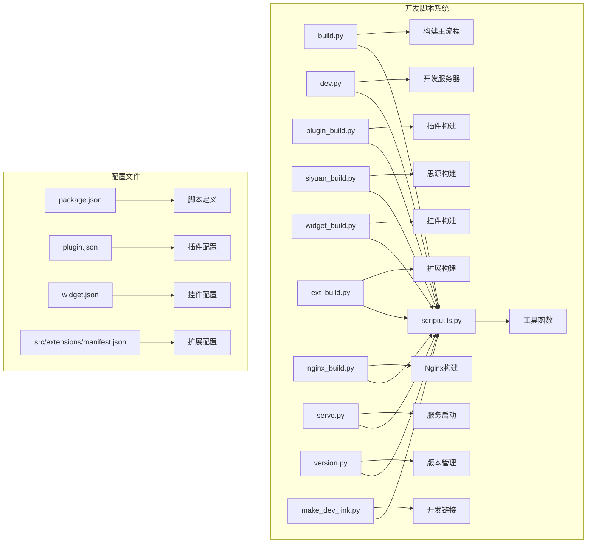
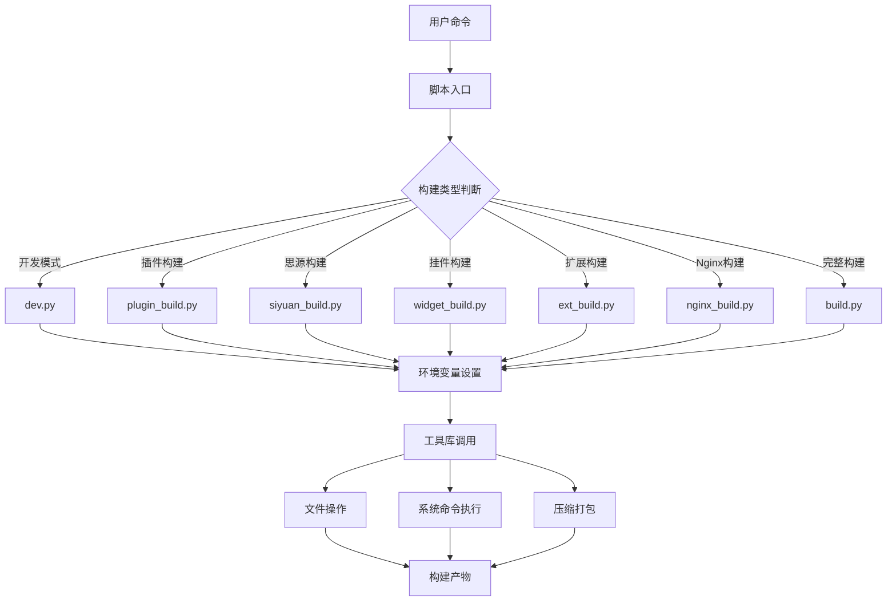
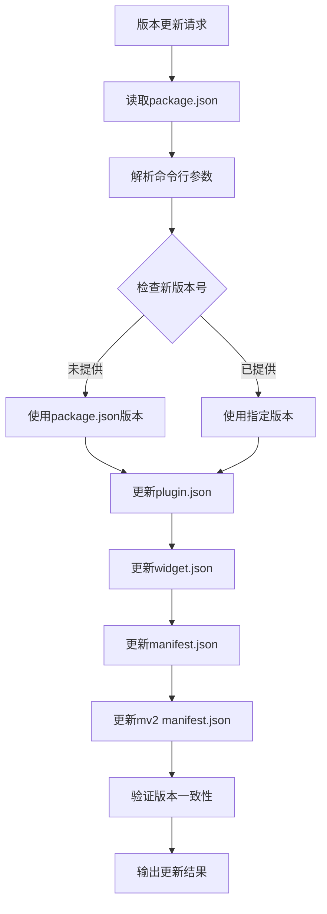
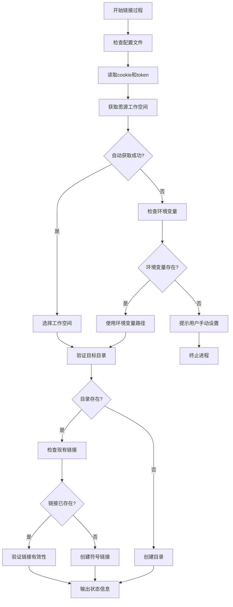
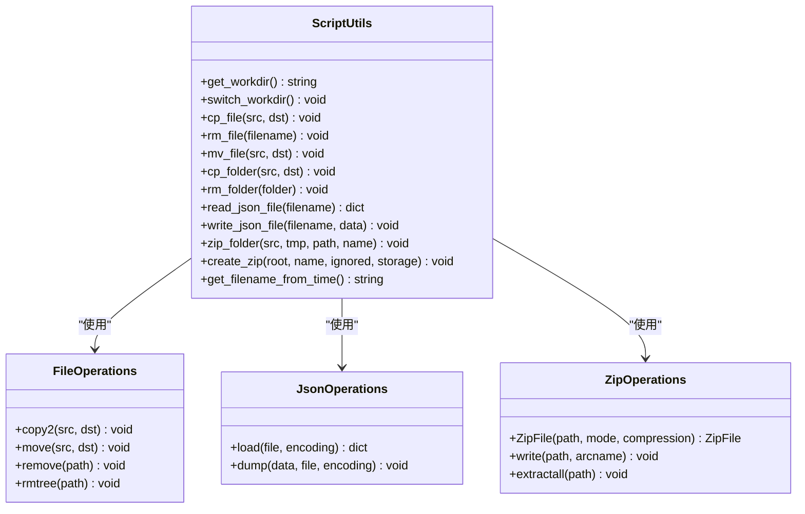
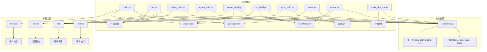

# 开发脚本增强

<cite>
**本文档引用的文件**
- [scripts/build.py](file://scripts/build.py)
- [scripts/dev.py](file://scripts/dev.py)
- [scripts/plugin_build.py](file://scripts/plugin_build.py)
- [scripts/siyuan_build.py](file://scripts/siyuan_build.py)
- [scripts/widget_build.py](file://scripts/widget_build.py)
- [scripts/ext_build.py](file://scripts/ext_build.py)
- [scripts/nginx_build.py](file://scripts/nginx_build.py)
- [scripts/serve.py](file://scripts/serve.py)
- [scripts/version.py](file://scripts/version.py)
- [scripts/make_dev_link.py](file://scripts/make_dev_link.py)
- [scripts/scriptutils.py](file://scripts/scriptutils.py)
- [package.json](file://package.json)
- [plugin.json](file://plugin.json)
- [widget.json](file://widget.json)
- [src/extensions/manifest.json](file://src/extensions/manifest.json)
</cite>

## 目录
1. [简介](#简介)
2. [项目结构](#项目结构)
3. [核心组件](#核心组件)
4. [架构概览](#架构概览)
5. [详细组件分析](#详细组件分析)
6. [依赖分析](#依赖分析)
7. [性能考虑](#性能考虑)
8. [故障排除指南](#故障排除指南)
9. [结论](#结论)

## 简介

本文档深入分析了思源插件发布器项目的开发脚本系统，重点展示了如何通过Python脚本增强开发流程，实现多平台构建、版本管理和自动化部署。该项目提供了完整的开发工具链，支持思源笔记插件、浏览器扩展、静态网站等多种发布形式。

开发脚本系统采用模块化设计，每个脚本负责特定的构建任务，通过统一的工具库实现文件操作、压缩打包等功能。系统支持多种构建模式，包括开发模式、生产模式、测试模式等，为不同场景提供灵活的解决方案。

## 项目结构

项目采用清晰的分层结构，开发脚本位于`scripts/`目录下，每个脚本都有明确的职责分工：



**图表来源**
- [scripts/build.py:1-57](file://scripts/build.py#L1-L57)
- [scripts/dev.py:1-107](file://scripts/dev.py#L1-L107)
- [scripts/scriptutils.py:1-239](file://scripts/scriptutils.py#L1-L239)

**章节来源**
- [package.json:9-31](file://package.json#L9-L31)
- [scripts/scriptutils.py:34-60](file://scripts/scriptutils.py#L34-L60)

## 核心组件

### 脚本工具库 (scriptutils.py)

脚本工具库是整个开发脚本系统的核心，提供了基础的文件操作和系统管理功能：

- **工作目录管理**: 自动检测和切换工作目录，确保脚本在正确的项目根路径执行
- **文件操作**: 提供文件复制、移动、删除等基础操作
- **压缩打包**: 实现ZIP文件的创建和解压功能
- **JSON处理**: 封装JSON文件的读写操作，支持编码处理
- **时间工具**: 提供基于时间的文件命名功能

### 构建脚本系统

系统包含多个专门的构建脚本，每个都针对特定的发布目标：

- **build.py**: 主构建脚本，协调插件和思源构建流程
- **plugin_build.py**: 专注于思源笔记插件的构建
- **siyuan_build.py**: 通用的思源构建流程
- **widget_build.py**: 挂件版本的构建和打包
- **ext_build.py**: 浏览器扩展的构建和打包
- **nginx_build.py**: Nginx静态站点的构建

**章节来源**
- [scripts/scriptutils.py:165-239](file://scripts/scriptutils.py#L165-L239)
- [scripts/build.py:28-57](file://scripts/build.py#L28-L57)
- [scripts/plugin_build.py:28-39](file://scripts/plugin_build.py#L28-L39)

## 架构概览

开发脚本系统采用分层架构设计，实现了高度的模块化和可扩展性：



**图表来源**
- [scripts/dev.py:45-106](file://scripts/dev.py#L45-L106)
- [scripts/build.py:38-56](file://scripts/build.py#L38-L56)

系统架构的关键特点：

1. **统一入口**: 所有脚本都通过`scriptutils.switch_workdir()`确保在正确的工作目录执行
2. **参数化配置**: 支持命令行参数传递，实现灵活的构建配置
3. **环境隔离**: 每个构建脚本独立设置所需的环境变量
4. **错误处理**: 统一的异常处理机制，提供详细的错误信息

## 详细组件分析

### 开发服务器脚本 (dev.py)

开发服务器脚本提供了强大的开发环境支持，支持多种构建平台：

```mermaid
sequenceDiagram
participant Dev as 开发者
participant Script as dev.py
participant Utils as scriptutils
participant Builder as 构建工具
Dev->>Script : python scripts/dev.py -p [平台]
Script->>Utils : switch_workdir()
Script->>Script : 解析命令行参数
Script->>Script : 设置BUILD_TYPE环境变量
alt 平台选择
case siyuan
Script->>Builder : zhi-build --production
case widget
Script->>Utils : 复制必需文件
case 浏览器扩展
Script->>Utils : 复制扩展文件
Script->>Script : 处理平台特定配置
end
Script->>Builder : vite build --watch
Builder-->>Script : 实时构建反馈
Script-->>Dev : 开发服务器就绪
```

**图表来源**
- [scripts/dev.py:28-106](file://scripts/dev.py#L28-L106)
- [scripts/scriptutils.py:62-123](file://scripts/scriptutils.py#L62-L123)

**章节来源**
- [scripts/dev.py:28-106](file://scripts/dev.py#L28-L106)

### 版本管理系统 (version.py)

版本管理系统实现了多文件版本同步，确保所有相关配置文件保持版本一致性：



**图表来源**
- [scripts/version.py:29-81](file://scripts/version.py#L29-L81)

**章节来源**
- [scripts/version.py:29-81](file://scripts/version.py#L29-L81)

### 开发链接管理 (make_dev_link.py)

开发链接管理脚本提供了智能的符号链接创建功能：



**图表来源**
- [scripts/make_dev_link.py:170-231](file://scripts/make_dev_link.py#L170-L231)

**章节来源**
- [scripts/make_dev_link.py:41-231](file://scripts/make_dev_link.py#L41-L231)

### 构建工具库 (scriptutils.py)

工具库提供了构建系统所需的基础功能：



**图表来源**
- [scripts/scriptutils.py:34-239](file://scripts/scriptutils.py#L34-L239)

**章节来源**
- [scripts/scriptutils.py:34-239](file://scripts/scriptutils.py#L34-L239)

## 依赖分析

开发脚本系统具有清晰的依赖关系，形成了一个完整的工具链：



**图表来源**
- [scripts/scriptutils.py:24-31](file://scripts/scriptutils.py#L24-L31)
- [package.json:9-31](file://package.json#L9-L31)

**章节来源**
- [package.json:9-31](file://package.json#L9-L31)
- [scripts/scriptutils.py:24-31](file://scripts/scriptutils.py#L24-L31)

## 性能考虑

开发脚本系统在设计时充分考虑了性能优化：

### 构建性能优化

1. **增量构建**: 开发模式使用`--watch`参数实现热重载
2. **并行处理**: 各构建脚本独立运行，避免相互阻塞
3. **缓存利用**: 利用Vite的内置缓存机制
4. **最小化依赖**: 只加载必要的模块和依赖

### 内存管理

1. **流式处理**: ZIP文件创建使用迭代器避免大文件内存占用
2. **及时清理**: 构建完成后及时删除临时文件
3. **资源释放**: 确保文件句柄和网络连接正确关闭

### 网络性能

1. **API缓存**: 开发链接脚本减少重复的API调用
2. **批量操作**: 批量复制文件时使用更高效的批量操作

## 故障排除指南

### 常见问题及解决方案

#### 工作目录问题
**症状**: 脚本无法找到配置文件或构建失败
**解决方案**: 
- 确保从项目根目录执行脚本
- 检查`scriptutils.switch_workdir()`是否正确切换目录
- 验证当前工作目录权限

#### 环境变量问题
**症状**: 构建过程中出现环境变量相关的错误
**解决方案**:
- 检查`BUILD_TYPE`环境变量设置
- 验证`VITE_SIYUAN_API_URL`等开发环境变量
- 确认浏览器扩展的特定环境变量

#### 权限问题
**症状**: 文件复制、移动或删除操作失败
**解决方案**:
- 检查目标目录的写入权限
- 确认没有文件被其他进程占用
- 在Windows上以管理员权限运行

#### 网络连接问题
**症状**: 开发链接脚本无法连接到思源笔记
**解决方案**:
- 确认思源笔记服务正在运行
- 检查`cookie.txt`和`token.txt`文件内容
- 验证防火墙设置允许本地连接

**章节来源**
- [scripts/make_dev_link.py:41-58](file://scripts/make_dev_link.py#L41-L58)
- [scripts/dev.py:45-58](file://scripts/dev.py#L45-L58)

## 结论

开发脚本系统展现了优秀的工程实践，通过模块化设计和清晰的职责分离，为思源插件发布器项目提供了强大而灵活的开发工具链。

### 主要优势

1. **高度模块化**: 每个脚本专注于特定任务，便于维护和扩展
2. **统一接口**: 通过工具库提供一致的API接口
3. **多平台支持**: 支持插件、挂件、浏览器扩展等多种发布形式
4. **自动化程度高**: 减少手动操作，提高开发效率
5. **错误处理完善**: 提供详细的错误信息和恢复机制

### 改进建议

1. **日志系统**: 可以考虑集成更完善的日志记录机制
2. **配置管理**: 将常用配置提取到单独的配置文件
3. **测试覆盖**: 为关键脚本添加单元测试
4. **文档完善**: 为每个脚本添加详细的使用说明

该脚本系统为类似项目提供了优秀的参考模板，展示了如何构建一个健壮、可扩展的开发工具链。