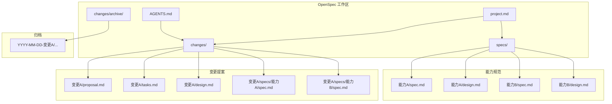
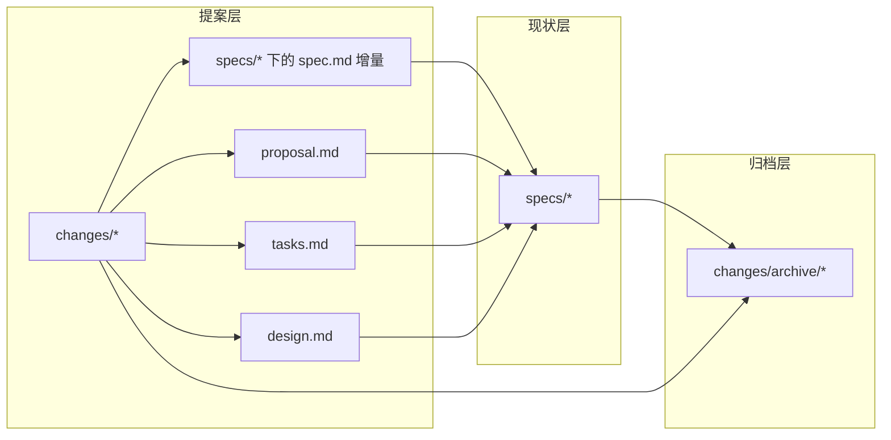
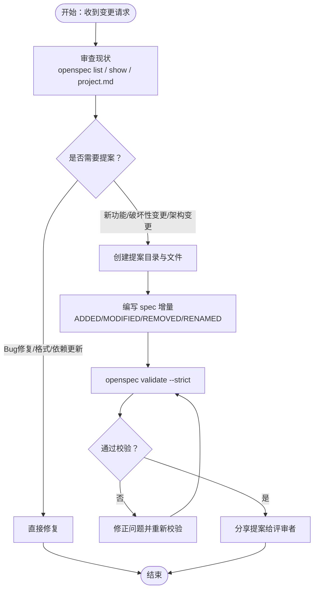
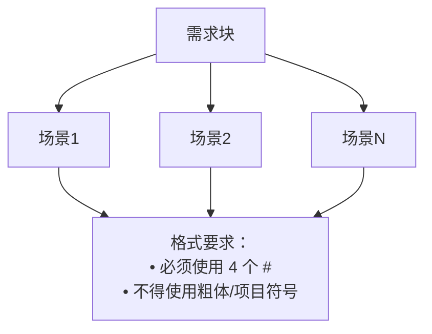
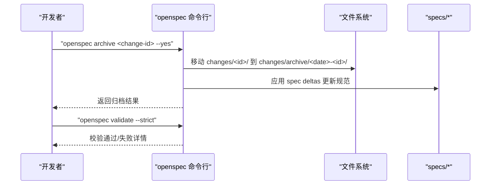
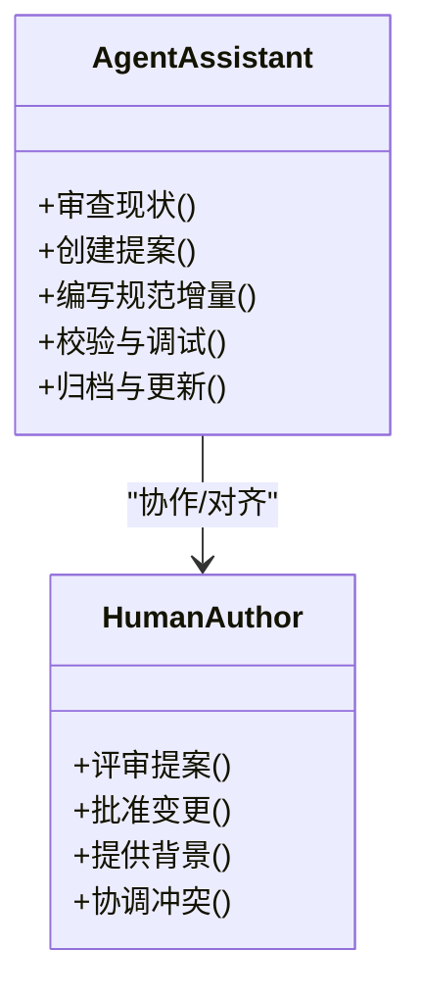
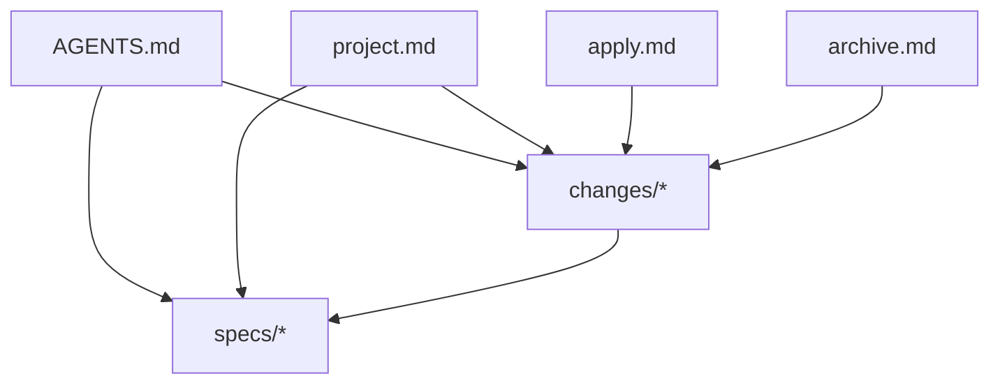

# OpenSpec规范

<cite>
**本文档引用的文件**
- [AGENTS.md](file://openspec/AGENTS.md)
- [proposal.md](file://openspec/changes/astro-full-support/proposal.md)
- [tasks.md](file://openspec/changes/astro-full-support/tasks.md)
- [design.md](file://openspec/changes/astro-full-support/design.md)
- [spec.md](file://openspec/changes/astro-full-support/specs/astro-yaml/spec.md)
- [spec.md](file://openspec/changes/archive/2026-03-15-add-yaml-config/specs/system-config/spec.md)
- [project.md](file://openspec/project.md)
- [apply.md](file://.claude/commands/openspec/apply.md)
- [archive.md](file://.claude/commands/openspec/archive.md)
- [proposal.md](file://.claude/commands/openspec/proposal.md)
</cite>

## 目录
1. [简介](#简介)
2. [项目结构](#项目结构)
3. [核心组件](#核心组件)
4. [架构总览](#架构总览)
5. [详细组件分析](#详细组件分析)
6. [依赖关系分析](#依赖关系分析)
7. [性能考量](#性能考量)
8. [故障排除指南](#故障排除指南)
9. [结论](#结论)
10. [附录](#附录)

## 简介
OpenSpec 是一套面向“规范驱动开发”的方法论与工具链，旨在通过明确的规范、严谨的提案流程、可追溯的变更管理以及清晰的角色分工，确保复杂软件项目的演进过程可控、可审计、可协作。它将“规范”作为“事实真相”，将“变更提案”作为“待实施的计划”，并通过“归档”固化最终成果，形成从“想法”到“落地”的闭环。

- 规范（specs）：描述“系统应当做什么”，是当前真实能力的权威来源。
- 提案（changes）：描述“系统应该做什么”，包含为什么做、做什么、影响范围等。
- 归档（archive）：记录已完成的变更，完成从“提案”到“规范”的迁移。
- 角色与协作：通过 AGENTS.md 明确 AI 助手与人类作者在 OpenSpec 流程中的职责边界与协作方式。

## 项目结构
OpenSpec 的工作空间围绕 openspec 目录展开，包含三类核心目录：
- openspec/specs：当前已实现的能力规范，每个能力一个目录，包含 spec.md（需求与场景）与 design.md（技术设计）。
- openspec/changes：变更提案，每个变更一个子目录，包含 proposal.md（为什么、做什么、影响）、tasks.md（实现清单）、design.md（必要时）以及针对受影响能力的 spec deltas（变更增量）。
- openspec/changes/archive：已完成变更的归档，按日期命名，包含原变更目录的完整拷贝与更新后的规范。

图表来源
- [AGENTS.md:123-142](file://openspec/AGENTS.md#L123-L142)
- [project.md:109-152](file://openspec/project.md#L109-L152)

章节来源
- [AGENTS.md:123-142](file://openspec/AGENTS.md#L123-L142)
- [project.md:109-152](file://openspec/project.md#L109-L152)

## 核心组件
- 规范文件（spec.md）：以“需求 + 场景”的形式描述能力边界与行为，要求每个需求至少包含一个场景；支持 ADDED/MODIFIED/REMOVED/RENAMED 四种增量操作。
- 提案文件（proposal.md）：说明变更动机、范围与影响，帮助评审者快速理解变更价值与风险。
- 任务清单（tasks.md）：将实现拆解为可执行、可验证的小步骤，确保进度可追踪、质量可保证。
- 设计文件（design.md）：当变更涉及跨模块、引入新依赖或存在不确定性时，提供技术决策与权衡依据。
- 归档机制（archive）：将已部署的变更从 changes 移至 archive，并同步更新规范，确保“规范即真相”。

章节来源
- [AGENTS.md:157-236](file://openspec/AGENTS.md#L157-L236)
- [AGENTS.md:237-281](file://openspec/AGENTS.md#L237-L281)
- [AGENTS.md:59-65](file://openspec/AGENTS.md#L59-L65)

## 架构总览
OpenSpec 的整体架构体现为“三层分离”与“双向流动”：
- 三层分离：specs（现状）、changes（提案）、archive（历史）。
- 双向流动：changes → archive → specs（通过归档工具与校验），以及从现状出发的 changes（通过提案与评审）。

图表来源
- [AGENTS.md:123-142](file://openspec/AGENTS.md#L123-L142)
- [AGENTS.md:59-65](file://openspec/AGENTS.md#L59-L65)

## 详细组件分析

### 组件A：变更提案（Changes）
变更提案是 OpenSpec 的“输入端”，用于将想法转化为可执行的计划。其典型结构包括：
- proposal.md：阐明动机、范围与影响。
- tasks.md：实现清单，按阶段与依赖组织。
- design.md：必要时提供技术决策与权衡。
- specs/下的 spec deltas：对受影响能力的规范增量。

图表来源
- [AGENTS.md:44-48](file://openspec/AGENTS.md#L44-L48)
- [AGENTS.md:145-156](file://openspec/AGENTS.md#L145-L156)
- [AGENTS.md:293-304](file://openspec/AGENTS.md#L293-L304)

章节来源
- [AGENTS.md:44-48](file://openspec/AGENTS.md#L44-L48)
- [AGENTS.md:145-156](file://openspec/AGENTS.md#L145-L156)
- [AGENTS.md:293-304](file://openspec/AGENTS.md#L293-L304)

### 组件B：规范文件（spec.md）与场景格式
规范文件以“需求 + 场景”的形式表达能力边界，要求：
- 每个需求至少包含一个场景；
- 场景必须使用“#### Scenario: 名称”格式；
- 支持四种增量操作：ADDED（新增）、MODIFIED（修改）、REMOVED（移除）、RENAMED（重命名）。

图表来源
- [AGENTS.md:239-256](file://openspec/AGENTS.md#L239-L256)
- [AGENTS.md:260-275](file://openspec/AGENTS.md#L260-L275)

章节来源
- [AGENTS.md:239-256](file://openspec/AGENTS.md#L239-L256)
- [AGENTS.md:260-275](file://openspec/AGENTS.md#L260-L275)

### 组件C：归档机制（Archive）
归档是 OpenSpec 的“输出端”，用于将已部署的变更固化为规范的一部分，并保留历史轨迹：
- 将 changes 下的变更移动到 changes/archive/YYYY-MM-DD-[name]/；
- 根据 spec deltas 更新 specs；
- 使用 openspec archive 命令进行自动化归档；
- 归档后再次 validate 以确保一致性。

图表来源
- [AGENTS.md:59-65](file://openspec/AGENTS.md#L59-L65)
- [archive.md:13-22](file://.claude/commands/openspec/archive.md#L13-L22)

章节来源
- [AGENTS.md:59-65](file://openspec/AGENTS.md#L59-L65)
- [archive.md:13-22](file://.claude/commands/openspec/archive.md#L13-L22)

### 组件D：角色分工与协作（AGENTS.md）
AGENTS.md 明确了 AI 助手与人类作者在 OpenSpec 流程中的职责：
- AI 助手负责：提案起草、规范增量编写、校验与调试、归档与更新。
- 人类作者负责：评审、批准、提供领域知识与业务背景、协调冲突。
- 协作原则：严格遵循 OpenSpec 约定，先评审再实现，先现状再提案。

图表来源
- [AGENTS.md:14-27](file://openspec/AGENTS.md#L14-L27)
- [AGENTS.md:49-58](file://openspec/AGENTS.md#L49-L58)
- [apply.md:13-23](file://.claude/commands/openspec/apply.md#L13-L23)

章节来源
- [AGENTS.md:14-27](file://openspec/AGENTS.md#L14-L27)
- [AGENTS.md:49-58](file://openspec/AGENTS.md#L49-L58)
- [apply.md:13-23](file://.claude/commands/openspec/apply.md#L13-L23)

## 依赖关系分析
OpenSpec 的依赖关系体现在文件间的引用与命令行工具的协作上：
- AGENTS.md 为所有流程提供规范与约束；
- project.md 提供项目上下文与架构背景；
- apply.md 与 archive.md 为具体操作提供命令行指导；
- changes 与 specs 之间通过 spec deltas 建立单向依赖（变更推动规范演进）。

图表来源
- [AGENTS.md:123-142](file://openspec/AGENTS.md#L123-L142)
- [project.md:109-152](file://openspec/project.md#L109-L152)
- [apply.md:13-23](file://.claude/commands/openspec/apply.md#L13-L23)
- [archive.md:13-22](file://.claude/commands/openspec/archive.md#L13-L22)

章节来源
- [AGENTS.md:123-142](file://openspec/AGENTS.md#L123-L142)
- [project.md:109-152](file://openspec/project.md#L109-L152)
- [apply.md:13-23](file://.claude/commands/openspec/apply.md#L13-L23)
- [archive.md:13-22](file://.claude/commands/openspec/archive.md#L13-L22)

## 性能考量
- 规模控制：默认限制变更规模，优先采用小步快跑，降低回归风险与评审成本。
- 解析效率：严格规范场景格式与增量操作，有助于工具链高效解析与校验。
- 并行实现：tasks.md 将实现拆分为可并行的任务，但需遵循依赖顺序，避免竞态。
- 历史检索：通过 openspec list/show/validate 等命令快速定位问题，减少无效排查。

## 故障排除指南
常见问题与解决步骤：
- “变更必须至少有一个增量”
  - 检查 changes/[name]/specs/ 是否存在，且文件包含操作前缀（如 ADDED）。
- “需求必须至少有一个场景”
  - 确认场景使用“#### Scenario: 名称”格式，不得使用项目符号或粗体。
- “场景解析失败（静默失败）”
  - 使用 openspec show <change> --json --deltas-only 定位问题。
- “校验失败”
  - 使用 openspec validate <item> --strict 获取详细输出，逐条修正。
- “变更冲突”
  - 运行 openspec list 查看活动变更，检查是否存在重叠能力，协调合并或拆分。

章节来源
- [AGENTS.md:293-304](file://openspec/AGENTS.md#L293-L304)
- [AGENTS.md:417-428](file://openspec/AGENTS.md#L417-L428)

## 结论
OpenSpec 通过“规范即真相、提案即计划、归档即历史”的三段式结构，结合严格的文件格式与命令行工具，实现了从“想法”到“落地”的闭环管理。配合 AGENTS.md 的角色分工与协作原则，既能发挥 AI 助手在规范化与自动化方面的优势，又能确保人类作者在方向把控与业务理解上的主导地位。对于新加入的团队成员，建议先通读 AGENTS.md 与 project.md，再参考具体示例文件（如 proposal.md、tasks.md、design.md、spec.md）快速上手。

## 附录

### 使用指南：如何创建新的规范
- 在 openspec/specs 下为新能力创建目录，并编写 spec.md（需求 + 场景）。
- 如涉及技术决策，补充 design.md。
- 使用 openspec validate 校验格式与完整性。

章节来源
- [AGENTS.md:157-236](file://openspec/AGENTS.md#L157-L236)

### 使用指南：如何提交提案
- 选择唯一 change-id（动词开头的短横线命名），在 openspec/changes 下创建目录。
- 编写 proposal.md、tasks.md、design.md（必要时）与 spec deltas。
- 使用 openspec validate --strict 校验，修正问题后再分享评审。

章节来源
- [AGENTS.md:44-48](file://openspec/AGENTS.md#L44-L48)
- [AGENTS.md:157-236](file://openspec/AGENTS.md#L157-L236)

### 使用指南：如何参与讨论与评审
- 使用 openspec list 查看活动变更，openspec show 查看详情。
- 通过 openspec show <change> --json --deltas-only 深入定位问题。
- 在评审过程中，重点关注场景完整性与需求表述的准确性。

章节来源
- [AGENTS.md:81-88](file://openspec/AGENTS.md#L81-L88)
- [AGENTS.md:305-317](file://openspec/AGENTS.md#L305-L317)

### 示例与最佳实践
- 示例1：Astro 全平台支持（GitHub、GitLab、本地文件系统）
  - 提案：openspec/changes/astro-full-support/proposal.md
  - 任务：openspec/changes/astro-full-support/tasks.md
  - 设计：openspec/changes/astro-full-support/design.md
  - 规范增量：openspec/changes/astro-full-support/specs/astro-yaml/spec.md
- 示例2：YAML 配置增强
  - 规范增量：openspec/changes/archive/2026-03-15-add-yaml-config/specs/system-config/spec.md

章节来源
- [proposal.md:1-24](file://openspec/changes/astro-full-support/proposal.md#L1-L24)
- [tasks.md:1-52](file://openspec/changes/astro-full-support/tasks.md#L1-L52)
- [design.md:1-92](file://openspec/changes/astro-full-support/design.md#L1-L92)
- [spec.md:1-37](file://openspec/changes/astro-full-support/specs/astro-yaml/spec.md#L1-L37)
- [spec.md:1-41](file://openspec/changes/archive/2026-03-15-add-yaml-config/specs/system-config/spec.md#L1-L41)