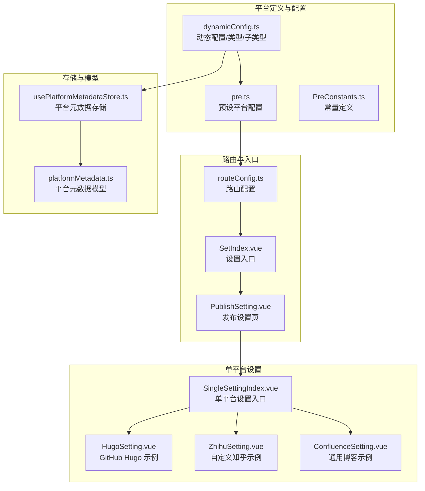
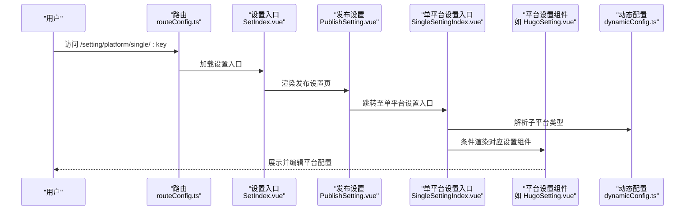
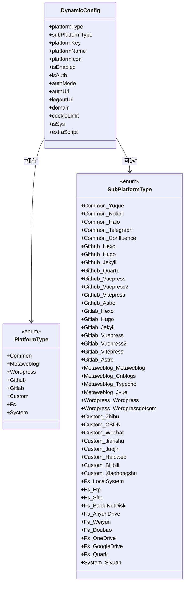
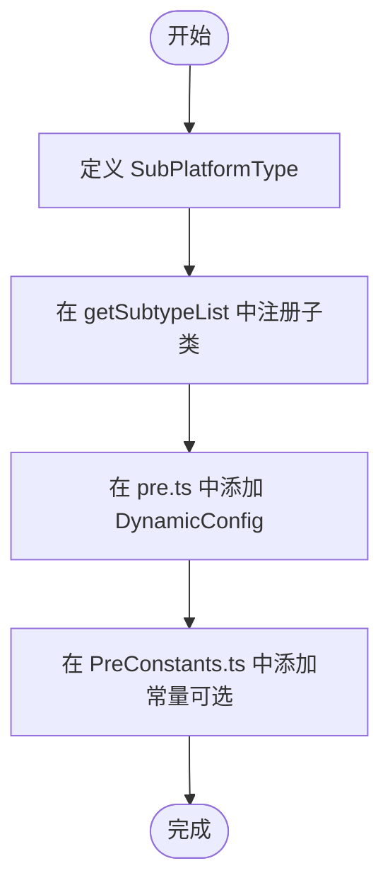
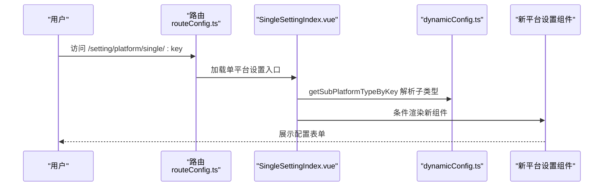
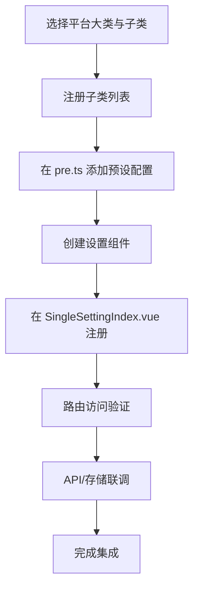
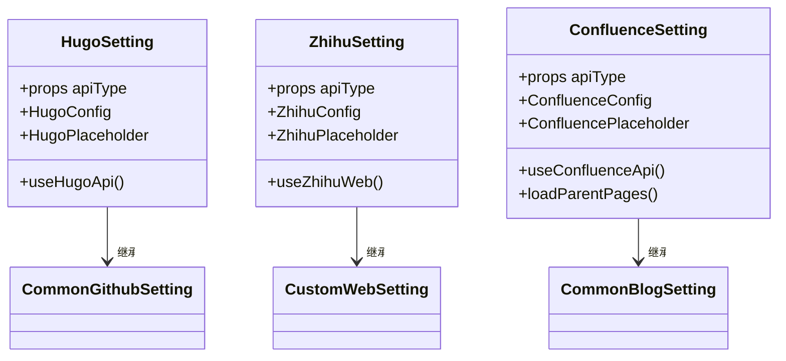
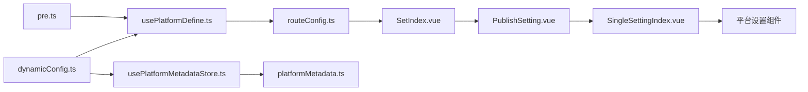

# 平台集成开发

<cite>
**本文档引用的文件**
- [src/platforms/dynamicConfig.ts](file://src/platforms/dynamicConfig.ts)
- [src/platforms/pre.ts](file://src/platforms/pre.ts)
- [src/platforms/PreConstants.ts](file://src/platforms/PreConstants.ts)
- [src/components/set/publish/singleplatform/SingleSettingIndex.vue](file://src/components/set/publish/singleplatform/SingleSettingIndex.vue)
- [src/composables/usePlatformDefine.ts](file://src/composables/usePlatformDefine.ts)
- [src/stores/usePlatformMetadataStore.ts](file://src/stores/usePlatformMetadataStore.ts)
- [src/routes/routeConfig.ts](file://src/routes/routeConfig.ts)
- [src/components/set/PublishSetting.vue](file://src/components/set/PublishSetting.vue)
- [src/components/set/SetIndex.vue](file://src/components/set/SetIndex.vue)
- [src/models/platformMetadata.ts](file://src/models/platformMetadata.ts)
- [src/components/set/publish/singleplatform/github/HugoSetting.vue](file://src/components/set/publish/singleplatform/github/HugoSetting.vue)
- [src/components/set/publish/singleplatform/web/ZhihuSetting.vue](file://src/components/set/publish/singleplatform/web/ZhihuSetting.vue)
- [src/components/set/publish/singleplatform/commonblog/ConfluenceSetting.vue](file://src/components/set/publish/singleplatform/commonblog/ConfluenceSetting.vue)
</cite>

## 目录
1. [简介](#简介)
2. [项目结构](#项目结构)
3. [核心组件](#核心组件)
4. [架构总览](#架构总览)
5. [详细组件分析](#详细组件分析)
6. [依赖关系分析](#依赖关系分析)
7. [性能考虑](#性能考虑)
8. [故障排除指南](#故障排除指南)
9. [结论](#结论)
10. [附录](#附录)

## 简介
本指南面向平台集成开发者，系统讲解如何在现有插件架构中新增或扩展平台支持。内容涵盖平台大类与子类的设计原理、平台注册流程（SubPlatformType 定义、getSubtypeList 注册、pre.ts 配置）、配置页面集成方法（SingleSettingIndex.vue 中注册新的平台设置组件），以及从平台分类到最终集成的完整开发流程示例。

## 项目结构
平台相关的核心代码集中在以下模块：
- 平台类型与动态配置：src/platforms/dynamicConfig.ts
- 预设平台与平台类型：src/platforms/pre.ts、src/platforms/PreConstants.ts
- 平台路由与入口：src/routes/routeConfig.ts、src/components/set/SetIndex.vue、src/components/set/PublishSetting.vue
- 单平台设置入口与组件映射：src/components/set/publish/singleplatform/SingleSettingIndex.vue
- 平台元数据存储：src/stores/usePlatformMetadataStore.ts、src/models/platformMetadata.ts
- 平台定义组合式工具：src/composables/usePlatformDefine.ts

**图表来源**
- [src/platforms/dynamicConfig.ts:1-534](file://src/platforms/dynamicConfig.ts#L1-L534)
- [src/platforms/pre.ts:1-463](file://src/platforms/pre.ts#L1-L463)
- [src/platforms/PreConstants.ts:1-20](file://src/platforms/PreConstants.ts#L1-L20)
- [src/routes/routeConfig.ts:1-151](file://src/routes/routeConfig.ts#L1-L151)
- [src/components/set/SetIndex.vue:1-17](file://src/components/set/SetIndex.vue#L1-L17)
- [src/components/set/PublishSetting.vue:1-70](file://src/components/set/PublishSetting.vue#L1-L70)
- [src/components/set/publish/singleplatform/SingleSettingIndex.vue:1-125](file://src/components/set/publish/singleplatform/SingleSettingIndex.vue#L1-L125)
- [src/stores/usePlatformMetadataStore.ts:1-128](file://src/stores/usePlatformMetadataStore.ts#L1-L128)
- [src/models/platformMetadata.ts:1-50](file://src/models/platformMetadata.ts#L1-L50)

**章节来源**
- [src/platforms/dynamicConfig.ts:1-534](file://src/platforms/dynamicConfig.ts#L1-L534)
- [src/platforms/pre.ts:1-463](file://src/platforms/pre.ts#L1-L463)
- [src/platforms/PreConstants.ts:1-20](file://src/platforms/PreConstants.ts#L1-L20)
- [src/routes/routeConfig.ts:1-151](file://src/routes/routeConfig.ts#L1-L151)
- [src/components/set/SetIndex.vue:1-17](file://src/components/set/SetIndex.vue#L1-L17)
- [src/components/set/PublishSetting.vue:1-70](file://src/components/set/PublishSetting.vue#L1-L70)
- [src/components/set/publish/singleplatform/SingleSettingIndex.vue:1-125](file://src/components/set/publish/singleplatform/SingleSettingIndex.vue#L1-L125)
- [src/stores/usePlatformMetadataStore.ts:1-128](file://src/stores/usePlatformMetadataStore.ts#L1-L128)
- [src/models/platformMetadata.ts:1-50](file://src/models/platformMetadata.ts#L1-L50)

## 核心组件
- 动态配置与类型系统：定义平台大类（Common、Metaweblog、Github、Gitlab、Custom、Fs、System）与子类（SubPlatformType），提供平台 key 规则、子类列表获取、配置查找与替换等工具函数。
- 预设平台配置：在 pre.ts 中集中维护各平台的默认启用状态、认证模式、图标、域名、登录地址等。
- 单平台设置入口：SingleSettingIndex.vue 根据路由参数解析子平台类型，按需渲染对应平台设置组件。
- 平台定义组合式工具：usePlatformDefine.ts 将平台类型与预设平台整合，提供查询接口。
- 平台元数据存储：usePlatformMetadataStore.ts 提供平台标签、分类、模板等元数据的持久化能力。

**章节来源**
- [src/platforms/dynamicConfig.ts:13-534](file://src/platforms/dynamicConfig.ts#L13-L534)
- [src/platforms/pre.ts:101-462](file://src/platforms/pre.ts#L101-L462)
- [src/components/set/publish/singleplatform/SingleSettingIndex.vue:10-125](file://src/components/set/publish/singleplatform/SingleSettingIndex.vue#L10-L125)
- [src/composables/usePlatformDefine.ts:18-82](file://src/composables/usePlatformDefine.ts#L18-L82)
- [src/stores/usePlatformMetadataStore.ts:21-125](file://src/stores/usePlatformMetadataStore.ts#L21-L125)

## 架构总览
平台集成遵循“类型定义—预设配置—路由入口—单平台设置—存储模型”的分层架构。类型与子类型在动态配置中统一管理；预设配置提供默认值；路由将设置入口与单平台设置页连接；单平台设置组件负责具体表单与占位符；元数据存储为平台能力扩展提供基础。

**图表来源**
- [src/routes/routeConfig.ts:131-134](file://src/routes/routeConfig.ts#L131-L134)
- [src/components/set/SetIndex.vue:10-16](file://src/components/set/SetIndex.vue#L10-L16)
- [src/components/set/PublishSetting.vue:25-62](file://src/components/set/PublishSetting.vue#L25-L62)
- [src/components/set/publish/singleplatform/SingleSettingIndex.vue:66-118](file://src/components/set/publish/singleplatform/SingleSettingIndex.vue#L66-L118)
- [src/platforms/dynamicConfig.ts:397-418](file://src/platforms/dynamicConfig.ts#L397-L418)

## 详细组件分析

### 平台大类与子类设计原理
- 大类划分
  - Common：通用平台（语雀、Notion、Halo、Telegraph、Confluence）
  - Metaweblog：基于 MetaWeblog 协议的博客平台（博客园、Typecho、Jvue 等）
  - Github：托管于 GitHub 的静态站点（Hexo、Hugo、Jekyll、Vuepress、Vitepress、Astro、Quartz）
  - Gitlab：托管于 GitLab 的静态站点（同上，命名以 Gitlab 前缀区分）
  - Custom：自定义网站（知乎、CSDN、微信公众号、简书、掘金、B站、Halo 网页版等）
  - Fs：文件系统（本地系统、FTP、SFTP、网盘等）
  - System：系统内置平台（思源笔记）
- 设计原则
  - 统一的 DynamicConfig 结构承载平台元信息与行为开关
  - SubPlatformType 作为子类标识，确保平台 key 的唯一性与可解析性
  - 预设配置 pre.ts 提供默认启用状态与认证模式，便于快速接入

**图表来源**
- [src/platforms/dynamicConfig.ts:13-238](file://src/platforms/dynamicConfig.ts#L13-L238)

**章节来源**
- [src/platforms/dynamicConfig.ts:126-238](file://src/platforms/dynamicConfig.ts#L126-L238)
- [src/platforms/pre.ts:50-96](file://src/platforms/pre.ts#L50-L96)

### 平台注册流程
- SubPlatformType 定义：在 dynamicConfig.ts 的 SubPlatformType 枚举中新增子类标识
- getSubtypeList 注册：在 dynamicConfig.ts 的 getSubtypeList 中为对应 PlatformType 添加子类
- pre.ts 配置：在 pre.ts 的相应配置块中添加 DynamicConfig 条目，设置平台名称、图标、认证模式、登录地址、域名等
- 预设常量：如需使用常量 key，可在 PreConstants.ts 中新增

**图表来源**
- [src/platforms/dynamicConfig.ts:174-329](file://src/platforms/dynamicConfig.ts#L174-L329)
- [src/platforms/pre.ts:101-462](file://src/platforms/pre.ts#L101-L462)
- [src/platforms/PreConstants.ts:10-19](file://src/platforms/PreConstants.ts#L10-L19)

**章节来源**
- [src/platforms/dynamicConfig.ts:258-329](file://src/platforms/dynamicConfig.ts#L258-L329)
- [src/platforms/pre.ts:101-462](file://src/platforms/pre.ts#L101-L462)
- [src/platforms/PreConstants.ts:10-19](file://src/platforms/PreConstants.ts#L10-L19)

### 配置页面集成方法
- 在 SingleSettingIndex.vue 中注册新平台设置组件
  - 导入组件：在 script setup 中引入新组件
  - 条件渲染：在模板中添加 v-if/v-else-if 判断，根据 getSubPlatformTypeByKey 解析出的子平台类型渲染对应组件
  - 路由访问：通过 /setting/platform/single/:key 访问单平台设置页
- 入口与路由
  - 路由配置：routeConfig.ts 已定义 /setting/platform/single/:key 路由
  - 设置入口：SetIndex.vue 与 PublishSetting.vue 提供导航入口

**图表来源**
- [src/routes/routeConfig.ts:131-134](file://src/routes/routeConfig.ts#L131-L134)
- [src/components/set/publish/singleplatform/SingleSettingIndex.vue:10-118](file://src/components/set/publish/singleplatform/SingleSettingIndex.vue#L10-L118)
- [src/platforms/dynamicConfig.ts:397-418](file://src/platforms/dynamicConfig.ts#L397-L418)

**章节来源**
- [src/components/set/publish/singleplatform/SingleSettingIndex.vue:10-118](file://src/components/set/publish/singleplatform/SingleSettingIndex.vue#L10-L118)
- [src/routes/routeConfig.ts:131-134](file://src/routes/routeConfig.ts#L131-L134)

### 开发流程示例（从平台分类到最终集成）
- 步骤一：确定平台大类与子类
  - 在 dynamicConfig.ts 的 PlatformType 与 SubPlatformType 中明确分类
- 步骤二：注册子类列表
  - 在 getSubtypeList 中为该大类添加子类
- 步骤三：预设平台配置
  - 在 pre.ts 对应配置块中添加 DynamicConfig 条目，设置 isEnabled、authMode、authUrl、domain 等
- 步骤四：创建设置组件
  - 在对应目录创建设置组件（如 github、web、commonblog 等），参考现有组件（如 HugoSetting.vue、ZhihuSetting.vue、ConfluenceSetting.vue）
- 步骤五：在 SingleSettingIndex.vue 中注册
  - 导入组件并在模板中添加条件渲染逻辑
- 步骤六：验证与测试
  - 通过 /setting/platform/single/:key 访问新平台设置页，检查表单与占位符
  - 如涉及 API，结合 usePlatformDefine.ts 与 usePlatformMetadataStore.ts 进行功能联调

**图表来源**
- [src/platforms/dynamicConfig.ts:258-329](file://src/platforms/dynamicConfig.ts#L258-L329)
- [src/platforms/pre.ts:101-462](file://src/platforms/pre.ts#L101-L462)
- [src/components/set/publish/singleplatform/SingleSettingIndex.vue:10-118](file://src/components/set/publish/singleplatform/SingleSettingIndex.vue#L10-L118)
- [src/routes/routeConfig.ts:131-134](file://src/routes/routeConfig.ts#L131-L134)

**章节来源**
- [src/platforms/dynamicConfig.ts:258-329](file://src/platforms/dynamicConfig.ts#L258-L329)
- [src/platforms/pre.ts:101-462](file://src/platforms/pre.ts#L101-L462)
- [src/components/set/publish/singleplatform/SingleSettingIndex.vue:10-118](file://src/components/set/publish/singleplatform/SingleSettingIndex.vue#L10-L118)
- [src/routes/routeConfig.ts:131-134](file://src/routes/routeConfig.ts#L131-L134)

### 平台设置组件示例分析
- GitHub Hugo 设置组件（HugoSetting.vue）
  - 通过 useHugoApi 获取配置，设置占位符文本，继承通用 GitHub 设置组件
- 自定义知乎设置组件（ZhihuSetting.vue）
  - 通过 useZhihuWeb 获取配置，设置占位符文本，继承通用自定义网页设置组件
- 通用博客 Confluence 设置组件（ConfluenceSetting.vue）
  - 通过 useConfluenceApi 获取配置，动态加载父页面选项，隐藏不兼容的 Markdown 选项

**图表来源**
- [src/components/set/publish/singleplatform/github/HugoSetting.vue:10-41](file://src/components/set/publish/singleplatform/github/HugoSetting.vue#L10-L41)
- [src/components/set/publish/singleplatform/web/ZhihuSetting.vue:10-39](file://src/components/set/publish/singleplatform/web/ZhihuSetting.vue#L10-L39)
- [src/components/set/publish/singleplatform/commonblog/ConfluenceSetting.vue:10-113](file://src/components/set/publish/singleplatform/commonblog/ConfluenceSetting.vue#L10-L113)

**章节来源**
- [src/components/set/publish/singleplatform/github/HugoSetting.vue:10-41](file://src/components/set/publish/singleplatform/github/HugoSetting.vue#L10-L41)
- [src/components/set/publish/singleplatform/web/ZhihuSetting.vue:10-39](file://src/components/set/publish/singleplatform/web/ZhihuSetting.vue#L10-L39)
- [src/components/set/publish/singleplatform/commonblog/ConfluenceSetting.vue:10-113](file://src/components/set/publish/singleplatform/commonblog/ConfluenceSetting.vue#L10-L113)

## 依赖关系分析
- 类型与配置耦合：DynamicConfig 与 PlatformType/SubPlatformType 强关联，getSubtypeList 保证子类集合一致性
- 预设与运行时：pre.ts 提供默认配置，运行时可通过 usePlatformDefine.ts 查询与过滤
- 路由与入口：routeConfig.ts 将设置入口与单平台设置页串联，SingleSettingIndex.vue 实现按子类型渲染
- 存储与模型：usePlatformMetadataStore.ts 依赖 platformMetadata.ts 的模型结构，提供平台元数据的增删改查

**图表来源**
- [src/platforms/dynamicConfig.ts:13-534](file://src/platforms/dynamicConfig.ts#L13-L534)
- [src/platforms/pre.ts:101-462](file://src/platforms/pre.ts#L101-L462)
- [src/composables/usePlatformDefine.ts:18-82](file://src/composables/usePlatformDefine.ts#L18-L82)
- [src/routes/routeConfig.ts:131-134](file://src/routes/routeConfig.ts#L131-L134)
- [src/components/set/SetIndex.vue:10-16](file://src/components/set/SetIndex.vue#L10-L16)
- [src/components/set/PublishSetting.vue:25-62](file://src/components/set/PublishSetting.vue#L25-L62)
- [src/components/set/publish/singleplatform/SingleSettingIndex.vue:66-118](file://src/components/set/publish/singleplatform/SingleSettingIndex.vue#L66-L118)
- [src/stores/usePlatformMetadataStore.ts:21-125](file://src/stores/usePlatformMetadataStore.ts#L21-L125)
- [src/models/platformMetadata.ts:16-47](file://src/models/platformMetadata.ts#L16-L47)

**章节来源**
- [src/platforms/dynamicConfig.ts:13-534](file://src/platforms/dynamicConfig.ts#L13-L534)
- [src/platforms/pre.ts:101-462](file://src/platforms/pre.ts#L101-L462)
- [src/composables/usePlatformDefine.ts:18-82](file://src/composables/usePlatformDefine.ts#L18-L82)
- [src/routes/routeConfig.ts:131-134](file://src/routes/routeConfig.ts#L131-L134)
- [src/components/set/publish/singleplatform/SingleSettingIndex.vue:66-118](file://src/components/set/publish/singleplatform/SingleSettingIndex.vue#L66-L118)
- [src/stores/usePlatformMetadataStore.ts:21-125](file://src/stores/usePlatformMetadataStore.ts#L21-L125)
- [src/models/platformMetadata.ts:16-47](file://src/models/platformMetadata.ts#L16-L47)

## 性能考虑
- 组件懒加载：在路由层面采用异步组件可减少初始包体大小
- 配置缓存：usePlatformDefine.ts 返回的预设平台列表可复用，避免重复计算
- 存储优化：usePlatformMetadataStore.ts 使用本地存储，注意序列化与增量更新，避免频繁写入

## 故障排除指南
- 子平台类型未生效
  - 检查 dynamicConfig.ts 的 getSubtypeList 是否已注册该子类
  - 检查 pre.ts 对应配置块是否存在该子类条目
- 单平台设置页空白
  - 确认 SingleSettingIndex.vue 已导入并添加条件渲染逻辑
  - 检查路由参数 key 是否正确传递
- 认证模式异常
  - 检查 DynamicConfig 的 authMode 是否符合平台要求（API 或 WEBSITE）
  - 自定义平台需设置 authUrl 与 domain
- 元数据不更新
  - 确认 usePlatformMetadataStore.ts 的 updatePlatformMetadata 调用链路与存储键一致

**章节来源**
- [src/platforms/dynamicConfig.ts:258-329](file://src/platforms/dynamicConfig.ts#L258-L329)
- [src/platforms/pre.ts:101-462](file://src/platforms/pre.ts#L101-L462)
- [src/components/set/publish/singleplatform/SingleSettingIndex.vue:66-118](file://src/components/set/publish/singleplatform/SingleSettingIndex.vue#L66-L118)
- [src/stores/usePlatformMetadataStore.ts:83-122](file://src/stores/usePlatformMetadataStore.ts#L83-L122)

## 结论
通过统一的类型与配置体系、清晰的预设与路由入口、灵活的单平台设置组件映射，以及完善的存储模型，平台集成开发可以高效、可维护地扩展支持更多平台。遵循本文档的注册流程与集成步骤，即可快速完成从平台分类到最终上线的全流程开发。

## 附录
- 平台元数据模型字段
  - 标签列表（tags）
  - 分类列表（categories）
  - 模板列表（templates）

**章节来源**
- [src/models/platformMetadata.ts:26-47](file://src/models/platformMetadata.ts#L26-L47)