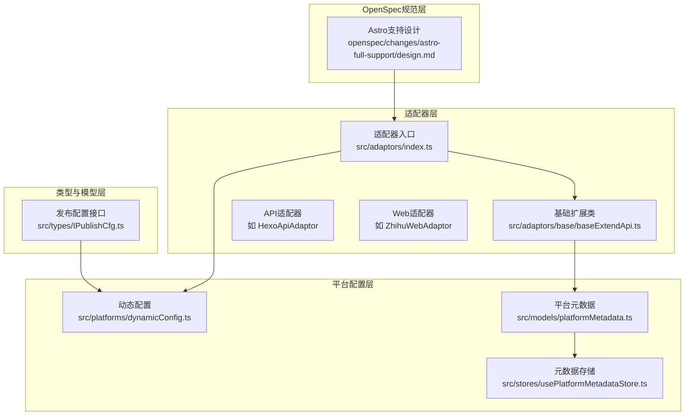
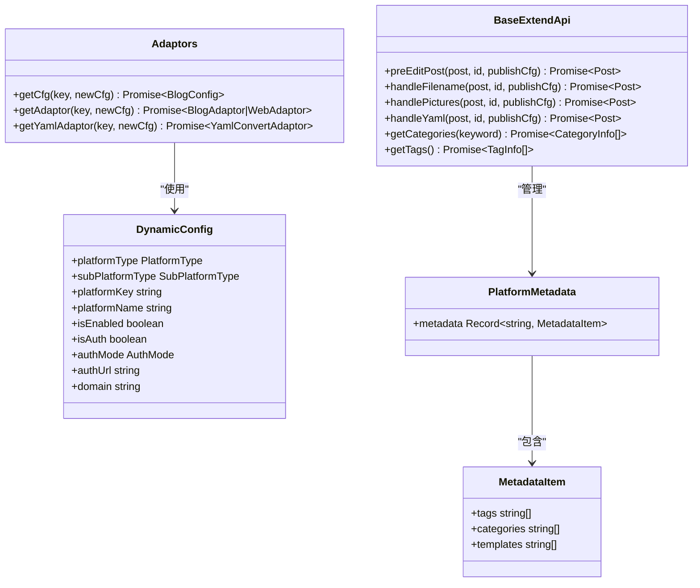
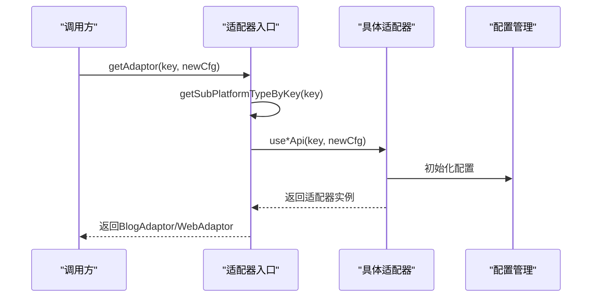
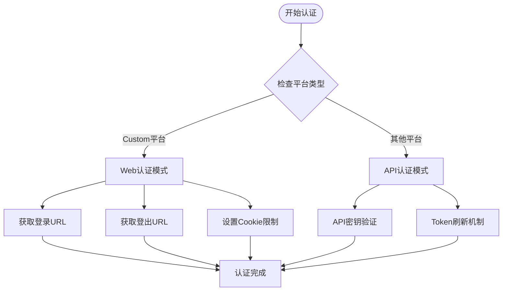
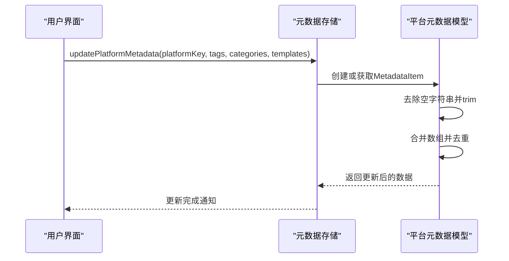
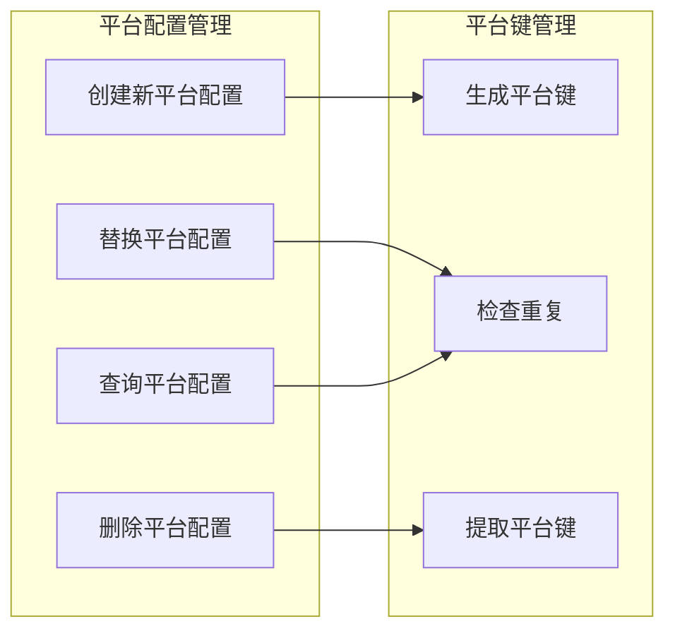
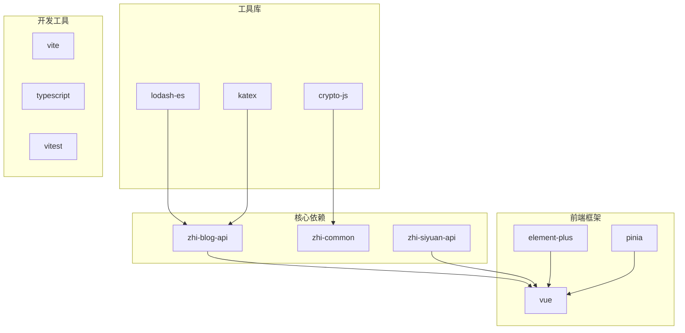

# 扩展开发指南

<cite>
**本文档引用的文件**
- [README_zh_CN.md](file://README_zh_CN.md)
- [DEVELOPMENT.md](file://DEVELOPMENT.md)
- [src/adaptors/index.ts](file://src/adaptors/index.ts)
- [src/platforms/dynamicConfig.ts](file://src/platforms/dynamicConfig.ts)
- [src/models/platformMetadata.ts](file://src/models/platformMetadata.ts)
- [src/stores/usePlatformMetadataStore.ts](file://src/stores/usePlatformMetadataStore.ts)
- [src/types/IPublishCfg.ts](file://src/types/IPublishCfg.ts)
- [src/adaptors/base/baseExtendApi.ts](file://src/adaptors/base/baseExtendApi.ts)
- [src/adaptors/api/hexo/hexoApiAdaptor.ts](file://src/adaptors/api/hexo/hexoApiAdaptor.ts)
- [openspec/changes/astro-full-support/design.md](file://openspec/changes/astro-full-support/design.md)
- [package.json](file://package.json)
</cite>

## 目录
1. [简介](#简介)
2. [项目结构](#项目结构)
3. [核心组件](#核心组件)
4. [架构概览](#架构概览)
5. [详细组件分析](#详细组件分析)
6. [依赖分析](#依赖分析)
7. [性能考虑](#性能考虑)
8. [故障排除指南](#故障排除指南)
9. [结论](#结论)
10. [附录](#附录)

## 简介
本指南面向希望扩展和定制发布工具的开发者，涵盖插件扩展机制、自定义适配器开发、平台集成扩展、组件扩展开发等。文档基于实际代码库，详细说明适配器开发规范（接口实现、配置文件编写、认证机制处理）、平台元数据管理、动态配置系统、OpenSpec规范等高级扩展功能，并提供完整的开发流程、测试方法和发布指南。

## 项目结构
项目采用模块化架构，主要分为以下层次：
- 适配器层：负责与不同平台交互，统一对外提供博客API/Web API接口
- 平台配置层：管理动态平台配置、认证模式、授权URL等
- 元数据管理层：维护各平台的标签、分类、模板等元数据
- 类型与模型层：定义发布配置接口、平台元数据模型等
- OpenSpec规范层：定义平台扩展的设计规范和实现策略

**图表来源**
- [src/adaptors/index.ts:1-573](file://src/adaptors/index.ts#L1-L573)
- [src/platforms/dynamicConfig.ts:1-534](file://src/platforms/dynamicConfig.ts#L1-L534)
- [src/models/platformMetadata.ts:1-50](file://src/models/platformMetadata.ts#L1-L50)
- [src/stores/usePlatformMetadataStore.ts:1-128](file://src/stores/usePlatformMetadataStore.ts#L1-L128)
- [src/types/IPublishCfg.ts:1-50](file://src/types/IPublishCfg.ts#L1-L50)
- [openspec/changes/astro-full-support/design.md:1-92](file://openspec/changes/astro-full-support/design.md#L1-L92)

**章节来源**
- [README_zh_CN.md:1-100](file://README_zh_CN.md#L1-L100)
- [DEVELOPMENT.md:1-115](file://DEVELOPMENT.md#L1-L115)

## 核心组件
本节深入分析核心扩展组件及其职责分工：

### 适配器统一入口
适配器入口类负责根据平台key动态选择合适的适配器实现，支持博客API、Web API和YAML转换器的统一管理。

### 动态配置系统
动态配置系统提供平台类型枚举、子平台类型定义、认证模式管理等功能，支持运行时动态添加和管理平台配置。

### 基础扩展类
基础扩展类实现了统一的预处理流程，包括文件名处理、摘要处理、分类处理、图片处理、Markdown处理、YAML处理等。

### 平台元数据管理
平台元数据系统维护各平台的标签、分类、模板等信息，支持本地存储和实时更新。

**章节来源**
- [src/adaptors/index.ts:56-573](file://src/adaptors/index.ts#L56-L573)
- [src/platforms/dynamicConfig.ts:13-113](file://src/platforms/dynamicConfig.ts#L13-L113)
- [src/adaptors/base/baseExtendApi.ts:55-80](file://src/adaptors/base/baseExtendApi.ts#L55-L80)
- [src/models/platformMetadata.ts:16-47](file://src/models/platformMetadata.ts#L16-L47)

## 架构概览
系统采用分层架构设计，通过适配器模式实现平台无关的发布功能。

**图表来源**
- [src/adaptors/index.ts:56-573](file://src/adaptors/index.ts#L56-L573)
- [src/platforms/dynamicConfig.ts:13-113](file://src/platforms/dynamicConfig.ts#L13-L113)
- [src/adaptors/base/baseExtendApi.ts:55-80](file://src/adaptors/base/baseExtendApi.ts#L55-L80)
- [src/models/platformMetadata.ts:16-47](file://src/models/platformMetadata.ts#L16-L47)

## 详细组件分析

### 适配器开发规范

#### 接口实现规范
适配器必须实现统一的接口契约，支持博客API和Web API两种模式：

**图表来源**
- [src/adaptors/index.ts:271-467](file://src/adaptors/index.ts#L271-L467)
- [src/platforms/dynamicConfig.ts:397-418](file://src/platforms/dynamicConfig.ts#L397-L418)

#### 配置文件编写规范
每个适配器需要提供完整的配置文件结构，包括：
- 基础配置类：继承相应基类配置
- 占位符类：提供用户界面提示文本
- 使用函数：提供统一的初始化入口

**章节来源**
- [src/adaptors/api/hexo/hexoApiAdaptor.ts:23-62](file://src/adaptors/api/hexo/hexoApiAdaptor.ts#L23-L62)

### 认证机制处理
系统支持两种认证模式：API模式和Web模式，分别适用于不同的平台特性。

**图表来源**
- [src/platforms/dynamicConfig.ts:118-121](file://src/platforms/dynamicConfig.ts#L118-L121)
- [src/platforms/dynamicConfig.ts:104-106](file://src/platforms/dynamicConfig.ts#L104-L106)

### 平台元数据管理
平台元数据系统提供动态的标签、分类、模板管理功能：

**图表来源**
- [src/stores/usePlatformMetadataStore.ts:83-122](file://src/stores/usePlatformMetadataStore.ts#L83-L122)
- [src/models/platformMetadata.ts:26-47](file://src/models/platformMetadata.ts#L26-L47)

**章节来源**
- [src/stores/usePlatformMetadataStore.ts:51-73](file://src/stores/usePlatformMetadataStore.ts#L51-L73)
- [src/models/platformMetadata.ts:16-47](file://src/models/platformMetadata.ts#L16-L47)

### 动态配置系统
动态配置系统支持运行时平台配置管理，包括平台键生成、配置替换、删除等操作。

**图表来源**
- [src/platforms/dynamicConfig.ts:428-437](file://src/platforms/dynamicConfig.ts#L428-L437)
- [src/platforms/dynamicConfig.ts:442-451](file://src/platforms/dynamicConfig.ts#L442-L451)
- [src/platforms/dynamicConfig.ts:504-515](file://src/platforms/dynamicConfig.ts#L504-L515)

**章节来源**
- [src/platforms/dynamicConfig.ts:397-418](file://src/platforms/dynamicConfig.ts#L397-L418)
- [src/platforms/dynamicConfig.ts:428-437](file://src/platforms/dynamicConfig.ts#L428-L437)

### OpenSpec规范
OpenSpec规范定义了平台扩展的设计原则和实现策略，确保新平台能够无缝集成到现有系统中。

**章节来源**
- [openspec/changes/astro-full-support/design.md:1-92](file://openspec/changes/astro-full-support/design.md#L1-L92)

## 依赖分析
项目依赖关系清晰，主要依赖包括：

**图表来源**
- [package.json:59-96](file://package.json#L59-L96)

**章节来源**
- [package.json:1-99](file://package.json#L1-L99)

## 性能考虑
- 适配器缓存：合理利用适配器实例缓存，避免重复创建
- 异步处理：大量I/O操作采用异步处理，提升用户体验
- 内存管理：及时清理临时数据和事件监听器
- 图片处理：优化图片上传和转换流程，减少网络请求

## 故障排除指南
常见问题及解决方案：

### 适配器加载失败
- 检查平台key格式是否正确
- 确认适配器文件是否存在且可访问
- 验证依赖包版本兼容性

### 认证失败
- 检查认证URL配置是否正确
- 验证API密钥或Token有效性
- 确认网络连接和代理设置

### 图片上传异常
- 检查图片格式和大小限制
- 验证图床服务可用性
- 查看浏览器控制台错误信息

**章节来源**
- [src/adaptors/base/baseExtendApi.ts:535-551](file://src/adaptors/base/baseExtendApi.ts#L535-L551)

## 结论
本指南提供了完整的扩展开发框架，涵盖了从基础适配器开发到高级OpenSpec规范的全方位指导。通过遵循本文档的开发规范和最佳实践，开发者可以快速、稳定地扩展新的平台支持，同时保持系统的可维护性和扩展性。

## 附录

### 开发环境搭建
1. 准备权限和目录所有权
2. 安装Node.js和pnpm
3. 安装项目依赖
4. 启动开发服务器

### 测试方法
- 单元测试：针对核心逻辑和适配器单元进行测试
- 集成测试：验证适配器与平台的实际交互
- 端到端测试：模拟完整发布流程

### 发布流程
1. 代码质量检查
2. 单元测试执行
3. 构建产物生成
4. 包装和分发
5. 版本管理和变更记录

**章节来源**
- [DEVELOPMENT.md:19-82](file://DEVELOPMENT.md#L19-L82)
- [package.json:9-27](file://package.json#L9-L27)