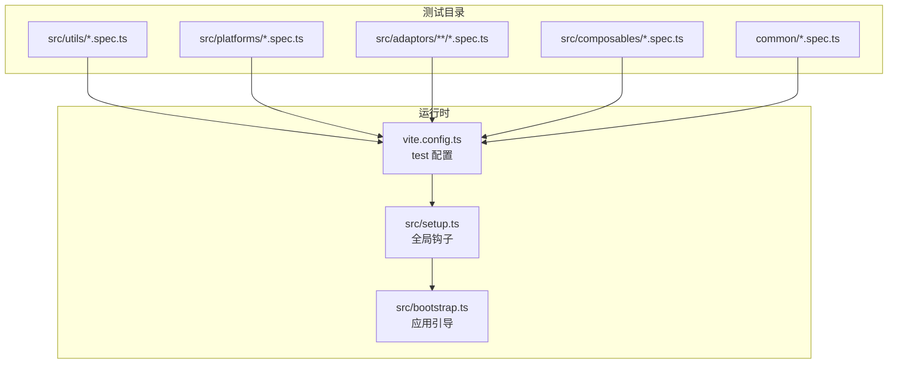
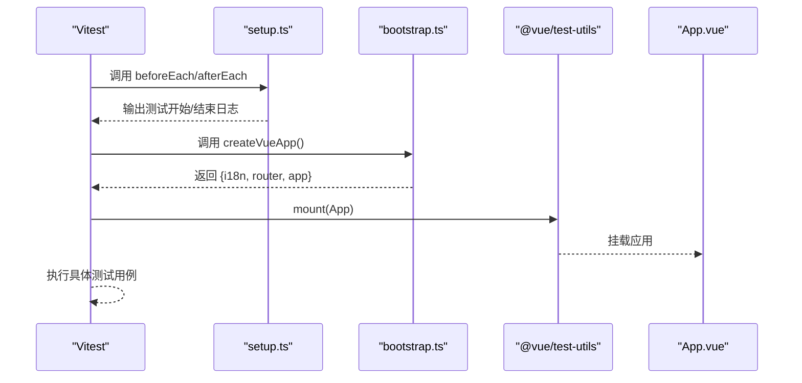
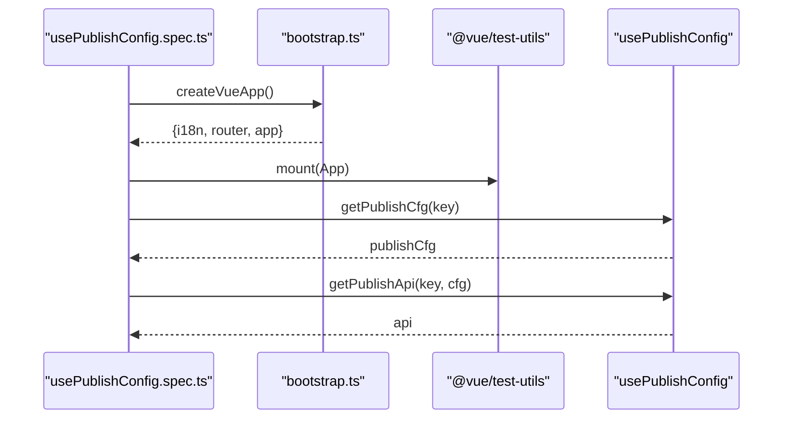
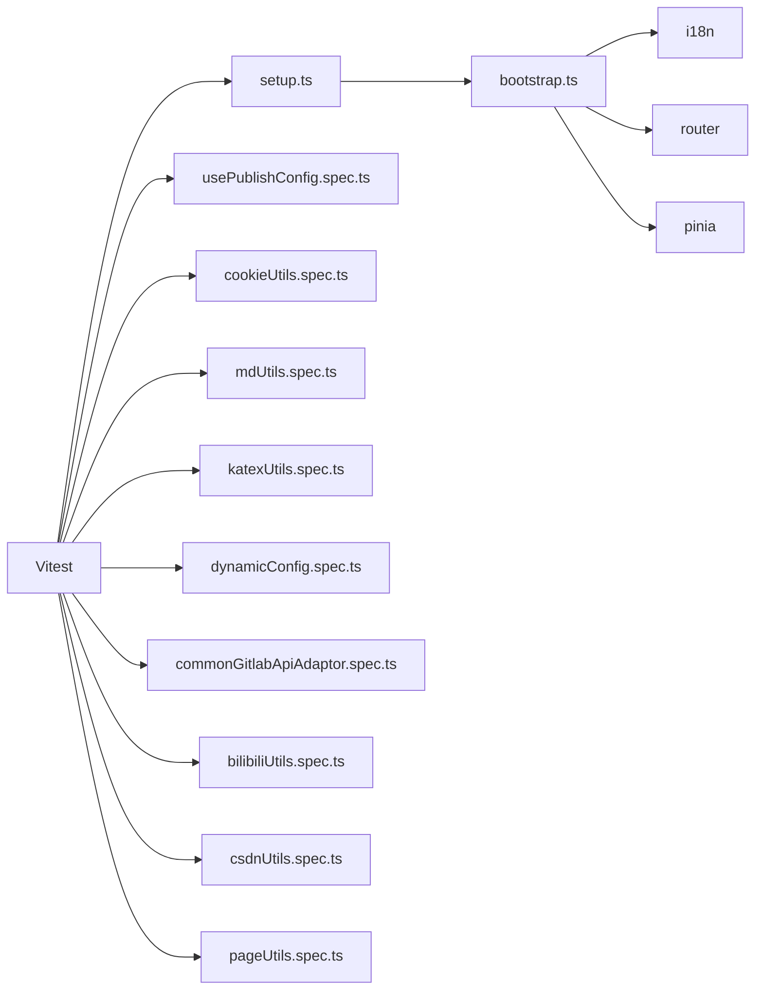

# 测试与调试

<cite>
**本文引用的文件**
- [usePublishConfig.spec.ts](file://src/composables/usePublishConfig.spec.ts)
- [cookieUtils.spec.ts](file://src/utils/cookieUtils.spec.ts)
- [pageUtils.spec.ts](file://common/pageUtils.spec.ts)
- [mdUtils.spec.ts](file://src/utils/mdUtils.spec.ts)
- [katexUtils.spec.ts](file://src/utils/katexUtils.spec.ts)
- [dynamicConfig.spec.ts](file://src/platforms/dynamicConfig.spec.ts)
- [commonGitlabApiAdaptor.spec.ts](file://src/adaptors/api/base/gitlab/commonGitlabApiAdaptor.spec.ts)
- [bilibiliUtils.spec.ts](file://src/adaptors/web/bilibili/bilibiliUtils.spec.ts)
- [csdnUtils.spec.ts](file://src/adaptors/web/csdn/csdnUtils.spec.ts)
- [setup.ts](file://src/setup.ts)
- [bootstrap.ts](file://src/bootstrap.ts)
- [vite.config.ts](file://vite.config.ts)
- [package.json](file://package.json)
</cite>

## 目录
1. [简介](#简介)
2. [项目结构](#项目结构)
3. [核心组件](#核心组件)
4. [架构总览](#架构总览)
5. [详细组件分析](#详细组件分析)
6. [依赖分析](#依赖分析)
7. [性能考虑](#性能考虑)
8. [故障排查指南](#故障排查指南)
9. [结论](#结论)
10. [附录](#附录)

## 简介
本指南聚焦于本项目的“测试与调试”主题，围绕单元测试编写方法、组件测试最佳实践、调试工具使用以及常见问题排查展开。文档基于仓库中的实际测试文件与配置进行分析，帮助开发者快速上手并高效定位问题。

## 项目结构
本项目采用前端单页应用（Vue 3 + Vite）架构，测试覆盖通用工具、平台适配器、组合式函数与页面级功能模块。测试文件主要分布在以下位置：
- src/utils：通用工具函数测试（如 cookie、Markdown 处理、KaTeX 渲染）
- src/platforms：平台动态配置测试
- src/adaptors：各平台适配器测试（如 GitLab、博客站点、Web 平台）
- src/composables：组合式函数测试（如发布配置）
- common：公共工具测试
- src：测试入口与全局钩子（setup.ts），以及应用引导（bootstrap.ts）
- 配置：vite.config.ts 中的 test 字段定义了 Vitest 环境与包含规则；package.json 提供测试脚本

图表来源
- [vite.config.ts:258-273](file://vite.config.ts#L258-L273)
- [setup.ts:10-19](file://src/setup.ts#L10-L19)
- [bootstrap.ts:25-50](file://src/bootstrap.ts#L25-L50)

章节来源
- [vite.config.ts:258-273](file://vite.config.ts#L258-L273)
- [package.json:9-27](file://package.json#L9-L27)

## 核心组件
- 测试运行器与环境
  - Vitest + jsdom 环境，支持全局钩子与 setupFiles
  - 测试包含范围覆盖 src 与 common 下的 *.spec.* 文件
- 应用引导与测试挂载
  - 通过 bootstrap.ts 创建 Vue 应用实例，注入 i18n、router、pinia 等
  - 组件测试通过 @vue/test-utils 的 mount 对 App.vue 进行挂载
- 全局钩子
  - setup.ts 提供 beforeEach/afterEach 日志输出，便于观察测试生命周期

章节来源
- [vite.config.ts:258-273](file://vite.config.ts#L258-L273)
- [setup.ts:10-19](file://src/setup.ts#L10-L19)
- [bootstrap.ts:25-50](file://src/bootstrap.ts#L25-L50)

## 架构总览
下图展示了测试执行的关键流程：Vitest 启动 -> 加载 setup.ts -> 创建 Vue 应用 -> 挂载组件或调用工具函数 -> 断言与输出。

图表来源
- [setup.ts:10-19](file://src/setup.ts#L10-L19)
- [bootstrap.ts:25-50](file://src/bootstrap.ts#L25-L50)
- [usePublishConfig.spec.ts:16-33](file://src/composables/usePublishConfig.spec.ts#L16-L33)

## 详细组件分析

### 组合式函数测试：usePublishConfig.spec.ts
- 测试目标
  - 验证发布配置获取与 API 实例构建流程
- 关键步骤
  - 创建 Vue 应用实例并注入 i18n、router
  - 设置必要环境变量（默认类型、API 地址、开发页面 ID 等）
  - 挂载 App.vue，随后调用 usePublishConfig 获取配置与 API
- 断言与输出
  - 通过 console.log 输出中间结果，便于调试
- 最佳实践
  - 在 beforeEach 中统一注入插件与环境变量
  - 使用真实 App.vue 挂载确保路由与 i18n 生效
  - 对异步 API 调用添加超时与错误捕获（建议）

图表来源
- [usePublishConfig.spec.ts:16-51](file://src/composables/usePublishConfig.spec.ts#L16-L51)
- [bootstrap.ts:25-50](file://src/bootstrap.ts#L25-L50)

章节来源
- [usePublishConfig.spec.ts:16-51](file://src/composables/usePublishConfig.spec.ts#L16-L51)
- [bootstrap.ts:25-50](file://src/bootstrap.ts#L25-L50)

### 工具函数测试：cookieUtils.spec.ts
- 测试目标
  - 验证 Cookie 数组合并、按键提取对象与值
- 关键点
  - 输入为空数组与重复键场景
  - 输出通过 console.log 辅助验证
- 最佳实践
  - 为边界条件（空输入、重复键、过期时间）补充断言
  - 使用小而明确的用例命名，便于定位失败原因

章节来源
- [cookieUtils.spec.ts:13-45](file://src/utils/cookieUtils.spec.ts#L13-L45)

### 平台动态配置测试：dynamicConfig.spec.ts
- 测试目标
  - 验证平台键生成与子平台类型解析
- 关键点
  - 使用 expect 断言返回值类型与格式
- 最佳实践
  - 对返回值使用正则匹配或枚举对比，确保健壮性

章节来源
- [dynamicConfig.spec.ts:18-34](file://src/platforms/dynamicConfig.spec.ts#L18-L34)

### Markdown 工具测试：mdUtils.spec.ts
- 测试目标
  - 验证符号替换、人类可读文件名生成等
- 关键点
  - 多种标记符与数学公式混合场景
- 最佳实践
  - 为复杂字符串处理增加断言，确保替换前后一致性

章节来源
- [mdUtils.spec.ts:13-88](file://src/utils/mdUtils.spec.ts#L13-L88)

### KaTeX 工具测试：katexUtils.spec.ts
- 测试目标
  - 验证数学表达式渲染为 HTML
- 关键点
  - 渲染结果可通过 console.log 观察
- 最佳实践
  - 对渲染结果进行结构化断言（如包含特定标签）

章节来源
- [katexUtils.spec.ts:13-19](file://src/utils/katexUtils.spec.ts#L13-L19)

### Web 平台工具测试：bilibiliUtils.spec.ts、csdnUtils.spec.ts
- 测试目标
  - bilibili：上传 ID 生成、Markdown 解析（需加载 Lute 资源）
  - csdn：X-Ca-Nonce 与签名生成
- 关键点
  - bilibili 测试通过 require 注入外部脚本
  - csdn 测试覆盖 GET/POST 不同场景的签名生成
- 最佳实践
  - 对外部资源加载进行容错处理
  - 对签名算法参数进行边界测试

章节来源
- [bilibiliUtils.spec.ts:14-29](file://src/adaptors/web/bilibili/bilibiliUtils.spec.ts#L14-L29)
- [csdnUtils.spec.ts:13-46](file://src/adaptors/web/csdn/csdnUtils.spec.ts#L13-L46)

### API 适配器测试：commonGitlabApiAdaptor.spec.ts
- 测试目标
  - 调用 GitLab API 获取用户博客列表
- 关键点
  - 通过 PublisherAppInstance 初始化适配器
  - 配置 apiUrl、home、默认消息等参数
- 最佳实践
  - 为网络请求添加超时与错误断言
  - 使用 mock 或本地服务替代真实外部依赖

章节来源
- [commonGitlabApiAdaptor.spec.ts:15-30](file://src/adaptors/api/base/gitlab/commonGitlabApiAdaptor.spec.ts#L15-L30)

### 页面工具测试：pageUtils.spec.ts
- 测试目标
  - 子平台名称截取
- 关键点
  - 通过 console.log 输出结果
- 最佳实践
  - 补充断言与边界值测试（长度、字符集）

章节来源
- [pageUtils.spec.ts:29-34](file://common/pageUtils.spec.ts#L29-L34)

## 依赖分析
- 测试运行时依赖
  - Vitest、@vue/test-utils、jsdom
  - setup.ts 作为全局钩子，贯穿所有测试用例
- 应用引导依赖
  - bootstrap.ts 注入 i18n、router、pinia，保证组件测试上下文完整
- 平台与适配器依赖
  - 各平台适配器依赖外部 API 与资源（如 Lute），测试中需注意资源加载与网络请求

图表来源
- [vite.config.ts:258-273](file://vite.config.ts#L258-L273)
- [setup.ts:10-19](file://src/setup.ts#L10-L19)
- [bootstrap.ts:25-50](file://src/bootstrap.ts#L25-L50)
- [usePublishConfig.spec.ts:16-51](file://src/composables/usePublishConfig.spec.ts#L16-L51)
- [cookieUtils.spec.ts:13-45](file://src/utils/cookieUtils.spec.ts#L13-L45)
- [mdUtils.spec.ts:13-88](file://src/utils/mdUtils.spec.ts#L13-L88)
- [katexUtils.spec.ts:13-19](file://src/utils/katexUtils.spec.ts#L13-L19)
- [dynamicConfig.spec.ts:18-34](file://src/platforms/dynamicConfig.spec.ts#L18-L34)
- [commonGitlabApiAdaptor.spec.ts:15-30](file://src/adaptors/api/base/gitlab/commonGitlabApiAdaptor.spec.ts#L15-L30)
- [bilibiliUtils.spec.ts:14-29](file://src/adaptors/web/bilibili/bilibiliUtils.spec.ts#L14-L29)
- [csdnUtils.spec.ts:13-46](file://src/adaptors/web/csdn/csdnUtils.spec.ts#L13-L46)
- [pageUtils.spec.ts:29-34](file://common/pageUtils.spec.ts#L29-L34)

章节来源
- [vite.config.ts:258-273](file://vite.config.ts#L258-L273)
- [setup.ts:10-19](file://src/setup.ts#L10-L19)
- [bootstrap.ts:25-50](file://src/bootstrap.ts#L25-L50)

## 性能考虑
- 测试执行性能
  - 使用 jsdom 环境减少浏览器启动开销
  - 通过 setup.ts 统一注入插件，避免重复初始化
- 资源加载
  - 对外部资源（如 Lute）在测试中进行按需加载，避免阻塞
- 断言策略
  - 对耗时操作（如 API 请求）建议结合覆盖率与超时控制，提升反馈效率

## 故障排查指南
- 测试未运行或找不到用例
  - 检查 vite.config.ts 的 include 规则是否包含当前文件路径
  - 确认文件命名符合 *.spec.* 或 *.test.* 约定
- 组件挂载失败或路由/i18n无效
  - 确保在 beforeEach 中正确设置 config.global.plugins 与环境变量
  - 使用 createVueApp 返回的 i18n、router 注入
- 外部资源加载失败（如 Lute）
  - 确认资源路径与打包后的 public/libs 结构一致
  - 在测试中显式 require 对应脚本
- 网络请求不稳定
  - 为适配器测试添加超时与错误断言
  - 使用本地 mock 或受控环境替代真实外部 API
- 日志与调试
  - 利用 setup.ts 的 beforeEach/afterEach 输出观察测试生命周期
  - 通过 console.log 输出中间状态，辅助定位问题

章节来源
- [vite.config.ts:258-273](file://vite.config.ts#L258-L273)
- [setup.ts:10-19](file://src/setup.ts#L10-L19)
- [bilibiliUtils.spec.ts:20-28](file://src/adaptors/web/bilibili/bilibiliUtils.spec.ts#L20-L28)
- [commonGitlabApiAdaptor.spec.ts:26-29](file://src/adaptors/api/base/gitlab/commonGitlabApiAdaptor.spec.ts#L26-L29)

## 结论
本项目的测试体系以 Vitest + jsdom 为核心，结合 @vue/test-utils 与 bootstrap.ts 的应用引导，实现了对组合式函数、工具函数、平台适配器与页面工具的系统化验证。通过统一的全局钩子与明确的测试用例结构，开发者可以快速扩展新测试并高效定位问题。建议在后续迭代中进一步完善断言策略与外部依赖的可控性，持续提升测试稳定性与可维护性。

## 附录
- 常用命令
  - 运行测试：参见 package.json 中的 test 脚本
  - 生成覆盖率：参见 package.json 中的 coverage 脚本
- 测试文件命名规范
  - 工具函数测试：src/utils/*.spec.ts
  - 平台配置测试：src/platforms/*.spec.ts
  - 适配器测试：src/adaptors/**/*Adaptor.spec.ts
  - 组合式函数测试：src/composables/*.spec.ts
  - 页面工具测试：common/*.spec.ts

章节来源
- [package.json:9-27](file://package.json#L9-L27)
- [vite.config.ts:264-267](file://vite.config.ts#L264-L267)