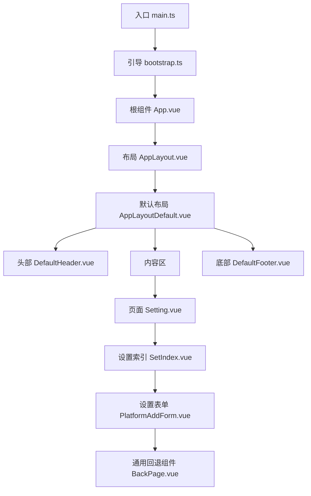
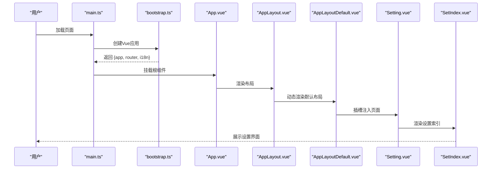
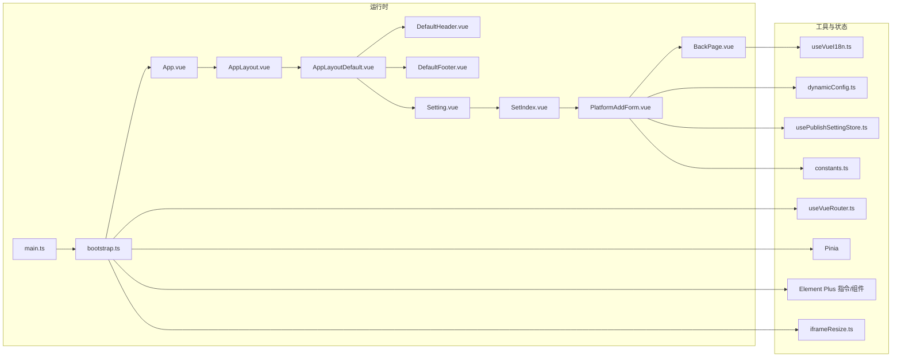

# 组件扩展开发

<cite>
**本文引用的文件**
- [src/App.vue](file://src/App.vue)
- [src/main.ts](file://src/main.ts)
- [src/bootstrap.ts](file://src/bootstrap.ts)
- [src/layouts/AppLayout.vue](file://src/layouts/AppLayout.vue)
- [src/layouts/default/AppLayoutDefault.vue](file://src/layouts/default/AppLayoutDefault.vue)
- [src/layouts/default/DefaultHeader.vue](file://src/layouts/default/DefaultHeader.vue)
- [src/layouts/default/DefaultFooter.vue](file://src/layouts/default/DefaultFooter.vue)
- [src/pages/Setting.vue](file://src/pages/Setting.vue)
- [src/components/set/SetIndex.vue](file://src/components/set/SetIndex.vue)
- [src/components/common/BackPage.vue](file://src/components/common/BackPage.vue)
- [src/components/common/DrawerBoxBridge.vue](file://src/components/common/DrawerBoxBridge.vue)
- [src/components/publish/form/PublishTitle.vue](file://src/components/publish/form/PublishTitle.vue)
- [src/components/set/publish/form/PlatformAddForm.vue](file://src/components/set/publish/form/PlatformAddForm.vue)
- [src/composables/useVueI18n.ts](file://src/composables/useVueI18n.ts)
- [src/composables/useVueRouter.ts](file://src/composables/useVueRouter.ts)
- [src/assets/style.css](file://src/assets/style.css)
- [src/assets/style.dark.css](file://src/assets/style.dark.css)
- [src/utils/directives/iframeResize.ts](file://src/utils/directives/iframeResize.ts)
- [src/stores/usePublishSettingStore.ts](file://src/stores/usePublishSettingStore.ts)
- [src/platforms/dynamicConfig.ts](file://src/platforms/dynamicConfig.ts)
- [src/utils/constants.ts](file://src/utils/constants.ts)
- [src/locales/index.ts](file://src/locales/index.ts)
- [src/locales/zh_CN.ts](file://src/locales/zh_CN.ts)
- [src/locales/en_US.ts](file://src/locales/en_US.ts)
</cite>

## 目录
1. [简介](#简介)
2. [项目结构](#项目结构)
3. [核心组件](#核心组件)
4. [架构总览](#架构总览)
5. [组件详解](#组件详解)
6. [依赖关系分析](#依赖关系分析)
7. [性能与可维护性](#性能与可维护性)
8. [故障排查指南](#故障排查指南)
9. [结论](#结论)
10. [附录：开发规范与示例路径](#附录开发规范与示例路径)

## 简介
本指南面向希望在本项目中扩展Vue 3组件的开发者，系统讲解页面组件、布局组件、设置组件的开发模式与最佳实践，涵盖props传递、事件处理、插槽使用、样式定制、国际化、响应式设计、组件复用策略等。通过实际源码中的组件与架构，帮助你快速创建符合项目标准的组件。

## 项目结构
本项目采用“页面-布局-组件”三层结构组织，配合Pinia状态管理、Element Plus UI、国际化与指令扩展，形成清晰的组件化开发范式。

图表来源
- [src/main.ts:15-21](file://src/main.ts#L15-L21)
- [src/bootstrap.ts:25-50](file://src/bootstrap.ts#L25-L50)
- [src/App.vue:18-22](file://src/App.vue#L18-L22)
- [src/layouts/AppLayout.vue:10-16](file://src/layouts/AppLayout.vue#L10-L16)
- [src/layouts/default/AppLayoutDefault.vue:10-17](file://src/layouts/default/AppLayoutDefault.vue#L10-L17)
- [src/pages/Setting.vue:14-16](file://src/pages/Setting.vue#L14-L16)
- [src/components/set/SetIndex.vue:14-16](file://src/components/set/SetIndex.vue#L14-L16)
- [src/components/set/publish/form/PlatformAddForm.vue:202-268](file://src/components/set/publish/form/PlatformAddForm.vue#L202-L268)
- [src/components/common/BackPage.vue:73-99](file://src/components/common/BackPage.vue#L73-L99)

章节来源
- [src/main.ts:15-21](file://src/main.ts#L15-L21)
- [src/bootstrap.ts:25-50](file://src/bootstrap.ts#L25-L50)
- [src/App.vue:18-22](file://src/App.vue#L18-L22)
- [src/layouts/AppLayout.vue:10-16](file://src/layouts/AppLayout.vue#L10-L16)
- [src/layouts/default/AppLayoutDefault.vue:10-17](file://src/layouts/default/AppLayoutDefault.vue#L10-L17)

## 核心组件
- 页面组件：如设置页组件，负责承载业务页面容器，内部再组合上层设置索引组件。
- 布局组件：统一的布局骨架，支持动态切换布局（通过AppLayout.vue的动态组件）。
- 通用组件：如BackPage用于统一的返回与帮助交互，DrawerBoxBridge用于嵌入外部页面。
- 表单组件：如PublishTitle用于标题输入与AI辅助取名，PlatformAddForm用于平台配置表单的增改。

章节来源
- [src/pages/Setting.vue:10-16](file://src/pages/Setting.vue#L10-L16)
- [src/components/set/SetIndex.vue:10-16](file://src/components/set/SetIndex.vue#L10-L16)
- [src/layouts/AppLayout.vue:18-23](file://src/layouts/AppLayout.vue#L18-L23)
- [src/layouts/default/AppLayoutDefault.vue:10-17](file://src/layouts/default/AppLayoutDefault.vue#L10-L17)
- [src/components/common/BackPage.vue:26-46](file://src/components/common/BackPage.vue#L26-L46)
- [src/components/common/DrawerBoxBridge.vue:14-34](file://src/components/common/DrawerBoxBridge.vue#L14-L34)
- [src/components/publish/form/PublishTitle.vue:22-77](file://src/components/publish/form/PublishTitle.vue#L22-L77)
- [src/components/set/publish/form/PlatformAddForm.vue:45-130](file://src/components/set/publish/form/PlatformAddForm.vue#L45-L130)

## 架构总览
应用启动流程与组件层次如下：

图表来源
- [src/main.ts:15-21](file://src/main.ts#L15-L21)
- [src/bootstrap.ts:25-50](file://src/bootstrap.ts#L25-L50)
- [src/App.vue:18-22](file://src/App.vue#L18-L22)
- [src/layouts/AppLayout.vue:10-16](file://src/layouts/AppLayout.vue#L10-L16)
- [src/layouts/default/AppLayoutDefault.vue:10-17](file://src/layouts/default/AppLayoutDefault.vue#L10-L17)
- [src/pages/Setting.vue:14-16](file://src/pages/Setting.vue#L14-L16)
- [src/components/set/SetIndex.vue:14-16](file://src/components/set/SetIndex.vue#L14-L16)

## 组件详解

### 页面组件开发模式
- 设计要点
  - 页面组件作为路由出口的容器，职责单一：仅负责引入并渲染对应设置或功能索引组件。
  - 保持轻薄，避免在页面组件内做复杂逻辑，复杂逻辑下沉到索引组件或具体业务组件。
- 示例路径
  - 设置页面容器：[src/pages/Setting.vue:10-16](file://src/pages/Setting.vue#L10-L16)
  - 设置索引容器：[src/components/set/SetIndex.vue:10-16](file://src/components/set/SetIndex.vue#L10-L16)

章节来源
- [src/pages/Setting.vue:10-16](file://src/pages/Setting.vue#L10-L16)
- [src/components/set/SetIndex.vue:10-16](file://src/components/set/SetIndex.vue#L10-L16)

### 布局组件开发模式
- 设计要点
  - AppLayout.vue通过动态组件机制选择布局实现，默认指向AppLayoutDefault.vue。
  - AppLayoutDefault.vue提供统一的头部、内容区与底部结构，并通过插槽承载页面内容。
  - 可扩展：新增布局时只需在AppLayout.vue中切换目标组件即可。
- 示例路径
  - 动态布局入口：[src/layouts/AppLayout.vue:18-23](file://src/layouts/AppLayout.vue#L18-L23)
  - 默认布局骨架：[src/layouts/default/AppLayoutDefault.vue:10-17](file://src/layouts/default/AppLayoutDefault.vue#L10-L17)
  - 布局头部与底部：[src/layouts/default/DefaultHeader.vue](file://src/layouts/default/DefaultHeader.vue)，[src/layouts/default/DefaultFooter.vue](file://src/layouts/default/DefaultFooter.vue)

章节来源
- [src/layouts/AppLayout.vue:18-23](file://src/layouts/AppLayout.vue#L18-L23)
- [src/layouts/default/AppLayoutDefault.vue:10-17](file://src/layouts/default/AppLayoutDefault.vue#L10-L17)

### 设置组件开发模式
- 设计要点
  - 以表单为中心，结合动态配置与Pinia存储，实现平台配置的增删改查。
  - 表单校验与提示使用Element Plus的表单规则与消息组件。
  - 支持从预设模板初始化新配置，保证一致性与可扩展性。
- 示例路径
  - 新增平台表单：[src/components/set/publish/form/PlatformAddForm.vue:45-130](file://src/components/set/publish/form/PlatformAddForm.vue#L45-L130)
  - 动态配置工具：[src/platforms/dynamicConfig.ts](file://src/platforms/dynamicConfig.ts)
  - 设置存储：[src/stores/usePublishSettingStore.ts](file://src/stores/usePublishSettingStore.ts)
  - 常量键名：[src/utils/constants.ts:1-50](file://src/utils/constants.ts#L1-L50)

章节来源
- [src/components/set/publish/form/PlatformAddForm.vue:45-130](file://src/components/set/publish/form/PlatformAddForm.vue#L45-L130)
- [src/platforms/dynamicConfig.ts](file://src/platforms/dynamicConfig.ts)
- [src/stores/usePublishSettingStore.ts](file://src/stores/usePublishSettingStore.ts)
- [src/utils/constants.ts](file://src/utils/constants.ts)

### 通用组件：BackPage
- 设计要点
  - 提供统一的返回按钮、帮助入口与插槽承载内容的能力。
  - 支持通过属性控制是否显示返回按钮与帮助键，通过事件回传自定义返回行为。
  - 国际化文案通过useVueI18n封装读取。
- 示例路径
  - 统一头部与帮助：[src/components/common/BackPage.vue:26-70](file://src/components/common/BackPage.vue#L26-L70)
  - 回退与帮助交互：[src/components/common/BackPage.vue:48-66](file://src/components/common/BackPage.vue#L48-L66)
  - 国际化封装：[src/composables/useVueI18n.ts:16-25](file://src/composables/useVueI18n.ts#L16-L25)

章节来源
- [src/components/common/BackPage.vue:26-70](file://src/components/common/BackPage.vue#L26-L70)
- [src/components/common/BackPage.vue:48-66](file://src/components/common/BackPage.vue#L48-L66)
- [src/composables/useVueI18n.ts:16-25](file://src/composables/useVueI18n.ts#L16-L25)

### 通用组件：DrawerBoxBridge
- 设计要点
  - 通过iframe桥接外部页面，内置指令自动适配高度与加载提示。
  - 适合在设置或详情页中嵌入第三方页面或外部站点。
- 示例路径
  - 嵌入桥接：[src/components/common/DrawerBoxBridge.vue:24-34](file://src/components/common/DrawerBoxBridge.vue#L24-L34)
  - 指令注册与使用：[src/utils/directives/iframeResize.ts](file://src/utils/directives/iframeResize.ts)，[src/bootstrap.ts:46-47](file://src/bootstrap.ts#L46-L47)

章节来源
- [src/components/common/DrawerBoxBridge.vue:24-34](file://src/components/common/DrawerBoxBridge.vue#L24-L34)
- [src/utils/directives/iframeResize.ts](file://src/utils/directives/iframeResize.ts)
- [src/bootstrap.ts:46-47](file://src/bootstrap.ts#L46-L47)

### 表单组件：PublishTitle
- 设计要点
  - 双向绑定modelValue，支持watch同步外部值变化。
  - 可选AI辅助取名，调用ChatGPT并解析返回结果，更新标题。
  - 通过事件emitSyncPublishTitle向上游同步标题变更。
- 示例路径
  - Props与watch：[src/components/publish/form/PublishTitle.vue:22-75](file://src/components/publish/form/PublishTitle.vue#L22-L75)
  - 事件发射与AI取名：[src/components/publish/form/PublishTitle.vue:77-115](file://src/components/publish/form/PublishTitle.vue#L77-L115)

章节来源
- [src/components/publish/form/PublishTitle.vue:22-75](file://src/components/publish/form/PublishTitle.vue#L22-L75)
- [src/components/publish/form/PublishTitle.vue:77-115](file://src/components/publish/form/PublishTitle.vue#L77-L115)

### 组件设计原则与最佳实践

- Props传递
  - 明确类型与默认值，便于上游调用时类型安全与可读性提升。
  - 对于双向绑定场景，使用modelValue并配合watch同步内部状态。
  - 示例参考：[src/components/publish/form/PublishTitle.vue:22-47](file://src/components/publish/form/PublishTitle.vue#L22-L47)，[src/components/common/BackPage.vue:26-40](file://src/components/common/BackPage.vue#L26-L40)

- 事件处理
  - 使用defineEmits声明对外事件，确保事件命名语义化且与用途一致。
  - 将复杂交互拆分为多个小事件，便于复用与测试。
  - 示例参考：[src/components/publish/form/PublishTitle.vue:77-81](file://src/components/publish/form/PublishTitle.vue#L77-L81)，[src/components/common/BackPage.vue:45-56](file://src/components/common/BackPage.vue#L45-L56)

- 插槽使用
  - 在布局与通用容器中提供插槽，使内容区可被页面组件自由填充。
  - 示例参考：[src/layouts/default/AppLayoutDefault.vue:13-16](file://src/layouts/default/AppLayoutDefault.vue#L13-L16)，[src/components/common/BackPage.vue:95-98](file://src/components/common/BackPage.vue#L95-L98)

- 样式定制
  - 使用scoped样式隔离组件样式，必要时通过深度选择器(:deep)对第三方UI进行局部覆盖。
  - 项目提供全局样式与深色主题变量，遵循项目约定。
  - 示例参考：[src/assets/style.css:26-33](file://src/assets/style.css#L26-L33)，[src/assets/style.dark.css:10-14](file://src/assets/style.dark.css#L10-L14)，[src/components/set/publish/form/PlatformAddForm.vue:271-289](file://src/components/set/publish/form/PlatformAddForm.vue#L271-L289)

- 国际化
  - 使用useVueI18n封装，兼容CSP限制，提供t函数与当前locale。
  - 在组件中通过t(key)读取文案，避免硬编码。
  - 示例参考：[src/composables/useVueI18n.ts:16-25](file://src/composables/useVueI18n.ts#L16-L25)，[src/components/publish/form/PublishTitle.vue:19-21](file://src/components/publish/form/PublishTitle.vue#L19-L21)，[src/components/set/publish/form/PlatformAddForm.vue:61-80](file://src/components/set/publish/form/PlatformAddForm.vue#L61-L80)

- 响应式设计
  - 通过CSS媒体查询与全局字体、字号、最小宽度等约束，保证在不同设备上的可用性。
  - 示例参考：[src/assets/style.css:30-33](file://src/assets/style.css#L30-L33)，[src/assets/style.css:67-72](file://src/assets/style.css#L67-L72)

- 组件复用策略
  - 将通用交互（如返回、帮助、加载）抽象为通用组件，减少重复代码。
  - 将页面容器与布局解耦，通过插槽与动态组件实现灵活组合。
  - 示例参考：[src/components/common/BackPage.vue:26-70](file://src/components/common/BackPage.vue#L26-L70)，[src/layouts/AppLayout.vue:18-23](file://src/layouts/AppLayout.vue#L18-L23)

章节来源
- [src/components/publish/form/PublishTitle.vue:22-47](file://src/components/publish/form/PublishTitle.vue#L22-L47)
- [src/components/common/BackPage.vue:26-40](file://src/components/common/BackPage.vue#L26-L40)
- [src/components/publish/form/PublishTitle.vue:77-81](file://src/components/publish/form/PublishTitle.vue#L77-L81)
- [src/layouts/default/AppLayoutDefault.vue:13-16](file://src/layouts/default/AppLayoutDefault.vue#L13-L16)
- [src/assets/style.css:26-33](file://src/assets/style.css#L26-L33)
- [src/assets/style.css:67-72](file://src/assets/style.css#L67-L72)
- [src/composables/useVueI18n.ts:16-25](file://src/composables/useVueI18n.ts#L16-L25)
- [src/components/set/publish/form/PlatformAddForm.vue:61-80](file://src/components/set/publish/form/PlatformAddForm.vue#L61-L80)
- [src/layouts/AppLayout.vue:18-23](file://src/layouts/AppLayout.vue#L18-L23)

## 依赖关系分析

图表来源
- [src/main.ts:15-21](file://src/main.ts#L15-L21)
- [src/bootstrap.ts:25-50](file://src/bootstrap.ts#L25-L50)
- [src/App.vue:18-22](file://src/App.vue#L18-L22)
- [src/layouts/AppLayout.vue:18-23](file://src/layouts/AppLayout.vue#L18-L23)
- [src/layouts/default/AppLayoutDefault.vue:10-17](file://src/layouts/default/AppLayoutDefault.vue#L10-L17)
- [src/pages/Setting.vue:14-16](file://src/pages/Setting.vue#L14-L16)
- [src/components/set/SetIndex.vue:14-16](file://src/components/set/SetIndex.vue#L14-L16)
- [src/components/set/publish/form/PlatformAddForm.vue:45-130](file://src/components/set/publish/form/PlatformAddForm.vue#L45-L130)
- [src/components/common/BackPage.vue:26-70](file://src/components/common/BackPage.vue#L26-L70)
- [src/composables/useVueRouter.ts](file://src/composables/useVueRouter.ts)
- [src/utils/directives/iframeResize.ts](file://src/utils/directives/iframeResize.ts)
- [src/platforms/dynamicConfig.ts](file://src/platforms/dynamicConfig.ts)
- [src/stores/usePublishSettingStore.ts](file://src/stores/usePublishSettingStore.ts)
- [src/utils/constants.ts](file://src/utils/constants.ts)
- [src/composables/useVueI18n.ts](file://src/composables/useVueI18n.ts)

章节来源
- [src/main.ts:15-21](file://src/main.ts#L15-L21)
- [src/bootstrap.ts:25-50](file://src/bootstrap.ts#L25-L50)
- [src/layouts/AppLayout.vue:18-23](file://src/layouts/AppLayout.vue#L18-L23)
- [src/platforms/dynamicConfig.ts](file://src/platforms/dynamicConfig.ts)
- [src/stores/usePublishSettingStore.ts](file://src/stores/usePublishSettingStore.ts)

## 性能与可维护性
- 按需引入UI组件与指令，避免打包体积膨胀（参考引导文件中注释说明）。
- 使用Pinia集中管理设置类数据，避免跨组件重复请求与状态漂移。
- 通用组件尽量无副作用，props驱动行为，便于测试与复用。
- 样式使用scoped与深度选择器相结合，避免全局污染同时满足第三方UI覆盖需求。

## 故障排查指南
- 国际化文案缺失
  - 现象：组件中出现key而非文案。
  - 处理：确认useVueI18n封装是否正确返回t函数，检查locales目录下的语言包是否完整。
  - 参考：[src/composables/useVueI18n.ts:16-25](file://src/composables/useVueI18n.ts#L16-L25)，[src/locales/index.ts](file://src/locales/index.ts)，[src/locales/zh_CN.ts](file://src/locales/zh_CN.ts)，[src/locales/en_US.ts](file://src/locales/en_US.ts)

- 表单校验失败
  - 现象：提交时报错或无法提交。
  - 处理：检查表单规则与字段映射，确认必填项与唯一性校验逻辑。
  - 参考：[src/components/set/publish/form/PlatformAddForm.vue:61-95](file://src/components/set/publish/form/PlatformAddForm.vue#L61-L95)

- 动态配置未生效
  - 现象：新增平台后列表不更新或配置未写入。
  - 处理：确认动态配置序列化与存储键名一致，检查存储更新流程。
  - 参考：[src/platforms/dynamicConfig.ts](file://src/platforms/dynamicConfig.ts)，[src/stores/usePublishSettingStore.ts](file://src/stores/usePublishSettingStore.ts)，[src/utils/constants.ts](file://src/utils/constants.ts)

- 嵌入页面高度异常
  - 现象：iframe高度不正确或滚动条异常。
  - 处理：确认指令已注册并在组件中正确使用，检查iframeResize指令实现。
  - 参考：[src/utils/directives/iframeResize.ts](file://src/utils/directives/iframeResize.ts)，[src/bootstrap.ts:46-47](file://src/bootstrap.ts#L46-L47)，[src/components/common/DrawerBoxBridge.vue:24-34](file://src/components/common/DrawerBoxBridge.vue#L24-L34)

章节来源
- [src/composables/useVueI18n.ts:16-25](file://src/composables/useVueI18n.ts#L16-L25)
- [src/components/set/publish/form/PlatformAddForm.vue:61-95](file://src/components/set/publish/form/PlatformAddForm.vue#L61-L95)
- [src/platforms/dynamicConfig.ts](file://src/platforms/dynamicConfig.ts)
- [src/stores/usePublishSettingStore.ts](file://src/stores/usePublishSettingStore.ts)
- [src/utils/constants.ts](file://src/utils/constants.ts)
- [src/utils/directives/iframeResize.ts](file://src/utils/directives/iframeResize.ts)
- [src/bootstrap.ts:46-47](file://src/bootstrap.ts#L46-L47)
- [src/components/common/DrawerBoxBridge.vue:24-34](file://src/components/common/DrawerBoxBridge.vue#L24-L34)

## 结论
本项目提供了清晰的页面-布局-组件分层与完善的通用能力（国际化、表单校验、动态配置、嵌入桥接），开发者可在此基础上快速扩展新的页面与设置组件。建议严格遵循props/事件/插槽/样式的约定，配合Pinia与动态配置工具，实现高复用、易维护的组件生态。

## 附录：开发规范与示例路径
- 页面组件
  - 容器示例：[src/pages/Setting.vue:10-16](file://src/pages/Setting.vue#L10-L16)，[src/components/set/SetIndex.vue:10-16](file://src/components/set/SetIndex.vue#L10-L16)
- 布局组件
  - 动态布局：[src/layouts/AppLayout.vue:18-23](file://src/layouts/AppLayout.vue#L18-L23)
  - 默认布局骨架：[src/layouts/default/AppLayoutDefault.vue:10-17](file://src/layouts/default/AppLayoutDefault.vue#L10-L17)
- 通用组件
  - 返回与帮助：[src/components/common/BackPage.vue:26-70](file://src/components/common/BackPage.vue#L26-L70)
  - 嵌入桥接：[src/components/common/DrawerBoxBridge.vue:24-34](file://src/components/common/DrawerBoxBridge.vue#L24-L34)
- 表单组件
  - 标题输入与AI取名：[src/components/publish/form/PublishTitle.vue:22-115](file://src/components/publish/form/PublishTitle.vue#L22-L115)
  - 平台新增表单：[src/components/set/publish/form/PlatformAddForm.vue:45-130](file://src/components/set/publish/form/PlatformAddForm.vue#L45-L130)
- 国际化
  - 封装与使用：[src/composables/useVueI18n.ts:16-25](file://src/composables/useVueI18n.ts#L16-L25)，[src/locales/index.ts](file://src/locales/index.ts)，[src/locales/zh_CN.ts](file://src/locales/zh_CN.ts)，[src/locales/en_US.ts](file://src/locales/en_US.ts)
- 样式与主题
  - 全局样式：[src/assets/style.css:26-33](file://src/assets/style.css#L26-L33)，[src/assets/style.css:67-72](file://src/assets/style.css#L67-L72)
  - 深色主题：[src/assets/style.dark.css:10-14](file://src/assets/style.dark.css#L10-L14)
- 工具与状态
  - 引导与注册：[src/bootstrap.ts:25-50](file://src/bootstrap.ts#L25-L50)，[src/main.ts:15-21](file://src/main.ts#L15-L21)
  - 动态配置：[src/platforms/dynamicConfig.ts](file://src/platforms/dynamicConfig.ts)
  - 设置存储：[src/stores/usePublishSettingStore.ts](file://src/stores/usePublishSettingStore.ts)
  - 常量键名：[src/utils/constants.ts](file://src/utils/constants.ts)