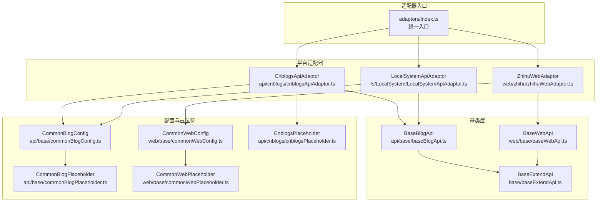
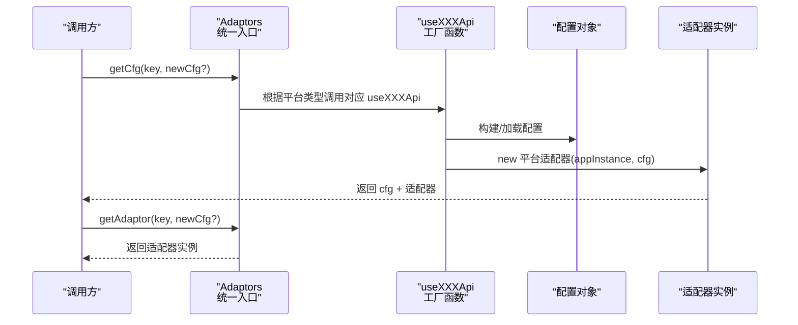
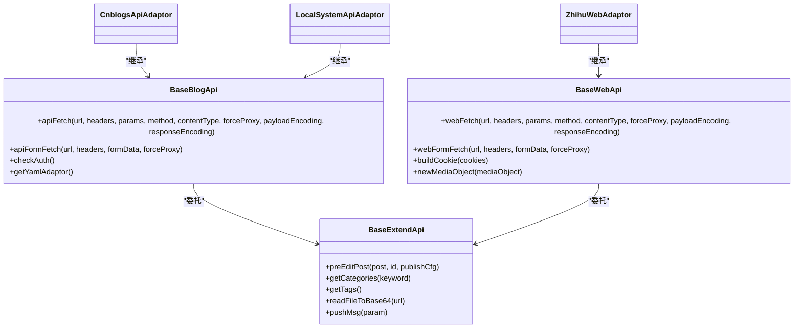

# 适配器开发指南

<cite>
**本文档引用的文件**
- [src/adaptors/base/baseExtendApi.ts](file://src/adaptors/base/baseExtendApi.ts)
- [src/adaptors/api/base/baseBlogApi.ts](file://src/adaptors/api/base/baseBlogApi.ts)
- [src/adaptors/web/base/baseWebApi.ts](file://src/adaptors/web/base/baseWebApi.ts)
- [src/adaptors/index.ts](file://src/adaptors/index.ts)
- [src/adaptors/api/base/commonBlogConfig.ts](file://src/adaptors/api/base/commonBlogConfig.ts)
- [src/adaptors/web/base/commonWebConfig.ts](file://src/adaptors/web/base/commonWebConfig.ts)
- [src/adaptors/api/cnblogs/cnblogsApiAdaptor.ts](file://src/adaptors/api/cnblogs/cnblogsApiAdaptor.ts)
- [src/adaptors/web/zhihu/zhihuWebAdaptor.ts](file://src/adaptors/web/zhihu/zhihuWebAdaptor.ts)
- [src/adaptors/fs/LocalSystem/LocalSystemApiAdaptor.ts](file://src/adaptors/fs/LocalSystem/LocalSystemApiAdaptor.ts)
- [src/adaptors/api/cnblogs/useCnblogsApi.ts](file://src/adaptors/api/cnblogs/useCnblogsApi.ts)
- [src/adaptors/web/zhihu/useZhihuWeb.ts](file://src/adaptors/web/zhihu/useZhihuWeb.ts)
- [src/adaptors/fs/LocalSystem/useLocalSystemApi.ts](file://src/adaptors/fs/LocalSystem/useLocalSystemApi.ts)
- [src/adaptors/api/base/commonBlogPlaceholder.ts](file://src/adaptors/api/base/commonBlogPlaceholder.ts)
- [src/adaptors/web/base/commonWebPlaceholder.ts](file://src/adaptors/web/base/commonWebPlaceholder.ts)
- [src/adaptors/api/cnblogs/cnblogsPlaceholder.ts](file://src/adaptors/api/cnblogs/cnblogsPlaceholder.ts)
</cite>

## 目录
1. [简介](#简介)
2. [项目结构](#项目结构)
3. [核心组件](#核心组件)
4. [架构总览](#架构总览)
5. [详细组件分析](#详细组件分析)
6. [依赖关系分析](#依赖关系分析)
7. [性能考虑](#性能考虑)
8. [故障排查指南](#故障排查指南)
9. [结论](#结论)
10. [附录](#附录)

## 简介
本指南面向希望在本项目中开发“适配器”的工程师，系统讲解适配器架构设计原理与开发流程，重点覆盖以下方面：
- 基类使用：BaseBlogApi、BaseWebApi、BaseExtendApi 的职责与协作关系
- 三类适配器的实现差异：API授权适配器、网页授权适配器、文件系统适配器
- 开发步骤：接口继承、配置类创建、占位符实现、useXXXApi 函数定义
- 关键技术点：认证机制、错误处理、性能优化、跨域代理策略

## 项目结构
适配器体系采用“按功能域分层 + 按平台类型分包”的组织方式：
- 基类层：api/base、web/base、fs/LocalSystem 提供统一抽象与通用能力
- 平台适配器：各平台（如 cnblogs、zhihu、localSystem）分别实现具体逻辑
- 统一入口：adaptors/index.ts 提供根据平台键值获取配置、适配器与 YAML 转换器的工厂方法

图表来源
- [src/adaptors/index.ts:56-573](file://src/adaptors/index.ts#L56-L573)
- [src/adaptors/api/base/baseBlogApi.ts:27-205](file://src/adaptors/api/base/baseBlogApi.ts#L27-L205)
- [src/adaptors/web/base/baseWebApi.ts:36-256](file://src/adaptors/web/base/baseWebApi.ts#L36-L256)
- [src/adaptors/base/baseExtendApi.ts:55-739](file://src/adaptors/base/baseExtendApi.ts#L55-L739)
- [src/adaptors/api/base/commonBlogConfig.ts:13-42](file://src/adaptors/api/base/commonBlogConfig.ts#L13-L42)
- [src/adaptors/web/base/commonWebConfig.ts:16-45](file://src/adaptors/web/base/commonWebConfig.ts#L16-L45)
- [src/adaptors/api/cnblogs/cnblogsApiAdaptor.ts:27-131](file://src/adaptors/api/cnblogs/cnblogsApiAdaptor.ts#L27-L131)
- [src/adaptors/web/zhihu/zhihuWebAdaptor.ts:29-459](file://src/adaptors/web/zhihu/zhihuWebAdaptor.ts#L29-L459)
- [src/adaptors/fs/LocalSystem/LocalSystemApiAdaptor.ts:42-273](file://src/adaptors/fs/LocalSystem/LocalSystemApiAdaptor.ts#L42-L273)

章节来源
- [src/adaptors/index.ts:56-573](file://src/adaptors/index.ts#L56-L573)

## 核心组件
- BaseExtendApi：封装通用预处理逻辑（文件名、摘要、分类、图片、YAML、正文、其他），并提供图片上传、外链替换、消息推送等能力
- BaseBlogApi：API授权适配器基类，负责统一的代理请求、表单请求、认证检查、YAML适配器获取
- BaseWebApi：网页授权适配器基类，负责网页抓取、Cookie拼装、文件上传、代理请求与表单请求
- 平台适配器：在各自领域内实现具体业务逻辑（如 MetaWeblog、知乎网页、本地文件系统）
- 统一入口：Adaptors 类根据平台键值返回配置、适配器与 YAML 转换器

章节来源
- [src/adaptors/base/baseExtendApi.ts:55-739](file://src/adaptors/base/baseExtendApi.ts#L55-L739)
- [src/adaptors/api/base/baseBlogApi.ts:27-205](file://src/adaptors/api/base/baseBlogApi.ts#L27-L205)
- [src/adaptors/web/base/baseWebApi.ts:36-256](file://src/adaptors/web/base/baseWebApi.ts#L36-L256)
- [src/adaptors/index.ts:56-573](file://src/adaptors/index.ts#L56-L573)

## 架构总览
适配器开发遵循“基类+平台实现+统一入口”的三层架构。基类提供通用能力，平台适配器聚焦业务细节；统一入口负责按平台键值路由到对应的 useXXXApi 工厂函数。

图表来源
- [src/adaptors/index.ts:65-263](file://src/adaptors/index.ts#L65-L263)
- [src/adaptors/api/cnblogs/useCnblogsApi.ts:30-93](file://src/adaptors/api/cnblogs/useCnblogsApi.ts#L30-L93)
- [src/adaptors/web/zhihu/useZhihuWeb.ts:25-92](file://src/adaptors/web/zhihu/useZhihuWeb.ts#L25-L92)
- [src/adaptors/fs/LocalSystem/useLocalSystemApi.ts:27-65](file://src/adaptors/fs/LocalSystem/useLocalSystemApi.ts#L27-L65)

## 详细组件分析

### 基类：BaseBlogApi（API授权）
- 职责
  - 统一代理请求：apiFetch、apiFormFetch，支持“思源代理”与“CORS代理”自动切换
  - 认证检查：checkAuth 默认返回 true，平台可覆写
  - YAML适配器：getYamlAdaptor 默认返回 null，平台可覆写
  - 预处理：委托 BaseExtendApi.preEditPost 完成通用预处理
- 关键点
  - 通过 useProxy 注入代理策略，自动选择代理或直连
  - 表单场景优先使用 zhi-formdata-fetch 或 base64 代理回传，确保 Electron 环境兼容

章节来源
- [src/adaptors/api/base/baseBlogApi.ts:27-205](file://src/adaptors/api/base/baseBlogApi.ts#L27-L205)

### 基类：BaseWebApi（网页授权）
- 职责
  - 网页抓取：webFetch、webFormFetch，支持 Cookie 注入与代理策略
  - Cookie拼装：buildCookie 将 ElectronCookie 数组拼装为字符串
  - 文件上传：newMediaObject 统一返回 Attachment 结构
  - 预处理：委托 BaseExtendApi.preEditPost 完成通用预处理
- 关键点
  - 与 BaseBlogApi 的表单/请求策略一致，但针对网页场景做了 Cookie 与 UA 的适配

章节来源
- [src/adaptors/web/base/baseWebApi.ts:36-256](file://src/adaptors/web/base/baseWebApi.ts#L36-L256)

### 基类：BaseExtendApi（通用预处理）
- 职责
  - 文件名规则：支持 [yyyy][MM][dd][category][cats][tag][tags][filename][slug] 等占位符
  - 摘要同步：短摘要与多段落标记同步
  - 分类处理：支持“路径分类”与“层级分类”合并
  - 图片处理：支持 PicGo 与平台自带上传两种模式，自动替换链接或宏
  - YAML处理：根据策略选择平台 YAML 转换器或默认生成
  - 正文处理：外链替换、标题清理、格式化
  - 预览链接：根据平台规则生成预览 URL
- 关键点
  - 通过 LuteUtil、YamlUtil、ImageUtils 等工具链保证跨平台一致性
  - 错误处理：对平台图片上传失败进行条件忽略与用户提示

章节来源
- [src/adaptors/base/baseExtendApi.ts:55-739](file://src/adaptors/base/baseExtendApi.ts#L55-L739)

### 平台适配器：CnblogsApiAdaptor（API授权）
- 特性
  - 继承 MetaWeblog 适配器，新增 Markdown 分类处理
  - getUsersBlogs/newPost/editPost/deletePost/getCategories 等方法基于 MetaWeblog 协议
  - 预览 URL 动态替换用户 ID 与文章 ID
- 开发要点
  - 在 newPost/editPost 中为文章注入 Markdown 分类
  - 重写 getPreviewUrl 以适配博客园的预览规则

章节来源
- [src/adaptors/api/cnblogs/cnblogsApiAdaptor.ts:27-131](file://src/adaptors/api/cnblogs/cnblogsApiAdaptor.ts#L27-L131)

### 平台适配器：ZhihuWebAdaptor（网页授权）
- 特性
  - 通过 Cookie 进行网页授权，模拟浏览器 UA
  - 专栏列表获取、文章草稿/发布、图片上传（阿里 OSS）
  - 预览 URL 固定为 zhuanlan.zhihu.com/p/{postid}
- 开发要点
  - 使用 zhihuFetch/webFetch/webFormFetch 统一请求
  - 图片上传需处理“上传令牌 + OSS 上传”的两阶段流程
  - 专栏收录通过 API POST 完成

章节来源
- [src/adaptors/web/zhihu/zhihuWebAdaptor.ts:29-459](file://src/adaptors/web/zhihu/zhihuWebAdaptor.ts#L29-L459)

### 平台适配器：LocalSystemApiAdaptor（文件系统）
- 特性
  - 将文章与媒体文件写入本地文件系统
  - 支持多种静态站点生成器的 YAML 适配器（Hexo/Hugo/Jekyll/Vuepress/Vitepress/Quartz/Astro）
  - 自动分类与路径替换，支持占位符路径
- 开发要点
  - 在 getUsersBlogs 中确保存储路径存在
  - 根据 fsYamlType 动态选择 YAML 转换器
  - newMediaObject 将媒体文件写入 imageStorePath

章节来源
- [src/adaptors/fs/LocalSystem/LocalSystemApiAdaptor.ts:42-273](file://src/adaptors/fs/LocalSystem/LocalSystemApiAdaptor.ts#L42-L273)

### 统一入口：Adaptors
- 职责
  - 根据平台键值返回配置对象、适配器实例与 YAML 转换器
  - 按子平台类型分支到对应 useXXXApi 工厂函数
- 关键点
  - 支持常见平台（如 Github/Gitlab/WordPress/Metaweblog/Custom/Web/FS/System）

章节来源
- [src/adaptors/index.ts:56-573](file://src/adaptors/index.ts#L56-L573)

### 配置与占位符
- 配置基类
  - CommonBlogConfig/CommonWebConfig：提供通用配置字段与占位符对象
- 占位符
  - CommonBlogPlaceholder/CommonWebPlaceholder：平台占位符基类
  - CnblogsPlaceholder：继承 MetaWeblog 占位符

章节来源
- [src/adaptors/api/base/commonBlogConfig.ts:13-42](file://src/adaptors/api/base/commonBlogConfig.ts#L13-L42)
- [src/adaptors/web/base/commonWebConfig.ts:16-45](file://src/adaptors/web/base/commonWebConfig.ts#L16-L45)
- [src/adaptors/api/base/commonBlogPlaceholder.ts:12-16](file://src/adaptors/api/base/commonBlogPlaceholder.ts#L12-L16)
- [src/adaptors/web/base/commonWebPlaceholder.ts:12-16](file://src/adaptors/web/base/commonWebPlaceholder.ts#L12-L16)
- [src/adaptors/api/cnblogs/cnblogsPlaceholder.ts:12-18](file://src/adaptors/api/cnblogs/cnblogsPlaceholder.ts#L12-L18)

## 依赖关系分析

图表来源
- [src/adaptors/base/baseExtendApi.ts:55-739](file://src/adaptors/base/baseExtendApi.ts#L55-L739)
- [src/adaptors/api/base/baseBlogApi.ts:27-205](file://src/adaptors/api/base/baseBlogApi.ts#L27-L205)
- [src/adaptors/web/base/baseWebApi.ts:36-256](file://src/adaptors/web/base/baseWebApi.ts#L36-L256)
- [src/adaptors/api/cnblogs/cnblogsApiAdaptor.ts:27-131](file://src/adaptors/api/cnblogs/cnblogsApiAdaptor.ts#L27-L131)
- [src/adaptors/web/zhihu/zhihuWebAdaptor.ts:29-459](file://src/adaptors/web/zhihu/zhihuWebAdaptor.ts#L29-L459)
- [src/adaptors/fs/LocalSystem/LocalSystemApiAdaptor.ts:42-273](file://src/adaptors/fs/LocalSystem/LocalSystemApiAdaptor.ts#L42-L273)

## 性能考虑
- 代理策略
  - BaseBlogApi/BaseWebApi 会根据 isUseSiyuanProxy 自动选择代理或直连，减少跨域问题带来的额外延迟
  - 表单场景优先使用 zhi-formdata-fetch 或 base64 代理回传，避免 Electron 环境下的兼容性问题
- 图片处理
  - BaseExtendApi 支持批量图片上传与替换，建议在平台允许的情况下尽量使用平台自带上传能力，减少二次转换开销
- YAML处理
  - 优先使用平台专用 YAML 转换器，避免默认生成导致的格式不一致与二次解析成本
- 文件系统
  - LocalSystemApiAdaptor 在写入前确保目录存在，减少失败重试

[本节为通用指导，无需列出章节来源]

## 故障排查指南
- 认证失败
  - API授权：确认 BaseBlogApi.checkAuth 返回值与平台实际认证状态一致
  - 网页授权：确认 Cookie 拼装正确，UA 与平台要求一致
- 跨域与代理
  - 若使用 CORS 代理，确认 corsAnywhereUrl 配置有效；否则启用思源代理
- 图片上传失败
  - BaseExtendApi 对平台图片上传失败提供条件忽略与用户提示，检查错误日志定位具体原因
- 预览链接异常
  - 平台适配器需正确实现 getPreviewUrl，确保返回可访问的预览地址

章节来源
- [src/adaptors/api/base/baseBlogApi.ts:56-58](file://src/adaptors/api/base/baseBlogApi.ts#L56-L58)
- [src/adaptors/web/base/baseWebApi.ts:65-67](file://src/adaptors/web/base/baseWebApi.ts#L65-L67)
- [src/adaptors/base/baseExtendApi.ts:535-551](file://src/adaptors/base/baseExtendApi.ts#L535-L551)

## 结论
本指南提供了从基类到平台适配器再到统一入口的完整开发路径。遵循“基类抽象 + 平台实现 + 工厂入口”的模式，可以快速、稳定地扩展新的适配器。在开发过程中重点关注代理策略、认证机制、图片处理与 YAML 转换，以获得更好的性能与用户体验。

[本节为总结，无需列出章节来源]

## 附录

### 开发步骤清单（API授权适配器）
- 继承 BaseBlogApi，实现 newPost/editPost/deletePost/getUsersBlogs/getCategories/getPreviewUrl 等方法
- 在 useXXXApi 中构建配置对象（参考 CommonBlogConfig），设置 posidKey、标签/分类开关、图床支持等
- 如需平台专属 YAML，覆写 getYamlAdaptor 返回对应转换器
- 在统一入口 Adaptors 中注册 useXXXApi 的分支

章节来源
- [src/adaptors/api/base/baseBlogApi.ts:27-205](file://src/adaptors/api/base/baseBlogApi.ts#L27-L205)
- [src/adaptors/api/base/commonBlogConfig.ts:13-42](file://src/adaptors/api/base/commonBlogConfig.ts#L13-L42)
- [src/adaptors/api/cnblogs/useCnblogsApi.ts:30-93](file://src/adaptors/api/cnblogs/useCnblogsApi.ts#L30-L93)
- [src/adaptors/index.ts:65-263](file://src/adaptors/index.ts#L65-L263)

### 开发步骤清单（网页授权适配器）
- 继承 BaseWebApi，实现 addPost/editPost/deletePost/getUsersBlogs/getCategories/uploadFile 等方法
- 在 useXXXApi 中构建配置对象（参考 CommonWebConfig），设置 Cookie、UA、中间件 URL、占位符等
- 使用 webFetch/webFormFetch 统一请求，必要时通过 buildCookie 拼装 Cookie
- 在统一入口 Adaptors 中注册 useXXXApi 的分支

章节来源
- [src/adaptors/web/base/baseWebApi.ts:36-256](file://src/adaptors/web/base/baseWebApi.ts#L36-L256)
- [src/adaptors/web/base/commonWebConfig.ts:16-45](file://src/adaptors/web/base/commonWebConfig.ts#L16-L45)
- [src/adaptors/web/zhihu/useZhihuWeb.ts:25-92](file://src/adaptors/web/zhihu/useZhihuWeb.ts#L25-L92)
- [src/adaptors/index.ts:200-263](file://src/adaptors/index.ts#L200-L263)

### 开发步骤清单（文件系统适配器）
- 继承 BaseBlogApi，实现 newPost/editPost/deletePost/newMediaObject/getUsersBlogs 等方法
- 在 useXXXApi 中构建 LocalSystemConfig，设置 storePath/imageStorePath/fsYamlType 等
- 在 getUsersBlogs 中确保存储路径存在；在 preEditPost 中处理自动分类与路径替换
- 在统一入口 Adaptors 中注册 useLocalSystemApi 的分支

章节来源
- [src/adaptors/fs/LocalSystem/LocalSystemApiAdaptor.ts:42-273](file://src/adaptors/fs/LocalSystem/LocalSystemApiAdaptor.ts#L42-L273)
- [src/adaptors/fs/LocalSystem/useLocalSystemApi.ts:27-65](file://src/adaptors/fs/LocalSystem/useLocalSystemApi.ts#L27-L65)
- [src/adaptors/index.ts:246-263](file://src/adaptors/index.ts#L246-L263)

### 占位符实现示例
- API占位符：继承 CommonBlogPlaceholder，补充平台特有提示文案
- 网页占位符：继承 CommonWebPlaceholder，补充网页授权相关提示
- 平台占位符：如 CnblogsPlaceholder 继承 MetaWeblog 占位符

章节来源
- [src/adaptors/api/base/commonBlogPlaceholder.ts:12-16](file://src/adaptors/api/base/commonBlogPlaceholder.ts#L12-L16)
- [src/adaptors/web/base/commonWebPlaceholder.ts:12-16](file://src/adaptors/web/base/commonWebPlaceholder.ts#L12-L16)
- [src/adaptors/api/cnblogs/cnblogsPlaceholder.ts:12-18](file://src/adaptors/api/cnblogs/cnblogsPlaceholder.ts#L12-L18)