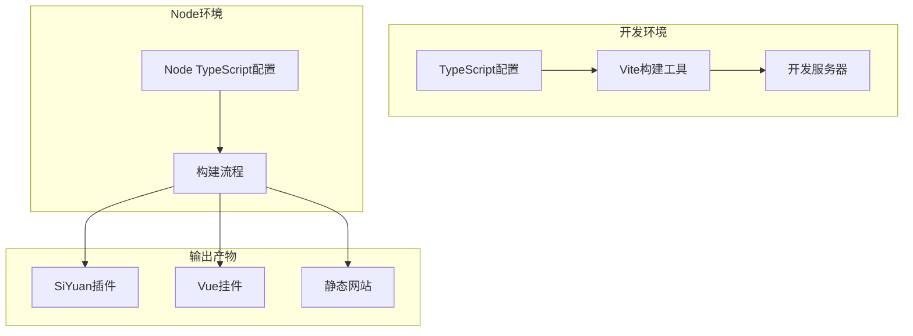
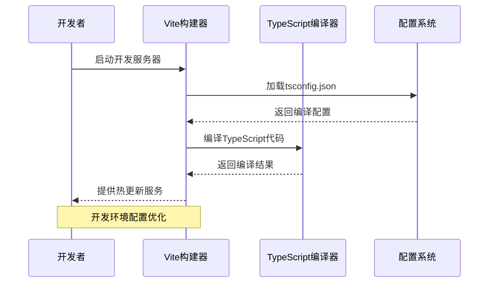
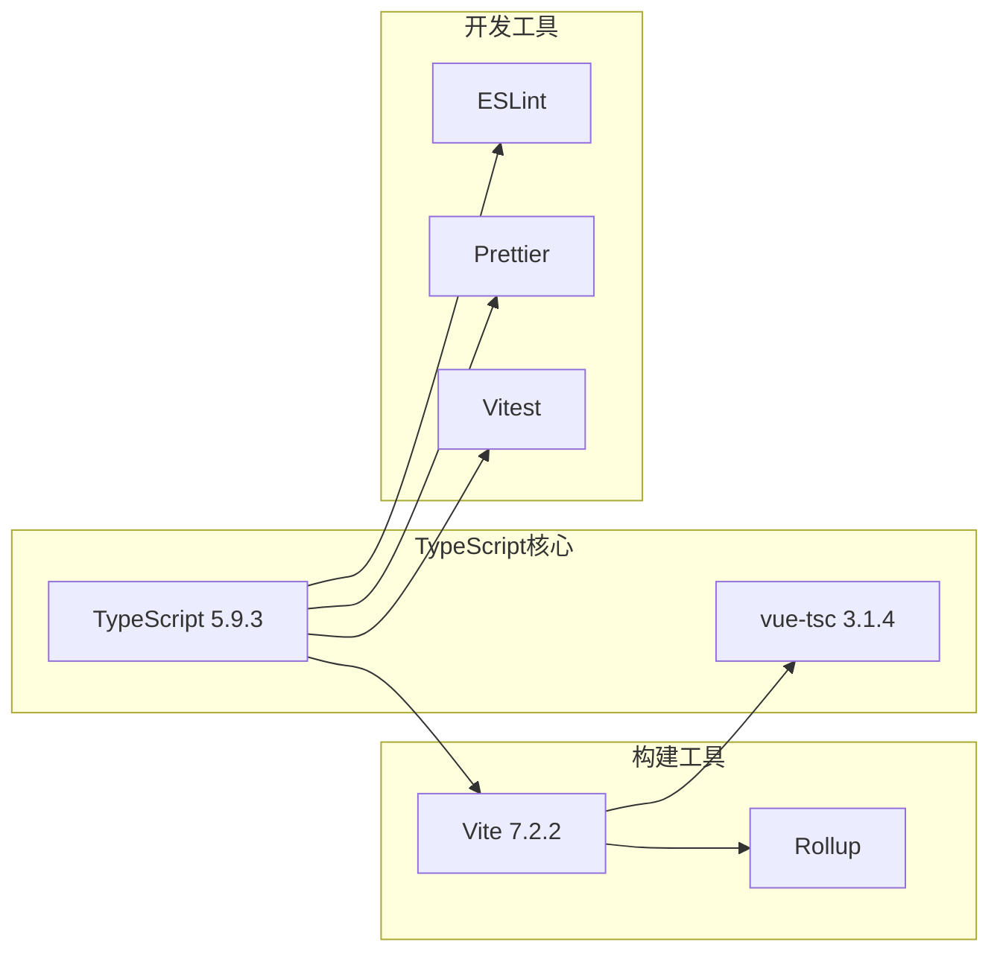

# TypeScript编译配置

<cite>
**本文档引用的文件**
- [tsconfig.json](file://tsconfig.json)
- [tsconfig.node.json](file://tsconfig.node.json)
- [package.json](file://package.json)
- [vite.config.ts](file://vite.config.ts)
- [scripts/dev.py](file://scripts/dev.py)
- [custom.d.ts](file://custom.d.ts)
- [env.d.ts](file://env.d.ts)
- [auto-imports.d.ts](file://auto-imports.d.ts)
- [.eslintrc.cjs](file://.eslintrc.cjs)
- [.prettierrc.cjs](file://.prettierrc.cjs)
</cite>

## 目录
1. [简介](#简介)
2. [项目结构](#项目结构)
3. [核心组件](#核心组件)
4. [架构概览](#架构概览)
5. [详细组件分析](#详细组件分析)
6. [依赖关系分析](#依赖关系分析)
7. [性能考虑](#性能考虑)
8. [故障排除指南](#故障排除指南)
9. [结论](#结论)

## 简介

本项目采用现代前端开发技术栈，结合Vite和TypeScript实现高性能的单页应用开发。本文档深入解析项目的TypeScript编译配置，包括tsconfig.json和tsconfig.node.json的详细配置选项，解释开发环境与Node环境的不同编译策略，以及Vite与TypeScript的集成方式。同时提供编译优化技巧和类型检查最佳实践。

## 项目结构

该项目是一个基于Vue 3和TypeScript的复杂单页应用，支持多种部署场景（SiYuan插件、Vue挂件、静态网站等）。项目采用模块化的架构设计，TypeScript配置针对不同的构建目标进行了专门优化。



**图表来源**
- [tsconfig.json:1-34](file://tsconfig.json#L1-L34)
- [vite.config.ts:1-275](file://vite.config.ts#L1-L275)

**章节来源**
- [package.json:1-99](file://package.json#L1-L99)
- [tsconfig.json:1-34](file://tsconfig.json#L1-L34)

## 核心组件

### TypeScript编译配置概述

项目采用双配置策略，通过`tsconfig.json`和`tsconfig.node.json`分别针对不同环境进行优化：

- **主配置 (`tsconfig.json`)**：面向浏览器端的TypeScript编译配置
- **Node配置 (`tsconfig.node.json`)**：面向Node.js环境的TypeScript编译配置

这种分离配置的方式确保了开发时的类型安全性和构建时的性能优化。

**章节来源**
- [tsconfig.json:1-34](file://tsconfig.json#L1-L34)
- [tsconfig.node.json:1-11](file://tsconfig.node.json#L1-L11)

### 编译目标与模块系统

项目在编译目标和模块系统方面采用了现代化的配置策略：

| 配置项 | 值 | 说明 |
|--------|-----|------|
| `target` | ES2020 | 支持现代JavaScript特性 |
| `module` | ESNext | 使用最新的模块语法 |
| `lib` | ES2020, DOM, DOM.Iterable | 提供完整的Web API支持 |
| `moduleResolution` | bundler | 与现代打包器兼容 |

这些配置确保了代码能够充分利用现代浏览器的功能，同时保持良好的向后兼容性。

**章节来源**
- [tsconfig.json:3-6](file://tsconfig.json#L3-L6)

### 路径映射与类型声明

项目实现了灵活的路径映射系统和完善的类型声明管理：

- **路径映射**：使用`~/*`作为根路径别名，简化模块导入
- **类型声明**：通过`custom.d.ts`和`env.d.ts`提供全局类型定义
- **自动导入**：利用`auto-imports.d.ts`和`auto-import.d.ts`实现智能类型推断

**章节来源**
- [tsconfig.json:26-29](file://tsconfig.json#L26-L29)
- [custom.d.ts:1-29](file://custom.d.ts#L1-L29)
- [env.d.ts:1-29](file://env.d.ts#L1-L29)

## 架构概览

项目采用"配置分离 + 工具集成"的架构模式，通过TypeScript配置与Vite构建工具的深度集成，实现高效的开发体验和构建性能。



**图表来源**
- [vite.config.ts:81-82](file://vite.config.ts#L81-L82)
- [tsconfig.json:12-18](file://tsconfig.json#L12-L18)

## 详细组件分析

### 主TypeScript配置分析 (tsconfig.json)

#### 编译选项详解

主配置文件包含了全面的TypeScript编译选项，针对现代前端开发进行了专门优化：

**编译目标配置**
- `target`: ES2020 - 支持最新的JavaScript特性
- `useDefineForClassFields`: true - 符合ECMAScript标准
- `lib`: 包含ES2020、DOM和DOM.Iterable，提供完整的Web API支持

**模块系统配置**
- `module`: ESNext - 使用最新的模块语法
- `moduleResolution`: bundler - 与现代打包器兼容
- `allowImportingTsExtensions`: true - 允许直接导入TypeScript文件

**开发体验优化**
- `skipLibCheck`: true - 跳过库文件的类型检查，提升编译速度
- `allowJs`: true - 允许JavaScript文件参与编译
- `noEmit`: true - 仅进行类型检查，不生成输出文件

**类型检查策略**
- `strict`: false - 关闭严格模式，便于快速开发
- `noUnusedLocals`: false - 不报告未使用的局部变量
- `noUnusedParameters`: false - 不报告未使用的参数

**章节来源**
- [tsconfig.json:2-30](file://tsconfig.json#L2-L30)

#### 路径映射与类型声明

项目实现了完善的模块路径管理和类型声明系统：

**路径映射配置**
```json
"paths": {
  "~/*": ["./*"]
}
```
这种配置允许使用`~/`前缀访问项目根目录，简化了相对路径的使用。

**类型声明管理**
- `custom.d.ts`: 定义第三方库的模块声明
- `env.d.ts`: 扩展Vite环境变量类型
- `auto-imports.d.ts`: 自动导入的类型声明

**章节来源**
- [tsconfig.json:26-29](file://tsconfig.json#L26-L29)
- [custom.d.ts:26-29](file://custom.d.ts#L26-L29)
- [env.d.ts:26-28](file://env.d.ts#L26-L28)

### Node环境配置分析 (tsconfig.node.json)

#### 配置特点

Node配置文件采用了极简的设计理念，专注于构建时的类型检查：

**核心配置**
- `composite`: true - 支持增量编译
- `skipLibCheck`: true - 跳过库文件检查
- `module`: ESNext - 使用现代模块语法
- `moduleResolution`: bundler - 与打包器兼容

**适用场景**
该配置主要用于：
- 构建脚本的类型检查
- Node.js环境下的TypeScript编译
- 与其他TypeScript项目的相互引用

**章节来源**
- [tsconfig.node.json:2-8](file://tsconfig.node.json#L2-L8)

### Vite与TypeScript集成

#### 构建配置集成

Vite通过`vue-tsc`命令实现与TypeScript的深度集成：

**开发流程**
```bash
vue-tsc --noEmit && vite build --watch
```

这个命令序列确保了：
1. 先进行TypeScript类型检查
2. 再执行Vite构建
3. 实时监控文件变化

**配置集成点**
- `vite.config.ts`中的`define`配置与TypeScript环境变量集成
- 路径别名配置与TypeScript路径映射保持一致
- 类型声明文件的自动发现机制

**章节来源**
- [scripts/dev.py:104-106](file://scripts/dev.py#L104-L106)
- [vite.config.ts:189-195](file://vite.config.ts#L189-L195)

### 类型声明系统

#### 全局类型声明

项目建立了多层次的类型声明系统：

**自定义类型声明**
- `custom.d.ts`: 第三方库模块声明
- `env.d.ts`: Vite环境变量扩展
- `auto-imports.d.ts`: 自动导入函数类型

**类型声明策略**
- 使用`declare module`为第三方库添加类型支持
- 通过`global`命名空间扩展全局类型
- 利用TypeScript的模块解析机制自动发现声明文件

**章节来源**
- [custom.d.ts:1-29](file://custom.d.ts#L1-L29)
- [env.d.ts:1-29](file://env.d.ts#L1-L29)
- [auto-imports.d.ts:1-11](file://auto-imports.d.ts#L1-L11)

## 依赖关系分析

### TypeScript生态依赖

项目在TypeScript生态系统中采用了精心选择的依赖组合：



**图表来源**
- [package.json:49-57](file://package.json#L49-L57)

### 配置文件依赖关系

项目配置文件之间存在明确的依赖关系：

**配置继承关系**
- `tsconfig.json`通过`references`字段引用`tsconfig.node.json`
- 开发脚本依赖TypeScript编译器进行类型检查
- Vite配置依赖TypeScript的类型声明文件

**版本兼容性**
- TypeScript 5.9.3与Vue 3.5.24完全兼容
- Vite 7.2.2提供最佳的TypeScript集成体验
- vue-tsc确保Vue SFC的类型检查准确性

**章节来源**
- [tsconfig.json:32](file://tsconfig.json#L32)
- [package.json:49-57](file://package.json#L49-L57)

## 性能考虑

### 编译性能优化

项目在多个层面实现了编译性能优化：

**类型检查优化**
- `skipLibCheck`: true - 跳过库文件检查，显著提升编译速度
- `isolatedModules`: true - 支持快速增量编译
- 关闭严格模式以减少类型检查开销

**模块解析优化**
- `moduleResolution`: bundler - 与现代打包器的高效模块解析
- `allowImportingTsExtensions`: true - 减少模块解析步骤

**开发体验优化**
- `noEmit`: true - 开发时只进行类型检查，不生成输出文件
- 实时监控文件变化，提供快速反馈

### 构建性能优化

**Vite集成优势**
- 基于ES模块的快速热重载
- 按需编译，避免全量重新编译
- 智能代码分割和懒加载

**缓存策略**
- 利用TypeScript的增量编译功能
- Vite的模块缓存机制
- 浏览器端的资源缓存优化

## 故障排除指南

### 常见配置问题

**类型检查失败**
- 检查`tsconfig.json`中的`strict`设置
- 确认所有类型声明文件正确配置
- 验证第三方库的类型定义是否存在

**模块解析错误**
- 检查`paths`配置是否与Vite的`alias`设置一致
- 确认`moduleResolution`设置为`bundler`
- 验证`allowImportingTsExtensions`配置

**开发服务器问题**
- 确认`noEmit`设置为true
- 检查Vite配置中的`define`变量
- 验证环境变量的正确性

### 调试技巧

**启用详细日志**
- 在开发脚本中添加`--verbose`参数
- 使用`vue-tsc --noEmit --watch`进行实时类型检查
- 检查Vite的控制台输出信息

**配置验证**
- 使用`vue-tsc --noEmit`单独运行类型检查
- 通过`vite --force`强制重新构建
- 清理TypeScript缓存文件

**章节来源**
- [scripts/dev.py:42-44](file://scripts/dev.py#L42-L44)
- [tsconfig.json:21-24](file://tsconfig.json#L21-L24)

## 结论

本项目的TypeScript编译配置展现了现代前端开发的最佳实践。通过合理的配置分离、完善的类型声明系统和与Vite的深度集成，实现了开发效率与构建性能的平衡。

**主要优势**
- 双配置策略确保了开发和构建的最优体验
- 现代化的编译目标和模块系统提供了良好的兼容性
- 完善的类型声明系统支持复杂的业务逻辑
- 与Vite的深度集成提供了快速的开发反馈

**改进建议**
- 可以考虑在生产环境中启用严格模式以提高代码质量
- 建立更完善的类型测试机制
- 优化第三方库的类型声明管理

这个配置方案为类似规模的Vue 3项目提供了优秀的参考模板，既保证了开发效率，又确保了代码质量和构建性能。