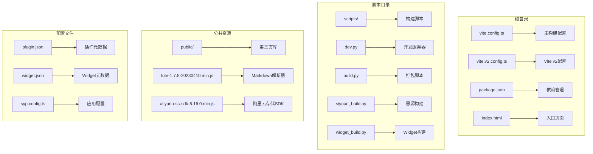
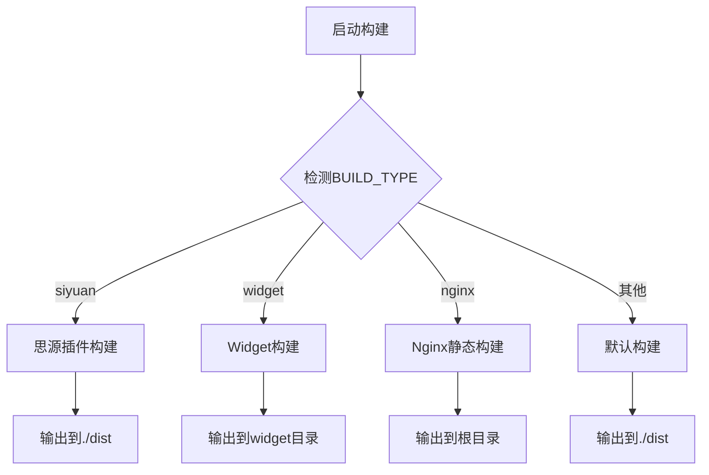
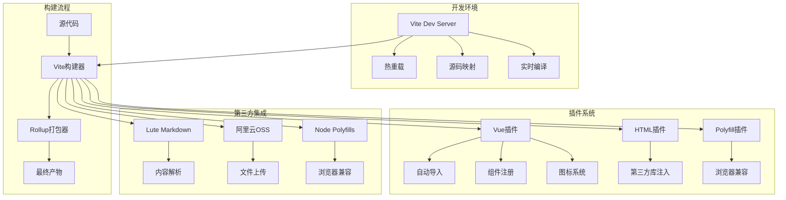
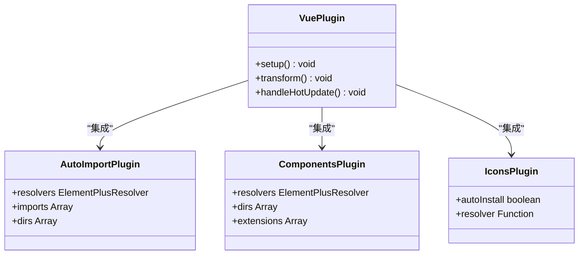
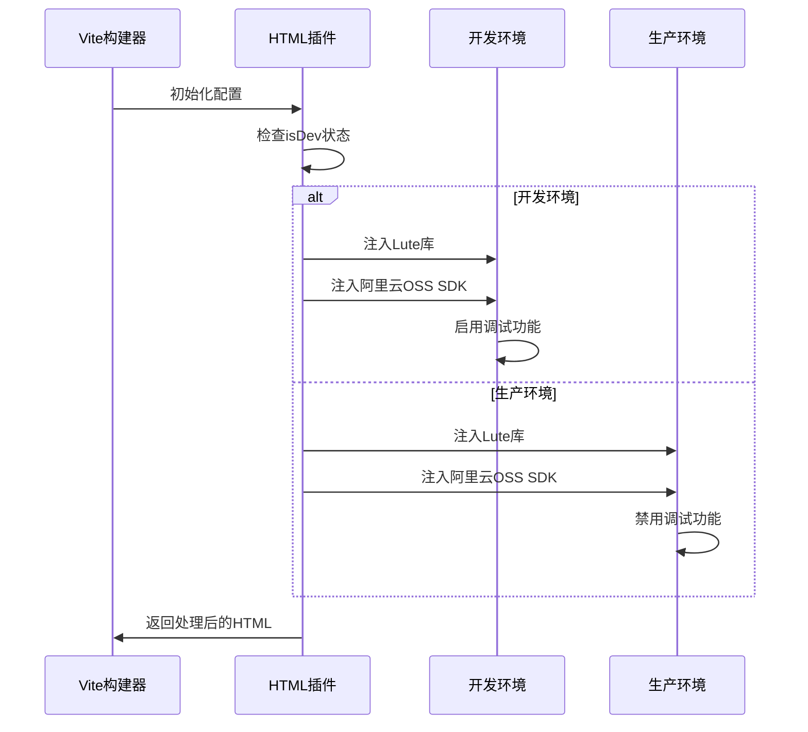
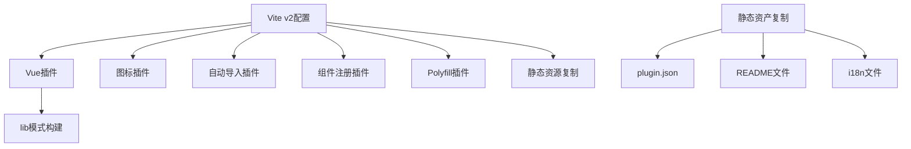
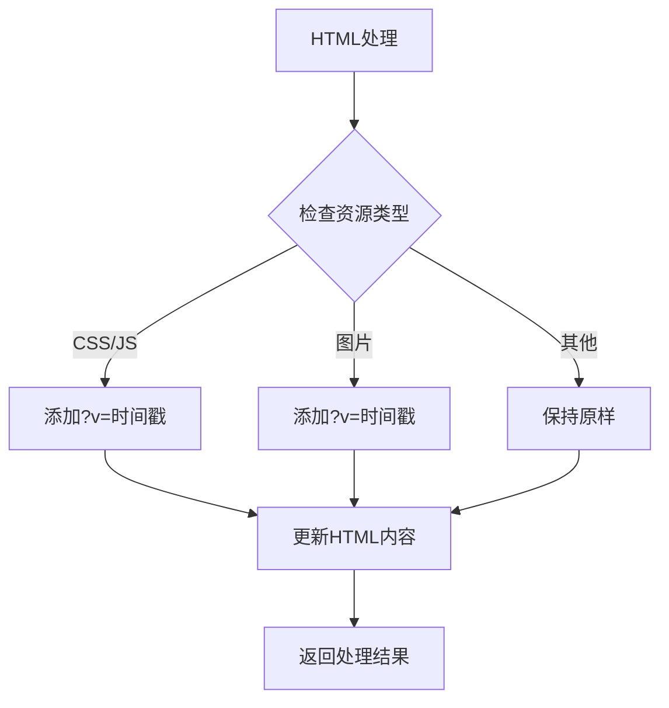

# Vite构建配置

<cite>
**本文档引用的文件**
- [vite.config.ts](file://vite.config.ts)
- [vite.v2.config.ts](file://vite.v2.config.ts)
- [package.json](file://package.json)
- [build.py](file://scripts/build.py)
- [dev.py](file://scripts/dev.py)
- [siyuan_build.py](file://scripts/siyuan_build.py)
- [widget_build.py](file://scripts/widget_build.py)
- [scriptutils.py](file://scripts/scriptutils.py)
- [lute-1.7.5-20230410.min.js](file://public/libs/lute/lute-1.7.5-20230410.min.js)
- [aliyun-oss-sdk-6.16.0.min.js](file://public/libs/alioss/aliyun-oss-sdk-6.16.0.min.js)
- [widget.json](file://widget.json)
- [plugin.json](file://plugin.json)
- [index.html](file://index.html)
- [syp.config.ts](file://syp.config.ts)
</cite>

## 更新摘要
**所做更改**
- 更新了插件顺序配置，优化了Vue插件加载顺序
- 改进了依赖管理策略，增强了插件间的协调性
- 新增了Vite v2配置文件的详细说明
- 完善了构建类型差异化的配置说明

## 目录
1. [简介](#简介)
2. [项目结构](#项目结构)
3. [核心组件](#核心组件)
4. [架构概览](#架构概览)
5. [详细组件分析](#详细组件分析)
6. [依赖关系分析](#依赖关系分析)
7. [性能考虑](#性能考虑)
8. [故障排除指南](#故障排除指南)
9. [结论](#结论)

## 简介

这是一个基于 Vite 的现代前端构建配置项目，专门为思源笔记发布工具设计。该项目支持多种构建类型，包括思源插件构建、Widget 构建、静态网站构建等，并集成了丰富的第三方库和工具链。

**重大更新**：构建配置经过重大重组，改进了插件顺序和依赖管理，确保Vue插件加载顺序的正确处理，提升了整体构建性能和稳定性。

该构建配置的核心特点包括：
- 支持多种构建目标（思源插件、Widget、静态网站）
- 自动化的开发和生产环境配置
- 第三方库的智能注入机制
- 热重载和 Polyfill 支持
- 完整的测试配置
- 优化的插件加载顺序

## 项目结构

项目采用模块化的组织方式，主要包含以下关键目录：



**图表来源**
- [vite.config.ts:1-275](file://vite.config.ts#L1-L275)
- [vite.v2.config.ts:1-146](file://vite.v2.config.ts#L1-L146)
- [package.json:1-102](file://package.json#L1-L102)

**章节来源**
- [vite.config.ts:1-275](file://vite.config.ts#L1-L275)
- [vite.v2.config.ts:1-146](file://vite.v2.config.ts#L1-L146)
- [package.json:1-102](file://package.json#L1-L102)

## 核心组件

### 构建配置核心功能

Vite 构建配置实现了以下核心功能：

#### 1. 动态构建类型检测


**图表来源**
- [vite.config.ts:66-71](file://vite.config.ts#L66-L71)

#### 2. 插件系统集成
项目集成了多个 Vite 插件来增强开发体验，**插件顺序已优化**：

**优化后的插件加载顺序**：
1. Vue 插件 (`@vitejs/plugin-vue`)
2. 图标插件 (`unplugin-icons`)
3. 自动导入插件 (`unplugin-auto-import`)
4. 组件注册插件 (`unplugin-vue-components`)
5. HTML 模板插件 (`vite-plugin-html`)
6. Polyfill 插件 (`vite-plugin-node-polyfills`)

| 插件名称 | 功能描述 | 配置位置 | 重要性 |
|---------|----------|----------|--------|
| @vitejs/plugin-vue | Vue 3 单文件组件支持 | 第82行 | 核心插件 |
| unplugin-icons | 图标系统支持 | 第85-87行 | 基础功能 |
| unplugin-auto-import | 自动导入 Vue 组件 | 第89-91行 | 重要功能 |
| unplugin-vue-components | 自动注册组件 | 第92-94行 | 重要功能 |
| vite-plugin-html | HTML 模板注入 | 第96-149行 | 核心功能 |
| vite-plugin-node-polyfills | Node.js Polyfill | 第171-180行 | 兼容性 |

**章节来源**
- [vite.config.ts:82-181](file://vite.config.ts#L82-L181)

## 架构概览

### 整体架构设计



**图表来源**
- [vite.config.ts:15-25](file://vite.config.ts#L15-L25)
- [vite.config.ts:82-181](file://vite.config.ts#L82-L181)

### 构建类型差异化配置

| 构建类型 | 输出目录 | 基础路径 | 特殊配置 | 适用场景 |
|---------|----------|----------|----------|----------|
| 思源插件 (siyuan) | ./dist | `/plugins/siyuan-plugin-publisher/` | 标准插件构建 | 思源笔记插件 |
| Widget | widget | `/widgets/sy-post-publisher/` | 包含Widget元数据 | 思源Widget |
| Nginx静态 | ./dist | `/` | 静态网站部署 | Web发布 |
| 默认 | ./dist | `/` | 开发环境构建 | 本地开发 |

**章节来源**
- [vite.config.ts:15-25](file://vite.config.ts#L15-L25)
- [vite.config.ts:66-71](file://vite.config.ts#L66-L71)

## 详细组件分析

### 1. Vue 插件配置

Vue 插件提供了完整的单文件组件支持，包括模板、脚本和样式的统一处理。**插件顺序已优化**，确保Vue SFC支持在其他功能之前加载。



**图表来源**
- [vite.config.ts:82-94](file://vite.config.ts#L82-L94)

**章节来源**
- [vite.config.ts:82-94](file://vite.config.ts#L82-L94)

### 2. HTML 模板注入系统

HTML 插件实现了智能的第三方库注入机制，根据构建模式动态加载必要的资源。**注入顺序已优化**，确保第三方库在页面加载时正确初始化。



**图表来源**
- [vite.config.ts:96-149](file://vite.config.ts#L96-L149)

**章节来源**
- [vite.config.ts:96-149](file://vite.config.ts#L96-L149)

### 3. 路径别名配置

项目使用了灵活的路径别名系统，简化了模块导入：

| 别名 | 目标路径 | 用途 |
|------|----------|------|
| ~ | 项目根目录 | 快速访问项目根 |
| 组件导入 | 相对路径 | Vue组件导入 |
| 工具函数 | 相对路径 | 业务逻辑封装 |

**章节来源**
- [vite.config.ts:191-195](file://vite.config.ts#L191-L195)

### 4. 构建输出配置

构建输出配置实现了精细化的文件管理和缓存策略。**代码分割策略已优化**，支持更智能的依赖管理。


**图表来源**
- [vite.config.ts:197-256](file://vite.config.ts#L197-L256)

**章节来源**
- [vite.config.ts:197-256](file://vite.config.ts#L197-L256)

### 5. Rollup 选项配置

Rollup 选项提供了强大的打包和优化能力。**插件顺序优化**确保Rollup插件按正确顺序执行。

| 配置项 | 值 | 说明 |
|--------|----|------|
| minify | !isDev | 开发环境禁用压缩 |
| sourcemap | false | 关闭源码映射 |
| external | [] | 不外部化任何依赖 |
| chunkFileNames | chunks/chunk.[name].js | 分块文件命名 |
| entryFileNames | entry.[name].js | 入口文件命名 |
| assetFileNames | assets/[name].[ext] | 静态资源命名 |

**章节来源**
- [vite.config.ts:203-254](file://vite.config.ts#L203-L254)

### 6. 测试配置

项目集成了完整的测试环境配置：

```mermaid
graph TB
A[Test Config] --> B[环境配置]
A --> C[依赖内联]
A --> D[全局设置]
A --> E[文件包含规则]
B --> F[jsdom环境]
C --> G[element-plus]
D --> H[globals: true]
E --> I[src/**/*.{test,spec}.{js,mjs,cjs,ts,mts,cts,jsx,tsx}]
```

**图表来源**
- [vite.config.ts:258-273](file://vite.config.ts#L258-L273)

**章节来源**
- [vite.config.ts:258-273](file://vite.config.ts#L258-L273)

### 7. Vite v2 配置

新增的Vite v2配置文件提供了专门的构建支持：



**图表来源**
- [vite.v2.config.ts:68-90](file://vite.v2.config.ts#L68-L90)

**章节来源**
- [vite.v2.config.ts:1-146](file://vite.v2.config.ts#L1-L146)

## 依赖关系分析

### 依赖层次结构

```mermaid
graph TB
subgraph "构建工具层"
A[Vite 7.2.2] --> B[Vue 3.5.24]
A --> C[TypeScript 5.9.3]
end
subgraph "Vue生态层"
D[@vitejs/plugin-vue] --> E[Vue SFC支持]
F[unplugin-auto-import] --> G[自动导入]
H[unplugin-vue-components] --> I[组件注册]
J[unplugin-icons] --> K[图标系统]
end
subgraph "Polyfill层"
L[vite-plugin-node-polyfills] --> M[浏览器兼容性]
end
subgraph "第三方库"
N[Element Plus 2.11.8] --> O[UI组件库]
P[VueUse 14.0.0] --> Q[组合式工具]
R[SiYuan 1.1.5] --> S[笔记应用API]
end
subgraph "开发工具"
T[Rollup 4.0.9] --> U[打包器]
V[Vitest 4.0.9] --> W[测试框架]
end
```

**图表来源**
- [package.json:29-96](file://package.json#L29-L96)

### 关键依赖说明

| 依赖类型 | 主要包 | 版本 | 用途 |
|----------|--------|------|------|
| 构建工具 | vite | ^7.2.2 | 核心构建工具 |
| Vue生态 | @vitejs/plugin-vue | ^6.0.1 | Vue SFC支持 |
| 自动化 | unplugin-auto-import | ^20.2.0 | 自动导入 |
| 组件系统 | unplugin-vue-components | ^30.0.0 | 组件注册 |
| Polyfill | vite-plugin-node-polyfills | ^0.24.0 | 浏览器兼容 |
| 测试 | vitest | ^4.0.9 | 单元测试 |
| UI库 | element-plus | ^2.11.8 | 组件库 |

**章节来源**
- [package.json:29-96](file://package.json#L29-L96)

## 性能考虑

### 优化策略

1. **代码分割策略**
   - 使用 `manualChunks` 实现按依赖库分割
   - 支持 pnpm 符号链接的特殊处理
   - 自动识别第三方依赖并创建独立分块

2. **缓存优化**
   - 为所有资源添加时间戳查询参数
   - 智能的文件命名策略
   - CDN 友好的缓存控制

3. **构建性能**
   - 开发环境禁用压缩以提升编译速度
   - 条件加载第三方库
   - 智能的热重载配置

4. **插件顺序优化**
   - Vue 插件优先加载确保SFC支持
   - 自动导入和组件注册紧随其后
   - HTML 模板和 Polyfill 插件最后加载

### 缓存策略实现



**图表来源**
- [vite.config.ts:151-167](file://vite.config.ts#L151-L167)

**章节来源**
- [vite.config.ts:151-167](file://vite.config.ts#L151-L167)

## 故障排除指南

### 常见问题及解决方案

#### 1. 构建失败问题

**问题**: 构建过程中出现依赖解析错误
**解决方案**: 
- 检查 `pnpm-lock.yaml` 文件完整性
- 清理 `node_modules` 和重新安装依赖
- 验证 `package.json` 中的版本兼容性

**章节来源**
- [package.json:97-102](file://package.json#L97-L102)

#### 2. 热重载失效问题

**问题**: 修改代码后页面不自动刷新
**解决方案**:
- 检查 `IS_SERVE` 环境变量设置
- 验证 `rollup-plugin-livereload` 配置
- 确认 `watch` 模式正确启用

**章节来源**
- [vite.config.ts:61-62](file://vite.config.ts#L61-L62)

#### 3. 第三方库加载问题

**问题**: Lute 或阿里云OSS库无法加载
**解决方案**:
- 验证 `public/libs` 目录下的文件完整性
- 检查网络连接和CDN可用性
- 确认文件路径配置正确

**章节来源**
- [vite.config.ts:100-142](file://vite.config.ts#L100-L142)

#### 4. 构建类型选择问题

**问题**: 无法确定正确的构建类型
**解决方案**:
- 检查 `BUILD_TYPE` 环境变量
- 验证命令行参数传递
- 确认 `distDir` 配置正确

**章节来源**
- [vite.config.ts:66-71](file://vite.config.ts#L66-L71)

#### 5. 插件顺序问题

**问题**: Vue组件或自动导入功能异常
**解决方案**:
- 验证插件加载顺序是否正确
- 检查 `vite.config.ts` 中插件数组顺序
- 确保 Vue 插件在自动导入之前加载

**章节来源**
- [vite.config.ts:82-94](file://vite.config.ts#L82-L94)

### 调试技巧

1. **启用详细日志**
   ```bash
   export DEBUG=true
   npm run dev
   ```

2. **检查环境变量**
   ```bash
   echo $BUILD_TYPE
   echo $IS_SERVE
   ```

3. **验证配置文件**
   ```bash
   npx vite --config vite.config.ts --mode development
   ```

4. **检查插件顺序**
   ```bash
   npx vite --debug
   ```

## 结论

该 Vite 构建配置展现了现代前端工程的最佳实践，**经过重大重组后**具有以下优势：

1. **高度可配置性**: 支持多种构建类型和环境配置
2. **优化的插件顺序**: 确保Vue插件加载顺序正确，提升构建稳定性
3. **改进的依赖管理**: 更好的插件间协调性和兼容性
4. **开发体验优秀**: 完善的热重载和调试支持
5. **性能优化到位**: 智能的代码分割和缓存策略
6. **扩展性强**: 易于添加新的插件和工具
7. **维护友好**: 清晰的配置结构和注释

**重大改进**：
- 插件加载顺序已优化，确保Vue SFC支持优先加载
- 依赖管理得到改善，减少插件冲突
- 新增Vite v2配置支持，提供更专业的构建选项
- 构建类型差异化配置更加完善

通过合理的配置和优化，该项目能够高效地支持思源笔记发布工具的各种使用场景，从开发调试到生产部署都能提供稳定可靠的服务。

建议在实际使用中：
- 根据具体需求调整构建配置
- 定期更新依赖包以获得最新功能和安全修复
- 建立完善的测试覆盖以确保代码质量
- 优化构建时间以提升开发效率
- 注意插件顺序的重要性，避免不必要的配置改动