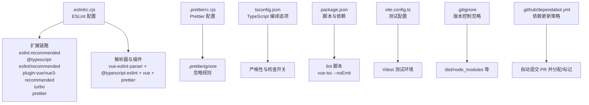
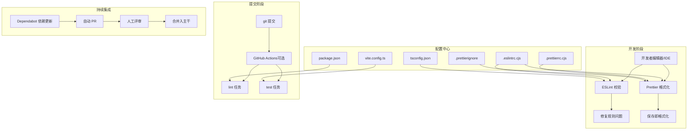
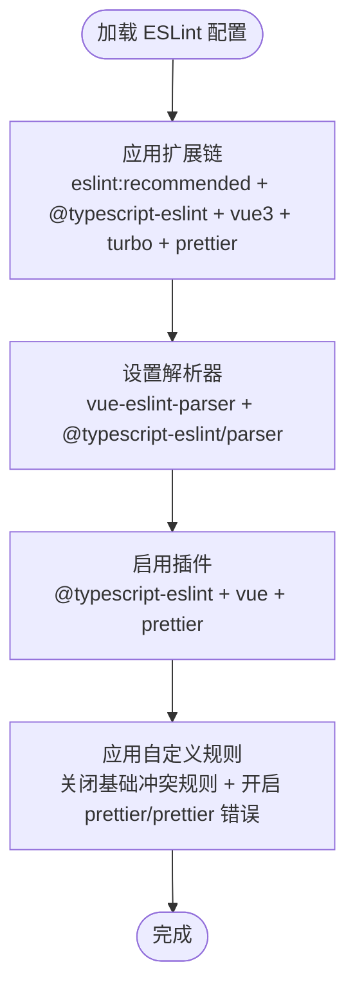
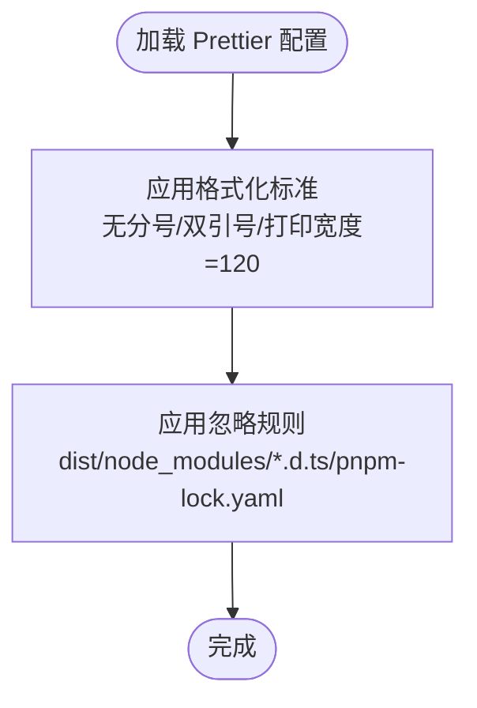
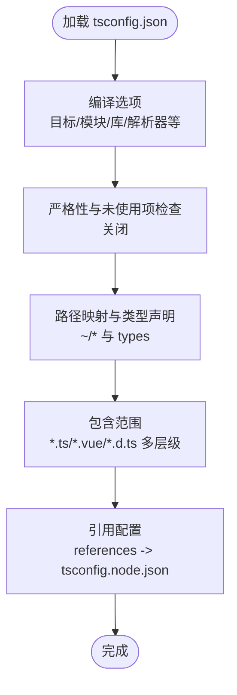
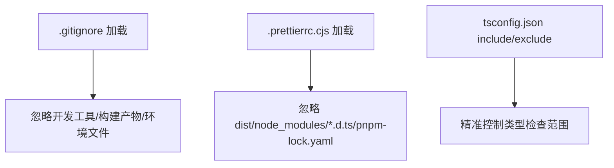
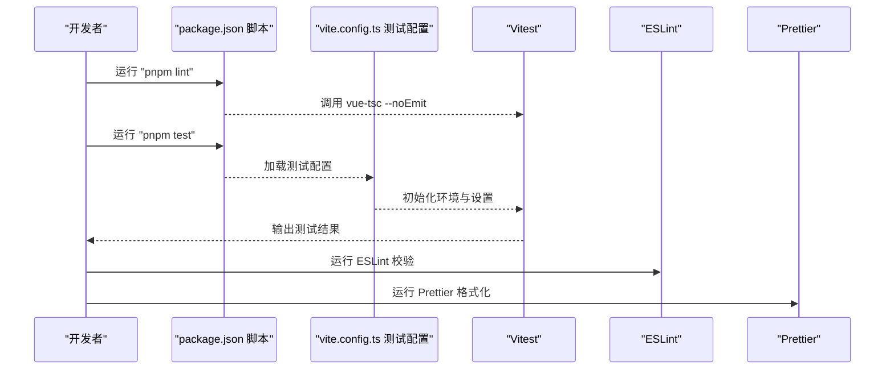
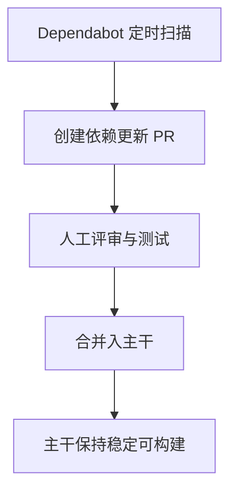
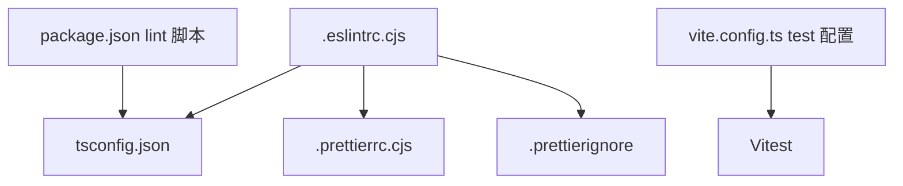

# 代码质量工具

<cite>
**本文引用的文件**
- [.eslintrc.cjs](file://.eslintrc.cjs)
- [.prettierrc.cjs](file://.prettierrc.cjs)
- [.prettierignore](file://.prettierignore)
- [.gitignore](file://.gitignore)
- [package.json](file://package.json)
- [tsconfig.json](file://tsconfig.json)
- [vite.config.ts](file://vite.config.ts)
- [DEVELOPMENT.md](file://DEVELOPMENT.md)
- [.github/dependabot.yml](file://.github/dependabot.yml)
- [common/pageUtils.spec.ts](file://common/pageUtils.spec.ts)
</cite>

## 目录
1. [简介](#简介)
2. [项目结构](#项目结构)
3. [核心组件](#核心组件)
4. [架构总览](#架构总览)
5. [详细组件分析](#详细组件分析)
6. [依赖关系分析](#依赖关系分析)
7. [性能考量](#性能考量)
8. [故障排查指南](#故障排查指南)
9. [结论](#结论)
10. [附录](#附录)

## 简介
本文件系统性梳理该项目的代码质量工具配置与实践，重点覆盖以下方面：
- ESLint 规则配置与扩展链路
- Prettier 格式化设置与忽略策略
- TypeScript 编译与类型检查配置
- 忽略文件与目录的组织方式
- 团队协作中的代码质量保障策略与自动化检查流程

目标是帮助开发者快速理解并正确使用这些工具，确保在多平台（Siyuan 插件、Widget、Chrome/Firefox 扩展、Nginx 部署）下保持一致的代码风格与质量。

## 项目结构
围绕代码质量的关键配置文件分布如下：
- ESLint 配置：.eslintrc.cjs
- Prettier 配置：.prettierrc.cjs、.prettierignore
- TypeScript 配置：tsconfig.json
- 包脚本与测试：package.json、vite.config.ts（含 Vitest 测试）
- 版本与依赖维护：.github/dependabot.yml
- 开发与构建说明：DEVELOPMENT.md
- 示例测试文件：common/pageUtils.spec.ts

图表来源
- [.eslintrc.cjs:1-36](file://.eslintrc.cjs#L1-L36)
- [.prettierrc.cjs:29-33](file://.prettierrc.cjs#L29-L33)
- [.prettierignore:1-13](file://.prettierignore#L1-L13)
- [tsconfig.json:1-34](file://tsconfig.json#L1-L34)
- [package.json:9-28](file://package.json#L9-L28)
- [vite.config.ts:258-273](file://vite.config.ts#L258-L273)
- [.gitignore:1-46](file://.gitignore#L1-L46)
- [.github/dependabot.yml:1-39](file://.github/dependabot.yml#L1-L39)

章节来源
- [.eslintrc.cjs:1-36](file://.eslintrc.cjs#L1-L36)
- [.prettierrc.cjs:29-33](file://.prettierrc.cjs#L29-L33)
- [.prettierignore:1-13](file://.prettierignore#L1-L13)
- [tsconfig.json:1-34](file://tsconfig.json#L1-L34)
- [package.json:9-28](file://package.json#L9-L28)
- [vite.config.ts:258-273](file://vite.config.ts#L258-L273)
- [.gitignore:1-46](file://.gitignore#L1-L46)
- [.github/dependabot.yml:1-39](file://.github/dependabot.yml#L1-L39)

## 核心组件
- ESLint 配置
  - 扩展链：基于官方推荐、TypeScript、Vue3、Turbo、Prettier 的组合，形成统一的规则基线。
  - 解析器：使用 vue-eslint-parser，并通过 parserOptions 指定 @typescript-eslint/parser。
  - 插件：启用 @typescript-eslint、vue、prettier 三大插件。
  - 自定义规则：关闭部分基础规则以避免误报，开启 prettier/prettier 错误级别，确保格式化一致性。
- Prettier 配置
  - 关闭分号与单引号，打印宽度为 120，强调可读性与跨团队一致性。
  - .prettierignore 明确忽略 dist、node_modules、*.d.ts、pnpm-lock.yaml 等产物与锁文件。
- TypeScript 配置
  - 允许 JS 与检查开关可控，模块解析采用 bundler，支持 TS 扩展名导入与 JSON 模块。
  - 严格性与未使用项检查关闭，便于渐进式引入与兼容现有代码。
- 忽略策略
  - .gitignore 控制版本库忽略；.prettierignore 控制格式化忽略；同时通过 tsconfig.json 的 include/exclude 精准控制类型检查范围。
- 测试与脚本
  - package.json 提供 lint 脚本（vue-tsc --noEmit），配合 vite.config.ts 的 test 配置运行 Vitest。
  - DEVELOPMENT.md 提供开发与构建命令参考。

章节来源
- [.eslintrc.cjs:1-36](file://.eslintrc.cjs#L1-L36)
- [.prettierrc.cjs:29-33](file://.prettierrc.cjs#L29-L33)
- [.prettierignore:1-13](file://.prettierignore#L1-L13)
- [tsconfig.json:1-34](file://tsconfig.json#L1-L34)
- [package.json:9-28](file://package.json#L9-L28)
- [vite.config.ts:258-273](file://vite.config.ts#L258-L273)
- [.gitignore:1-46](file://.gitignore#L1-L46)
- [DEVELOPMENT.md:1-115](file://DEVELOPMENT.md#L1-L115)

## 架构总览
整体代码质量工具链由“编辑器/IDE 集成 + CLI 工具 + CI/CD 自动化”构成，贯穿开发、提交与合并阶段。

图表来源
- [.eslintrc.cjs:1-36](file://.eslintrc.cjs#L1-L36)
- [.prettierrc.cjs:29-33](file://.prettierrc.cjs#L29-L33)
- [.prettierignore:1-13](file://.prettierignore#L1-L13)
- [tsconfig.json:1-34](file://tsconfig.json#L1-L34)
- [package.json:9-28](file://package.json#L9-L28)
- [vite.config.ts:258-273](file://vite.config.ts#L258-L273)
- [.github/dependabot.yml:1-39](file://.github/dependabot.yml#L1-L39)

## 详细组件分析

### ESLint 组件分析
- 扩展链与解析器
  - 扩展链包含 eslint:recommended、@typescript-eslint/recommended、plugin:vue/vue3-recommended、turbo、prettier，形成“语言层 + 类型层 + Vue 层 + 工程化 + 格式化”的完整覆盖。
  - 解析器 vue-eslint-parser 与 @typescript-eslint/parser 的组合，确保 Vue 单文件组件与 TypeScript 的正确解析。
- 插件与规则
  - 启用 @typescript-eslint、vue、prettier 插件，自定义规则中关闭若干基础规则以避免误报，同时将 prettier/prettier 设为错误级别，强制格式化一致性。
- 适用范围
  - 适用于 .ts/.vue 文件以及被 tsconfig.json include 覆盖的路径。

图表来源
- [.eslintrc.cjs:1-36](file://.eslintrc.cjs#L1-L36)

章节来源
- [.eslintrc.cjs:1-36](file://.eslintrc.cjs#L1-L36)

### Prettier 组件分析
- 格式化标准
  - 关闭分号与单引号，打印宽度 120，兼顾可读性与团队偏好。
- 忽略策略
  - .prettierignore 忽略 dist、node_modules、*.d.ts、pnpm-lock.yaml 等产物与锁文件，避免格式化无关文件。
- 与 ESLint 的协同
  - 通过 eslint-config-prettier 与 eslint-plugin-prettier 的配合，确保两者不产生冲突，且以 Prettier 为准进行格式化。

图表来源
- [.prettierrc.cjs:29-33](file://.prettierrc.cjs#L29-L33)
- [.prettierignore:1-13](file://.prettierignore#L1-L13)

章节来源
- [.prettierrc.cjs:29-33](file://.prettierrc.cjs#L29-L33)
- [.prettierignore:1-13](file://.prettierignore#L1-L13)

### TypeScript 组件分析
- 编译选项
  - 目标 ES2020，模块 ESNext，允许 JS 与检查开关可控，模块解析采用 bundler，支持 TS 扩展名导入与 JSON 模块。
  - 严格性与未使用项检查关闭，便于渐进式引入与兼容现有代码。
- 路径映射与类型声明
  - 路径别名 ~/* 指向根目录；types 字段包含图标类型声明，确保 IDE 与编译器识别。
- 包含范围
  - include 覆盖 *.ts、*.vue、*.d.ts 与多层级目录，结合 references 引用 tsconfig.node.json。

图表来源
- [tsconfig.json:1-34](file://tsconfig.json#L1-L34)

章节来源
- [tsconfig.json:1-34](file://tsconfig.json#L1-L34)

### 忽略策略组件分析
- .gitignore
  - 忽略 .idea、.DS_Store、dist、lib、node_modules、临时文件、扩展与 Widget 构建产物、Nginx 目录、覆盖率与测试数据等。
- .prettierignore
  - 忽略 dist、node_modules、*.d.ts、pnpm-lock.yaml，避免格式化无关文件。
- tsconfig.json include/exclude
  - 精准控制类型检查范围，减少不必要的扫描与检查成本。

图表来源
- [.gitignore:1-46](file://.gitignore#L1-L46)
- [.prettierrc.cjs:29-33](file://.prettierrc.cjs#L29-L33)
- [.prettierignore:1-13](file://.prettierignore#L1-L13)
- [tsconfig.json:31](file://tsconfig.json#L31)

章节来源
- [.gitignore:1-46](file://.gitignore#L1-L46)
- [.prettierrc.cjs:29-33](file://.prettierrc.cjs#L29-L33)
- [.prettierignore:1-13](file://.prettierignore#L1-L13)
- [tsconfig.json:31](file://tsconfig.json#L31)

### 测试与脚本组件分析
- 脚本与依赖
  - package.json 提供 lint 脚本（vue-tsc --noEmit），用于类型检查；test 脚本运行 Vitest。
  - vite.config.ts 的 test 配置包含环境、全局设置、包含范围与服务端依赖内联策略。
- 示例测试
  - common/pageUtils.spec.ts 展示了 Vitest 的基本用法与命名空间。

图表来源
- [package.json:9-28](file://package.json#L9-L28)
- [vite.config.ts:258-273](file://vite.config.ts#L258-L273)
- [common/pageUtils.spec.ts:26-34](file://common/pageUtils.spec.ts#L26-L34)

章节来源
- [package.json:9-28](file://package.json#L9-L28)
- [vite.config.ts:258-273](file://vite.config.ts#L258-L273)
- [common/pageUtils.spec.ts:26-34](file://common/pageUtils.spec.ts#L26-L34)

### 团队协作与自动化检查策略
- 依赖更新
  - .github/dependabot.yml 定期扫描 npm 与 GitHub Actions 依赖，自动创建 PR 并分配/标记，降低安全与兼容风险。
- 提交前检查
  - 建议在本地或 CI 中执行：
    - Prettier 格式化校验（如存在 CI 步骤）
    - ESLint 规则检查
    - 类型检查（vue-tsc）
    - Vitest 单元测试
- 合并策略
  - 优先通过 Dependabot PR 进行依赖升级，经人工评审后再合并；主干保持稳定与可构建。

图表来源
- [.github/dependabot.yml:1-39](file://.github/dependabot.yml#L1-L39)

章节来源
- [.github/dependabot.yml:1-39](file://.github/dependabot.yml#L1-L39)

## 依赖关系分析
- 配置文件之间的耦合
  - .eslintrc.cjs 依赖 tsconfig.json 的 include/exclude 与路径映射，确保 ESLint 能正确解析项目结构。
  - .prettierrc.cjs 与 .prettierignore 影响格式化范围，避免对 dist、node_modules、*.d.ts、pnpm-lock.yaml 等文件进行格式化。
  - package.json 的 lint 脚本依赖 vue-tsc，与 tsconfig.json 的编译选项密切相关。
  - vite.config.ts 的 test 配置影响 Vitest 的运行环境与包含范围。
- 外部依赖
  - @typescript-eslint、vue、prettier 等插件与配置共同决定规则集与格式化行为。
  - Turbo 配置扩展提供工程化层面的规则基线。

图表来源
- [.eslintrc.cjs:1-36](file://.eslintrc.cjs#L1-L36)
- [tsconfig.json:1-34](file://tsconfig.json#L1-L34)
- [.prettierrc.cjs:29-33](file://.prettierrc.cjs#L29-L33)
- [.prettierignore:1-13](file://.prettierignore#L1-L13)
- [package.json:9-28](file://package.json#L9-L28)
- [vite.config.ts:258-273](file://vite.config.ts#L258-L273)

章节来源
- [.eslintrc.cjs:1-36](file://.eslintrc.cjs#L1-L36)
- [tsconfig.json:1-34](file://tsconfig.json#L1-L34)
- [.prettierrc.cjs:29-33](file://.prettierrc.cjs#L29-L33)
- [.prettierignore:1-13](file://.prettierignore#L1-L13)
- [package.json:9-28](file://package.json#L9-L28)
- [vite.config.ts:258-273](file://vite.config.ts#L258-L273)

## 性能考量
- 类型检查成本
  - tsconfig.json 中严格性与未使用项检查关闭，有助于降低类型检查开销；若项目规模扩大，建议逐步收紧规则并使用增量检查。
- 格式化范围
  - .prettierignore 明确忽略 dist、node_modules、*.d.ts、pnpm-lock.yaml，减少格式化扫描与写入操作。
- 构建与测试
  - vite.config.ts 的 test 配置包含依赖内联与包含范围，有助于缩短测试启动时间；生产构建按需启用压缩与 SourceMap。

[本节为通用指导，无需列出章节来源]

## 故障排查指南
- ESLint 报错与误报
  - 若出现与基础规则冲突的误报，可参考 .eslintrc.cjs 中关闭对应基础规则的做法，确保与 @typescript-eslint/vue/prettier 插件协同。
  - 对于 Vue 单文件组件的特定语法（如 v-html），可按需调整相应规则。
- Prettier 与 ESLint 冲突
  - 确保已启用 eslint-config-prettier 与 eslint-plugin-prettier，且 prettier/prettier 规则设为错误级别，以消除冲突。
- 类型检查失败
  - 检查 tsconfig.json 的 include/exclude 与路径映射，确认目标文件已被纳入类型检查范围。
- 测试无法运行或环境异常
  - 检查 vite.config.ts 的 test 配置，确认环境、全局设置、包含范围与依赖内联策略符合预期。
- 依赖更新 PR 未触发
  - 检查 .github/dependabot.yml 的配置与权限，确保仓库可见性与分支保护策略不影响 Dependabot PR。

章节来源
- [.eslintrc.cjs:1-36](file://.eslintrc.cjs#L1-L36)
- [.prettierrc.cjs:29-33](file://.prettierrc.cjs#L29-L33)
- [tsconfig.json:1-34](file://tsconfig.json#L1-L34)
- [vite.config.ts:258-273](file://vite.config.ts#L258-L273)
- [.github/dependabot.yml:1-39](file://.github/dependabot.yml#L1-L39)

## 结论
本项目通过 ESLint、Prettier、TypeScript 与 Vitest 的协同配置，结合 Dependabot 的自动化依赖更新，形成了从开发到提交再到合并的完整代码质量保障闭环。建议团队在遵循现有配置的基础上，逐步收紧规则与增加自动化检查，以提升长期可维护性与一致性。

[本节为总结性内容，无需列出章节来源]

## 附录
- 开发与构建命令参考：参见 DEVELOPMENT.md 的脚本与参数说明。
- 示例测试文件：common/pageUtils.spec.ts 展示了 Vitest 的基本用法。

章节来源
- [DEVELOPMENT.md:1-115](file://DEVELOPMENT.md#L1-L115)
- [common/pageUtils.spec.ts:26-34](file://common/pageUtils.spec.ts#L26-L34)