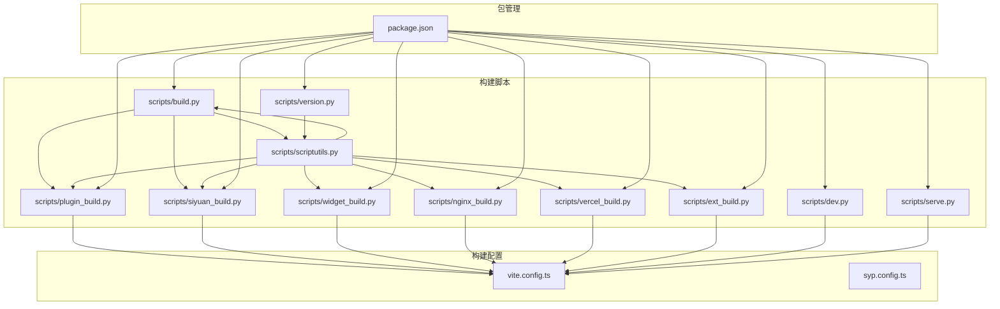
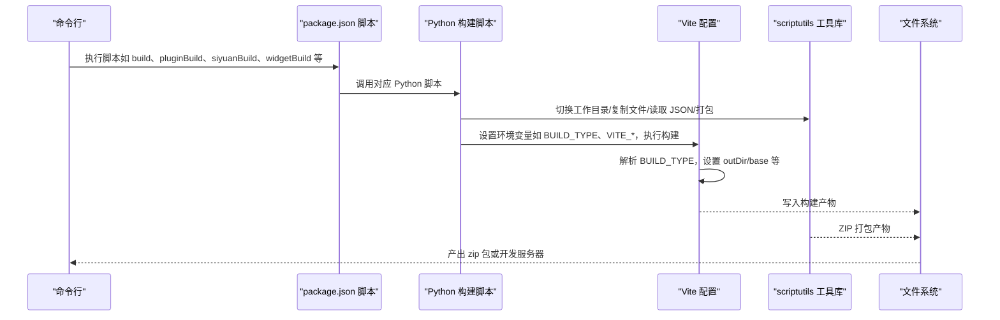
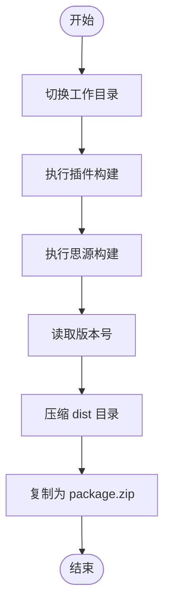
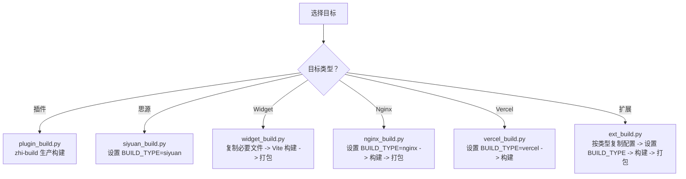
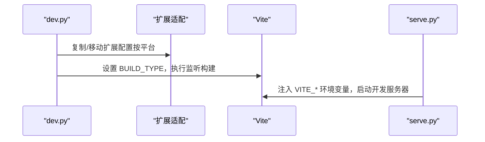
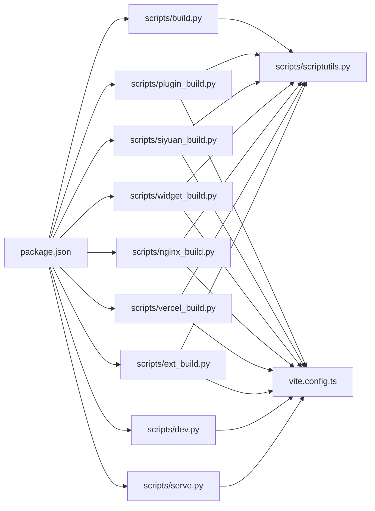

# 多环境构建

<cite>
**本文引用的文件**
- [scripts/build.py](file://scripts/build.py)
- [scripts/plugin_build.py](file://scripts/plugin_build.py)
- [scripts/siyuan_build.py](file://scripts/siyuan_build.py)
- [scripts/widget_build.py](file://scripts/widget_build.py)
- [scripts/nginx_build.py](file://scripts/nginx_build.py)
- [scripts/vercel_build.py](file://scripts/vercel_build.py)
- [scripts/ext_build.py](file://scripts/ext_build.py)
- [scripts/dev.py](file://scripts/dev.py)
- [scripts/serve.py](file://scripts/serve.py)
- [scripts/version.py](file://scripts/version.py)
- [scripts/scriptutils.py](file://scripts/scriptutils.py)
- [package.json](file://package.json)
- [vite.config.ts](file://vite.config.ts)
- [syp.config.ts](file://syp.config.ts)
</cite>

## 目录
1. [简介](#简介)
2. [项目结构](#项目结构)
3. [核心组件](#核心组件)
4. [架构总览](#架构总览)
5. [详细组件分析](#详细组件分析)
6. [依赖分析](#依赖分析)
7. [性能考虑](#性能考虑)
8. [故障排查指南](#故障排查指南)
9. [结论](#结论)
10. [附录](#附录)

## 简介
本文件系统性梳理该仓库的多环境构建流程与自动化方案，覆盖以下目标：
- 思源插件构建（含打包与压缩）
- Widget 构建（含产物打包）
- Nginx 部署产物构建（含打包）
- Vercel 部署构建（直接构建）
- 浏览器扩展（Chrome/Edge/Firefox）构建与打包
- 条件构建与环境变量处理
- 产物优化与版本管理
- CI/CD 集成建议

通过 Python 脚本驱动 Vite/TypeScript 构建，配合统一的工具库实现目录切换、文件复制、压缩打包等通用能力；Vite 配置根据环境变量动态决定输出目录、基础路径与构建行为。

## 项目结构
围绕“构建目标”划分的核心脚本与配置如下：
- 构建入口与聚合
  - scripts/build.py：聚合执行插件与思源构建，并打包
  - package.json：统一 npm/pnpm 脚本入口
- 各目标构建脚本
  - scripts/plugin_build.py：调用 zhi-build 进行插件生产构建
  - scripts/siyuan_build.py：设置 BUILD_TYPE=siyuan 后执行 Vite 构建
  - scripts/widget_build.py：设置 BUILD_TYPE=widget，构建并打包 Widget
  - scripts/nginx_build.py：设置 BUILD_TYPE=nginx，构建并打包 Nginx 部署产物
  - scripts/vercel_build.py：设置 BUILD_TYPE=vercel，执行 Vite 构建
  - scripts/ext_build.py：按浏览器类型复制/适配扩展配置，构建并打包
- 开发与本地服务
  - scripts/dev.py：多平台开发构建入口（支持 siyuan/widget/chrome/edge/firefox/nginx）
  - scripts/serve.py：本地开发服务注入环境变量并启动 Vite
- 工具库
  - scripts/scriptutils.py：工作目录切换、文件/目录操作、JSON 读写、ZIP 打包等
- 构建配置
  - vite.config.ts：基于 BUILD_TYPE 动态设置输出目录、基础路径、HTML 注入、Rollup 分包策略等
  - syp.config.ts：运行时配置入口（语言、动态配置键等）

图表来源
- [scripts/build.py:1-57](file://scripts/build.py#L1-L57)
- [scripts/plugin_build.py:1-39](file://scripts/plugin_build.py#L1-L39)
- [scripts/siyuan_build.py:1-42](file://scripts/siyuan_build.py#L1-L42)
- [scripts/widget_build.py:1-94](file://scripts/widget_build.py#L1-L94)
- [scripts/nginx_build.py:1-59](file://scripts/nginx_build.py#L1-L59)
- [scripts/vercel_build.py:1-42](file://scripts/vercel_build.py#L1-L42)
- [scripts/ext_build.py:1-150](file://scripts/ext_build.py#L1-L150)
- [scripts/dev.py:1-107](file://scripts/dev.py#L1-L107)
- [scripts/serve.py:1-54](file://scripts/serve.py#L1-L54)
- [scripts/version.py:1-81](file://scripts/version.py#L1-L81)
- [scripts/scriptutils.py:1-243](file://scripts/scriptutils.py#L1-L243)
- [package.json:1-99](file://package.json#L1-L99)
- [vite.config.ts:1-275](file://vite.config.ts#L1-L275)
- [syp.config.ts:1-52](file://syp.config.ts#L1-L52)

章节来源
- [package.json:9-27](file://package.json#L9-L27)
- [vite.config.ts:58-77](file://vite.config.ts#L58-L77)

## 核心组件
- 构建入口与聚合
  - scripts/build.py：先执行插件与思源构建，再读取版本号并打包为 zip，同时生成通用 package.zip
- 各目标构建脚本
  - plugin_build.py：调用 zhi-build 生产模式构建
  - siyuan_build.py：设置 BUILD_TYPE=siyuan，执行 Vite 构建
  - widget_build.py：设置 BUILD_TYPE=widget，复制必要文件，执行 Vite 构建并打包 zip，生成 package-widget.zip
  - nginx_build.py：设置 BUILD_TYPE=nginx，执行 Vite 构建并打包 zip
  - vercel_build.py：设置 BUILD_TYPE=vercel，执行 Vite 构建（Vercel 平台自行处理打包）
  - ext_build.py：按浏览器类型复制/替换配置，设置 BUILD_TYPE=浏览器名，执行 Vite 构建并打包 zip
- 开发与本地服务
  - dev.py：多平台开发入口，支持 siyuan/widget/chrome/edge/firefox/nginx，自动复制扩展所需文件并监听
  - serve.py：本地开发服务，注入 VITE_* 系列环境变量并启动 Vite
- 工具库
  - scriptutils.py：工作目录切换、文件/目录复制、删除、正则删除、JSON 读写、ZIP 打包等
- 构建配置
  - vite.config.ts：解析 BUILD_TYPE 决定输出目录与基础路径；根据 NODE_ENV 控制 HTML 注入与压缩；Rollup 分包策略按依赖前缀拆分 vendor_*；支持 watch 模式与 livereload
  - syp.config.ts：运行时配置（语言、动态配置键等）

章节来源
- [scripts/build.py:28-57](file://scripts/build.py#L28-L57)
- [scripts/plugin_build.py:28-39](file://scripts/plugin_build.py#L28-L39)
- [scripts/siyuan_build.py:28-42](file://scripts/siyuan_build.py#L28-L42)
- [scripts/widget_build.py:29-94](file://scripts/widget_build.py#L29-L94)
- [scripts/nginx_build.py:28-59](file://scripts/nginx_build.py#L28-L59)
- [scripts/vercel_build.py:28-42](file://scripts/vercel_build.py#L28-L42)
- [scripts/ext_build.py:89-150](file://scripts/ext_build.py#L89-L150)
- [scripts/dev.py:28-107](file://scripts/dev.py#L28-L107)
- [scripts/serve.py:28-54](file://scripts/serve.py#L28-L54)
- [scripts/scriptutils.py:37-243](file://scripts/scriptutils.py#L37-L243)
- [vite.config.ts:14-77](file://vite.config.ts#L14-L77)
- [syp.config.ts:26-52](file://syp.config.ts#L26-L52)

## 架构总览
下图展示从命令行到最终产物的关键流程，以及环境变量对构建行为的影响。

图表来源
- [package.json:9-27](file://package.json#L9-L27)
- [scripts/build.py:28-57](file://scripts/build.py#L28-L57)
- [scripts/scriptutils.py:37-243](file://scripts/scriptutils.py#L37-L243)
- [vite.config.ts:58-77](file://vite.config.ts#L58-L77)

## 详细组件分析

### 组件一：聚合构建（scripts/build.py）
- 功能要点
  - 切换工作目录
  - 依次执行插件构建与思源构建
  - 读取版本号，将 dist 目录打包为 zip，并生成通用 package.zip
- 关键行为
  - 通过子进程调用插件与思源构建脚本
  - 使用工具库读取 package.json 的 version 字段
  - 使用 ZIP 打包并复制到 build 目录

图表来源
- [scripts/build.py:28-57](file://scripts/build.py#L28-L57)
- [scripts/scriptutils.py:146-167](file://scripts/scriptutils.py#L146-L167)

章节来源
- [scripts/build.py:28-57](file://scripts/build.py#L28-L57)

### 组件二：各目标构建脚本
- 插件构建（scripts/plugin_build.py）
  - 设置工作目录，调用 zhi-build 生产模式
- 思源构建（scripts/siyuan_build.py）
  - 设置 BUILD_TYPE=siyuan，执行 Vite 构建
- Widget 构建（scripts/widget_build.py）
  - 设置 BUILD_TYPE=widget
  - 复制必要文件（许可证、README、widget.json、图标、策略文件等）
  - 执行 Vite 构建，随后打包 zip 并生成 package-widget.zip
- Nginx 构建（scripts/nginx_build.py）
  - 设置 BUILD_TYPE=nginx，输出至 nginx 目录，打包 zip
- Vercel 构建（scripts/vercel_build.py）
  - 设置 BUILD_TYPE=vercel，执行 Vite 构建（由 Vercel 平台处理打包）
- 浏览器扩展构建（scripts/ext_build.py）
  - 支持 chrome/edge/firefox 类型
  - 按类型复制/移动配置文件（删除不适用的配置）
  - 设置 BUILD_TYPE=浏览器名，执行 Vite 构建
  - 打包 zip（Chrome/Edge 可同时打包两个浏览器产物）

图表来源
- [scripts/plugin_build.py:28-39](file://scripts/plugin_build.py#L28-L39)
- [scripts/siyuan_build.py:28-42](file://scripts/siyuan_build.py#L28-L42)
- [scripts/widget_build.py:29-94](file://scripts/widget_build.py#L29-L94)
- [scripts/nginx_build.py:28-59](file://scripts/nginx_build.py#L28-L59)
- [scripts/vercel_build.py:28-42](file://scripts/vercel_build.py#L28-L42)
- [scripts/ext_build.py:89-150](file://scripts/ext_build.py#L89-L150)

章节来源
- [scripts/plugin_build.py:28-39](file://scripts/plugin_build.py#L28-L39)
- [scripts/siyuan_build.py:28-42](file://scripts/siyuan_build.py#L28-L42)
- [scripts/widget_build.py:29-94](file://scripts/widget_build.py#L29-L94)
- [scripts/nginx_build.py:28-59](file://scripts/nginx_build.py#L28-L59)
- [scripts/vercel_build.py:28-42](file://scripts/vercel_build.py#L28-L42)
- [scripts/ext_build.py:89-150](file://scripts/ext_build.py#L89-L150)

### 组件三：开发与本地服务（scripts/dev.py、scripts/serve.py）
- dev.py
  - 支持平台：siyuan/widget/chrome/edge/firefox/nginx
  - 自动复制扩展所需文件（若为扩展）
  - 设置 BUILD_TYPE，执行 Vite 监听构建
- serve.py
  - 注入 IS_SERVE、VITE_DEFAULT_TYPE、VITE_SIYUAN_* 等环境变量
  - 启动 Vite 开发服务器

图表来源
- [scripts/dev.py:28-107](file://scripts/dev.py#L28-L107)
- [scripts/serve.py:28-54](file://scripts/serve.py#L28-L54)

章节来源
- [scripts/dev.py:28-107](file://scripts/dev.py#L28-L107)
- [scripts/serve.py:28-54](file://scripts/serve.py#L28-L54)

### 组件四：工具库（scripts/scriptutils.py）
- 能力清单
  - 工作目录切换与打印
  - 文件/目录复制、移动、删除、正则删除
  - JSON 读写
  - ZIP 打包（支持忽略列表与存储路径）
  - 时间戳命名辅助
- 使用场景
  - 构建脚本中读取版本号、复制必要文件、打包产物

章节来源
- [scripts/scriptutils.py:37-243](file://scripts/scriptutils.py#L37-L243)

### 组件五：构建配置（vite.config.ts）
- 关键点
  - 解析 BUILD_TYPE 决定输出目录与基础路径
  - 根据 NODE_ENV 控制 HTML 注入与压缩
  - Rollup 分包策略：按 node_modules 子路径前缀拆分 vendor_*，提升缓存命中
  - 开发模式支持 watch 与 livereload
- 影响范围
  - 所有目标构建脚本均受此配置影响

章节来源
- [vite.config.ts:14-77](file://vite.config.ts#L14-L77)
- [vite.config.ts:197-256](file://vite.config.ts#L197-L256)

### 组件六：版本管理（scripts/version.py）
- 功能
  - 读取 package.json 当前版本
  - 修改 plugin.json、widget.json、manifest.json（含 Firefox MV2）的 version 字段
- 使用方式
  - 通过 npm 脚本调用，或在发布前统一同步版本

章节来源
- [scripts/version.py:29-81](file://scripts/version.py#L29-L81)
- [package.json:23](file://package.json#L23)

## 依赖分析
- 脚本间耦合
  - scripts/build.py 依赖各目标构建脚本与工具库
  - 各目标构建脚本共享工具库能力
  - package.json 统一脚本入口，降低使用复杂度
- 外部依赖
  - Vite、Vue 插件生态、Rollup 插件链
  - Python 标准库与第三方库（distutils、glob、json、os、shutil、time、zipfile 等）
- 环境变量契约
  - BUILD_TYPE：决定输出目录与基础路径
  - VITE_*：注入运行时配置（如 API 地址、认证信息等）
  - NODE_ENV：控制构建优化与 HTML 注入

图表来源
- [package.json:9-27](file://package.json#L9-L27)
- [scripts/build.py:28-57](file://scripts/build.py#L28-L57)
- [scripts/scriptutils.py:37-243](file://scripts/scriptutils.py#L37-L243)
- [vite.config.ts:58-77](file://vite.config.ts#L58-L77)

章节来源
- [package.json:9-27](file://package.json#L9-L27)

## 性能考虑
- 构建优化
  - 生产模式关闭压缩与 source map，减少体积与提升速度
  - 开发模式启用监听与 livereload，提升迭代效率
- 资源缓存
  - Rollup 分包策略按依赖前缀拆分 vendor_*，有利于浏览器缓存复用
- 资源注入
  - HTML 注入外部脚本（如 Lute、OSS SDK），在生产模式下保持稳定版本号查询参数
- I/O 优化
  - 工具库提供 ZIP 打包与临时目录管理，避免重复拷贝与冗余文件

章节来源
- [vite.config.ts:197-256](file://vite.config.ts#L197-L256)
- [vite.config.ts:96-149](file://vite.config.ts#L96-L149)
- [scripts/scriptutils.py:169-225](file://scripts/scriptutils.py#L169-L225)

## 故障排查指南
- 构建失败
  - 检查 BUILD_TYPE 是否正确设置（siyuan/widget/nginx/vercel/chrome/edge/firefox）
  - 确认 VITE_* 环境变量（如 API 地址、认证信息）是否有效
  - 查看 Vite 构建日志与错误堆栈
- 产物异常
  - 确认 outDir 是否符合预期（Widget 默认输出至 widget，其他目标默认输出至 dist）
  - 检查 HTML 注入与基础路径（base）是否正确
- 打包失败
  - 检查 ZIP 打包逻辑与临时目录权限
  - 确认版本号读取是否成功（version.py 与 package.json 版本一致）
- 开发问题
  - 使用 dev.py 指定平台与输出目录
  - 使用 serve.py 注入开发期环境变量并启动 Vite

章节来源
- [scripts/dev.py:28-107](file://scripts/dev.py#L28-L107)
- [scripts/serve.py:28-54](file://scripts/serve.py#L28-L54)
- [scripts/scriptutils.py:169-225](file://scripts/scriptutils.py#L169-L225)
- [scripts/version.py:29-81](file://scripts/version.py#L29-L81)

## 结论
该多环境构建体系通过统一的 Python 脚本与 Vite 配置，实现了对插件、Widget、Nginx、Vercel 与浏览器扩展的标准化构建与打包。借助环境变量与工具库，系统具备良好的可扩展性与可维护性。结合版本管理脚本与开发脚本，能够快速完成本地开发、产物优化与发布准备。建议在 CI/CD 中沿用相同脚本与环境变量约定，确保一致性与可重复性。

## 附录
- 常用命令
  - 聚合构建：pnpm build
  - 插件构建：pnpm pluginBuild
  - 思源构建：pnpm siyuanBuild
  - Widget 构建：pnpm widgetBuild
  - Nginx 构建：pnpm nginxBuild
  - Vercel 构建：pnpm vercelBuild
  - 扩展构建：pnpm extBuild（可选 -t chrome/edge/firefox）
  - 开发构建：pnpm dev（可选 -p siyuan/widget/chrome/edge/firefox/nginx -d 输出目录）
  - 本地服务：pnpm serve
  - 同步版本：pnpm syncVersion（可选 --version 指定版本）
- CI/CD 集成建议
  - 使用同一套脚本与环境变量，确保本地与流水线一致
  - 在流水线中缓存依赖（pnpm），加速安装
  - 将构建产物上传为制品（zip），便于回滚与分发
  - 对不同目标（插件/Widget/Nginx/Vercel/扩展）分别触发构建任务

章节来源
- [package.json:9-27](file://package.json#L9-L27)