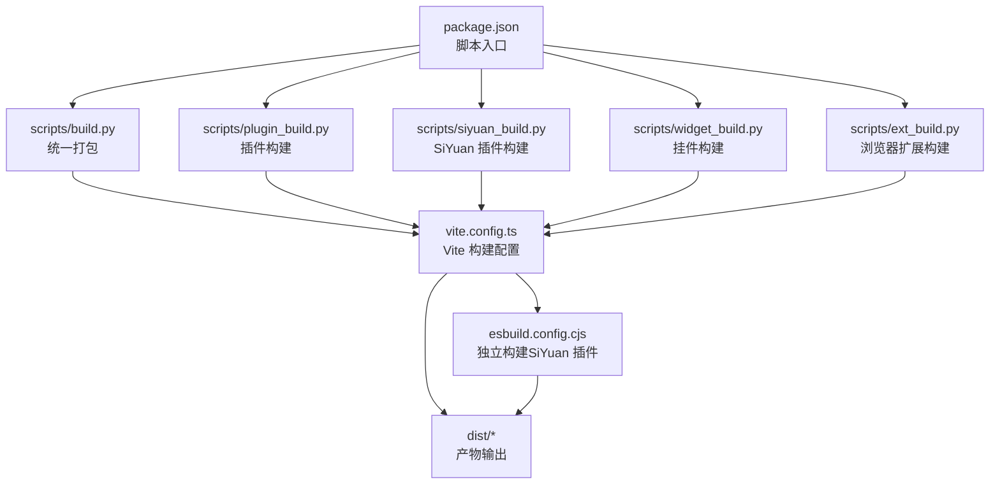
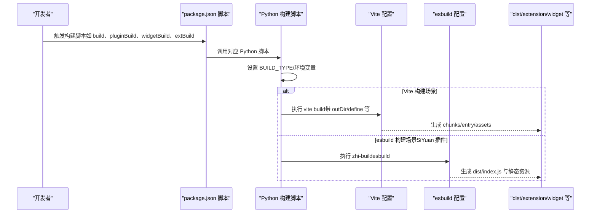
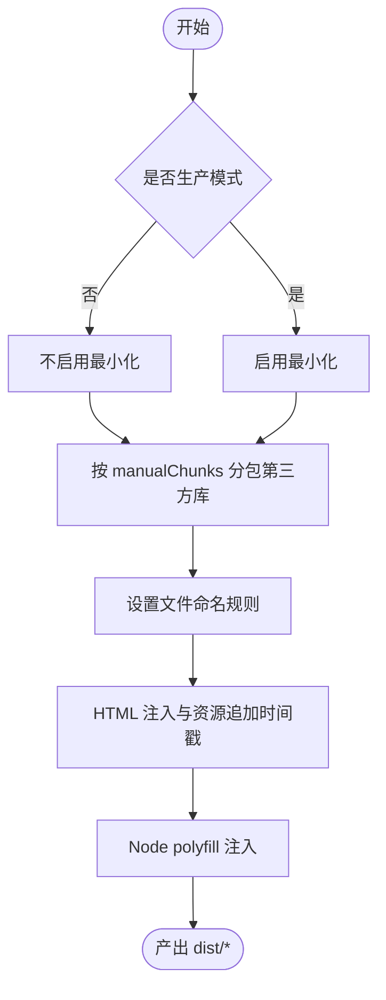
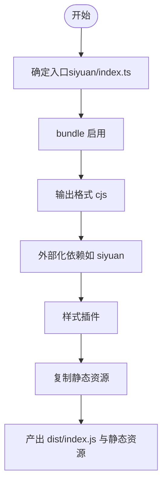
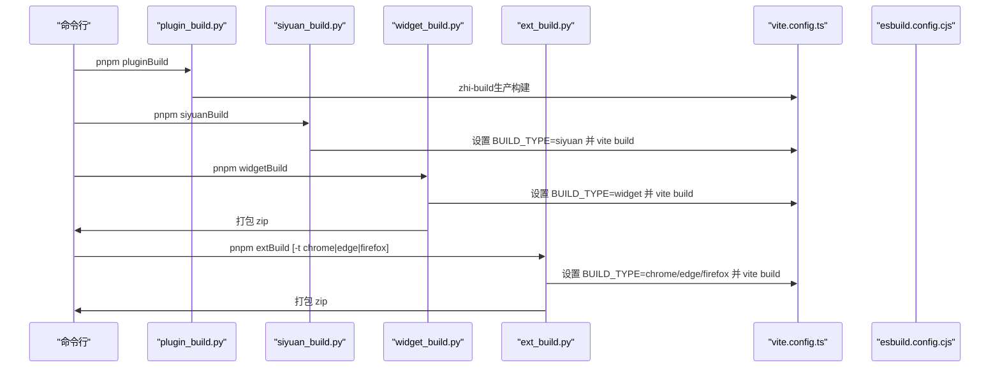
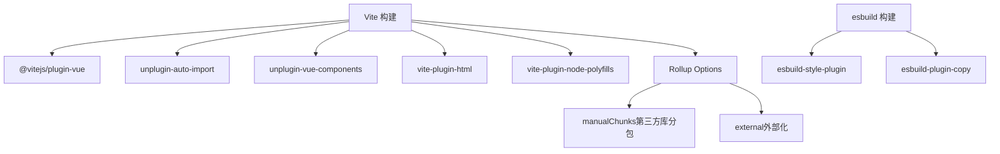

# 构建优化

<cite>
**本文引用的文件**   
- [package.json](file://package.json)
- [vite.config.ts](file://vite.config.ts)
- [esbuild.config.cjs](file://esbuild.config.cjs)
- [syp.config.ts](file://syp.config.ts)
- [tsconfig.json](file://tsconfig.json)
- [scripts/build.py](file://scripts/build.py)
- [scripts/plugin_build.py](file://scripts/plugin_build.py)
- [scripts/siyuan_build.py](file://scripts/siyuan_build.py)
- [scripts/widget_build.py](file://scripts/widget_build.py)
- [scripts/ext_build.py](file://scripts/ext_build.py)
- [scripts/scriptutils.py](file://scripts/scriptutils.py)
- [README.md](file://README.md)
</cite>

## 目录
1. [简介](#简介)
2. [项目结构](#项目结构)
3. [核心组件](#核心组件)
4. [架构总览](#架构总览)
5. [详细组件分析](#详细组件分析)
6. [依赖分析](#依赖分析)
7. [性能考量](#性能考量)
8. [故障排查指南](#故障排查指南)
9. [结论](#结论)
10. [附录](#附录)

## 简介
本文件面向构建优化策略，结合仓库现有配置与脚本，系统阐述代码分割、懒加载、Tree Shaking、资源压缩等优化技术，并给出手动分包、第三方库分离、缓存策略的落地方法；同时覆盖构建性能监控、Bundle分析与体积优化技巧，并提供多场景（插件、挂件、浏览器扩展、Nginx部署）的优化方案与调优建议。

## 项目结构
该工程采用多入口、多产物的构建策略，通过环境变量与脚本组合实现不同目标产物的构建与打包。核心构建配置集中在 Vite 与 esbuild 两套方案中，配合 Python 脚本进行统一编排与打包。

图表来源
- [package.json:1-99](file://package.json#L1-L99)
- [scripts/build.py:1-57](file://scripts/build.py#L1-L57)
- [scripts/plugin_build.py:1-39](file://scripts/plugin_build.py#L1-L39)
- [scripts/siyuan_build.py:1-42](file://scripts/siyuan_build.py#L1-L42)
- [scripts/widget_build.py:1-94](file://scripts/widget_build.py#L1-L94)
- [scripts/ext_build.py:1-150](file://scripts/ext_build.py#L1-L150)
- [vite.config.ts:1-275](file://vite.config.ts#L1-L275)
- [esbuild.config.cjs:1-83](file://esbuild.config.cjs#L1-L83)

章节来源
- [package.json:1-99](file://package.json#L1-L99)
- [vite.config.ts:1-275](file://vite.config.ts#L1-L275)
- [esbuild.config.cjs:1-83](file://esbuild.config.cjs#L1-L83)
- [scripts/build.py:1-57](file://scripts/build.py#L1-L57)
- [scripts/plugin_build.py:1-39](file://scripts/plugin_build.py#L1-L39)
- [scripts/siyuan_build.py:1-42](file://scripts/siyuan_build.py#L1-L42)
- [scripts/widget_build.py:1-94](file://scripts/widget_build.py#L1-L94)
- [scripts/ext_build.py:1-150](file://scripts/ext_build.py#L1-L150)

## 核心组件
- 构建编排层（Python 脚本）
  - 统一入口：通过 package.json 的脚本组合执行多场景构建与打包。
  - 场景脚本：分别针对插件、挂件、浏览器扩展、Nginx部署等场景提供独立构建流程。
- 构建配置层（Vite + esbuild）
  - Vite：负责前端应用构建、代码分割、第三方库分离、HTML 注入、polyfill、最小化与输出命名策略。
  - esbuild：用于 SiYuan 插件的独立构建，包含样式插件与静态资源复制。
- 类型与别名（TypeScript）
  - tsconfig.json 提供模块解析、路径别名与严格性配置，确保构建一致性。
- 运行时配置（运行时常量）
  - syp.config.ts 定义运行时配置接口与默认值，便于在构建后注入或替换。

章节来源
- [package.json:1-99](file://package.json#L1-L99)
- [vite.config.ts:1-275](file://vite.config.ts#L1-L275)
- [esbuild.config.cjs:1-83](file://esbuild.config.cjs#L1-L83)
- [tsconfig.json:1-34](file://tsconfig.json#L1-L34)
- [syp.config.ts:1-52](file://syp.config.ts#L1-L52)

## 架构总览
下图展示从脚本到构建配置再到产物的整体流程，以及不同构建场景的差异点。

图表来源
- [package.json:1-99](file://package.json#L1-L99)
- [scripts/build.py:1-57](file://scripts/build.py#L1-L57)
- [scripts/plugin_build.py:1-39](file://scripts/plugin_build.py#L1-L39)
- [scripts/siyuan_build.py:1-42](file://scripts/siyuan_build.py#L1-L42)
- [scripts/widget_build.py:1-94](file://scripts/widget_build.py#L1-L94)
- [scripts/ext_build.py:1-150](file://scripts/ext_build.py#L1-L150)
- [vite.config.ts:1-275](file://vite.config.ts#L1-L275)
- [esbuild.config.cjs:1-83](file://esbuild.config.cjs#L1-L83)

## 详细组件分析

### Vite 构建配置与优化要点
- 代码分割与手动分包
  - 通过 Rollup 的 manualChunks 回调对 node_modules 进行按包拆分，生成 vendor_* 前缀的第三方包块，提升缓存命中率。
  - 入口、chunk、asset 文件命名规则可按需调整，便于 CDN 缓存与回源控制。
- 第三方库分离与外部化
  - external 数组用于声明不打包的依赖（当前为空），可按需将稳定不变的库外部化，减少重复打包与体积。
- 最小化与 SourceMap
  - 生产环境启用最小化；SourceMap 默认关闭，以降低体积与提高安全性。
- HTML 注入与缓存策略
  - HTML 插件在生产环境进行压缩；通过 transformIndexHtml 插件为静态资源追加时间戳查询参数，实现强缓存下的失效与刷新。
  - polyfill 插件为浏览器提供 Node 兼容能力，避免运行时缺失。
- 开发体验与热更新
  - watch 模式下启用 livereload 与静态资源监听，提升迭代效率。
- 环境变量与别名
  - define 注入自定义变量；路径别名 ~ 指向项目根目录，简化导入路径。

图表来源
- [vite.config.ts:151-183](file://vite.config.ts#L151-L183)
- [vite.config.ts:183-231](file://vite.config.ts#L183-L231)
- [vite.config.ts:233-255](file://vite.config.ts#L233-L255)

章节来源
- [vite.config.ts:1-275](file://vite.config.ts#L1-L275)

### esbuild 配置与优化要点
- 独立构建（SiYuan 插件）
  - 以 siyuan/index.ts 为入口，输出 dist/index.js，格式为 cjs，外部化 siyuan。
  - 集成样式插件与静态资源复制，保证样式与资源随构建同步。
- 适用场景
  - 适用于需要快速产出单入口、单文件的插件或工具链集成场景。

图表来源
- [esbuild.config.cjs:1-83](file://esbuild.config.cjs#L1-L83)

章节来源
- [esbuild.config.cjs:1-83](file://esbuild.config.cjs#L1-L83)

### TypeScript 与路径别名
- 模块解析采用 bundler 模式，支持 TS/JS 混合与 JSON 模块。
- 路径别名 ~ 指向根目录，简化导入路径，提升可维护性。
- 关闭严格检查与未使用项检查，降低构建门槛，但建议在 CI 中开启严格模式以保障质量。

章节来源
- [tsconfig.json:1-34](file://tsconfig.json#L1-L34)

### 运行时配置（syp.config.ts）
- 定义语言与动态配置键，作为运行时配置的契约与默认值。
- 便于在构建后注入或替换，满足多平台、多语言的差异化需求。

章节来源
- [syp.config.ts:1-52](file://syp.config.ts#L1-L52)

### 多场景构建脚本与产物组织
- 统一打包（build）
  - 调用插件与挂件构建脚本，随后将 dist 打包为 zip，便于发布。
- 插件构建（pluginBuild）
  - 通过 zhi-build 执行生产构建。
- SiYuan 插件构建（siyuanBuild）
  - 设置 BUILD_TYPE=siyuan，执行 Vite 构建。
- 挂件构建（widgetBuild）
  - 设置 BUILD_TYPE=widget，复制必要资源后执行 Vite 构建，并打包 zip。
- 浏览器扩展构建（extBuild）
  - 支持 Chrome/Edge/Firefox，复制扩展资源后执行 Vite 构建，并按类型打包 zip。

图表来源
- [scripts/plugin_build.py:1-39](file://scripts/plugin_build.py#L1-L39)
- [scripts/siyuan_build.py:1-42](file://scripts/siyuan_build.py#L1-L42)
- [scripts/widget_build.py:1-94](file://scripts/widget_build.py#L1-L94)
- [scripts/ext_build.py:1-150](file://scripts/ext_build.py#L1-L150)
- [vite.config.ts:1-275](file://vite.config.ts#L1-L275)
- [esbuild.config.cjs:1-83](file://esbuild.config.cjs#L1-L83)

章节来源
- [scripts/build.py:1-57](file://scripts/build.py#L1-L57)
- [scripts/plugin_build.py:1-39](file://scripts/plugin_build.py#L1-L39)
- [scripts/siyuan_build.py:1-42](file://scripts/siyuan_build.py#L1-L42)
- [scripts/widget_build.py:1-94](file://scripts/widget_build.py#L1-L94)
- [scripts/ext_build.py:1-150](file://scripts/ext_build.py#L1-L150)

## 依赖分析
- 构建工具链
  - Vite + @vitejs/plugin-vue：现代化前端构建与开发体验。
  - unplugin-auto-import / unplugin-vue-components：自动导入与组件解析，减少样板代码。
  - vite-plugin-html：HTML 注入与压缩。
  - vite-plugin-node-polyfills：浏览器侧 Node 能力 polyfill。
  - esbuild + esbuild-style-plugin + esbuild-plugin-copy：轻量级独立构建与资源复制。
- 依赖外部化与分包
  - 当前 external 为空，建议将稳定第三方库外部化，结合 manualChunks 实现更细粒度的分包。
- 资源注入与缓存
  - HTML 插件与 transformIndexHtml 插件共同实现资源追加时间戳，提升缓存可控性。

图表来源
- [vite.config.ts:1-275](file://vite.config.ts#L1-L275)
- [esbuild.config.cjs:1-83](file://esbuild.config.cjs#L1-L83)

章节来源
- [vite.config.ts:1-275](file://vite.config.ts#L1-L275)
- [esbuild.config.cjs:1-83](file://esbuild.config.cjs#L1-L83)

## 性能考量
- 代码分割与缓存
  - 使用 manualChunks 按包名拆分第三方库，结合资源追加时间戳，实现长缓存与增量更新。
  - 建议对稳定不变的库进行 external，进一步降低主包体积。
- 最小化与压缩
  - 生产环境启用最小化；若需更激进的压缩，可在 CI 中尝试 terser 并开启死代码消除。
- 构建性能监控
  - 使用 Vite 的内置日志与统计信息；在 CI 中引入构建耗时分析与体积对比工具。
- Bundle 分析
  - 结合可视化分析工具（如 webpack-bundle-analyzer 或 Vite 自带分析）识别大体积模块与重复依赖。
- 资源优化
  - 图片与 SVG 已通过 transformIndexHtml 追加时间戳；建议对图片进行格式优化与尺寸裁剪。
- 开发体验
  - watch 模式下启用 livereload 与静态资源监听，缩短反馈周期。

[本节为通用性能指导，无需特定文件引用]

## 故障排查指南
- 构建失败或产物异常
  - 检查 BUILD_TYPE 是否正确设置（siyuan/widget/chrome/edge/firefox）。
  - 确认 outDir 与 dist 目录权限，避免写入失败。
- 资源缓存问题
  - 若出现缓存不更新，确认 transformIndexHtml 是否生效，以及浏览器缓存策略。
- 第三方库未生效
  - 若 external 未按预期工作，检查 external 列表与 manualChunks 规则。
- 打包体积过大
  - 使用分析工具定位大模块；考虑 external 与 manualChunks 调整；移除未使用的依赖。
- Python 打包脚本
  - 若 zip 打包失败，检查脚本utils的路径与权限，确保 dist 目录存在且可读。

章节来源
- [scripts/scriptutils.py:1-243](file://scripts/scriptutils.py#L1-L243)
- [vite.config.ts:151-183](file://vite.config.ts#L151-L183)
- [vite.config.ts:233-255](file://vite.config.ts#L233-L255)

## 结论
本项目已具备完善的多场景构建体系：Vite 负责前端应用构建与优化，esbuild 负责独立插件构建；通过 Python 脚本统一编排，形成可复用、可扩展的构建流水线。建议在现有基础上进一步完善第三方库外部化、分包策略与缓存控制，并引入构建性能监控与 Bundle 分析，以持续优化体积与速度。

[本节为总结性内容，无需特定文件引用]

## 附录
- 快速参考
  - 插件构建：pnpm pluginBuild
  - SiYuan 插件构建：pnpm siyuanBuild
  - 挂件构建：pnpm widgetBuild
  - 浏览器扩展构建：pnpm extBuild [-t chrome|edge|firefox]
  - 统一打包：pnpm build

章节来源
- [README.md:1-102](file://README.md#L1-L102)
- [package.json:1-99](file://package.json#L1-L99)