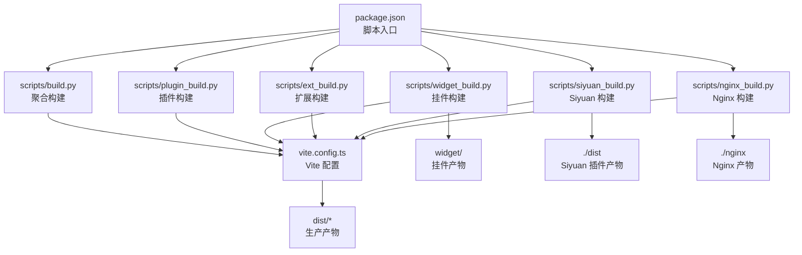
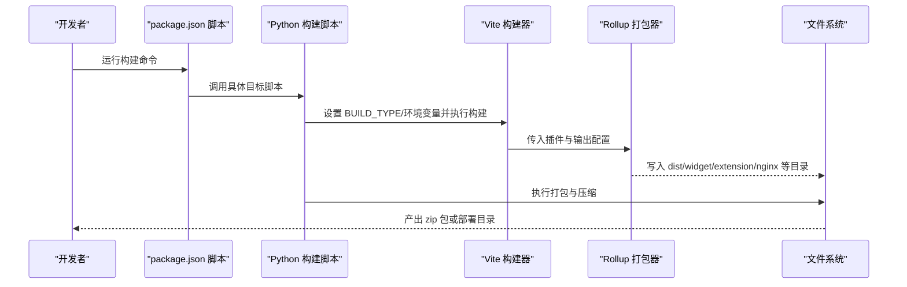
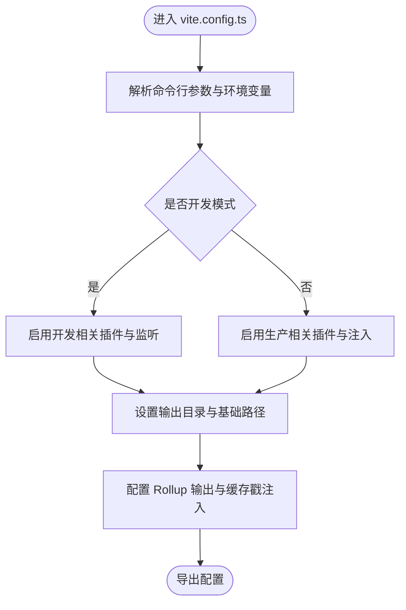
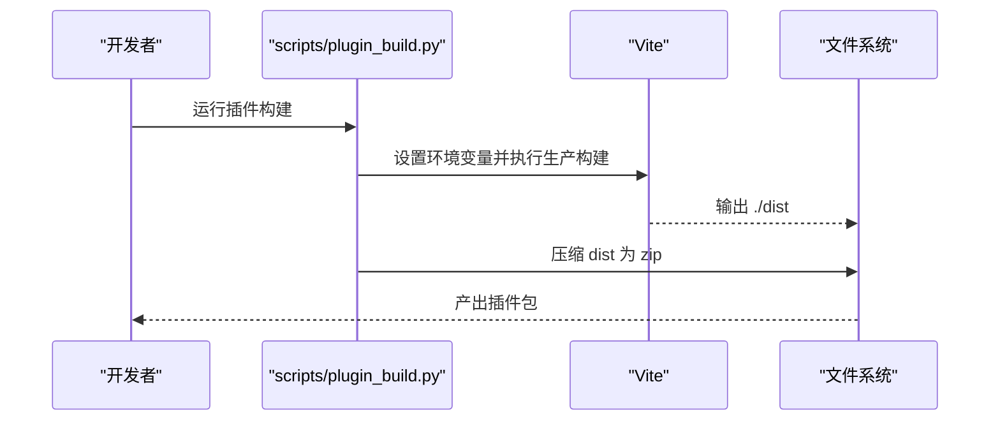
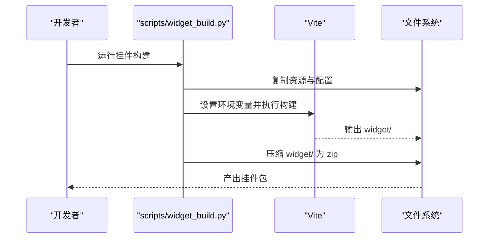
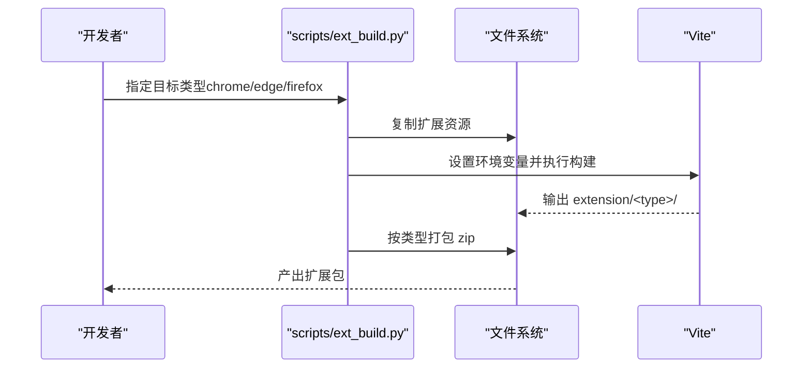
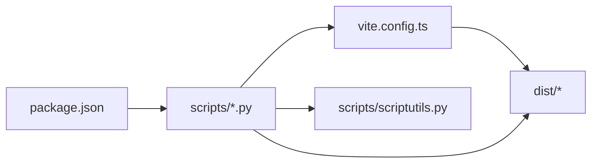

# 构建系统

<cite>
**本文引用的文件**
- [package.json](file://package.json)
- [vite.config.ts](file://vite.config.ts)
- [tsconfig.json](file://tsconfig.json)
- [tsconfig.node.json](file://tsconfig.node.json)
- [.eslintrc.cjs](file://.eslintrc.cjs)
- [.prettierrc.cjs](file://.prettierrc.cjs)
- [scripts/build.py](file://scripts/build.py)
- [scripts/plugin_build.py](file://scripts/plugin_build.py)
- [scripts/widget_build.py](file://scripts/widget_build.py)
- [scripts/ext_build.py](file://scripts/ext_build.py)
- [scripts/siyuan_build.py](file://scripts/siyuan_build.py)
- [scripts/nginx_build.py](file://scripts/nginx_build.py)
- [scripts/scriptutils.py](file://scripts/scriptutils.py)
- [plugin.json](file://plugin.json)
- [widget.json](file://widget.json)
- [src/extensions/manifest.json](file://src/extensions/manifest.json)
- [syp.config.ts](file://syp.config.ts)
</cite>

## 目录
1. [简介](#简介)
2. [项目结构](#项目结构)
3. [核心组件](#核心组件)
4. [架构总览](#架构总览)
5. [详细组件分析](#详细组件分析)
6. [依赖关系分析](#依赖关系分析)
7. [性能考虑](#性能考虑)
8. [故障排查指南](#故障排查指南)
9. [结论](#结论)
10. [附录](#附录)

## 简介
本文件系统性梳理该构建系统的整体设计与实现，覆盖以下方面：
- Vite 构建配置与多目标输出（开发、生产、插件、挂件、Chrome 扩展、Nginx 部署）
- TypeScript 编译设置与类型检查策略
- ESLint 与 Prettier 代码规范配置及集成方式
- 多环境构建流程与产物结构
- 版本管理与发布流程
- 构建优化技巧与性能调优建议

## 项目结构
该仓库采用“前端应用 + 多目标构建脚本 + 配置文件”的组织方式：
- 前端应用位于 src 目录，使用 Vite + Vue 3 + TypeScript
- 构建脚本集中于 scripts 目录，按目标拆分 Python 脚本
- 配置文件包括 Vite、TypeScript、ESLint、Prettier 等
- 产物目标包括：Siyuan 插件包、挂件包、浏览器扩展包、Nginx 部署包

图表来源
- [package.json:1-99](file://package.json#L1-L99)
- [scripts/build.py:1-57](file://scripts/build.py#L1-L57)
- [scripts/plugin_build.py:1-39](file://scripts/plugin_build.py#L1-L39)
- [scripts/widget_build.py:1-94](file://scripts/widget_build.py#L1-L94)
- [scripts/ext_build.py:1-150](file://scripts/ext_build.py#L1-L150)
- [scripts/siyuan_build.py:1-42](file://scripts/siyuan_build.py#L1-L42)
- [scripts/nginx_build.py:1-59](file://scripts/nginx_build.py#L1-L59)
- [vite.config.ts:1-275](file://vite.config.ts#L1-L275)

章节来源
- [package.json:1-99](file://package.json#L1-L99)
- [vite.config.ts:1-275](file://vite.config.ts#L1-L275)

## 核心组件
- Vite 构建配置：统一的构建入口，通过环境变量与参数控制目标类型与输出目录；内置 HTML 注入、Node polyfill、自动导入组件与图标等插件；Rollup 输出策略与缓存戳注入增强缓存失效控制。
- TypeScript 配置：面向浏览器/Node 的双层 tsconfig，严格模式关闭以便快速迭代，配合 Vite 的 bundler 模式解析。
- 代码规范：ESLint 继承推荐规则集并关闭部分噪声规则，结合 Prettier 规则统一风格。
- 多目标构建脚本：分别针对插件、挂件、扩展、Siyuan、Nginx 的构建与打包流程。

章节来源
- [vite.config.ts:1-275](file://vite.config.ts#L1-L275)
- [tsconfig.json:1-34](file://tsconfig.json#L1-L34)
- [tsconfig.node.json:1-11](file://tsconfig.node.json#L1-L11)
- [.eslintrc.cjs:1-36](file://.eslintrc.cjs#L1-L36)
- [.prettierrc.cjs:1-34](file://.prettierrc.cjs#L1-L34)

## 架构总览
下图展示从脚本入口到最终产物的关键流程与交互：

图表来源
- [package.json:9-27](file://package.json#L9-L27)
- [scripts/build.py:38](file://scripts/build.py#L38)
- [scripts/widget_build.py:60-74](file://scripts/widget_build.py#L60-L74)
- [scripts/ext_build.py:126-132](file://scripts/ext_build.py#L126-L132)
- [scripts/siyuan_build.py:39-41](file://scripts/siyuan_build.py#L39-L41)
- [scripts/nginx_build.py:39-41](file://scripts/nginx_build.py#L39-L41)
- [vite.config.ts:66-71](file://vite.config.ts#L66-L71)

## 详细组件分析

### Vite 构建配置
- 目标识别与输出目录
  - 通过环境变量 BUILD_TYPE 识别目标类型（siyuan/widget/nginx），并据此设置输出目录与基础路径。
  - 开发模式下启用热更新与监听，生产模式关闭最小化与 SourceMap。
- 插件生态
  - Vue、图标自动安装、自动导入与组件解析、HTML 注入（开发时注入本地库）、Node polyfill。
- 输出与缓存
  - 自定义 chunk 与文件命名策略，按依赖前缀拆分 vendor 包；在 HTML 中注入时间戳查询参数以避免缓存。
- 测试配置
  - Vitest 集成 jsdom 环境与 setupFiles，内联特定依赖以提升测试稳定性。

图表来源
- [vite.config.ts:59-71](file://vite.config.ts#L59-L71)
- [vite.config.ts:81-181](file://vite.config.ts#L81-L181)
- [vite.config.ts:197-256](file://vite.config.ts#L197-L256)
- [vite.config.ts:258-274](file://vite.config.ts#L258-L274)

章节来源
- [vite.config.ts:1-275](file://vite.config.ts#L1-L275)

### TypeScript 编译设置
- 目标与模块解析
  - 目标 ES2020，模块解析采用 bundler，允许 TS/JS 混合与 JSON 导入。
- 类型检查与严格性
  - 关闭严格模式与未使用检测，便于快速迭代；通过独立的类型检查脚本进行质量把关。
- 路径别名与类型声明
  - 使用路径别名 ~ 指向根目录；包含自定义 d.ts 与 Vue 文件类型。

章节来源
- [tsconfig.json:1-34](file://tsconfig.json#L1-L34)
- [tsconfig.node.json:1-11](file://tsconfig.node.json#L1-L11)

### ESLint 与 Prettier 规范
- ESLint
  - 继承官方推荐规则、TypeScript、Vue3 推荐规则集，并引入 Prettier 与 turbo 规则；关闭若干噪声规则，保留 Prettier 校验为错误级别。
- Prettier
  - 关闭分号与单引号，设定打印宽度为 120。

章节来源
- [.eslintrc.cjs:1-36](file://.eslintrc.cjs#L1-L36)
- [.prettierrc.cjs:1-34](file://.prettierrc.cjs#L1-L34)

### 多环境构建流程

#### 插件构建（Siyuan 插件包）
- 目标：生成 ./dist，随后打包为 zip，供插件市场或手动安装。
- 关键点：设置 BUILD_TYPE=siyuan，调用 zhi-build 生产环境构建；最后压缩 dist 目录。

图表来源
- [scripts/plugin_build.py:38](file://scripts/plugin_build.py#L38)
- [scripts/build.py:38](file://scripts/build.py#L38)

章节来源
- [scripts/plugin_build.py:1-39](file://scripts/plugin_build.py#L1-L39)
- [scripts/build.py:1-57](file://scripts/build.py#L1-L57)

#### 挂件构建（Widget）
- 目标：生成 widget/ 目录，复制必要资源与配置文件，再打包 zip。
- 关键点：设置 BUILD_TYPE=widget，复制 icon、README、policy、widget.json 等；构建后压缩。

图表来源
- [scripts/widget_build.py:60-74](file://scripts/widget_build.py#L60-L74)
- [scripts/widget_build.py:87-91](file://scripts/widget_build.py#L87-L91)

章节来源
- [scripts/widget_build.py:1-94](file://scripts/widget_build.py#L1-L94)

#### 浏览器扩展构建（Chrome/Edge/Firefox）
- 目标：根据目标类型生成 extension/chrome、extension/edge 或 extension/firefox，再打包 zip。
- 关键点：复制 src/extensions 到目标目录；按类型替换/删除 manifest 与背景脚本；设置 BUILD_TYPE 与 API 地址；构建后压缩。

图表来源
- [scripts/ext_build.py:120-132](file://scripts/ext_build.py#L120-L132)
- [scripts/ext_build.py:135-147](file://scripts/ext_build.py#L135-L147)

章节来源
- [scripts/ext_build.py:1-150](file://scripts/ext_build.py#L1-L150)

#### Siyuan 构建
- 目标：直接构建到 ./dist，供 Siyuan 插件加载。
- 关键点：设置 BUILD_TYPE=siyuan，执行生产构建。

章节来源
- [scripts/siyuan_build.py:1-42](file://scripts/siyuan_build.py#L1-L42)

#### Nginx 构建
- 目标：构建到 ./nginx，便于部署静态站点。
- 关键点：设置 BUILD_TYPE=nginx，输出到 nginx/ 并打包 zip。

章节来源
- [scripts/nginx_build.py:1-59](file://scripts/nginx_build.py#L1-L59)

### 构建产物结构
- 插件包：dist/ 目录压缩为 zip，包含插件运行所需资源。
- 挂件包：widget/ 目录压缩为 zip，包含挂件运行所需资源。
- 扩展包：extension/<type>/ 目录压缩为 zip，包含对应浏览器扩展资源。
- Nginx 包：nginx/ 目录压缩为 zip，包含静态站点资源。
- 配置文件：各目标均包含对应的配置文件（如 plugin.json、widget.json、manifest.json）。

章节来源
- [plugin.json:1-43](file://plugin.json#L1-L43)
- [widget.json:1-38](file://widget.json#L1-L38)
- [src/extensions/manifest.json:1-41](file://src/extensions/manifest.json#L1-L41)

### 版本管理与发布流程
- 版本来源：package.json 的 version 字段作为统一版本号。
- 发布脚本：通过 prepareRelease 脚本同步版本与解析变更日志，随后由各目标构建脚本生成对应 zip 包。
- 动态配置：syp.config.ts 提供动态配置键位，便于运行时注入平台配置。

章节来源
- [package.json:3](file://package.json#L3)
- [package.json:25](file://package.json#L25)
- [scripts/build.py:42-52](file://scripts/build.py#L42-L52)
- [scripts/widget_build.py:79-88](file://scripts/widget_build.py#L79-L88)
- [scripts/nginx_build.py:45-55](file://scripts/nginx_build.py#L45-L55)
- [syp.config.ts:26-49](file://syp.config.ts#L26-L49)

## 依赖关系分析
- 脚本入口与目标脚本
  - package.json 的 scripts 字段统一调度各目标构建脚本。
- 目标脚本与 Vite
  - 各 Python 脚本设置 BUILD_TYPE 与必要环境变量，调用 Vite 执行构建。
- 工具库
  - scriptutils 提供通用文件操作（复制、移动、删除、压缩等），被多个目标脚本复用。

图表来源
- [package.json:9-27](file://package.json#L9-L27)
- [scripts/scriptutils.py:169-224](file://scripts/scriptutils.py#L169-L224)
- [vite.config.ts:66-71](file://vite.config.ts#L66-L71)

章节来源
- [package.json:1-99](file://package.json#L1-L99)
- [scripts/scriptutils.py:1-243](file://scripts/scriptutils.py#L1-L243)
- [vite.config.ts:1-275](file://vite.config.ts#L1-L275)

## 性能考虑
- 构建性能
  - 生产模式关闭最小化与 SourceMap，缩短构建时间；按依赖前缀拆分 vendor 包，提升缓存命中率。
  - HTML 注入时间戳查询参数，避免浏览器缓存导致的更新不生效。
- 依赖与体积
  - 使用 fast-glob 监听静态资源文件，减少不必要的全量扫描。
  - 通过自动导入与组件解析减少手写样板代码，间接降低打包体积。
- 测试性能
  - Vitest 使用 jsdom 环境与 setupFiles，内联特定依赖，提高测试启动速度。

章节来源
- [vite.config.ts:209-210](file://vite.config.ts#L209-L210)
- [vite.config.ts:238-253](file://vite.config.ts#L238-L253)
- [vite.config.ts:153-166](file://vite.config.ts#L153-L166)
- [vite.config.ts:268-272](file://vite.config.ts#L268-L272)

## 故障排查指南
- 构建失败
  - 检查 BUILD_TYPE 是否正确设置；确认目标目录权限与磁盘空间。
  - 查看各目标脚本的环境变量设置与命令拼接是否正确。
- 产物异常
  - 若挂件/扩展缺少资源，确认脚本已复制 icon、README、manifest 等文件。
  - 若缓存导致页面不更新，确认 HTML 注入的时间戳参数是否生效。
- 版本不一致
  - 确认 package.json 的 version 与各目标脚本的打包命名一致。

章节来源
- [scripts/widget_build.py:62-70](file://scripts/widget_build.py#L62-L70)
- [scripts/ext_build.py:120-124](file://scripts/ext_build.py#L120-L124)
- [vite.config.ts:153-166](file://vite.config.ts#L153-L166)
- [package.json:3](file://package.json#L3)

## 结论
该构建系统以 Vite 为核心，结合 Python 脚本实现多目标构建与打包，具备良好的可维护性与扩展性。通过明确的目标识别、统一的产物结构与版本管理机制，能够高效产出插件、挂件、扩展与静态站点等多形态产物。建议在后续迭代中进一步完善 CI/CD 集成与产物校验流程，持续优化构建性能与缓存策略。

## 附录
- 常用命令
  - 开发：pnpm dev
  - 插件构建：pnpm pluginBuild
  - 挂件构建：pnpm widgetBuild
  - 扩展构建：pnpm extBuild（可选 -t chrome/edge/firefox）
  - Siyuan 构建：pnpm siyuanBuild
  - Nginx 构建：pnpm nginxBuild
  - 聚合打包：pnpm package
  - 版本同步与变更日志：pnpm prepareRelease

章节来源
- [package.json:9-27](file://package.json#L9-L27)