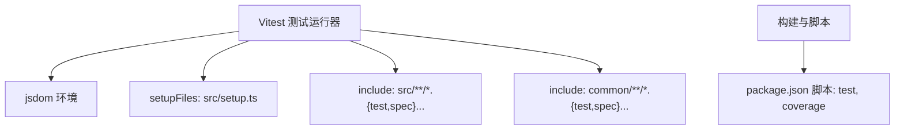
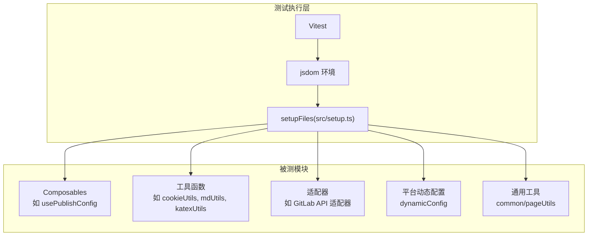
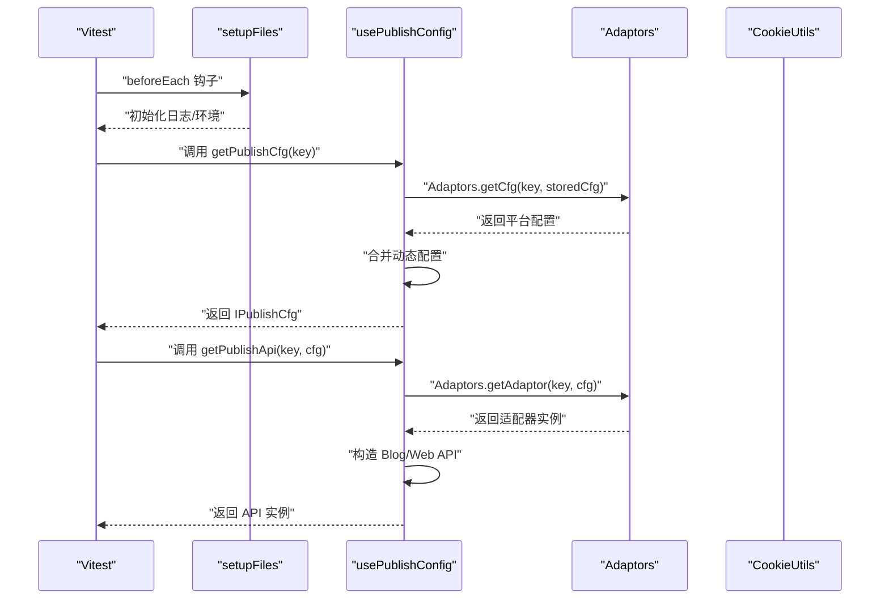
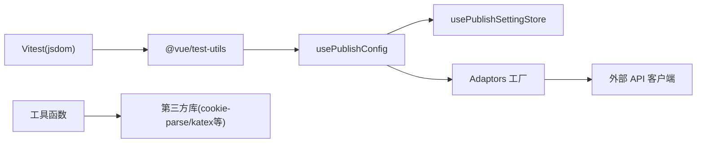

# 测试策略

<cite>
**本文引用的文件**
- [package.json](file://package.json)
- [vite.config.ts](file://vite.config.ts)
- [src/setup.ts](file://src/setup.ts)
- [src/composables/usePublishConfig.spec.ts](file://src/composables/usePublishConfig.spec.ts)
- [src/composables/usePublishConfig.ts](file://src/composables/usePublishConfig.ts)
- [src/utils/cookieUtils.spec.ts](file://src/utils/cookieUtils.spec.ts)
- [src/utils/cookieUtils.ts](file://src/utils/cookieUtils.ts)
- [src/utils/katexUtils.spec.ts](file://src/utils/katexUtils.spec.ts)
- [src/utils/mdUtils.spec.ts](file://src/utils/mdUtils.spec.ts)
- [src/platforms/dynamicConfig.spec.ts](file://src/platforms/dynamicConfig.spec.ts)
- [src/adaptors/api/base/gitlab/commonGitlabApiAdaptor.spec.ts](file://src/adaptors/api/base/gitlab/commonGitlabApiAdaptor.spec.ts)
- [src/adaptors/web/bilibili/bilibiliUtils.spec.ts](file://src/adaptors/web/bilibili/bilibiliUtils.spec.ts)
- [src/adaptors/web/csdn/csdnUtils.spec.ts](file://src/adaptors/web/csdn/csdnUtils.spec.ts)
- [common/pageUtils.spec.ts](file://common/pageUtils.spec.ts)
</cite>

## 目录
1. [引言](#引言)
2. [项目结构](#项目结构)
3. [核心组件](#核心组件)
4. [架构总览](#架构总览)
5. [详细组件分析](#详细组件分析)
6. [依赖分析](#依赖分析)
7. [性能考虑](#性能考虑)
8. [故障排查指南](#故障排查指南)
9. [结论](#结论)
10. [附录](#附录)

## 引言
本测试策略文档面向该仓库的测试实施与质量保障，覆盖单元测试、集成测试与端到端测试的策略与最佳实践；重点阐述 Vue 组件测试、Composables 测试、适配器测试的方法论；并给出 Jest/Vitest 配置要点、测试数据准备与模拟对象创建建议、测试覆盖率要求、持续集成配置与自动化测试流程等质量保证措施。

## 项目结构
该项目采用 Vite + Vue 3 + Vitest 的前端技术栈，测试运行环境基于 jsdom，通过 vite.config.ts 的 test 字段统一配置。测试文件遵循 src/**/*.{test,spec}.{ts,js,...} 与 common/**/*.{test,spec}.{ts,js,...} 的命名约定，集中于 src 与 common 目录。

图表来源
- [vite.config.ts:258-273](file://vite.config.ts#L258-L273)
- [package.json:13-15](file://package.json#L13-L15)

章节来源
- [vite.config.ts:258-273](file://vite.config.ts#L258-L273)
- [package.json:13-15](file://package.json#L13-L15)

## 核心组件
- 测试运行器与环境：Vitest（jsdom），全局 setupFiles 注入测试前后钩子。
- 测试脚本：通过 package.json 的 test 与 coverage 脚本触发 Vitest。
- 测试范围：src 与 common 下所有 .spec.ts/.test.ts 文件，以及其对应的被测模块。

章节来源
- [vite.config.ts:258-273](file://vite.config.ts#L258-L273)
- [package.json:13-15](file://package.json#L13-L15)
- [src/setup.ts:10-18](file://src/setup.ts#L10-L18)

## 架构总览
下图展示了测试策略在系统中的位置与交互关系：测试驱动层（Vitest）通过 jsdom 提供 DOM 环境，加载 setupFiles 进行初始化，扫描 include 范围内的测试文件，分别对 Composables、工具函数、适配器与页面逻辑进行单元与集成测试。

图表来源
- [vite.config.ts:258-273](file://vite.config.ts#L258-L273)
- [src/setup.ts:10-18](file://src/setup.ts#L10-L18)
- [src/composables/usePublishConfig.ts:26-96](file://src/composables/usePublishConfig.ts#L26-L96)
- [src/utils/cookieUtils.ts:18-118](file://src/utils/cookieUtils.ts#L18-L118)
- [src/platforms/dynamicConfig.spec.ts:18-34](file://src/platforms/dynamicConfig.spec.ts#L18-L34)
- [src/adaptors/api/base/gitlab/commonGitlabApiAdaptor.spec.ts:15-30](file://src/adaptors/api/base/gitlab/commonGitlabApiAdaptor.spec.ts#L15-L30)
- [common/pageUtils.spec.ts:29-34](file://common/pageUtils.spec.ts#L29-L34)

## 详细组件分析

### Vue 组件测试
- 测试目标：验证组件渲染、事件交互、状态变更与生命周期行为。
- 推荐做法：
  - 使用 @vue/test-utils 的 mount/shallowMount 包装组件实例。
  - 通过 createVueApp 或直接挂载 App.vue，注入 i18n 与 router 插件。
  - 使用 jsdom 环境，确保 window/document 存在。
  - 使用 Vitest 的 beforeEach/afterEach 进行环境清理与断言。
- 实践参考：
  - usePublishConfig 测试中演示了挂载 App 并注入插件、设置环境变量的流程，可作为组件测试模板。

章节来源
- [src/composables/usePublishConfig.spec.ts:16-51](file://src/composables/usePublishConfig.spec.ts#L16-L51)

### Composables 测试
- 测试目标：验证组合式函数的返回值、副作用与异步行为。
- 推荐做法：
  - 直接调用组合式函数，断言返回的对象或响应式状态。
  - 对外部依赖（如存储、适配器工厂）进行模拟，隔离被测逻辑。
  - 使用 Vitest 的 mock 与 stub 能力，控制外部输入与输出。
- 实践参考：
  - usePublishConfig 提供了获取发布配置与发布 API 的能力，测试中可模拟 Adaptors 与存储，断言返回值结构与行为。

章节来源
- [src/composables/usePublishConfig.ts:26-96](file://src/composables/usePublishConfig.ts#L26-L96)
- [src/composables/usePublishConfig.spec.ts:16-51](file://src/composables/usePublishConfig.spec.ts#L16-L51)

### 适配器测试
- 测试目标：验证适配器的请求构造、参数传递、错误处理与返回格式。
- 推荐做法：
  - 使用最小化依赖的单元测试，避免真实网络请求。
  - 对外部 API 客户端进行模拟，断言请求参数与返回结果。
  - 针对不同平台（如 GitLab、CSDN、Bilibili）编写独立测试套件。
- 实践参考：
  - GitLab 适配器测试通过构造配置对象并调用 getUsersBlogs，验证返回结构。
  - CSDN 与 Bilibili 工具类测试覆盖签名生成与 Markdown 解析等关键逻辑。

章节来源
- [src/adaptors/api/base/gitlab/commonGitlabApiAdaptor.spec.ts:15-30](file://src/adaptors/api/base/gitlab/commonGitlabApiAdaptor.spec.ts#L15-L30)
- [src/adaptors/web/csdn/csdnUtils.spec.ts:13-46](file://src/adaptors/web/csdn/csdnUtils.spec.ts#L13-L46)
- [src/adaptors/web/bilibili/bilibiliUtils.spec.ts:14-29](file://src/adaptors/web/bilibili/bilibiliUtils.spec.ts#L14-L29)

### 工具函数测试
- 测试目标：验证纯函数与工具类的输入输出一致性、边界条件与异常处理。
- 推荐做法：
  - 针对每种输入类型设计多组用例，覆盖正常、异常与边界场景。
  - 对依赖外部库（如 cookie-parse、katex）的行为进行断言。
- 实践参考：
  - cookieUtils 测试覆盖数组合并、按 key 获取 cookie、字符串解析等。
  - mdUtils 测试覆盖符号替换、文件名生成等逻辑。
  - katexUtils 测试覆盖渲染输出。

章节来源
- [src/utils/cookieUtils.spec.ts:13-45](file://src/utils/cookieUtils.spec.ts#L13-L45)
- [src/utils/cookieUtils.ts:18-118](file://src/utils/cookieUtils.ts#L18-L118)
- [src/utils/mdUtils.spec.ts:13-88](file://src/utils/mdUtils.spec.ts#L13-L88)
- [src/utils/katexUtils.spec.ts:13-18](file://src/utils/katexUtils.spec.ts#L13-L18)

### 平台动态配置测试
- 测试目标：验证平台键生成、子平台类型识别与动态配置映射。
- 推荐做法：
  - 使用 expect 断言返回值类型与格式，确保正则匹配与枚举一致性。
- 实践参考：
  - dynamicConfig 测试覆盖 getSubPlatformTypeByKey 与 getNewPlatformKey。

章节来源
- [src/platforms/dynamicConfig.spec.ts:18-34](file://src/platforms/dynamicConfig.spec.ts#L18-L34)

### 通用工具测试
- 测试目标：验证跨模块复用的工具函数行为。
- 推荐做法：
  - common 目录下的工具应具备高内聚、低耦合特性，测试应聚焦单一职责。
- 实践参考：
  - common/pageUtils 测试覆盖平台名称截取逻辑。

章节来源
- [common/pageUtils.spec.ts:29-34](file://common/pageUtils.spec.ts#L29-L34)

### 测试流程时序图（以 usePublishConfig 为例）

图表来源
- [src/composables/usePublishConfig.spec.ts:35-50](file://src/composables/usePublishConfig.spec.ts#L35-L50)
- [src/composables/usePublishConfig.ts:36-78](file://src/composables/usePublishConfig.ts#L36-L78)
- [src/utils/cookieUtils.ts:18-118](file://src/utils/cookieUtils.ts#L18-L118)

## 依赖分析
- 测试运行时依赖：
  - Vitest（测试框架）、jsdom（DOM 环境）、@vue/test-utils（Vue 组件测试工具）。
- 被测模块依赖：
  - Composables 依赖存储与适配器工厂；工具函数依赖第三方库；适配器依赖外部 API 客户端。
- 关系图：

图表来源
- [package.json:40-46](file://package.json#L40-L46)
- [src/composables/usePublishConfig.ts:10-18](file://src/composables/usePublishConfig.ts#L10-L18)
- [src/utils/cookieUtils.ts:10-12](file://src/utils/cookieUtils.ts#L10-L12)

章节来源
- [package.json:40-46](file://package.json#L40-L46)
- [src/composables/usePublishConfig.ts:10-18](file://src/composables/usePublishConfig.ts#L10-L18)
- [src/utils/cookieUtils.ts:10-12](file://src/utils/cookieUtils.ts#L10-L12)

## 性能考虑
- 测试并发与隔离：Vitest 默认并发执行测试文件，建议将大型测试拆分为多个小文件，减少相互依赖。
- 模拟与桩：对外部依赖进行模拟，避免真实网络与磁盘 IO，提升执行速度。
- 缓存与重用：在 setupFiles 中进行一次性初始化，避免重复创建昂贵对象。
- 覆盖率采样：仅对关键路径与分支进行测试，平衡覆盖率与执行时间。

## 故障排查指南
- 环境变量缺失：usePublishConfig 测试中通过 process.env 设置默认类型与 API 地址，若测试失败，检查环境变量是否正确注入。
- DOM 环境问题：jsdom 未提供完整浏览器 API 时，需在 setupFiles 中引入 polyfill 或使用 node-polyfills 插件。
- 组件挂载失败：确保在测试前注入 i18n 与 router 插件，避免路由与国际化导致的渲染异常。
- 适配器超时：对网络请求进行超时与重试模拟，必要时使用本地 mock 服务。

章节来源
- [src/composables/usePublishConfig.spec.ts:20-33](file://src/composables/usePublishConfig.spec.ts#L20-L33)
- [vite.config.ts:171-180](file://vite.config.ts#L171-L180)

## 结论
本项目已具备完善的测试基础设施：Vitest + jsdom + @vue/test-utils，测试范围覆盖 Composables、工具函数、适配器与平台配置。建议在现有基础上进一步完善覆盖率目标、引入持续集成流水线与自动化测试，确保质量稳定与回归安全。

## 附录

### 测试工具与配置要点
- 运行器与环境
  - Vitest：通过 package.json 的 test 与 coverage 脚本启动。
  - jsdom：在 vite.config.ts 的 test.environment 中启用。
  - setupFiles：在 src/setup.ts 中统一注入测试前后钩子。
- 测试数据准备
  - 使用最小化数据集与固定输入，确保可重复性。
  - 对随机性逻辑（如签名生成）使用固定种子或显式输入。
- 模拟对象创建
  - 使用 Vitest 的 vi.fn/vi.mock 对外部依赖进行模拟。
  - 对适配器与 API 客户端进行桩对象替换，断言调用参数与返回值。

章节来源
- [package.json:13-15](file://package.json#L13-L15)
- [vite.config.ts:258-273](file://vite.config.ts#L258-L273)
- [src/setup.ts:10-18](file://src/setup.ts#L10-L18)

### 测试覆盖率要求（建议）
- 行覆盖率：≥80%
- 分支覆盖率：≥70%
- 函数覆盖率：≥85%
- 语句覆盖率：≥80%
- 对关键路径（如发布流程、适配器调用链）进行重点保障。

### 持续集成与自动化测试流程（建议）
- 触发条件：PR/MR 合并请求、主干推送。
- 步骤建议：
  - 安装依赖（pnpm install）
  - 运行测试：pnpm test
  - 生成覆盖率报告：pnpm coverage
  - 上传覆盖率（可选）至覆盖率平台
  - 产物归档（可选）

章节来源
- [package.json:13-15](file://package.json#L13-L15)