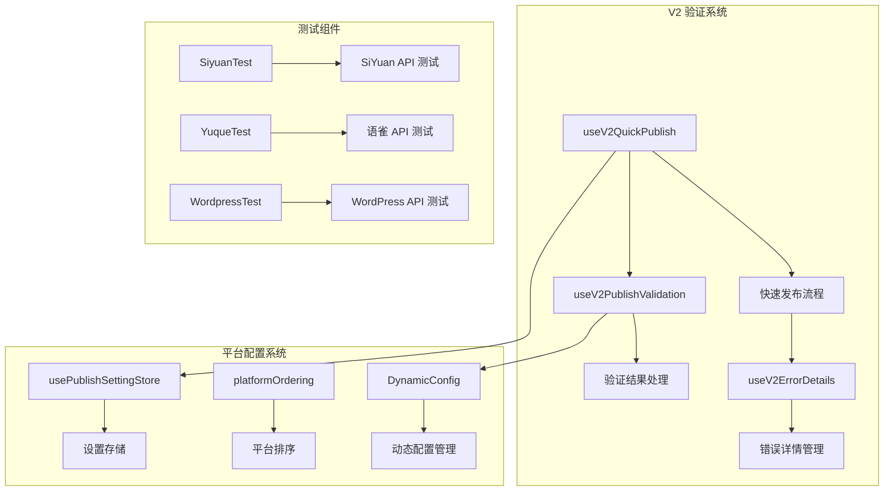
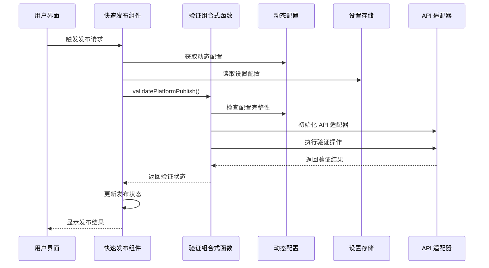
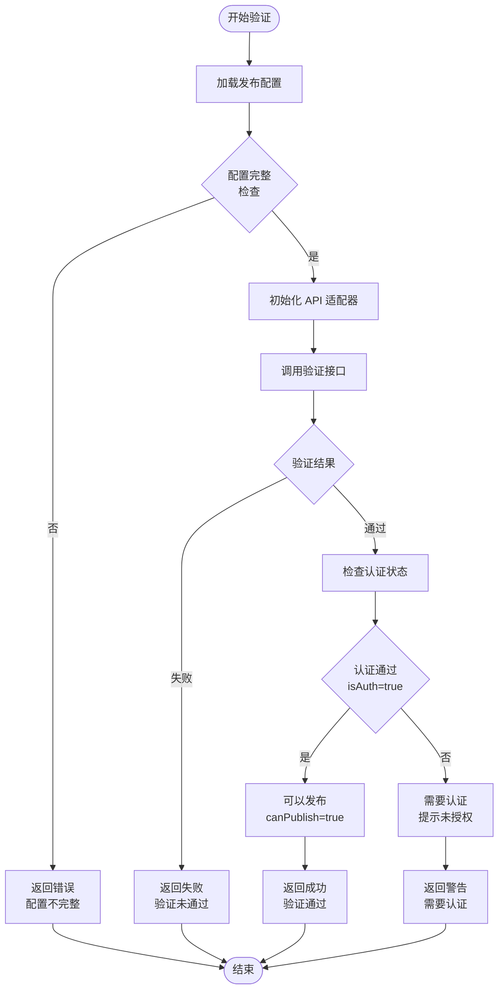
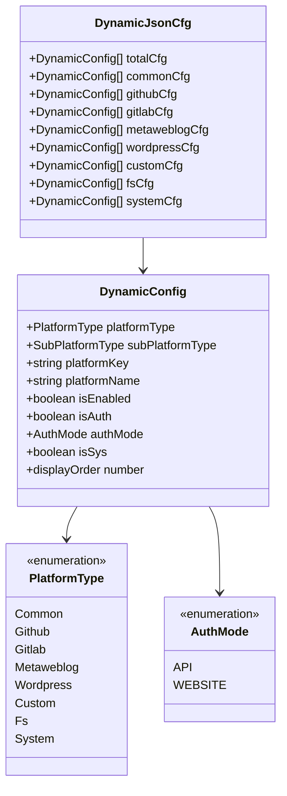
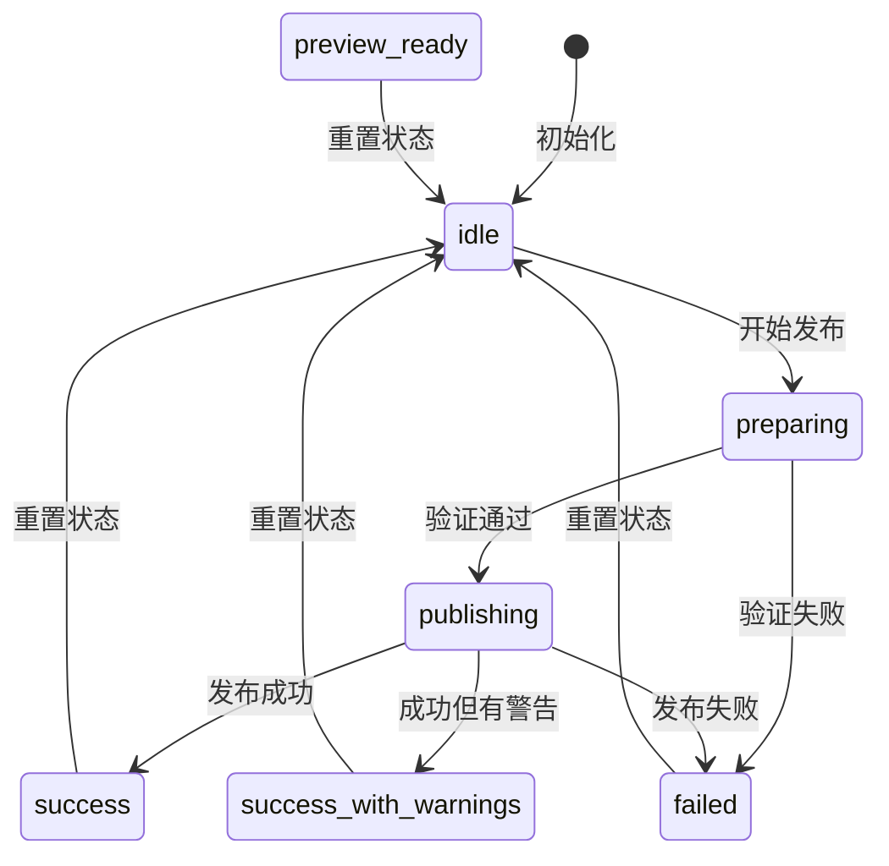
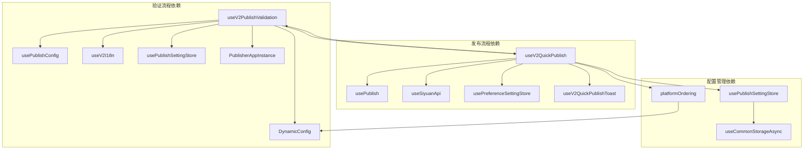

# V2 验证流程测试

<cite>
**本文档引用的文件**
- [useV2PublishValidation.ts](file://src/composables/v2/useV2PublishValidation.ts)
- [useV2QuickPublish.ts](file://src/composables/v2/useV2QuickPublish.ts)
- [useV2ErrorDetails.ts](file://src/composables/v2/useV2ErrorDetails.ts)
- [dynamicConfig.ts](file://src/platforms/dynamicConfig.ts)
- [usePublishSettingStore.ts](file://src/stores/usePublishSettingStore.ts)
- [platformOrdering.ts](file://src/composables/v2/platformOrdering.ts)
- [useV2QuickPublishToast.ts](file://src/composables/v2/useV2QuickPublishToast.ts)
- [SiyuanTest.vue](file://src/components/test/SiyuanTest.vue)
- [YuqueTest.vue](file://src/components/test/YuqueTest.vue)
- [WordpressTest.vue](file://src/components/test/WordpressTest.vue)
- [CsdnTest.vue](file://src/components/test/CsdnTest.vue)
- [HugoTest.vue](file://src/components/test/HugoTest.vue)
- [HexoTest.vue](file://src/components/test/HexoTest.vue)
- [OtherTest.vue](file://src/components/test/OtherTest.vue)
- [PicgoTest.vue](file://src/components/test/PicgoTest.vue)
</cite>

## 目录
1. [简介](#简介)
2. [项目结构](#项目结构)
3. [核心组件](#核心组件)
4. [架构概览](#架构概览)
5. [详细组件分析](#详细组件分析)
6. [依赖关系分析](#依赖关系分析)
7. [性能考虑](#性能考虑)
8. [故障排除指南](#故障排除指南)
9. [结论](#结论)

## 简介

本文档详细介绍了 siyuan-plugin-publisher 项目中的 V2 验证流程测试机制。该项目是一个功能强大的知识库发布插件，支持多种平台的自动化发布功能。V2 验证流程是整个发布系统的核心组成部分，负责确保发布配置的完整性和有效性。

该验证流程主要包含以下关键功能：
- 平台发布配置验证
- 用户认证状态检查
- 发布权限验证
- 错误详情展示
- 发布状态管理

## 项目结构

项目采用模块化的架构设计，主要分为以下几个核心模块：

**图表来源**
- [useV2PublishValidation.ts:1-86](file://src/composables/v2/useV2PublishValidation.ts#L1-L86)
- [useV2QuickPublish.ts:1-397](file://src/composables/v2/useV2QuickPublish.ts#L1-L397)
- [dynamicConfig.ts:1-574](file://src/platforms/dynamicConfig.ts#L1-L574)

**章节来源**
- [useV2PublishValidation.ts:1-86](file://src/composables/v2/useV2PublishValidation.ts#L1-L86)
- [useV2QuickPublish.ts:1-397](file://src/composables/v2/useV2QuickPublish.ts#L1-L397)
- [dynamicConfig.ts:1-574](file://src/platforms/dynamicConfig.ts#L1-L574)

## 核心组件

### V2 发布验证组合式函数

`useV2PublishValidation` 是 V2 验证流程的核心组件，负责处理平台发布配置的验证逻辑。

**主要功能特性：**
- 平台配置完整性检查
- 认证状态验证
- 发布权限确认
- 动态配置更新

**验证流程：**
1. 获取发布配置
2. 检查配置完整性
3. 初始化适配器
4. 执行验证操作
5. 返回验证结果

**章节来源**
- [useV2PublishValidation.ts:26-59](file://src/composables/v2/useV2PublishValidation.ts#L26-L59)

### V2 快速发布组合式函数

`useV2QuickPublish` 管理整个快速发布流程，包括验证、发布和状态管理。

**核心职责：**
- 平台项目初始化
- 发布状态跟踪
- 错误处理和反馈
- 发布结果通知

**发布流程：**
1. 初始化平台列表
2. 验证平台配置
3. 执行发布操作
4. 处理发布结果
5. 更新状态信息

**章节来源**
- [useV2QuickPublish.ts:39-191](file://src/composables/v2/useV2QuickPublish.ts#L39-L191)

### 错误详情管理

`useV2ErrorDetails` 提供了完整的错误详情管理系统，支持敏感信息过滤和状态管理。

**功能特点：**
- 敏感信息自动过滤
- 错误详情状态管理
- 可视化错误展示
- 错误详情重开功能

**章节来源**
- [useV2ErrorDetails.ts:20-66](file://src/composables/v2/useV2ErrorDetails.ts#L20-L66)

## 架构概览

V2 验证流程采用分层架构设计，确保各组件职责清晰且松耦合：

**图表来源**
- [useV2QuickPublish.ts:196-269](file://src/composables/v2/useV2QuickPublish.ts#L196-L269)
- [useV2PublishValidation.ts:32-58](file://src/composables/v2/useV2PublishValidation.ts#L32-L58)

**章节来源**
- [useV2QuickPublish.ts:196-269](file://src/composables/v2/useV2QuickPublish.ts#L196-L269)
- [useV2PublishValidation.ts:32-58](file://src/composables/v2/useV2PublishValidation.ts#L32-L58)

## 详细组件分析

### 发布验证流程详解

发布验证流程是 V2 系统的核心，确保每次发布前配置的有效性：

**图表来源**
- [useV2PublishValidation.ts:32-58](file://src/composables/v2/useV2PublishValidation.ts#L32-L58)

**章节来源**
- [useV2PublishValidation.ts:32-58](file://src/composables/v2/useV2PublishValidation.ts#L32-L58)

### 平台配置管理系统

动态配置系统提供了灵活的平台配置管理能力：

**图表来源**
- [dynamicConfig.ts:13-145](file://src/platforms/dynamicConfig.ts#L13-L145)
- [dynamicConfig.ts:147-198](file://src/platforms/dynamicConfig.ts#L147-L198)

**章节来源**
- [dynamicConfig.ts:13-145](file://src/platforms/dynamicConfig.ts#L13-L145)
- [dynamicConfig.ts:147-198](file://src/platforms/dynamicConfig.ts#L147-L198)

### 发布状态管理

快速发布组件提供了完整的状态管理机制：

**图表来源**
- [useV2QuickPublish.ts:29-37](file://src/composables/v2/useV2QuickPublish.ts#L29-L37)

**章节来源**
- [useV2QuickPublish.ts:29-37](file://src/composables/v2/useV2QuickPublish.ts#L29-L37)

## 依赖关系分析

V2 验证流程涉及多个核心依赖组件，形成了复杂的依赖关系网络：

**图表来源**
- [useV2PublishValidation.ts:12-19](file://src/composables/v2/useV2PublishValidation.ts#L12-L19)
- [useV2QuickPublish.ts:4-16](file://src/composables/v2/useV2QuickPublish.ts#L4-L16)

**章节来源**
- [useV2PublishValidation.ts:12-19](file://src/composables/v2/useV2PublishValidation.ts#L12-L19)
- [useV2QuickPublish.ts:4-16](file://src/composables/v2/useV2QuickPublish.ts#L4-L16)

## 性能考虑

V2 验证流程在设计时充分考虑了性能优化：

### 异步处理优化
- 使用 Promise 和 async/await 确保非阻塞操作
- 合理的错误处理避免性能损失
- 缓存机制减少重复计算

### 内存管理
- 及时清理临时变量和状态
- 合理使用 Vue 的响应式系统
- 避免内存泄漏

### 网络请求优化
- 批量处理相似的验证请求
- 合理的超时设置
- 错误重试机制

## 故障排除指南

### 常见问题及解决方案

**配置验证失败**
- 检查平台配置的完整性
- 确认 API 密钥和凭据正确性
- 验证网络连接状态

**认证问题**
- 确认用户已正确登录
- 检查认证令牌的有效期
- 验证平台权限设置

**发布失败**
- 查看详细的错误信息
- 检查网络连接稳定性
- 验证目标平台的状态

**章节来源**
- [useV2ErrorDetails.ts:28-57](file://src/composables/v2/useV2ErrorDetails.ts#L28-L57)
- [useV2QuickPublish.ts:258-268](file://src/composables/v2/useV2QuickPublish.ts#L258-L268)

### 调试工具使用

项目提供了丰富的调试工具来帮助开发者诊断问题：

- **日志记录系统**：详细的日志输出帮助定位问题
- **错误详情面板**：提供可视化的错误信息展示
- **测试组件**：专门的测试页面用于验证各个功能模块

**章节来源**
- [SiyuanTest.vue:10-314](file://src/components/test/SiyuanTest.vue#L10-L314)
- [YuqueTest.vue:10-242](file://src/components/test/YuqueTest.vue#L10-L242)

## 结论

V2 验证流程测试机制展现了现代前端应用的优秀设计实践。通过模块化架构、清晰的职责分离和完善的错误处理机制，该系统能够可靠地支持多平台的自动化发布需求。

**主要优势：**
- **模块化设计**：各组件职责明确，易于维护和扩展
- **异步处理**：非阻塞的操作提升了用户体验
- **错误处理**：完善的错误管理和用户反馈机制
- **配置灵活性**：动态配置系统支持广泛的平台集成

**未来改进方向：**
- 增加更多的测试覆盖
- 优化性能表现
- 扩展支持更多的发布平台
- 改进用户界面体验

该验证流程为整个发布系统的稳定运行奠定了坚实的基础，是项目成功的关键技术支撑。