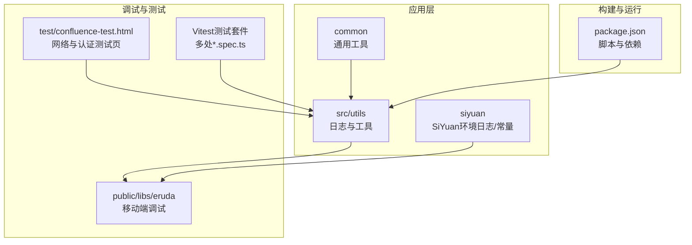
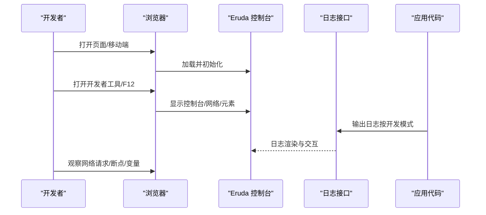
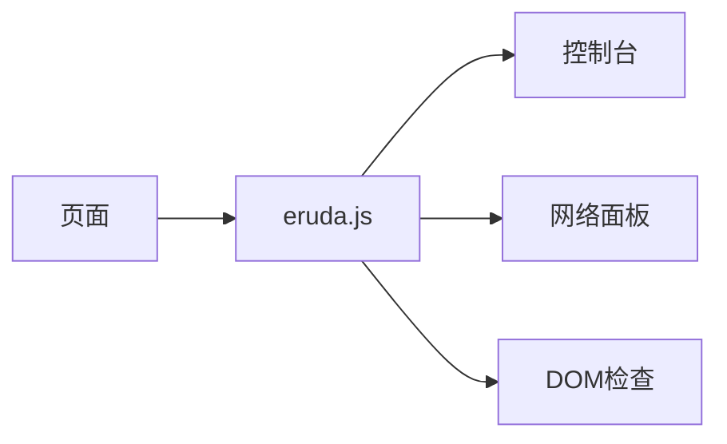
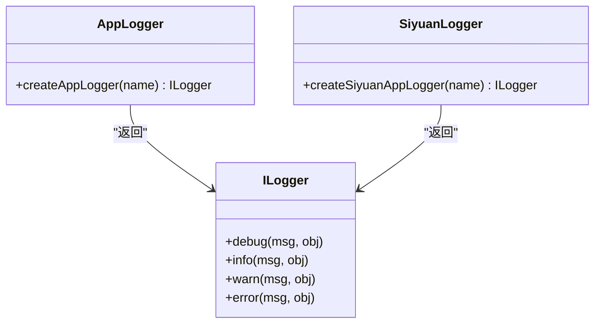
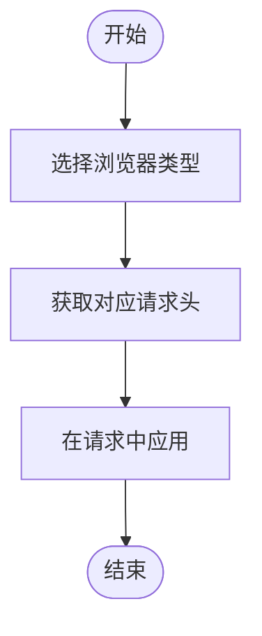
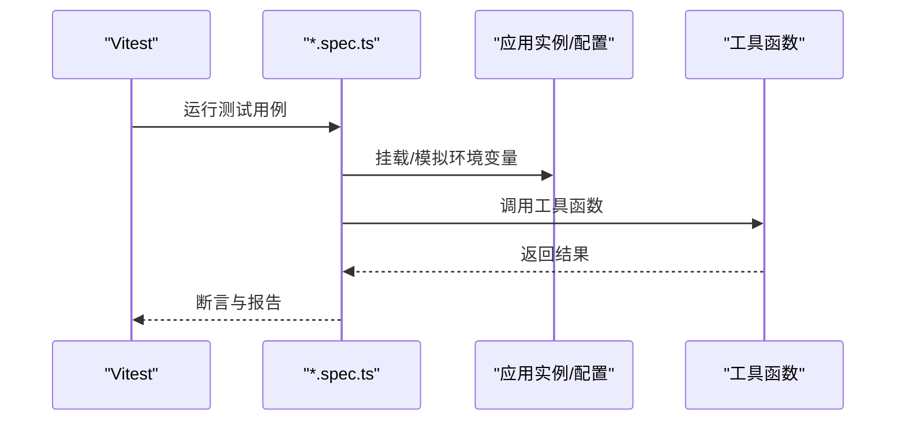
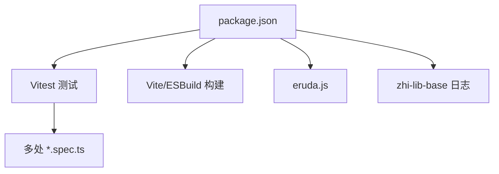

# 调试工具与技巧

<cite>
**本文引用的文件**   
- [MockBrowser.ts](file://src/utils/MockBrowser.ts)
- [eruda.js](file://public/libs/eruda/eruda.js)
- [appLogger.ts（应用日志）](file://src/utils/appLogger.ts)
- [appLogger.ts（SiYuan日志）](file://siyuan/appLogger.ts)
- [constants.ts（应用常量）](file://src/utils/constants.ts)
- [Constants.ts（SiYuan常量）](file://siyuan/Constants.ts)
- [confluence-test.html](file://test/confluence-test.html)
- [package.json](file://package.json)
- [pageUtils.ts](file://common/pageUtils.ts)
- [pageUtils.spec.ts](file://common/pageUtils.spec.ts)
- [cookieUtils.spec.ts](file://src/utils/cookieUtils.spec.ts)
- [usePublishConfig.spec.ts](file://src/composables/usePublishConfig.spec.ts)
- [dynamicConfig.spec.ts](file://src/platforms/dynamicConfig.spec.ts)
- [mdUtils.spec.ts](file://src/utils/mdUtils.spec.ts)
</cite>

## 目录
1. [简介](#简介)
2. [项目结构](#项目结构)
3. [核心组件](#核心组件)
4. [架构总览](#架构总览)
5. [详细组件分析](#详细组件分析)
6. [依赖分析](#依赖分析)
7. [性能考虑](#性能考虑)
8. [故障排除指南](#故障排除指南)
9. [结论](#结论)
10. [附录](#附录)

## 简介
本文件面向开发者与测试人员，系统化梳理本项目在浏览器端与本地开发环境中的调试工具与技巧，覆盖以下主题：
- 浏览器调试工具：Vue DevTools、网络面板、控制台调试
- 移动端调试：Eruda 工具的集成与使用
- 日志系统：统一日志接口与日志输出策略
- 错误追踪与性能监控：结合浏览器工具与自定义日志
- Mock 浏览器环境：模拟请求头与浏览器行为
- 单元测试与集成测试：基于 Vitest 的测试策略
- 常见问题与排障：以 Confluence 测试页面为例的网络与认证问题排查

## 项目结构
该项目采用前端工程化组织方式，包含应用源码、公共工具、测试脚本与第三方库资源。与调试密切相关的目录与文件如下：
- src/utils：通用工具与日志封装
- public/libs/eruda：移动端调试工具资源
- siyuan：SiYuan 环境下的日志与常量
- test：独立的测试页面（如 Confluence API 测试）
- common：通用工具模块（如页面名称处理）
- package.json：脚本与依赖，包含测试与构建命令

**图表来源**
- [appLogger.ts（应用日志）](file://src/utils/appLogger.ts)
- [appLogger.ts（SiYuan日志）](file://siyuan/appLogger.ts)
- [eruda.js](file://public/libs/eruda/eruda.js)
- [confluence-test.html](file://test/confluence-test.html)
- [package.json](file://package.json)

**章节来源**
- [package.json:1-99](file://package.json#L1-L99)

## 核心组件
- Eruda 移动端调试：通过引入公共库实现移动端控制台、网络面板与元素检查能力，便于在移动端快速定位问题。
- 统一日志接口：提供 debug/info/warn/error 四种级别日志，支持按开发模式开关输出。
- Mock 浏览器环境：提供常用浏览器请求头常量，便于在无真实浏览器上下文时模拟请求行为。
- 测试工具与页面：内置 Vitest 测试套件与独立 HTML 测试页，覆盖网络、配置与工具函数。

**章节来源**
- [eruda.js:1-9](file://public/libs/eruda/eruda.js#L1-L9)
- [appLogger.ts（应用日志）:37-56](file://src/utils/appLogger.ts#L37-L56)
- [appLogger.ts（SiYuan日志）:37-56](file://siyuan/appLogger.ts#L37-L56)
- [MockBrowser.ts:13-39](file://src/utils/MockBrowser.ts#L13-L39)
- [package.json:9-27](file://package.json#L9-L27)

## 架构总览
调试相关能力在应用中的交互关系如下：

**图表来源**
- [eruda.js:1-9](file://public/libs/eruda/eruda.js#L1-L9)
- [appLogger.ts（应用日志）:37-56](file://src/utils/appLogger.ts#L37-L56)
- [appLogger.ts（SiYuan日志）:37-56](file://siyuan/appLogger.ts#L37-L56)

## 详细组件分析

### Eruda 移动端调试工具
- 集成方式：通过公共库引入，提供控制台、网络、DOM 查看等能力。
- 使用建议：
  - 在移动端页面加载后，打开开发者工具切换到 Eruda 面板进行日志与网络观察。
  - 结合日志接口输出关键路径参数与对象，便于定位问题。

**图表来源**
- [eruda.js:1-9](file://public/libs/eruda/eruda.js#L1-L9)

**章节来源**
- [eruda.js:1-9](file://public/libs/eruda/eruda.js#L1-L9)

### 统一日志接口与日志策略
- 接口定义：提供 debug/info/warn/error 四个级别方法，统一日志输出入口。
- 开发模式控制：应用侧通过开发模式常量决定是否启用增强日志；SiYuan 环境同样提供开发模式常量。
- 使用建议：
  - 在关键流程（如配置加载、API 调用前后）输出 info/warn。
  - 在异常与边界条件输出 error，必要时附带上下文对象。
  - 在移动端优先使用 Eruda 控制台查看日志。

**图表来源**
- [appLogger.ts（应用日志）:23-56](file://src/utils/appLogger.ts#L23-L56)
- [appLogger.ts（SiYuan日志）:40-56](file://siyuan/appLogger.ts#L40-L56)

**章节来源**
- [appLogger.ts（应用日志）:23-56](file://src/utils/appLogger.ts#L23-L56)
- [appLogger.ts（SiYuan日志）:40-56](file://siyuan/appLogger.ts#L40-L56)
- [constants.ts:10-11](file://src/utils/constants.ts#L10-L11)
- [Constants.ts:26](file://siyuan/Constants.ts#L26)

### Mock 浏览器环境
- 目的：在无真实浏览器上下文时，模拟常见浏览器请求头，便于网络请求与兼容性测试。
- 常量：提供 macOS Chrome 的 User-Agent 示例，可作为默认请求头的一部分。
- 使用建议：
  - 在单元测试或离线脚本中注入该请求头，减少跨环境差异。
  - 注意仅用于测试场景，避免在生产请求中滥用。

**图表来源**
- [MockBrowser.ts:13-39](file://src/utils/MockBrowser.ts#L13-L39)

**章节来源**
- [MockBrowser.ts:13-39](file://src/utils/MockBrowser.ts#L13-L39)

### 网络面板与控制台调试
- 网络面板：观察请求头、响应状态、缓存与跨域情况；结合测试页面验证认证头与关键字段。
- 控制台：配合 Eruda 与日志接口，输出关键变量与调用栈，定位异常。
- 建议流程：
  - 打开 Network 标签，过滤目标接口。
  - 检查请求头是否包含必要的认证与内容类型字段。
  - 在 Console 中查看日志输出，确认业务流程与参数传递。

**章节来源**
- [confluence-test.html:150-341](file://test/confluence-test.html#L150-L341)

### 单元测试与集成测试
- 测试框架：Vitest，提供断言、挂载与环境变量模拟能力。
- 测试策略：
  - 配置测试：使用挂载应用实例，模拟环境变量，验证配置解析与 API 获取。
  - 工具函数：对字符串处理、文件名生成等工具函数进行断言测试。
  - Cookie 工具：验证 Cookie 数组合并与键值提取逻辑。
- 建议：
  - 在 CI 中运行测试，确保变更不影响日志、配置与工具函数。
  - 对关键分支与边界条件补充测试用例。

**图表来源**
- [usePublishConfig.spec.ts:16-51](file://src/composables/usePublishConfig.spec.ts#L16-L51)
- [pageUtils.spec.ts:29-34](file://common/pageUtils.spec.ts#L29-L34)
- [cookieUtils.spec.ts:13-45](file://src/utils/cookieUtils.spec.ts#L13-L45)
- [dynamicConfig.spec.ts:18-34](file://src/platforms/dynamicConfig.spec.ts#L18-L34)
- [mdUtils.spec.ts:13-88](file://src/utils/mdUtils.spec.ts#L13-L88)

**章节来源**
- [usePublishConfig.spec.ts:16-51](file://src/composables/usePublishConfig.spec.ts#L16-L51)
- [pageUtils.spec.ts:29-34](file://common/pageUtils.spec.ts#L29-L34)
- [cookieUtils.spec.ts:13-45](file://src/utils/cookieUtils.spec.ts#L13-L45)
- [dynamicConfig.spec.ts:18-34](file://src/platforms/dynamicConfig.spec.ts#L18-L34)
- [mdUtils.spec.ts:13-88](file://src/utils/mdUtils.spec.ts#L13-L88)

### 页面名称工具与测试
- 功能：对平台名称进行缩略、截取与格式化，便于 UI 展示。
- 测试：通过 Vitest 断言不同输入下的输出，保证展示一致性。

**章节来源**
- [pageUtils.ts:34-82](file://common/pageUtils.ts#L34-L82)
- [pageUtils.spec.ts:29-34](file://common/pageUtils.spec.ts#L29-L34)

## 依赖分析
- Eruda：移动端调试必备，提供控制台与网络面板。
- 日志库：统一日志接口，支持按开发模式输出。
- 测试框架：Vitest 提供测试与覆盖率统计。
- 构建与脚本：Vite、ESBuild 等，配合 Python 脚本完成构建与打包。

**图表来源**
- [package.json:9-58](file://package.json#L9-L58)
- [eruda.js:1-9](file://public/libs/eruda/eruda.js#L1-L9)
- [appLogger.ts（应用日志）:10-11](file://src/utils/appLogger.ts#L10-L11)

**章节来源**
- [package.json:9-58](file://package.json#L9-L58)

## 性能考虑
- 控制台输出：在生产环境关闭或限制日志输出，避免影响渲染性能。
- 网络请求：使用 Eruda 的网络面板观察请求耗时与重复请求，优化缓存与并发策略。
- 移动端体验：Eruda 会增加 DOM 与事件监听，建议仅在调试阶段开启。

## 故障排除指南
- 认证与请求头缺失（以 Confluence 为例）：
  - 症状：Network 面板显示 401/403 或响应头缺失关键字段。
  - 排查步骤：
    - 打开 Network 标签，找到目标请求，检查 Request Headers 是否包含认证与内容类型。
    - 参考测试页面中的“请求头检查清单”，确认是否缺少特定头部。
  - 解决方案：
    - 在 Cloudflare 控制台放行相应头部，或改用内网地址。
    - 使用 Cloudflare Tunnel 配置允许特定头部透传。
- 日志无法查看：
  - 确认开发模式已开启，日志接口正常输出。
  - 在移动端使用 Eruda 控制台查看日志。
- 配置加载失败：
  - 使用 Vitest 的挂载与环境变量模拟，验证配置解析逻辑。
- 工具函数异常：
  - 针对字符串处理与文件名生成，编写断言用例，确保边界条件正确。

**章节来源**
- [confluence-test.html:300-341](file://test/confluence-test.html#L300-L341)
- [appLogger.ts（应用日志）:37-56](file://src/utils/appLogger.ts#L37-L56)
- [usePublishConfig.spec.ts:20-33](file://src/composables/usePublishConfig.spec.ts#L20-L33)

## 结论
通过 Eruda 移动端调试、统一日志接口、Mock 浏览器环境与完善的测试体系，本项目能够在复杂网络与多平台环境下高效定位问题、验证逻辑并保障质量。建议在日常开发中：
- 始终使用统一日志接口输出关键路径信息。
- 在移动端优先借助 Eruda 快速定位问题。
- 使用测试页面与 Vitest 用例覆盖关键场景。
- 对网络请求严格校验请求头与认证信息。

## 附录
- 常用命令（来自脚本）：
  - 开发：dev
  - 构建：build
  - 测试：test
  - 覆盖率：coverage
- 建议在本地开发时：
  - 启用开发模式常量，确保日志输出与 Eruda 可用。
  - 使用测试页面快速验证网络与认证问题。

**章节来源**
- [package.json:9-27](file://package.json#L9-L27)
- [constants.ts:10](file://src/utils/constants.ts#L10)
- [Constants.ts:26](file://siyuan/Constants.ts#L26)