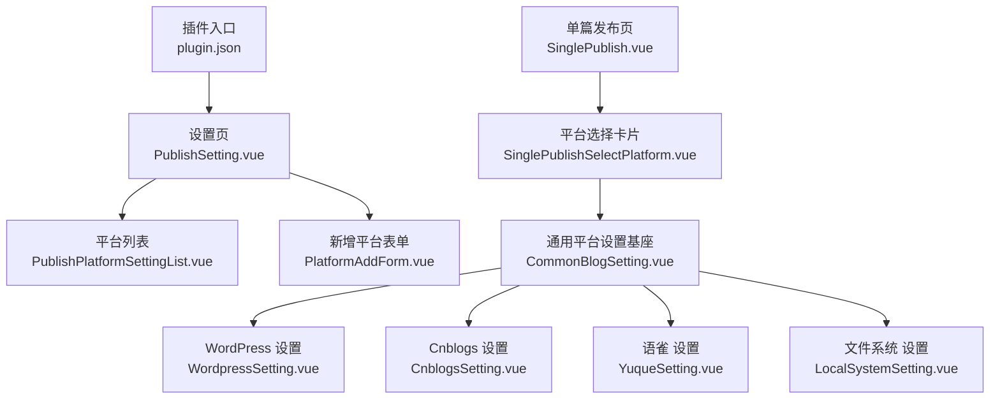
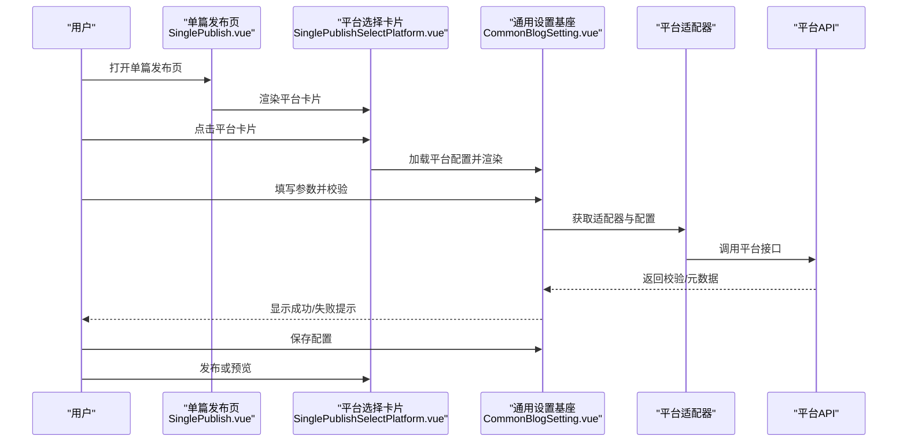
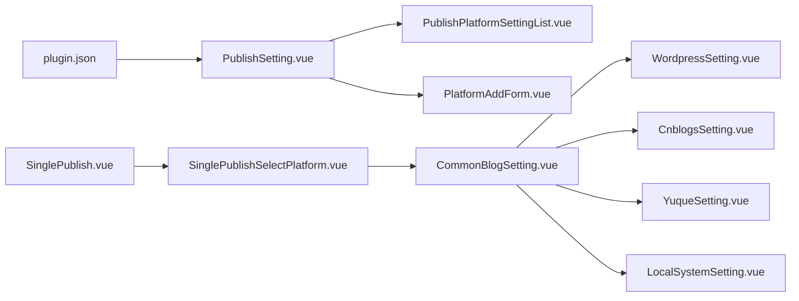

# 快速开始

<cite>
**本文引用的文件**
- [README_zh_CN.md](file://README_zh_CN.md)
- [plugin.json](file://plugin.json)
- [PublishSetting.vue](file://src/components/set/PublishSetting.vue)
- [PublishPlatformSettingList.vue](file://src/components/set/publish/platform/PublishPlatformSettingList.vue)
- [PlatformAddForm.vue](file://src/components/set/publish/form/PlatformAddForm.vue)
- [SinglePublishSelectPlatform.vue](file://src/components/publish/SinglePublishSelectPlatform.vue)
- [SinglePublish.vue](file://src/pages/SinglePublish.vue)
- [CommonBlogSetting.vue](file://src/components/set/publish/singleplatform/base/CommonBlogSetting.vue)
- [WordpressSetting.vue](file://src/components/set/publish/singleplatform/metaweblog/WordpressSetting.vue)
- [CnblogsSetting.vue](file://src/components/set/publish/singleplatform/metaweblog/CnblogsSetting.vue)
- [YuqueSetting.vue](file://src/components/set/publish/singleplatform/commonblog/YuqueSetting.vue)
- [LocalSystemSetting.vue](file://src/components/set/publish/singleplatform/fs/LocalSystemSetting.vue)
</cite>

## 目录
1. [简介](#简介)
2. [项目结构](#项目结构)
3. [核心组件](#核心组件)
4. [架构总览](#架构总览)
5. [详细组件解析](#详细组件解析)
6. [依赖关系分析](#依赖关系分析)
7. [性能与可用性建议](#性能与可用性建议)
8. [故障排除指南](#故障排除指南)
9. [结论](#结论)
10. [附录](#附录)

## 简介
本指南面向首次使用“发布工具”插件的用户，帮助你从安装、启用插件开始，逐步完成首个发布平台的添加与配置，并覆盖常见发布场景（如 WordPress、Cnblogs、语雀、文件系统等）的完整流程。同时提供基础故障排除方法与常见问题解答，确保你能快速上手并稳定发布。

## 项目结构
该插件采用前端单页应用架构，围绕“平台配置 + 发布流程 + 平台适配器”的模式组织代码。主要模块包括：
- 插件入口与元数据：插件清单、显示名称、描述、多语言等
- 设置界面：平台列表、平台新增、平台单个设置
- 发布流程：单篇文章选择平台、发布与预览
- 平台适配器：各平台（如 WordPress、Cnblogs、语雀、文件系统等）的配置与调用封装

图表来源
- [plugin.json:1-43](file://plugin.json#L1-L43)
- [PublishSetting.vue:25-61](file://src/components/set/PublishSetting.vue#L25-L61)
- [PublishPlatformSettingList.vue:491-620](file://src/components/set/publish/platform/PublishPlatformSettingList.vue#L491-L620)
- [PlatformAddForm.vue:202-269](file://src/components/set/publish/form/PlatformAddForm.vue#L202-L269)
- [SinglePublish.vue:19-21](file://src/pages/SinglePublish.vue#L19-L21)
- [SinglePublishSelectPlatform.vue:152-206](file://src/components/publish/SinglePublishSelectPlatform.vue#L152-L206)
- [CommonBlogSetting.vue:320-527](file://src/components/set/publish/singleplatform/base/CommonBlogSetting.vue#L320-L527)
- [WordpressSetting.vue:49-51](file://src/components/set/publish/singleplatform/metaweblog/WordpressSetting.vue#L49-L51)
- [CnblogsSetting.vue:36-38](file://src/components/set/publish/singleplatform/metaweblog/CnblogsSetting.vue#L36-L38)
- [YuqueSetting.vue:36-38](file://src/components/set/publish/singleplatform/commonblog/YuqueSetting.vue#L36-L38)
- [LocalSystemSetting.vue:32-91](file://src/components/set/publish/singleplatform/fs/LocalSystemSetting.vue#L32-L91)

章节来源
- [plugin.json:1-43](file://plugin.json#L1-L43)
- [PublishSetting.vue:25-61](file://src/components/set/PublishSetting.vue#L25-L61)

## 核心组件
- 插件清单与元数据：定义插件名称、版本、支持平台、国际化文案等
- 设置页：包含“发布设置”“导入平台”“平台仓库”三个标签页，用于管理平台列表与导入导出
- 平台列表：展示已启用且已授权的平台，支持切换启用状态、进入设置、网页授权、验证、删除
- 新增平台表单：根据平台类型与子类型生成动态配置，支持导入预设模板或创建自定义实例
- 单篇发布页：展示已启用且已授权的平台卡片，支持一键预览与跳转到具体平台发布页
- 通用平台设置：统一处理首页、API地址、用户名/密码/Token、预览地址、知识空间、图片服务、跨域代理等
- 平台专用设置：如 WordPress、Cnblogs、语雀、文件系统等，基于通用设置扩展各自字段与占位提示

章节来源
- [PublishSetting.vue:25-61](file://src/components/set/PublishSetting.vue#L25-L61)
- [PublishPlatformSettingList.vue:491-620](file://src/components/set/publish/platform/PublishPlatformSettingList.vue#L491-L620)
- [PlatformAddForm.vue:136-199](file://src/components/set/publish/form/PlatformAddForm.vue#L136-L199)
- [SinglePublish.vue:19-21](file://src/pages/SinglePublish.vue#L19-L21)
- [SinglePublishSelectPlatform.vue:152-206](file://src/components/publish/SinglePublishSelectPlatform.vue#L152-L206)
- [CommonBlogSetting.vue:320-527](file://src/components/set/publish/singleplatform/base/CommonBlogSetting.vue#L320-L527)

## 架构总览
发布流程从“单篇发布页”开始，用户选择目标平台后进入对应平台设置页，完成参数校验与保存后，即可发布或预览。

图表来源
- [SinglePublish.vue:19-21](file://src/pages/SinglePublish.vue#L19-L21)
- [SinglePublishSelectPlatform.vue:62-122](file://src/components/publish/SinglePublishSelectPlatform.vue#L62-L122)
- [CommonBlogSetting.vue:116-172](file://src/components/set/publish/singleplatform/base/CommonBlogSetting.vue#L116-L172)

## 详细组件解析

### 安装与启用
- 通过插件市场搜索“发布工具”，安装插件
- 启用插件后，在思源笔记工具栏找到“发布工具”按钮，点击进入

章节来源
- [README_zh_CN.md:15-21](file://README_zh_CN.md#L15-L21)

### 首次使用：添加第一个发布平台
- 打开“设置 > 发布设置”，进入平台列表
- 点击“新增平台”，选择平台类型与子类型
- 若为首次添加，将导入预设模板；若重复添加，将生成可编辑的新实例
- 填写平台名称、图标、授权方式、登录地址（网页授权）、主域名等
- 保存后返回列表，启用该平台

章节来源
- [PublishSetting.vue:28-53](file://src/components/set/PublishSetting.vue#L28-L53)
- [PublishPlatformSettingList.vue:451-488](file://src/components/set/publish/platform/PublishPlatformSettingList.vue#L451-L488)
- [PlatformAddForm.vue:136-199](file://src/components/set/publish/form/PlatformAddForm.vue#L136-L199)

### 基本参数设置（通用）
- 首页/API地址/用户名/密码或Token/预览地址
- 页面类型（Markdown/HTML）
- 知识空间（部分平台支持，可按关键词搜索并选择）
- 图床服务（可选：PicGo、内置图床）
- 跨域代理（中间件/CORS Anywhere）

章节来源
- [CommonBlogSetting.vue:332-524](file://src/components/set/publish/singleplatform/base/CommonBlogSetting.vue#L332-L524)

### 常见发布场景示例

#### 发布到 WordPress
- 在“平台列表”中新增 WordPress 平台，选择子类型
- 在“WordPress 设置”中填写首页、API地址、用户名、密码或Token、预览地址
- 点击“校验”验证配置，成功后保存
- 在“单篇发布页”选择该平台，进入发布流程

章节来源
- [WordpressSetting.vue:27-46](file://src/components/set/publish/singleplatform/metaweblog/WordpressSetting.vue#L27-L46)
- [CommonBlogSetting.vue:332-524](file://src/components/set/publish/singleplatform/base/CommonBlogSetting.vue#L332-L524)
- [SinglePublishSelectPlatform.vue:62-77](file://src/components/publish/SinglePublishSelectPlatform.vue#L62-L77)

#### 发布到 Cnblogs
- 新增 Cnblogs 平台，填写首页、用户名、密码或Token、预览地址
- 校验通过后保存
- 在“单篇发布页”选择该平台进行发布

章节来源
- [CnblogsSetting.vue:23-33](file://src/components/set/publish/singleplatform/metaweblog/CnblogsSetting.vue#L23-L33)
- [CommonBlogSetting.vue:332-524](file://src/components/set/publish/singleplatform/base/CommonBlogSetting.vue#L332-L524)

#### 发布到 语雀
- 新增 语雀 平台，填写首页、用户名、Token、预览地址
- 校验通过后保存
- 在“单篇发布页”选择该平台进行发布

章节来源
- [YuqueSetting.vue:24-33](file://src/components/set/publish/singleplatform/commonblog/YuqueSetting.vue#L24-L33)
- [CommonBlogSetting.vue:332-524](file://src/components/set/publish/singleplatform/base/CommonBlogSetting.vue#L332-L524)

#### 发布到 文件系统
- 新增“文件系统”平台，填写存储路径、媒体存储路径、YAML 类型
- 校验通过后保存
- 在“单篇发布页”选择该平台进行发布

章节来源
- [LocalSystemSetting.vue:32-91](file://src/components/set/publish/singleplatform/fs/LocalSystemSetting.vue#L32-L91)
- [CommonBlogSetting.vue:332-524](file://src/components/set/publish/singleplatform/base/CommonBlogSetting.vue#L332-L524)

### 发布流程与预览
- 在“单篇发布页”中，点击平台卡片进入对应平台发布页
- 已发布过的平台会在卡片右上角显示“预览”，可直接打开预览链接
- “一键预览”可批量打开所有已发布平台的预览页面

章节来源
- [SinglePublishSelectPlatform.vue:86-122](file://src/components/publish/SinglePublishSelectPlatform.vue#L86-L122)

## 依赖关系分析
- 插件清单定义了平台兼容性与显示名称
- 设置页聚合平台列表与导入导出能力
- 平台列表负责启用/禁用、授权、验证、删除等生命周期管理
- 新增表单负责动态生成平台配置并持久化
- 单篇发布页负责筛选已启用且已授权的平台
- 通用设置基座统一封装平台配置项与校验逻辑
- 平台专用设置在通用基础上补充特有字段

图表来源
- [plugin.json:1-43](file://plugin.json#L1-L43)
- [PublishSetting.vue:25-61](file://src/components/set/PublishSetting.vue#L25-L61)
- [PublishPlatformSettingList.vue:491-620](file://src/components/set/publish/platform/PublishPlatformSettingList.vue#L491-L620)
- [PlatformAddForm.vue:136-199](file://src/components/set/publish/form/PlatformAddForm.vue#L136-L199)
- [SinglePublish.vue:19-21](file://src/pages/SinglePublish.vue#L19-L21)
- [SinglePublishSelectPlatform.vue:152-206](file://src/components/publish/SinglePublishSelectPlatform.vue#L152-L206)
- [CommonBlogSetting.vue:320-527](file://src/components/set/publish/singleplatform/base/CommonBlogSetting.vue#L320-L527)
- [WordpressSetting.vue:49-51](file://src/components/set/publish/singleplatform/metaweblog/WordpressSetting.vue#L49-L51)
- [CnblogsSetting.vue:36-38](file://src/components/set/publish/singleplatform/metaweblog/CnblogsSetting.vue#L36-L38)
- [YuqueSetting.vue:36-38](file://src/components/set/publish/singleplatform/commonblog/YuqueSetting.vue#L36-L38)
- [LocalSystemSetting.vue:32-91](file://src/components/set/publish/singleplatform/fs/LocalSystemSetting.vue#L32-L91)

## 性能与可用性建议
- 首次配置建议先“校验”再保存，避免频繁网络请求导致的等待
- 对于网页授权平台，尽量在插件内完成授权与验证，减少手动复制粘贴错误
- 图床服务建议优先使用本地已安装的 PicGo，提升上传稳定性
- 跨域代理仅在必要时开启，避免引入额外延迟与风险

## 故障排除指南
- 无法打开授权页面
  - 网页授权平台需在插件内完成授权与验证；若浏览器拦截，请允许弹窗或切换到插件内打开
  - 若提示登录过期，可在平台设置中重新授权或退出登录后重新登录
- 校验失败
  - 检查首页/API地址/用户名/密码或Token是否正确
  - 若为网页授权平台，确认已成功获取并保存 Cookie
- 一键预览无响应
  - 确认文章已在该平台发布过，否则会提示“请至少发布到一个平台”
- 跨域访问报错
  - 在非思源环境中，可配置中间件或 CORS Anywhere；但请注意安全性与稳定性
- 图片上传失败
  - 确认已安装并正确配置图床服务（如 PicGo），并确保网络可达

章节来源
- [PublishPlatformSettingList.vue:137-202](file://src/components/set/publish/platform/PublishPlatformSettingList.vue#L137-L202)
- [PublishPlatformSettingList.vue:283-427](file://src/components/set/publish/platform/PublishPlatformSettingList.vue#L283-L427)
- [SinglePublishSelectPlatform.vue:103-122](file://src/components/publish/SinglePublishSelectPlatform.vue#L103-L122)
- [CommonBlogSetting.vue:459-501](file://src/components/set/publish/singleplatform/base/CommonBlogSetting.vue#L459-L501)

## 结论
通过本快速开始指南，你可以完成插件安装、启用、添加首个平台、完成基础配置，并掌握常见平台的发布流程。遇到问题时，可依据故障排除指南逐项排查。随着使用深入，还可探索平台导入导出、批量分发等功能，进一步提升发布效率。

## 附录
- 快速入口
  - 插件市场搜索“发布工具”安装
  - 启用后在工具栏点击“发布工具”按钮
- 常用术语
  - 平台：目标发布对象（如 WordPress、Cnblogs、语雀、文件系统等）
  - 网页授权：通过浏览器登录授权并保存 Cookie 的方式
  - API 授权：通过用户名/密码或 Token 直接调用平台 API 的方式
  - 知识空间：部分平台提供的站点/空间概念，需选择后方可发布