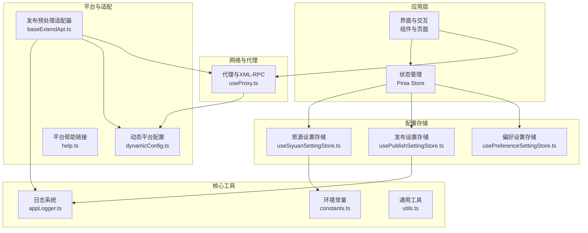
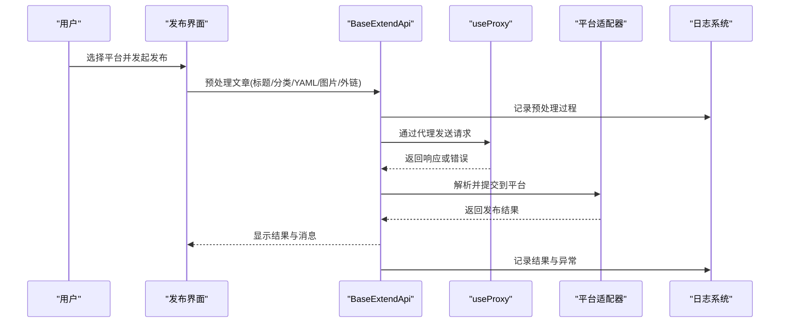
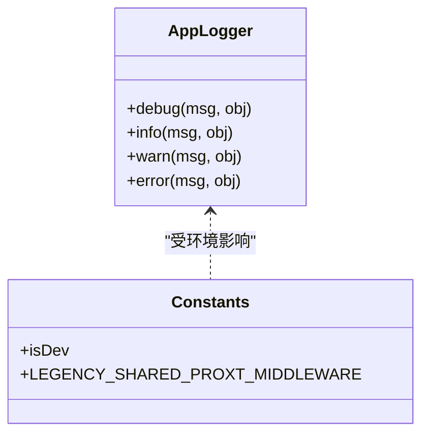
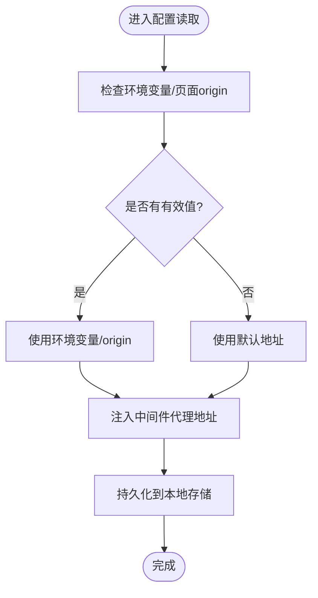
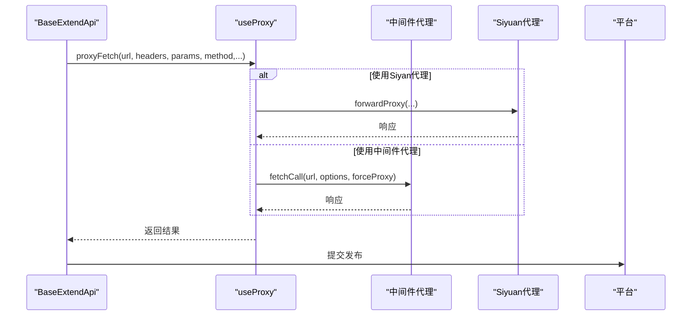
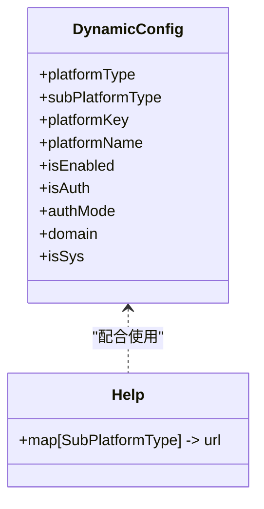
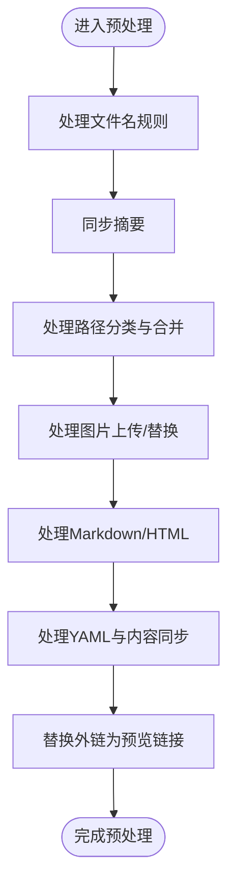
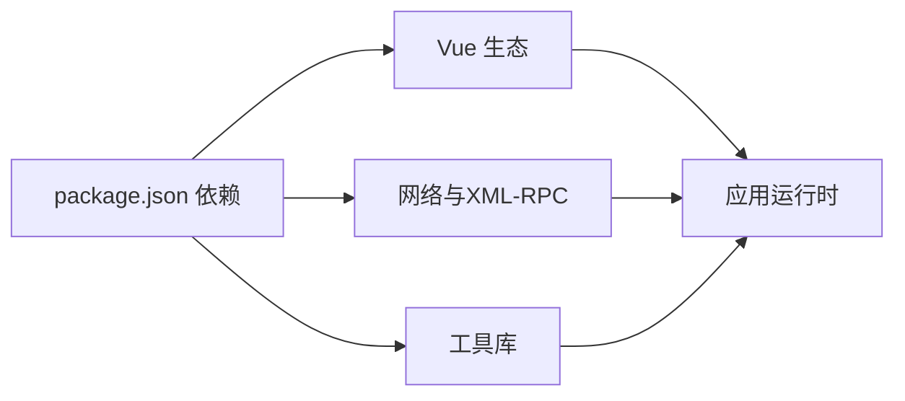

# 故障排除与常见问题

<cite>
**本文引用的文件**   
- [README_zh_CN.md](file://README_zh_CN.md)
- [package.json](file://package.json)
- [appLogger.ts](file://src/utils/appLogger.ts)
- [constants.ts](file://src/utils/constants.ts)
- [useSiyuanSettingStore.ts](file://src/stores/useSiyuanSettingStore.ts)
- [usePublishSettingStore.ts](file://src/stores/usePublishSettingStore.ts)
- [BaseErrors.ts](file://src/utils/BaseErrors.ts)
- [baseExtendApi.ts](file://src/adaptors/base/baseExtendApi.ts)
- [useProxy.ts](file://src/composables/useProxy.ts)
- [help.ts](file://src/platforms/help.ts)
- [dynamicConfig.ts](file://src/platforms/dynamicConfig.ts)
- [usePreferenceSettingStore.ts](file://src/stores/usePreferenceSettingStore.ts)
- [utils.ts](file://src/utils/utils.ts)
</cite>

## 目录
1. [简介](#简介)
2. [项目结构](#项目结构)
3. [核心组件](#核心组件)
4. [架构总览](#架构总览)
5. [详细组件分析](#详细组件分析)
6. [依赖分析](#依赖分析)
7. [性能考虑](#性能考虑)
8. [故障排除指南](#故障排除指南)
9. [结论](#结论)
10. [附录](#附录)

## 简介
本文件面向使用“发布工具”插件的用户与维护者，提供系统化的故障排除与常见问题解答。内容覆盖安装与配置、发布失败、认证错误、网络与代理、日志与调试、性能优化、平台特定问题以及紧急处置流程。文档中的所有技术细节均基于仓库内实际实现与配置文件，确保可追溯与可验证。

## 项目结构
该插件采用前端单页应用架构，结合 Vue 3 + Vite + Pinia 状态管理，围绕“适配器模式”抽象不同平台（博客、静态站点、文件系统等）的发布流程。关键模块包括：
- 日志与环境：日志接口、开发/生产环境常量
- 配置存储：思源笔记与发布设置的本地持久化
- 代理与网络：统一的代理请求与 XML-RPC 调用
- 平台动态配置：平台类型、子类型与元数据
- 发布适配器：统一的预处理、YAML、图片、外链替换逻辑

**图表来源**
- [appLogger.ts:37-39](file://src/utils/appLogger.ts#L37-L39)
- [constants.ts:10-11](file://src/utils/constants.ts#L10-L11)
- [useSiyuanSettingStore.ts:36-61](file://src/stores/useSiyuanSettingStore.ts#L36-L61)
- [usePublishSettingStore.ts:21-59](file://src/stores/usePublishSettingStore.ts#L21-L59)
- [useProxy.ts:27-99](file://src/composables/useProxy.ts#L27-L99)
- [dynamicConfig.ts:13-113](file://src/platforms/dynamicConfig.ts#L13-L113)
- [help.ts:19-27](file://src/platforms/help.ts#L19-L27)
- [baseExtendApi.ts:55-80](file://src/adaptors/base/baseExtendApi.ts#L55-L80)

**章节来源**
- [README_zh_CN.md:1-100](file://README_zh_CN.md#L1-L100)
- [package.json:1-99](file://package.json#L1-L99)

## 核心组件
- 日志系统：提供统一的调试日志接口，支持开发模式增强输出。
- 环境常量：区分开发/生产模式、中间件代理地址等。
- 配置存储：封装本地持久化，提供只读与可写访问。
- 代理与网络：统一封装 Siyuan 代理、中间件代理、CORS 代理与 XML-RPC。
- 平台动态配置：抽象平台类型与子类型，支持帮助链接与元数据。
- 发布适配器：统一处理 YAML、图片、外链替换、标题与分类等预处理逻辑。

**章节来源**
- [appLogger.ts:23-39](file://src/utils/appLogger.ts#L23-L39)
- [constants.ts:10-54](file://src/utils/constants.ts#L10-L54)
- [useSiyuanSettingStore.ts:26-78](file://src/stores/useSiyuanSettingStore.ts#L26-L78)
- [usePublishSettingStore.ts:21-94](file://src/stores/usePublishSettingStore.ts#L21-L94)
- [useProxy.ts:27-318](file://src/composables/useProxy.ts#L27-L318)
- [dynamicConfig.ts:13-534](file://src/platforms/dynamicConfig.ts#L13-L534)
- [baseExtendApi.ts:55-739](file://src/adaptors/base/baseExtendApi.ts#L55-L739)

## 架构总览
发布流程的关键路径：选择平台 → 读取配置 → 预处理文章（YAML、图片、外链）→ 代理请求 → 平台响应 → 结果反馈。

**图表来源**
- [baseExtendApi.ts:90-106](file://src/adaptors/base/baseExtendApi.ts#L90-L106)
- [useProxy.ts:53-99](file://src/composables/useProxy.ts#L53-L99)
- [appLogger.ts:37-39](file://src/utils/appLogger.ts#L37-L39)

## 详细组件分析

### 组件A：日志与环境
- 日志接口：提供 debug/info/warn/error 四级日志；开发模式下可增强输出。
- 环境常量：DEV_MODE 控制开发/生产行为；LEGENCY_SHARED_PROXT_MIDDLEWARE 为旧版中间件代理地址。

**图表来源**
- [appLogger.ts:23-39](file://src/utils/appLogger.ts#L23-L39)
- [constants.ts:10-54](file://src/utils/constants.ts#L10-L54)

**章节来源**
- [appLogger.ts:15-47](file://src/utils/appLogger.ts#L15-L47)
- [constants.ts:10-54](file://src/utils/constants.ts#L10-L54)

### 组件B：配置存储（思源与发布）
- 思源设置存储：优先从环境变量或当前页面 origin 推断 API 地址，回退至默认地址；统一注入中间件代理地址。
- 发布设置存储：以异步方式加载/保存发布配置，支持缓存与调试日志。
- 偏好设置存储：读取/合并思源笔记 AI 配置，提供默认值与只读视图。

**图表来源**
- [useSiyuanSettingStore.ts:36-61](file://src/stores/useSiyuanSettingStore.ts#L36-L61)
- [usePublishSettingStore.ts:28-48](file://src/stores/usePublishSettingStore.ts#L28-L48)

**章节来源**
- [useSiyuanSettingStore.ts:26-78](file://src/stores/useSiyuanSettingStore.ts#L26-L78)
- [usePublishSettingStore.ts:21-94](file://src/stores/usePublishSettingStore.ts#L21-L94)
- [usePreferenceSettingStore.ts:21-87](file://src/stores/usePreferenceSettingStore.ts#L21-L87)

### 组件C：代理与网络
- 代理选择：优先使用 Siyuan 代理；若禁用或强制代理则走中间件代理。
- CORS 代理：对不安全头进行过滤与转发，保留返回头以便调试。
- XML-RPC：序列化/反序列化方法调用，统一错误处理与日志记录。

**图表来源**
- [useProxy.ts:53-99](file://src/composables/useProxy.ts#L53-L99)
- [useProxy.ts:203-315](file://src/composables/useProxy.ts#L203-L315)

**章节来源**
- [useProxy.ts:27-318](file://src/composables/useProxy.ts#L27-L318)

### 组件D：平台动态配置与帮助
- 动态配置：抽象平台类型与子类型，支持帮助链接与元数据。
- 帮助文档：按子平台类型映射到具体帮助页面。

**图表来源**
- [dynamicConfig.ts:13-113](file://src/platforms/dynamicConfig.ts#L13-L113)
- [help.ts:19-27](file://src/platforms/help.ts#L19-L27)

**章节来源**
- [dynamicConfig.ts:13-534](file://src/platforms/dynamicConfig.ts#L13-L534)
- [help.ts:19-27](file://src/platforms/help.ts#L19-L27)

### 组件E：发布适配器（预处理）
- 预处理流程：文件名规则、摘要、分类（路径分类）、图片上传、Markdown/HTML、YAML 转换、外链替换。
- 错误处理：针对特定错误（如 Confluence 宏模式缺少 pageId）进行忽略或提示。

**图表来源**
- [baseExtendApi.ts:90-106](file://src/adaptors/base/baseExtendApi.ts#L90-L106)
- [baseExtendApi.ts:150-211](file://src/adaptors/base/baseExtendApi.ts#L150-L211)
- [baseExtendApi.ts:239-281](file://src/adaptors/base/baseExtendApi.ts#L239-L281)
- [baseExtendApi.ts:291-327](file://src/adaptors/base/baseExtendApi.ts#L291-L327)
- [baseExtendApi.ts:360-456](file://src/adaptors/base/baseExtendApi.ts#L360-L456)
- [baseExtendApi.ts:658-713](file://src/adaptors/base/baseExtendApi.ts#L658-L713)

**章节来源**
- [baseExtendApi.ts:55-739](file://src/adaptors/base/baseExtendApi.ts#L55-L739)
- [BaseErrors.ts:13-20](file://src/utils/BaseErrors.ts#L13-L20)

## 依赖分析
- 开发与构建：Vite、Vue、TypeScript、Pinia、Element Plus 等。
- 运行时依赖：跨平台网络请求、XML-RPC、Markdown 工具、设备与系统信息等。
- 插件生态：与思源笔记内核集成，使用内核提供的代理能力。

**图表来源**
- [package.json:29-96](file://package.json#L29-L96)

**章节来源**
- [package.json:1-99](file://package.json#L1-L99)

## 性能考虑
- 图片处理：在浏览器外环境使用代理下载图片，避免阻塞主线程；建议合理设置超时与重试策略。
- YAML 与 Markdown：尽量减少不必要的字符串拼接与正则替换，优先使用工具库提供的高效方法。
- 代理选择：优先使用 Siyuan 代理可降低中间环节开销；仅在必要时启用中间件代理。
- 存储访问：发布设置采用异步读取与缓存，避免频繁 IO；偏好设置提供只读视图，减少写入压力。

[本节为通用指导，无需列出章节来源]

## 故障排除指南

### 一、安装与启动问题
- 症状：插件无法启用或界面空白
  - 检查插件版本与思源笔记版本兼容性
  - 清理浏览器缓存或重启思源笔记
  - 查看开发者工具控制台是否有报错
- 症状：首次打开无入口
  - 确认已在“设置/偏好”中启用相应菜单项
  - 检查是否正确安装并启用插件

[本小节为通用指导，无需列出章节来源]

### 二、配置问题
- 思源笔记 API 地址未识别
  - 现象：无法连接到本地内核或返回空数据
  - 诊断：检查环境变量与当前页面 origin 是否被正确读取
  - 解决：显式设置环境变量或确认页面来源
- 中间件代理地址
  - 现象：跨域请求失败
  - 诊断：确认 LEGENCY_SHARED_PROXT_MIDDLEWARE 是否可用
  - 解决：切换到 Siyuan 代理或更换可用中间件

**章节来源**
- [useSiyuanSettingStore.ts:36-61](file://src/stores/useSiyuanSettingStore.ts#L36-L61)
- [constants.ts:37-45](file://src/utils/constants.ts#L37-L45)

### 三、发布失败
- 症状：文章发布成功但图片未显示
  - 现象：平台图片上传失败，提示查看开发者工具
  - 诊断：检查图片来源是否为外部链接且不在同源；查看日志中“忽略在线图片”提示
  - 解决：将图片转为本地引用或使用平台自带上传
- 症状：外链引用未解析
  - 现象：提示“引用的文档尚未发布”
  - 诊断：检查是否勾选了外链替换；查看发布设置中“忽略块链接”的配置
  - 解决：先发布被引用文档，或开启忽略外链
- 症状：YAML 未生效或格式异常
  - 现象：平台不识别自定义 YAML
  - 诊断：确认 YAML 类型策略与平台适配器是否匹配
  - 解决：切换为默认 YAML 或修正自定义 YAML

**章节来源**
- [baseExtendApi.ts:535-551](file://src/adaptors/base/baseExtendApi.ts#L535-L551)
- [baseExtendApi.ts:687-694](file://src/adaptors/base/baseExtendApi.ts#L687-L694)
- [baseExtendApi.ts:360-456](file://src/adaptors/base/baseExtendApi.ts#L360-L456)

### 四、认证错误
- 症状：平台授权失败或 Token 失效
  - 诊断：确认平台授权模式（API/WEBSITE）与配置项是否正确
  - 解决：重新授权或更新密钥；检查平台帮助链接以获取指引
- 平台帮助
  - 不同子平台的帮助文档可通过映射表定位

**章节来源**
- [dynamicConfig.ts:118-121](file://src/platforms/dynamicConfig.ts#L118-L121)
- [help.ts:19-27](file://src/platforms/help.ts#L19-L27)

### 五、网络与代理问题
- 症状：请求超时或跨域失败
  - 诊断：确认是否使用 Siyuan 代理；若禁用则检查中间件代理可用性
  - 解决：优先使用 Siyuan 代理；必要时配置 CORS 代理并过滤不安全头
- XML-RPC 调用异常
  - 诊断：检查序列化/反序列化结果与返回头
  - 解决：根据日志中的错误信息调整请求参数或平台端配置

**章节来源**
- [useProxy.ts:53-99](file://src/composables/useProxy.ts#L53-L99)
- [useProxy.ts:109-117](file://src/composables/useProxy.ts#L109-L117)
- [useProxy.ts:129-188](file://src/composables/useProxy.ts#L129-L188)

### 六、日志与调试
- 如何启用详细日志
  - 确认 DEV_MODE=true；在开发环境中可获得更丰富的日志输出
- 常见日志位置
  - 应用日志：统一通过日志接口输出；可在控制台查看
  - 发布设置：读取/更新时会打印调试信息
- 建议的排查步骤
  - 打开开发者工具 → Network 标签查看请求与响应
  - 查看 Console 中的日志与错误堆栈
  - 检查存储中的配置是否正确写入

**章节来源**
- [appLogger.ts:37-39](file://src/utils/appLogger.ts#L37-L39)
- [usePublishSettingStore.ts:28-48](file://src/stores/usePublishSettingStore.ts#L28-L48)

### 七、性能优化建议
- 图片处理
  - 优先使用平台自带上传，减少代理下载
  - 合理设置并发与重试，避免阻塞
- YAML 与 Markdown
  - 避免重复解析与转换；尽量一次性生成所需内容
- 代理与网络
  - 优先使用 Siyuan 代理；减少中间环节
  - 合理设置超时与缓存策略

[本节为通用指导，无需列出章节来源]

### 八、平台特定问题
- GitHub/GitLab 静态站点（Hugo/Hexo/Jekyll/Vitepress/Vuepress 等）
  - 症状：构建产物未更新或部署失败
  - 诊断：检查平台帮助链接与构建配置
  - 解决：参考帮助文档逐项核对配置
- Confluence
  - 症状：宏模式下图片上传报错
  - 诊断：检查是否触发“缺少 pageId”的特定错误
  - 解决：忽略该错误或修复页面引用

**章节来源**
- [help.ts:19-27](file://src/platforms/help.ts#L19-L27)
- [BaseErrors.ts:13-20](file://src/utils/BaseErrors.ts#L13-L20)

### 九、紧急处置方案
- 立即回滚：恢复上一个稳定版本的发布配置
- 临时绕过：关闭图片上传或外链替换，先保证正文发布
- 降级代理：切换到 Siyuan 代理或更换可用中间件
- 联系支持：收集日志与错误截图，按“问题反馈与报告机制”提交

[本节为通用指导，无需列出章节来源]

### 十、问题反馈与报告机制
- 收集信息
  - 版本号：插件版本与依赖版本
  - 环境：操作系统、浏览器、思源笔记版本
  - 日志：控制台日志与应用日志
  - 复现步骤：最小可复现操作序列
- 提交渠道
  - 参考 README 中的社区与支持入口
- 社区帮助
  - 加入官方交流群或在帮助文档中查找FAQ

**章节来源**
- [README_zh_CN.md:11-13](file://README_zh_CN.md#L11-L13)

## 结论
本指南基于项目实际实现，提供了从安装、配置、发布到网络与代理的全流程故障排除路径。建议在日常使用中：
- 优先使用 Siyuan 代理，简化跨域问题
- 合理配置 YAML 与图片策略，避免平台不兼容
- 善用日志与调试工具，快速定位问题根因
- 参考平台帮助文档与社区支持，及时获取最新解决方案

[本节为总结性内容，无需列出章节来源]

## 附录

### A. 常用诊断清单
- 环境变量与页面 origin 是否正确
- 中间件代理是否可用
- 图片来源是否为同源或允许的本地资源
- YAML 类型策略与平台适配器是否匹配
- 外链引用是否已发布或已忽略
- 日志中是否有特定错误提示（如宏模式缺少 pageId）

[本节为通用指导，无需列出章节来源]

### B. 相关文件索引
- 日志与环境：[appLogger.ts:1-47](file://src/utils/appLogger.ts#L1-L47)、[constants.ts:1-54](file://src/utils/constants.ts#L1-L54)
- 配置存储：[useSiyuanSettingStore.ts:1-81](file://src/stores/useSiyuanSettingStore.ts#L1-L81)、[usePublishSettingStore.ts:1-95](file://src/stores/usePublishSettingStore.ts#L1-L95)、[usePreferenceSettingStore.ts:1-90](file://src/stores/usePreferenceSettingStore.ts#L1-L90)
- 网络与代理：[useProxy.ts:1-321](file://src/composables/useProxy.ts#L1-L321)
- 平台与适配：[dynamicConfig.ts:1-534](file://src/platforms/dynamicConfig.ts#L1-L534)、[help.ts:1-28](file://src/platforms/help.ts#L1-L28)、[baseExtendApi.ts:1-739](file://src/adaptors/base/baseExtendApi.ts#L1-L739)
- 工具与脚本：[utils.ts:1-97](file://src/utils/utils.ts#L1-L97)、[package.json:1-99](file://package.json#L1-L99)

[本节为索引性内容，无需列出章节来源]