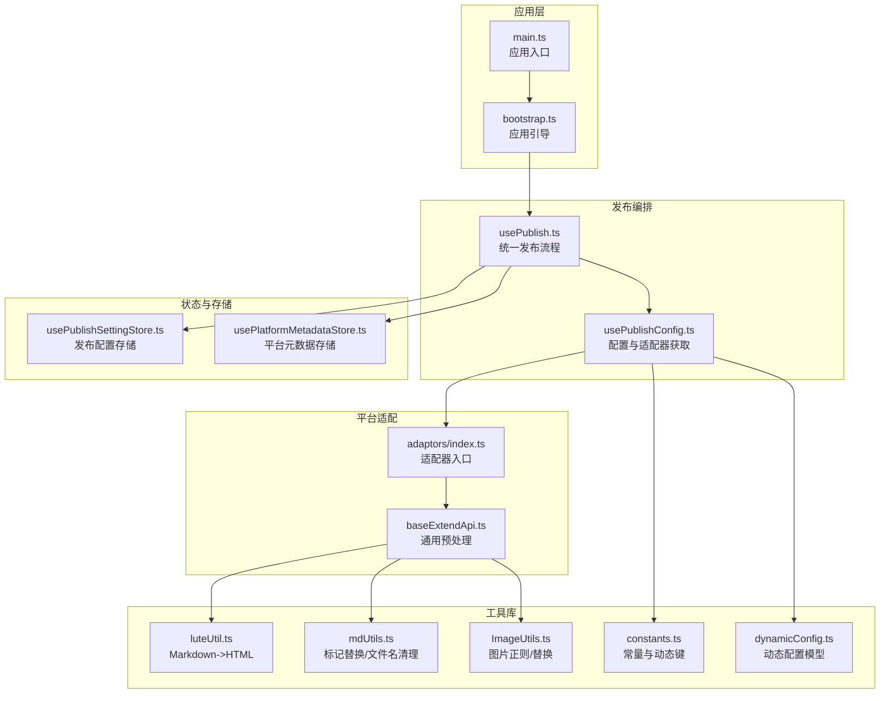
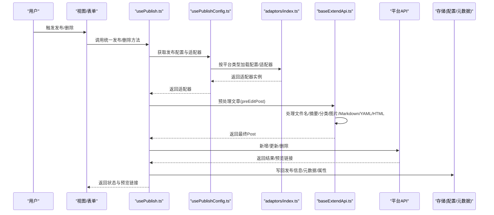
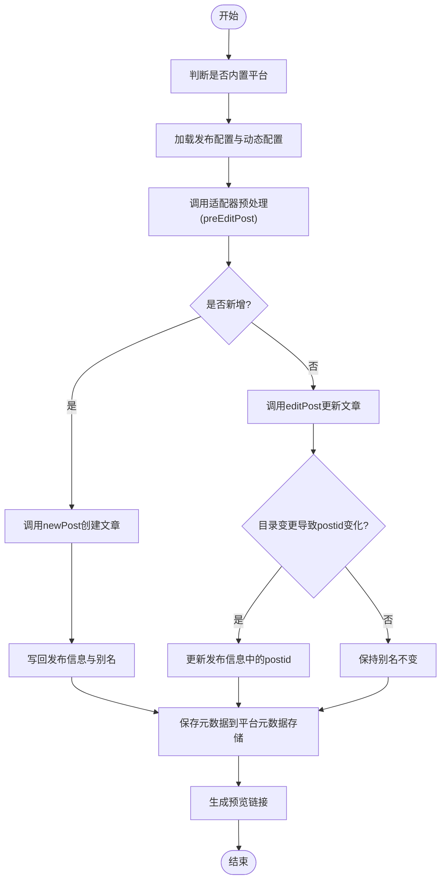
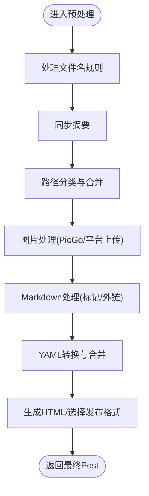
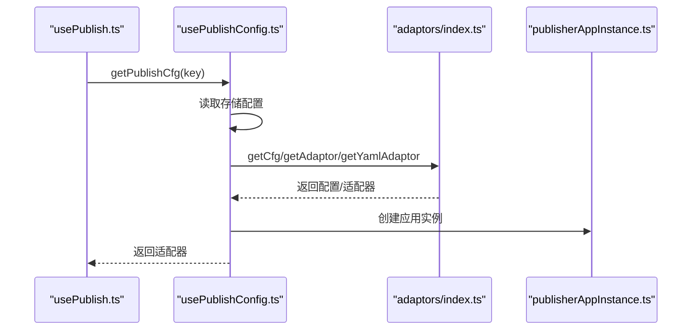
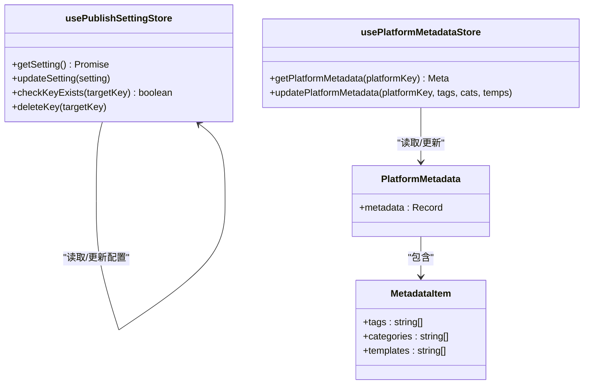
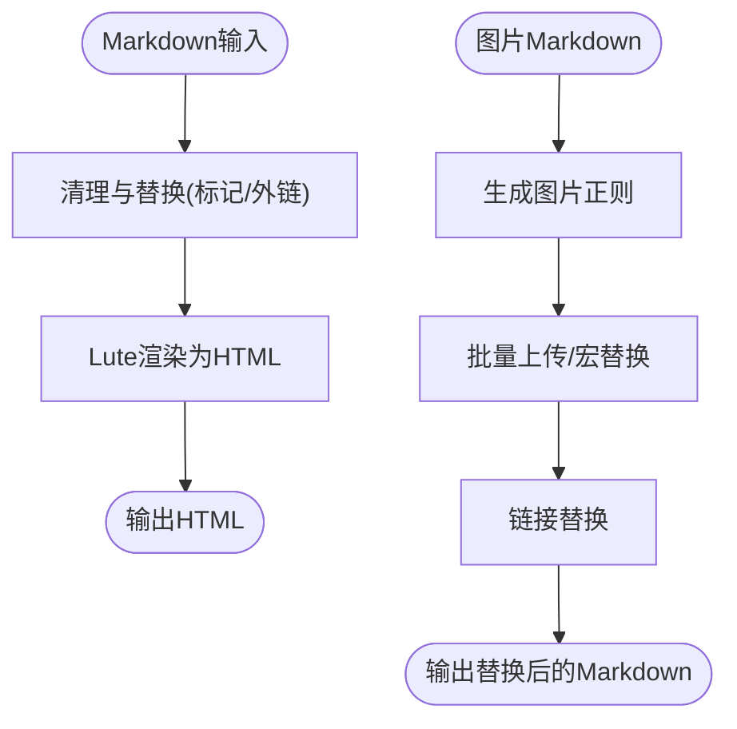
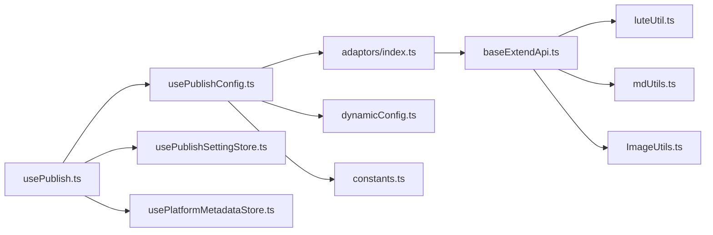

# 数据流架构

<cite>
**本文引用的文件**
- [README_zh_CN.md](file://README_zh_CN.md)
- [main.ts](file://src/main.ts)
- [bootstrap.ts](file://src/bootstrap.ts)
- [publisherAppInstance.ts](file://src/publisherAppInstance.ts)
- [usePublish.ts](file://src/composables/usePublish.ts)
- [usePublishConfig.ts](file://src/composables/usePublishConfig.ts)
- [usePublishSettingStore.ts](file://src/stores/usePublishSettingStore.ts)
- [usePlatformMetadataStore.ts](file://src/stores/usePlatformMetadataStore.ts)
- [baseExtendApi.ts](file://src/adaptors/base/baseExtendApi.ts)
- [adaptors/index.ts](file://src/adaptors/index.ts)
- [luteUtil.ts](file://src/utils/luteUtil.ts)
- [mdUtils.ts](file://src/utils/mdUtils.ts)
- [ImageUtils.ts](file://src/utils/ImageUtils.ts)
- [constants.ts](file://src/utils/constants.ts)
- [dynamicConfig.ts](file://src/platforms/dynamicConfig.ts)
- [IPublishCfg.ts](file://src/types/IPublishCfg.ts)
</cite>

## 目录
1. [简介](#简介)
2. [项目结构](#项目结构)
3. [核心组件](#核心组件)
4. [架构总览](#架构总览)
5. [详细组件分析](#详细组件分析)
6. [依赖关系分析](#依赖关系分析)
7. [性能考量](#性能考量)
8. [故障排查指南](#故障排查指南)
9. [结论](#结论)
10. [附录](#附录)

## 简介
本文件面向“思源笔记发布器插件”的数据流架构，系统性梳理从用户输入到外部平台的数据传输路径，覆盖 Markdown 解析、图片处理、元数据提取、API 调用、状态更新与持久化、数据验证与清理、异步处理与并发控制等关键环节。文档旨在帮助开发者与使用者理解发布流程中的数据转换与处理机制，并提供可视化图示辅助说明。

## 项目结构
发布器采用前端单页应用架构，基于 Vue 3 + Pinia + Element Plus，通过适配器模式对接多种外部平台（博客、静态站点、文件系统、自定义网站等）。核心模块包括：
- 应用入口与引导：负责创建 Vue 应用、挂载路由与国际化。
- 发布流程编排：统一调度预处理、新增/更新、删除、预览链接生成与状态回写。
- 平台适配层：按平台类型与子类型加载配置、适配器与 YAML 转换器。
- 数据与状态：发布配置持久化、平台元数据缓存、偏好设置。
- 工具库：Markdown/HTML 渲染、图片正则与替换、文件名规范化、常量与动态配置。

图表来源
- [main.ts:1-22](file://src/main.ts#L1-L22)
- [bootstrap.ts:1-53](file://src/bootstrap.ts#L1-L53)
- [usePublish.ts:1-560](file://src/composables/usePublish.ts#L1-L560)
- [usePublishConfig.ts:1-99](file://src/composables/usePublishConfig.ts#L1-L99)
- [adaptors/index.ts:1-573](file://src/adaptors/index.ts#L1-L573)
- [baseExtendApi.ts:1-739](file://src/adaptors/base/baseExtendApi.ts#L1-L739)
- [usePublishSettingStore.ts:1-95](file://src/stores/usePublishSettingStore.ts#L1-L95)
- [usePlatformMetadataStore.ts:1-128](file://src/stores/usePlatformMetadataStore.ts#L1-L128)
- [luteUtil.ts:1-92](file://src/utils/luteUtil.ts#L1-L92)
- [mdUtils.ts:1-161](file://src/utils/mdUtils.ts#L1-L161)
- [ImageUtils.ts:1-209](file://src/utils/ImageUtils.ts#L1-L209)
- [constants.ts:1-54](file://src/utils/constants.ts#L1-L54)
- [dynamicConfig.ts:1-534](file://src/platforms/dynamicConfig.ts#L1-L534)

章节来源
- [README_zh_CN.md:1-100](file://README_zh_CN.md#L1-L100)
- [main.ts:1-22](file://src/main.ts#L1-L22)
- [bootstrap.ts:1-53](file://src/bootstrap.ts#L1-L53)

## 核心组件
- 应用实例与引导
  - 应用实例：封装 fetch、XMLRPC 工具与设备环境，为适配器提供运行时能力。
  - 引导：创建 Vue 应用、注册 i18n、Pinia、路由与指令。
- 发布编排
  - 统一发布：预处理、新增/更新、删除、强制删除、预览链接生成与状态回写。
  - 初始化：根据方法（新增/更新）合并思源与平台数据；生成别名与发布状态。
- 平台适配
  - 配置与适配器：按平台类型与子类型动态加载配置与适配器。
  - 通用预处理：文件名规则、摘要同步、路径分类、图片上传/替换、Markdown 处理、YAML 转换、HTML 渲染。
- 状态与存储
  - 发布配置存储：异步持久化，支持读取、更新与校验。
  - 平台元数据存储：标签、分类、模板的去重合并与持久化。
- 工具库
  - Markdown/HTML：Lute 渲染，公式节点处理。
  - 标记与文件名：安全替换与人类可读文件名生成。
  - 图片：正则匹配、批量上传、宏/链接替换。
  - 常量与动态配置：动态键、平台类型枚举、子类型映射。

章节来源
- [publisherAppInstance.ts:1-50](file://src/publisherAppInstance.ts#L1-L50)
- [bootstrap.ts:18-50](file://src/bootstrap.ts#L18-L50)
- [usePublish.ts:44-560](file://src/composables/usePublish.ts#L44-L560)
- [usePublishConfig.ts:26-99](file://src/composables/usePublishConfig.ts#L26-L99)
- [baseExtendApi.ts:55-739](file://src/adaptors/base/baseExtendApi.ts#L55-L739)
- [usePublishSettingStore.ts:21-95](file://src/stores/usePublishSettingStore.ts#L21-L95)
- [usePlatformMetadataStore.ts:21-128](file://src/stores/usePlatformMetadataStore.ts#L21-L128)
- [luteUtil.ts:15-92](file://src/utils/luteUtil.ts#L15-L92)
- [mdUtils.ts:17-161](file://src/utils/mdUtils.ts#L17-L161)
- [ImageUtils.ts:13-209](file://src/utils/ImageUtils.ts#L13-L209)
- [constants.ts:19-54](file://src/utils/constants.ts#L19-L54)
- [dynamicConfig.ts:13-534](file://src/platforms/dynamicConfig.ts#L13-L534)

## 架构总览
发布流程以“配置 -> 适配器 -> 预处理 -> API 调用 -> 状态回写”为主线，贯穿多平台与多形态（博客、静态站点、文件系统、自定义网站）。数据在各层之间以 Post 对象为核心载体，伴随 YAML、HTML、Markdown、媒体对象与元数据的转换与写回。

图表来源
- [usePublish.ts:70-212](file://src/composables/usePublish.ts#L70-L212)
- [usePublishConfig.ts:73-78](file://src/composables/usePublishConfig.ts#L73-L78)
- [adaptors/index.ts:56-467](file://src/adaptors/index.ts#L56-L467)
- [baseExtendApi.ts:90-106](file://src/adaptors/base/baseExtendApi.ts#L90-L106)

## 详细组件分析

### 组件A：统一发布流程（usePublish）
职责与流程要点：
- 预处理：调用适配器的 preEditPost，按顺序执行文件名、摘要、分类、图片、Markdown、YAML、其他处理。
- 新增/更新：根据 postid 判定，分别调用 newPost 或 editPost；更新/回写发布信息与别名；必要时更新目录导致的 postid。
- 删除：删除远端文章，清理本地发布信息与属性。
- 预览链接：根据平台返回的预览链接与 home 配置拼接绝对链接。
- 状态回写：更新单文档发布状态、错误信息、消息推送。

图表来源
- [usePublish.ts:70-212](file://src/composables/usePublish.ts#L70-L212)
- [usePublish.ts:333-343](file://src/composables/usePublish.ts#L333-L343)

章节来源
- [usePublish.ts:44-560](file://src/composables/usePublish.ts#L44-L560)

### 组件B：平台适配与预处理（baseExtendApi）
职责与流程要点：
- 预处理管线：handleFilename、handleDesc、handleCategories、handlePictures、handleMd、handleYaml、handleOther。
- 图片处理：支持 PicGo 与平台自带上传两种模式；批量上传后按宏/链接替换图片引用。
- Markdown 处理：过滤剪藏摘要、标记替换、外链替换（思源块引用 -> 平台预览链接）。
- YAML 处理：根据策略（自动生成/手工维护/默认）生成或合并 YAML，并同步更新 Markdown 与 HTML。
- HTML 渲染：使用 Lute 将 Markdown 转为 HTML，支持公式节点处理。

图表来源
- [baseExtendApi.ts:90-106](file://src/adaptors/base/baseExtendApi.ts#L90-L106)
- [baseExtendApi.ts:150-211](file://src/adaptors/base/baseExtendApi.ts#L150-L211)
- [baseExtendApi.ts:221-281](file://src/adaptors/base/baseExtendApi.ts#L221-L281)
- [baseExtendApi.ts:291-327](file://src/adaptors/base/baseExtendApi.ts#L291-L327)
- [baseExtendApi.ts:466-596](file://src/adaptors/base/baseExtendApi.ts#L466-L596)
- [baseExtendApi.ts:360-456](file://src/adaptors/base/baseExtendApi.ts#L360-L456)
- [baseExtendApi.ts:337-350](file://src/adaptors/base/baseExtendApi.ts#L337-L350)

章节来源
- [baseExtendApi.ts:55-739](file://src/adaptors/base/baseExtendApi.ts#L55-L739)

### 组件C：配置与适配器获取（usePublishConfig）
职责与流程要点：
- 读取发布配置：从存储加载动态配置与平台配置。
- 适配器加载：根据平台 key 与子类型动态加载配置、适配器与 YAML 适配器。
- 应用实例：注入 fetch、XMLRPC 工具与窗口上下文，供适配器使用。

图表来源
- [usePublishConfig.ts:36-78](file://src/composables/usePublishConfig.ts#L36-L78)
- [adaptors/index.ts:65-569](file://src/adaptors/index.ts#L65-L569)
- [publisherAppInstance.ts:31-48](file://src/publisherAppInstance.ts#L31-L48)

章节来源
- [usePublishConfig.ts:26-99](file://src/composables/usePublishConfig.ts#L26-L99)
- [adaptors/index.ts:56-573](file://src/adaptors/index.ts#L56-L573)
- [publisherAppInstance.ts:20-49](file://src/publisherAppInstance.ts#L20-L49)

### 组件D：状态与元数据存储
职责与流程要点：
- 发布配置存储：异步读取/更新配置，支持缓存与持久化。
- 平台元数据存储：标签、分类、模板的去重合并与持久化，支持按平台维度聚合。

图表来源
- [usePublishSettingStore.ts:21-95](file://src/stores/usePublishSettingStore.ts#L21-L95)
- [usePlatformMetadataStore.ts:51-122](file://src/stores/usePlatformMetadataStore.ts#L51-L122)
- [dynamicConfig.ts:13-113](file://src/platforms/dynamicConfig.ts#L13-L113)

章节来源
- [usePublishSettingStore.ts:1-95](file://src/stores/usePublishSettingStore.ts#L1-L95)
- [usePlatformMetadataStore.ts:1-128](file://src/stores/usePlatformMetadataStore.ts#L1-L128)
- [dynamicConfig.ts:1-534](file://src/platforms/dynamicConfig.ts#L1-L534)

### 组件E：工具库与数据验证
职责与流程要点：
- Markdown/HTML：Lute 渲染，公式节点处理，避免内联数学与块级公式被破坏。
- 标记替换：安全替换强调标记，避免误伤代码块、行内代码、公式。
- 文件名清理：人类可读文件名生成，过滤非法字符、合并连续分隔符。
- 图片正则：生成匹配图片标签/Markdown 图片的正则，支持精确/模糊匹配与查询参数。
- 常量与动态配置：动态键生成、平台类型枚举、子类型映射与平台 key 规则。

图表来源
- [luteUtil.ts:23-88](file://src/utils/luteUtil.ts#L23-L88)
- [mdUtils.ts:52-129](file://src/utils/mdUtils.ts#L52-L129)
- [ImageUtils.ts:20-85](file://src/utils/ImageUtils.ts#L20-L85)

章节来源
- [luteUtil.ts:15-92](file://src/utils/luteUtil.ts#L15-L92)
- [mdUtils.ts:17-161](file://src/utils/mdUtils.ts#L17-L161)
- [ImageUtils.ts:13-209](file://src/utils/ImageUtils.ts#L13-L209)
- [constants.ts:19-54](file://src/utils/constants.ts#L19-L54)
- [dynamicConfig.ts:397-418](file://src/platforms/dynamicConfig.ts#L397-L418)

## 依赖关系分析
- 组件耦合
  - usePublish 依赖 usePublishConfig、usePublishSettingStore、usePlatformMetadataStore、Adaptors。
  - baseExtendApi 依赖 Lute、PicGo 桥接、平台 API、偏好设置、平台元数据存储。
  - usePublishConfig 依赖 Adaptors、PublisherAppInstance、动态配置。
- 外部依赖
  - fetch、XMLRPC 工具、Lute、YAML 工具、正则表达式库。
- 平台扩展
  - 通过动态配置与适配器入口实现平台扩展，无需修改核心逻辑。

图表来源
- [usePublish.ts:44-560](file://src/composables/usePublish.ts#L44-L560)
- [usePublishConfig.ts:26-99](file://src/composables/usePublishConfig.ts#L26-L99)
- [adaptors/index.ts:56-573](file://src/adaptors/index.ts#L56-L573)
- [baseExtendApi.ts:55-739](file://src/adaptors/base/baseExtendApi.ts#L55-L739)
- [luteUtil.ts:15-92](file://src/utils/luteUtil.ts#L15-L92)
- [mdUtils.ts:17-161](file://src/utils/mdUtils.ts#L17-L161)
- [ImageUtils.ts:13-209](file://src/utils/ImageUtils.ts#L13-L209)
- [dynamicConfig.ts:13-534](file://src/platforms/dynamicConfig.ts#L13-L534)
- [constants.ts:19-54](file://src/utils/constants.ts#L19-L54)

章节来源
- [usePublish.ts:44-560](file://src/composables/usePublish.ts#L44-L560)
- [usePublishConfig.ts:26-99](file://src/composables/usePublishConfig.ts#L26-L99)
- [adaptors/index.ts:56-573](file://src/adaptors/index.ts#L56-L573)
- [baseExtendApi.ts:55-739](file://src/adaptors/base/baseExtendApi.ts#L55-L739)

## 性能考量
- 异步与并发
  - 图片批量上传采用串行循环逐个上传，避免并发冲突与平台限流风险；如需提升吞吐，可在平台允许范围内调整批量策略并增加错误隔离。
  - 预处理阶段尽量复用中间产物（如 Markdown 清洗后的内容），减少重复计算。
- 渲染与转换
  - Lute 渲染在预处理末尾执行，避免多次重复渲染；公式节点处理通过自定义渲染器减少额外开销。
- 存储与缓存
  - 发布配置与平台元数据采用异步存储与本地缓存，减少频繁 IO；更新时局部合并，避免全量写入。
- 正则与替换
  - 图片与标记替换使用预编译正则，避免重复构造；外链替换按匹配顺序一次性替换，降低复杂度。

## 故障排查指南
- 常见问题定位
  - 配置缺失：检查 posidKey 是否为空，确认发布配置与动态配置加载正确。
  - 图片上传失败：关注平台宏模式下的特殊错误提示，必要时切换为链接替换模式。
  - 外链未发布：当引用的文档尚未发布且未启用忽略块链接时，会抛出异常，需先发布外链或开启忽略。
  - 目录变更导致 postid 变化：更新发布信息中的 postid 并提示用户。
- 日志与消息
  - 统一使用应用日志记录关键步骤与错误；通过内核消息推送显示用户可见提示。
- 数据一致性
  - 预处理后同步 YAML/HTML/Markdown，确保三者一致；YAML 合并时保留手工维护项。

章节来源
- [usePublish.ts:195-203](file://src/composables/usePublish.ts#L195-L203)
- [baseExtendApi.ts:535-551](file://src/adaptors/base/baseExtendApi.ts#L535-L551)
- [baseExtendApi.ts:684-689](file://src/adaptors/base/baseExtendApi.ts#L684-L689)
- [baseExtendApi.ts:160-167](file://src/adaptors/base/baseExtendApi.ts#L160-L167)

## 结论
本数据流架构以“统一发布流程 + 平台适配 + 预处理管线 + 存储与元数据”为核心，实现了从思源笔记到多平台的标准化数据转换与传输。通过动态配置与适配器模式，系统具备良好的扩展性；通过严格的预处理与数据验证，保障了发布质量与安全性。建议在高并发场景下优化图片上传策略，并持续完善错误恢复与可观测性。

## 附录
- 数据模型与接口
  - 发布配置接口：包含设置、动态配置数组、平台配置与动态配置对象。
  - 平台元数据：标签、分类、模板的去重合并与持久化。
  - 动态配置：平台类型、子类型、授权模式、域名、是否内置等。

章节来源
- [IPublishCfg.ts:21-47](file://src/types/IPublishCfg.ts#L21-L47)
- [usePlatformMetadataStore.ts:51-122](file://src/stores/usePlatformMetadataStore.ts#L51-L122)
- [dynamicConfig.ts:13-113](file://src/platforms/dynamicConfig.ts#L13-L113)