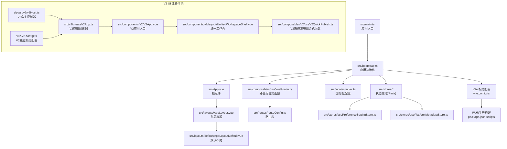
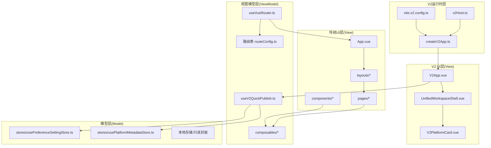
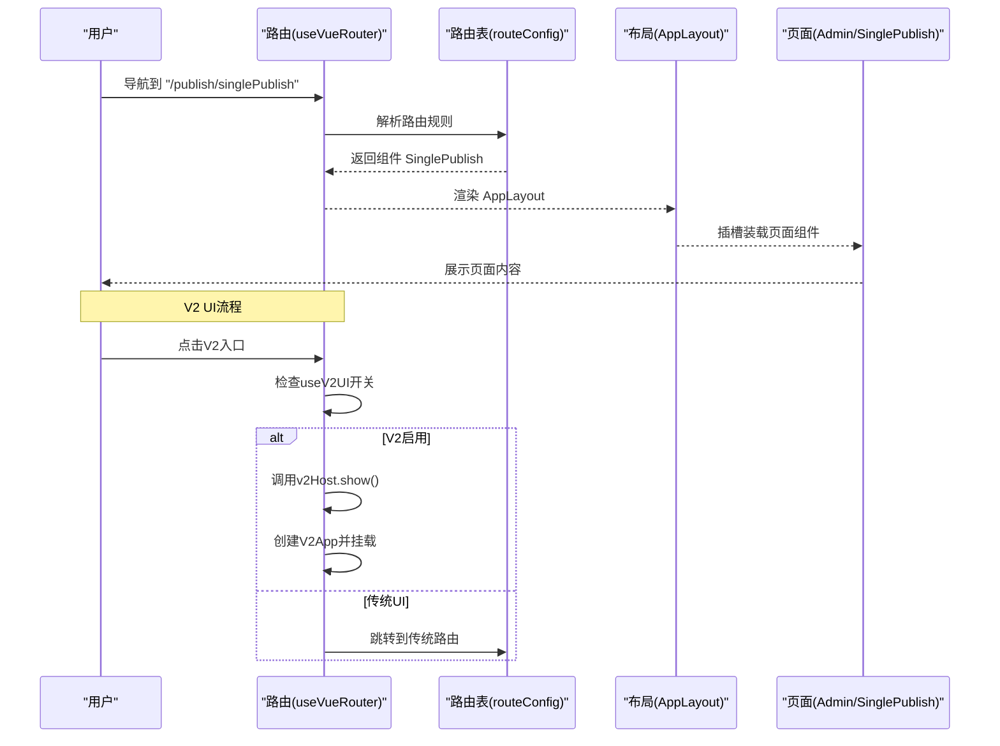
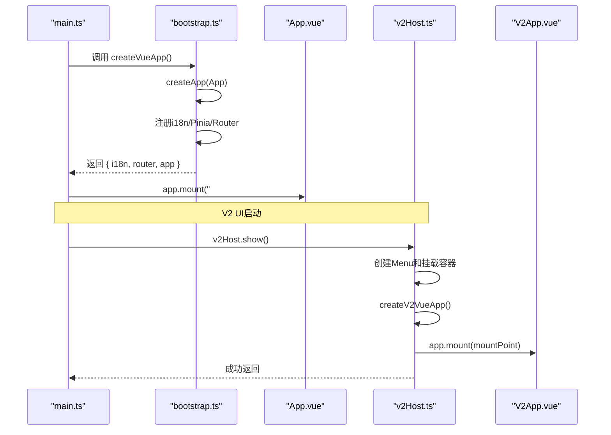
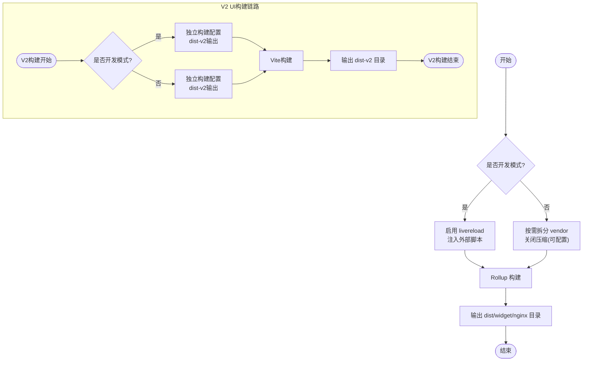
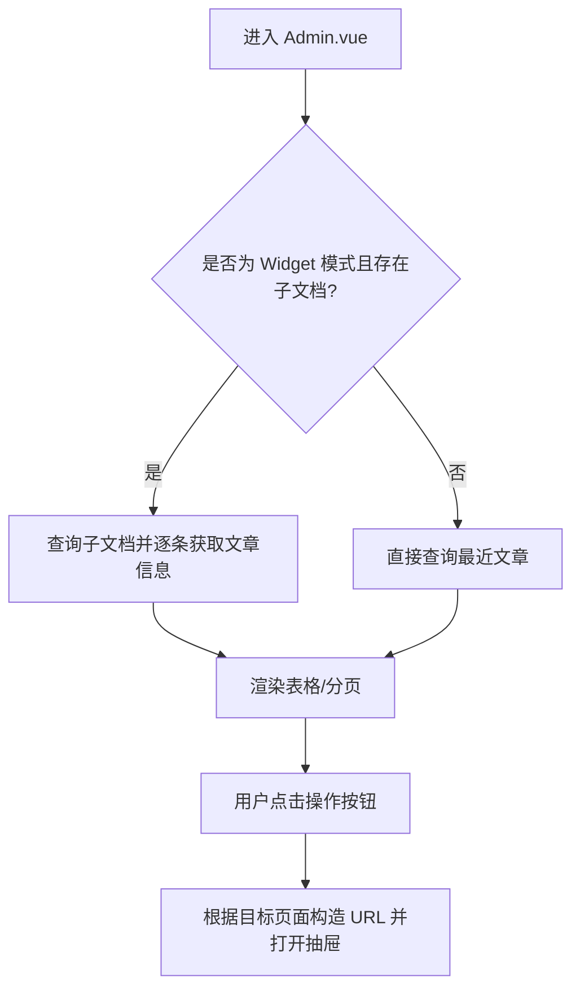
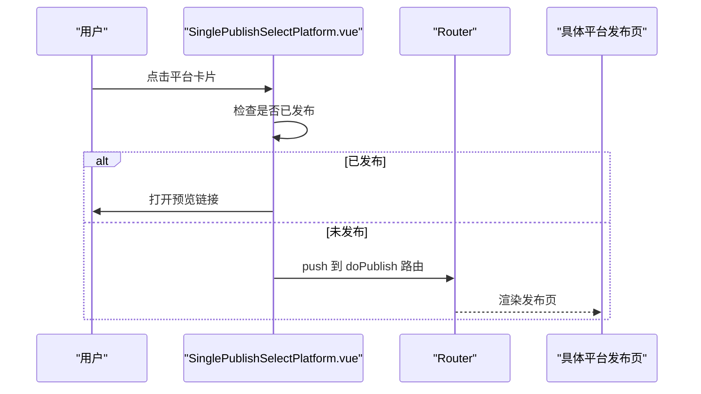
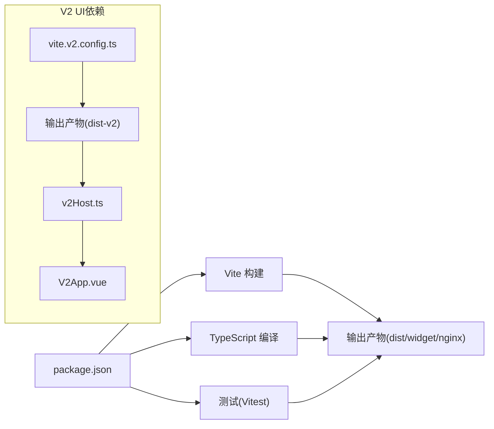

# 整体架构设计

<cite>
**本文引用的文件**   
- [src/main.ts](file://src/main.ts)
- [src/bootstrap.ts](file://src/bootstrap.ts)
- [src/App.vue](file://src/App.vue)
- [src/layouts/AppLayout.vue](file://src/layouts/AppLayout.vue)
- [src/layouts/default/AppLayoutDefault.vue](file://src/layouts/default/AppLayoutDefault.vue)
- [src/routes/routeConfig.ts](file://src/routes/routeConfig.ts)
- [src/composables/useVueRouter.ts](file://src/composables/useVueRouter.ts)
- [src/locales/index.ts](file://src/locales/index.ts)
- [src/stores/usePreferenceSettingStore.ts](file://src/stores/usePreferenceSettingStore.ts)
- [src/stores/usePlatformMetadataStore.ts](file://src/stores/usePlatformMetadataStore.ts)
- [src/pages/Admin.vue](file://src/pages/Admin.vue)
- [src/components/publish/SinglePublishSelectPlatform.vue](file://src/components/publish/SinglePublishSelectPlatform.vue)
- [vite.config.ts](file://vite.config.ts)
- [vite.v2.config.ts](file://vite.v2.config.ts)
- [package.json](file://package.json)
- [tsconfig.json](file://tsconfig.json)
- [src/assets/style.css](file://src/assets/style.css)
- [src/setup.ts](file://src/setup.ts)
- [src/components/v2/V2App.vue](file://src/components/v2/V2App.vue)
- [src/components/v2/layout/UnifiedWorkspaceShell.vue](file://src/components/v2/layout/UnifiedWorkspaceShell.vue)
- [src/composables/v2/useV2QuickPublish.ts](file://src/composables/v2/useV2QuickPublish.ts)
- [src/v2/createV2App.ts](file://src/v2/createV2App.ts)
- [siyuan/v2/v2Host.ts](file://siyuan/v2/v2Host.ts)
- [src/assets/v2/base.styl](file://src/assets/v2/base.styl)
- [src/assets/v2/variables.styl](file://src/assets/v2/variables.styl)
- [openspec/changes/refactor-ui-v2-foundation/specs/ui-v2-migration/spec.md](file://openspec/changes/refactor-ui-v2-foundation/specs/ui-v2-migration/spec.md)
- [openspec/changes/refactor-ui-v2-foundation/design.md](file://openspec/changes/refactor-ui-v2-foundation/design.md)
</cite>

## 目录
1. [引言](#引言)
2. [项目结构](#项目结构)
3. [核心组件](#核心组件)
4. [架构总览](#架构总览)
5. [详细组件分析](#详细组件分析)
6. [V2 UI迁移生命周期](#v2-ui迁移生命周期)
7. [依赖分析](#依赖分析)
8. [性能考虑](#性能考虑)
9. [故障排查指南](#故障排查指南)
10. [结论](#结论)
11. [附录](#附录)

## 引言
本文件面向"思源笔记发布器插件"的整体架构设计，围绕 MVVM 架构模式、Vue 3 单页应用的路由与布局系统、应用启动流程（从 main.ts 到 bootstrap.ts）、Vite 构建工具链（开发服务器、热重载、生产构建）、全局样式与主题系统进行系统性阐述。**特别地，本版本新增了V2 UI迁移生命周期章节，详细描述从Milestone 0到Milestone 6的完整演进过程，以及统一工作壳模型的批准状态。**

## 项目结构
该项目采用基于功能域的组织方式，前端核心位于 src 目录，包含页面、组件、布局、路由、状态管理、适配器、国际化、工具与构建配置等模块。入口文件通过 main.ts 创建应用实例，再由 bootstrap.ts 完成依赖注入（路由、国际化、状态管理、指令等），最终挂载到 DOM。**同时，V2 UI迁移项目通过独立的构建链路和组件体系，实现了与传统UI的并行共存。**

**图表来源**
- [src/main.ts:1-22](file://src/main.ts#L1-L22)
- [src/bootstrap.ts:1-53](file://src/bootstrap.ts#L1-L53)
- [src/App.vue:1-25](file://src/App.vue#L1-L25)
- [src/layouts/AppLayout.vue:1-24](file://src/layouts/AppLayout.vue#L1-L24)
- [src/layouts/default/AppLayoutDefault.vue:1-33](file://src/layouts/default/AppLayoutDefault.vue#L1-L33)
- [src/composables/useVueRouter.ts:1-19](file://src/composables/useVueRouter.ts#L1-L19)
- [src/routes/routeConfig.ts:1-151](file://src/routes/routeConfig.ts#L1-L151)
- [src/locales/index.ts:1-25](file://src/locales/index.ts#L1-L25)
- [src/stores/usePreferenceSettingStore.ts:1-90](file://src/stores/usePreferenceSettingStore.ts#L1-L90)
- [src/stores/usePlatformMetadataStore.ts:1-128](file://src/stores/usePlatformMetadataStore.ts#L1-L128)
- [vite.config.ts:1-275](file://vite.config.ts#L1-L275)
- [package.json:1-99](file://package.json#L1-L99)
- [src/components/v2/V2App.vue:1-274](file://src/components/v2/V2App.vue#L1-L274)
- [src/components/v2/layout/UnifiedWorkspaceShell.vue:1-40](file://src/components/v2/layout/UnifiedWorkspaceShell.vue#L1-L40)
- [src/composables/v2/useV2QuickPublish.ts:1-76](file://src/composables/v2/useV2QuickPublish.ts#L1-L76)
- [src/v2/createV2App.ts:1-37](file://src/v2/createV2App.ts#L1-L37)
- [siyuan/v2/v2Host.ts:1-108](file://siyuan/v2/v2Host.ts#L1-L108)
- [vite.v2.config.ts:1-137](file://vite.v2.config.ts#L1-L137)

**章节来源**
- [src/main.ts:1-22](file://src/main.ts#L1-L22)
- [src/bootstrap.ts:1-53](file://src/bootstrap.ts#L1-L53)
- [vite.config.ts:1-275](file://vite.config.ts#L1-L275)
- [package.json:1-99](file://package.json#L1-L99)
- [src/components/v2/V2App.vue:1-274](file://src/components/v2/V2App.vue#L1-L274)
- [siyuan/v2/v2Host.ts:1-108](file://siyuan/v2/v2Host.ts#L1-L108)
- [vite.v2.config.ts:1-137](file://vite.v2.config.ts#L1-L137)

## 核心组件
- 应用入口与初始化
  - main.ts：异步创建应用实例并挂载到 #app。
  - bootstrap.ts：集中完成 i18n、Pinia、Router 注入与全局指令注册，返回 { i18n, router, app }。
- 根组件与布局
  - App.vue：引入全局样式并在 AppLayout 中渲染 router-view。
  - AppLayout.vue：动态选择布局组件（默认布局）。
  - AppLayoutDefault.vue：包含头部、主内容区与尾部的基础布局。
- 路由与页面
  - useVueRouter.ts：基于 hash 历史模式创建路由器并注入 routeConfig.ts。
  - routeConfig.ts：定义全量路由映射，覆盖极速发布、常规发布、批量发布、设置、关于等页面。
- 状态管理（Pinia）
  - usePreferenceSettingStore.ts：发布偏好设置本地持久化与只读封装。
  - usePlatformMetadataStore.ts：平台元数据（标签、分类、模板）的本地持久化与更新。
- 页面与组件
  - Admin.vue：文章列表管理、分页、抽屉内嵌、平台操作入口。
  - SinglePublishSelectPlatform.vue：平台选择与一键预览、跳转到具体平台发布页。

**V2 UI核心组件**
- V2App.vue：V2 UI应用入口，采用.syp-v2命名空间，包含统一工作壳和快速发布主界面。
- UnifiedWorkspaceShell.vue：统一工作壳骨架，支持品牌区、导航区、主内容区、详情区的动态显隐。
- useV2QuickPublish.ts：V2快速发布组合式函数，处理文档上下文读取和平台列表生成。
- createV2App.ts：V2应用创建器，负责Pinia、i18n等依赖注入。
- v2Host.ts：V2宿主控制器，基于思源原生Menu实现真实DOM挂载。

**章节来源**
- [src/main.ts:10-21](file://src/main.ts#L10-L21)
- [src/bootstrap.ts:25-50](file://src/bootstrap.ts#L25-L50)
- [src/App.vue:10-22](file://src/App.vue#L10-L22)
- [src/layouts/AppLayout.vue:18-23](file://src/layouts/AppLayout.vue#L18-L23)
- [src/layouts/default/AppLayoutDefault.vue:10-17](file://src/layouts/default/AppLayoutDefault.vue#L10-L17)
- [src/composables/useVueRouter.ts:13-18](file://src/composables/useVueRouter.ts#L13-L18)
- [src/routes/routeConfig.ts:42-150](file://src/routes/routeConfig.ts#L42-L150)
- [src/stores/usePreferenceSettingStore.ts:21-86](file://src/stores/usePreferenceSettingStore.ts#L21-L86)
- [src/stores/usePlatformMetadataStore.ts:21-124](file://src/stores/usePlatformMetadataStore.ts#L21-L124)
- [src/pages/Admin.vue:10-343](file://src/pages/Admin.vue#L10-L343)
- [src/components/publish/SinglePublishSelectPlatform.vue:10-149](file://src/components/publish/SinglePublishSelectPlatform.vue#L10-L149)
- [src/components/v2/V2App.vue:1-274](file://src/components/v2/V2App.vue#L1-L274)
- [src/components/v2/layout/UnifiedWorkspaceShell.vue:1-40](file://src/components/v2/layout/UnifiedWorkspaceShell.vue#L1-L40)
- [src/composables/v2/useV2QuickPublish.ts:1-76](file://src/composables/v2/useV2QuickPublish.ts#L1-L76)
- [src/v2/createV2App.ts:1-37](file://src/v2/createV2App.ts#L1-L37)
- [siyuan/v2/v2Host.ts:1-108](file://siyuan/v2/v2Host.ts#L1-L108)

## 架构总览
该应用遵循 MVVM 架构：
- Model：Pinia Store（偏好设置、平台元数据等），配合本地存储与只读封装。
- View：Vue 组件树（页面、布局、公共组件）。
- ViewModel：Composition API 组合式函数（useVueRouter、useVueI18n、usePublish 等）与路由守卫/导航守卫协作。

**V2 UI架构特点**
- 命名空间隔离：所有V2样式和组件均包裹在.syp-v2命名空间下，确保与传统UI完全隔离。
- 统一工作壳：采用UnifiedWorkspaceShell作为所有V2界面的统一骨架。
- 真实DOM挂载：V2通过v2Host基于思源原生Menu实现真实DOM挂载，而非iframe SPA。
- 渐进迁移：遵循Milestone 0-6的完整生命周期，确保每个阶段都有明确的验收标准。

**图表来源**
- [src/App.vue:10-22](file://src/App.vue#L10-L22)
- [src/layouts/AppLayout.vue:18-23](file://src/layouts/AppLayout.vue#L18-L23)
- [src/layouts/default/AppLayoutDefault.vue:10-17](file://src/layouts/default/AppLayoutDefault.vue#L10-L17)
- [src/composables/useVueRouter.ts:13-18](file://src/composables/useVueRouter.ts#L13-L18)
- [src/routes/routeConfig.ts:42-150](file://src/routes/routeConfig.ts#L42-L150)
- [src/stores/usePreferenceSettingStore.ts:21-86](file://src/stores/usePreferenceSettingStore.ts#L21-L86)
- [src/stores/usePlatformMetadataStore.ts:21-124](file://src/stores/usePlatformMetadataStore.ts#L21-L124)
- [src/components/v2/V2App.vue:1-274](file://src/components/v2/V2App.vue#L1-L274)
- [src/components/v2/layout/UnifiedWorkspaceShell.vue:1-40](file://src/components/v2/layout/UnifiedWorkspaceShell.vue#L1-L40)
- [src/composables/v2/useV2QuickPublish.ts:1-76](file://src/composables/v2/useV2QuickPublish.ts#L1-L76)
- [src/v2/createV2App.ts:1-37](file://src/v2/createV2App.ts#L1-L37)
- [siyuan/v2/v2Host.ts:1-108](file://siyuan/v2/v2Host.ts#L1-L108)

## 详细组件分析

### MVVM 架构实现要点
- 类型安全与模块化
  - TypeScript 提供编译期类型检查，tsconfig.json 配置了 bundler 模式与路径别名，确保模块解析与类型推断稳定。
- 组合式函数与响应式数据
  - 大量使用 ref/reactive/computed/watch，结合 useVueRouter、useVueI18n、useSiyuanApi 等组合式函数，将业务逻辑与视图解耦。
- 状态管理与持久化
  - Pinia Store 将跨组件共享的状态集中管理；通过本地存储封装实现持久化与只读访问，避免意外修改。

**V2 UI架构实现**
- 命名空间隔离：通过.syp-v2前缀确保V2样式不影响传统UI。
- 组合式函数：useV2QuickPublish提供V2特有的状态管理能力。
- 统一工作壳：所有V2界面共享相同的布局骨架。

**章节来源**
- [tsconfig.json:1-34](file://tsconfig.json#L1-L34)
- [src/stores/usePreferenceSettingStore.ts:21-86](file://src/stores/usePreferenceSettingStore.ts#L21-L86)
- [src/stores/usePlatformMetadataStore.ts:21-124](file://src/stores/usePlatformMetadataStore.ts#L21-L124)
- [src/components/v2/V2App.vue:104-142](file://src/components/v2/V2App.vue#L104-L142)
- [src/composables/v2/useV2QuickPublish.ts:17-75](file://src/composables/v2/useV2QuickPublish.ts#L17-L75)

### Vue 3 单页应用路由与布局
- 路由设计
  - 基于 hash 历史模式，便于在不同宿主环境（如思源挂件、浏览器窗口）中稳定运行。
  - 路由表覆盖发布主流程（极速/常规/批量）、设置、关于、测试等页面。
- 布局系统
  - AppLayout.vue 动态选择布局组件，当前默认使用 AppLayoutDefault.vue，后者包含头部、主内容区与尾部，支持 slot 插槽承载页面内容。

**V2 UI路由与布局**
- V2 UI采用统一工作壳：UnifiedWorkspaceShell提供品牌区、导航区、主内容区、详情区的统一布局。
- 视图切换：通过currentView属性在"quick_publish"和"settings"之间切换。
- 响应式设计：支持移动端和桌面端的不同布局策略。

**图表来源**
- [src/composables/useVueRouter.ts:13-18](file://src/composables/useVueRouter.ts#L13-L18)
- [src/routes/routeConfig.ts:42-55](file://src/routes/routeConfig.ts#L42-L55)
- [src/layouts/AppLayout.vue:18-23](file://src/layouts/AppLayout.vue#L18-L23)
- [src/layouts/default/AppLayoutDefault.vue:10-17](file://src/layouts/default/AppLayoutDefault.vue#L10-L17)
- [siyuan/v2/v2Host.ts:26-70](file://siyuan/v2/v2Host.ts#L26-L70)

**章节来源**
- [src/composables/useVueRouter.ts:13-18](file://src/composables/useVueRouter.ts#L13-L18)
- [src/routes/routeConfig.ts:42-150](file://src/routes/routeConfig.ts#L42-L150)
- [src/layouts/AppLayout.vue:18-23](file://src/layouts/AppLayout.vue#L18-L23)
- [src/layouts/default/AppLayoutDefault.vue:10-17](file://src/layouts/default/AppLayoutDefault.vue#L10-L17)
- [src/components/v2/V2App.vue:44-97](file://src/components/v2/V2App.vue#L44-L97)
- [src/components/v2/layout/UnifiedWorkspaceShell.vue:22-39](file://src/components/v2/layout/UnifiedWorkspaceShell.vue#L22-L39)

### 应用启动流程（main.ts → bootstrap.ts）
- main.ts 异步调用 createVueApp，获取 { app } 并挂载到 #app。
- bootstrap.ts 创建 Vue 实例，依次注册 i18n、Pinia、Router，并注册全局指令，最后返回实例供 main.ts 挂载。

**V2 UI启动流程**
- v2Host.show()：通过思源原生Menu创建挂载容器，实现真实DOM挂载。
- createV2VueApp()：创建V2应用实例，注入Pinia和i18n。
- 统一回退机制：V2初始化失败时自动回退到传统UI。

**图表来源**
- [src/main.ts:15-21](file://src/main.ts#L15-L21)
- [src/bootstrap.ts:25-50](file://src/bootstrap.ts#L25-L50)
- [src/App.vue:10-22](file://src/App.vue#L10-L22)
- [siyuan/v2/v2Host.ts:26-70](file://siyuan/v2/v2Host.ts#L26-L70)
- [src/v2/createV2App.ts:15-36](file://src/v2/createV2App.ts#L15-L36)

**章节来源**
- [src/main.ts:10-21](file://src/main.ts#L10-L21)
- [src/bootstrap.ts:25-50](file://src/bootstrap.ts#L25-L50)
- [siyuan/v2/v2Host.ts:1-108](file://siyuan/v2/v2Host.ts#L1-L108)
- [src/v2/createV2App.ts:1-37](file://src/v2/createV2App.ts#L1-L37)

### Vite 构建工具链
- 开发服务器与热重载
  - 通过 rollup-plugin-livereload 与 watch 模式实现文件变更后的自动刷新。
  - createHtmlPlugin 在开发模式注入必要的外部脚本（如 Lute、OSS SDK）。
- 生产构建
  - 按需拆分 vendor chunk，提升缓存命中率；关闭压缩以便调试（可通过环境控制）。
  - 支持多构建目标（SiYuan 插件、Widget、Nginx 部署），通过 BUILD_TYPE 控制输出目录与 base。
- 测试环境
  - Vitest + jsdom，setupFiles 指向 src/setup.ts，内置 element-plus 的内联依赖。

**V2 UI独立构建链路**
- 独立构建入口：vite.v2.config.ts提供专门的V2构建配置。
- 独立输出目录：dist-v2目录，避免与传统UI构建产物冲突。
- 独立静态资源：自动复制plugin.json、README文件等静态资源。
- 真实DOM构建：lib模式构建CJS格式，直接服务插件运行时。

**图表来源**
- [vite.config.ts:151-255](file://vite.config.ts#L151-L255)
- [vite.config.ts:82-181](file://vite.config.ts#L82-L181)
- [src/setup.ts:10-18](file://src/setup.ts#L10-L18)
- [vite.v2.config.ts:59-137](file://vite.v2.config.ts#L59-L137)

**章节来源**
- [vite.config.ts:1-275](file://vite.config.ts#L1-L275)
- [package.json:9-27](file://package.json#L9-L27)
- [src/setup.ts:10-18](file://src/setup.ts#L10-L18)
- [vite.v2.config.ts:1-137](file://vite.v2.config.ts#L1-L137)

### 全局样式与主题系统
- 全局样式
  - App.vue 引入 style.css 与 style.dark.css，统一字体、颜色、Element Plus 样式变量。
  - style.css 定义 :root、#app、基础组件样式与对话框尺寸等。
- 主题与暗色支持
  - 通过 CSS 变量与 Element Plus 暗色 CSS 变量实现明暗主题切换。
  - 建议在布局或页面中根据系统偏好或用户设置切换主题类名，以驱动 CSS 变量生效。

**V2 UI样式系统**
- 命名空间隔离：所有V2样式都包裹在.syp-v2命名空间下。
- 设计令牌：variables.styl定义统一的设计令牌系统。
- 基础组件：按钮、输入框、卡片等基础样式的统一定义。
- 响应式设计：支持移动端和桌面端的不同布局策略。

**章节来源**
- [src/App.vue:13-15](file://src/App.vue#L13-L15)
- [src/assets/style.css:12-166](file://src/assets/style.css#L12-L166)
- [src/assets/v2/base.styl:1-245](file://src/assets/v2/base.styl#L1-L245)
- [src/assets/v2/variables.styl:1-58](file://src/assets/v2/variables.styl#L1-L58)

### 页面与组件工作流示例

#### 文章管理页面（Admin.vue）
- 功能概览
  - 加载文章列表、分页、搜索、展开行查看平台绑定信息。
  - 通过抽屉桥接（DrawerBoxBridge）在同源环境下内嵌发布/预览页面。
- 关键流程
  - 根据宿主环境判断是否为 Widget 模式，决定是否查询子文档。
  - 通过路由 push 进入单个发布流程或批量发布流程。

**图表来源**
- [src/pages/Admin.vue:215-342](file://src/pages/Admin.vue#L215-L342)

**章节来源**
- [src/pages/Admin.vue:10-343](file://src/pages/Admin.vue#L10-L343)

#### 平台选择与发布（SinglePublishSelectPlatform.vue）
- 功能概览
  - 展示已启用且已授权的平台列表，支持一键预览与跳转到具体平台发布页。
- 关键流程
  - 读取动态配置，过滤可用平台。
  - 根据是否已发布决定按钮状态与预览链接。

**图表来源**
- [src/components/publish/SinglePublishSelectPlatform.vue:62-77](file://src/components/publish/SinglePublishSelectPlatform.vue#L62-L77)
- [src/components/publish/SinglePublishSelectPlatform.vue:86-101](file://src/components/publish/SinglePublishSelectPlatform.vue#L86-L101)

**章节来源**
- [src/components/publish/SinglePublishSelectPlatform.vue:10-149](file://src/components/publish/SinglePublishSelectPlatform.vue#L10-L149)

## V2 UI迁移生命周期

### 迁移规范与要求
V2 UI迁移作为完整的生命周期项目，必须遵循以下核心要求：

**最高优先级规则**
- 优先使用思源笔记原生UI和样式系统
- 优先复用宿主已注入的siyuan-style.css
- 优先复用宿主已有的菜单、按钮、表单、状态反馈和布局能力
- 只有宿主不存在合适能力时，才允许局部自定义样式

**技术架构要求**
- V2运行时必须基于真实DOM挂载，而非iframe SPA
- 新V2能力必须在插件运行时内实现真实DOM挂载
- 不得引入新的iframe页面用于V2
- V2的长期方向必须是DOM-only，iframe仅作为过渡兼容层

### Milestone 0：入口与治理基座
**目标**：建立能运行、能回退、能扩展的V2基座。

**范围**：
- 统一入口定义
- useV2UI开关
- V2Host
- 单一配置源
- 回退机制
- 明确V2主路径只允许真实DOM挂载
- 建立V2独立构建入口用于验证DOM-only路径

**输出**：
- 稳定可开的V2入口
- 失败自动回退
- 最小可运行V2App

**退出条件**：
- 开关关：旧UI
- 开关开：V2 Host
- Host失败：旧UI
- 关键偏好读取路径唯一

### Milestone 1：样式系统与工作壳骨架
**目标**：建立V2样式基础，为后续主界面和设置展开态提供统一视觉骨架。

**范围**：
- .syp-v2命名空间
- 设计令牌
- 基础排版、按钮、卡片
- UnifiedWorkspaceShell骨架样式

**输出**：
- 样式统一入口
- 品牌区/导航区/内容区/详情区骨架

**退出条件**：
- V2样式不污染旧UI
- 统一壳骨架可渲染
- 样式不再双轨

### Milestone 2：快速发布主界面
**目标**：交付主界面态，让V2第一屏真正成为快速发布界面。

**范围**：
- 当前文档信息展示
- 已配置平台列表
- 空状态
- 设置展开入口

**输出**：
- 主界面态可展示真实平台
- 用户可从主界面切到设置展开态

**退出条件**：
- 已配置态和空状态都可工作
- 不需要进入设置即可完成平台选择动作准备

### Milestone 3：发布动作闭环
**目标**：打通主界面态的发布闭环。

**范围**：
- 单平台发布
- 发布中状态
- 发布成功/失败反馈
- 重试

**输出**：
- V2主界面态完成真实发布

**退出条件**：
- 用户可以在V2里完成当前文档发布
- 失败不阻断后续操作

### Milestone 4：设置展开态第一阶段
**目标**：在统一工作壳内完成设置展开态的第一阶段能力。

**范围**：
- 账号列表
- 平台选择
- 图床设置内容区
- 偏好设置内容区
- 至少一类平台配置桥接
- 开始把高频设置能力从iframe SPA中抽离

**输出**：
- 统一工作壳展开态可用
- 设置分类可切换
- 部分桥接链路可跑通

**退出条件**：
- 新增账号流程可用
- 图床设置可展示与保存
- 偏好设置可展示与保存

### Milestone 5：设置展开态第二阶段
**目标**：扩展设置展开态，逐步替换高频旧设置能力。

**范围**：
- 更多平台配置桥接
- 设置态交互打磨
- 图床和偏好高频能力稳定化

**输出**：
- 高频设置路径优先完成迁移

**退出条件**：
- 大多数用户高频设置场景不再依赖旧设置页

### Milestone 6：收敛与稳定发布
**目标**：完成V2与旧UI的长期共存策略、收敛策略和稳定发布策略。

**范围**：
- 统计仍依赖旧UI的能力
- 判断哪些旧入口可以下沉或隐藏
- 准备后续废弃计划
- 统计仍依赖iframe SPA的能力
- 制定iframe退役清单

**输出**：
- V2稳定发布策略
- 旧UI收敛清单

**退出条件**：
- 至少一个稳定版本周期内无阻断性问题
- 回退路径仍然可用
- 旧UI是否废弃有明确判据

### 渐进迁移策略
**共存策略**：
- 默认允许旧UI与V2共存
- V2通过开关启用
- 旧入口不立即删除
- iframe路径仅作为历史兼容路径，不能继续承载V2新能力

**桥接策略**：
- 能桥接就桥接
- 不能桥接的先保留旧页
- 不用"一定全新重写"绑死后续阶段
- 但桥接优先到真实DOM组件层，不优先到iframe页面层

**回退策略**：
- 入口不稳定
- 配置双读
- V2影响旧流程
- 某一阶段的实现破坏前置阶段验收

### 验证策略
**每个里程碑都必须具备**：
- 手工smoke清单
- 至少一项自动化或半自动验证
- 回退验证

**重点验证对象**：
- 顶栏入口
- 文档快捷入口
- 偏好开关
- 主界面平台展示
- 发布动作
- 账号设置
- 图床设置
- 偏好设置

### 风险管控
**风险1：仍然按局部思维推进**
- 结果：某个里程碑优化局部，后续阶段再推翻，总体成本升高

**风险2：过早重写所有平台表单**
- 结果：开发周期极长，频繁返工，主路径迟迟不能交付

**风险3：缺少生命周期管理**
- 结果：每一阶段都像一个临时patch，维护者无法判断接下来该做什么

**风险4：继续维护iframe双系统**
- 结果：DOM版本和iframe版本长期重复演进，存储和入口逻辑持续分叉，维护成本继续上升

**章节来源**
- [openspec/changes/refactor-ui-v2-foundation/specs/ui-v2-migration/spec.md:1-202](file://openspec/changes/refactor-ui-v2-foundation/specs/ui-v2-migration/spec.md#L1-L202)
- [openspec/changes/refactor-ui-v2-foundation/design.md:1-576](file://openspec/changes/refactor-ui-v2-foundation/design.md#L1-L576)

## 依赖分析
- 运行时依赖
  - Vue 3、Vue Router、Pinia、Element Plus（按需引入）、vue-i18n、siyuan 等。
- 构建与开发依赖
  - Vite、@vitejs/plugin-vue、unplugin-auto-import、unplugin-vue-components、unplugin-icons、vite-plugin-html、vite-plugin-node-polyfills、vitest、vue-tsc 等。
- 脚本命令
  - dev/serve/build/pluginBuild/siyuanBuild/widgetBuild/nginxBuild 等，分别对应不同部署场景。

**V2 UI依赖**
- 独立构建链路：vite.v2.config.ts提供专门的V2构建配置。
- 真实DOM依赖：v2Host基于思源原生Menu实现真实DOM挂载。
- 组合式函数：useV2QuickPublish提供V2特有的状态管理能力。

**图表来源**
- [package.json:9-27](file://package.json#L9-L27)
- [vite.config.ts:82-181](file://vite.config.ts#L82-L181)
- [vite.v2.config.ts:59-137](file://vite.v2.config.ts#L59-L137)

**章节来源**
- [package.json:1-99](file://package.json#L1-L99)
- [vite.config.ts:1-275](file://vite.config.ts#L1-L275)
- [vite.v2.config.ts:1-137](file://vite.v2.config.ts#L1-L137)

## 性能考虑
- 代码分割与缓存
  - Rollup manualChunks 按第三方库拆分 vendor_*，提升浏览器缓存复用率。
- 构建优化
  - 生产构建关闭压缩以便调试，必要时开启压缩；按需引入 Element Plus 减少首屏体积。
  - V2 UI独立构建，避免与传统UI构建相互影响。
- 运行时优化
  - 使用浅响应（shallowRef）与只读引用（readonly）降低不必要响应式开销。
  - 合理使用骨架屏与条件渲染，减少首屏渲染压力。
  - V2 UI采用命名空间隔离，避免样式冲突导致的重绘。

## 故障排查指南
- 国际化与路由问题
  - 若页面语言异常，检查 i18n 配置与 fallbackLocale 设置。
  - 若路由无法跳转，确认 useVueRouter 的历史模式与 routeConfig 的路径正确。
- 构建与热重载
  - 开发模式下未热更新：检查 rollup-plugin-livereload 是否启用，watch 参数是否传递。
  - 外部脚本未注入：确认 createHtmlPlugin 的注入逻辑与开发/生产分支。
  - V2 UI构建失败：检查vite.v2.config.ts配置和dist-v2目录权限。
- 测试失败
  - Vitest 环境缺少依赖：确保 element-plus 已在 server.deps.inline 中声明。
- V2 UI特有问题
  - V2入口不可用：检查useV2UI开关状态和v2Host初始化日志。
  - 样式冲突：确认.syp-v2命名空间是否正确应用。
  - 工作壳不显示：检查UnifiedWorkspaceShell的currentView属性。

**章节来源**
- [src/locales/index.ts:14-24](file://src/locales/index.ts#L14-L24)
- [src/composables/useVueRouter.ts:13-18](file://src/composables/useVueRouter.ts#L13-L18)
- [vite.config.ts:212-228](file://vite.config.ts#L212-L228)
- [vite.config.ts:96-149](file://vite.config.ts#L96-L149)
- [src/setup.ts:10-18](file://src/setup.ts#L10-L18)
- [siyuan/v2/v2Host.ts:58-69](file://siyuan/v2/v2Host.ts#L58-L69)
- [src/assets/v2/base.styl:11-245](file://src/assets/v2/base.styl#L11-L245)

## 结论
该插件以 Vue 3 + Pinia + Vue Router 为核心，采用 MVVM 分层与组合式函数解耦业务逻辑，结合 Vite 的高效构建与按需引入策略，实现了在多宿主环境下的稳定运行。**通过引入V2 UI迁移生命周期，项目建立了从Milestone 0到Milestone 6的完整渐进迁移路径，确保了新旧UI的平滑过渡和长期共存。** V2 UI采用真实DOM挂载、统一工作壳和命名空间隔离等设计，为后续功能迭代与平台接入提供了更加稳健的基础设施。通过清晰的路由与布局体系、完善的本地状态持久化与只读封装，以及可扩展的平台适配器，为后续功能迭代与平台接入提供了良好的基础设施。

## 附录
- 技术选型说明
  - Vue 3 + Composition API：更好的逻辑复用与类型推断，适合复杂交互与状态管理。
  - TypeScript：提供编译期类型保障，降低维护成本。
  - Vite：更快的冷启动与热重载，多构建目标支持完善。
  - Pinia：轻量级状态管理，API 更直观，与 TS 结合更佳。
  - Element Plus：组件丰富，按需引入减少体积。
  - vue-i18n：国际化能力成熟，易于扩展多语言。
  - **V2 UI新增**：真实DOM挂载、统一工作壳、命名空间隔离、渐进迁移生命周期。