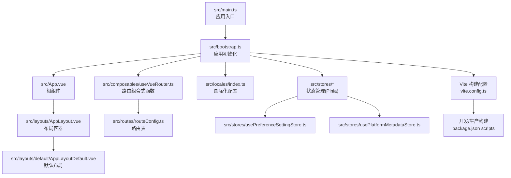
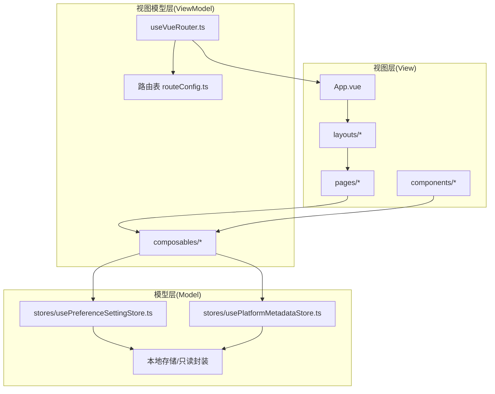
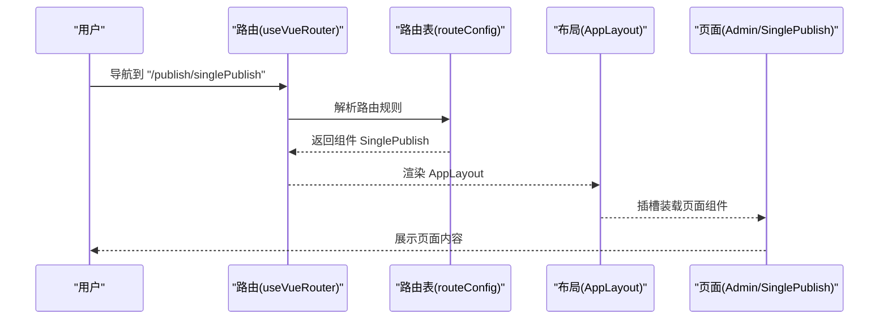
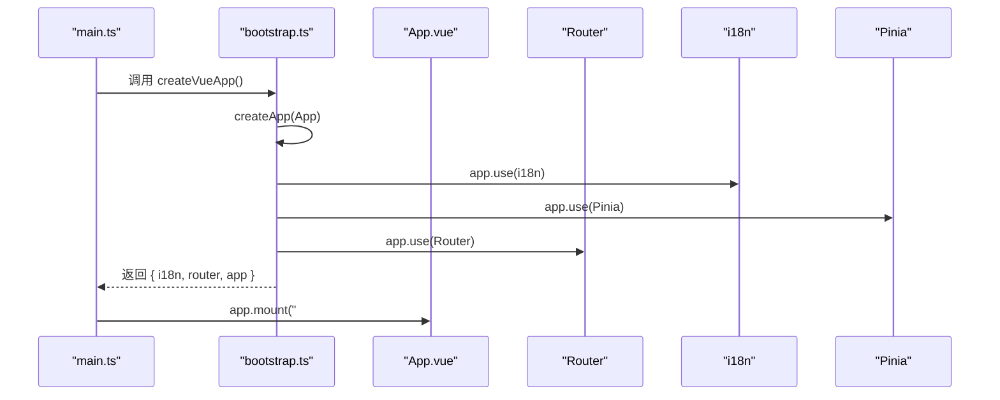
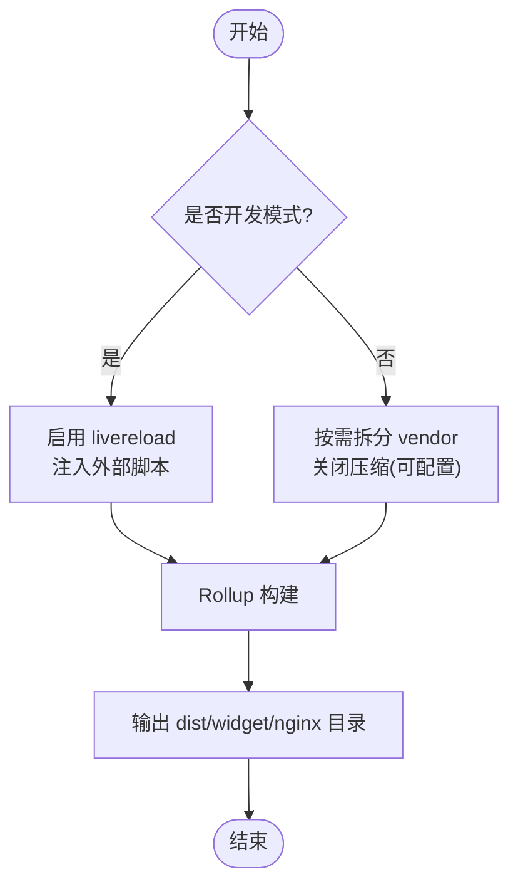
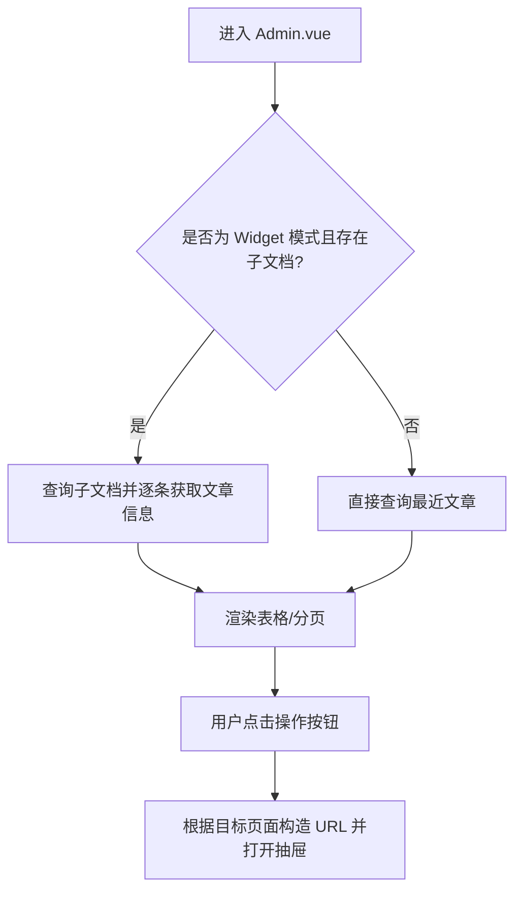
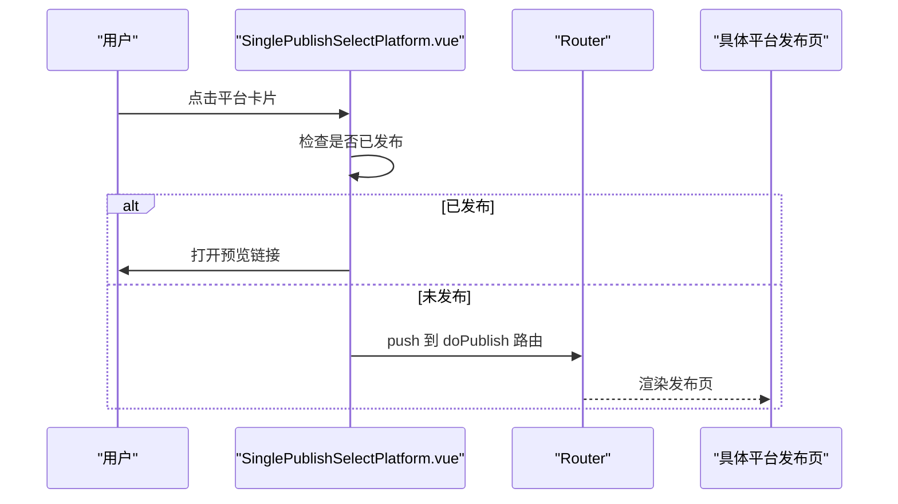
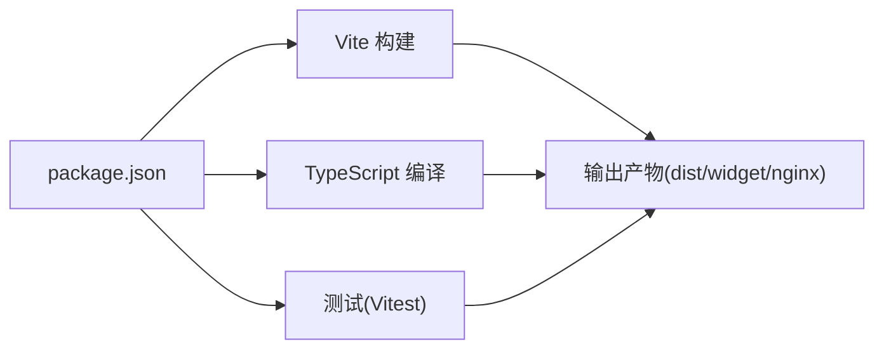

# 整体架构设计

<cite>
**本文引用的文件**   
- [src/main.ts](file://src/main.ts)
- [src/bootstrap.ts](file://src/bootstrap.ts)
- [src/App.vue](file://src/App.vue)
- [src/layouts/AppLayout.vue](file://src/layouts/AppLayout.vue)
- [src/layouts/default/AppLayoutDefault.vue](file://src/layouts/default/AppLayoutDefault.vue)
- [src/routes/routeConfig.ts](file://src/routes/routeConfig.ts)
- [src/composables/useVueRouter.ts](file://src/composables/useVueRouter.ts)
- [src/locales/index.ts](file://src/locales/index.ts)
- [src/stores/usePreferenceSettingStore.ts](file://src/stores/usePreferenceSettingStore.ts)
- [src/stores/usePlatformMetadataStore.ts](file://src/stores/usePlatformMetadataStore.ts)
- [src/pages/Admin.vue](file://src/pages/Admin.vue)
- [src/components/publish/SinglePublishSelectPlatform.vue](file://src/components/publish/SinglePublishSelectPlatform.vue)
- [vite.config.ts](file://vite.config.ts)
- [package.json](file://package.json)
- [tsconfig.json](file://tsconfig.json)
- [src/assets/style.css](file://src/assets/style.css)
- [src/setup.ts](file://src/setup.ts)
</cite>

## 目录
1. [引言](#引言)
2. [项目结构](#项目结构)
3. [核心组件](#核心组件)
4. [架构总览](#架构总览)
5. [详细组件分析](#详细组件分析)
6. [依赖分析](#依赖分析)
7. [性能考虑](#性能考虑)
8. [故障排查指南](#故障排查指南)
9. [结论](#结论)
10. [附录](#附录)

## 引言
本文件面向“思源笔记发布器插件”的整体架构设计，围绕 MVVM 架构模式、Vue 3 单页应用的路由与布局系统、应用启动流程（从 main.ts 到 bootstrap.ts）、Vite 构建工具链（开发服务器、热重载、生产构建）、全局样式与主题系统进行系统性阐述，并提供多幅架构与流程图示，帮助开发者快速理解与扩展该插件。

## 项目结构
该项目采用基于功能域的组织方式，前端核心位于 src 目录，包含页面、组件、布局、路由、状态管理、适配器、国际化、工具与构建配置等模块。入口文件通过 main.ts 创建应用实例，再由 bootstrap.ts 完成依赖注入（路由、国际化、状态管理、指令等），最终挂载到 DOM。

图表来源
- [src/main.ts:1-22](file://src/main.ts#L1-L22)
- [src/bootstrap.ts:1-53](file://src/bootstrap.ts#L1-L53)
- [src/App.vue:1-25](file://src/App.vue#L1-L25)
- [src/layouts/AppLayout.vue:1-24](file://src/layouts/AppLayout.vue#L1-L24)
- [src/layouts/default/AppLayoutDefault.vue:1-33](file://src/layouts/default/AppLayoutDefault.vue#L1-L33)
- [src/composables/useVueRouter.ts:1-19](file://src/composables/useVueRouter.ts#L1-L19)
- [src/routes/routeConfig.ts:1-151](file://src/routes/routeConfig.ts#L1-L151)
- [src/locales/index.ts:1-25](file://src/locales/index.ts#L1-L25)
- [src/stores/usePreferenceSettingStore.ts:1-90](file://src/stores/usePreferenceSettingStore.ts#L1-L90)
- [src/stores/usePlatformMetadataStore.ts:1-128](file://src/stores/usePlatformMetadataStore.ts#L1-L128)
- [vite.config.ts:1-275](file://vite.config.ts#L1-L275)
- [package.json:1-99](file://package.json#L1-L99)

章节来源
- [src/main.ts:1-22](file://src/main.ts#L1-L22)
- [src/bootstrap.ts:1-53](file://src/bootstrap.ts#L1-L53)
- [vite.config.ts:1-275](file://vite.config.ts#L1-L275)
- [package.json:1-99](file://package.json#L1-L99)

## 核心组件
- 应用入口与初始化
  - main.ts：异步创建应用实例并挂载到 #app。
  - bootstrap.ts：集中完成 i18n、Pinia、Router 注入与全局指令注册，返回 { i18n, router, app }。
- 根组件与布局
  - App.vue：引入全局样式并在 AppLayout 中渲染 router-view。
  - AppLayout.vue：动态选择布局组件（默认布局）。
  - AppLayoutDefault.vue：包含头部、主内容区与尾部的基础布局。
- 路由与页面
  - useVueRouter.ts：基于 hash 历史模式创建路由器并注入 routeConfig.ts。
  - routeConfig.ts：定义全量路由映射，覆盖极速发布、常规发布、批量发布、设置、关于等页面。
- 状态管理（Pinia）
  - usePreferenceSettingStore.ts：发布偏好设置本地持久化与只读封装。
  - usePlatformMetadataStore.ts：平台元数据（标签、分类、模板）的本地持久化与更新。
- 页面与组件
  - Admin.vue：文章列表管理、分页、抽屉内嵌、平台操作入口。
  - SinglePublishSelectPlatform.vue：平台选择与一键预览、跳转到具体平台发布页。

章节来源
- [src/main.ts:10-21](file://src/main.ts#L10-L21)
- [src/bootstrap.ts:25-50](file://src/bootstrap.ts#L25-L50)
- [src/App.vue:10-22](file://src/App.vue#L10-L22)
- [src/layouts/AppLayout.vue:18-23](file://src/layouts/AppLayout.vue#L18-L23)
- [src/layouts/default/AppLayoutDefault.vue:10-17](file://src/layouts/default/AppLayoutDefault.vue#L10-L17)
- [src/composables/useVueRouter.ts:13-18](file://src/composables/useVueRouter.ts#L13-L18)
- [src/routes/routeConfig.ts:42-150](file://src/routes/routeConfig.ts#L42-L150)
- [src/stores/usePreferenceSettingStore.ts:21-86](file://src/stores/usePreferenceSettingStore.ts#L21-L86)
- [src/stores/usePlatformMetadataStore.ts:21-124](file://src/stores/usePlatformMetadataStore.ts#L21-L124)
- [src/pages/Admin.vue:10-343](file://src/pages/Admin.vue#L10-L343)
- [src/components/publish/SinglePublishSelectPlatform.vue:10-149](file://src/components/publish/SinglePublishSelectPlatform.vue#L10-L149)

## 架构总览
该应用遵循 MVVM 架构：
- Model：Pinia Store（偏好设置、平台元数据等），配合本地存储与只读封装。
- View：Vue 组件树（页面、布局、公共组件）。
- ViewModel：Composition API 组合式函数（useVueRouter、useVueI18n、usePublish 等）与路由守卫/导航守卫协作。

图表来源
- [src/App.vue:10-22](file://src/App.vue#L10-L22)
- [src/layouts/AppLayout.vue:18-23](file://src/layouts/AppLayout.vue#L18-L23)
- [src/layouts/default/AppLayoutDefault.vue:10-17](file://src/layouts/default/AppLayoutDefault.vue#L10-L17)
- [src/composables/useVueRouter.ts:13-18](file://src/composables/useVueRouter.ts#L13-L18)
- [src/routes/routeConfig.ts:42-150](file://src/routes/routeConfig.ts#L42-L150)
- [src/stores/usePreferenceSettingStore.ts:21-86](file://src/stores/usePreferenceSettingStore.ts#L21-L86)
- [src/stores/usePlatformMetadataStore.ts:21-124](file://src/stores/usePlatformMetadataStore.ts#L21-L124)

## 详细组件分析

### MVVM 架构实现要点
- 类型安全与模块化
  - TypeScript 提供编译期类型检查，tsconfig.json 配置了 bundler 模式与路径别名，确保模块解析与类型推断稳定。
- 组合式函数与响应式数据
  - 大量使用 ref/reactive/computed/watch，结合 useVueRouter、useVueI18n、useSiyuanApi 等组合式函数，将业务逻辑与视图解耦。
- 状态管理与持久化
  - Pinia Store 将跨组件共享的状态集中管理；通过本地存储封装实现持久化与只读访问，避免意外修改。

章节来源
- [tsconfig.json:1-34](file://tsconfig.json#L1-L34)
- [src/stores/usePreferenceSettingStore.ts:21-86](file://src/stores/usePreferenceSettingStore.ts#L21-L86)
- [src/stores/usePlatformMetadataStore.ts:21-124](file://src/stores/usePlatformMetadataStore.ts#L21-L124)

### Vue 3 单页应用路由与布局
- 路由设计
  - 基于 hash 历史模式，便于在不同宿主环境（如思源挂件、浏览器窗口）中稳定运行。
  - 路由表覆盖发布主流程（极速/常规/批量）、设置、关于、测试等页面。
- 布局系统
  - AppLayout.vue 动态选择布局组件，当前默认使用 AppLayoutDefault.vue，后者包含头部、主内容区与尾部，支持 slot 插槽承载页面内容。

图表来源
- [src/composables/useVueRouter.ts:13-18](file://src/composables/useVueRouter.ts#L13-L18)
- [src/routes/routeConfig.ts:42-55](file://src/routes/routeConfig.ts#L42-L55)
- [src/layouts/AppLayout.vue:18-23](file://src/layouts/AppLayout.vue#L18-L23)
- [src/layouts/default/AppLayoutDefault.vue:10-17](file://src/layouts/default/AppLayoutDefault.vue#L10-L17)

章节来源
- [src/composables/useVueRouter.ts:13-18](file://src/composables/useVueRouter.ts#L13-L18)
- [src/routes/routeConfig.ts:42-150](file://src/routes/routeConfig.ts#L42-L150)
- [src/layouts/AppLayout.vue:18-23](file://src/layouts/AppLayout.vue#L18-L23)
- [src/layouts/default/AppLayoutDefault.vue:10-17](file://src/layouts/default/AppLayoutDefault.vue#L10-L17)

### 应用启动流程（main.ts → bootstrap.ts）
- main.ts 异步调用 createVueApp，获取 { app } 并挂载到 #app。
- bootstrap.ts 创建 Vue 实例，依次注册 i18n、Pinia、Router，并注册全局指令，最后返回实例供 main.ts 挂载。

图表来源
- [src/main.ts:15-21](file://src/main.ts#L15-L21)
- [src/bootstrap.ts:25-50](file://src/bootstrap.ts#L25-L50)
- [src/App.vue:10-22](file://src/App.vue#L10-L22)

章节来源
- [src/main.ts:10-21](file://src/main.ts#L10-L21)
- [src/bootstrap.ts:25-50](file://src/bootstrap.ts#L25-L50)

### Vite 构建工具链
- 开发服务器与热重载
  - 通过 rollup-plugin-livereload 与 watch 模式实现文件变更后的自动刷新。
  - createHtmlPlugin 在开发模式注入必要的外部脚本（如 Lute、OSS SDK）。
- 生产构建
  - 按需拆分 vendor chunk，提升缓存命中率；关闭压缩以便调试（可通过环境控制）。
  - 支持多构建目标（SiYuan 插件、Widget、Nginx 部署），通过 BUILD_TYPE 控制输出目录与 base。
- 测试环境
  - Vitest + jsdom，setupFiles 指向 src/setup.ts，内置 element-plus 的内联依赖。

图表来源
- [vite.config.ts:151-255](file://vite.config.ts#L151-L255)
- [vite.config.ts:82-181](file://vite.config.ts#L82-L181)
- [src/setup.ts:10-18](file://src/setup.ts#L10-L18)

章节来源
- [vite.config.ts:1-275](file://vite.config.ts#L1-L275)
- [package.json:9-27](file://package.json#L9-L27)
- [src/setup.ts:10-18](file://src/setup.ts#L10-L18)

### 全局样式与主题系统
- 全局样式
  - App.vue 引入 style.css 与 style.dark.css，统一字体、颜色、Element Plus 样式变量。
  - style.css 定义 :root、#app、基础组件样式与对话框尺寸等。
- 主题与暗色支持
  - 通过 CSS 变量与 Element Plus 暗色 CSS 变量实现明暗主题切换。
  - 建议在布局或页面中根据系统偏好或用户设置切换主题类名，以驱动 CSS 变量生效。

章节来源
- [src/App.vue:13-15](file://src/App.vue#L13-L15)
- [src/assets/style.css:12-166](file://src/assets/style.css#L12-L166)

### 页面与组件工作流示例

#### 文章管理页面（Admin.vue）
- 功能概览
  - 加载文章列表、分页、搜索、展开行查看平台绑定信息。
  - 通过抽屉桥接（DrawerBoxBridge）在同源环境下内嵌发布/预览页面。
- 关键流程
  - 根据宿主环境判断是否为 Widget 模式，决定是否查询子文档。
  - 通过路由 push 进入单个发布流程或批量发布流程。

图表来源
- [src/pages/Admin.vue:215-342](file://src/pages/Admin.vue#L215-L342)

章节来源
- [src/pages/Admin.vue:10-343](file://src/pages/Admin.vue#L10-L343)

#### 平台选择与发布（SinglePublishSelectPlatform.vue）
- 功能概览
  - 展示已启用且已授权的平台列表，支持一键预览与跳转到具体平台发布页。
- 关键流程
  - 读取动态配置，过滤可用平台。
  - 根据是否已发布决定按钮状态与预览链接。

图表来源
- [src/components/publish/SinglePublishSelectPlatform.vue:62-77](file://src/components/publish/SinglePublishSelectPlatform.vue#L62-L77)
- [src/components/publish/SinglePublishSelectPlatform.vue:86-101](file://src/components/publish/SinglePublishSelectPlatform.vue#L86-L101)

章节来源
- [src/components/publish/SinglePublishSelectPlatform.vue:10-149](file://src/components/publish/SinglePublishSelectPlatform.vue#L10-L149)

## 依赖分析
- 运行时依赖
  - Vue 3、Vue Router、Pinia、Element Plus（按需引入）、vue-i18n、siyuan 等。
- 构建与开发依赖
  - Vite、@vitejs/plugin-vue、unplugin-auto-import、unplugin-vue-components、unplugin-icons、vite-plugin-html、vite-plugin-node-polyfills、vitest、vue-tsc 等。
- 脚本命令
  - dev/serve/build/pluginBuild/siyuanBuild/widgetBuild/nginxBuild 等，分别对应不同部署场景。

图表来源
- [package.json:9-27](file://package.json#L9-L27)
- [vite.config.ts:82-181](file://vite.config.ts#L82-L181)

章节来源
- [package.json:1-99](file://package.json#L1-L99)
- [vite.config.ts:1-275](file://vite.config.ts#L1-L275)

## 性能考虑
- 代码分割与缓存
  - Rollup manualChunks 按第三方库拆分 vendor_*，提升浏览器缓存复用率。
- 构建优化
  - 生产构建关闭压缩以便调试，必要时开启压缩；按需引入 Element Plus 减少首屏体积。
- 运行时优化
  - 使用浅响应（shallowRef）与只读引用（readonly）降低不必要响应式开销。
  - 合理使用骨架屏与条件渲染，减少首屏渲染压力。

## 故障排查指南
- 国际化与路由问题
  - 若页面语言异常，检查 i18n 配置与 fallbackLocale 设置。
  - 若路由无法跳转，确认 useVueRouter 的历史模式与 routeConfig 的路径正确。
- 构建与热重载
  - 开发模式下未热更新：检查 rollup-plugin-livereload 是否启用，watch 参数是否传递。
  - 外部脚本未注入：确认 createHtmlPlugin 的注入逻辑与开发/生产分支。
- 测试失败
  - Vitest 环境缺少依赖：确保 element-plus 已在 server.deps.inline 中声明。

章节来源
- [src/locales/index.ts:14-24](file://src/locales/index.ts#L14-L24)
- [src/composables/useVueRouter.ts:13-18](file://src/composables/useVueRouter.ts#L13-L18)
- [vite.config.ts:212-228](file://vite.config.ts#L212-L228)
- [vite.config.ts:96-149](file://vite.config.ts#L96-L149)
- [src/setup.ts:10-18](file://src/setup.ts#L10-L18)

## 结论
该插件以 Vue 3 + Pinia + Vue Router 为核心，采用 MVVM 分层与组合式函数解耦业务逻辑，结合 Vite 的高效构建与按需引入策略，实现了在多宿主环境下的稳定运行。通过清晰的路由与布局体系、完善的本地状态持久化与只读封装，以及可扩展的平台适配器，为后续功能迭代与平台接入提供了良好的基础设施。

## 附录
- 技术选型说明
  - Vue 3 + Composition API：更好的逻辑复用与类型推断，适合复杂交互与状态管理。
  - TypeScript：提供编译期类型保障，降低维护成本。
  - Vite：更快的冷启动与热重载，多构建目标支持完善。
  - Pinia：轻量级状态管理，API 更直观，与 TS 结合更佳。
  - Element Plus：组件丰富，按需引入减少体积。
  - vue-i18n：国际化能力成熟，易于扩展多语言。