# 核心架构

<cite>
**本文档引用的文件**
- [package.json](file://package.json)
- [vite.config.ts](file://vite.config.ts)
- [vite.v2.config.ts](file://vite.v2.config.ts)
- [src/main.ts](file://src/main.ts)
- [src/bootstrap.ts](file://src/bootstrap.ts)
- [src/App.vue](file://src/App.vue)
- [src/layouts/AppLayout.vue](file://src/layouts/AppLayout.vue)
- [src/routes/routeConfig.ts](file://src/routes/routeConfig.ts)
- [src/pages/SinglePublish.vue](file://src/pages/SinglePublish.vue)
- [src/components/publish/SinglePublishSelectPlatform.vue](file://src/components/publish/SinglePublishSelectPlatform.vue)
- [src/adaptors/base/baseExtendApi.ts](file://src/adaptors/base/baseExtendApi.ts)
- [src/stores/usePlatformMetadataStore.ts](file://src/stores/usePlatformMetadataStore.ts)
- [src/models/platformMetadata.ts](file://src/models/platformMetadata.ts)
- [src/composables/usePlatformDefine.ts](file://src/composables/usePlatformDefine.ts)
- [src/platforms/dynamicConfig.ts](file://src/platforms/dynamicConfig.ts)
- [src/v2/createV2App.ts](file://src/v2/createV2App.ts)
- [siyuan/v2/v2Host.ts](file://siyuan/v2/v2Host.ts)
- [src/components/v2/V2App.vue](file://src/components/v2/V2App.vue)
- [src/components/v2/layout/UnifiedWorkspaceShell.vue](file://src/components/v2/layout/UnifiedWorkspaceShell.vue)
- [src/assets/v2/base.styl](file://src/assets/v2/base.styl)
- [src/assets/v2/variables.styl](file://src/assets/v2/variables.styl)
- [src/composables/v2/useV2Settings.ts](file://src/composables/v2/useV2Settings.ts)
- [src/components/v2/settings/V2AccountList.vue](file://src/components/v2/settings/V2AccountList.vue)
- [src/components/v2/settings/V2PicBedSettings.vue](file://src/components/v2/settings/V2PicBedSettings.vue)
- [src/components/v2/settings/V2PreferenceSettings.vue](file://src/components/v2/settings/V2PreferenceSettings.vue)
- [openspec/changes/refactor-ui-v2-foundation/specs/ui-v2-migration/spec.md](file://openspec/changes/refactor-ui-v2-foundation/specs/ui-v2-migration/spec.md)
</cite>

## 更新摘要
**变更内容**
- 统一工作壳布局系统简化：移除复杂的 Stylus 样式代码，采用简化的 CSS Grid 布局
- 新的组件类型定义：使用通用 V2SettingsSection 类型替代复杂的状态管理
- 组件关系更加直接：设置页面组件直接绑定到统一工作壳，无需中间层桥接
- 样式系统优化：移除冗余的 Stylus 变量和混入，采用更简洁的样式结构

## 目录
1. [引言](#引言)
2. [项目结构](#项目结构)
3. [核心组件](#核心组件)
4. [架构总览](#架构总览)
5. [详细组件分析](#详细组件分析)
6. [UI V2 架构设计](#ui-v2-架构设计)
7. [Vite 配置系统](#vite-配置系统)
8. [样式系统](#样式系统)
9. [里程碑式开发策略](#里程碑式开发策略)
10. [依赖分析](#依赖分析)
11. [性能考量](#性能考量)
12. [故障排查指南](#故障排查指南)
13. [结论](#结论)
14. [附录](#附录)

## 引言
本文件面向"思源笔记发布器插件"的核心架构文档，聚焦MVVM架构设计、Vue 3 + TypeScript + Vite 技术栈选择与优势、适配器模式统一接入20+平台、组件化设计原则（页面组件、功能组件、工具组件）、状态管理（Pinia）以及系统边界与数据流。**更新版本**重点介绍了统一工作壳布局系统的简化设计，移除了复杂的 Stylus 样式代码，采用更直接的组件关系和通用的类型定义。

## 项目结构
该工程采用"页面-组件-适配器-模型-状态"分层组织方式，前端入口通过 Vite 构建，运行时由 Vue 3 应用承载，路由驱动页面切换，组件负责视图与交互，适配器屏蔽平台差异，状态管理集中于 Pinia，平台元数据与动态配置贯穿全链路。**更新**了 UI V2 架构，包含简化的统一工作壳布局系统和直接的组件关系。

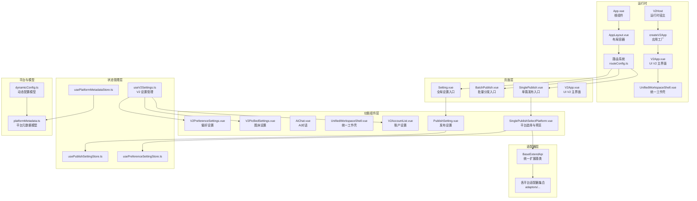

**图表来源**
- [src/App.vue:18-22](file://src/App.vue#L18-L22)
- [src/layouts/AppLayout.vue:10-23](file://src/layouts/AppLayout.vue#L10-L23)
- [src/routes/routeConfig.ts:42-151](file://src/routes/routeConfig.ts#L42-L151)
- [siyuan/v2/v2Host.ts:15-96](file://siyuan/v2/v2Host.ts#L15-L96)
- [src/v2/createV2App.ts:15-36](file://src/v2/createV2App.ts#L15-L36)
- [src/components/v2/V2App.vue:11-51](file://src/components/v2/V2App.vue#L11-L51)
- [src/components/v2/layout/UnifiedWorkspaceShell.vue:1-52](file://src/components/v2/layout/UnifiedWorkspaceShell.vue#L1-L52)
- [src/composables/v2/useV2Settings.ts:17-236](file://src/composables/v2/useV2Settings.ts#L17-L236)

**章节来源**
- [src/main.ts:10-21](file://src/main.ts#L10-L21)
- [src/bootstrap.ts:25-50](file://src/bootstrap.ts#L25-L50)
- [vite.config.ts:81-275](file://vite.config.ts#L81-L275)
- [vite.v2.config.ts:59-137](file://vite.v2.config.ts#L59-L137)

## 核心组件
- 应用入口与引导
  - 入口文件负责挂载 Vue 应用，并在引导阶段注册国际化、路由、状态管理与指令等。
  - 参考路径：[src/main.ts:10-21](file://src/main.ts#L10-L21)，[src/bootstrap.ts:25-50](file://src/bootstrap.ts#L25-L50)

- 根组件与布局
  - 根组件包裹布局容器，路由视图在布局内渲染，确保一致的导航与样式。
  - 参考路径：[src/App.vue:18-22](file://src/App.vue#L18-L22)，[src/layouts/AppLayout.vue:10-23](file://src/layouts/AppLayout.vue#L10-L23)

- 页面与路由
  - 路由表定义页面级组件，页面组件负责接收参数与初始化数据。
  - 参考路径：[src/routes/routeConfig.ts:42-151](file://src/routes/routeConfig.ts#L42-L151)，[src/pages/SinglePublish.vue:19-21](file://src/pages/SinglePublish.vue#L19-L21)

- 发布流程核心组件
  - 单篇发布选择平台组件负责筛选启用且已授权的平台，支持一键预览与跳转具体发布页。
  - 参考路径：[src/components/publish/SinglePublishSelectPlatform.vue:62-149](file://src/components/publish/SinglePublishSelectPlatform.vue#L62-L149)

- 状态管理（Pinia）
  - 平台元数据存储提供标签、分类、模板的读写与合并逻辑；发布设置与偏好设置分别管理平台配置与用户偏好。
  - **更新** V2 设置管理使用简化的 V2SettingsSection 类型，直接管理账户、图床和偏好设置。
  - 参考路径：[src/stores/usePlatformMetadataStore.ts:21-125](file://src/stores/usePlatformMetadataStore.ts#L21-L125)，[src/models/platformMetadata.ts:16-47](file://src/models/platformMetadata.ts#L16-L47)，[src/composables/v2/useV2Settings.ts:17-236](file://src/composables/v2/useV2Settings.ts#L17-L236)

- 平台与动态配置
  - 动态配置模型统一描述平台类型、子类型、授权模式、域名等；平台定义组合器提供平台类型与预设平台列表。
  - 参考路径：[src/platforms/dynamicConfig.ts:13-534](file://src/platforms/dynamicConfig.ts#L13-L534)，[src/composables/usePlatformDefine.ts:18-82](file://src/composables/usePlatformDefine.ts#L18-L82)

**章节来源**
- [src/main.ts:10-21](file://src/main.ts#L10-L21)
- [src/bootstrap.ts:25-50](file://src/bootstrap.ts#L25-L50)
- [src/App.vue:18-22](file://src/App.vue#L18-L22)
- [src/layouts/AppLayout.vue:10-23](file://src/layouts/AppLayout.vue#L10-L23)
- [src/routes/routeConfig.ts:42-151](file://src/routes/routeConfig.ts#L42-L151)
- [src/pages/SinglePublish.vue:19-21](file://src/pages/SinglePublish.vue#L19-L21)
- [src/components/publish/SinglePublishSelectPlatform.vue:62-149](file://src/components/publish/SinglePublishSelectPlatform.vue#L62-L149)
- [src/stores/usePlatformMetadataStore.ts:21-125](file://src/stores/usePlatformMetadataStore.ts#L21-L125)
- [src/models/platformMetadata.ts:16-47](file://src/models/platformMetadata.ts#L16-L47)
- [src/platforms/dynamicConfig.ts:13-534](file://src/platforms/dynamicConfig.ts#L13-L534)
- [src/composables/usePlatformDefine.ts:18-82](file://src/composables/usePlatformDefine.ts#L18-L82)
- [src/composables/v2/useV2Settings.ts:17-236](file://src/composables/v2/useV2Settings.ts#L17-L236)

## 架构总览
本项目采用 MVVM 架构：
- Model：平台元数据与动态配置模型，承载平台能力与发布偏好。
- View：Vue 组件树，页面组件负责场景化视图，功能组件负责复用能力，工具组件负责通用交互。
- ViewModel：通过 Pinia 管理状态，配合 Composables 提供跨组件的数据与行为抽象。
- 适配器层：统一扩展基类封装预处理、YAML、图片、外链替换等通用逻辑，屏蔽平台差异。

**更新** 新增简化的 UI V2 架构，统一工作壳布局系统采用直接的组件关系，移除了复杂的样式代码和中间层桥接。

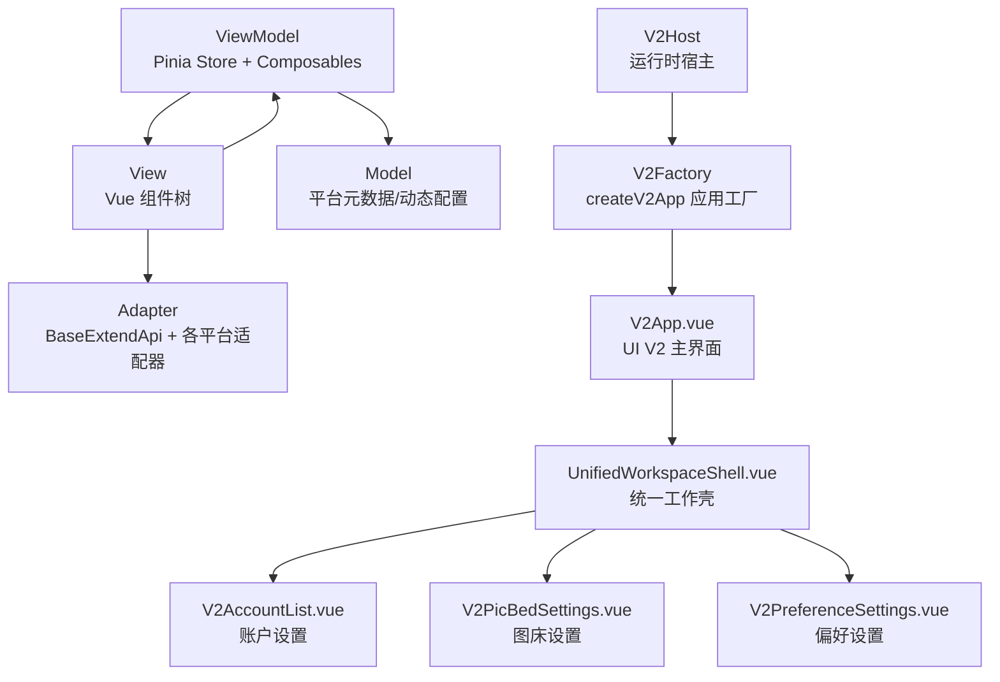

**图表来源**
- [src/adaptors/base/baseExtendApi.ts:55-739](file://src/adaptors/base/baseExtendApi.ts#L55-L739)
- [src/stores/usePlatformMetadataStore.ts:21-125](file://src/stores/usePlatformMetadataStore.ts#L21-L125)
- [src/platforms/dynamicConfig.ts:13-534](file://src/platforms/dynamicConfig.ts#L13-L534)
- [src/v2/createV2App.ts:15-36](file://src/v2/createV2App.ts#L15-L36)
- [siyuan/v2/v2Host.ts:15-96](file://siyuan/v2/v2Host.ts#L15-L96)
- [src/components/v2/V2App.vue:11-51](file://src/components/v2/V2App.vue#L11-L51)
- [src/components/v2/layout/UnifiedWorkspaceShell.vue:1-52](file://src/components/v2/layout/UnifiedWorkspaceShell.vue#L1-L52)
- [src/composables/v2/useV2Settings.ts:17-236](file://src/composables/v2/useV2Settings.ts#L17-L236)

## 详细组件分析

### 适配器模式与统一接口
- 设计理念
  - 通过统一扩展基类聚合平台共性：标题/摘要/分类/图片/YAML/外链等预处理，减少平台差异化代码重复。
  - 适配器按平台拆分，遵循"同一接口、多态实现"，便于新增平台与维护。
- 关键流程
  - 预处理：文件名规则、摘要同步、路径分类、图片上传/替换、Markdown 渲染、YAML 转换与回填。
  - 图片处理：支持外部环境代理与平台自带上传两种路径，自动识别宏/链接替换。
  - 外链替换：根据发布元信息生成预览链接，支持文件名规则替换。
- 数据流
  - 输入：Post（标题、摘要、分类、标签、Markdown、YAML、图片等）
  - 处理：按步骤流水线处理，逐步生成最终 HTML 与 YAML
  - 输出：标准化 Post 与预览 URL

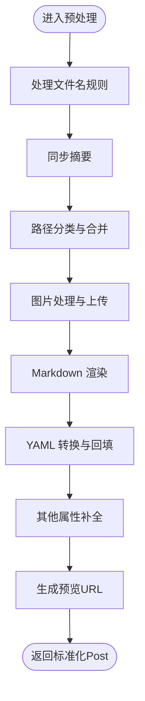

**图表来源**
- [src/adaptors/base/baseExtendApi.ts:90-106](file://src/adaptors/base/baseExtendApi.ts#L90-L106)
- [src/adaptors/base/baseExtendApi.ts:150-211](file://src/adaptors/base/baseExtendApi.ts#L150-L211)
- [src/adaptors/base/baseExtendApi.ts:221-229](file://src/adaptors/base/baseExtendApi.ts#L221-L229)
- [src/adaptors/base/baseExtendApi.ts:239-281](file://src/adaptors/base/baseExtendApi.ts#L239-L281)
- [src/adaptors/base/baseExtendApi.ts:291-327](file://src/adaptors/base/baseExtendApi.ts#L291-L327)
- [src/adaptors/base/baseExtendApi.ts:360-456](file://src/adaptors/base/baseExtendApi.ts#L360-L456)
- [src/adaptors/base/baseExtendApi.ts:466-596](file://src/adaptors/base/baseExtendApi.ts#L466-L596)
- [src/adaptors/base/baseExtendApi.ts:658-713](file://src/adaptors/base/baseExtendApi.ts#L658-L713)

**章节来源**
- [src/adaptors/base/baseExtendApi.ts:55-739](file://src/adaptors/base/baseExtendApi.ts#L55-L739)

### 页面组件与功能组件
- 页面组件
  - SinglePublish.vue：接收文档 ID，作为单篇发布的入口，将参数透传至平台选择组件。
  - 参考路径：[src/pages/SinglePublish.vue:19-21](file://src/pages/SinglePublish.vue#L19-L21)
- 功能组件
  - SinglePublishSelectPlatform.vue：筛选启用且已授权的平台，支持一键预览与跳转发布页，调用适配器获取配置与预览 URL。
  - 参考路径：[src/components/publish/SinglePublishSelectPlatform.vue:62-149](file://src/components/publish/SinglePublishSelectPlatform.vue#L62-L149)
- 工具组件
  - 布局容器 AppLayout.vue：统一布局骨架，保证页面一致性。
  - 参考路径：[src/layouts/AppLayout.vue:10-23](file://src/layouts/AppLayout.vue#L10-L23)

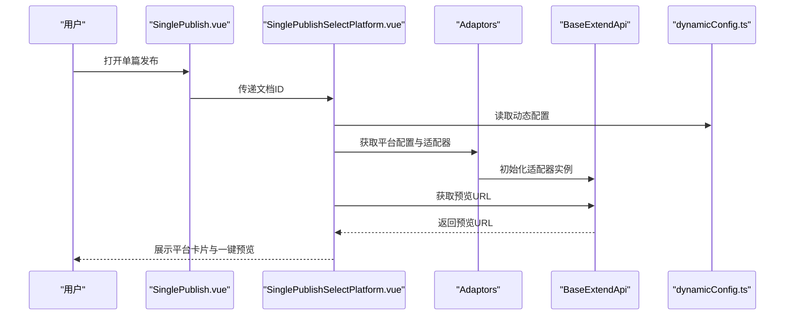

**图表来源**
- [src/pages/SinglePublish.vue:19-21](file://src/pages/SinglePublish.vue#L19-L21)
- [src/components/publish/SinglePublishSelectPlatform.vue:62-149](file://src/components/publish/SinglePublishSelectPlatform.vue#L62-L149)
- [src/platforms/dynamicConfig.ts:13-534](file://src/platforms/dynamicConfig.ts#L13-L534)
- [src/adaptors/base/baseExtendApi.ts:55-739](file://src/adaptors/base/baseExtendApi.ts#L55-L739)

**章节来源**
- [src/pages/SinglePublish.vue:19-21](file://src/pages/SinglePublish.vue#L19-L21)
- [src/components/publish/SinglePublishSelectPlatform.vue:62-149](file://src/components/publish/SinglePublishSelectPlatform.vue#L62-L149)
- [src/layouts/AppLayout.vue:10-23](file://src/layouts/AppLayout.vue#L10-L23)

### 状态管理（Pinia）
- 平台元数据存储
  - 提供读写与只读访问，支持标签、分类、模板的去重合并更新。
  - 参考路径：[src/stores/usePlatformMetadataStore.ts:21-125](file://src/stores/usePlatformMetadataStore.ts#L21-L125)，[src/models/platformMetadata.ts:16-47](file://src/models/platformMetadata.ts#L16-L47)
- 动态配置与平台定义
  - 动态配置模型统一描述平台类型、子类型、授权模式、域名等；平台定义组合器提供平台类型与预设平台列表。
  - **更新** V2 设置管理使用简化的 V2SettingsSection 类型，直接管理账户、图床和偏好设置。
  - 参考路径：[src/platforms/dynamicConfig.ts:13-534](file://src/platforms/dynamicConfig.ts#L13-L534)，[src/composables/usePlatformDefine.ts:18-82](file://src/composables/usePlatformDefine.ts#L18-L82)，[src/composables/v2/useV2Settings.ts:17-236](file://src/composables/v2/useV2Settings.ts#L17-L236)

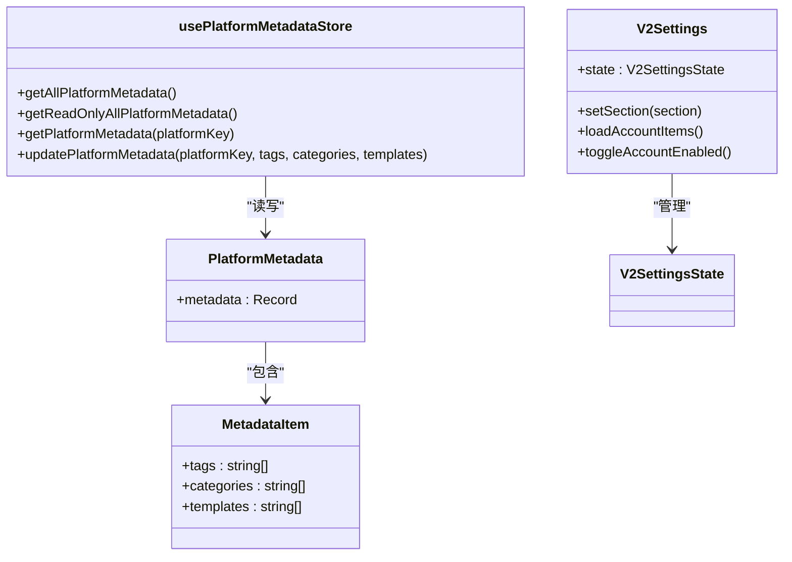

**图表来源**
- [src/models/platformMetadata.ts:16-47](file://src/models/platformMetadata.ts#L16-L47)
- [src/stores/usePlatformMetadataStore.ts:21-125](file://src/stores/usePlatformMetadataStore.ts#L21-L125)
- [src/composables/v2/useV2Settings.ts:17-236](file://src/composables/v2/useV2Settings.ts#L17-L236)

**章节来源**
- [src/stores/usePlatformMetadataStore.ts:21-125](file://src/stores/usePlatformMetadataStore.ts#L21-L125)
- [src/models/platformMetadata.ts:16-47](file://src/models/platformMetadata.ts#L16-L47)
- [src/platforms/dynamicConfig.ts:13-534](file://src/platforms/dynamicConfig.ts#L13-L534)
- [src/composables/usePlatformDefine.ts:18-82](file://src/composables/usePlatformDefine.ts#L18-L82)
- [src/composables/v2/useV2Settings.ts:17-236](file://src/composables/v2/useV2Settings.ts#L17-L236)

### 技术栈选择与优势
- Vue 3
  - 组合式 API 提升逻辑复用与可测试性；响应式系统与编译优化带来良好性能。
- TypeScript
  - 强类型约束降低运行期风险，提升大型项目的可维护性。
- Vite
  - 构建速度快、热更新体验佳；插件生态完善，利于按需引入与自动导入。
- Pinia
  - 轻量、TypeScript 友好、模块化强，适合复杂状态管理与团队协作。

**更新** 新增简化的 UI V2 架构下的应用工厂模式，提供更灵活的 Vue 应用创建方式和直接的组件关系。

**章节来源**
- [package.json:29-96](file://package.json#L29-L96)
- [vite.config.ts:81-275](file://vite.config.ts#L81-L275)
- [src/bootstrap.ts:34-40](file://src/bootstrap.ts#L34-L40)
- [src/v2/createV2App.ts:15-36](file://src/v2/createV2App.ts#L15-L36)

## UI V2 架构设计

### 简化的统一工作壳布局系统
**更新** UI V2 架构引入了简化的统一工作壳布局系统，移除了复杂的 Stylus 样式代码：

- **直接组件关系**：设置页面组件直接绑定到统一工作壳，无需中间层桥接
- **简化的样式结构**：采用 CSS Grid 替代复杂的 Stylus 变量和混入
- **通用类型定义**：使用 V2SettingsSection 类型统一管理设置区域
- **清晰的布局网格**：快速发布模式使用单列网格，设置模式使用导航+主内容双列网格

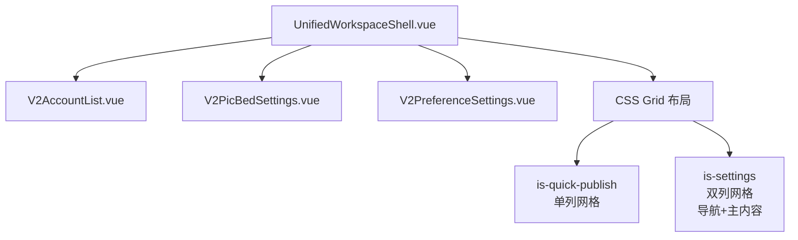

**图表来源**
- [src/components/v2/layout/UnifiedWorkspaceShell.vue:1-52](file://src/components/v2/layout/UnifiedWorkspaceShell.vue#L1-L52)
- [src/assets/v2/base.styl:192-250](file://src/assets/v2/base.styl#L192-L250)
- [src/composables/v2/useV2Settings.ts:17-236](file://src/composables/v2/useV2Settings.ts#L17-L236)

### V2 设置管理简化
**更新** V2 设置管理采用简化的类型定义和直接的状态管理：

- **通用设置类型**：V2SettingsSection 类型统一管理 account、picbed、preference 三个设置区域
- **直接状态绑定**：设置页面直接绑定到统一工作壳的 activeSection 属性
- **简化的事件处理**：通过 change-section 事件直接切换设置区域
- **移除复杂桥接**：不再需要中间层组件桥接，组件关系更加直接

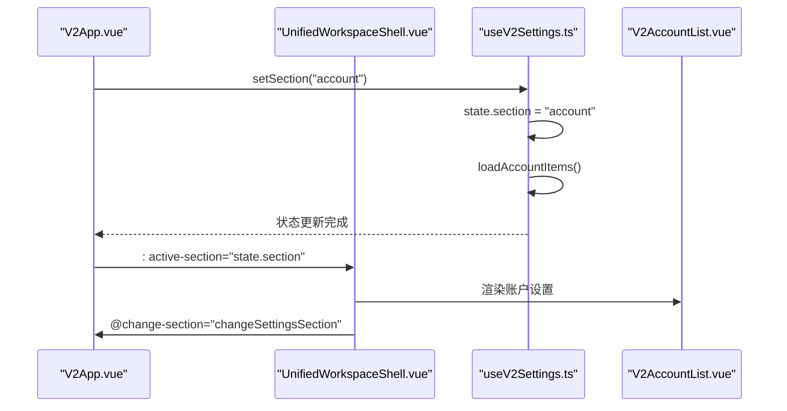

**图表来源**
- [src/components/v2/V2App.vue:279-281](file://src/components/v2/V2App.vue#L279-L281)
- [src/components/v2/layout/UnifiedWorkspaceShell.vue:35-48](file://src/components/v2/layout/UnifiedWorkspaceShell.vue#L35-L48)
- [src/composables/v2/useV2Settings.ts:126-134](file://src/composables/v2/useV2Settings.ts#L126-L134)

### Vue.js 应用工厂模式
UI V2 架构引入了现代化的应用工厂模式，通过 `createV2VueApp` 函数提供灵活的 Vue 应用创建能力：

- **应用工厂函数**：`createV2VueApp` 接受配置选项，包括初始视图、语言环境和消息配置
- **国际化集成**：内置 vue-i18n 支持，使用插件语言环境和动态消息配置
- **状态管理**：自动集成 Pinia 状态管理
- **生命周期管理**：提供关闭回调机制，确保资源正确释放

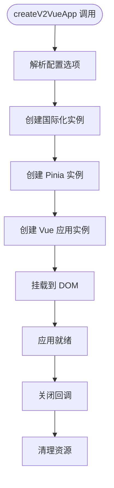

**图表来源**
- [src/v2/createV2App.ts:15-36](file://src/v2/createV2App.ts#L15-L36)

### V2 运行时宿主系统
基于思源原生 Menu 系统的运行时宿主提供了完整的 UI V2 承载能力：

- **宿主类设计**：`V2Host` 类封装了整个 UI V2 的生命周期管理
- **DOM 挂载**：使用思源原生 Menu 创建真实 DOM 元素进行挂载
- **响应式定位**：根据设备类型和锚点元素自动调整菜单位置
- **资源管理**：提供完整的应用卸载和资源清理机制

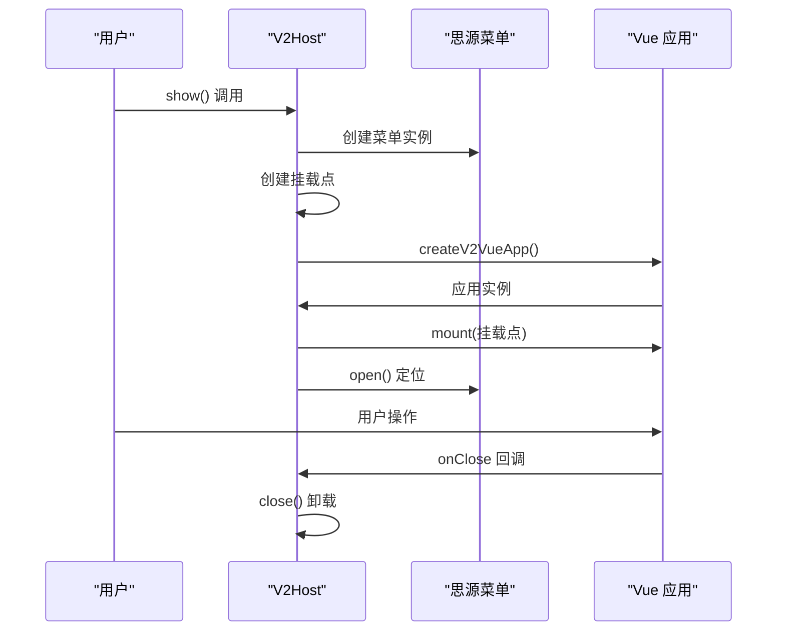

**图表来源**
- [siyuan/v2/v2Host.ts:26-59](file://siyuan/v2/v2Host.ts#L26-L59)

**章节来源**
- [src/v2/createV2App.ts:15-36](file://src/v2/createV2App.ts#L15-L36)
- [siyuan/v2/v2Host.ts:15-96](file://siyuan/v2/v2Host.ts#L15-L96)
- [src/components/v2/layout/UnifiedWorkspaceShell.vue:1-52](file://src/components/v2/layout/UnifiedWorkspaceShell.vue#L1-L52)
- [src/composables/v2/useV2Settings.ts:17-236](file://src/composables/v2/useV2Settings.ts#L17-L236)

## Vite 配置系统

### 独立的 Vite V2 配置
项目引入了独立的 Vite V2 配置文件，专门用于 UI V2 架构的构建：

- **专用构建目标**：针对 UI V2 的特定需求进行优化
- **静态资源复制**：自动复制插件元数据和国际化文件
- **外部依赖处理**：将思源框架标记为外部依赖，避免重复打包
- **开发热更新**：支持静态资源的实时监听和重新构建

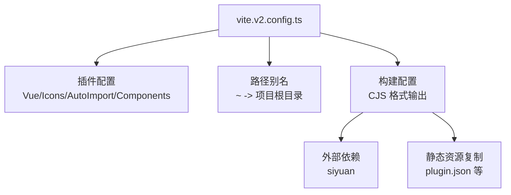

**图表来源**
- [vite.v2.config.ts:59-137](file://vite.v2.config.ts#L59-L137)

### 多配置策略
项目采用多配置策略，区分不同构建目标：

- **主配置**：`vite.config.ts` - 传统插件构建
- **V2 配置**：`vite.v2.config.ts` - UI V2 架构构建
- **构建脚本**：通过不同的命令区分构建目标

**章节来源**
- [vite.v2.config.ts:59-137](file://vite.v2.config.ts#L59-L137)
- [package.json:9-31](file://package.json#L9-L31)

## 样式系统

### 简化的 V2 UI 样式架构
**更新** UI V2 引入了简化的样式系统，移除了复杂的 Stylus 代码：

- **CSS Grid 替代**：使用原生 CSS Grid 替代复杂的 Stylus 布局计算
- **简化的命名空间**：所有样式都包裹在 `.syp-v2` 命名空间下
- **移除复杂变量**：不再使用 Stylus 变量和混入，采用直接的 CSS 定义
- **响应式设计**：支持桌面端和移动端的自适应布局

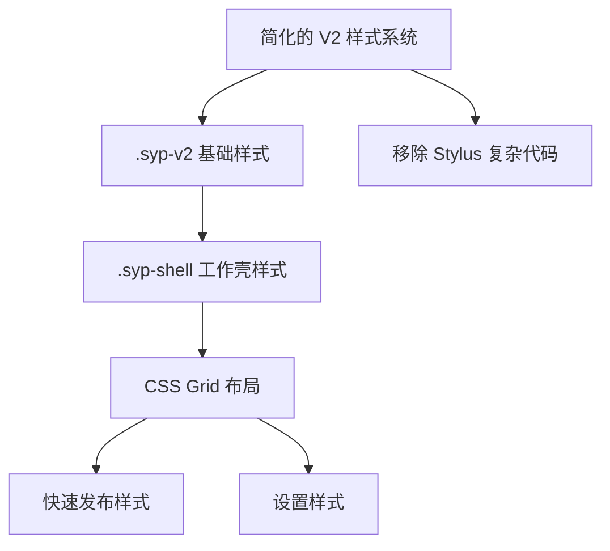

**图表来源**
- [src/assets/v2/base.styl:192-250](file://src/assets/v2/base.styl#L192-L250)
- [src/assets/v2/variables.styl:1-58](file://src/assets/v2/variables.styl#L1-58)

### 统一工作壳的样式优化
**更新** 统一工作壳采用简化的样式结构：

- **网格布局**：使用 CSS Grid 实现快速发布和设置模式的布局切换
- **直接样式绑定**：通过 `is-quick-publish` 和 `is-settings` 类名直接切换布局
- **移除复杂混入**：不再使用 Stylus 混入，采用直接的 CSS 属性定义
- **响应式适配**：在小屏幕设备上自动切换为单列布局

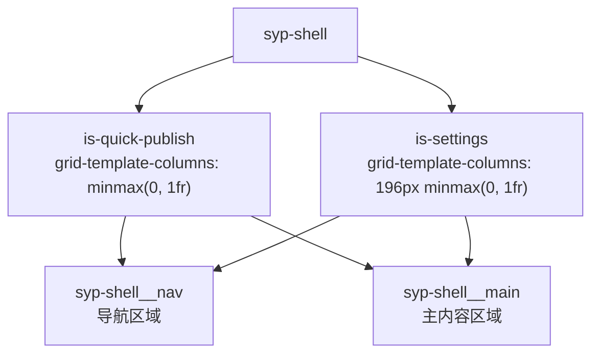

**图表来源**
- [src/assets/v2/base.styl:192-250](file://src/assets/v2/base.styl#L192-L250)

### 主题设计系统
V2 样式系统采用了简化的主题设计：

- **基础变量**：保留必要的 CSS 变量定义，移除复杂的 Stylus 变量系统
- **简化的色彩体系**：主色调、中性色、状态色的直接定义
- **间距和圆角系统**：基于 CSS 变量的基础间距和圆角定义
- **移除复杂混入**：不再使用 Stylus 混入函数，采用直接的样式定义

**章节来源**
- [src/assets/v2/base.styl:192-435](file://src/assets/v2/base.styl#L192-L435)
- [src/assets/v2/variables.styl:1-58](file://src/assets/v2/variables.styl#L1-58)

## 里程碑式开发策略

### UI V2 生命周期规划
UI V2 架构采用里程碑式开发策略，确保渐进式演进和质量控制：

- **里程碑 0**：基础入口建设，包括 V2 切换开关、运行时宿主引导、单一偏好配置源和安全回滚路径
- **里程碑 1**：工作壳布局系统，包含统一工作壳、快速发布和设置模式的不同显示状态
- **后续里程碑**：逐步完善各功能模块，保持每个里程碑的验收标准

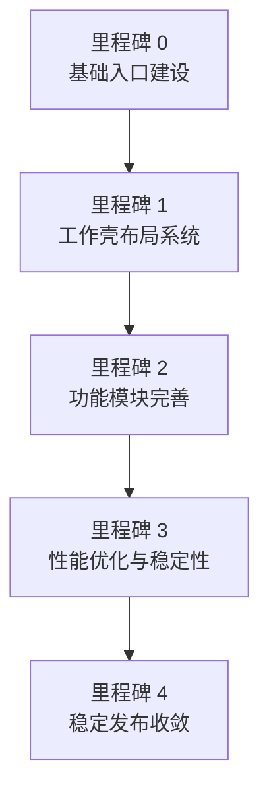

**图表来源**
- [openspec/changes/refactor-ui-v2-foundation/specs/ui-v2-migration/spec.md:25-44](file://openspec/changes/refactor-ui-v2-foundation/specs/ui-v2-migration/spec.md#L25-L44)

### 实现原则
- **顺序推进**：严格按里程碑顺序执行，前一个里程碑未验收不得开始后续里程碑
- **统一工作壳**：快速发布和完整设置工作流必须是同一工作壳的不同显示状态
- **DOM 真实挂载**：新 V2 功能必须使用真实 DOM 挂载，避免引入新的 iframe 运行时
- **配置共享**：V2 和传统入口必须共享单一偏好配置源
- **简化设计**：移除复杂代码，采用更直接的组件关系和类型定义

**章节来源**
- [openspec/changes/refactor-ui-v2-foundation/specs/ui-v2-migration/spec.md:14-104](file://openspec/changes/refactor-ui-v2-foundation/specs/ui-v2-migration/spec.md#L14-L104)

## 依赖分析
- 构建与打包
  - Vite 配置启用按需引入、自动导入、HTML 注入与 Node polyfills，支持多构建目标（插件、Widget、Nginx、V2）。
- 运行时依赖
  - Vue 3、Pinia、Vue Router、Element Plus、国际化、fetch、XMLRPC、Markdown 解析与渲染等。
- 适配器与平台
  - 通过统一扩展基类与动态配置模型，屏蔽平台差异，支持20+平台的统一接入。
- **更新** UI V2 依赖
  - 简化的应用工厂和运行时宿主系统，提供现代化的用户界面体验
  - 移除复杂样式依赖，采用简化的 CSS Grid 布局

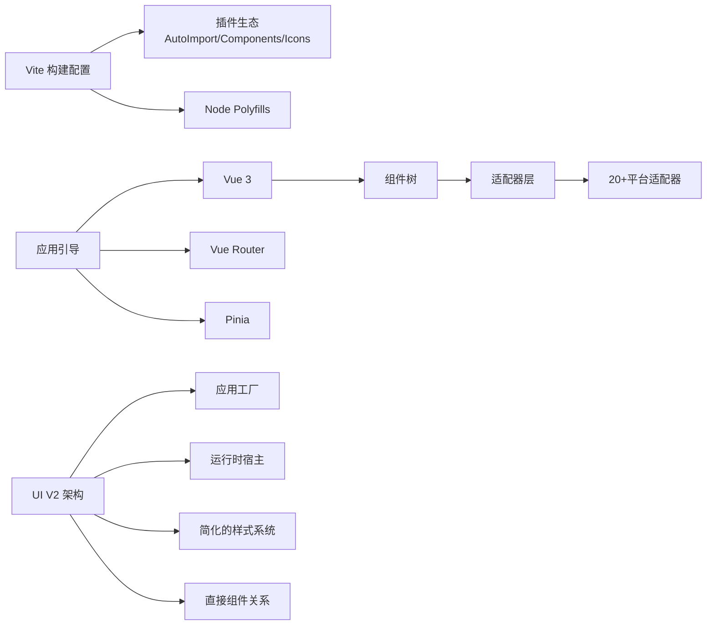

**图表来源**
- [vite.config.ts:81-275](file://vite.config.ts#L81-L275)
- [src/bootstrap.ts:25-50](file://src/bootstrap.ts#L25-L50)
- [src/v2/createV2App.ts:15-36](file://src/v2/createV2App.ts#L15-L36)
- [siyuan/v2/v2Host.ts:15-96](file://siyuan/v2/v2Host.ts#L15-L96)

**章节来源**
- [vite.config.ts:81-275](file://vite.config.ts#L81-L275)
- [package.json:29-96](file://package.json#L29-L96)
- [src/bootstrap.ts:25-50](file://src/bootstrap.ts#L25-L50)
- [src/v2/createV2App.ts:15-36](file://src/v2/createV2App.ts#L15-L36)
- [siyuan/v2/v2Host.ts:15-96](file://siyuan/v2/v2Host.ts#L15-L96)

## 性能考量
- 构建优化
  - 按需引入与自动导入减少包体；手动分包策略将第三方依赖拆分为 vendor_*，提升缓存命中率。
  - 非开发模式启用压缩与资源版本戳注入，避免缓存问题。
  - **更新** V2 架构采用独立配置，避免与主应用的资源冲突。
- 运行时优化
  - 组件懒加载与路由按需加载；图片与资源延迟加载；Pinia 状态按模块化拆分，避免全局污染。
  - **更新** UI V2 应用工厂提供按需创建，减少不必要的初始化开销。
  - **更新** 简化的样式系统减少 CSS 生成和渲染开销。
- 适配器性能
  - 图片上传采用批量处理与宏/链接替换策略，减少重复请求；外链替换一次性扫描与替换，避免多次渲染。
- **更新** 组件关系优化
  - 移除中间层桥接，直接的组件关系减少渲染层级和通信开销

**更新** 新增 UI V2 架构的性能考量，包括应用工厂的按需创建、简化的样式系统和直接的组件关系。

**章节来源**
- [vite.config.ts:197-256](file://vite.config.ts#L197-L256)
- [vite.config.ts:238-253](file://vite.config.ts#L238-L253)
- [src/adaptors/base/baseExtendApi.ts:466-596](file://src/adaptors/base/baseExtendApi.ts#L466-L596)
- [src/v2/createV2App.ts:15-36](file://src/v2/createV2App.ts#L15-L36)
- [src/assets/v2/base.styl:192-250](file://src/assets/v2/base.styl#L192-L250)

## 故障排查指南
- 图片上传失败
  - 检查平台图片上传能力与宏模式兼容性；关注错误日志中的忽略错误标识，必要时切换上传策略或平台。
  - 参考路径：[src/adaptors/base/baseExtendApi.ts:535-551](file://src/adaptors/base/baseExtendApi.ts#L535-L551)
- 外链引用未发布
  - 若引用的文档尚未发布，将触发异常；可在偏好设置中配置忽略块链接策略。
  - 参考路径：[src/adaptors/base/baseExtendApi.ts:684-689](file://src/adaptors/base/baseExtendApi.ts#L684-L689)
- 预览链接为空或不正确
  - 确认平台已授权与文章已发布；检查动态配置中的预览 URL 规则与文件名替换逻辑。
  - 参考路径：[src/components/publish/SinglePublishSelectPlatform.vue:86-122](file://src/components/publish/SinglePublishSelectPlatform.vue#L86-L122)，[src/adaptors/base/baseExtendApi.ts:696-708](file://src/adaptors/base/baseExtendApi.ts#L696-L708)
- **更新** UI V2 应用无法显示
  - 检查 V2 应用工厂是否正确创建；确认运行时宿主的菜单创建和挂载过程；验证样式文件是否正确加载。
  - 参考路径：[src/v2/createV2App.ts:15-36](file://src/v2/createV2App.ts#L15-L36)，[siyuan/v2/v2Host.ts:26-59](file://siyuan/v2/v2Host.ts#L26-L59)
- **更新** 统一工作壳布局问题
  - 检查 CSS Grid 布局是否正确应用；确认 is-quick-publish 和 is-settings 类名切换；验证响应式布局在小屏幕设备上的表现。
  - 参考路径：[src/assets/v2/base.styl:192-250](file://src/assets/v2/base.styl#L192-L250)，[src/components/v2/layout/UnifiedWorkspaceShell.vue:39-48](file://src/components/v2/layout/UnifiedWorkspaceShell.vue#L39-L48)

**更新** 新增 UI V2 架构相关的故障排查指导，包括统一工作壳布局问题。

**章节来源**
- [src/adaptors/base/baseExtendApi.ts:535-551](file://src/adaptors/base/baseExtendApi.ts#L535-L551)
- [src/adaptors/base/baseExtendApi.ts:684-689](file://src/adaptors/base/baseExtendApi.ts#L684-L689)
- [src/components/publish/SinglePublishSelectPlatform.vue:86-122](file://src/components/publish/SinglePublishSelectPlatform.vue#L86-L122)
- [src/v2/createV2App.ts:15-36](file://src/v2/createV2App.ts#L15-L36)
- [siyuan/v2/v2Host.ts:26-59](file://siyuan/v2/v2Host.ts#L26-L59)
- [src/assets/v2/base.styl:192-250](file://src/assets/v2/base.styl#L192-L250)
- [src/components/v2/layout/UnifiedWorkspaceShell.vue:39-48](file://src/components/v2/layout/UnifiedWorkspaceShell.vue#L39-L48)

## 结论
本项目以 Vue 3 + TypeScript + Vite 为基础，结合 Pinia 状态管理与统一适配器模式，实现了对20+平台的一致化接入与高扩展性。**更新版本**通过引入简化的 UI V2 架构，包括简化的统一工作壳布局系统、直接的组件关系和简化的样式系统，进一步提升了用户体验和技术架构的现代化水平。

通过移除复杂的 Stylus 代码和中间层桥接，采用 CSS Grid 布局和通用的 V2SettingsSection 类型，既保证了开发效率，也显著提升了运行时性能与可维护性。**简化的 UI V2 架构**为未来的功能扩展和界面优化奠定了更加坚实的基础，建议在后续迭代中持续优化组件间的通信机制和状态管理策略，进一步增强跨平台一致性与用户体验。

## 附录
- 构建与运行
  - 开发：通过脚本启动本地服务与热更新。
  - 构建：支持多目标输出（插件、Widget、Nginx、V2），并提供按需引入与分包策略。
  - **更新** V2 架构构建：使用独立的 Vite 配置文件进行 UI V2 的专门构建。
- 路由与页面
  - 路由表覆盖极速发布、常规发布、批量分发、设置、测试等场景，页面组件负责参数接收与初始化。
  - **更新** UI V2 主界面：提供现代化的用户界面体验，采用简化的统一工作壳布局。
- 平台与动态配置
  - 动态配置模型涵盖平台类型、子类型、授权模式、域名等，平台定义组合器提供平台类型与预设平台列表。
- **更新** UI V2 架构
  - 应用工厂模式：提供灵活的 Vue 应用创建能力
  - 运行时宿主系统：基于思源原生菜单的 DOM 挂载
  - 统一工作壳布局：采用简化的 CSS Grid 布局，移除复杂 Stylus 代码
  - 直接组件关系：设置页面直接绑定到统一工作壳，无需中间层桥接
  - 通用类型定义：使用 V2SettingsSection 类型统一管理设置区域
  - 简化样式系统：移除复杂变量和混入，采用直接的 CSS 定义
  - 里程碑式开发：确保渐进式演进和质量控制

**章节来源**
- [package.json:9-27](file://package.json#L9-L27)
- [vite.config.ts:15-76](file://vite.config.ts#L15-L76)
- [src/routes/routeConfig.ts:42-151](file://src/routes/routeConfig.ts#L42-L151)
- [src/platforms/dynamicConfig.ts:13-534](file://src/platforms/dynamicConfig.ts#L13-L534)
- [src/composables/usePlatformDefine.ts:18-82](file://src/composables/usePlatformDefine.ts#L18-L82)
- [src/v2/createV2App.ts:15-36](file://src/v2/createV2App.ts#L15-L36)
- [siyuan/v2/v2Host.ts:15-96](file://siyuan/v2/v2Host.ts#L15-L96)
- [src/assets/v2/base.styl:192-435](file://src/assets/v2/base.styl#L192-L435)
- [src/composables/v2/useV2Settings.ts:17-236](file://src/composables/v2/useV2Settings.ts#L17-L236)
- [openspec/changes/refactor-ui-v2-foundation/specs/ui-v2-migration/spec.md:1-191](file://openspec/changes/refactor-ui-v2-foundation/specs/ui-v2-migration/spec.md#L1-L191)