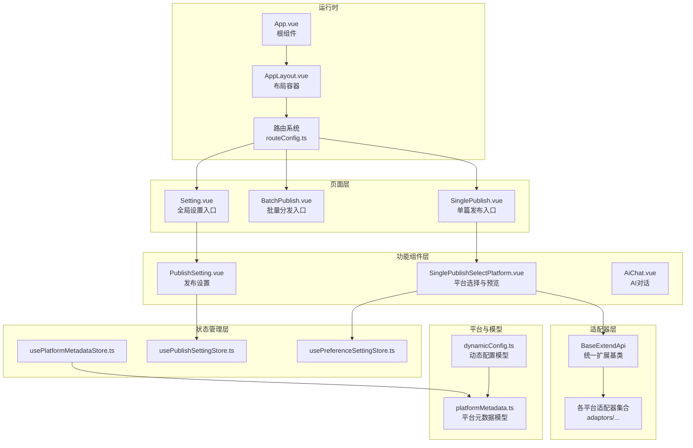
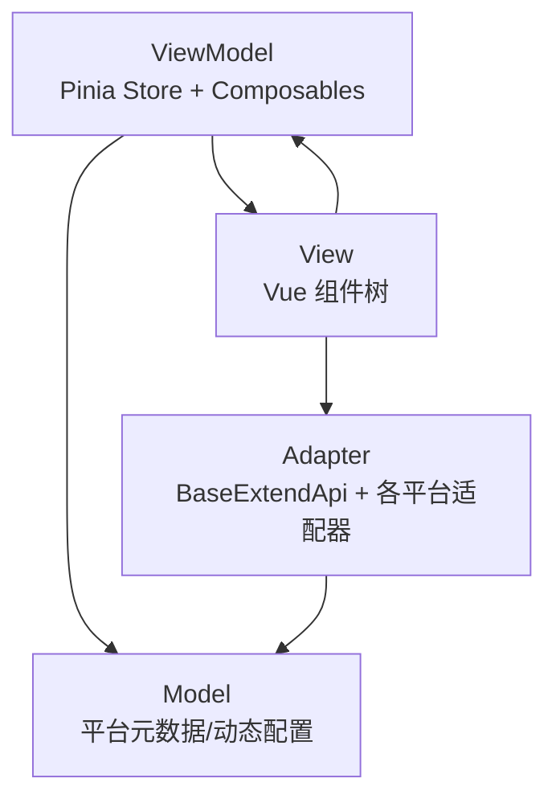
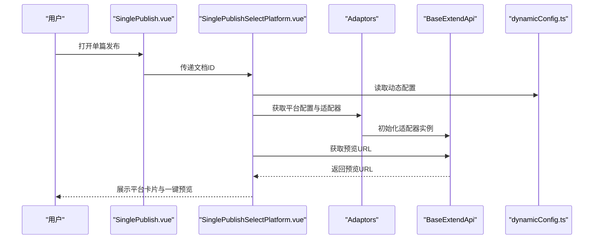
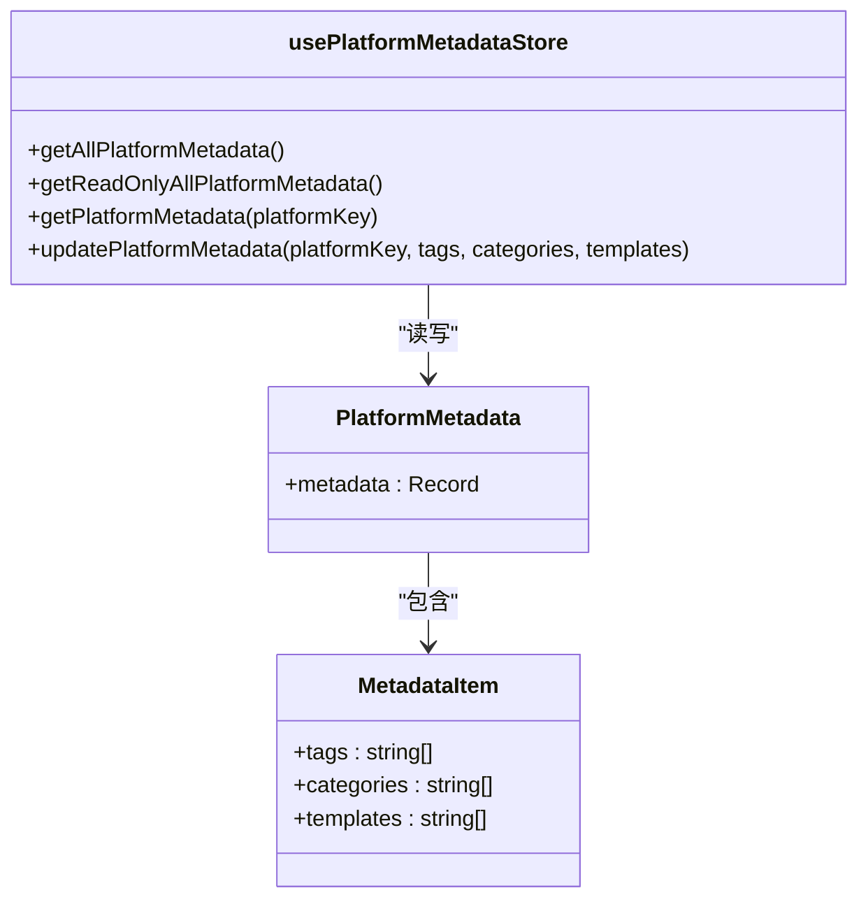
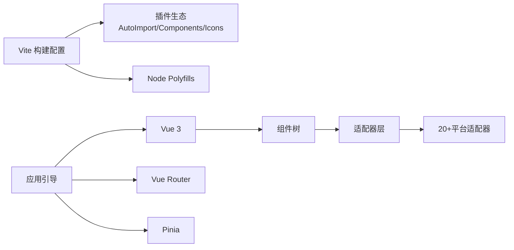

# 核心架构

<cite>
**本文档引用的文件**
- [package.json](file://package.json)
- [vite.config.ts](file://vite.config.ts)
- [src/main.ts](file://src/main.ts)
- [src/bootstrap.ts](file://src/bootstrap.ts)
- [src/App.vue](file://src/App.vue)
- [src/layouts/AppLayout.vue](file://src/layouts/AppLayout.vue)
- [src/routes/routeConfig.ts](file://src/routes/routeConfig.ts)
- [src/pages/SinglePublish.vue](file://src/pages/SinglePublish.vue)
- [src/components/publish/SinglePublishSelectPlatform.vue](file://src/components/publish/SinglePublishSelectPlatform.vue)
- [src/adaptors/base/baseExtendApi.ts](file://src/adaptors/base/baseExtendApi.ts)
- [src/stores/usePlatformMetadataStore.ts](file://src/stores/usePlatformMetadataStore.ts)
- [src/models/platformMetadata.ts](file://src/models/platformMetadata.ts)
- [src/composables/usePlatformDefine.ts](file://src/composables/usePlatformDefine.ts)
- [src/platforms/dynamicConfig.ts](file://src/platforms/dynamicConfig.ts)
</cite>

## 目录
1. [引言](#引言)
2. [项目结构](#项目结构)
3. [核心组件](#核心组件)
4. [架构总览](#架构总览)
5. [详细组件分析](#详细组件分析)
6. [依赖分析](#依赖分析)
7. [性能考量](#性能考量)
8. [故障排查指南](#故障排查指南)
9. [结论](#结论)
10. [附录](#附录)

## 引言
本文件面向“思源笔记发布器插件”的核心架构文档，聚焦MVVM架构设计、Vue 3 + TypeScript + Vite 技术栈选择与优势、适配器模式统一接入20+平台、组件化设计原则（页面组件、功能组件、工具组件）、状态管理（Pinia）以及系统边界与数据流。文档同时提供可视化图示与实践建议，帮助开发者快速理解并高效扩展。

## 项目结构
该工程采用“页面-组件-适配器-模型-状态”分层组织方式，前端入口通过 Vite 构建，运行时由 Vue 3 应用承载，路由驱动页面切换，组件负责视图与交互，适配器屏蔽平台差异，状态管理集中于 Pinia，平台元数据与动态配置贯穿全链路。

图表来源
- [src/App.vue:18-22](file://src/App.vue#L18-L22)
- [src/layouts/AppLayout.vue:10-23](file://src/layouts/AppLayout.vue#L10-L23)
- [src/routes/routeConfig.ts:42-151](file://src/routes/routeConfig.ts#L42-L151)
- [src/pages/SinglePublish.vue:19-21](file://src/pages/SinglePublish.vue#L19-L21)
- [src/components/publish/SinglePublishSelectPlatform.vue:10-272](file://src/components/publish/SinglePublishSelectPlatform.vue#L10-L272)
- [src/adaptors/base/baseExtendApi.ts:55-739](file://src/adaptors/base/baseExtendApi.ts#L55-L739)
- [src/stores/usePlatformMetadataStore.ts:21-125](file://src/stores/usePlatformMetadataStore.ts#L21-L125)
- [src/platforms/dynamicConfig.ts:13-534](file://src/platforms/dynamicConfig.ts#L13-L534)
- [src/models/platformMetadata.ts:16-47](file://src/models/platformMetadata.ts#L16-L47)

章节来源
- [src/main.ts:10-21](file://src/main.ts#L10-L21)
- [src/bootstrap.ts:25-50](file://src/bootstrap.ts#L25-L50)
- [vite.config.ts:81-275](file://vite.config.ts#L81-L275)

## 核心组件
- 应用入口与引导
  - 入口文件负责挂载 Vue 应用，并在引导阶段注册国际化、路由、状态管理与指令等。
  - 参考路径：[src/main.ts:10-21](file://src/main.ts#L10-L21)，[src/bootstrap.ts:25-50](file://src/bootstrap.ts#L25-L50)

- 根组件与布局
  - 根组件包裹布局容器，路由视图在布局内渲染，确保一致的导航与样式。
  - 参考路径：[src/App.vue:18-22](file://src/App.vue#L18-L22)，[src/layouts/AppLayout.vue:10-23](file://src/layouts/AppLayout.vue#L10-L23)

- 页面与路由
  - 路由表定义页面级组件，页面组件负责接收参数与初始化数据。
  - 参考路径：[src/routes/routeConfig.ts:42-151](file://src/routes/routeConfig.ts#L42-L151)，[src/pages/SinglePublish.vue:19-21](file://src/pages/SinglePublish.vue#L19-L21)

- 发布流程核心组件
  - 单篇发布选择平台组件负责筛选启用且已授权的平台，支持一键预览与跳转具体发布页。
  - 参考路径：[src/components/publish/SinglePublishSelectPlatform.vue:62-149](file://src/components/publish/SinglePublishSelectPlatform.vue#L62-L149)

- 状态管理（Pinia）
  - 平台元数据存储提供标签、分类、模板的读写与合并逻辑；发布设置与偏好设置分别管理平台配置与用户偏好。
  - 参考路径：[src/stores/usePlatformMetadataStore.ts:21-125](file://src/stores/usePlatformMetadataStore.ts#L21-L125)，[src/models/platformMetadata.ts:16-47](file://src/models/platformMetadata.ts#L16-L47)

- 平台与动态配置
  - 动态配置模型统一描述平台类型、子类型、授权模式、域名等；平台定义组合器提供平台类型与预设平台列表。
  - 参考路径：[src/platforms/dynamicConfig.ts:13-534](file://src/platforms/dynamicConfig.ts#L13-L534)，[src/composables/usePlatformDefine.ts:18-82](file://src/composables/usePlatformDefine.ts#L18-L82)

章节来源
- [src/main.ts:10-21](file://src/main.ts#L10-L21)
- [src/bootstrap.ts:25-50](file://src/bootstrap.ts#L25-L50)
- [src/App.vue:18-22](file://src/App.vue#L18-L22)
- [src/layouts/AppLayout.vue:10-23](file://src/layouts/AppLayout.vue#L10-L23)
- [src/routes/routeConfig.ts:42-151](file://src/routes/routeConfig.ts#L42-L151)
- [src/pages/SinglePublish.vue:19-21](file://src/pages/SinglePublish.vue#L19-L21)
- [src/components/publish/SinglePublishSelectPlatform.vue:62-149](file://src/components/publish/SinglePublishSelectPlatform.vue#L62-L149)
- [src/stores/usePlatformMetadataStore.ts:21-125](file://src/stores/usePlatformMetadataStore.ts#L21-L125)
- [src/models/platformMetadata.ts:16-47](file://src/models/platformMetadata.ts#L16-L47)
- [src/platforms/dynamicConfig.ts:13-534](file://src/platforms/dynamicConfig.ts#L13-L534)
- [src/composables/usePlatformDefine.ts:18-82](file://src/composables/usePlatformDefine.ts#L18-L82)

## 架构总览
本项目采用 MVVM 架构：
- Model：平台元数据与动态配置模型，承载平台能力与发布偏好。
- View：Vue 组件树，页面组件负责场景化视图，功能组件负责复用能力，工具组件负责通用交互。
- ViewModel：通过 Pinia 管理状态，配合 Composables 提供跨组件的数据与行为抽象。
- 适配器层：统一扩展基类封装预处理、YAML、图片、外链替换等通用逻辑，屏蔽平台差异。

图表来源
- [src/adaptors/base/baseExtendApi.ts:55-739](file://src/adaptors/base/baseExtendApi.ts#L55-L739)
- [src/stores/usePlatformMetadataStore.ts:21-125](file://src/stores/usePlatformMetadataStore.ts#L21-L125)
- [src/platforms/dynamicConfig.ts:13-534](file://src/platforms/dynamicConfig.ts#L13-L534)

## 详细组件分析

### 适配器模式与统一接口
- 设计理念
  - 通过统一扩展基类聚合平台共性：标题/摘要/分类/图片/YAML/外链等预处理，减少平台差异化代码重复。
  - 适配器按平台拆分，遵循“同一接口、多态实现”，便于新增平台与维护。
- 关键流程
  - 预处理：文件名规则、摘要同步、路径分类、图片上传/替换、Markdown 渲染、YAML 转换与回填。
  - 图片处理：支持外部环境代理与平台自带上传两种路径，自动识别宏/链接替换。
  - 外链替换：根据发布元信息生成预览链接，支持文件名规则替换。
- 数据流
  - 输入：Post（标题、摘要、分类、标签、Markdown、YAML、图片等）
  - 处理：按步骤流水线处理，逐步生成最终 HTML 与 YAML
  - 输出：标准化 Post 与预览 URL

图表来源
- [src/adaptors/base/baseExtendApi.ts:90-106](file://src/adaptors/base/baseExtendApi.ts#L90-L106)
- [src/adaptors/base/baseExtendApi.ts:150-211](file://src/adaptors/base/baseExtendApi.ts#L150-L211)
- [src/adaptors/base/baseExtendApi.ts:221-229](file://src/adaptors/base/baseExtendApi.ts#L221-L229)
- [src/adaptors/base/baseExtendApi.ts:239-281](file://src/adaptors/base/baseExtendApi.ts#L239-L281)
- [src/adaptors/base/baseExtendApi.ts:291-327](file://src/adaptors/base/baseExtendApi.ts#L291-L327)
- [src/adaptors/base/baseExtendApi.ts:360-456](file://src/adaptors/base/baseExtendApi.ts#L360-L456)
- [src/adaptors/base/baseExtendApi.ts:466-596](file://src/adaptors/base/baseExtendApi.ts#L466-L596)
- [src/adaptors/base/baseExtendApi.ts:658-713](file://src/adaptors/base/baseExtendApi.ts#L658-L713)

章节来源
- [src/adaptors/base/baseExtendApi.ts:55-739](file://src/adaptors/base/baseExtendApi.ts#L55-L739)

### 页面组件与功能组件
- 页面组件
  - SinglePublish.vue：接收文档 ID，作为单篇发布的入口，将参数透传至平台选择组件。
  - 参考路径：[src/pages/SinglePublish.vue:19-21](file://src/pages/SinglePublish.vue#L19-L21)
- 功能组件
  - SinglePublishSelectPlatform.vue：筛选启用且已授权的平台，支持一键预览与跳转发布页，调用适配器获取配置与预览 URL。
  - 参考路径：[src/components/publish/SinglePublishSelectPlatform.vue:62-149](file://src/components/publish/SinglePublishSelectPlatform.vue#L62-L149)
- 工具组件
  - 布局容器 AppLayout.vue：统一布局骨架，保证页面一致性。
  - 参考路径：[src/layouts/AppLayout.vue:10-23](file://src/layouts/AppLayout.vue#L10-L23)

图表来源
- [src/pages/SinglePublish.vue:19-21](file://src/pages/SinglePublish.vue#L19-L21)
- [src/components/publish/SinglePublishSelectPlatform.vue:62-149](file://src/components/publish/SinglePublishSelectPlatform.vue#L62-L149)
- [src/platforms/dynamicConfig.ts:13-534](file://src/platforms/dynamicConfig.ts#L13-L534)
- [src/adaptors/base/baseExtendApi.ts:55-739](file://src/adaptors/base/baseExtendApi.ts#L55-L739)

章节来源
- [src/pages/SinglePublish.vue:19-21](file://src/pages/SinglePublish.vue#L19-L21)
- [src/components/publish/SinglePublishSelectPlatform.vue:62-149](file://src/components/publish/SinglePublishSelectPlatform.vue#L62-L149)
- [src/layouts/AppLayout.vue:10-23](file://src/layouts/AppLayout.vue#L10-L23)

### 状态管理（Pinia）
- 平台元数据存储
  - 提供读写与只读访问，支持标签、分类、模板的去重合并更新。
  - 参考路径：[src/stores/usePlatformMetadataStore.ts:21-125](file://src/stores/usePlatformMetadataStore.ts#L21-L125)，[src/models/platformMetadata.ts:16-47](file://src/models/platformMetadata.ts#L16-L47)
- 动态配置与平台定义
  - 动态配置模型统一描述平台类型、子类型、授权模式、域名等；平台定义组合器提供平台类型与预设平台列表。
  - 参考路径：[src/platforms/dynamicConfig.ts:13-534](file://src/platforms/dynamicConfig.ts#L13-L534)，[src/composables/usePlatformDefine.ts:18-82](file://src/composables/usePlatformDefine.ts#L18-L82)

图表来源
- [src/models/platformMetadata.ts:16-47](file://src/models/platformMetadata.ts#L16-L47)
- [src/stores/usePlatformMetadataStore.ts:21-125](file://src/stores/usePlatformMetadataStore.ts#L21-L125)

章节来源
- [src/stores/usePlatformMetadataStore.ts:21-125](file://src/stores/usePlatformMetadataStore.ts#L21-L125)
- [src/models/platformMetadata.ts:16-47](file://src/models/platformMetadata.ts#L16-L47)
- [src/platforms/dynamicConfig.ts:13-534](file://src/platforms/dynamicConfig.ts#L13-L534)
- [src/composables/usePlatformDefine.ts:18-82](file://src/composables/usePlatformDefine.ts#L18-L82)

### 技术栈选择与优势
- Vue 3
  - 组合式 API 提升逻辑复用与可测试性；响应式系统与编译优化带来良好性能。
- TypeScript
  - 强类型约束降低运行期风险，提升大型项目的可维护性。
- Vite
  - 构建速度快、热更新体验佳；插件生态完善，利于按需引入与自动导入。
- Pinia
  - 轻量、TypeScript 友好、模块化强，适合复杂状态管理与团队协作。

章节来源
- [package.json:29-96](file://package.json#L29-L96)
- [vite.config.ts:81-275](file://vite.config.ts#L81-L275)
- [src/bootstrap.ts:34-40](file://src/bootstrap.ts#L34-L40)

## 依赖分析
- 构建与打包
  - Vite 配置启用按需引入、自动导入、HTML 注入与 Node polyfills，支持多构建目标（插件、Widget、Nginx）。
- 运行时依赖
  - Vue 3、Pinia、Vue Router、Element Plus、国际化、fetch、XMLRPC、Markdown 解析与渲染等。
- 适配器与平台
  - 通过统一扩展基类与动态配置模型，屏蔽平台差异，支持20+平台的统一接入。

图表来源
- [vite.config.ts:81-275](file://vite.config.ts#L81-L275)
- [src/bootstrap.ts:25-50](file://src/bootstrap.ts#L25-L50)

章节来源
- [vite.config.ts:81-275](file://vite.config.ts#L81-L275)
- [package.json:29-96](file://package.json#L29-L96)
- [src/bootstrap.ts:25-50](file://src/bootstrap.ts#L25-L50)

## 性能考量
- 构建优化
  - 按需引入与自动导入减少包体；手动分包策略将第三方依赖拆分为 vendor_*，提升缓存命中率。
  - 非开发模式启用压缩与资源版本戳注入，避免缓存问题。
- 运行时优化
  - 组件懒加载与路由按需加载；图片与资源延迟加载；Pinia 状态按模块化拆分，避免全局污染。
- 适配器性能
  - 图片上传采用批量处理与宏/链接替换策略，减少重复请求；外链替换一次性扫描与替换，避免多次渲染。

章节来源
- [vite.config.ts:197-256](file://vite.config.ts#L197-L256)
- [vite.config.ts:238-253](file://vite.config.ts#L238-L253)
- [src/adaptors/base/baseExtendApi.ts:466-596](file://src/adaptors/base/baseExtendApi.ts#L466-L596)

## 故障排查指南
- 图片上传失败
  - 检查平台图片上传能力与宏模式兼容性；关注错误日志中的忽略错误标识，必要时切换上传策略或平台。
  - 参考路径：[src/adaptors/base/baseExtendApi.ts:535-551](file://src/adaptors/base/baseExtendApi.ts#L535-L551)
- 外链引用未发布
  - 若引用的文档尚未发布，将触发异常；可在偏好设置中配置忽略块链接策略。
  - 参考路径：[src/adaptors/base/baseExtendApi.ts:684-689](file://src/adaptors/base/baseExtendApi.ts#L684-L689)
- 预览链接为空或不正确
  - 确认平台已授权与文章已发布；检查动态配置中的预览 URL 规则与文件名替换逻辑。
  - 参考路径：[src/components/publish/SinglePublishSelectPlatform.vue:86-122](file://src/components/publish/SinglePublishSelectPlatform.vue#L86-L122)，[src/adaptors/base/baseExtendApi.ts:696-708](file://src/adaptors/base/baseExtendApi.ts#L696-L708)

章节来源
- [src/adaptors/base/baseExtendApi.ts:535-551](file://src/adaptors/base/baseExtendApi.ts#L535-L551)
- [src/adaptors/base/baseExtendApi.ts:684-689](file://src/adaptors/base/baseExtendApi.ts#L684-L689)
- [src/components/publish/SinglePublishSelectPlatform.vue:86-122](file://src/components/publish/SinglePublishSelectPlatform.vue#L86-L122)

## 结论
本项目以 Vue 3 + TypeScript + Vite 为基础，结合 Pinia 状态管理与统一适配器模式，实现了对20+平台的一致化接入与高扩展性。通过清晰的页面-组件-适配器-模型-状态分层，既保证了开发效率，也兼顾了运行时性能与可维护性。建议在后续迭代中持续完善平台元数据的动态拉取与缓存策略，进一步增强跨平台一致性与用户体验。

## 附录
- 构建与运行
  - 开发：通过脚本启动本地服务与热更新。
  - 构建：支持多目标输出（插件、Widget、Nginx），并提供按需引入与分包策略。
- 路由与页面
  - 路由表覆盖极速发布、常规发布、批量分发、设置、测试等场景，页面组件负责参数接收与初始化。
- 平台与动态配置
  - 动态配置模型涵盖平台类型、子类型、授权模式、域名等，平台定义组合器提供平台类型与预设平台列表。

章节来源
- [package.json:9-27](file://package.json#L9-L27)
- [vite.config.ts:15-76](file://vite.config.ts#L15-L76)
- [src/routes/routeConfig.ts:42-151](file://src/routes/routeConfig.ts#L42-L151)
- [src/platforms/dynamicConfig.ts:13-534](file://src/platforms/dynamicConfig.ts#L13-L534)
- [src/composables/usePlatformDefine.ts:18-82](file://src/composables/usePlatformDefine.ts#L18-L82)