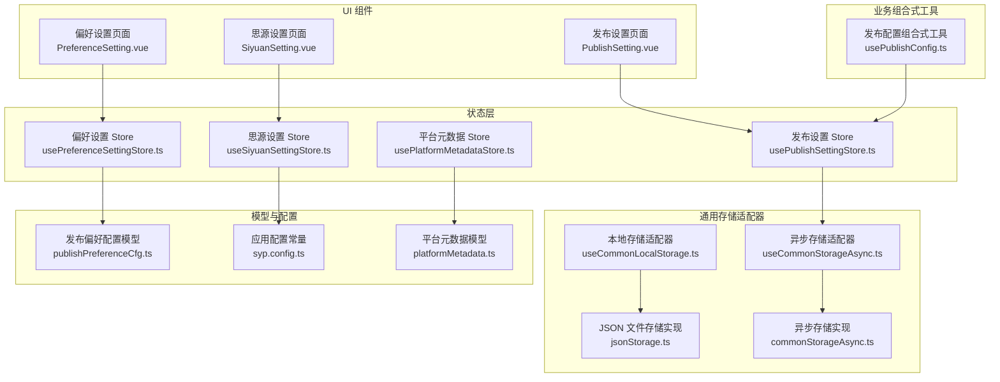
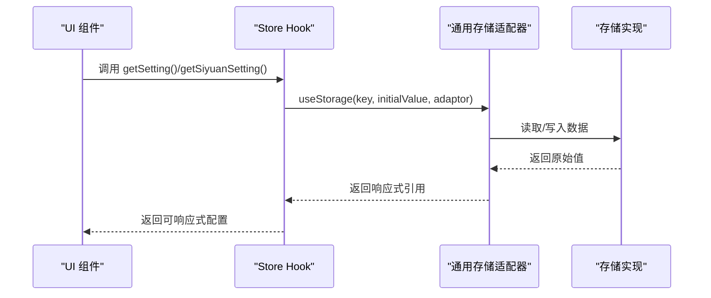
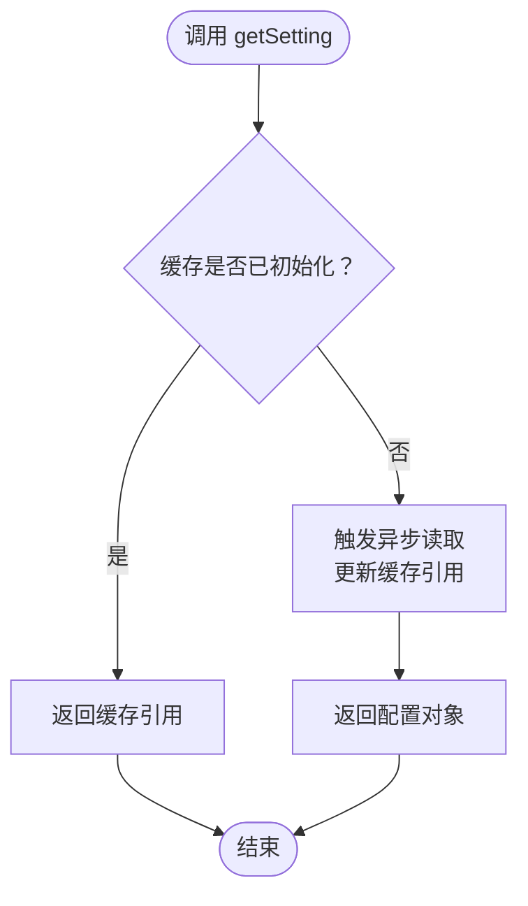
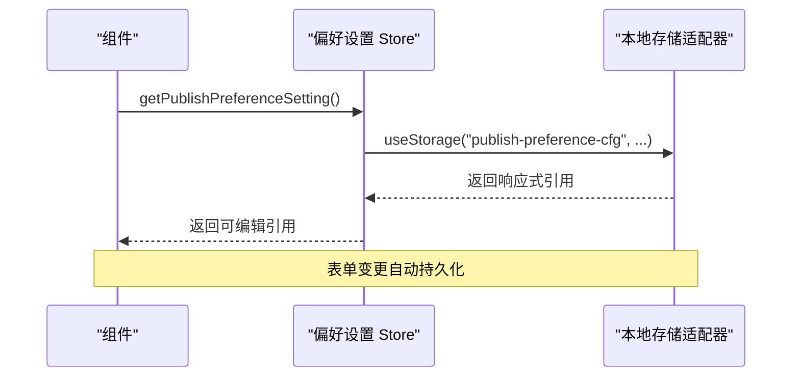
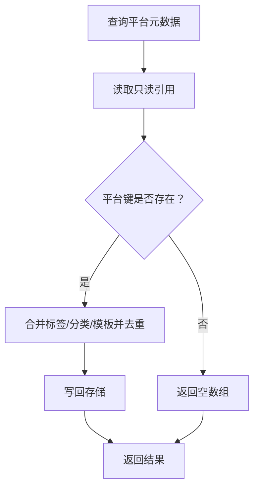
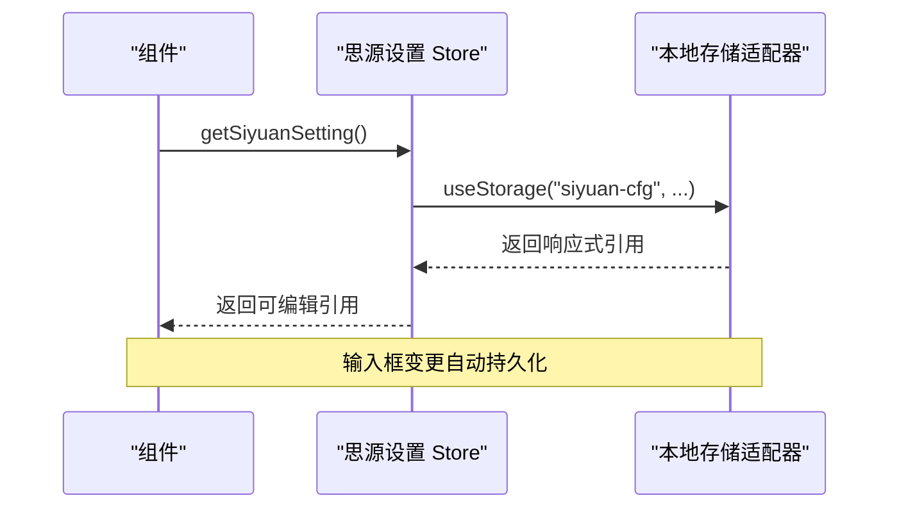
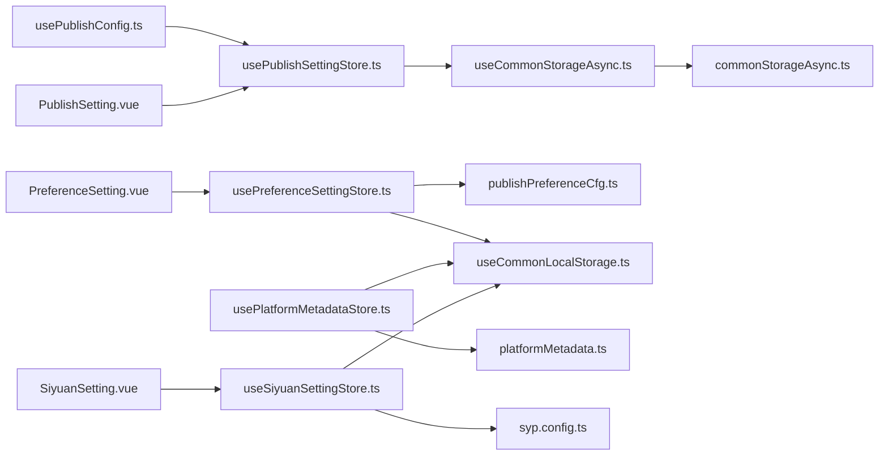

# 状态管理架构

<cite>
**本文引用的文件**
- [usePublishSettingStore.ts](file://src/stores/usePublishSettingStore.ts)
- [usePreferenceSettingStore.ts](file://src/stores/usePreferenceSettingStore.ts)
- [usePlatformMetadataStore.ts](file://src/stores/usePlatformMetadataStore.ts)
- [useSiyuanSettingStore.ts](file://src/stores/useSiyuanSettingStore.ts)
- [useCommonLocalStorage.ts](file://src/stores/common/useCommonLocalStorage.ts)
- [jsonStorage.ts](file://src/stores/common/jsonStorage.ts)
- [commonStorageAsync.ts](file://src/stores/common/commonStorageAsync.ts)
- [useCommonStorageAsync.ts](file://src/stores/common/useCommonStorageAsync.ts)
- [publishPreferenceCfg.ts](file://src/models/publishPreferenceCfg.ts)
- [platformMetadata.ts](file://src/models/platformMetadata.ts)
- [syp.config.ts](file://syp.config.ts)
- [usePublishConfig.ts](file://src/composables/usePublishConfig.ts)
- [PreferenceSetting.vue](file://src/components/set/preference/PreferenceSetting.vue)
- [SiyuanSetting.vue](file://src/components/set/SiyuanSetting.vue)
- [PublishSetting.vue](file://src/components/set/PublishSetting.vue)
</cite>

## 目录
1. [引言](#引言)
2. [项目结构](#项目结构)
3. [核心组件](#核心组件)
4. [架构总览](#架构总览)
5. [详细组件分析](#详细组件分析)
6. [依赖关系分析](#依赖关系分析)
7. [性能考量](#性能考量)
8. [故障排查指南](#故障排查指南)
9. [结论](#结论)
10. [附录](#附录)

## 引言
本文件系统性梳理“思源笔记发布器插件”的状态管理架构，围绕 Pinia 状态管理的设计理念与实现策略展开，重点覆盖以下方面：
- 状态存储组织：发布设置、偏好设置、平台元数据、思源设置等核心状态模块
- 响应式状态设计：状态定义、getter 计算与 action 操作
- 持久化机制：localStorage 与异步存储（基于思源内核 API）的实现与选择
- 状态同步与跨组件共享：通过组合式 Store 与只读引用实现跨组件共享
- 最佳实践：状态设计原则、性能优化与调试技巧
- 实战案例：状态管理实现与使用示例路径

## 项目结构
本项目采用“按功能域划分”的模块化组织方式，状态管理位于 src/stores 目录下，配套的通用存储适配器与模型定义分别位于 common 子目录与 models 目录。核心入口为多个自定义 Store Hook，如发布设置、偏好设置、平台元数据、思源设置等。



图表来源
- [usePublishSettingStore.ts:21-94](file://src/stores/usePublishSettingStore.ts#L21-L94)
- [usePreferenceSettingStore.ts:21-89](file://src/stores/usePreferenceSettingStore.ts#L21-L89)
- [usePlatformMetadataStore.ts:21-127](file://src/stores/usePlatformMetadataStore.ts#L21-L127)
- [useSiyuanSettingStore.ts:26-80](file://src/stores/useSiyuanSettingStore.ts#L26-L80)
- [useCommonLocalStorage.ts:27-57](file://src/stores/common/useCommonLocalStorage.ts#L27-L57)
- [jsonStorage.ts:23-109](file://src/stores/common/jsonStorage.ts#L23-L109)
- [useCommonStorageAsync.ts:22-64](file://src/stores/common/useCommonStorageAsync.ts#L22-L64)
- [commonStorageAsync.ts:24-116](file://src/stores/common/commonStorageAsync.ts#L24-L116)
- [publishPreferenceCfg.ts:19-98](file://src/models/publishPreferenceCfg.ts#L19-L98)
- [platformMetadata.ts:16-47](file://src/models/platformMetadata.ts#L16-L47)
- [syp.config.ts:46-49](file://syp.config.ts#L46-L49)
- [usePublishConfig.ts:26-98](file://src/composables/usePublishConfig.ts#L26-L98)
- [PreferenceSetting.vue:24-28](file://src/components/set/preference/PreferenceSetting.vue#L24-L28)
- [SiyuanSetting.vue:15-17](file://src/components/set/SiyuanSetting.vue#L15-L17)
- [PublishSetting.vue:22-22](file://src/components/set/PublishSetting.vue#L22-L22)

章节来源
- [usePublishSettingStore.ts:10-94](file://src/stores/usePublishSettingStore.ts#L10-L94)
- [usePreferenceSettingStore.ts:10-89](file://src/stores/usePreferenceSettingStore.ts#L10-L89)
- [usePlatformMetadataStore.ts:10-127](file://src/stores/usePlatformMetadataStore.ts#L10-L127)
- [useSiyuanSettingStore.ts:10-80](file://src/stores/useSiyuanSettingStore.ts#L10-L80)
- [useCommonLocalStorage.ts:16-57](file://src/stores/common/useCommonLocalStorage.ts#L16-L57)
- [jsonStorage.ts:15-109](file://src/stores/common/jsonStorage.ts#L15-L109)
- [useCommonStorageAsync.ts:16-64](file://src/stores/common/useCommonStorageAsync.ts#L16-L64)
- [commonStorageAsync.ts:16-116](file://src/stores/common/commonStorageAsync.ts#L16-L116)
- [publishPreferenceCfg.ts:12-98](file://src/models/publishPreferenceCfg.ts#L12-L98)
- [platformMetadata.ts:10-47](file://src/models/platformMetadata.ts#L10-L47)
- [syp.config.ts:28-49](file://syp.config.ts#L28-L49)
- [usePublishConfig.ts:20-98](file://src/composables/usePublishConfig.ts#L20-L98)
- [PreferenceSetting.vue:10-48](file://src/components/set/preference/PreferenceSetting.vue#L10-L48)
- [SiyuanSetting.vue:10-38](file://src/components/set/SiyuanSetting.vue#L10-L38)
- [PublishSetting.vue:10-61](file://src/components/set/PublishSetting.vue#L10-L61)

## 核心组件
本节概述四大核心状态模块及其职责边界：
- 发布设置 Store：封装全局发布配置的读写与缓存，支持异步持久化到思源内核或浏览器本地存储。
- 偏好设置 Store：封装发布偏好配置，支持从思源笔记读取 AI 配置并合并默认值，提供只读引用以避免误改。
- 平台元数据 Store：维护各平台的标签、分类与模板元数据，提供查询与增量更新能力。
- 思源设置 Store：封装思源笔记 API 地址、令牌与中间件配置，支持只读引用。

章节来源
- [usePublishSettingStore.ts:16-94](file://src/stores/usePublishSettingStore.ts#L16-L94)
- [usePreferenceSettingStore.ts:18-86](file://src/stores/usePreferenceSettingStore.ts#L18-L86)
- [usePlatformMetadataStore.ts:16-124](file://src/stores/usePlatformMetadataStore.ts#L16-L124)
- [useSiyuanSettingStore.ts:19-77](file://src/stores/useSiyuanSettingStore.ts#L19-L77)

## 架构总览
状态管理采用“Store Hook + 通用存储适配器”的分层设计：
- Store Hook：对外暴露 get/update 等方法，封装状态读写细节。
- 通用存储适配器：根据运行环境（思源内核/Electron 或浏览器）选择不同的存储实现。
- 模型与配置：通过 TypeScript 类型与默认值确保状态结构稳定与可演进。



图表来源
- [usePublishSettingStore.ts:21-48](file://src/stores/usePublishSettingStore.ts#L21-L48)
- [useSiyuanSettingStore.ts:36-61](file://src/stores/useSiyuanSettingStore.ts#L36-L61)
- [useCommonLocalStorage.ts:27-35](file://src/stores/common/useCommonLocalStorage.ts#L27-L35)
- [useCommonStorageAsync.ts:22-61](file://src/stores/common/useCommonStorageAsync.ts#L22-L61)

## 详细组件分析

### 发布设置 Store（usePublishSettingStore）
- 设计理念
  - 将全局发布配置抽象为单一 Store，统一读写入口，避免分散在多处。
  - 支持异步持久化，优先使用思源内核 API，回退至浏览器 localStorage。
- 关键实现要点
  - 使用通用异步存储适配器，自动推断序列化类型并初始化默认值。
  - 提供 getSetting 与 updateSetting 两个核心 Action，内部维护缓存引用以减少重复 IO。
  - 提供键存在性检查与删除辅助方法，便于动态配置管理。
- 响应式与持久化
  - 通过 ref 缓存最近一次读取结果，computed 触发异步读取并更新缓存。
  - 异步写入后同步更新本地缓存，保证 UI 即时反映最新状态。



图表来源
- [usePublishSettingStore.ts:28-48](file://src/stores/usePublishSettingStore.ts#L28-L48)

章节来源
- [usePublishSettingStore.ts:16-94](file://src/stores/usePublishSettingStore.ts#L16-L94)
- [useCommonStorageAsync.ts:22-64](file://src/stores/common/useCommonStorageAsync.ts#L22-L64)
- [commonStorageAsync.ts:24-116](file://src/stores/common/commonStorageAsync.ts#L24-L116)

### 偏好设置 Store（usePreferenceSettingStore）
- 设计理念
  - 将发布偏好配置抽象为可扩展的模型类，支持从思源笔记窗口读取 AI 配置并自动注入。
  - 提供只读引用，避免外部误改导致状态不一致。
- 关键实现要点
  - 使用通用本地存储适配器，序列化为对象格式。
  - 在初始化阶段检测并合并思源笔记的 AI 配置，随后应用默认值与布尔型兜底逻辑。
  - 暴露只读版本的引用，便于在组件中安全读取。
- 响应式与持久化
  - 偏好设置作为 RemovableRef，直接绑定到 UI 表单控件，双向绑定自动持久化。



图表来源
- [usePreferenceSettingStore.ts:34-66](file://src/stores/usePreferenceSettingStore.ts#L34-L66)
- [useCommonLocalStorage.ts:27-35](file://src/stores/common/useCommonLocalStorage.ts#L27-L35)
- [publishPreferenceCfg.ts:19-98](file://src/models/publishPreferenceCfg.ts#L19-L98)

章节来源
- [usePreferenceSettingStore.ts:18-86](file://src/stores/usePreferenceSettingStore.ts#L18-L86)
- [publishPreferenceCfg.ts:12-98](file://src/models/publishPreferenceCfg.ts#L12-L98)
- [PreferenceSetting.vue:24-28](file://src/components/set/preference/PreferenceSetting.vue#L24-L28)

### 平台元数据 Store（usePlatformMetadataStore）
- 设计理念
  - 将平台维度的标签、分类与模板元数据集中管理，支持按平台键查询与增量更新。
  - 提供只读访问接口，避免并发场景下的状态竞态。
- 关键实现要点
  - 以对象字典形式存储各平台的元数据项，每个项包含三类数组。
  - 更新时先过滤空字符串并去重，再合并新值，最后写回存储。
  - 查询时对缺失平台进行安全兜底，返回空数组。
- 响应式与持久化
  - 元数据作为 RemovableRef，直接驱动 UI 展示与编辑。



图表来源
- [usePlatformMetadataStore.ts:51-122](file://src/stores/usePlatformMetadataStore.ts#L51-L122)
- [platformMetadata.ts:16-47](file://src/models/platformMetadata.ts#L16-L47)

章节来源
- [usePlatformMetadataStore.ts:16-124](file://src/stores/usePlatformMetadataStore.ts#L16-L124)
- [platformMetadata.ts:10-47](file://src/models/platformMetadata.ts#L10-L47)

### 思源设置 Store（useSiyuanSettingStore）
- 设计理念
  - 统一管理思源笔记 API 地址、令牌与中间件配置，优先从环境变量与运行时 origin 推导。
  - 提供只读引用，避免在运行时被意外修改。
- 关键实现要点
  - 初始化时根据环境变量与默认值构造初始配置，并设置中间件 URL。
  - 自动兼容旧数据，确保 apiUrl 字段始终有效。
  - 暴露只读版本引用，便于在需要时安全读取。
- 响应式与持久化
  - 配置直接绑定到表单输入框，双向绑定自动持久化。



图表来源
- [useSiyuanSettingStore.ts:36-61](file://src/stores/useSiyuanSettingStore.ts#L36-L61)
- [useCommonLocalStorage.ts:27-35](file://src/stores/common/useCommonLocalStorage.ts#L27-L35)
- [SiyuanSetting.vue:15-17](file://src/components/set/SiyuanSetting.vue#L15-L17)

章节来源
- [useSiyuanSettingStore.ts:19-77](file://src/stores/useSiyuanSettingStore.ts#L19-L77)
- [SiyuanSetting.vue:10-38](file://src/components/set/SiyuanSetting.vue#L10-L38)

### 通用存储适配器与持久化机制
- 本地存储适配器（Electron/浏览器）
  - 在思源环境中使用 JSON 文件存储实现，自动创建目录与初始化空文件。
  - 在浏览器环境中回退至 window.localStorage。
- 异步存储适配器（思源内核 API）
  - 在运行于思源内核时，通过内核 API 读写文本文件，实现跨会话持久化。
  - 在浏览器环境下回退至 localStorage。
- 序列化与类型推断
  - 自动推断初始值类型并选择对应序列化器，若为空对象则写入默认值并初始化。

```mermaid
classDiagram
class JsonStorage {
+getItem(key) string
+setItem(key, value) void
+removeItem(key) void
}
class CommonStorageAsync {
+getItem(key) Promise~string~
+setItem(key, value) Promise~void~
+removeItem(key) Promise~void~
}
class useCommonLocalStorage {
+useCommonLocalStorage(filePath, key, initialValue, options) RemovableRef
+getLocalStorageAdaptor(filePath, options) StorageLike
}
class useCommonStorageAsync {
+useCommonStorageAsync(storageKey, initialValue) { commonStore }
}
useCommonLocalStorage --> JsonStorage : "Electron 环境"
useCommonLocalStorage --> localStorage : "浏览器环境"
useCommonStorageAsync --> CommonStorageAsync : "使用"
```

图表来源
- [jsonStorage.ts:23-109](file://src/stores/common/jsonStorage.ts#L23-L109)
- [commonStorageAsync.ts:24-116](file://src/stores/common/commonStorageAsync.ts#L24-L116)
- [useCommonLocalStorage.ts:27-55](file://src/stores/common/useCommonLocalStorage.ts#L27-L55)
- [useCommonStorageAsync.ts:22-64](file://src/stores/common/useCommonStorageAsync.ts#L22-L64)

章节来源
- [jsonStorage.ts:15-109](file://src/stores/common/jsonStorage.ts#L15-L109)
- [commonStorageAsync.ts:16-116](file://src/stores/common/commonStorageAsync.ts#L16-L116)
- [useCommonLocalStorage.ts:18-55](file://src/stores/common/useCommonLocalStorage.ts#L18-L55)
- [useCommonStorageAsync.ts:16-64](file://src/stores/common/useCommonStorageAsync.ts#L16-L64)

### 状态同步与跨组件共享
- 跨组件共享模式
  - Store Hook 以函数形式暴露，组件通过组合式 API 调用，获得响应式引用。
  - 对外提供只读版本引用，避免组件间互相修改同一份状态。
- 状态同步策略
  - 本地存储适配器基于 RemovableRef，双向绑定自动持久化。
  - 异步存储适配器在写入后同步更新本地缓存，确保 UI 即时可见。

章节来源
- [usePreferenceSettingStore.ts:77-81](file://src/stores/usePreferenceSettingStore.ts#L77-L81)
- [useSiyuanSettingStore.ts:71-75](file://src/stores/useSiyuanSettingStore.ts#L71-L75)
- [PreferenceSetting.vue:24-28](file://src/components/set/preference/PreferenceSetting.vue#L24-L28)
- [SiyuanSetting.vue:15-17](file://src/components/set/SiyuanSetting.vue#L15-L17)

### 状态管理最佳实践
- 状态设计原则
  - 单一职责：每个 Store 聚焦一个领域（发布设置、偏好、平台元数据、思源设置）。
  - 明确边界：通过只读引用限制修改范围，避免跨组件竞态。
  - 可演进性：使用模型类与默认值，支持未来字段扩展。
- 性能优化
  - 缓存策略：发布设置 Store 内部缓存最近一次读取结果，减少重复 IO。
  - 增量更新：平台元数据更新时仅合并非空且去重后的条目，降低写入成本。
- 调试技巧
  - 日志记录：各 Store 与适配器均内置日志，便于追踪读写路径。
  - 类型安全：通过模型类与类型推断，减少运行期错误。

章节来源
- [usePublishSettingStore.ts:28-59](file://src/stores/usePublishSettingStore.ts#L28-L59)
- [usePlatformMetadataStore.ts:83-122](file://src/stores/usePlatformMetadataStore.ts#L83-L122)
- [useCommonStorageAsync.ts:26-41](file://src/stores/common/useCommonStorageAsync.ts#L26-L41)

### 实战案例与使用示例
- 发布配置读取与 API 初始化
  - 通过组合式工具读取发布配置并初始化适配器，便于后续发布流程使用。
- 偏好设置页面
  - 直接绑定响应式引用到表单控件，实现即改即存。
- 思源设置页面
  - 绑定 API 地址与密码，自动持久化到本地存储。

章节来源
- [usePublishConfig.ts:36-78](file://src/composables/usePublishConfig.ts#L36-L78)
- [PreferenceSetting.vue:52-105](file://src/components/set/preference/PreferenceSetting.vue#L52-L105)
- [SiyuanSetting.vue:20-38](file://src/components/set/SiyuanSetting.vue#L20-L38)
- [PublishSetting.vue:25-53](file://src/components/set/PublishSetting.vue#L25-L53)

## 依赖关系分析
- Store 与适配器
  - 发布设置 Store 依赖通用异步存储适配器；偏好与思源设置 Store 依赖通用本地存储适配器。
- Store 与模型
  - 偏好设置 Store 依赖发布偏好配置模型；平台元数据 Store 依赖平台元数据模型。
- Store 与 UI
  - 各 Store 通过组合式 API 被 UI 组件消费，形成“数据驱动视图”的闭环。



图表来源
- [usePublishSettingStore.ts:10-14](file://src/stores/usePublishSettingStore.ts#L10-L14)
- [useCommonStorageAsync.ts:10-11](file://src/stores/common/useCommonStorageAsync.ts#L10-L11)
- [commonStorageAsync.ts:24-43](file://src/stores/common/commonStorageAsync.ts#L24-L43)
- [usePreferenceSettingStore.ts:10-16](file://src/stores/usePreferenceSettingStore.ts#L10-L16)
- [publishPreferenceCfg.ts:10-10](file://src/models/publishPreferenceCfg.ts#L10-L10)
- [useCommonLocalStorage.ts:9-11](file://src/stores/common/useCommonLocalStorage.ts#L9-L11)
- [usePlatformMetadataStore.ts:10-13](file://src/stores/usePlatformMetadataStore.ts#L10-L13)
- [platformMetadata.ts:10-10](file://src/models/platformMetadata.ts#L10-L10)
- [useSiyuanSettingStore.ts:10-17](file://src/stores/useSiyuanSettingStore.ts#L10-L17)
- [syp.config.ts:26-26](file://syp.config.ts#L26-L26)
- [usePublishConfig.ts:15-18](file://src/composables/usePublishConfig.ts#L15-L18)
- [PreferenceSetting.vue:13-24](file://src/components/set/preference/PreferenceSetting.vue#L13-L24)
- [SiyuanSetting.vue:12-15](file://src/components/set/SiyuanSetting.vue#L12-L15)
- [PublishSetting.vue:16-22](file://src/components/set/PublishSetting.vue#L16-L22)

章节来源
- [usePublishSettingStore.ts:10-14](file://src/stores/usePublishSettingStore.ts#L10-L14)
- [useCommonStorageAsync.ts:10-11](file://src/stores/common/useCommonStorageAsync.ts#L10-L11)
- [commonStorageAsync.ts:24-43](file://src/stores/common/commonStorageAsync.ts#L24-L43)
- [usePreferenceSettingStore.ts:10-16](file://src/stores/usePreferenceSettingStore.ts#L10-L16)
- [publishPreferenceCfg.ts:10-10](file://src/models/publishPreferenceCfg.ts#L10-L10)
- [useCommonLocalStorage.ts:9-11](file://src/stores/common/useCommonLocalStorage.ts#L9-L11)
- [usePlatformMetadataStore.ts:10-13](file://src/stores/usePlatformMetadataStore.ts#L10-L13)
- [platformMetadata.ts:10-10](file://src/models/platformMetadata.ts#L10-L10)
- [useSiyuanSettingStore.ts:10-17](file://src/stores/useSiyuanSettingStore.ts#L10-L17)
- [syp.config.ts:26-26](file://syp.config.ts#L26-L26)
- [usePublishConfig.ts:15-18](file://src/composables/usePublishConfig.ts#L15-L18)
- [PreferenceSetting.vue:13-24](file://src/components/set/preference/PreferenceSetting.vue#L13-L24)
- [SiyuanSetting.vue:12-15](file://src/components/set/SiyuanSetting.vue#L12-L15)
- [PublishSetting.vue:16-22](file://src/components/set/PublishSetting.vue#L16-L22)

## 性能考量
- 读写路径优化
  - 发布设置 Store 通过缓存减少重复 IO；平台元数据更新采用去重与增量合并，降低写入开销。
- 序列化与初始化
  - 自动推断序列化类型，避免手动配置带来的错误；空对象时自动写入默认值，减少首次加载等待。
- 环境适配
  - 根据运行环境选择最优存储实现，避免不必要的转换与异常处理。

## 故障排查指南
- 无法读取配置
  - 检查运行环境判断逻辑与存储适配器选择是否正确。
  - 查看日志输出定位是异步存储还是本地存储环节的问题。
- 配置未持久化
  - 确认组件是否使用了响应式引用并启用了双向绑定。
  - 检查只读引用是否被错误地当作可写引用使用。
- 平台元数据异常
  - 核对传入数组是否包含空字符串，确认去重与合并逻辑是否生效。

章节来源
- [usePublishSettingStore.ts:28-59](file://src/stores/usePublishSettingStore.ts#L28-L59)
- [usePlatformMetadataStore.ts:83-122](file://src/stores/usePlatformMetadataStore.ts#L83-L122)
- [useCommonStorageAsync.ts:44-61](file://src/stores/common/useCommonStorageAsync.ts#L44-L61)
- [commonStorageAsync.ts:51-79](file://src/stores/common/commonStorageAsync.ts#L51-L79)

## 结论
本状态管理架构以 Store Hook 为核心，结合通用存储适配器与模型类，实现了在不同运行环境下的统一状态读写体验。通过缓存、只读引用与增量更新等策略，既保证了性能，又提升了可维护性与可扩展性。建议在后续迭代中持续完善日志与监控，进一步细化错误恢复与迁移策略。

## 附录
- 关键实现路径参考
  - 发布设置 Store：[usePublishSettingStore.ts:21-94](file://src/stores/usePublishSettingStore.ts#L21-L94)
  - 偏好设置 Store：[usePreferenceSettingStore.ts:21-86](file://src/stores/usePreferenceSettingStore.ts#L21-L86)
  - 平台元数据 Store：[usePlatformMetadataStore.ts:21-124](file://src/stores/usePlatformMetadataStore.ts#L21-L124)
  - 思源设置 Store：[useSiyuanSettingStore.ts:26-77](file://src/stores/useSiyuanSettingStore.ts#L26-L77)
  - 通用本地存储适配器：[useCommonLocalStorage.ts:27-55](file://src/stores/common/useCommonLocalStorage.ts#L27-L55)
  - JSON 文件存储实现：[jsonStorage.ts:23-109](file://src/stores/common/jsonStorage.ts#L23-L109)
  - 通用异步存储适配器：[useCommonStorageAsync.ts:22-64](file://src/stores/common/useCommonStorageAsync.ts#L22-L64)
  - 异步存储实现：[commonStorageAsync.ts:24-116](file://src/stores/common/commonStorageAsync.ts#L24-L116)
  - 发布偏好配置模型：[publishPreferenceCfg.ts:19-98](file://src/models/publishPreferenceCfg.ts#L19-L98)
  - 平台元数据模型：[platformMetadata.ts:16-47](file://src/models/platformMetadata.ts#L16-L47)
  - 应用配置常量：[syp.config.ts:46-49](file://syp.config.ts#L46-L49)
  - 发布配置组合式工具：[usePublishConfig.ts:26-98](file://src/composables/usePublishConfig.ts#L26-L98)
  - 偏好设置页面：[PreferenceSetting.vue:24-28](file://src/components/set/preference/PreferenceSetting.vue#L24-L28)
  - 思源设置页面：[SiyuanSetting.vue:15-17](file://src/components/set/SiyuanSetting.vue#L15-L17)
  - 发布设置页面：[PublishSetting.vue:22-22](file://src/components/set/PublishSetting.vue#L22-L22)