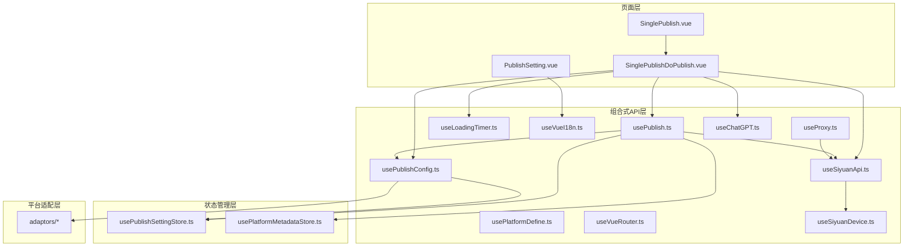
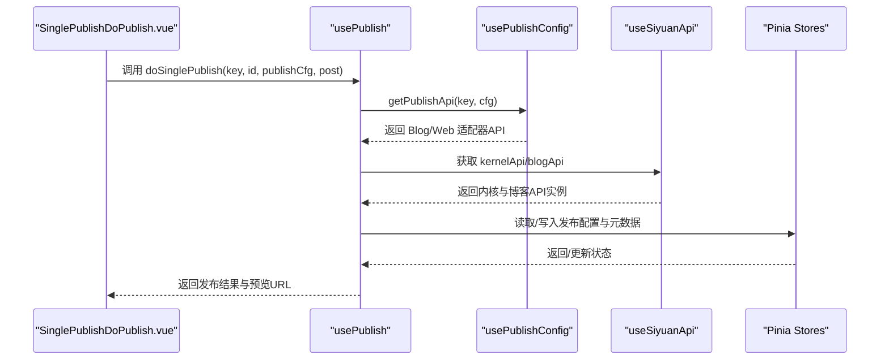
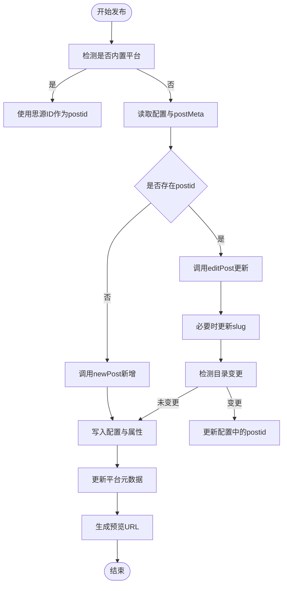
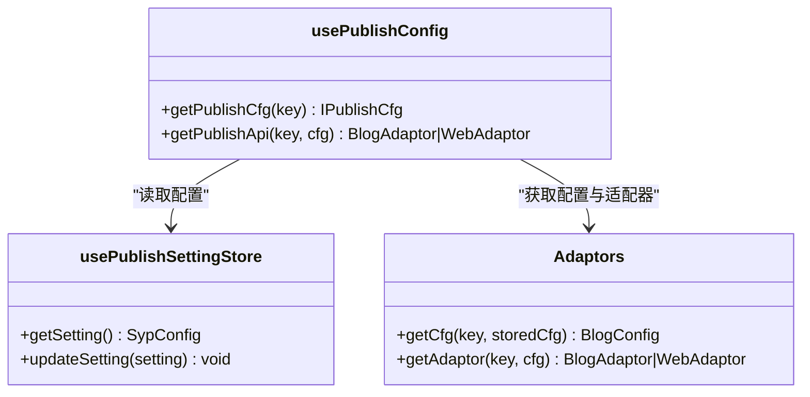
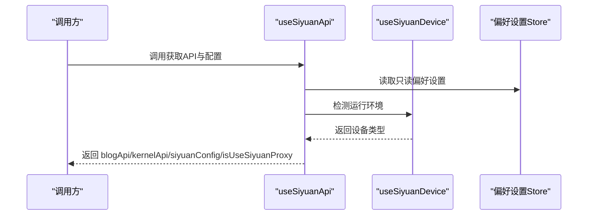
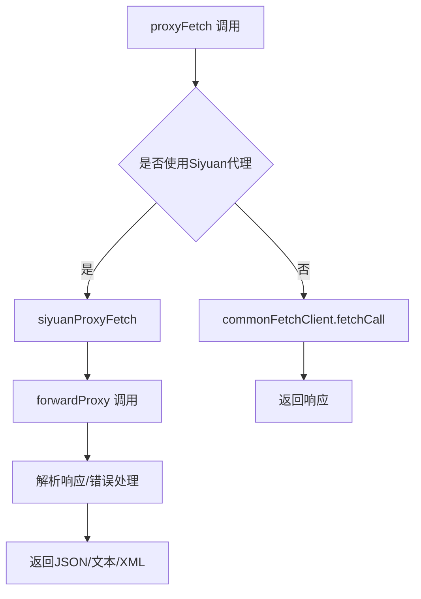
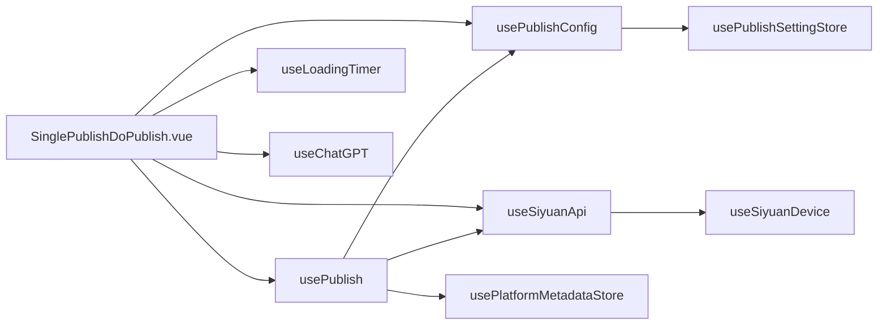

# Composition API设计模式

<cite>
**本文档引用的文件**
- [usePublish.ts](file://src/composables/usePublish.ts)
- [usePublishConfig.ts](file://src/composables/usePublishConfig.ts)
- [useSiyuanApi.ts](file://src/composables/useSiyuanApi.ts)
- [useLoadingTimer.ts](file://src/composables/useLoadingTimer.ts)
- [usePlatformDefine.ts](file://src/composables/usePlatformDefine.ts)
- [useVueI18n.ts](file://src/composables/useVueI18n.ts)
- [useVueRouter.ts](file://src/composables/useVueRouter.ts)
- [useProxy.ts](file://src/composables/useProxy.ts)
- [useSiyuanDevice.ts](file://src/composables/useSiyuanDevice.ts)
- [useChatGPT.ts](file://src/composables/useChatGPT.ts)
- [SinglePublish.vue](file://src/pages/SinglePublish.vue)
- [SinglePublishDoPublish.vue](file://src/components/publish/SinglePublishDoPublish.vue)
- [PublishSetting.vue](file://src/components/set/PublishSetting.vue)
- [usePublishSettingStore.ts](file://src/stores/usePublishSettingStore.ts)
- [usePlatformMetadataStore.ts](file://src/stores/usePlatformMetadataStore.ts)
</cite>

## 目录
1. [引言](#引言)
2. [项目结构](#项目结构)
3. [核心组件](#核心组件)
4. [架构总览](#架构总览)
5. [详细组件分析](#详细组件分析)
6. [依赖关系分析](#依赖关系分析)
7. [性能考量](#性能考量)
8. [故障排查指南](#故障排查指南)
9. [结论](#结论)
10. [附录](#附录)

## 引言
本文件面向思源笔记发布器插件的Vue 3 Composition API设计模式，系统性阐述在该复杂多平台发布场景下的可复用逻辑抽取、响应式数据管理、生命周期钩子处理、组件间状态共享与集成策略，并总结开发规范与性能优化建议。重点覆盖以下composables的设计理念与最佳实践：usePublish、usePublishConfig、useSiyuanApi、useLoadingTimer、usePlatformDefine、useVueI18n、useVueRouter、useProxy、useSiyuanDevice、useChatGPT。

## 项目结构
项目采用“功能域+分层”的组织方式：
- composables：封装跨组件复用的业务逻辑与外部依赖接入（API、设备、代理、国际化等）
- adaptors：平台适配器层，屏蔽不同发布平台的差异
- stores：Pinia状态管理，负责持久化与全局状态
- components：页面与表单组件，使用setup语法与组合式API
- pages：路由页面，承载入口与导航
- utils：工具模块与日志、常量等基础设施

图表来源
- [SinglePublish.vue:1-22](file://src/pages/SinglePublish.vue#L1-L22)
- [SinglePublishDoPublish.vue:1-200](file://src/components/publish/SinglePublishDoPublish.vue#L1-L200)
- [usePublish.ts:1-560](file://src/composables/usePublish.ts#L1-L560)
- [usePublishConfig.ts:1-99](file://src/composables/usePublishConfig.ts#L1-L99)
- [useSiyuanApi.ts:1-76](file://src/composables/useSiyuanApi.ts#L1-L76)
- [useLoadingTimer.ts:1-56](file://src/composables/useLoadingTimer.ts#L1-L56)
- [usePlatformDefine.ts:1-83](file://src/composables/usePlatformDefine.ts#L1-L83)
- [useVueI18n.ts:1-26](file://src/composables/useVueI18n.ts#L1-L26)
- [useVueRouter.ts:1-19](file://src/composables/useVueRouter.ts#L1-L19)
- [useProxy.ts:1-321](file://src/composables/useProxy.ts#L1-L321)
- [useSiyuanDevice.ts:1-83](file://src/composables/useSiyuanDevice.ts#L1-L83)
- [useChatGPT.ts:1-130](file://src/composables/useChatGPT.ts#L1-L130)
- [usePublishSettingStore.ts:1-95](file://src/stores/usePublishSettingStore.ts#L1-L95)
- [usePlatformMetadataStore.ts:1-128](file://src/stores/usePlatformMetadataStore.ts#L1-L128)

章节来源
- [SinglePublish.vue:1-22](file://src/pages/SinglePublish.vue#L1-L22)
- [SinglePublishDoPublish.vue:1-200](file://src/components/publish/SinglePublishDoPublish.vue#L1-L200)
- [usePublish.ts:1-560](file://src/composables/usePublish.ts#L1-L560)
- [usePublishConfig.ts:1-99](file://src/composables/usePublishConfig.ts#L1-L99)
- [useSiyuanApi.ts:1-76](file://src/composables/useSiyuanApi.ts#L1-L76)
- [useLoadingTimer.ts:1-56](file://src/composables/useLoadingTimer.ts#L1-L56)
- [usePlatformDefine.ts:1-83](file://src/composables/usePlatformDefine.ts#L1-L83)
- [useVueI18n.ts:1-26](file://src/composables/useVueI18n.ts#L1-L26)
- [useVueRouter.ts:1-19](file://src/composables/useVueRouter.ts#L1-L19)
- [useProxy.ts:1-321](file://src/composables/useProxy.ts#L1-L321)
- [useSiyuanDevice.ts:1-83](file://src/composables/useSiyuanDevice.ts#L1-L83)
- [useChatGPT.ts:1-130](file://src/composables/useChatGPT.ts#L1-L130)
- [usePublishSettingStore.ts:1-95](file://src/stores/usePublishSettingStore.ts#L1-L95)
- [usePlatformMetadataStore.ts:1-128](file://src/stores/usePlatformMetadataStore.ts#L1-L128)

## 核心组件
本节聚焦关键composables及其职责边界与协作方式。

- usePublish：统一发布流程编排，负责文章预处理、新增/更新、删除、预览链接生成、平台元数据同步等；内部聚合usePublishConfig、useSiyuanApi、useVueI18n、usePlatformMetadataStore等依赖。
- usePublishConfig：平台配置与API实例工厂，负责动态解析平台配置、生成适配器与API实例。
- useSiyuanApi：封装思源内核与博客API，统一设备环境判断与代理策略选择。
- useLoadingTimer：轻量计时器，基于onBeforeMount与watch实现加载耗时统计。
- usePlatformDefine：平台类型与预设平台集合管理，提供平台枚举与查询能力。
- useVueI18n：CSP友好型多语言封装，避免动态eval。
- useVueRouter：路由实例创建，集中管理路由配置。
- useProxy：代理请求与XML-RPC封装，支持Siyan代理与中间件代理双通道。
- useSiyuanDevice：设备检测，区分主窗体、挂件、浏览器、扩展等运行环境。
- useChatGPT：实验性AI能力封装，按偏好设置动态创建官方或反代实例。

章节来源
- [usePublish.ts:44-557](file://src/composables/usePublish.ts#L44-L557)
- [usePublishConfig.ts:26-95](file://src/composables/usePublishConfig.ts#L26-L95)
- [useSiyuanApi.ts:20-75](file://src/composables/useSiyuanApi.ts#L20-L75)
- [useLoadingTimer.ts:20-55](file://src/composables/useLoadingTimer.ts#L20-L55)
- [usePlatformDefine.ts:18-82](file://src/composables/usePlatformDefine.ts#L18-L82)
- [useVueI18n.ts:16-25](file://src/composables/useVueI18n.ts#L16-L25)
- [useVueRouter.ts:13-18](file://src/composables/useVueRouter.ts#L13-L18)
- [useProxy.ts:27-318](file://src/composables/useProxy.ts#L27-L318)
- [useSiyuanDevice.ts:16-82](file://src/composables/useSiyuanDevice.ts#L16-L82)
- [useChatGPT.ts:26-127](file://src/composables/useChatGPT.ts#L26-L127)

## 架构总览
下图展示从页面到composables再到适配器与状态管理的整体调用链路。

图表来源
- [SinglePublishDoPublish.vue:104-147](file://src/components/publish/SinglePublishDoPublish.vue#L104-L147)
- [usePublish.ts:70-212](file://src/composables/usePublish.ts#L70-L212)
- [usePublishConfig.ts:73-78](file://src/composables/usePublishConfig.ts#L73-L78)
- [useSiyuanApi.ts:42-43](file://src/composables/useSiyuanApi.ts#L42-L43)
- [usePublishSettingStore.ts:38-59](file://src/stores/usePublishSettingStore.ts#L38-L59)
- [usePlatformMetadataStore.ts:83-122](file://src/stores/usePlatformMetadataStore.ts#L83-L122)

## 详细组件分析

### usePublish：统一发布流程编排
- 设计原则
  - 将“平台无关”的发布流程抽象为可复用逻辑，通过适配器解耦具体平台差异。
  - 使用reactive聚合UI状态，确保组件渲染与流程控制的一致性。
  - 通过store读写发布配置，保证跨组件状态一致性与持久化。
- 关键流程
  - 初始化：根据方法类型决定从思源或平台拉取文章，合并内容后进入预处理阶段。
  - 预处理：调用适配器的preEditPost，统一处理标题、别名、摘要、标签、分类等。
  - 新增/更新：根据postid存在与否选择newPost或editPost；必要时更新slug与目录变更后的postid。
  - 同步属性与元数据：写入思源块属性与平台元数据缓存。
  - 预览链接：根据平台返回的postid与基础URL拼接预览地址。
- 生命周期与副作用
  - 在doSinglePublish中集中处理错误与消息提示，避免分散在组件中。
  - 通过computed与store的异步读取，确保配置与元数据的实时性。
- 性能与健壮性
  - 使用深拷贝避免对原始Post对象的意外修改。
  - 对平台返回的postid变化进行检测与配置回写，防止脏数据。

图表来源
- [usePublish.ts:70-212](file://src/composables/usePublish.ts#L70-L212)
- [usePublish.ts:121-194](file://src/composables/usePublish.ts#L121-L194)
- [usePublish.ts:175-194](file://src/composables/usePublish.ts#L175-L194)

章节来源
- [usePublish.ts:44-557](file://src/composables/usePublish.ts#L44-L557)

### usePublishConfig：平台配置与API工厂
- 设计原则
  - 将“配置解析”与“API实例化”分离，便于测试与替换。
  - 通过Adaptors动态获取平台配置与适配器，支持多种发布协议与前端站点。
- 关键点
  - getPublishCfg：从store读取动态配置，解析平台配置与动态配置数组。
  - getPublishApi：根据key与可选cfg创建适配器与API实例，供上层调用。
- 与状态管理的协作
  - 依赖usePublishSettingStore读取/写入配置，确保配置变更即时生效。

图表来源
- [usePublishConfig.ts:26-95](file://src/composables/usePublishConfig.ts#L26-L95)
- [usePublishSettingStore.ts:21-94](file://src/stores/usePublishSettingStore.ts#L21-L94)

章节来源
- [usePublishConfig.ts:26-95](file://src/composables/usePublishConfig.ts#L26-L95)
- [usePublishSettingStore.ts:21-94](file://src/stores/usePublishSettingStore.ts#L21-L94)

### useSiyuanApi：思源API封装与代理策略
- 设计原则
  - 将API配置、设备检测、代理策略统一抽象，减少调用方心智负担。
  - 支持在不同运行环境下选择直连或代理转发，提升兼容性。
- 关键点
  - 从store与环境变量读取配置，构造SiYuanConfig。
  - isStorageViaSiyuanApi与isUseSiyuanProxy决定代理路径。
  - 暴露kernelApi与blogApi供上层调用。

图表来源
- [useSiyuanApi.ts:20-75](file://src/composables/useSiyuanApi.ts#L20-L75)
- [useSiyuanDevice.ts:16-82](file://src/composables/useSiyuanDevice.ts#L16-L82)
- [useSiyuanApi.ts:30-39](file://src/composables/useSiyuanApi.ts#L30-L39)

章节来源
- [useSiyuanApi.ts:20-75](file://src/composables/useSiyuanApi.ts#L20-L75)
- [useSiyuanDevice.ts:16-82](file://src/composables/useSiyuanDevice.ts#L16-L82)

### useLoadingTimer：轻量计时器
- 设计原则
  - 通过onBeforeMount与watch实现“开始/停止”自动化切换，避免重复逻辑。
  - 仅暴露loadingTime，降低对外部状态的耦合。
- 使用场景
  - 页面首次加载与关键操作前后的时间统计，辅助性能监控与用户体验反馈。

章节来源
- [useLoadingTimer.ts:20-55](file://src/composables/useLoadingTimer.ts#L20-L55)

### usePlatformDefine：平台类型与预设平台管理
- 设计原则
  - 将平台类型与预设平台集合集中管理，提供查询与过滤能力。
  - 通过i18n注入，实现平台名称与类型的本地化展示。
- 关键点
  - 提供getPlatformType、getPrePlatformList、getPrePlatform、getAllPrePlatformList等查询接口。

章节来源
- [usePlatformDefine.ts:18-82](file://src/composables/usePlatformDefine.ts#L18-L82)

### useVueI18n：CSP友好型多语言
- 设计原则
  - 避免动态eval，通过messages与locale直接映射，满足CSP严格要求。
- 使用场景
  - 组件与composables中统一使用t(key)进行文本翻译。

章节来源
- [useVueI18n.ts:16-25](file://src/composables/useVueI18n.ts#L16-L25)

### useVueRouter：路由实例创建
- 设计原则
  - 将路由配置集中管理，便于统一维护与扩展。
- 使用场景
  - 页面组件中通过useRoute/useRouter获取路由上下文。

章节来源
- [useVueRouter.ts:13-18](file://src/composables/useVueRouter.ts#L13-L18)

### useProxy：代理请求与XML-RPC
- 设计原则
  - 统一封装代理fetch与XML-RPC调用，支持Siyan代理与中间件代理双通道。
  - 对不安全header进行过滤与透传，保障安全性与兼容性。
- 关键点
  - proxyFetch：根据isUseSiyuanProxy选择代理路径，支持多种编码与响应格式。
  - proxyXmlrpc：序列化XML-RPC请求并反序列化响应。
  - corsFetch：通过CORS代理发送表单数据，处理返回头透传。

图表来源
- [useProxy.ts:53-99](file://src/composables/useProxy.ts#L53-L99)
- [useProxy.ts:203-315](file://src/composables/useProxy.ts#L203-L315)

章节来源
- [useProxy.ts:27-318](file://src/composables/useProxy.ts#L27-L318)

### useSiyuanDevice：设备检测
- 设计原则
  - 将设备类型判断抽象为一组布尔函数，便于在不同运行环境中做差异化处理。
- 关键点
  - isInSiyuanOrSiyuanNewWin、isInChromeExtension等，用于代理策略与UI行为的分支。

章节来源
- [useSiyuanDevice.ts:16-82](file://src/composables/useSiyuanDevice.ts#L16-L82)

### useChatGPT：实验性AI能力
- 设计原则
  - 按偏好设置动态创建官方或反代实例，支持流式与非流式响应。
  - 通过getChatInput统一输入裁剪与HTML解析，控制最大token长度。
- 关键点
  - getAPI惰性初始化，避免不必要的资源占用。
  - chat方法统一错误处理与消息提示。

章节来源
- [useChatGPT.ts:26-127](file://src/composables/useChatGPT.ts#L26-L127)

## 依赖关系分析
- 组件到composables
  - SinglePublishDoPublish.vue依赖usePublish、usePublishConfig、useSiyuanApi、useVueI18n、useLoadingTimer、useChatGPT等。
- composables之间的耦合
  - usePublish依赖usePublishConfig与useSiyuanApi；usePublishConfig依赖usePublishSettingStore；useSiyuanApi依赖useSiyuanDevice与偏好设置store。
- 状态管理
  - usePublishSettingStore提供发布配置的读写；usePlatformMetadataStore提供平台元数据的读写与去重合并。

图表来源
- [SinglePublishDoPublish.vue:10-50](file://src/components/publish/SinglePublishDoPublish.vue#L10-L50)
- [usePublish.ts:44-52](file://src/composables/usePublish.ts#L44-L52)
- [usePublishConfig.ts:27-28](file://src/composables/usePublishConfig.ts#L27-L28)
- [useSiyuanApi.ts:22-23](file://src/composables/useSiyuanApi.ts#L22-L23)
- [useSiyuanDevice.ts:16-17](file://src/composables/useSiyuanDevice.ts#L16-L17)
- [usePublishSettingStore.ts:21-25](file://src/stores/usePublishSettingStore.ts#L21-L25)
- [usePlatformMetadataStore.ts:21-25](file://src/stores/usePlatformMetadataStore.ts#L21-L25)

章节来源
- [SinglePublishDoPublish.vue:10-50](file://src/components/publish/SinglePublishDoPublish.vue#L10-L50)
- [usePublish.ts:44-52](file://src/composables/usePublish.ts#L44-L52)
- [usePublishConfig.ts:27-28](file://src/composables/usePublishConfig.ts#L27-L28)
- [useSiyuanApi.ts:22-23](file://src/composables/useSiyuanApi.ts#L22-L23)
- [useSiyuanDevice.ts:16-17](file://src/composables/useSiyuanDevice.ts#L16-L17)
- [usePublishSettingStore.ts:21-25](file://src/stores/usePublishSettingStore.ts#L21-L25)
- [usePlatformMetadataStore.ts:21-25](file://src/stores/usePlatformMetadataStore.ts#L21-L25)

## 性能考量
- 响应式数据选择
  - 对于简单标量与布尔值，优先使用ref；对于复杂对象与需要深度响应的场景使用reactive，避免过度拆分导致的性能损耗。
  - 在usePublish中对Post对象使用深拷贝，避免对原始对象的意外修改引发的重复渲染。
- 计算与缓存
  - 使用computed封装只读派生状态，如配置读取与平台元数据查询，减少重复计算。
  - store中对settingRef进行缓存，避免频繁IO。
- 异步与并发
  - 在批量发布时，先处理系统平台，再处理常规平台，减少不必要的等待。
  - 对于代理请求，合理设置超时与编码策略，避免阻塞UI线程。
- 生命周期与副作用
  - 在onBeforeMount中启动计时器，在watch中根据状态切换停止计时，避免多余的时间计算。
- 代理与网络
  - 根据运行环境选择最优代理路径，减少跨域与CSP限制带来的失败重试成本。

## 故障排查指南
- 发布失败
  - 检查配置中的posidKey是否为空；确认postMeta中是否存在对应键值。
  - 查看错误消息与日志输出，定位是适配器错误还是平台返回异常。
- 预览链接无效
  - 核对平台返回的URL是否为绝对路径，若非绝对路径需与cfg.home拼接。
- 目录变更导致postid变化
  - usePublish会检测并更新配置中的postid，确保后续操作指向正确文章。
- 代理请求异常
  - 检查isUseSiyuanProxy与运行环境，必要时切换到中间件代理；关注不安全header的过滤与透传。
- 多语言显示异常
  - 确认useVueI18n的locale与messages配置，避免key缺失导致回退显示。

章节来源
- [usePublish.ts:195-203](file://src/composables/usePublish.ts#L195-L203)
- [usePublish.ts:333-343](file://src/composables/usePublish.ts#L333-L343)
- [useProxy.ts:284-295](file://src/composables/useProxy.ts#L284-L295)
- [useVueI18n.ts:19-22](file://src/composables/useVueI18n.ts#L19-L22)

## 结论
本项目通过清晰的composables分层与Pinia状态管理，实现了多平台发布场景下的高内聚、低耦合与强可复用性。usePublish作为核心编排器，将平台差异隐藏在适配器之下；usePublishConfig与useSiyuanApi分别承担配置与API接入的职责；useLoadingTimer、useProxy、useSiyuanDevice等辅助composables提供了横切关注点的统一处理。遵循本文档的开发规范与性能建议，可在保证可维护性的前提下持续扩展更多发布平台与功能特性。

## 附录
- 开发规范建议
  - 组合式API命名：以use前缀，语义明确，职责单一。
  - 响应式数据：优先使用ref管理标量，reactive管理复杂对象；避免在模板中直接修改响应式对象。
  - 生命周期：在composables中集中处理副作用，组件中仅负责渲染与事件绑定。
  - 错误处理：统一在composables中捕获与上报，组件中仅负责用户可见的提示。
  - 状态管理：store仅存放持久化与全局状态，避免在store中存放临时UI状态。
- 性能优化清单
  - 避免不必要的深拷贝与序列化；对大对象使用浅拷贝或局部更新。
  - 合理使用computed与watch，避免在watch中进行昂贵操作。
  - 在批量操作中合并多次更新，减少store写入次数。
  - 对代理请求设置合理的超时与编码策略，避免阻塞UI。