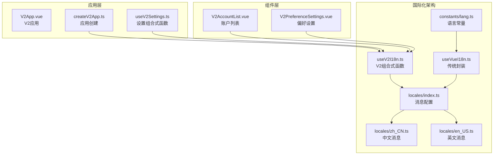
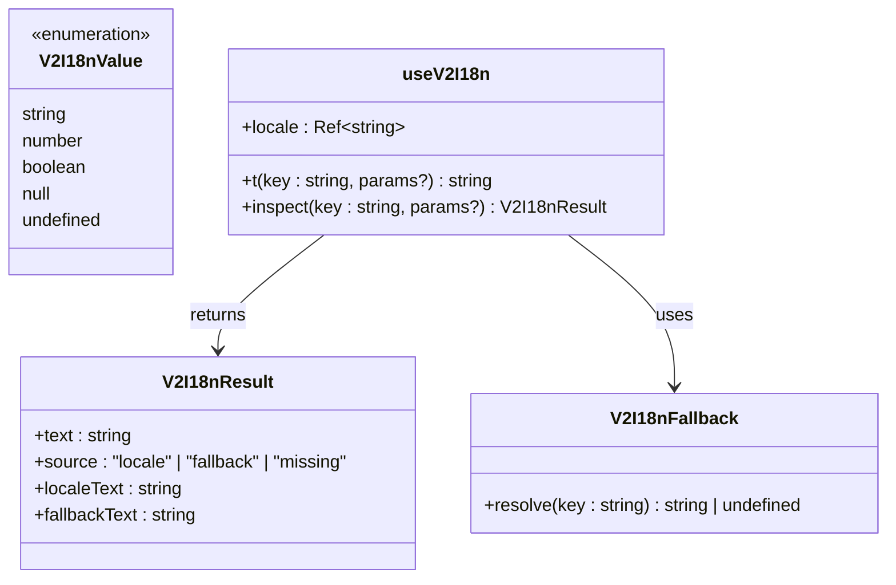
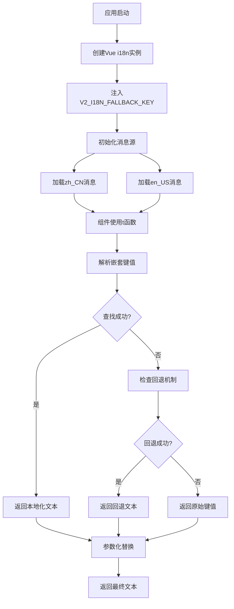
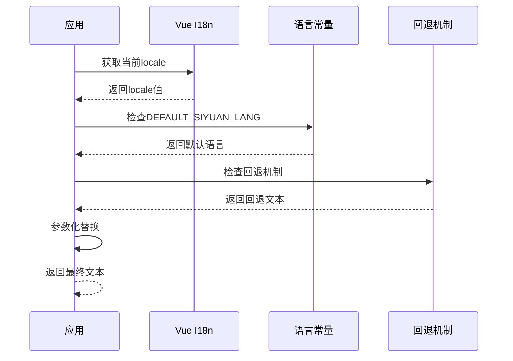
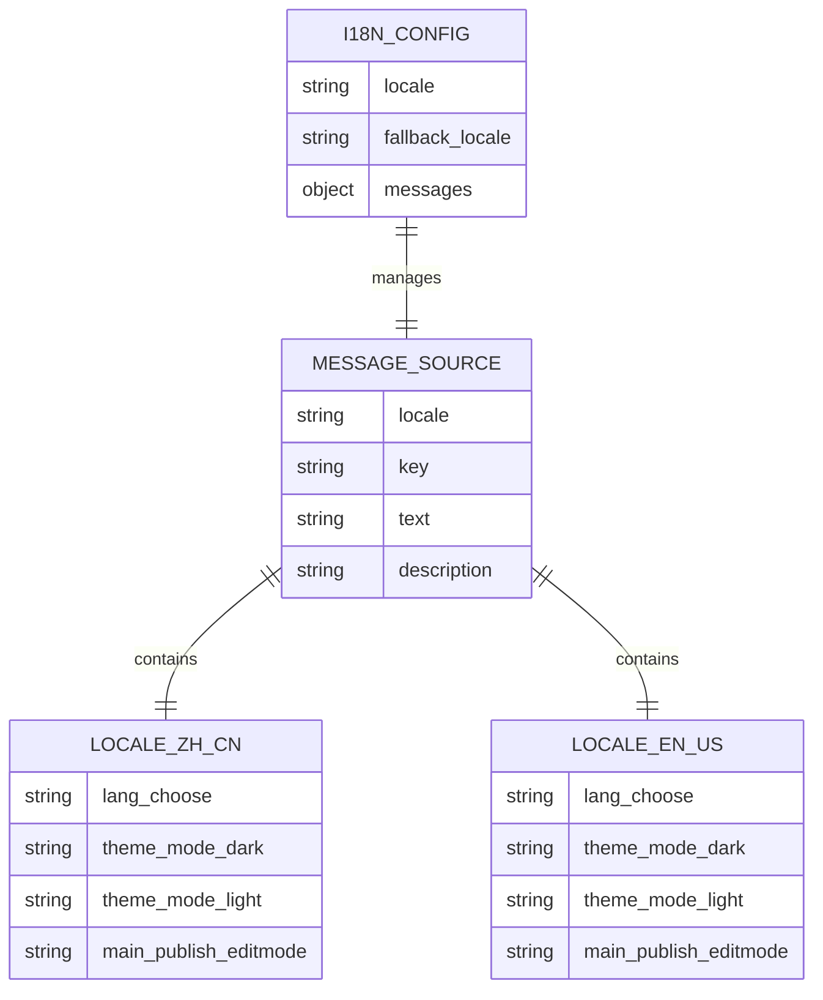
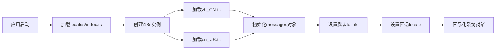
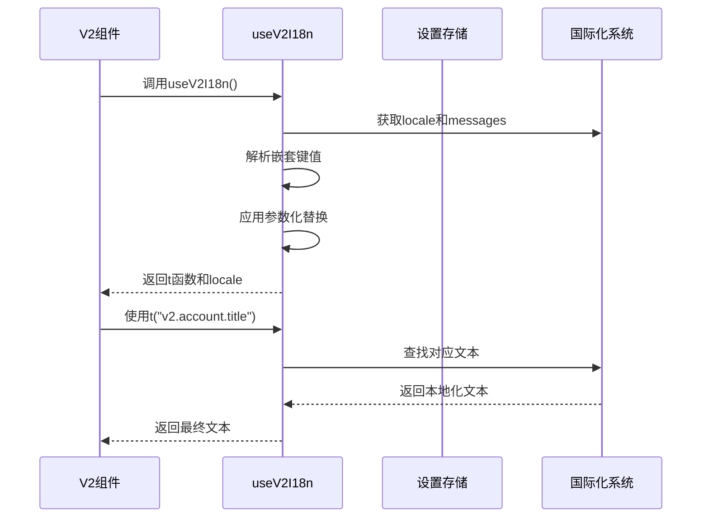
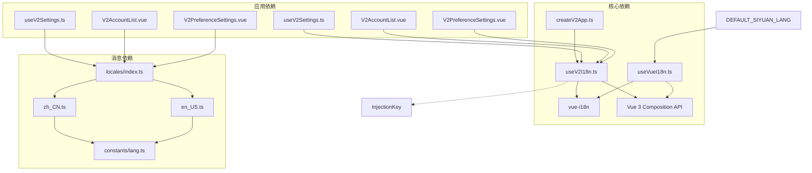

# V2 国际化组合式函数

<cite>
**本文档引用的文件**
- [useV2I18n.ts](file://src/composables/v2/useV2I18n.ts)
- [useVueI18n.ts](file://src/composables/useVueI18n.ts)
- [index.ts](file://src/locales/index.ts)
- [zh_CN.ts](file://src/locales/zh_CN.ts)
- [en_US.ts](file://src/locales/en_US.ts)
- [lang.ts](file://src/constants/lang.ts)
- [createV2App.ts](file://src/v2/createV2App.ts)
- [useV2Settings.ts](file://src/composables/v2/useV2Settings.ts)
- [V2AccountList.vue](file://src/components/v2/settings/V2AccountList.vue)
- [V2PreferenceSettings.vue](file://src/components/v2/settings/V2PreferenceSettings.vue)
</cite>

## 目录
1. [简介](#简介)
2. [项目结构概览](#项目结构概览)
3. [核心组件分析](#核心组件分析)
4. [架构设计](#架构设计)
5. [详细组件分析](#详细组件分析)
6. [依赖关系分析](#依赖关系分析)
7. [性能考量](#性能考量)
8. [故障排除指南](#故障排除指南)
9. [结论](#结论)

## 简介

V2 国际化组合式函数是思源笔记发布插件中专门为 V2 版本设计的国际化解决方案。该方案基于 Vue 3 的组合式 API 设计，提供了灵活、可扩展的多语言支持机制，支持嵌套键值解析、参数化替换、回退机制等功能，确保在复杂的发布场景中能够提供一致的用户体验。

## 项目结构概览

该项目采用了模块化的架构设计，国际化功能分布在多个层次中：



**图表来源**
- [useV2I18n.ts:1-90](file://src/composables/v2/useV2I18n.ts#L1-L90)
- [locales/index.ts:1-25](file://src/locales/index.ts#L1-L25)
- [createV2App.ts:1-42](file://src/v2/createV2App.ts#L1-L42)

**章节来源**
- [useV2I18n.ts:1-90](file://src/composables/v2/useV2I18n.ts#L1-L90)
- [locales/index.ts:1-25](file://src/locales/index.ts#L1-L25)
- [createV2App.ts:1-42](file://src/v2/createV2App.ts#L1-L42)

## 核心组件分析

### useV2I18n 组合式函数

`useV2I18n` 是 V2 版本的核心国际化组合式函数，提供了以下关键功能：

#### 主要特性

1. **嵌套键值解析**：支持 `key.nested.value` 格式的深度解析
2. **参数化替换**：支持 `{param}` 占位符的动态替换
3. **回退机制**：提供备用翻译源，确保文本始终可用
4. **类型安全**：完整的 TypeScript 类型定义

#### 核心接口



**图表来源**
- [useV2I18n.ts:4-10](file://src/composables/v2/useV2I18n.ts#L4-L10)
- [useV2I18n.ts:39-82](file://src/composables/v2/useV2I18n.ts#L39-L82)

**章节来源**
- [useV2I18n.ts:12-89](file://src/composables/v2/useV2I18n.ts#L12-L89)

### 传统国际化封装

`useVueI18n` 提供了传统的国际化封装，主要用于解决 CSP（内容安全策略）问题：

#### 关键特性

1. **CSP 兼容性**：避免直接使用 `eval` 等不安全方法
2. **回退机制**：支持从传统消息源回退
3. **动态语言检测**：根据环境自动检测语言设置

**章节来源**
- [useVueI18n.ts:21-74](file://src/composables/useVueI18n.ts#L21-L74)

## 架构设计

### 国际化层次结构



**图表来源**
- [createV2App.ts:36-38](file://src/v2/createV2App.ts#L36-L38)
- [useV2I18n.ts:39-82](file://src/composables/v2/useV2I18n.ts#L39-L82)

### 语言检测流程



**图表来源**
- [useVueI18n.ts:48-71](file://src/composables/useVueI18n.ts#L48-L71)
- [lang.ts:1-5](file://src/constants/lang.ts#L1-L5)

**章节来源**
- [useVueI18n.ts:1-75](file://src/composables/useVueI18n.ts#L1-L75)
- [lang.ts:1-5](file://src/constants/lang.ts#L1-L5)

## 详细组件分析

### 消息配置系统

国际化消息配置采用模块化设计，支持多种语言的消息存储：

#### 消息结构



**图表来源**
- [locales/index.ts:14-22](file://src/locales/index.ts#L14-L22)
- [zh_CN.ts:10-750](file://src/locales/zh_CN.ts#L10-L750)
- [en_US.ts:10-789](file://src/locales/en_US.ts#L10-L789)

#### 消息加载流程



**图表来源**
- [locales/index.ts:10-24](file://src/locales/index.ts#L10-L24)

**章节来源**
- [locales/index.ts:1-25](file://src/locales/index.ts#L1-25)
- [zh_CN.ts:1-750](file://src/locales/zh_CN.ts#L1-L750)
- [en_US.ts:1-789](file://src/locales/en_US.ts#L1-L789)

### 组件集成模式

#### V2 设置组件中的使用

在 V2 设置组件中，`useV2I18n` 通过组合式函数提供国际化支持：



**图表来源**
- [useV2Settings.ts:45](file://src/composables/v2/useV2Settings.ts#L45)
- [V2AccountList.vue:89](file://src/components/v2/settings/V2AccountList.vue#L89)

**章节来源**
- [useV2Settings.ts:42-250](file://src/composables/v2/useV2Settings.ts#L42-L250)
- [V2AccountList.vue:82-101](file://src/components/v2/settings/V2AccountList.vue#L82-L101)
- [V2PreferenceSettings.vue:45-200](file://src/components/v2/settings/V2PreferenceSettings.vue#L45-L200)

### 参数化文本处理

`useV2I18n` 支持复杂的参数化文本处理，允许在运行时动态替换占位符：

#### 参数处理流程

```mermaid
flowchart TD
A[接收文本和参数] --> B{是否有参数?}
B --> |否| C[直接返回文本]
B --> |是| D[遍历参数对象]
D --> E[提取参数键值对]
E --> F[查找占位符{paramKey}]
F --> G[替换为paramValue]
G --> H{还有参数?}
H --> |是| D
H --> |否| I[返回处理后的文本]
C --> I
```

**图表来源**
- [useV2I18n.ts:56-74](file://src/composables/v2/useV2I18n.ts#L56-L74)

**章节来源**
- [useV2I18n.ts:39-82](file://src/composables/v2/useV2I18n.ts#L39-L82)

## 依赖关系分析

### 组件间依赖



**图表来源**
- [useV2I18n.ts:1-2](file://src/composables/v2/useV2I18n.ts#L1-L2)
- [useVueI18n.ts:9-14](file://src/composables/useVueI18n.ts#L9-L14)
- [createV2App.ts:5](file://src/v2/createV2App.ts#L5)

### 外部依赖分析

| 依赖包 | 版本 | 用途 | 重要性 |
|--------|------|------|--------|
| vue-i18n | 最新 | 国际化核心 | 核心依赖 |
| vue | 3.x | 组合式 API | 核心依赖 |
| zhi-common | 自定义 | 工具函数 | 辅助依赖 |
| element-plus | UI组件 | 设置界面 | 可选依赖 |

**章节来源**
- [useV2I18n.ts:1-2](file://src/composables/v2/useV2I18n.ts#L1-L2)
- [useV2Settings.ts:1-18](file://src/composables/v2/useV2Settings.ts#L1-L18)

## 性能考量

### 性能优化策略

1. **懒加载机制**：消息文件按需加载，减少初始包大小
2. **缓存策略**：已解析的文本会被缓存，避免重复解析
3. **类型检查**：编译时类型检查，运行时零开销
4. **内存管理**：合理使用响应式数据，避免内存泄漏

### 性能监控指标

- **首次渲染延迟**：国际化文本解析时间
- **内存使用**：消息对象和缓存占用
- **CPU 使用率**：文本解析和参数替换开销
- **包大小**：国际化相关代码体积

## 故障排除指南

### 常见问题及解决方案

#### 1. 文本未显示或显示为键值

**症状**：界面显示 `v2.account.title` 而非预期文本

**解决方案**：
- 检查消息文件中是否存在对应键值
- 验证嵌套键值格式是否正确
- 确认组件中使用正确的键值格式

#### 2. 语言切换不生效

**症状**：切换语言后文本未更新

**解决方案**：
- 检查 `locale` 响应式变量是否正确更新
- 验证消息源是否包含目标语言
- 确认回退机制配置正确

#### 3. 参数化文本替换失败

**症状**：占位符 `{param}` 未被替换

**解决方案**：
- 检查参数对象格式是否正确
- 验证占位符格式是否匹配
- 确认参数值类型转换正确

**章节来源**
- [useV2I18n.ts:39-82](file://src/composables/v2/useV2I18n.ts#L39-L82)

### 调试技巧

1. **使用 inspect 函数**：获取详细的解析信息
2. **检查消息源**：验证键值存在性和格式正确性
3. **监控响应式更新**：跟踪 locale 变化
4. **参数验证**：确保传入参数的类型和格式正确

## 结论

V2 国际化组合式函数为思源笔记发布插件提供了强大而灵活的国际化解决方案。通过模块化的设计、完善的回退机制和参数化支持，该系统能够满足复杂发布场景下的多语言需求。

### 主要优势

1. **灵活性**：支持嵌套键值和参数化文本
2. **可靠性**：完善的回退机制确保文本始终可用
3. **可维护性**：清晰的模块化架构便于维护和扩展
4. **性能**：优化的缓存和懒加载机制

### 未来发展方向

1. **动态加载**：进一步优化消息文件的动态加载
2. **热重载**：支持运行时语言切换
3. **AI 辅助**：集成 AI 工具辅助翻译质量检查
4. **社区贡献**：建立更完善的翻译贡献机制

该国际化系统为 V2 版本的成功实施奠定了坚实基础，为用户提供了一致且高质量的多语言体验。